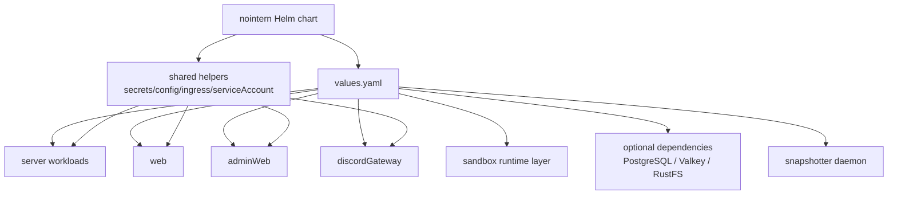

# NoIntern Helm Packaging Design

## Background and Problem Definition

NoIntern production Kubernetes deployment is currently centered on ArgoCD app-of-apps and Kustomize overlays. This structure fits the current operating environment, but has high entry barrier for these purposes:

- Need an install unit to validate OSS deployment possibility.
- Need to install on a home cluster and use it as a non-production test zone.
- Need to provide installation UX familiar to Kubernetes users through Helm packaging.

Based on GitHub Issue #3594 and Discussion #3608, this design assumes direction: **provide one chart, but structure internals as componentized umbrella-style single chart**.

## Goals

- Make NoIntern installable as one Helm chart.
- Default install should be service-runtime profile where core NoIntern user flow actually works, not merely minimal installation-barrier profile.
- Reflect component boundaries already separated in production in internal chart values structure.
- Separate production-only coupling such as AWS/EKS, ALB, ExternalSecrets, ECR into values and optional features.
- Include sandbox in default install as agent execution/runtime core, while keeping advanced prerequisite-heavy optimization components like snapshotter explicit opt-in.
- Leave compatibility path for existing ArgoCD operating model to transition toward consuming Helm chart.

## Non-goals

- This design alone does not declare NoIntern complete public OSS product.
- Do not immediately remove production Kustomize deployment.
- Do not redesign application code configuration model. However, identify environment variable/Secret/ConfigMap surface required for chart value injection.
- Do not automatically install sandbox/gVisor/snapshotter so it works in every home cluster.
- Do not complete transition of production managed dependencies in this design. Chart provides both bundled dependencies for home cluster convenience and external dependency connection for production.

## Discussion Points and Decisions

### 1. Component boundary inside a single chart

**Decision**: Provide single Helm chart `nointern`, but internally split into componentized umbrella-style structure.

- `server`: `apiserver`, `adminserver`, `worker`, `scheduler`, `sandbox-control`, `mcp-egress-proxy`
- `web`: end-user web frontend
- `adminWeb`: admin frontend
- `sandbox`: runtime layer such as namespace, RuntimeClass, NetworkPolicy, RBAC
- `snapshotter`: privileged DaemonSet based snapshot infra
- `discordGateway`: Discord integration gateway

This preserves current production ArgoCD Application boundary and workload separation in values structure while keeping “one chart” installation UX.

### 2. Default install scope

**Decision**: Default install is service-runtime profile that people can actually use after install, not text-only profile that only minimizes install barrier.

Default-on:

- `server.apiserver`
- `server.adminserver`
- `server.worker`
- `server.scheduler`
- `server.sandboxControl`
- `web`
- `adminWeb`
- `sandbox`

Default-off:

- `snapshotter`
- `mcpEgressProxy`
- `discordGateway`
- production-only resources such as AWS/EKS/ALB and ExternalSecret resources to convert to opt-in in Helm target state

Rationale is current default user flow. Workspace creation creates default `ShellEnvironment`, and normal Agent creation automatically attaches default shell environment. Worker exposes sandbox tool when `agent.shell_environment_id is not None`, so default install without sandbox becomes degraded mode where shell/file/project workspace does not work. Also LLM model/provider catalog management currently goes through admin API and admin web path, so human operation of fresh install needs `adminserver` and `adminWeb`.

### 3. Secret / Config strategy

**Decision**: Default secret strategy is `existingSecret`.

- User creates Kubernetes Secret ahead of time.
- Chart references only Secret name/key.
- `externalSecret` is provided as opt-in for production compatibility.
- Mode that directly creates Kubernetes Secret from values literal is excluded from default scope.

This decision avoids cloud/vendor dependency in both home cluster and production, and prevents secret literals from remaining in GitOps values.

### 4. External dependency bundling

**Decision**: Bundle PostgreSQL, Redis/Valkey, RustFS as optional dependencies for home cluster install convenience. In production/managed environment, disable bundled dependencies and connect through external endpoints plus `existingSecret`.

- PostgreSQL: optional dependency
- Redis/Valkey: optional dependency
- S3-compatible object storage: **RustFS** optional dependency
- MinIO: not used. Excluded from project default option because of license change issue.

Current repo local/test infrastructure also uses RustFS, so bundled object storage is designed around RustFS.

### 5. Advanced component scope

**Decision**: Include `snapshotter`, `mcpEgressProxy`, `discordGateway` in chart templates but keep default-off.

- `snapshotter`: opt-in because it requires privileged DaemonSet, containerd socket, node label/selector, registry auth
- `mcpEgressProxy`: opt-in because it is MCP egress hardening feature
- `discordGateway`: opt-in because it is named integration requiring Discord app/secret
- production-only resources like EKS Pod Identity and ALB annotations, plus ExternalSecret resources to convert to opt-in in Helm target state, are also opt-in

`sandbox` is treated as default-on runtime core, not advanced component.

## Current State

### ArgoCD app boundaries

Current app-of-apps root deploys NoIntern as multiple ArgoCD Applications.

- `infra/argocd/root/base/kustomization.yaml`
- `infra/argocd/root/base/resources/nointern-server.yaml`
- `infra/argocd/root/base/resources/nointern-web.yaml`
- `infra/argocd/root/base/resources/nointern-admin-web.yaml`
- `infra/argocd/root/base/resources/nointern-discord-gateway.yaml`
- `infra/argocd/root/base/resources/nointern-sandbox.yaml`
- `infra/argocd/root/base/resources/nointern-snapshotter.yaml`

### Current resources by component

| Component | Current path | Nature |
|---|---|---|
| `server` | `infra/argocd/nointern-server/base/` | backend workload bundle containing `apiserver`, `adminserver`, `worker`, `scheduler`, `sandbox-control`, `mcp-egress-proxy` |
| `web` | `infra/argocd/nointern-web/base/` | end-user web frontend |
| `adminWeb` | `infra/argocd/nointern-admin-web/base/` | admin frontend |
| `discordGateway` | `infra/argocd/nointern-discord-gateway/base/` | Discord integration gateway |
| `sandbox` | `infra/argocd/nointern-sandbox/base/` | runtime layer such as sandbox namespace, NetworkPolicy, RuntimeClass, RBAC |
| `snapshotter` | `infra/argocd/nointern-snapshotter/base/` | privileged DaemonSet based snapshot infra component |

### Production overlay coupling

Production overlay has following coupling.

- Image registry/tag is coupled to component-specific ECR path and production tag.
  - `infra/argocd/nointern-server/overlays/production/kustomization.yaml`
  - `infra/argocd/nointern-web/overlays/production/kustomization.yaml`
  - `infra/argocd/nointern-admin-web/overlays/production/kustomization.yaml`
  - `infra/argocd/nointern-discord-gateway/overlays/production/kustomization.yaml`
  - `infra/argocd/nointern-snapshotter/overlays/production/kustomization.yaml`
- Ingress assumes ALB, ACM, external-dns, production host.
  - `infra/argocd/nointern-server/overlays/production/base/resources/apiserver-ingress.yaml`
  - `infra/argocd/nointern-web/overlays/production/base/resources/ingress.yaml`
  - `infra/argocd/nointern-admin-web/overlays/production/base/resources/ingress.yaml`
- Secret is currently ExternalSecret-first from base manifests, and production overlay fills AWS Parameter Store remote key.
  - `infra/argocd/nointern-server/base/kustomization.yaml`
  - `infra/argocd/nointern-web/base/kustomization.yaml`
  - `infra/argocd/nointern-sandbox/base/kustomization.yaml`
  - `infra/argocd/nointern-server/overlays/production/base/patches/auth-external-secret.yaml`
  - `infra/argocd/nointern-server/overlays/production/base/patches/internal-api-hmac-external-secret.yaml`
  - `infra/argocd/nointern-web/overlays/production/base/patches/sentry-external-secret.yaml`
  - `infra/argocd/nointern-admin-web/overlays/production/base/resources/external-secret.yaml`
  - `infra/argocd/nointern-discord-gateway/base/external-secret.yaml`
- AWS/EKS-specific resources exist.
  - `infra/argocd/nointern-server/overlays/production/base/resources/role.yaml`
  - `infra/argocd/nointern-server/overlays/production/base/resources/pod-identity-association.yaml`
  - `infra/argocd/nointern-snapshotter/overlays/production/resources/role.yaml`
  - `infra/argocd/nointern-snapshotter/overlays/production/resources/pod-identity-association.yaml`
- Namespaces are also separated by component.
  - `infra/argocd/root/base/resources/nointern-server.yaml`: `nointern-server`
  - `infra/argocd/root/base/resources/nointern-sandbox.yaml`: `nointern-sandbox`
  - sandbox NetworkPolicy in `nointern-sandbox` allows egress to `apiserver` and `sandbox-control` in `nointern-server` namespace.

## Target State

### Chart distribution form

Provide single chart `nointern`. Inside chart, use component-specific template partials and values namespace.



### Default profile

First default install enables following components based on “NoIntern is actually usable after install”.

| Component | Default | Reason |
|---|---:|---|
| `server` | enabled | API/admin API/worker/scheduler/sandbox-control are central to NoIntern core behavior |
| `web` | enabled | default UI for user access after install |
| `adminWeb` | enabled | default UI for initial operational settings such as LLM model/provider model |
| `discordGateway` | disabled | requires external Discord app/secret |
| `mcpEgressProxy` | disabled or server-internal opt-in | external egress policy and operational needs are separate |
| `sandbox` | enabled | required runtime layer for normal Agent shell/file/project workspace path |
| `snapshotter` | disabled | large prerequisites: privileged DaemonSet, containerd socket, node label |

`mcpEgressProxy` is currently included in `nointern-server` deployment bundle, but chart first reviews exposing it as server sub-feature gate such as `server.mcpEgressProxy.enabled`. Whether separate top-level component is more appropriate needs checking current service discovery and call path before implementation.

### Profile model

Chart does not force profile names as magic behavior. Chart repository also does not own consumer-environment-specific values files.

- `values.yaml`: safe defaults. Centered on `server`, `web`, `adminWeb`, `sandbox`; does not directly include secret values.
- Consumer-specific values such as home cluster and production ArgoCD are owned by each use site.
- `values-advanced-sandbox.yaml`: chart-owned advanced example explaining sandbox runtime tuning and prerequisites needed to enable `snapshotter`.

## User-visible behavior

### Helm user

- User installs one chart.
- Minimal install creates `server`, `web`, `adminWeb`, `sandbox` runtime layer.
- Secret values are not directly put in values; default references existing Kubernetes Secret names.
- ingress is default disabled and created only when user configures host/class/TLS.
- If optional component is not enabled, corresponding Deployment/DaemonSet/RBAC/Ingress/ExternalSecret is not created.
- If prerequisite-heavy component is enabled, chart values and notes should explicitly show required conditions.

### ArgoCD user

- Existing production deployment can keep Kustomize for now.
- Once Helm chart is ready, ArgoCD Application can verify in parallel by referencing chart path and `valuesObject` or values file.
- Repo already has precedents for ArgoCD consuming Helm chart.
  - `infra/argocd/azents-temporal-helm/base/resources/helm-application.yaml`
  - `infra/argocd/tailscale-operator/base/resources/helm-application.yaml`
  - `infra/argocd/fluent-bit/base/resources/helm-application.yaml`

## Major Design

### Chart location and name

New chart is infra code and lives under `infra/charts/nointern/`.

Expected structure:

```text
infra/charts/nointern/
  Chart.yaml
  Chart.lock
  values.yaml
  values-advanced-sandbox.yaml
  values.schema.json
  charts/
    # optional packaged dependencies
  templates/
    _helpers.tpl
    NOTES.txt
    server/
    web/
    admin-web/
    discord-gateway/
    sandbox/
    snapshotter/
```

File split can be adjusted during implementation plan phase according to existing infra convention and Helm lint requirements.

### Values namespace

Values are split by component top-level namespace and shared namespace.

```yaml
global:
  imagePullSecrets: []
  podLabels: {}
  podAnnotations: {}
  serviceAccount:
    create: true

secrets:
  mode: existingSecret
  existingSecrets:
    auth: null
    internalApiHmac: null
    database: null
    redis: null
    objectStorage: null
    adminAuth: null
  externalSecrets:
    enabled: false
    secretStoreRef: null

dependencies:
  postgresql:
    enabled: true
  redis:
    enabled: true
  rustfs:
    enabled: true

ingress:
  enabled: false
  className: null
  annotations: {}
  tls: []

server:
  enabled: true
  image:
    repository: null
    tag: null
    pullPolicy: IfNotPresent
  apiserver:
    enabled: true
  adminserver:
    enabled: true
  worker:
    enabled: true
  scheduler:
    enabled: true
  sandboxControl:
    enabled: true
  mcpEgressProxy:
    enabled: false

web:
  enabled: true
  image:
    repository: null
    tag: null

adminWeb:
  enabled: true

discordGateway:
  enabled: false

sandbox:
  enabled: true
  runtimeClass:
    create: false
    name: null

snapshotter:
  enabled: false
```

This structure is design draft. During implementation, required values and mutually exclusive settings are validated with Helm schema (`values.schema.json`).

### Image settings

- Each component independently has `image.repository`, `image.tag`, `image.pullPolicy`.
- ECR path is not chart default. It is specified in values owned by production consumer.
- OSS/home cluster install example must assume public registry or user-specified registry. If public registry does not exist yet, leave as open question.
- `tag` should not create arbitrary chart default. Release packaging needs decide how chart appVersion and image tag connect.

### Secret strategy

First default strategy is `existingSecret` reference.

- Chart does not include secret values in default values.
- `managedSecret` mode where chart creates secret is excluded from first scope.
- ExternalSecret creation mode is optional for production compatibility.
- `secrets.mode` is restricted to one of:
  - `existingSecret`: reference Kubernetes Secret created by user
  - `externalSecret`: create ExternalSecret in cluster with External Secrets Operator installed

Secret key names must match existing Deployment env wiring. Before implementation, organize key mapping using `infra/argocd/nointern-server/overlays/production/base/patches/deployment-secrets.yaml` as source of truth.

This strategy is normalization direction for Helm target state. Current Kustomize base is ExternalSecret-first, so when writing chart, do not move existing ExternalSecret resources as default. Reconstruct default based on `existingSecret` env wiring.

### Config and dependency

Chart provides optional bundled dependencies for home cluster convenience while same application template must connect to external dependencies too.

| Area | Chart input | First default policy |
|---|---|---|
| PostgreSQL | bundled dependency or host/port/database/user/password secret ref | home cluster bundled, production external |
| Redis/Valkey | bundled dependency or host/port/password secret ref/URL secret ref | home cluster bundled, production external |
| Object storage | bundled RustFS or endpoint/bucket/region/access key secret ref | home cluster RustFS, production external S3-compatible storage |
| Auth/session secrets | existing Secret ref | user-provided |
| OAuth/provider secrets | existing Secret ref | user-provided only for needed features |
| Sentry | optional secret ref | must be disableable |
| Discord | optional secret ref | required only when `discordGateway.enabled=true` |

Dependency mode is separated as follows.

```yaml
dependencies:
  postgresql:
    enabled: true
  redis:
    enabled: true
  rustfs:
    enabled: true

database:
  mode: bundled # bundled | external
  external:
    host: null
    port: 5432
    name: nointern
    existingSecret: null

redis:
  mode: bundled # bundled | external
  external:
    existingSecret: null

objectStorage:
  mode: bundled # bundled | external
  rustfs:
    enabled: true
  external:
    endpoint: null
    bucket: null
    credentialMode: existingSecret # existingSecret | ambientAws
    existingSecret: null
```

Bundled object storage supports only RustFS. MinIO is not included as default option because of license change issue. If RustFS chart dependency is not stably available as public Helm chart, implementation should first consider providing RustFS Deployment/Service/PVC/init Job as internal templates in nointern chart.

external object storage mode must support two credential paths.

- `existingSecret`: connect to RustFS or S3-compatible storage with explicit access key/secret key.
- `ambientAws`: use ambient AWS session from Pod Identity/IAM Role like production, leaving `endpoint_url` and explicit credential empty.

### Ingress and host

- Ingress is created per component while inheriting shared defaults.
- Host/path/TLS must be overrideable per component, such as `server.apiserver.ingress`, `web.ingress`, `adminWeb.ingress`.
- ALB annotations are not chart defaults. Production consumer specifies them in owned values.
- Home cluster example keeps annotation-free default to support general ingress classes like nginx/traefik.
- TLS defaults to user specifying Secret via `ingress.tls` or component-specific `tls`.

### RBAC, ServiceAccount, permission

- `server`, `web`, `adminWeb`, `discordGateway` first use namespace-scoped ServiceAccount and Role/RoleBinding.
- `sandbox` and `snapshotter` may require cluster/runtime resources, so each creates RBAC under separate enable flag. However, `sandbox` is included in default service-runtime profile.
- EKS Pod Identity related resources are separated as production-only optional block. Not created in home cluster defaults.

### Namespace and sandbox-server contract

Current production deployment places `nointern-server` and `nointern-sandbox` in separate namespaces. Before implementation, Helm chart must explicitly choose one of following.

1. **Keep multi-namespace**: closer to current production structure. Chart receives `server.namespace`, `sandbox.namespace` and must correctly render sandbox NetworkPolicy namespace selector and cross-namespace service address.
2. **Simplify to single namespace**: easier home cluster install. But less production parity and requires re-review of sandbox isolation model.

Default direction of this design is keeping multi-namespace for production parity. Therefore chart must state following contract.

- sandbox Pod preStop hook must be able to call `apiserver` internal endpoint.
- sandbox control client must be able to open outbound gRPC stream to `sandbox-control` service.
- `nointern-server` and `nointern-sandbox` must share same `internal-api-hmac` value.
- If NetworkPolicy is enabled, `nointern-sandbox` → `nointern-server` egress rule must render together.

### Sandbox and snapshotter

Both `sandbox` and `snapshotter` are included in single chart. `sandbox` is default on because it is runtime core required for normal Agent shell/file/project workspace execution path. `snapshotter` is default off because it is rootfs snapshot/fast restore optimization layer.

Prerequisites when `sandbox.enabled=true`:

- gVisor or compatible RuntimeClass must exist in cluster or chart must be able to create it.
- If sandbox namespace and NetworkPolicy are created, cluster CNI must enforce NetworkPolicy.
- If sandbox node separation is needed, nodeSelector/tolerations/affinity must be provided through values.

Prerequisites when `snapshotter.enabled=true`:

- privileged DaemonSet allowed
- containerd socket hostPath access allowed
- snapshotter target node label/selector
- object storage or registry credential setting
- cloud-specific permission connection such as EKS Pod Identity in production

These components are included in chart, but `NOTES.txt` and schema validation must reveal missing prerequisites. In particular, default-enabled `sandbox` must clearly show RuntimeClass/NetworkPolicy/node scheduling assumptions. However, Helm schema cannot validate cluster runtime capability, so operational runbook or preflight script may be needed as follow-up.

## Operational prerequisite

### Core install prerequisite

- Kubernetes cluster
- Helm 3
- Registry access that can pull NoIntern component images
- PostgreSQL-compatible database or bundled PostgreSQL dependency
- Redis/Valkey-compatible cache/queue endpoint or bundled Redis/Valkey dependency
- S3-compatible object storage endpoint or bundled RustFS dependency
- Auth/session/internal API secrets required by NoIntern
- Cluster networking that allows sandbox-control and sandbox runtime layer to communicate
- RuntimeClass or compatible runtime setting required for sandbox execution
- Optional: Ingress controller, TLS Secret

### Advanced prerequisite

- External Secrets Operator: when using `secrets.mode=externalSecret`
- External PostgreSQL/Redis/Object storage: when using production/managed mode disabling bundled dependencies
- Ambient AWS credential: Pod Identity/IAM Role connection required when using `objectStorage.external.credentialMode=ambientAws`
- EKS Pod Identity or cloud IAM integration: when using production AWS mode
- Advanced sandbox separation: when using separate sandbox node, nodeSelector/toleration, hardened NetworkPolicy policy
- Privileged workload permission and containerd socket access: when `snapshotter.enabled=true`

## Migration and rollout

### Step 1: chart authoring and home cluster verification

- Write `infra/charts/nointern/` chart using Kustomize manifest as source reference.
- Default install `server + web + adminWeb + sandbox + bundled PostgreSQL/Redis/RustFS` must render and pass Helm lint.
- Verify actual install or dry-run with home cluster example values.

### Step 2: optional component parity

- Add `discordGateway`, `mcpEgressProxy` as opt-in.
- Verify ExternalSecret mode and component-specific ingress override.
- Confirm bundled-dependency-off + external-endpoint mode with temporary verification values combination.

### Step 3: advanced component

- Add `snapshotter` as opt-in.
- Document sandbox runtime tuning and snapshotter privileged prerequisites, and compare resource parity with production Kustomize.

### Step 4: production ArgoCD parallel verification

- Without removing existing Kustomize Application, compare Helm chart rendering in separate ArgoCD Application or staging namespace.
- Decide production cutover with separate ADR or design.

## Failure modes and responses

| Failure mode | Expected cause | Chart design response |
|---|---|---|
| Pod CrashLoop due to missing secret key | unclear existing Secret key contract | state required keys in values schema, README, NOTES |
| image pull failure | fixed ECR/private registry or missing pull secret | require image repository/tag, expose imagePullSecrets |
| ingress created but inaccessible | ingress class/host/TLS environment difference | ingress default disabled, values for class/annotations/TLS |
| dependency chart conflicts with production requirement | bundled DB/Redis/RustFS incorrectly used in production | separate dependency enable flag and external mode |
| sandbox cannot access server | namespace selector, NetworkPolicy, internal HMAC Secret mismatch | specify multi-namespace contract and shared secret key contract in values/schema/NOTES |
| sandbox isolation expectation differs from reality | CNI without NetworkPolicy support or missing RuntimeClass | sandbox default on, prerequisites documented, preflight follow-up |
| snapshotter DaemonSet Pending/CrashLoop | missing privileged/hostPath/nodeSelector prerequisites | snapshotter default off, consider making nodeSelector/toleration required |
| production parity drift | Kustomize and Helm template managed in parallel | include source path traceability and render diff verification in acceptance criteria |

## Acceptance criteria

- Single Helm chart exists at `infra/charts/nointern/`.
- Default `helm template` output includes service-runtime install centered on `server`, `web`, `adminWeb`, `sandbox`.
- chart values contract can enable PostgreSQL, Redis/Valkey, RustFS dependencies.
- Default values create `adminWeb`, `sandbox`, `server.sandboxControl` resources.
- Default values do not create `discordGateway`, `snapshotter`, `mcpEgressProxy` resources.
- chart receives component-specific image repository/tag through values and does not fix ECR path as default.
- chart does not include secret values in default values and provides only `existingSecret` or `externalSecret` reference method.
- chart supports bundled RustFS and does not use MinIO as dependency.
- ingress is default disabled, and when enabled supports component-specific host/class/TLS override.
- `sandbox` is rendered as default-on runtime layer and prerequisites are documented.
- `snapshotter` can render opt-in inside single chart, and prerequisites are documented.
- `helm lint` and `helm template` pass for default values and chart-owned advanced example values.
- PR description records render or dry-run verification result for dependency-enabled values combination.
- Correspondence between existing production Kustomize source path and Helm template remains in document or chart README.

## Unresolved Decisions and User Confirmation Needed

1. **Public image registry**: Need decide where OSS/home cluster users pull images from. Current production ECR cannot be default.
2. **RustFS packaging method**: Need confirm before implementation whether to use public RustFS Helm chart as dependency or provide RustFS resources through nointern chart internal template.
3. **Sandbox prerequisite fail-fast**: Since default install includes `sandbox`, need decide how much RuntimeClass/NetworkPolicy/node scheduling assumptions are validated fail-fast through Helm schema, NOTES, preflight.
4. **`mcpEgressProxy` location**: Need check call path before implementation and decide whether to keep as server sub opt-in or promote to top-level component.
5. **Secret key contract**: Need decide whether to fix existing Secret names and keys according to production env wiring, or convert to chart-specific normalized keys.
6. **Production cutover goal**: Need confirm scope: only home cluster packaging, or production ArgoCD conversion to Helm too.
7. **Helm release strategy**: Need decide which release pipeline syncs chart version, appVersion, image tag.
8. **Preflight delivery method**: Need decide whether sandbox/snapshotter prerequisite verification stays in Helm schema/NOTES docs only or is provided as separate script.

## Feasibility Verification

| Verification item | Result | Basis |
|---|---|---|
| Single chart internal componentization possibility | possible | current ArgoCD root already separates boundaries as `nointern-server`, `nointern-web`, `nointern-admin-web`, `nointern-discord-gateway`, `nointern-sandbox`, `nointern-snapshotter` |
| `server` multi-workload bundle | possible | `infra/argocd/nointern-server/base/kustomization.yaml` bundles `apiserver`, `adminserver`, `worker`, `scheduler`, `sandbox-control`, `mcp-egress-proxy` into one application |
| Need `adminWeb` default-on | needed | LLM model/provider model catalog is operated through admin API and admin web path |
| Need `sandbox` default-on | needed | workspace/agent default creation flow attaches shell environment, and worker determines sandbox tool exposure with this value |
| `snapshotter` default-off possibility | possible | default snapshot backend is `none`, and snapshotter is rootfs snapshot/fast restore optimization layer |
| `existingSecret` default strategy | possible | production Kustomize also injects Secret key to Deployment env, so Helm values can map Secret name/key contract |
| bundled dependency | possible, implementation check needed | repo local/testenv infra uses PostgreSQL, Valkey, RustFS. RustFS public chart dependency needs implementation-stage check |
| MinIO exclusion | possible | current repo uses RustFS as S3-compatible local/testenv storage, and MinIO remains only at client image/compatible endpoint level |
| multi-namespace sandbox contract | possible, implementation care needed | current `nointern-sandbox` NetworkPolicy allows egress to `apiserver`/`sandbox-control` in `nointern-server` namespace, and both namespaces share `internal-api-hmac` Secret |
| ambient AWS S3 credential | possible, production opt-in | production can access S3 through IAM Role/Pod Identity based ambient AWS session with endpoint/credential empty |

### Adjustments after verification

- Discard draft with only `server + web` default-on.
- Include `adminWeb` and `sandbox` in default-on service-runtime profile.
- Discard external-only draft for dependency bundling and switch to optional bundled dependency method.
- Limit bundled object storage dependency to RustFS, not MinIO.
- Normalize current Kustomize ExternalSecret-first structure to `existingSecret` default in Helm target state.
- Keep sandbox default-on after specifying multi-namespace network/secret contract.
- object storage external mode includes both `existingSecret` credential and ambient AWS credential mode.
- Keep `snapshotter`, `mcpEgressProxy`, `discordGateway` included in chart but default-off.

## testenv QA Scenarios

Implementation PR performs following QA.

1. `helm lint infra/charts/nointern`.
2. Run `helm template` with dependency-enabled values combination and confirm `server`, `web`, `adminWeb`, `sandbox`, bundled PostgreSQL/Redis/RustFS resources render.
3. Run with external dependency values combination and confirm bundled dependencies are off and only external endpoint/`existingSecret` references render.
4. Confirm opt-in rendering of `snapshotter`, `mcpEgressProxy`, `discordGateway`, `externalSecret` with advanced values.
5. If possible, perform dry-run/server-side apply in consumer-owned values or kind-like environment. For cluster-capability-dependent items such as RuntimeClass, record preflight/NOTES verification result in PR.

## testenv Impact

- nointern testenv and local compose already use PostgreSQL, Valkey, RustFS, so dependency choice and direction match.
- Helm chart implementation does not change testenv seed/scenario itself.
- Separate Kubernetes rendering verification is added to chart QA.
- RustFS bundled template or dependency must match endpoint/bucket/credential structure used in testenv.

## Related Documents and Reference Paths

- Issue: https://github.com/azents/azents/issues/3594
- Discussion: https://github.com/azents/azents/discussions/3608
- NoIntern architecture spec: `docs/nointern/spec/domain/architecture.md`
- NoIntern design overview: `docs/nointern/design/architecture.md`
- Sandbox runtime: `docs/nointern/design/gvisor-260403-gvisor-byoc-sandbox.md`
- Runtime profile: `docs/nointern/design/sandbox-runtime-profile.md`
- Snapshot hibernation: `docs/nointern/design/phase3-snapshot-hibernation.md`
- Discord integration: `docs/nointern/design/nointern-260310-nointern-discord-integration.md`
