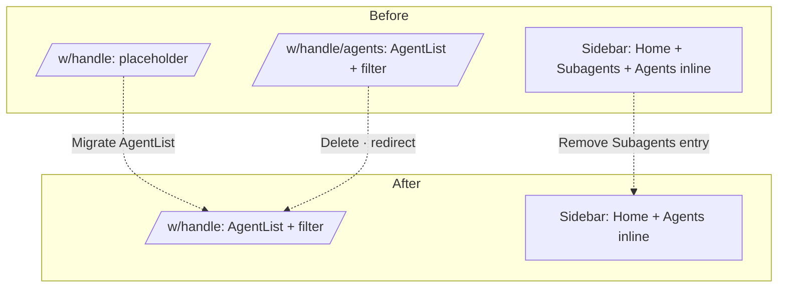

> **Implemented / archived** — implementation PR series #2898 (design), #2899 (impl), #2900 (cleanup).
> This design is a follow-up IA reorganization that converges the separate `/agents` structure from `agent-centric-nav.md` into Home.

# Home-as-agent-list Reorganization

## Overview

Simplify nointern-web workspace IA one more time.

After agent-centric-nav implementation in `#2779`, "agent existence" was spread across 3 places in workspace:

1. Sidebar **Agents** section — primary agent list + inline sessions
2. `/agents` page — full agent card view with SegmentedControl filter (Agents / Subagents / All)
3. Sidebar **Subagents** link — deep link to `/agents?role=subagent`

Updated IA from design team converges these 3 places into **one Home**:

- **Home = agent list** (migrate existing `/agents` UI). URL: `/w/{handle}`.
- Remove `/w/{handle}/agents` route; redirect legacy links to Home.
- Remove sidebar `Subagents` entry — redundant because role filter exists on Home.

Original design URL (`https://api.anthropic.com/v1/design/h/clfqGDcXi0VK7VLvswlJaA`) returned 404 at time of this work. Proceed with only 3 requirements provided by user:

1. Delete `/agents` page
2. Remove sidebar "Subagents" menu
3. Reorganize Home into agent list

## User Scenarios

1. **Enter workspace (`/w/{handle}`)** → immediately show agent card list + Agents/Subagents/All filter
2. **Click card** → `/w/{handle}/agents/{id}/chat` (keep existing agent detail)
3. **New agent** → header `+` button → `/w/{handle}/agents/new` (keep existing route)
4. **Legacy link** `/w/{handle}/agents` or `/w/{handle}/agents?role=subagent` → redirect to Home, preserving query param (`?role=`)

## Architecture

## Change Scope

### Keep

| Path | Status | Note |
|---|---|---|
| `/w/{handle}/agents/new` | keep | create agent |
| `/w/{handle}/agents/{id}/chat/**` | keep | agent chat |
| `/w/{handle}/agents/{id}/settings/**` | keep | agent settings |
| `/w/{handle}/agents/{id}` | keep (redirect to `/chat`) | agent index |
| Sidebar `AgentSidebarSection` | keep | primary agent list + inline sessions |

### Change

| Path / File | Current | After |
|---|---|---|
| `app/(app)/w/[handle]/page.tsx` | render `WorkspaceHome` placeholder | render `AgentListPage` |
| `features/workspace/pages/WorkspaceHome.tsx` | placeholder | **delete** |
| `features/workspace/components/WorkspaceHomeView.tsx` | placeholder | **delete** |
| `app/(app)/w/[handle]/agents/page.tsx` | render `AgentListPage` | **delete and redirect** — Next.js `redirect(/w/{handle}?{preserved searchParams})` |
| `features/workspace/components/WorkspaceSidebar.tsx` | Home / Members / Agents inline / ... / **Subagents** / Toolkits / ... | Home / Members / Agents inline / Toolkits / ... (remove Subagents entry) |
| `messages/*.json` | `workspace.sidebar.subagents` | remove, also remove `workspace.home.placeholder` |

### Behavior Details

- **Reuse `AgentListPage`**: Use existing `features/agents/AgentListPage.tsx` + `AgentList.tsx` + `useAgentListContainer.ts` as-is. Only change import in Home route. Keep role filter URL state (`?role=web|slack|discord|all`).
- **Home redirect timing**: Call Next.js App Router `redirect()` in `/agents/page.tsx` server component state. Preserve `searchParams`.
- **Sidebar Home label**: Keep "Home". UX-wise, Home expands into agent list, but it remains conceptual entry point, so no label change.
- **Remove sidebar Subagents link**: Remove `NavLink`, searchParams-based active check, and `IconRobot` import from `WorkspaceSidebar`.

## Compatibility / Migration

- Existing bookmark `/w/{handle}/agents` → server redirect to Home. Filter query (`?role=subagent`) is passed to Home as-is.
- Verify with `grep` that no external links (docs/screenshots, etc.) hardcode `/agents`.

## Non-functional Requirements

- **Type safety**: Keep existing `AgentListContainerOutput` / `AgentRoleFilter` types.
- **Translation consistency**: Remove i18n keys from all locales (ko/en/ja/fr) at once.
- **No regression**: No behavior change to existing agent detail route / creation route / sidebar inline sessions.

## Ship Phases

- **`[1/3] docs`** — Add only this document (`home-as-agent-list.md`). Do not add "superseded by" note to `agent-centric-nav.md` in this PR (handle implemented/superseded in cleanup PR after implementation completes).
- **`[2/3] impl`** — Apply "Change Scope" above + pass typecheck/lint/format. Small enough that no extra phase split is needed.
- **`[3/3] cleanup`** — Clean up implemented/superseded state of this document and `agent-centric-nav.md`. No new spec / ADR needed (frontend-only IA change).

## Testenv / Spec Impact

- **testenv**: N/A. nointern testenv verifies backend flows — this change is pure FE. Manually verify with Playwright / devtools mobile emulation.
- **spec**: N/A. `docs/nointern/spec/**` `code_paths` are backend-only. FE route change is not spec update target.

## Reviewer Checkpoints

- Whether Home → AgentList migration follows existing container/component separation conventions.
- Whether `/agents` → Home redirect preserves `searchParams` as-is.
- Whether unnecessary imports such as `IconRobot` import / `useSearchParams` usage remain after removing Subagents from sidebar.
- Whether all 4 locale files stay synchronized after translation key removal.
