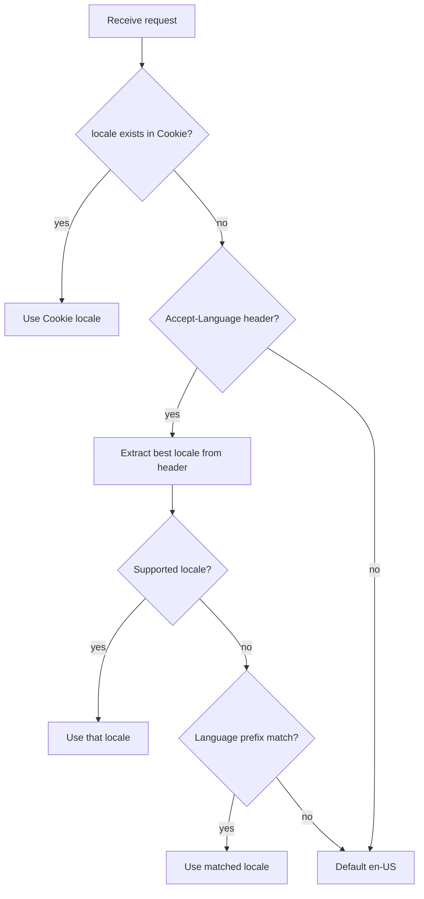

# nointern-web i18n Architecture

## Structure

```
src/i18n/request.ts              — next-intl server settings (getRequestConfig)
src/shared/lib/locale.ts         — locale utilities (SupportedLocale type, etc.)
src/shared/providers/locale.tsx  — locale Context Provider (client)
messages/
├── en-US.json
├── ko-KR.json
├── ja-JP.json
└── fr-FR.json
```

## No URL-based Routing

Azents `web` uses `[locale]` URL prefix, but nointern-web is **cookie-based**:

| | Azents web | nointern-web |
|--|-------------|-------------|
| URL | `/ko/place/...` | `/` (no locale) |
| Detection order | URL → cookie → header | cookie → header → default |
| Switching method | URL change | save cookie + reload |

**Reason:** nointern-web has a SPA-like structure and does not need localized URLs.

## Locale Detection Order



## BCP 47 Format

Locale IDs use BCP 47 format (`en-US`, `ko-KR`, `ja-JP`, `fr-FR`). Language prefix matching is supported: `ko` → `ko-KR`, `en` → `en-US`.

## Locale Switching Flow

1. Save new value to `locale` cookie.
2. Call `window.location.reload()`.
3. SSR reads cookie and applies new locale.

This method ensures next-intl server context is always initialized with the correct locale.

## Translation File Key Structure

```json
{
  "metadata": { "title", "description" },
  "nav": { "features", "useCases", "pricing", "findWorkspace", "createWorkspace" },
  "hero": { "headline", "subheadline", "cta", "ctaSecondary" },
  "features": { "sectionTag", "headline", "teamAgents", "uiBuilder", ... },
  "useCases": { "sectionTag", "headline", "subheadline", "design", "marketing", ... },
  "skills": { "sectionTag", "headline", "description", ... },
  "cta": { "headline", "subheadline", "primary", "secondary" },
  "footer": { "product", "company", "legal", ... },
  "chatPreview": { "channel", "userMessage", ... },
  "common": { "before", "after", "timeSaved", ... }
}
```

## Translation Writing Principles

Translation messages are **not literal translations from English source; write natural sentences for each language market**:

- Prioritize cultural context and idiomatic expressions of each language.
- Follow language-specific punctuation conventions for catch phrases/headlines. For example, Korean catch phrases do not use a period.
- Use natural tone per language for referring to AI/agents. For example, Korean does not use honorific speech toward agents.
- Keep message count and key structure identical across the 4 locales.
- If translation strings include line breaks (`\n`), rendering components need `whiteSpace: "pre-line"`.
