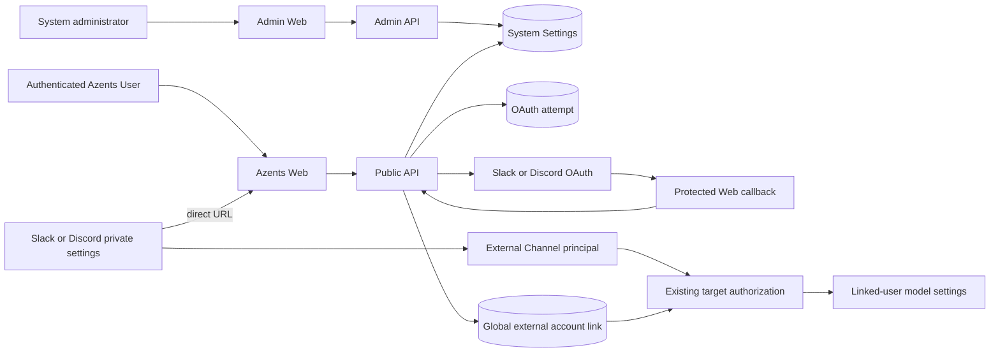
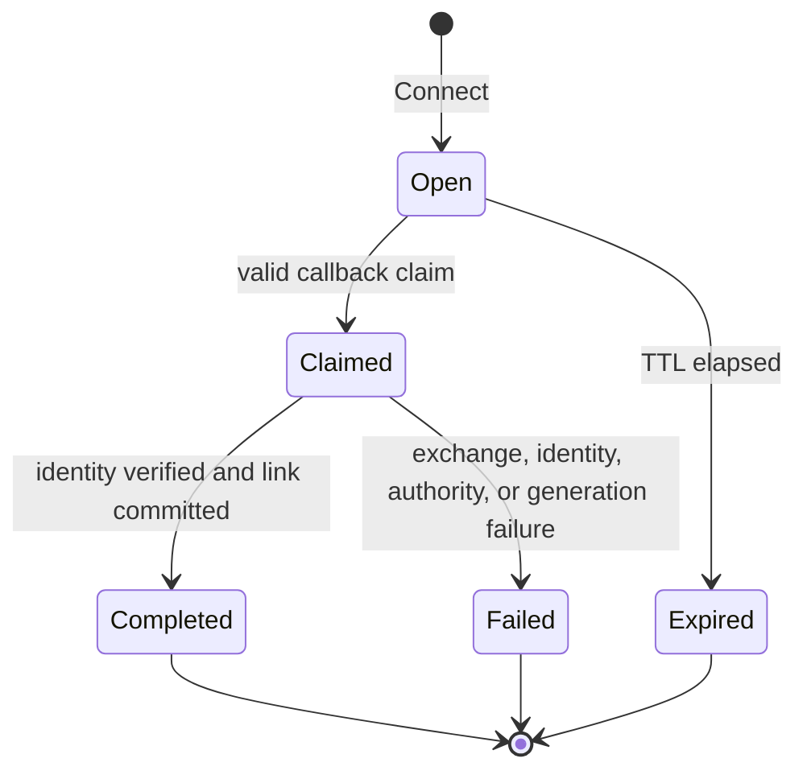

# identity-260913/DESIGN: Provider Account Linking

- Snapshot: `identity-260913`
- Document reference: `identity-260913/DESIGN`
- Requirements:
  [`identity-260913/REQ`](../requirements/identity-260913-provider-account-linking.md)
- Decisions:
  [`identity-260913/ADR`](../adr/identity-260913-provider-account-linking.md)
- Mode: Collaborative
- Decision owner: Requester

## Summary

Azents replaces the Workspace-scoped provider-code rendezvous with one authenticated
Web OAuth flow for Slack and Discord. Administrators manage one canonical OAuth client
per provider through independent Admin System Settings Sections and may enter the same
provider App credentials already used by External Channels. A short-lived PostgreSQL
attempt binds provider authorization to the initiating Azents User, auth Session,
provider, callback, and effective System Setting generation. Successful provider
identity verification creates one global `Azents User ↔ provider identity` link and
discards every provider token.

Slack and Discord native private settings use direct Web URL buttons. They no longer
create provider-side link state, open code modals, defer an account-link update, or
perform account-link callbacks. Linked-user model settings resolve the global identity
and then retain every existing target-specific User, Workspace, Session, Agent,
Binding, principal grant/block, and model authorization check.

## Current Behavior and Requirement Gaps

| Current behavior | Requirement gap |
| --- | --- |
| `external_account_links` active ownership includes `workspace_id` | `identity-260913/REQ-3` requires global User/provider ownership and reuse |
| One active User/provider/scope link is allowed per Workspace | `identity-260913/REQ-3` permits multiple identities from one provider |
| Native interaction creates an origin, Web creates a candidate/code, provider verifies it, and Web confirms it | `identity-260913/REQ-1`, `REQ-2`, and `REQ-7` require one-pass Web provider authorization and removal of the parallel flow |
| Discord Connect returns an invisible deferred acknowledgement and later edits the original response | `identity-260913/REQ-2` and `REQ-8` require direct navigation and no dead control |
| External accounts lists Workspace-owned active, inactive, and revoked links and cannot start OAuth | `identity-260913/REQ-1` and `REQ-6` require global connection and management |
| Slack/Discord OAuth client secrets do not exist in External Channel connection credentials | `identity-260913/REQ-9` requires Admin-managed provider application settings |
| Linked model settings look up a link by Workspace plus provider identity | `identity-260913/REQ-4` requires a global identity lookup followed by unchanged target authorization |
| Candidate/origin cleanup is a scheduled task | `identity-260913/REQ-7` removes candidate/origin state; new OAuth attempts need a distinct bounded lifecycle |

## Requirement and Decision Traceability

| Requirement | Primary mechanisms | ADR authority |
| --- | --- | --- |
| `identity-260913/REQ-1` | M2, M3, M6 | `identity-260913/ADR-D1`, `ADR-D2` |
| `identity-260913/REQ-2` | M7, M8 | `identity-260913/ADR-D3` |
| `identity-260913/REQ-3` | M4, M5 | `identity-260913/ADR-D1`, `ADR-D3` |
| `identity-260913/REQ-4` | M5, M10 | retained External Channel authorization Spec plus `ADR-D3` |
| `identity-260913/REQ-5` | M2, M3, M10 | `identity-260913/ADR-D1`, `ADR-D2` |
| `identity-260913/REQ-6` | M4, M6, M10 | `identity-260913/ADR-D3` |
| `identity-260913/REQ-7` | M4, M8 | `identity-260913/ADR-D3` |
| `identity-260913/REQ-8` | M1, M2, M7, M9, M11 | all accepted ADR decisions |
| `identity-260913/REQ-9` | M1, M2 | `identity-260913/ADR-D1`, `ADR-D2` |

## Architecture and Ownership



Ownership boundaries:

- System Settings owns provider OAuth client configuration and effective generation.
- The initiating Azents auth Session owns one OAuth attempt until it reaches a terminal
  state or expires.
- `external_account_links` owns global provider identity assignment to one Azents User.
- External Channel connections continue to own provider App installation, Bot
  credentials, transport, health, Guild/team, routes, Resources, Bindings, and
  principals. They do not own or configure global identity linking.
- Workspace and Session authorization remain authoritative for actions against their
  resources and are never copied into the global link.

## M1. Admin-managed Provider OAuth Settings

Add two compiled direct-activation Sections:

- `slack_identity_oauth`
- `discord_identity_oauth`

Each Section has schema version 1, no environment bindings, and no candidate lifecycle.
The existing `system_settings`, encrypted secret payload, optimistic version,
effective-generation HMAC, and metadata-only audit event tables remain authoritative.

### Typed fields

| Section | Non-secret config | Secret config | Derived presentation |
| --- | --- | --- | --- |
| Slack | `client_id` | `client_secret` | fixed Sign in with Slack endpoints and callback URL |
| Discord | `application_id` | `client_secret` | fixed Discord OAuth endpoints and callback URL |

All stored fields are nullable so an administrator can persist an incomplete Section
and complete it in one or more optimistic patches. Local validation rejects blank or
malformed configured values but does not invent a value. `client_secret` uses the
existing explicit `replace` or `clear` action contract and is never returned.

The redacted effective status is provider-neutral:

- `not_configured`: no field is configured;
- `incomplete`: only part of the required pair is configured;
- `invalid`: the complete local shape is invalid;
- `ready`: the pair is locally valid and the Azents callback URL is available; or
- `unavailable`: the pair is complete but the callback origin is unavailable or the
  latest explicit endpoint health check could not reach the provider.

A health check verifies local completeness and bounded reachability of the provider's
fixed authorization/token/user-info endpoints without storing or displaying provider
responses or attempting to manufacture an end-user authorization code. Secret
correctness is finally proven only by a real user authorization exchange. A sanitized
`invalid_client` result is surfaced in the user flow and Admin diagnostics without
persisting submitted codes or tokens.

Admin API adds independent redacted GET, optimistic PATCH, and health-check routes for
each Section. The inventory becomes provider-neutral instead of returning only the
Platform GitHub App item. Admin Web adds Slack account authorization and Discord
account authorization cards with:

- client/application ID input;
- write-only client-secret replace/clear control;
- current redacted status and Admin version;
- read-only exact callback URL with copy affordance;
- save, reload-on-conflict, and explicit health-check actions; and
- existing metadata-only audit visibility.

A System Setting mutation affects only new attempts. Every in-flight attempt contains
the effective generation and fails before link finalization when that generation is no
longer current. Existing global links remain unchanged.

## M2. One-time OAuth Attempt and Callback Lifecycle

Add `external_account_oauth_attempts` with:

- opaque primary ID;
- unique SHA-256 state hash;
- initiating `user_id` and `auth_session_id` FKs;
- provider enum;
- internal effective System Setting generation;
- exact redirect URI;
- nullable `encrypted_pkce_verifier`, protected by the existing credential cipher, only
  when the provider flow uses documented PKCE;
- `expires_at`;
- `claimed_at`, `completed_at`, and `failed_at` terminal timestamps;
- sanitized failure code; and
- creation timestamp.

The attempt contains no provider authorization code, access token, ID token, refresh
token, provider user profile body, return-to-provider URL, Workspace, Agent, Channel,
Session, connection, or principal identity.

Attempt state:



The default TTL is ten minutes and terminal/expired rows are retained for up to 24
hours for bounded diagnostics. A distinct scheduled cleanup deletes bounded terminal
or expired attempt batches. It is not the removed candidate/origin cleanup task.

### Start sequence

1. The authenticated Public API resolves the requested provider's current System
   Setting.
2. If it is not `ready`, start returns a sanitized provider-unavailable result and does
   not create an attempt.
3. The service generates an opaque state value, hashes it, derives the exact protected
   Web callback URI, creates any provider-supported PKCE verifier/challenge, and stores
   the attempt with current User, auth Session, and effective generation.
4. After the DB operation commits, the provider adapter builds the authorization URL
   from fixed endpoints, configured client identity, exact callback, minimum identity
   scopes, state, and optional challenge.
5. The API returns only the authorization URL. All account and native Connect actions
   navigate to it through the Web connect entry.

### Callback and exchange sequence

```mermaid
sequenceDiagram
    autonumber
    participant Browser
    participant Web as Azents Web
    participant API as Public API
    participant DB as PostgreSQL
    participant Provider

    Browser->>Web: /account/external-accounts/connect/{provider}
    Web->>API: authenticated start
    API->>DB: insert open attempt with state hash/session/generation
    API-->>Web: fixed-provider authorization URL
    Web-->>Browser: redirect
    Browser->>Provider: authorize minimum identity scopes
    Provider-->>Web: callback?code&state or error
    Web->>API: authenticated exchange(provider, code, state)
    API->>DB: claim matching open attempt for current User/auth Session
    API->>Provider: exchange code and load identity
    Provider-->>API: request-local token and typed identity
    API->>DB: revalidate Session and setting generation; create/reuse exact global link; complete attempt
    API-->>Web: connected identity or sanitized restart result
    Web-->>Browser: result and External accounts navigation
```

The claim DB transaction performs no provider I/O. Provider token exchange and identity
lookup occur after claim commit. Finalization uses a second repository transaction that
revalidates:

- the claimed attempt and current User/auth Session;
- active User account;
- exact provider and callback URI;
- unchanged effective System Setting generation;
- typed provider identity fields; and
- active global provider-identity uniqueness.

A process crash or network failure after claim cannot create a link. The attempt
expires or remains failed and the User starts a new flow. The system does not replay an
authorization code automatically.

## M3. Provider Identity Adapters

Expose one typed provider adapter interface with `authorization_url` and
`exchange_identity` operations. Adapter outputs contain only:

- provider;
- identity scope;
- provider user ID;
- provider tenant ID and display label when applicable; and
- bounded provider display label.

### Slack

Use the installed official `slack-sdk` public `openid_connect_token` and
`openid_connect_userInfo` methods. Authorization uses Slack Sign in with Slack and only
`openid profile`. Email is not requested. The stable ownership key is:

```text
(provider=slack, identity_scope=team_id, provider_user_id=user_id)
```

The team name and user display name are presentation metadata. Missing or malformed
team/user identifiers fail the attempt. The adapter accepts test-only fixed endpoint
base overrides from `Config` only when the testenv boundary is enabled; production uses
Slack's fixed secure endpoints.

### Discord

Use an established async OAuth client library because `discord.py` provides no public
authorization-code client API. Authorization uses Discord's authorization-code flow and
only `identify`; identity is loaded from `/users/@me`. The stable ownership key is:

```text
(provider=discord, identity_scope=global, provider_user_id=user_id)
```

Guild membership and Guild identity are not requested or stored. The adapter validates
typed non-empty Snowflake identity and bounded display metadata. Test-only fixed
endpoint base overrides follow the same enabled-testenv boundary; production uses
Discord's fixed HTTPS endpoints.

Adapters never return tokens beyond the request-local exchange object and never log
request or response bodies. The service drops token references before returning its
result.

## M4. Global Link Persistence and Migration

Evolve `external_account_links` in place:

| Field | Post-migration meaning |
| --- | --- |
| `id` | stable link/history identity |
| `legacy_workspace_id` | nullable historical provenance only; FK uses `SET NULL` |
| `user_id` | global Azents User owner |
| `provider` | Slack or Discord |
| `identity_scope` | Slack team ID or `global` for Discord |
| `provider_user_id` | stable provider user ID |
| `provider_tenant_display_label` | Slack team label or provider label metadata |
| `provider_display_label` | bounded user-facing provider label |
| `linked_at` | successful ownership time |
| `revoked_at` | terminal disconnection/migration time |
| `revocation_reason` | owner disconnect, legacy redundant, or legacy conflict |

Active uniqueness becomes:

```text
(provider, identity_scope, provider_user_id) WHERE revoked_at IS NULL
```

Keep an index on `user_id`. Remove Workspace active uniqueness and the active
`(workspace_id, user_id, provider, identity_scope)` constraint.

Migration groups active legacy rows by the new stable ownership key. Stable ordering is
`linked_at`, then `id`.

- One distinct User: keep the first row active and revoke the remainder as
  `legacy_redundant`.
- Multiple distinct Users: revoke every row as `legacy_conflict`; create no owner.
- No rows: only schema transformation runs, which is the expected current target state.

Revoked rows and existing model draft/mutation FKs remain. Immutable snapshot fields in
model-setting records are not rewritten. New links use `legacy_workspace_id = NULL`.

`external_account_link_candidates` is dropped before
`external_account_link_origins`. No runtime reader or writer remains for either table.

## M5. Global Identity Resolution with Existing Target Authorization

`ExternalAccountLinkRepository.lock_active_link` and actor-private state lookup remove
Workspace filtering and resolve only the stable provider identity key. A global link
may identify a User in any External Channel connection that presents the same provider
identity.

The External Model Settings transaction retains its current sequence after link
resolution:

1. lock and verify connection generation and human principal identity;
2. lock exact connected Binding, Resource, route, Session, and Agent target;
3. resolve and lock the global active link;
4. lock and verify active User;
5. authorize the linked User against the exact root Session using the existing
   web-equivalent Session authorization;
6. acquire and evaluate the exact external principal Agent grant/block fence;
7. validate model options, draft ownership, and applied-profile generation; and
8. commit the shared model mutation and immutable audit.

The global link does not create a WorkspaceUser row, Session access, AgentAdmin,
external grant, or execution User. Membership loss, account disable, unlink, block,
Binding disconnect, route removal, and Session/Agent lifecycle changes continue to
fail the exact operation through existing fences.

## M6. Public API and Main Web

### Public API contract

Retain:

- `GET /external-channel/v1/account-links` — list current User's active global links;
- `DELETE /external-channel/v1/account-links/{link_id}` — elevated owner disconnect.

Replace candidate/origin routes with:

- `GET /external-channel/v1/account-links/providers` — redacted Slack and Discord
  availability;
- `POST /external-channel/v1/account-links/oauth/{provider}/start` — authenticated
  attempt creation and authorization URL;
- `POST /external-channel/v1/account-links/oauth/{provider}/exchange` — authenticated
  code/state exchange and global link result.

The global link response omits Workspace ID/name/handle and inactive membership state.
It returns link ID, provider, Slack team context when applicable, provider display
label, and linked time. List returns active links only. Disconnect terminally revokes
an owner-matching active link and returns success without exposing retained history.

Expected errors use stable sanitized codes for provider unavailable, invalid callback,
expired, already consumed, auth Session mismatch, configuration changed, provider
rejected, provider unavailable, malformed provider identity, ownership conflict, and
busy transaction. No error contains code, state, token, client ID, secret, other owner,
or provider response body.

Regenerate Public OpenAPI JSON plus Python and TypeScript public clients. Remove all
generated origin/candidate models and methods.

### Main Web flow

External accounts becomes the primary connection and management page. It shows:

- Connect Slack and Connect Discord actions when ready;
- provider-specific unavailable/incomplete guidance when not ready;
- one card for each active global identity, without Workspace ownership or inactive
  membership status;
- Slack team context and provider display label;
- elevated disconnect confirmation preserving the current security boundary; and
- callback success, cancellation, conflict, configuration-change, and retry guidance.

`/account/external-accounts/connect/{provider}` is a protected server route. It calls
start using current HTTP-only auth cookies and redirects only to the fixed provider
adapter authorization URL. A non-ready result renders the account page with a
provider-specific unavailable result rather than redirecting.

`/oauth/external-account/{provider}/callback` is a protected server route. It validates
bounded query fields, handles provider cancellation, calls the authenticated exchange
once per server render, and renders a result component with a return to External
accounts. It never exposes code or state to client component props, browser storage,
analytics, or logs.

The obsolete `/external-channel/link/[originId]` page, confirmation container,
components, stories, types, and translations are deleted. External-account list stories
are updated for empty, provider-unavailable, multiple-provider, callback-result,
disconnect, elevation, and error states.

## M7. Direct Native Web Links

### Slack

For an unlinked actor and ready Slack OAuth Section, append one URL button labeled
`Connect Azents account` whose URL is the absolute protected Slack connect entry. The
button has no account-link action ID or signed link metadata. One short context line
states the account-based benefit without `optional`, disconnected status duplication,
or Workspace ownership.

For a linked actor, retain a direct `Manage connected account` URL. When the provider
Section is unavailable and the actor is unlinked, omit the Connect button and show one
quiet unavailable context line; guest controls remain unchanged.

Remove `link_code_view` and every `azents_account_link_*` native action. Model-setting
actions remain signed and provider-native.

### Discord

For an unlinked actor and ready Discord OAuth Section, render one style-5 URL button
labeled `Connect Azents account` pointing to the protected Discord connect entry. It has
no `custom_id`, signed scope, callback admission, deferred acknowledgement, origin
creation, or modal. The surrounding ephemeral response contains one benefit line and
no duplicate disconnected summary.

For a linked actor, retain one management URL. When unavailable and unlinked, omit the
Connect URL and show one quiet unavailable line. Remove the `al1:` scope type, parser,
modal input decoding, private account-link handoff, and account-link response branch.
Model-setting `ms1:` private controls remain unchanged.

## M8. Authoritative Legacy-flow Removal

The implementation removes the browser-code flow as a complete unit rather than
leaving dormant compatibility paths. The detailed removal matrix is in
[Removal and Replacement](#removal-and-replacement).

Absence searches must find no runtime or generated references to:

- `ExternalAccountLinkOrigin`;
- `ExternalAccountLinkCandidate`;
- candidate code hashing or plaintext code responses;
- `/account-link-origins` or `/account-link-candidates`;
- `/external-channel/link/[originId]`;
- `azents_account_link_code` or `azents_account_link_start`;
- Discord `al1:` scopes;
- `external_account_link_cleanup`; or
- user-facing `optional` account-link copy.

Historical migration files and the accepted snapshot documents are excluded from this
absence rule.

## M9. Deterministic Provider Fakes

Extend the existing Slack and Discord provider fakes with bounded identity OAuth
surfaces.

Each fake supports:

- authorization redirect with exact client, redirect URI, scope, state, and optional
  PKCE validation;
- configurable consent success, user cancellation, provider error, delay, and malformed
  response;
- one-time authorization code issuance and exchange;
- invalid client and redirect rejection;
- deterministic Slack team/user identity or Discord user identity;
- user-info failure and token rejection;
- request capture that redacts code, state, token, and secret values; and
- reset/configure endpoints under the existing test-only control plane.

Production endpoint selection cannot be overridden unless `testenv_api_enabled` is
true and explicit test-only base URLs are present.

## M10. Security, Permissions, and Privacy

- Account list, start, exchange, and callback require a live current User/auth Session.
- Disconnect retains the current elevated-user requirement.
- Admin configuration requires the live database-backed `system_admin` role for every
  read and mutation, consistent with the System Settings Spec.
- Provider identity conflicts use one generic response and never expose the existing
  User, email, Workspaces, Agents, Sessions, or link time.
- Authorization URL input is provider enum only. Provider endpoints, callback path, and
  scopes are fixed server values, preventing open redirects or caller-selected scope.
- Web callback accepts only bounded single string values and does not render or log
  raw query data.
- State is a high-entropy bearer value stored only as a hash. Provider authorization
  codes and tokens never enter PostgreSQL, Redis, Session Toolkit State, External
  Channel state, messages, broker payloads, analytics, or evidence.
- System Setting secrets use the existing `CredentialCipher`; audit stores only field
  names and replace/clear actions.
- Structured logs use provider and stable sanitized outcome code. They do not include
  user IDs, provider IDs, labels, state, code, token, secret, callback query, or provider
  body.

## M11. Failure, Retry, Recovery, and Observability

| Failure | Result | Recovery |
| --- | --- | --- |
| Provider Section absent/incomplete | no attempt; explicit unavailable state | administrator configures Section; User retries |
| Provider endpoint unreachable at start | no attempt or failed start | retry after provider recovery |
| User cancels provider authorization | no exchange; cancellation result | start again |
| Invalid/tampered/expired state | no attempt claim or link | start again |
| Auth Session changed/revoked | no claim/finalization | sign in and start again |
| System Setting generation changed | attempt fails with configuration-changed | start again under current setting |
| Token or user-info exchange fails | claimed attempt fails; no link | start again; Admin checks configuration/provider |
| Provider identity already owned | no ownership change; generic conflict | current owner disconnects through their account or requester uses another identity |
| DB uniqueness race | exactly one active owner commits | loser receives generic conflict |
| Process crash after claim | no link; attempt expires/cleans | start again |
| Unlink races with linked action | existing row locks/fences choose one result | reopen settings and retry if still authorized |
| Native provider setting unavailable | no dead Connect control; guest controls remain | Admin restores provider Section |

Metrics/log events count start, callback success, cancellation, expiry, auth mismatch,
configuration change, provider failure, conflict, disconnect, and cleanup by provider
and sanitized outcome only. System Settings audit remains the operator source for
configuration mutation and health actions. No product flow depends on metrics or logs
for recovery.

## Migration, Rollout, and Rollback

1. Before deployment, register the displayed Web callbacks in the selected existing or
   new Slack App and Discord Application. No credential must be preseeded in deployment
   environment variables.
2. Drain old API, Web, Worker/Gateway, and Scheduler binaries that contain the
   candidate/code flow.
3. Run the generated Alembic migration as the exclusive schema owner. It adds the two
   System Setting enum values, OAuth attempt table, globalizes links, handles legacy
   groups, and drops candidate/origin tables.
4. Start only the new Admin API/Web, Public API/Web, Worker/Gateway, and Scheduler
   binaries. Product services do not start before the migration barrier.
5. Initially both provider Sections are `not_configured`; global links remain usable,
   but new Connect entry is unavailable until a system administrator saves each
   provider App.
6. Admin configures and verifies the displayed callback registration, then saves Slack
   and Discord independently.
7. Required smoke/E2E evidence verifies Admin configuration, Web OAuth, native direct
   links, global reuse, target denial, and disconnect preservation.

There is no old-binary compatibility mode, dual write, old route fallback, or automatic
provider credential import from External Channel connections. Rollback before any new
link is backup restore plus old release. After new global links exist, prefer a forward
fix; reverting application code alone is unsupported because the old Workspace schema
and candidate tables no longer exist.

## Test Strategy

### E2E primary verification matrix

| Journey | Required evidence |
| --- | --- |
| Admin provider configuration | Admin Web/API saves independent Slack and Discord client credentials, secrets stay redacted, stale version fails, audit contains metadata only |
| Slack Web connection | Connect redirects to fake authorization, callback creates `team_id + user_id` global link, no provider return/code/poll/final confirm |
| Discord Web connection | Connect redirects to fake authorization, callback creates global user-ID link, no provider return/code/poll/final confirm |
| Native Slack entry | private settings contain one direct Web URL, no account-link action ID, no `optional`, guest settings still save |
| Native Discord entry | private settings contain one style-5 URL and no custom ID/deferred link callback, no duplicate disconnected copy |
| Global reuse | one identity linked once is recognized from a second Agent/connection/Workspace without another link |
| Target authorization | globally linked User lacking target Workspace/Session authority cannot change model; grant/block behavior remains authoritative |
| Conflict and concurrency | two Users race for one provider identity; one active owner exists and loser sees generic conflict |
| Attempt security | tamper, expiry, replay, wrong provider, auth-Session substitution, and System Setting generation change create no link |
| Disconnect preservation | elevated disconnect removes global recognition while guest controls, grants, blocks, messages, shared setting, and audit remain |
| Provider availability | incomplete/cleared Admin setting disables only that provider and native UI exposes no dead control |
| Migration | pre-migration same-User duplicates converge; cross-User rows all revoke; audit FKs remain; empty-table upgrade succeeds |

### E2E plan and fixture support

- Keep product E2E under the existing required External Account linking scenario family
  and Web Surface suite.
- Replace candidate/code helper functions with provider authorization helpers.
- Use Public/Admin APIs to create Users, Workspaces, Agents, connections, System
  Settings, and links. Product journeys do not write PostgreSQL directly.
- Migration tests may seed exact pre-migration rows because their purpose is schema and
  data transformation verification.
- Extend existing Slack and Discord provider fakes rather than introducing live
  credentials or a third fake service.
- Add Admin Web browser coverage for both provider cards and Main Web browser coverage
  for connect/result/list/disconnect responsive states.

### Credential and prerequisite snapshot

Required deterministic prerequisites are PostgreSQL, Public/Admin API, Main/Admin Web,
Slack fake, Discord fake, and browser container for Web lanes. Fake client IDs and
secrets are test-only values injected through Admin APIs. No AWS secret, live Slack
Workspace, live Discord account, provider TOTP, or internet access is required.

### Evidence format and CI policy

- Backend, migration, provider-fake, and Web suites emit normal pytest/JUnit evidence.
- Browser failure captures remain subject to existing screenshot/HTML redaction rules.
- Required CI fails on any missing fake prerequisite, unexpected skip, secret exposure,
  stale generated client, migration mismatch, or absence-search violation.
- There are no optional/live provider tests in the required acceptance boundary. A
  separately run live smoke test may be reported as supplementary evidence only.

### Focused checks

- Python: Ruff, formatter, configured type checker, account-link/System Settings/native
  unit and repository tests, migration tests, and required E2E.
- TypeScript: format, lint, typecheck, builds, message-key tests, tRPC tests, component
  tests/stories, Admin Web and Main Web Surface E2E.
- OpenAPI: dump Public/Admin specs, regenerate Python/TypeScript clients, and prove no
  candidate/origin generated symbol remains.

## Removal and Replacement

| Existing unit or behavior | Removal authority | Replacement or remaining authority | Removal boundary | Absence verification |
| --- | --- | --- | --- | --- |
| Workspace ownership and Workspace uniqueness on `external_account_links` | `identity-260913/REQ-3`, `ADR-D3` | global link schema M4 | model, migration, repository, API, Web | schema/index inspection and Workspace-free link responses |
| `external_account_link_origins` | `identity-260913/REQ-1`, `REQ-7`, `ADR-D3` | OAuth attempt M2 | schema, model, repository, service | table/model/symbol search |
| `external_account_link_candidates` and code hashes | same | OAuth attempt M2 | schema, model, repository, service | table/model/symbol and plaintext-code response search |
| origin/candidate Public API routes and schemas | same | start/exchange API M6 | backend OpenAPI and generated clients | route/OpenAPI/generated-symbol search |
| `/external-channel/link/[originId]` confirmation UI | same | connect/callback routes and account page M6 | Main Web components, stories, translations | route/component/message search |
| Slack signed account-link controls and code modal | `identity-260913/REQ-2`, `REQ-7` | direct URL M7 | protocol parser, settings service, views, tests | action/callback ID search |
| Discord `al1:` controls, modal, and deferred account-link handoff | same | style-5 URL M7 | scope parser, interaction decode, HTTP dispatch, settings, tests | `al1:`/modal/handoff search |
| candidate/origin cleanup task | `identity-260913/REQ-7`, `ADR-D3` | bounded OAuth-attempt cleanup M2 | Scheduler registry/tests | task/service symbol search |
| Workspace fields and inactive state in account-link Web/API | `identity-260913/REQ-3`, `REQ-6` | global active link projection M6 | API schemas, clients, UI, translations | generated and UI field search |
| `optional` and duplicate disconnected native copy | `identity-260913/REQ-2` | one benefit/unavailable line M7 | Slack/Discord presentations and tests | localized/source string search |
| Workspace-filtered link lookup in model settings | `identity-260913/REQ-3`, `REQ-4` | global lookup plus retained target checks M5 | link and model repositories | query inspection and cross-Workspace E2E |
| External Channel connection credentials as possible OAuth source | `identity-260913/REQ-9`, `ADR-D1` | Admin System Settings M1 | no credential-model mutation required | API/model diff and source search |

## Authority Audit

### Requirements to mechanisms

- Every numbered Requirement maps to at least one mechanism in the traceability table.
- One-pass user behavior is owned by M2, M3, and M6; no native provider step remains.
- Global ownership and authority separation are independently represented by M4 and M5.
- Admin management is owned by M1 and does not borrow authority from deployment or
  Workspace connections.
- Legacy removal has explicit item-level authority and absence evidence in M8 and the
  removal matrix.

### Mechanisms to authority

- M1, M2, and M4 are exactly the three accepted ADR decisions.
- M3 is required provider-proof behavior constrained by minimum-scope Requirements and
  the supported-SDK project convention.
- M5 retains the current External Channel Authorization Spec after changing only link
  lookup ownership.
- M6 and M7 implement confirmed observable Web/native behavior without adding another
  authorization mode.
- M8 is required authoritative removal, not optional cleanup.
- M9 and M11 derive from `identity-260913/REQ-8`, repository test policy, and failure
  behavior required by M1-M7.
- M10 combines explicit security Requirements, accepted attempt/link decisions, current
  auth Session behavior, and System Settings secret handling. It introduces no new
  product authority.

Result: **pass**. No material mechanism lacks approved authority and no Requirement is
left without an implementation mechanism.

## Feasibility Validation

| Requirement | Result | Repository evidence and condition |
| --- | --- | --- |
| `identity-260913/REQ-1` | Feasible | Main Web already has protected OAuth callback server routes and authenticated tRPC exchange; provider adapters and new start/exchange routes are additive |
| `identity-260913/REQ-2` | Feasible | Slack and Discord presentation models already support URL buttons; removing custom link controls does not affect guest controls |
| `identity-260913/REQ-3` | Feasible | provider identity keys already use Discord global and Slack tenant scope; uniqueness and repository filters can be globalized |
| `identity-260913/REQ-4` | Feasible | model settings already perform User/Session/Agent/Binding/grant/block checks after link resolution; only the Workspace link predicate changes |
| `identity-260913/REQ-5` | Feasible | current auth dependencies expose `user_id` and `session_id`; PostgreSQL attempt state and existing System Setting generations provide required fences |
| `identity-260913/REQ-6` | Feasible | list/unlink API and Main Web management already exist; projection becomes simpler and unlink keeps current elevation |
| `identity-260913/REQ-7` | Feasible | all origin/candidate readers and writers are bounded to the identified model/repository/service/API/native/Web/scheduler surfaces; audit FKs remain on the evolved link table |
| `identity-260913/REQ-8` | Feasible | existing Slack/Discord fakes and required account-link E2E family already exercise native and Web flows; OAuth endpoints can extend the same fakes |
| `identity-260913/REQ-9` | Feasible | generic System Settings already provides encrypted secrets, optimistic direct activation, effective generation, health, audit, Admin API, generated client, and Admin Web patterns |

Conditional items that do not block implementation:

- Discord requires adding an established async OAuth client dependency because
  `discord.py` has no public authorization-code client surface.
- Operators must register the exact displayed callback URL in each reused provider App.
- The coordinated cutover requires old binaries to be drained before migration; the
  repository intentionally provides no mixed-version mode.

Result: **feasible**. No confirmed Requirement requires unsupported provider identity,
an unowned secret source, or an unverifiable product path.

## Design Authority

- Design revision: `1`

| ID | Material design mechanism | Authority | Classification |
| --- | --- | --- | --- |
| M1 | Independent Admin-managed Slack and Discord OAuth System Settings | `identity-260913/REQ-9`; `identity-260913/ADR-D1` | `decided` |
| M2 | PostgreSQL one-time OAuth attempt plus protected authenticated Web callback | `identity-260913/REQ-1`, `REQ-5`; `identity-260913/ADR-D2` | `decided` |
| M3 | Minimum-scope supported provider identity adapters with request-local tokens | `identity-260913/REQ-1`, `REQ-5`; `identity-260913/ADR-D1`; supported-SDK convention | `derived` |
| M4 | In-place global link schema, deterministic legacy handling, retained audit identity | `identity-260913/REQ-3`, `REQ-6`, `REQ-7`; `identity-260913/ADR-D3` | `decided` |
| M5 | Global identity lookup followed by unchanged target-specific authorization | `identity-260913/REQ-3`, `REQ-4`; External Channel Authorization Spec | `derived` |
| M6 | Global External accounts start/callback/list/disconnect Web and API contract | `identity-260913/REQ-1`, `REQ-6`, `REQ-8` | `required` |
| M7 | Slack and Discord direct native Web URL presentation | `identity-260913/REQ-2`, `REQ-8` | `required` |
| M8 | Complete authoritative removal of origin/candidate/code paths | `identity-260913/REQ-7`; `identity-260913/ADR-D3` | `decided` |
| M9 | Deterministic Slack/Discord OAuth fake and E2E matrix | `identity-260913/REQ-8`; E2E-primary project constraint | `required` |
| M10 | Auth, conflict nondisclosure, secret redaction, and no-token-retention boundary | `identity-260913/REQ-4`, `REQ-5`, `REQ-9`; current auth/System Settings Specs | `derived` |
| M11 | Explicit failure, restart, cleanup, and metadata-only observability behavior | `identity-260913/REQ-8`; M1-M10 | `derived` |

## Assumptions and Non-blocking Risks

- Provider display labels may change; a later successful authorization refreshes labels
  without changing stable identity ownership.
- Provider authorization endpoint behavior may change. Fixed endpoints and supported
  SDK/client adapters isolate this risk, while fake E2E proves Azents behavior rather
  than provider uptime.
- Direct activation cannot prove a client secret before an end-user authorization code
  exists. Admin readiness therefore distinguishes local completeness/reachability from
  real exchange failure and provides sanitized retry guidance.
- The current target database is reported empty, but migration logic remains defensive
  for another installation that has legacy rows.
- One focused PR is expected. If implementation review shows an unreviewable diff, the
  approved Design may be delivered as a stack without changing mechanism authority.

## Design Approval

- Mode: `Collaborative`
- Decision owner: Requester
- Approved on: `2026-09-13`
- Approved Design revision: `1`
- Approved authority IDs: `M1`, `M2`, `M3`, `M4`, `M5`, `M6`, `M7`, `M8`, `M9`,
  `M10`, `M11`
- Approved scope: Admin-managed reuse of provider Apps, one-time authenticated Web
  OAuth, global identity persistence and authorization reuse, complete legacy-flow
  removal, deterministic provider-fake verification, and one-way cutover.
