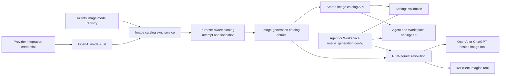

# image-260910/DESIGN: Image Generation Model Selection

## Summary

This Design implements the confirmed
[image-generation model selection Requirements](../requirements/image-260910-generation-model-selection.md)
and the accepted
[image-generation model selection ADR](../adr/image-260910-generation-model-selection.md).

An Agent or Workspace selectable model option continues to enable the semantic
`image_generation` built-in tool. Its existing `config` object becomes the single
selection authority:

- no `model` key means the maintained default;
- an exact `model` string means an explicit provider model pin.

Explicit choices are initially available only for OpenAI API-key integrations. A
purpose-specific stored catalog publishes the exact intersection between Azents'
supported image-model registry and the models visible to that integration credential.
ChatGPT OAuth and xAI retain default-only behavior.

## Current Behavior and Requirement Gaps

Agent and Workspace selectable model options already persist `BuiltinToolConfig` values
inside JSON settings. Runtime request resolution copies each config into a
`BuiltinToolSpec`. Provider-hosted Responses lowering spreads the config into the native
tool payload, while xAI resolves the same semantic capability to an Azents client tool
with an internal Imagine model.

The gaps are:

- no supported image-model registry or credential-scoped image-model projection exists;
- catalog identity cannot distinguish conversation and image-generation purposes;
- Agent and Workspace save validation checks only that the conversation model advertises
  `image_generation`;
- Azents Web drops built-in tool config while mapping stored options to and from form
  state;
- the prototype selector uses a static frontend list and a manually supplied unavailable
  flag; and
- runtime resolution does not reject a pin that became invalid after it was saved.

## Requirement and Decision Traceability

| Requirement | Design mechanisms | ADR authority |
| --- | --- | --- |
| `image-260910/REQ-1` | M1, M2, M3, M6, M7 | D1, D2, D3, D6, D7, D10 |
| `image-260910/REQ-2` | M4, M7, M8 | D4, D8 |
| `image-260910/REQ-3` | M5, M7, M8 | D3, D4, D5, D7, D8 |
| `image-260910/REQ-4` | M1, M3, M5, M6 | D1, D3, D5, D6, D7 |
| `image-260910/REQ-5` | M3, M4, M8, M9 | D3, D4, D5, D8 |

## Architecture



The Integration/Catalog domain owns provider discovery and availability state. Agent and
Workspace services own configuration normalization and save validation. RunRequest
resolution owns the final pre-dispatch validity check. Provider adapters only translate
already validated configuration.

## M1. Purpose-Aware Shared Catalog Lifecycle

Add `LLMCatalogPurpose` with `conversation` and `image_generation`. Store it on
`llm_catalogs` and include it in both system and integration unique indexes.

Every existing conversation lookup explicitly supplies `conversation`. Image catalog
services use `image_generation`. Shared snapshots and attempts continue to own:

- current snapshot publication;
- stale age;
- explicit and lazy refresh cooldown;
- transient failure backoff;
- automatic retry blocking;
- running-attempt lease recovery;
- workspace-wide synchronization throttling; and
- latest-attempt diagnostics.

Repository entry operations are selected by purpose. One snapshot cannot contain both
conversation entries and image-generation entries.

## M2. Image Generation Catalog Entries

Add `image_generation_catalog_entries`:

| Field | Contract |
| --- | --- |
| `id` | 32-character generated identity |
| `catalog_id` | image-generation catalog identity |
| `snapshot_id` | shared catalog snapshot; cascade delete |
| `provider` | provider identity |
| `provider_model_identifier` | exact provider ID |
| `display_name` | registry-owned user-facing name |
| `description` | registry-owned user-facing explanation |
| `recommendation_rank` | nullable stable ordering rank; lower ranks first |
| `lifecycle_status` | active, deprecated, or disabled lifecycle |
| `visibility_status` | selectable or hidden |
| `provider_integration_id` | owning integration |
| `source_metadata` | bounded provider discovery provenance |
| `projection_metadata` | registry revision and projection diagnostics |
| `hidden_reason` | nullable non-secret reason |
| `created_at` | snapshot entry creation time |

Enforce uniqueness for `(snapshot_id, provider_model_identifier)`. Repository publication
checks the catalog purpose before writing. Snapshot counts include the purpose-specific
entry rows.

## M3. Registry and OpenAI Credential Discovery

Create an immutable code registry in the backend. Each definition contains provider,
exact model identifier, display name, description, recommendation rank, and lifecycle.
The initial OpenAI entries authorized by `image-260910/ADR-D10` are:

- `gpt-image-2.5-flare`: recommended speed and cost-balanced choice;
- `gpt-image-2.5-sunburst`: highest-quality choice.

Descriptions are registry metadata, not provider listing metadata. Adding or removing a
definition is a reviewed product compatibility change.

Public provider feasibility evidence:

- `https://developers.openai.com/api/docs/models/gpt-image-2.5-flare`
- `https://developers.openai.com/api/docs/models/gpt-image-2.5-sunburst`

Both references identify the exact model as supported by the Responses Image generation
tool. The installed request schema accepts an image-generation model string, and the
current lowerer preserves that string in the hosted tool payload.

For an OpenAI API-key integration, the image catalog sync adapter:

1. decrypts the credential through the existing integration repository;
2. constructs the official `AsyncOpenAI` client using the same supported OpenAI endpoint
   configuration as runtime requests;
3. consumes the complete `models.list()` result;
4. rejects incomplete pagination, malformed items, and duplicate ambiguity;
5. intersects exact visible IDs with active registry definitions;
6. orders entries by recommendation rank, display name, then identifier; and
7. publishes only after version fencing succeeds.

Provider metadata does not override registry display or compatibility metadata. A failed
or partial request records a failed attempt and publishes nothing.

Deterministic provider fixtures return a stable registry-visible set for E2E without
external credentials or spend.

## M4. Built-In Tool Configuration Contract

Introduce an image-generation config decoder around the existing config map. It
distinguishes key absence from invalid values.

Canonical rules:

- `model` absent: maintained default;
- `model` is a non-empty string: explicit pin;
- `model` is null, blank, non-string, or a known UI sentinel: invalid.

The decoder preserves unrelated existing config keys. Updating image selection performs a
key-level operation:

- choose default: remove `model`;
- choose explicit: set `model` to the exact ID;
- disable image generation: remove the whole built-in entry at serialization.

The backend never returns credentials or resolves the maintained default to a concrete
model ID in stored settings.

## M5. Availability and Configuration-Version Authority

Add `catalog_configuration_version` to provider integrations. It starts at `1` and
increments after a committed credential, discovery-affecting config, disable, or
re-enable change. Name-only changes do not increment it.

Integration-scoped attempts and snapshots capture the version. Attempt completion locks
the catalog and integration, then publishes only when the captured version is still
current. Older results become superseded.

Availability classification is derived:

| Condition | Classification |
| --- | --- |
| Exact explicit entry is selectable and has an executable registry lifecycle in a current-version fresh snapshot | available |
| Exact explicit entry is selectable and has an executable registry lifecycle in a current-version stale snapshot | available; refresh requested |
| Explicit entry is absent, hidden, disabled, or outside an executable registry lifecycle in the current-version last-good snapshot | unavailable |
| No successful current-version snapshot exists | unverified |
| Provider does not support explicit choices | unsupported |
| No explicit pin | maintained default |

An older-generation snapshot remains readable for display diagnostics, but never
authorizes save or runtime dispatch. A refresh failure with a current-generation
last-good snapshot preserves its authority.

The catalog read service, Agent and Workspace save validation, frontend classification,
and runtime validation share one eligibility predicate: the exact entry must have
`visibility_status=selectable` and a registry lifecycle that remains executable. Active
and deprecated lifecycle values may be executable when registry policy keeps them
selectable; disabled and removed lifecycle values are never executable.

## M6. Synchronization Lifecycle and API

OpenAI integration creation and catalog-affecting updates enqueue image synchronization
after commit. A stored catalog read may enqueue a stale refresh. Explicit synchronization
uses integration-management permission.

Add public endpoints:

```http
GET /llm-provider-integration/v1/workspaces/{handle}/llm-provider-integrations/{integration_id}/image-generation-model-catalog
POST /llm-provider-integration/v1/workspaces/{handle}/llm-provider-integrations/{integration_id}/image-generation-model-catalog-sync
```

The GET response contains:

- `default_available`;
- `explicit_selection_supported`;
- nullable catalog and snapshot IDs;
- nullable snapshot and current integration configuration versions;
- snapshot creation time;
- latest attempt projection;
- `stale`, `generation_current`, `sync_available_at`, and
  `automatic_retry_blocked`;
- ordered selectable entries; and
- bounded total counts.

The maintained default is not an entry. Default-only providers return
`explicit_selection_supported=false`, no catalog entries, and no provider discovery
attempt. A disabled integration returns `default_available=false`.

The POST endpoint is supported initially only for OpenAI API-key integrations. It reuses
the existing attempt conflict, throttle, retry-after, automatic-retry-block, and
superseded response semantics.

Normal Agent and Workspace endpoints never call provider discovery.

## M7. Agent and Workspace Save Validation

Extend selectable model option normalization with an injected asynchronous
image-configuration validator after the conversation model selection has been resolved.

For each enabled `image_generation` entry:

1. decode canonical config;
2. verify the conversation model capability;
3. allow maintained default when the integration/provider supports default dispatch;
4. for an explicit pin, require enabled integration, explicit provider support, registry
   membership, a current-generation published snapshot, and a selectable exact entry;
5. return an option-label-qualified actionable validation error on failure; and
6. preserve other built-in config keys.

Agent and Workspace services use the same validation service. Workspace-to-Agent copy
continues copying the complete stored selectable option JSON.

A request that removes `image_generation` is valid even when the removed entry contained
an unavailable pin. Any replacement request that retains an invalid pin is rejected.

## M8. Runtime Resolution and Provider Dispatch

RunRequest resolution repeats explicit-pin validation for the effective option after
loading the actual integration. This applies to root execution, subagent target
selection, and resolved-profile reconstruction.

Add a typed non-retryable configuration error with safe reasons:

- `integration_disabled`;
- `explicit_selection_unsupported`;
- `catalog_unavailable`;
- `catalog_generation_mismatch`;
- `model_unavailable`; and
- `provider_model_mismatch`.

For validated OpenAI API-key explicit pins, the existing hosted image tool config reaches
Responses lowering as `{"type": "image_generation", "model": "<id>"}`. Default OpenAI
and ChatGPT requests omit `model`. xAI default execution retains its internal Imagine
model. Explicit ChatGPT OAuth or xAI values fail before dispatch.

No generated-image materialization, transcript, attachment, replay, or ModelFile behavior
changes.

## M9. Azents Web Settings Experience

Replace the prototype's static model list and manual unavailable flag with container-owned
stored catalog state.

The Agent and Workspace containers:

- collect unique integration IDs used by selectable options that advertise
  `image_generation`;
- query the generated public client image catalog endpoint;
- represent loading, loaded, error, and unsupported state as a discriminated union;
- expose explicit sync only when the viewer has management permission; and
- pass data and callbacks into the pure editor component.

Form state retains both enabled built-in names and the complete config object for every
built-in. Stored-to-form and form-to-input conversions preserve config keys. The UI uses
an internal default selection value that is never serialized.

When image generation is enabled, the modal shows:

1. **Use default model** as the recommended first option;
2. current explicit catalog entries; and
3. a disabled synthetic option for a saved unavailable or unverified ID.

The description explains that default may change over time and explicit selection is
pinned. Stale current-generation state does not block selection. Failed or
older-generation state shows the last-good context and the required recovery action.
Frontend validation blocks save for a retained unavailable pin, but the backend remains
authoritative.

All copy is added to every supported locale. Colocated Storybook stories cover default,
explicit, open menu, loading, failed sync with last-good data, unavailable pin, and
default-only provider states. The local absolute Storybook filesystem override is
removed.

## Security and Permissions

- Provider credentials remain encrypted at rest and are used only by the backend listing
  adapter and runtime provider client.
- Catalog responses contain no credential value, Authorization header, provider response
  body, account identifier, or secret-derived fingerprint.
- Provider errors are sanitized before persistence.
- GET uses existing LLM integration read permission; explicit sync uses integration
  management permission.
- Agent and Workspace save services derive availability from server-owned state and
  ignore client-supplied status.
- Runtime errors expose safe reason codes and identifiers already present in saved
  configuration, never credential content.

## Migration, Rollout, and Rollback

Generate one new Alembic revision from the current head. It:

1. creates the catalog-purpose enum;
2. adds and backfills `llm_catalogs.purpose=conversation`;
3. replaces partial unique indexes with purpose-aware indexes;
4. adds and backfills `llm_provider_integrations.catalog_configuration_version=1`;
5. adds captured version columns to catalog attempts and snapshots;
6. backfills existing integration-scoped attempt/snapshot values to `1`;
7. creates image-generation catalog entries and indexes; and
8. updates the tracked migration revision and generated database schema artifacts.

Application rollout explicitly supplies purpose for every existing catalog operation.
Existing conversation sync and read behavior remains unchanged. Existing OpenAI
integrations lazily create an empty image catalog on first read or explicit sync; new and
updated OpenAI integrations enqueue initial synchronization.

The feature is available after schema migration and application deployment. There is no
legacy fallback. Downgrade after image snapshots exist discards image catalog state and
requires explicit approval; Agent pins remain in generic built-in config and become
unverified until the feature is restored or the pin is removed.

## Failure, Retry, and Recovery

| Failure | Behavior |
| --- | --- |
| Credential or permission rejection | Failed attempt, automatic retry blocked, last-good preserved |
| Rate limit, timeout, provider 5xx | Failed attempt, bounded backoff, last-good preserved |
| Malformed or partial provider listing | Failed attempt, no publication |
| Old configuration-version completion | Superseded attempt, no publication |
| No successful current-version snapshot | Default allowed; explicit save and execution rejected |
| Saved explicit model removed | Preserve ID, show unavailable, require default/new model/disable |
| Runtime defensive validation failure | Non-retryable configuration error before provider dispatch |
| Disabled integration | Default and explicit execution unavailable |

## Observability

Catalog logs and attempt diagnostics include catalog purpose, integration ID,
configuration version, trigger, fetched count, matched count, hidden count, failure
category, and superseding attempt identity. They exclude credentials and raw provider
payloads.

Metrics distinguish `conversation` and `image_generation` purpose for sync duration,
success, failure category, stale reads, and current-generation availability. Runtime
configuration failures count safe reason codes and provider identity.

## Test Strategy

### E2E primary verification matrix

| Scenario | Stored catalog | Settings behavior | Runtime evidence |
| --- | --- | --- | --- |
| OpenAI initial sync | default plus matched registry entries | recommended default and explicit choices | none required |
| Maintained default | catalog may be empty | save succeeds | image tool payload omits `model` |
| Explicit OpenAI pin | current-version entry exists | pin round-trips | image tool payload contains exact `model` |
| Workspace default copy | current-version entry exists | new Agent receives complete config | copied Agent uses same pin |
| Model removed on refresh | last-good replaced without pin | disabled saved option and warning | execution rejected before provider call |
| Credential update | old snapshot retained, generation mismatched | old pin visible but unverified | explicit execution rejected until resync |
| Sync failure with current last-good | failed latest attempt | last-good choices remain usable with warning | saved pin remains valid |
| ChatGPT OAuth and xAI | no explicit catalog | default-only choice | existing hosted/client generation succeeds |
| Conversation model lacks image capability | catalog state is irrelevant | image-model control is absent | no image built-in is dispatched |
| Image generation is disabled | saved option excludes the built-in | image-model control is absent | no image built-in is dispatched |
| Unavailable or unverified pin is retained | missing or non-authoritative entry | save is rejected with recovery guidance | no provider request |
| Unavailable pin recovery | same unavailable starting state | changing to default or disabling the tool saves successfully | subsequent default or disabled behavior is honored |

Required E2E uses deterministic integration listing and image-generation proxy support.
It must not require live credentials or spend. Provider request capture verifies omission
versus exact model transmission.

### Backend coverage

- migration upgrade, backfill, indexes, purpose constraints, cascade, and safe downgrade;
- purpose-aware repository identity and entry publication;
- integration configuration version increment rules;
- attempt capture and superseded publication fencing;
- OpenAI SDK pagination, duplicate handling, exact registry intersection, sanitization,
  partial failure, and last-good preservation;
- registry ordering and lifecycle filtering;
- canonical config decoding and preservation of unrelated keys;
- Agent and Workspace default/explicit/unavailable validation;
- disable-as-recovery behavior;
- runtime revalidation for root, subagent, and resolved-profile paths;
- hosted lowerer explicit model and default omission;
- ChatGPT OAuth and xAI explicit rejection and default regression coverage; and
- API permission, state, throttle, and retry responses.

### Frontend coverage

- config-preserving stored/form/input round-trip;
- default sentinel omission and explicit model serialization;
- default-only provider;
- loading, never-synced, stale, failed-with-last-good, generation-mismatch, and
  unavailable states;
- sync callback and permission state;
- disable and default recovery;
- localized message key parity; and
- static Storybook interactions for every meaningful visual state.

### CI and optional validation

Required CI runs migration/schema checks, focused Python tests, generated OpenAPI/client
checks, TypeScript format/lint/typecheck/tests, and deterministic E2E. Optional live
OpenAI validation may confirm account visibility and one explicit generation, but absent
credentials skip only that optional evidence. Deterministic failures are never skipped.

## Feasibility Evidence

| Requirement | Status | Repository evidence |
| --- | --- | --- |
| REQ-1 | feasible | Existing integration catalog lifecycle and credential repositories can support a purpose-specific projection; official SDK is already a dependency |
| REQ-2 | feasible | `BuiltinToolConfig.config` persists through Agent/Workspace JSON and reaches `BuiltinToolSpec` |
| REQ-3 | feasible | Stored pins and atomic current snapshots permit derived unavailable state without settings mutation |
| REQ-4 | feasible | Existing integration catalog sync policy already implements stale refresh, cooldown, backoff, fencing, and last-good preservation |
| REQ-5 | feasible | Current runtime already partitions OpenAI/ChatGPT hosted and xAI client image generation before lowering |

No implementation blocker remains. The principal non-blocking risk is that provider
model visibility can differ from actual quota or entitlement at execution time; provider
runtime errors remain explicit and do not change saved intent.

## Removal and Replacement

| Existing unit or behavior | Removal authority | Replacement or remaining authority | Removal boundary | Absence verification |
| --- | --- | --- | --- | --- |
| Conversation-only catalog uniqueness | D1, D9 | Purpose-aware catalog identity | DB indexes and repository lookup arguments | Migration and repository tests allow same integration/target across purposes |
| Frontend static image model list | REQ-1, D3 | Stored image catalog response | `SelectableModelOptionsEditor` | No supported image model ID is hardcoded in the component |
| Frontend manual unavailable boolean | REQ-3, D5 | Derived saved-pin/catalog state | Form type, fixtures, component props | No persisted or client-authoritative unavailable flag remains |
| Name-only built-in config serialization | REQ-2, D4 | Complete config round-trip | `model-selection.ts` conversions | Round-trip tests preserve arbitrary allowed config keys |
| Local absolute Storybook filesystem allow | Project portability constraint | Standard Storybook configuration | `.storybook/main.ts` | Git diff contains no workspace-specific absolute path |
| Runtime acceptance of stale explicit pin | REQ-5, D8 | Pre-dispatch current catalog validation | RunRequest resolution | Provider proxy observes no request on invalid pin |

The xAI internal default, generated-image materialization, event normalization, file
storage, and presentation paths remain authoritative and are not removed.

## Design Authority

- Design revision: `2`

| ID | Material design mechanism | Authority | Classification |
| --- | --- | --- | --- |
| M1 | Purpose-aware shared catalog lifecycle | D1 | decided |
| M2 | Purpose-specific image catalog entries | D2 | decided |
| M3 | Registry and credential-visible exact intersection, including initial seed | REQ-1, D3, D10 | decided |
| M4 | Default omission and explicit `BuiltinToolConfig.config.model` | REQ-2, D4 | decided |
| M5 | Derived availability and configuration-version authority | REQ-3, D5, D7 | decided |
| M6 | Independent image synchronization through shared policy | REQ-4, D6 | decided |
| M7 | Stored catalog API plus Agent and Workspace save validation | REQ-1, REQ-3, D3, D5, D6 | derived |
| M8 | Pre-dispatch explicit model validation and provider mapping | REQ-5, D8 | decided |
| M9 | Stored-catalog-driven localized settings experience | REQ-1, REQ-2, REQ-3, REQ-4 | required |
| M10 | Additive schema migration and conversation backfill | D9 | decided |
| M11 | Deterministic E2E and focused regression matrix | REQ-1, REQ-2, REQ-3, REQ-4, REQ-5 | required |

## Assumptions and Non-Blocking Risks

- The provider model-list endpoint reports credential visibility but cannot guarantee
  current quota, moderation outcome, or per-request entitlement.
- Registry updates may make a saved pin unavailable; the explicit recovery flow is the
  intended behavior.
- Default provider behavior may change without a stored configuration migration.
- Image registry size remains small enough for a complete non-paginated public response;
  provider discovery itself still consumes all provider pages.

## Design Approval

- Mode: `Autonomous`
- Decision owner: `tech-interviewee`
- Approved on: `2026-09-10`
- Approved Design revision: `2`
- Approved authority IDs: `M1, M2, M3, M4, M5, M6, M7, M8, M9, M10, M11`
- Approved scope: purpose-aware catalog identity and image entries, OpenAI registry and credential intersection, default and explicit persistence, derived availability, synchronization and generation fencing, Agent and Workspace validation and UI, runtime dispatch defense, additive migration, observability, removal obligations, and deterministic E2E and regression verification
