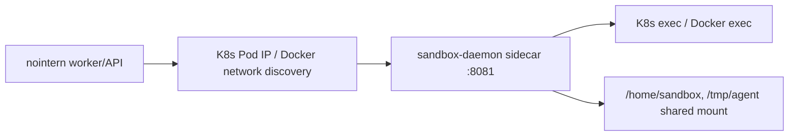
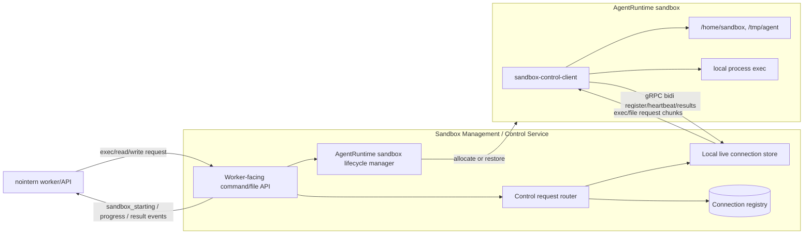
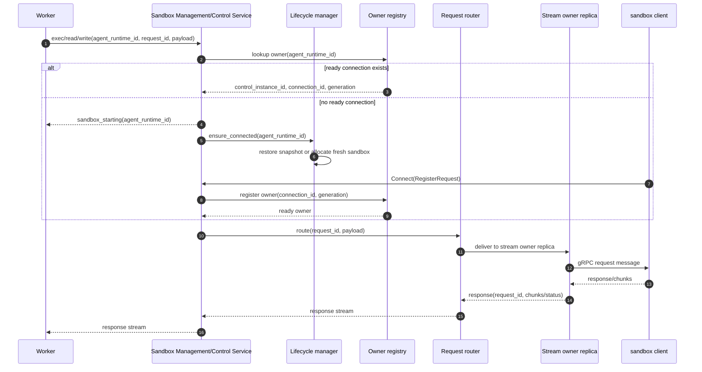
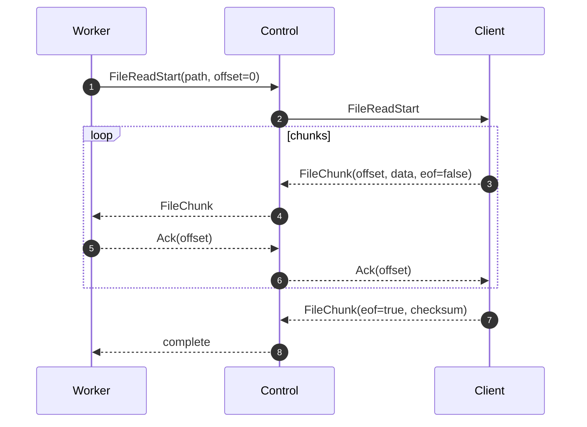

# In-sandbox sandbox client control channel design

## 1. Overview

This document summarizes the nointern sandbox control channel design decided in #3426 / Discussion #3445 / Discussion #3464. Goal is to change current **server-discovered sandbox-daemon HTTP** structure to **gRPC control channel where a client inside sandbox connects outbound to nointern**.

Core conclusions:

- sandbox lifecycle owner is `AgentRuntime`.
- session-bound API of `SessionSandboxManager` is removed by preceding refactor.
- control channel is gRPC bidirectional streaming.
- registration uses `AgentRuntime.id` and `generation` based handshake.
- command/file protocol is streaming-first, and file transfer is supported from v1.
- worker does not directly handle sandbox lifecycle, connection registry, stream owner.
- sandbox management/control service orchestrates sandbox start/resume, waits for connection readiness, and routes to stream owner.
- worker Pod and sandbox stream owner Pod can be different, so worker-to-owner request router is an internal component of sandbox management/control service.
- outbound sandbox client is the only primary mode. Existing sidecar/server-discovered daemon path is migration target.

## 2. User Scenarios

### 2.1 Professional coding agent

Professional coding agent has long-lived `AgentRuntime` sandbox. User requests work through Web raw session or GitHub/Slack event, and agent performs repo checkout, test, build, file creation/modification inside sandbox. nointern worker sends shell/file requests through gRPC control channel, and sandbox client directly controls local POSIX filesystem and local process.

### 2.2 local-machine sandbox

When user runs sandbox client on local machine, client registers outbound to nointern control endpoint. nointern dispatches shell/file work with same AgentRuntime identity, and local file transfer uses chunked streaming.

### 2.3 External sandbox vendor

Sandbox provided by external vendor also does not require inbound calls from nointern. Client inside vendor runtime connects with same register handshake, and nointern uses identical gRPC protocol instead of vendor-specific API.

## 3. Feasibility Check

| Item | Result | Evidence / Action |
|---|---|---|
| gRPC Python dependency | possible | `grpc` import is currently possible in lock/env, but explicit dependency is absent from `pyproject.toml`. Implementation PR adds `grpcio`, `grpcio-tools` or codegen alternative as explicit dependencies. |
| FastAPI/uvicorn and gRPC coexistence | possible | current apiserver exposes only FastAPI/uvicorn `8010`. gRPC can run as separate `grpc.aio` server in same process or separate `sandbox-control` process/Deployment. Design assumes separate internal control service. |
| ALB/Ingress/Service | possible, infra change needed | current public ingress is HTTP path based. If external gRPC endpoint needed, separate host/service and HTTP/2/gRPC backend protocol configuration required. K8s sandbox internal connection can start with ClusterIP gRPC Service. |
| Sandbox NetworkPolicy | possible, change needed | sandbox base egress already allows apiserver `8010`. Add control service port, and remove existing daemon `8081` ingress allowance after migration. |
| AgentRuntime identity | possible, prerequisite refactor needed | current manager accepts session id and resolves runtime id internally. prerequisite phase must make public API runtime-centric. |
| Cross-replica routing | possible, core risk | control replica connected by gRPC stream and worker can differ. Worker does not look at registry, but sends request to sandbox management/control service; internal router in service forwards to owner replica. |
| File streaming v1 | possible, design required | current daemon/client are whole-bytes centered. Need gRPC chunk stream, offset, ack, cancel, atomic write contract. |
| testenv verification | possible | Docker backend can attach loopback in-sandbox client to verify command exec, file read/write, reconnect scenarios. |

Feasibility conclusion: **implementable**. Blocker is not gRPC itself but **AgentRuntime-centric lifecycle ownership** and **cross-pod request routing**. Because worker and sandbox-control endpoint can be separate Pods, architecture where worker directly references stream owner's in-memory connection store or Redis registry is forbidden. Worker only sends command/file request, and sandbox management/control service owns lifecycle ensure and routing.

## 4. Current Structure



Current characteristics:

- `SessionSandboxManager.get_or_allocate(session_id, agent_id, ...)` resolves AgentRuntime.
- Actual backend key is AgentRuntime id, but public API and naming are session-bound.
- `SandboxDaemonClient` calls HTTP `/exec`, `/files`, `/files/list`, `/files/stat`, `/files/glob`, `/files/grep` as whole-body request/response.
- sandbox NetworkPolicy allows ingress from nointern-server namespace to sandbox daemon `8081`.
- sandbox egress allows only apiserver `8010` exception for preStop hibernate.

## 5. Target Structure



Target characteristics:

- nointern does not directly discover sandbox Pod IP.
- sandbox client registers outbound.
- worker sends command/file request based on `AgentRuntime.id` only.
- worker does not know sandbox allocation/restore, connection registry, `control_instance_id`, `connection_id`, `generation`.
- sandbox management/control service performs sandbox start/resume and returns `sandbox_starting` family progress event to worker if there is no connection.
- request router looks up registry inside service and forwards request to stream owner replica.
- router is route-only component. Lifecycle manager owns responsibility for starting new sandbox.
- control service replica uses in-memory connection store only for live streams it owns.
- file read/write and command stdout/stderr are chunked streaming.

## 6. Discussion Points and Decisions

| # | Discussion point | Decision | Rationale |
|---|---|---|---|
| 1 | Control channel protocol | gRPC bidirectional streaming | typed schema, streaming/backpressure, operational capacity acceptable |
| 2 | Runtime identity / registry | `AgentRuntime.id` + `connection_id` + `generation` | matches sandbox lifecycle owner, enables duplicate connection fencing |
| 3 | Registration handshake | `AgentRuntime.id` + `generation` + `connection_id` | active stream judgment through connection fencing and owner registry |
| 4 | Command/file protocol | streaming-first + existing facade | support large file/command stream from v1 while gradually migrating higher-level callers |
| 5 | Capability/migration | convert outbound client to only primary mode | do not maintain sidecar/server-discovered daemon path long-term |
| 6 | Failure/recovery | support file transfer v1, separate command/file fate | separate file chunk/offset resume and command cancellation semantics |
| 7 | Manager ownership | remove `SessionSandboxManager` session-bound API | sandbox belongs to AgentRuntime, not session |
| 8 | Worker responsibility | send command/file request + receive progress event | if worker knows sandbox lifecycle/registry, topology coupling occurs |
| 9 | Management service responsibility | ensure connected → route | because sandbox client connects directly to service, service owns sandbox start/resume and registration wait |

## 7. Architecture Details

### 7.1 AgentRuntime-centric lifecycle manager

Preceding phase changes public API of sandbox manager to runtime-centered form. Final deployment is not a helper inside worker but lifecycle component inside sandbox management/control service. Current code's `SessionSandboxManager` is legacy name with this responsibility, and when moving to service boundary, rename to `AgentRuntimeSandboxLifecycleManager` or `SandboxLifecycleManager`.

Current form:

```python
await sandbox_manager.get_or_allocate(session_id, agent_id, ...)
await sandbox_manager.get_file_storage(session_id)
await sandbox_manager.delete(session_id)
```

Intermediate target form:

```python
runtime = await runtime_resolver.require_runtime_for_session(session_id, user_id)
handle = await sandbox_manager.get_or_allocate(runtime.id, ...)
storage = await sandbox_manager.get_file_storage(runtime.id)
await sandbox_manager.delete(runtime.id)
```

Final target form:

```python
await sandbox_control_client.exec(agent_runtime_id=runtime.id, request=...)
await sandbox_control_client.read_file(agent_runtime_id=runtime.id, path=...)
await sandbox_control_client.write_file(agent_runtime_id=runtime.id, path=..., data=...)
```

This client is worker-facing service API. Worker does not directly call `get_or_allocate()`.

Rules:

- `AgentSession.id` is used only for authorization verification, UI route, events row boundary.
- sandbox allocation, hibernate, restore, control registration, file/exec dispatch use `AgentRuntime.id`.
- After worker verifies authorization and resolves runtime, it sends command/file request to service.
- lifecycle manager is called inside sandbox management/control service.
- class/module naming is corrected to `AgentRuntimeSandboxManager` or `SandboxManager` + `AgentRuntimeSandboxHandle`.
- all paths where existing `session_id` variable actually contains runtime id are cleaned up.

### 7.2 Sandbox Control Service

New control plane has following responsibilities.

1. provide worker-facing command/file API
2. orchestrate sandbox lifecycle ensure(start/resume/restore/fresh allocate)
3. accept sandbox client registration stream
4. update connection registry
5. route worker request
6. correlate request/response
7. handle heartbeat, deadline, cancellation
8. deliver `sandbox_starting`, `sandbox_ready`, `sandbox_unavailable` progress events to worker

Composition choices:

- K8s internal sandbox connects to ClusterIP gRPC Service such as `sandbox-control.nointern-server.svc`.
- local-machine/external vendor uses separate public gRPC endpoint.
- Initial implementation recommends `sandbox-control` component separate from nointern apiserver process, to separate FastAPI HTTP lifecycle and long-lived gRPC stream lifecycle.

worker-facing API and sandbox-client-facing gRPC stream are in same service boundary but have different roles.

- worker-facing API: receives command/file request and returns progress/result stream.
- sandbox-client-facing API: gRPC bidirectional stream where sandbox client connects outbound.
- lifecycle manager: after worker request, starts/resumes sandbox if active connection absent.
- request router: after active connection is ready, delivers payload to owner stream.

### 7.3 Connection registry

Registry record:

```text
agent_runtime_id
connection_id
generation
control_instance_id
connected_at
last_heartbeat_at
capabilities
state: connecting | ready | draining | disconnected
```

Use Redis as active owner registry.

- TTL-based heartbeat expiry is natural.
- sandbox management/control service replicas can share owner routing metadata.
- worker does not directly read or write Redis registry.
- DB stores only long-term lifecycle state (`active`, `hibernated`, `expired`), and short-lived connection state stays in Redis.

### 7.4 Worker request orchestration

In operating environment, worker and gRPC stream owner can be different Pods. Therefore design where worker directly queries control service process-local store or Redis registry does not hold. Worker sends command/file request to sandbox management/control service, and service handles as follows.

1. Look up active connection registry by `agent_runtime_id`.
2. If ready connection exists, deliver request to stream owner replica through router.
3. If ready connection absent, request start/resume from lifecycle manager.
4. Immediately return `sandbox_starting` progress event to worker.
5. Lifecycle manager restores from snapshot if available, otherwise fresh allocate, and if restore fails fresh allocate.
6. Wait with bounded deadline until sandbox client registers outbound to service.
7. After registration, router delivers command/file request to stream owner.
8. On deadline exceeded or lifecycle failure, return `sandbox_unavailable` event and failure to worker.



Router's responsibility is **route only**. It does not call lifecycle manager or start new sandbox. Conversely, lifecycle manager does not directly process command/file payload and only ensures active connection readiness.

`request_id` uses same value for worker request ID and gRPC `request_id`. Internal service/router request carries `connection_id` and `generation` from registry lookup, and owner replica rejects as stale request if it does not match current live connection.

## 8. gRPC Protocol Draft

### 8.1 Service

```proto
service SandboxControl {
  rpc Connect(stream ClientMessage) returns (stream ServerMessage);
}
```

### 8.2 ClientMessage

```proto
message ClientMessage {
  string connection_id = 1;
  string request_id = 2;
  oneof payload {
    RegisterRequest register = 10;
    Heartbeat heartbeat = 11;
    ExecOutput exec_output = 20;
    ExecExit exec_exit = 21;
    FileChunk file_chunk = 30;
    FileStatResult file_stat = 31;
    FileListResult file_list = 32;
    Ack ack = 40;
    Error error = 41;
  }
}
```

### 8.3 ServerMessage

```proto
message ServerMessage {
  string request_id = 1;
  oneof payload {
    RegisterAccepted register_accepted = 10;
    ExecStart exec_start = 20;
    ExecCancel exec_cancel = 21;
    FileReadStart file_read_start = 30;
    FileWriteStart file_write_start = 31;
    FileWriteChunk file_write_chunk = 32;
    FileWriteCommit file_write_commit = 33;
    FileStat file_stat = 34;
    FileList file_list = 35;
    FileDelete file_delete = 36;
    Ack ack = 40;
    Error error = 41;
  }
}
```

### 8.4 File streaming v1

File read:



File write:

- client writes chunks to temp path.
- On `FileWriteCommit`, verify checksum/size then atomic rename.
- On cancel/error, delete temp file.
- Protocol fields allow resume by `request_id`, `path`, `offset`.

Default chunk size starts at 1 MiB. Final value is adjusted by benchmark in implementation PR.

### 8.5 Command streaming v1

Command request:

```text
ExecStart
  request_id
  argv | shell_command
  cwd
  env_overlay
  timeout_secs
  max_output_bytes
```

Command response:

```text
ExecOutput(stream=stdout|stderr, data, offset)
ExecExit(exit_code, signal, timed_out)
Error(code, message)
```

Cancel:

- Send `ExecCancel(signal=TERM)` first.
- Send `KILL` after grace period.
- If stream disconnects, command fate is unknown, so worker reports failure to user and orphan cleanup happens after client reconnect.

## 9. Registration Handshake Design

### 9.1 Register payload

```text
agent_runtime_id
agent_id
workspace_id
generation
capabilities
```

### 9.2 Registration validation

Control service checks following on `RegisterRequest` reception.

1. `agent_runtime_id`, `agent_id`, `workspace_id`, `connection_id` are non-empty
2. runtime is not `expired`
3. generation is at least current runtime generation
4. reject as stale connection if generation lower than existing registry record

On validation success, update registry and set previous connection to `draining` or fenced state.

## 10. Failure/recovery semantics

### 10.1 Separate runtime state and connection state

`AgentRuntime.runtime_state` expresses only long-term lifecycle.

- `active`
- `hibernated`
- `expired`

Connection state stays in Redis registry.

- `ready`
- `draining`
- `disconnected`

Do not change DB enum only because connection drops. Enter hibernate/snapshot flow only when grace period passes and runtime policy requires hibernate.

### 10.2 Reconnect

- When same `AgentRuntime.id` reconnects with higher `generation`, new connection becomes owner.
- Commands in progress on previous connection fail.
- File transfer allows resume by request/offset/checksum.

### 10.3 Worker shutdown

When worker shuts down, worker-facing request stream disconnects. sandbox management/control service cancels in-progress command/file operation by request deadline and, if needed, sends `ExecCancel` or file transfer cancel/error to sandbox client. After worker restart, retry as new request without reusing same `request_id`.

### 10.4 No active connection

No active connection means command/file request cannot be routed immediately, not that worker should directly start sandbox.

Handling rules:

1. service looks for ready owner in connection registry.
2. if owner absent, sends `sandbox_starting` progress event to worker.
3. service-internal lifecycle manager performs restore or fresh allocate according to `AgentRuntime.runtime_state` and snapshot metadata.
4. when sandbox client registers outbound, registry state becomes `ready`.
5. original command/file request routes with same `request_id`.
6. if registration does not happen within deadline, service fails request and delivers `sandbox_unavailable` event to worker.

`sandbox_starting` event does not mean final failure to user. Worker delivers this event as UI/channel progress and waits for final result/error of same request.

## 11. API / Code Change Plan

### 11.1 Python packages

Candidates to add:

- `grpcio`
- `grpcio-tools` or separate proto codegen tool
- `mypy-protobuf`/typed stubs if needed

App runtime dependency uses `==` pin.

### 11.2 Module structure

Suggested paths:

```text
python/apps/nointern/src/nointern/runtime/sandbox/control/
  proto/
  server.py
  registry.py
  router.py
  lifecycle.py
  service.py
  client_adapter.py
  auth.py
  file_stream.py
  exec_stream.py

python/apps/nointern-sandbox-client/
  src/nointern_sandbox_client/
    main.py
    control.py
    files.py
    exec.py
```

Existing `python/apps/nointern-sandbox-daemon/` remains only during migration and is removed finally.

### 11.3 Existing caller migration

| Caller | Current | Change |
|---|---|---|
| shell tool | worker calls `sandbox.exec(session_id)` or daemon-backed facade | worker calls `SandboxControlServiceClient.exec(agent_runtime_id, ...)` |
| workspace browser | daemon file API after session access check | runtime resolve + service client file API after session access check |
| `import_file` | `FileStorage.write_file` buffered | service client streaming write request |
| `present_file` | `FileStorage.read_file` buffered | service client streaming read/export request |
| sandbox lifecycle | manager helper in worker/API process calls `get_or_allocate()` | lifecycle manager inside sandbox management/control service ensures/start/resume |
| hibernate preStop | internal HTTP HMAC | keep, but separate auth secret from control channel |

worker-facing client knows only service API. Following details are hidden as internal service implementation.

- connection registry backend
- `control_instance_id`
- `connection_id` / `generation` fencing
- distinction between local vs remote stream owner replica
- restore vs fresh allocate selection

## 12. Infra Changes

K8s internal:

- add `sandbox-control` Service to `nointern-server` namespace
- add gRPC port, e.g. `8014`
- allow control service port in sandbox egress NetworkPolicy
- remove existing sandbox daemon `8081` ingress NetworkPolicy after migration completes

External/local vendor:

- separate host, e.g. `sandbox-control.nointern.com`
- review AWS ALB gRPC/HTTP2 backend protocol annotations
- public endpoint exposes no runtime information before register validation

## 13. testenv QA Scenarios

### TC-SANDBOX-CONTROL-001: runtime register + shell exec

1. create sandbox-enabled agent with seed
2. inject user message through testenv broker: `run pwd`
3. worker sends exec request to sandbox-control service
4. service detects no active connection and returns `sandbox_starting` event
5. service lifecycle manager starts Docker sandbox client
6. client registers through gRPC
7. shell tool call executes through control channel
8. expected: starting progress, stdout included, run_complete, registry connection ready

### TC-SANDBOX-CONTROL-002: file write/read streaming

1. create 5 MiB test file through Exchange upload
2. streaming write to `/tmp/agent/uploads/blob.bin` with `import_file`
3. streaming read with `present_file` or workspace download
4. verify checksum match

### TC-SANDBOX-CONTROL-003: reconnect + file resume

1. restart sandbox client process during file write
2. reconnect with same AgentRuntime
3. resume by offset and commit
4. verify checksum match

### TC-SANDBOX-CONTROL-004: stale generation rejection

1. attempt register with lower generation
2. expected: registration rejected, registry unchanged

### TC-SANDBOX-CONTROL-005: sandbox persists after session reset

1. perform AgentSession reset/new
2. same AgentRuntime sandbox remains
3. workspace file query succeeds through runtime resolve from new session route

### TC-SANDBOX-CONTROL-006: no active connection starts sandbox

1. send command request to AgentRuntime with no ready connection in registry
2. expected: worker-facing stream returns `sandbox_starting` progress event
3. service lifecycle manager performs restore or fresh allocate
4. original request executes with same `request_id` after sandbox client registers

### TC-SANDBOX-CONTROL-007: worker does not access registry

1. worker-facing service client mock receives only `agent_runtime_id`, `request_id`, payload
2. registry mock is used only in service/router test
3. expected: worker code path has no registry/connection owner dependency

## 14. testenv Impact

- New seed/helper needed:
  - create sandbox-enabled agent
  - query control registry
- devserver changes:
  - start `sandbox-control` gRPC server process
  - start Docker sandbox client process
- scenario lint impact:
  - add handlers for file streaming/reconnect scenarios
- existing file-exchange scenario impact:
  - internal transport of `import_file`/`present_file` changes, but Exchange URI contract remains

## 15. Implementation Plan

### Phase 1 — AgentRuntime-centric sandbox manager refactor

- correct `SessionSandboxManager` naming/API
- separate session access check and runtime resolve
- organize runtime id passing in shell/workspace/file callers
- correct Session sandbox wording in specs

### Phase 2 — gRPC protocol/codegen foundation

- add proto schema
- add generated code workflow
- add `sandbox-control` server skeleton
- unit tests for register/message correlation

### Phase 3 — Connection registry

- implement Redis registry
- duplicate connection fencing
- K8s/Docker env injection

### Phase 4 — Command streaming

- implement sandbox client local exec
- stdout/stderr/exit/cancel streaming
- switch shell tool transport

### Phase 5 — File streaming

- stat/list/read/write/delete streaming
- switch workspace browser/import_file/present_file facade
- implement checksum/atomic write/cancel

### Phase 6 — Infra migration

- add control service port/Service/NetworkPolicy
- add ALB config if public gRPC endpoint needed
- prepare removal of sandbox daemon ingress

### Phase 7 — Remove server-discovered daemon path

- remove `SandboxDaemonClient` path
- remove `nointern-sandbox-daemon` app/image/manifests
- docs/spec promotion

## 16. Risks and Mitigations

| Risk | Mitigation |
|---|---|
| cross-replica stream routing complexity | include Redis registry/request routing in protocol design and do not depend on single control instance local map |
| gRPC ingress operational issues | start with K8s internal ClusterIP and verify external endpoint in separate phase |
| file streaming resume overdesign | v1 includes offset/checksum resume fields, but excludes command resume |
| missed existing session-bound callers | keep Phase 1 as independent PR and remove `SessionSandbox`/`session_id` misuse through spec-review/code grep |

## 17. Alternatives Considered

### WebSocket control channel

It was initial recommendation, but rejected because gRPC operational burden is acceptable and typed streaming contract matters.

### Maintain sidecar mode long-term

It has advantage for custom/root container tamper-resistance, but complicates primary product path. Existing sidecar/server-discovered daemon path is migration target.

### Keep session-based sandbox manager

Session is event/UI boundary that can rotate by reset/new. Sandbox lifecycle and registry must be AgentRuntime-based, so rejected.

## 18. Open questions

Top-level direction is decided, and following items will be finalized as numbers/detailed contracts during implementation.

- Whether gRPC server runs inside apiserver process or as separate Deployment
- Request router implementation method among Redis Streams vs Pub/Sub + response key
- Default chunk size and max in-flight window
- External/local endpoint host and ALB annotation details
