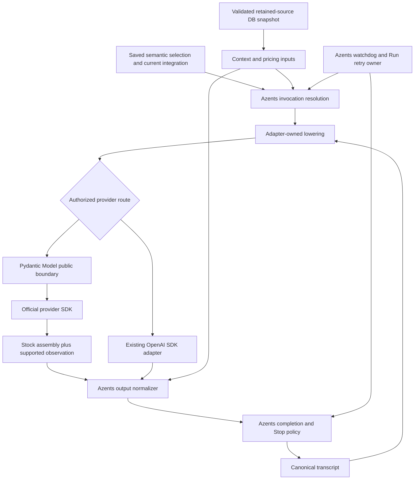

# Provider-Library Replacement Design

- Snapshot: `inference-260930`
- Document reference: `inference-260930/DESIGN`
- Design revision: `1`
- Scope: design only; implementation and deployment require a separate request.
- Approval: approved by the requester on 2026-09-30 (KST) for revision `1` and the exact authority ID set below.

## Intent and Authority

This Design implements the confirmed [inference-260930/REQ](../requirements/inference-260930-provider-replacement.md) through the five accepted decisions in [inference-260930/ADR](../adr/inference-260930-provider-replacement.md). It removes the executable LiteLLM dependency, adopts the requester-selected Pydantic AI model layer for the routes that need replacement, and retains Azents execution ownership. It does not replace the Agent engine or migrate already-independent OpenAI inference merely for uniformity.

The requester owns all five accepted decisions and final Design approval. There are no unresolved product questions in the confirmed scope. Conditional implementation evidence below is not permission to change provider support, endpoints, or completion semantics.

Current behavior authorities are the [Agent Execution Loop Spec](../spec/flow/agent-execution-loop.md), [Conversation Spec](../spec/domain/conversation.md), and [Model Catalog Spec](../spec/domain/model-catalog.md). Applicable project constraints include supported public SDK APIs, immutable executed migrations, typed ingress, deterministic synchronization, and logging-based bounded diagnostics. These sources remain authoritative where this snapshot does not explicitly change behavior.

## Current Behavior and Gaps

Repository evidence was inspected at `fd0093423a3b7ecf714a67603eabb339e1962bef`.

- `engine/events/engine_adapter.py` routes OpenAI API-key and ChatGPT OAuth inference through the official OpenAI SDK; the other eight provider identities use LiteLLM Responses conversion. Titles and compaction also contain the split.
- LiteLLM remains an executable dependency in native OpenAI cost calculation, common Responses usage handling, context-window fallback, catalog source schema/map/version access, credential/runtime-model conversion, and exception classification. Replacing one sampling call cannot satisfy REQ-1.
- Canonical events already own history. `AdapterLowerer`, `ModelAdapter`, `AdapterOutputStream`, and `AdapterOutputNormalizer` in `engine/events/protocols.py` provide a generic seam for adapter-owned request/event types.
- Successful terminal evidence gates durable output. The watchdog and Run executor own deadlines, Stop, retry budgets, model candidate progression, reconstruction, and cleanup. A common library response or stream EOF is not sufficient completion evidence.
- Catalog identity currently contains an execution-library target, including for already-native OpenAI and image routes. Conversation entries also store and expose a runtime model string. Saved Agent selections separately retain semantic provider, integration, raw model ID, and capability snapshots.
- Source ingestion already stores validated, content-addressed remote JSON snapshots with last-good retention and fenced publication. Its retained data source is distinct from its removable Python package.

Backend paths below are relative to `python/apps/azents/src/azents/` unless a repository-root path is given. The current Specs are not edited to describe unimplemented behavior in this design-only exercise.

## Requirement and Decision Traceability

| Requirement | Accepted decisions or retained authority | Design mechanisms | Principal verification |
| --- | --- | --- | --- |
| REQ-1: complete executable removal | ADR-D1, ADR-D2, ADR-D3, ADR-D4, ADR-D5 | M1, M2, M7, M8, M9, M10, M13 | Package-free startup and full operation matrix; dependency and import absence |
| REQ-2: provider and credential continuity | ADR-D3, ADR-D5; retained integration ownership | M2, M3, M10, M11 | Ten provider identities, operation eligibility, exact cloud/model IDs, credential refresh and saved-selection continuation |
| REQ-3: history and replay | ADR-D4, ADR-D5; Conversation Spec | M1, M4, M5, M10 | Existing history, exact native compatibility, cross-adapter/model fallback, no tool re-execution |
| REQ-4: tools and output fidelity | ADR-D3, ADR-D4; current tool semantics | M2, M4, M5 | Client/hosted tools, native data, multimodal and route-specific declaration fixtures |
| REQ-5: execution correctness | ADR-D3, ADR-D4; Agent Execution Loop Spec | M1, M3, M5, M6 | Terminal/EOF matrix, watchdog, Stop, hidden dispatch, retry, title and compaction failures |
| REQ-6: catalog and context | ADR-D1, ADR-D5; Model Catalog Spec | M7, M8, M10, M11 | Source validation/fencing, read-without-fetch, capability snapshots, consistent context math, image regression |
| REQ-7: usage, cost, diagnostics | ADR-D2, ADR-D4 | M5, M9, M12 | Content-free estimator, usage accumulation, provenance, nullable prices and safe errors |
| REQ-8: verifiable cutover | ADR-D1 through ADR-D5 | M4, M7, M9, M10, M11, M12, M13 | E2E matrix, migration fixtures, removal inventory, explicit live prerequisites |

## Architecture and Ownership

### Integration boundary

Pydantic AI is a model interaction and assembly layer, not another Agent runtime. Invoke explicit model objects through their public request/request-stream boundary. The convenience direct API is acceptable only with equivalent explicit model, request, and instrumentation behavior; it cannot infer providers from untrusted or overloaded model strings.

Do not introduce a Pydantic Agent graph, tool executor, approval policy, history store, automatic model candidate selector, or independent retry owner. Azents continues to execute client tools, persist canonical events, rebuild attempts, and decide durable admission.

### Source-of-truth boundaries

- **Execution authorization:** saved semantic provider/model/integration and capability snapshot, plus existing call-time integration and transport constraints. Library profiles cannot enlarge support or refresh saved intent.
- **Credentials and visibility:** existing integration services and account/provider discovery. Adapter construction consumes an already-authorized operation-scoped credential/configuration view.
- **Conversation:** canonical stored events. Adapter-native artifacts are subordinate, opaque replay optimizations.
- **Metadata:** validated retained-source DB snapshots, with provider/account-specific precedence unchanged. No request-time remote fetch, process-local package map, or bundled replacement source is authoritative.
- **Prices:** a dedicated normalized contract derived from the captured validated source snapshot. Provider-returned charges have separate provenance; library price estimates have no automatic authority.
- **Lifecycle:** Azents operation attempt and watchdog. Native observation supplements evidence for that same physical dispatch; it creates neither a second operation nor a second transcript.

### Invocation data

Resolve one immutable invocation view containing semantic provider, exact raw model identifier, integration/configuration generation, authorized capabilities and options, operation kind, model candidate, timeout policy, and attempt identity. Credentials are separate secret-bearing inputs and are excluded from persisted invocation diagnostics. Resolve model-family and SDK inputs explicitly at this boundary.

Capture a locally available source snapshot reference for missing context metadata and pricing. A retry resolves a new view under the existing retry contract; it may capture a newer authoritative snapshot. A single physical operation never changes pricing provenance while streaming.

The lowerer produces adapter-owned messages, model settings, and request parameters. It does not turn a LiteLLM-prefixed string into a universal execution identifier. The normalizer accepts common parts plus typed native observations, emits existing live projections, and constructs canonical durable output only after the completion gate.

## Provider and Model-Family Dispatch

The matrix applies to sampling, session titles, and compaction wherever the current operation is eligible. Subagent inference uses the same selection/dispatch boundary. Credential identity is not inferred from the model developer.

| Provider identity | Integration and endpoint boundary | Model interaction and preservation obligations |
| --- | --- | --- |
| OpenAI API key | Existing OpenAI integration and configured SDK behavior | Keep the existing native OpenAI adapter, including its authorized HTTP/WebSocket continuation behavior; replace only shared package-dependent metadata, cost and errors |
| ChatGPT OAuth | Existing refresh, account headers, backend endpoint and model visibility | Keep the existing native OpenAI adapter and account behavior; do not send the OAuth token to a generic OpenAI endpoint |
| Anthropic API key | Official Anthropic client with existing credential/endpoint semantics | Anthropic model assembly, cache/thinking/tool lowering, native message terminal and supported supplementary artifacts |
| Gemini API key | Official Google SDK using the API-key configuration | Google model assembly with existing schema, grounding, tool, usage, file and thought-signature behavior |
| AWS Bedrock | Existing region, access-key/secret and optional role semantics through official AWS SDK facilities | Bedrock model-family-aware lowering, exact model ID or ARN, supported Converse/native options, event-stream completion and cleanup; verify family-specific tools rather than applying one generic profile |
| Google Vertex AI | Existing project, region and service-account credentials | Explicit Google-publisher and Anthropic-publisher paths using supported official Google or Anthropic cloud clients; retain exact publisher/resource identifiers and family-specific tools |
| xAI API key | Existing configured developer HTTP endpoint and key | Responses HTTP through the Pydantic public Model boundary and official OpenAI-compatible SDK; explicit xAI profile and exact request lowering |
| xAI OAuth | Existing token refresh and configured Azents inference endpoint; distinct account identity | Same HTTP protocol decision, separate credentials/visibility/entitlement; no CLI-proxy endpoint migration or gRPC fallback |
| OpenRouter API key | Fixed existing OpenRouter endpoint and application headers | Preserve the current Responses API envelope and options, including routing/parameter requirements, hosted search and reasoning/native data; do not silently select a Chat Completions-only model wrapper |
| Kimi OAuth | Existing refresh, device identity, compatibility headers and configured endpoint | Supported OpenAI-compatible SDK/model boundary with Kimi-specific lowering; preserve current model dialect, options, errors and credential semantics |

Stock models are used where they satisfy the route contract. ADR-D4 authorizes a bounded public `Model`/`StreamedResponse` implementation when stock lowering or observation does not preserve that contract, including exact xAI and OpenRouter Responses behavior. This is a fixed route implementation, not a selectable alternate mode or failure-triggered fallback.

A stock model profile narrowing current supported behavior is a parity defect to fix, not authority to hide models, disable existing tools, change envelopes, or silently reinterpret a model ID. Cloud family dispatch must cover the currently supported family inventory before that route is cut over. Unknown identifiers retain existing bounded rejection behavior rather than arbitrary prefix stripping.

### Model identifiers

Keep the selected provider model ID exactly as saved. Translate only a documented, provider-owned representation at its specific SDK boundary. OpenRouter publisher paths, Bedrock ARNs/inference profiles, and Vertex publisher-qualified resource names are not generic slash-separated prefixes to remove.

Metadata source keys are a separate source-specific mapping. The retained dataset may use its existing namespace and alias vocabulary without recreating LiteLLM runtime dispatch. A source lookup miss is not permission to rewrite the execution ID or choose a different model.

## Transcript, Tools, and Native Data

### Canonical lowering and replay

Keep the current compatibility key `adapter:native_format:provider:model:schema_version`. New adapter-owned representations receive truthful new identities. Existing `openai` artifacts remain owned by the unchanged native adapter; historical `litellm` artifacts are neither relabeled nor passed to a new model implementation as compatible objects.

On any key mismatch, reconstruct input from canonical events. Preserve tool call/result pairing, order, semantic hosted-tool fallback, file references, and the current cross-model reasoning rules. Native reasoning signatures, encrypted/redacted reasoning and provider details stay opaque and are replayed only under exact compatibility. They never become visible reasoning text.

A library message JSON round-trip is only serialization evidence; it does not grant replay authority. Completed incompatible custom-tool calls retain the existing bounded non-executable historical projection instead of being converted to active JSON-function calls. Orphan results are not dispatched. Historical tool calls are never executed again merely because a representation changed.

### Tool and content mapping

Translate currently authorized client-tool definitions, supported custom or JSON-function dialect, arguments and call/result IDs. Keep Azents client-tool execution, budgets, filtering and approval outside the model library. Preserve xAI's current tool declaration limit, the Google Vertex function budget, and OpenRouter's V4A JSON-function compatibility policy from the existing tool-budget/compatibility code.

Translate currently supported hosted-tool activity into the existing `provider_tool_call` semantics with readable input/output, references, excerpts and stable metadata. Supplement omitted native annotations inside the adapter-owned artifact where required; this does not add a new citation UI or canonical citation feature.

Preserve supported multimodal lowering and the existing file materialization/authorization boundary. Images and other binary content use existing file outputs and attachment ownership rather than being copied into errors or logging. Client-executed image generation remains on its independent SDK route.

## Stream Lifecycle, Terminal Proof, and Recovery

### Observation-first assembly

Each replacement-model call has an attempt-local observation state, associated with its physical dispatch. It records safe dispatch identity, parsed-event activity, provider-specific success/failure evidence, final usage and only the native information authorized for artifacts. A Run can own multiple such calls; the state cannot leak across a tool turn, retry, title compatibility transition or concurrent operation.

Use supported official SDK middleware, client injection, custom transport, or documented model extension interfaces. Tee a single unchanged stream when raw observation is necessary; never consume the SDK body twice. Observation preserves ordering, backpressure and SDK input bytes. Buffer only bounded incremental framing and required authorized artifacts; do not collect an unbounded second response or frame log.

Concrete equivalent hook placement is agent-owned. Private stock-model attributes, monkeypatches, a maintained fork and handwritten provider transport are outside this Design. If supported observation cannot meet the contract, the accepted bounded public Model extension owns that route's translation.

### Completion evidence

- Responses routes require their successful response terminal, not only output-item completion, stop reason, common `complete` state or EOF.
- Anthropic routes require the native message completion contract, including the terminal marker; a stop-reason delta without terminal completion is insufficient.
- Google routes use the SDK/provider's candidate completion semantics and explicit error/finish classification. They do not invent a Responses-style event name or infer success from any candidate text.
- Bedrock routes observe the applicable message-stop evidence, explicit stream errors and trailing metadata/usage, with stream closure accounted for. A content block stop alone is insufficient.
- Non-streaming title/compaction paths validate the corresponding response success contract; receiving a parsed object alone does not override a provider failure or interrupted operation.

Keep semantic output live while provisional. On normal termination, require successful route evidence, no overriding explicit failure, and existing Stop/admission checks before durable completion. Complete usage after trailing terminal metadata has been consumed within the operation deadline. Duplicate terminal/usage events must not duplicate history or costs. Malformed streams and content-only EOF fail under the existing classified stream-failure contract; observer programming errors remain internal errors.

After native success is established, retain the exact boolean `end_turn` extension and existing `needs_follow_up` semantics. `false` requests a following model step; `true` completes after admitted client tools have executed. Absent or malformed `end_turn` uses the existing canonical foreground-client-call fallback. Every admitted client call executes even when follow-up is false; incomplete calls are never admitted. Common model `state`, finish reason or tool parts do not independently replace this policy.

### Watchdog and dispatch ownership

Retain the existing timeout defaults and scopes: connect 15 seconds except OpenRouter 60 seconds, parsed-event idle 300 seconds, absolute attempt 1,800 seconds, and close grace 5 seconds, subject to existing operation policy. A parsed event refreshes idle even when it produces no semantic delta. Raw network bytes alone do not establish parsed-event progress.

Observe response-handle acquisition at the supported SDK boundary for the same dispatch and explicitly hand over from connection acquisition to stream iteration. Stock model context-entry can peek the first parsed chunk before yielding, and a lazy Google iterator can defer the actual HTTP call; neither context-entry nor the first common/semantic event is a valid substitute for the response-acquisition signal. Keep the absolute deadline anchored to operation acquisition and the existing idle deadline scope throughout; do not reset it at the handover.

Keep the watchdog as the liveness-policy owner. Configure supported SDK transport timeouts so library read/write/pool limits or automatic reconnect cannot introduce a competing stream deadline. Preserve the existing connect-only HTTP and watchdog-owned WebSocket acquisition behavior on native OpenAI routes; establish equivalent supported lifecycle control for replacement cloud transports.

The operation owns opening, iteration, cancellation and close. Stop wins races with timeout/failure and follows ordinary interrupted-output behavior, not failed-run retry or replay. Noncooperative resources stay under the existing cleanup registry. Thread-backed AWS work requires explicit cancellation/close evidence; cancelling an awaiting coroutine alone is not proof that its SDK worker stopped.

Disable SDK retries and prevent model-level recovery re-requests from escaping Azents attempt ownership. Count/control physical generation dispatches at the supported SDK boundary. If stock recovery cannot be disabled while retaining required behavior, implement that route using the accepted public Model boundary. Do not disguise an extra recovery call as native observation. Credential refresh and discovery remain their existing separate service operations, not generation attempts.

Block an unauthorized second generation before network I/O. For failure-triggered library recovery, preserve the original safely mapped provider failure; do not replace it with an invented remote-provider failure attributed to the local dispatch guard. A local guard or observation defect without a classified original provider failure retains internal classification.

This dispatch control does not remove documented Azents-owned multi-call sequences: title structured/plaintext compatibility transitions remain service-owned, and the unchanged native OpenAI adapter retains its same-deadline full-request recovery for a missing previous response and its existing transport/candidate recovery rules. Assert the expected dispatch count for each authorized sequence, rather than imposing one request for an entire Run or title workflow. No new replacement-model recovery sequence is authorized.

Classified provider failures retain the full existing Run retry budget, including diagnostic categories described as nonretryable. Preserve bounded attempt history, delay progression, candidate selection, authoritative re-resolution and Stop checks. Unclassified internal failures remain separate. No new fallback transport, retry budget or operator switch is introduced.

### Auxiliary operations

- **Titles:** retain operation eligibility, structured-output/plaintext fallback policy, provider parameter requirements, timeout behavior and deterministic fallback title. Use the same safe classification and dispatch control as primary inference.
- **Compaction:** retain selected compaction model, context budget, blocking failure semantics and current retry behavior. Never admit an incomplete summary as successful compaction.
- **Subagents:** share provider resolution, context fallback, credentials and operation lifecycle; no separate source authority or implicit library Agent loop.
- **Native OpenAI continuation:** existing HTTP/WebSocket state and native continuation policy remain unchanged. Shared cost/context package removal must not reset or broaden that policy.

## Catalog Source and Context Resolution

### Retained source ingestion

ADR-D1 retains the configured public JSON dataset. Implement Azents-owned typed ingestion for the fields actually consumed, alias expansion and explicit provider/cloud mappings. Do not import LiteLLM types, URL constants, installed version, bundled map or backup files.

Retain current content-addressed source snapshot IDs/hashes, source URL/fetch provenance, latest/current references, sync attempt history and last-good publication behavior. Existing package-version evidence is historical truth. The inspected source snapshot column is already nullable: new ingestion records `null` for the unavailable installed package version. Update service/repository input typing that still requires a string, without a gratuitous schema change or fabricated version. Preserve other provenance.

When the same content hash is collected again, keep the existing row ID and historical package-version evidence instead of overwriting it with the new ingestion's `null`. That historical value is not evidence of a currently installed package. Retain the existing validated-remote promotion and current-fetch bookkeeping without mutating historical payload content or conflating old version provenance with the new collection attempt.

Malformed/unavailable source, invalid aliases and unexplained reductions continue to fail/quarantine without promoting candidate data. Preserve the existing combined reduction threshold of at least 50 models and at least two percent, complete added/removed-ID diagnostics, provider-level counts and publication fencing. No installed or bundled fallback becomes authority.

Preserve provider/account precedence: Bedrock and Vertex project from the validated source; xAI listing is authoritative and missing enrichment cannot hide a listed model; ChatGPT, Kimi, OpenRouter and deterministic projections retain their existing independence from source matching. Library profiles do not overwrite persisted capability snapshots.

Ordinary reads and operation resolution use local validated DB state. Existing eligible background sync scheduling remains separate from a read result. Missing price evidence never forces a remote fetch or blocks otherwise valid inference. Existing catalog states without a successful source remain explicit; this Design does not fabricate catalog entries to mask missing prerequisites.

### Context metadata lookup

Replace `get_model_info` with a source-key-aware lookup over the validated snapshot. Keep normalized saved capabilities authoritative. Read only missing maximum metadata; do not refresh capabilities or user intent from a library profile.

Preserve the current resolution order and math:

1. Use a supplied normalized maximum when available.
2. Otherwise, when a provider default exists, use the greater of that default and valid positive source maximum metadata. If source maximum metadata is absent, retain the provider default itself.
3. With neither a normalized maximum nor a provider default, use valid positive source maximum metadata or, if that is also absent, the 128,000-token fallback.
4. A missing default uses the resolved maximum. An explicit user cap is clamped to the maximum; absent user intent uses the provider default.
5. Retain the existing main/compaction minimum and auto-compaction threshold calculations.

Pass the resolved metadata through all consumers: main/compaction invocation resolution, subagents, worker calculations and Agent API/UI context displays. Preserve nullable metadata versus resolved effective limits. Deterministic tests must show runtime and display results agree without a source fetch.

## Usage and Pricing

### Normalization

Normalize supported input, output, total, cache-read, cache-write and reasoning tokens from actual SDK/provider fields. Preserve progressive accumulation and final replacement rules. Provider-family accounting must distinguish whether cache or reasoning tokens are included in a total so they are not billed twice. Do not infer tokens from model output content.

Retain current nullable `cost_usd` consumption. Add optional typed cost provenance to the usage event/DTO contract where needed to distinguish a provider-reported charge from an Azents estimate. Its allowlisted contents are method (`provider_reported` or `estimated`), applicable provider/model/tier, source snapshot ID/hash for estimates, and estimator schema/version. Unknown or historical unlabeled costs remain unlabeled; no migration retroactively attributes them. Existing public consumers remain compatible with absent provenance, and generated contracts are regenerated with the change. This carries ADR-D2 evidence, not a new cost-detail UI.

Accept a provider-reported charge only from an explicitly mapped, validated native field. A library calculation or former `_hidden_params.response_cost` value is not automatically a provider charge. Preserve provenance in usage/event projections even where the unchanged UI displays only an amount; do not add a charge and estimate for the same usage or relabel a mixed aggregate as wholly provider-reported. No new cost presentation is introduced.

### Snapshot-backed estimator

Normalize immutable pricing input from the retained validated source, separate from capability schemas and xAI's bounded enrichment. The contract includes source identity/hash, exact provider/model key mapping, currency/unit, service tier, applicable context thresholds, token/cache rates, cache-write duration where applicable, and supported tool/media billing rules. Missing/invalid components are represented explicitly rather than silently defaulted to standard token pricing.

Capture that view once per operation. A process-local derived cache may be keyed by source hash and normalization schema version; it is disposable and is not a second authority. Cold start reconstructs from the last-good DB snapshot. No separate remote price refresh, bundled table, `ModelResponse.cost()` or transitive pricing package is consulted as authoritative data.

The estimator consumes normalized usage and minimal billing metadata, such as tier and known billable tool counts, never prompt/response bodies. Use finite nonnegative validated numeric rates and deterministic precision internally, converting to the existing output representation at the boundary. Preserve `fast` to `priority` normalization, supported cache and context-threshold behavior, and applicable media/tool rules.

If the applicable rule or any required billable component is unavailable, unmatched, invalid or unsupported, the total estimate is `null`; a partial subtotal is not labeled a complete estimate. Unsupported priority never falls back to standard. Missing price evidence does not turn a valid model response into failure. Internal estimator defects remain observable internal faults rather than an unrestricted catch-and-zero policy.

Historical source payloads can be normalized lazily and locally. They are not rewritten, relabeled, or fetched again solely to resume inference. Fixtures must prove bootstrap, hash stability during streaming, source refresh between attempts, and unknown behavior for snapshots without sufficient prices.

## Persistence and API Cutover

### Active contract after ADR-D5

Logical catalogs retain provider, purpose, scope/integration ownership, lifecycle, visibility, configuration generation and source/projection links. Remove `lowerer_target` from logical catalogs and conversation entries, the target-dependent uniqueness dimension, and the unused enum. Remove stored `runtime_model_identifier` from active conversation entries and its public response field.

Update repository queries/upserts, service models, all source/integration projections, selection validation and diagnostics, API DTOs, OpenAPI and generated clients together. New selection diagnostic snapshots omit the obsolete descriptors. Existing semantic Agent selections are not rewritten and require neither re-selection nor reconnection.

Remove exact obsolete execution descriptor keys from newly produced and existing active `projection_metadata`, including last-good entries served immediately after upgrade. Keep all unrelated source/projection evidence. Do not recursively scrub strings or historical payloads simply because they mention LiteLLM.

### New migration

The inspected schema head is `841e7188d527`; implementation must recheck the current head and add a new migration. The executed baseline and subsequent executed migrations remain unchanged.

The migration must:

1. Preflight the post-removal uniqueness identities: system `(provider, purpose)` and integration `(provider_integration_id, purpose)` under their existing scope predicates. Unexpected collisions fail with bounded identifiers before destructive changes; never merge/delete catalogs to make the constraint pass.
2. Preserve logical catalog, source snapshot, projection snapshot, sync attempt and entry identities and all current/latest/source links. Preserve foreign keys and configuration-generation eligibility.
3. Replace target-dependent unique indexes and coordinate all `ON CONFLICT`/lookup contracts with the target-free identities.
4. Remove exact descriptor keys from active conversation projection metadata using a bounded schema-aware transform. Historical source payloads, old Agent diagnostic `model_snapshot` JSON and conversation artifacts are excluded.
5. Drop the conversation runtime-ID column, both target columns, and then the now-unused enum. Retain the already-nullable source package-version column and its historical values.
6. Validate remaining constraints, row/link preservation, active descriptor absence and image catalog behavior before the cutover is considered complete.

The migration requires no remote model discovery, source synchronization or credentials. Local state suffices. Run it transactionally under the repository migration mechanism so a failed preflight or DDL leaves no partially published contract. Test both fresh-database migration and upgrade of representative pre-cutover databases.

### Rollout and recovery boundary

This is one coordinated schema/API/backend/generated-client cutover, not an old/new runtime compatibility mode. Deployment planning must prevent old workers and catalog writers from accessing the descriptor-free schema; drain existing work and stop incompatible writers before applying the migration. This is a release prerequisite, not authorization to alter live infrastructure during design.

Before deployment, capture a tested database backup and the matching application/schema versions. Before destructive migration commits, failure rolls back the transaction and the old release remains applicable. After successful cutover, do not roll an old binary directly onto the new schema. Prefer a forward fix. A rollback requiring restoration must use a coordinated compatible database/application restore and explicitly account for writes since the backup; it must not claim lossless rollback or synthesize historical execution descriptors. No destructive downgrade or automatic restore is authorized here.

Canonical transcript fallback preserves conversation readability across adapter changes; it does not make arbitrary database schemas backward compatible.

### Shared image functionality

Image entries share logical catalog identity but do not gain a Pydantic conversation adapter. Preserve SDK execution, default-only behavior, explicit model selection, integration permissions, discovery, generation fencing, publication and visibility. Include image catalogs in uniqueness/migration fixtures and API regressions. Do not rename their target to `pydantic_ai` merely to satisfy a removed enum.

## Security, Diagnostics, and Operations

Existing user/workspace/integration authorization remains before dispatch. Preserve enabled/deleted checks, refreshed credentials and configuration-generation checks on each authoritative re-resolution. An endpoint override is used only through the existing provider configuration contract; no automatic endpoint discovery or credential fallback is introduced.

Map known SDK/model failures into the existing bounded provider failure vocabulary. Do not persist raw exception strings, response bodies, frames, headers, cookies, tokens or opaque reasoning. Observer/estimator bugs retain internal classification. Structured diagnostics may contain safe provider/operation identity, failure code, attempt number, elapsed phase and source snapshot identity, within existing logging/redaction policy.

Disable additional model-library prompt/output instrumentation and automatic tracing/export. Use the current logger integration for operational errors. Synthetic canary tests must inspect logs, durable events, tracing and failed tool/response output for leakage. Authorized native artifacts are distinct from logs and remain under existing storage/access policy.

Canary coverage includes SDK wire logging and chained exception cause/context, not only the top-level sanitized error message. Preserving internal traceback frames must not preserve untrusted credential-bearing exception text.

Operational signals remain operation outcome, timeout phase, retry progression, provider-safe failure code, catalog/source attempt status, null-cost reason and cleanup outcome where applicable. These are extensions of existing diagnostics, not a new monitoring service or admin control surface. There is no new runtime mode, feature flag, credential flow, source selector or gRPC selector. Redis availability cannot become a correctness requirement for observation, source authority or pricing.

## Test Strategy

### E2E-first plan

User-visible preservation is primarily verified through real Azents API/worker/persistence/event paths against deterministic provider fixtures. Existing browser E2E covers history, Stop and presented usage/errors where applicable. Focused unit/SDK tests establish byte-level lowering and native proof; they complement rather than replace E2E.

The requester clarified REQ-8 on 2026-09-30 (KST): keep E2E to core real-product flows and place complex condition combinations, native/SDK details, and boundary matrices in unit/contract tests. The table below maps required behavior, not a mandate to expand every supporting conditional permutation into E2E. Use representative core E2E cases and focused lower-level evidence together, retaining existing core product-boundary assertions.

Run package-free bootstrap first, then operation/provider coverage, continuity and execution-control cases, catalog/context/pricing cases, and finally migrated-database E2E. Reuse and re-own existing watchdog/provider/catalog fixtures instead of deleting their acceptance assertions with the old adapter.

| E2E family | Required cases and observable result | Requirements | Supporting deterministic evidence |
| --- | --- | --- | --- |
| Provider/credential operations | All ten identities through sampling/title/compaction where currently eligible; subagent invocation; selected model/options and endpoint/header identity preserved | REQ-1, REQ-2, REQ-5 | Per-route SDK request/response fixtures, separate xAI API-key/OAuth, Vertex Google/Anthropic and supported Bedrock families |
| History and native fidelity | Continue a seeded pre-cutover conversation; same-native replay, cross-adapter/model fallback, opaque reasoning, completed tool pairs, supported media and hosted references | REQ-3, REQ-4 | Exact-key positive/negative matrix; no native parsing by event core or historical tool re-execution |
| Tools and provider output | Client tools, hosted search, supported custom/JSON-function dialects, limits, malformed/split arguments and references remain correct | REQ-4 | Wire assertions, native supplemental data, supported capability matrix; reject unsupported library-only features |
| Terminal and watchdog | Content-only/stop-only EOF fails; valid terminal succeeds; explicit failure overrides partial output; all-event idle, connect and absolute deadlines remain distinct | REQ-5 | Controlled clock and stream barriers, late usage, malformed chunks, duplicate terminals and nonsemantic parsed events |
| Stop and retry | Stop wins timeout/failure; no retry/replay after Stop; full classified-failure budget and candidate progression; expected physical dispatch counts for each authorized sequence, with no hidden library re-requests | REQ-5 | SDK retry/recovery counters, native OpenAI continuation recovery, explicit title mode transitions, concurrent attempts, noncooperative close and AWS thread cleanup |
| Titles and compaction | Structured/plaintext title behavior and deterministic fallback; blocking compaction failure and valid summary admission | REQ-2, REQ-5 | Existing required watchdog title/compaction tests adapted to replacement boundary |
| Catalog and context | Status-aware reads do not fetch remotely; failed sync retains last-good; optional enrichment miss keeps xAI visible; capability snapshots and runtime/UI limits agree | REQ-6 | Source reduction/fencing fixtures, default/max/cap/missing metadata and main/compaction cases |
| Usage and cost | Progressive/final token fields remain correct; reported charge differs from estimate; unsupported priority/missing price yields null without execution failure | REQ-7 | Golden cache/context/tier/tool/media calculations, no content input, fixed snapshot provenance |
| Upgrade and collateral behavior | Old saved selections and image catalogs work after local-only migration; IDs/FKs retained; new API/projection output omits descriptors | REQ-2, REQ-6, REQ-8 | Fresh and upgraded PostgreSQL fixtures, uniqueness collision abort, generated schema/type assertions |
| Privacy and absence | Secret/opaque canaries absent from errors/traces/logs; application starts and matrix runs without LiteLLM | REQ-1, REQ-7, REQ-8 | Dependency/import/config/generated-surface audit and bounded failure assertions |

### Fixture and seed requirements

- Provide deterministic native endpoints/SDK stubs for Responses, Anthropic Messages, Google and AWS event streams. Match the real provider envelope rather than making all fixtures speak an artificial universal Responses dialect.
- Seed all ten integration identities with synthetic credentials, saved selections/capabilities and configuration generations. Include refresh success/failure, disabled/deleted integration and owner mismatch. Synthetic token values never enter golden evidence.
- Seed old canonical conversations with `litellm` and `openai` artifacts, new exact-match and mismatch artifacts, opaque signatures, custom/function tool pairs and file/hosted-tool references. Preserve historical diagnostic snapshots as explicit migration assertions.
- Seed valid, absent, malformed and reduced source snapshots; aliases; exact cloud/publisher IDs; last-good catalog/attempt links; concurrent publication generations; tier/cache/context/tool/media pricing; invalid and unavailable components.
- Verify re-ingesting an existing source hash preserves historical version evidence while a new hash records no installed package version. Include a provider-default-only context case with both maximum inputs missing so the default is not replaced or reduced by the 128,000 fallback.
- Seed both conversation and image catalogs in the pre-cutover schema. Include unexpected post-removal identity collisions, stale generations, failed-without-snapshot and last-good states.
- Use authoritative state barriers and controlled clocks, not sleeps, for dispatch, parsed-event, Stop, retry and close ordering.
- Include response headers/handle acquired before the connect deadline with the first parsed event arriving after that deadline but within the idle/absolute bounds: this must not become a connect timeout. Also include parsed nonsemantic events while stock assembly emits no common delta.

### Testenv and prerequisites

Existing `testenv/azents` provides fixture/prerequisite support to the E2E suite. Extend its provider fixture support where native envelopes and refresh/stream behavior cannot be expressed today. Testenv-only diagnostics are appropriate for an isolated SDK parser or cloud-thread cleanup failure, but cannot substitute for the required public-path preservation matrix.

Record a prerequisite snapshot for each run: application commit, Design revision, schema revision, Python/library/SDK versions, fixture version/hash, provider identity and model family, operation, source snapshot hash, configuration generation and whether credentials are synthetic or authorized live credentials. Record credential availability/scope status, never the credential itself. Store endpoint category and necessary safe configuration identity, not private endpoints or secrets in public reports.

### Evidence and CI policy

Required CI runs deterministic provider E2E, targeted unit/contract tests, fresh and upgrade migrations, generated-client consistency, and package/import absence. It needs no paid provider credentials. A missing required deterministic fixture is a test failure, not a skip. Preserve the existing required E2E ownership and avoid making the cutover green by deleting failing coverage.

REQ-8 requires E2E time strictly below 110% of the comparable main baseline; a slowdown of 10% or more rejects delivery. Compare equivalent runner resources and enabled gated suites, include fixture/setup/teardown and new producer overhead, and preserve baseline plus unchanged-SHA experiment artifacts. Complex conditions remain unit/contract coverage, not additional E2E permutations. Insufficient or incompatible timing evidence is inconclusive, not a passing performance claim. This requester-defined delivery-quality clarification leaves Design revision 1 and material mechanisms M1–M13 unchanged.

Evidence includes command, exact commit/schema/dependency versions, case/provider/operation identity, expected versus observed terminal/usage/history/dispatch count, pass/fail/skip reason, and redacted event or browser artifacts. Source inspection, offline package probes, deterministic Azents E2E and authenticated verification are separately labeled.

Optional authenticated checks cover each credential/model-family route, with separate xAI OAuth, cloud region/role/project and endpoint prerequisites. An unavailable credential or genuinely unavailable live service may skip an optional CI test with an explicit reason; that skip is not a successful integration claim. A present, authorized prerequisite followed by a parity failure is a failure, not a skip. Release sign-off for an unverified affected route remains conditional until its required authenticated evidence is obtained. Do not disable that route, switch endpoints or declare it verified to bypass the condition.

### Existing test anchors

Implementation should adapt the current tests in `engine/events/litellm_responses_test.py`, `engine/events/openai_responses_test.py`, `engine/model_stream_test.py`, `engine/context/window_test.py`, catalog source/projection test modules, and `testenv/azents/e2e/src/tests/required/public/test_model_stream_watchdog.py`. Preserve their behavior assertions even when file names or fixture ownership change. Add migration, price-rule and family-specific boundary cases absent from those tests.

## Feasibility and Evidence Assessment

Statuses describe design feasibility, not completed implementation: **feasible** means a repository-supported implementation path exists; **conditional** means named integration/release evidence is still required; **blocked** means the approved outcome lacks a credible path or needs new authority.

| Mechanisms / requirements | Assessment | Concrete evidence and remaining condition |
| --- | --- | --- |
| M1; REQ-1, REQ-3, REQ-5 | Feasible | Generic adapter protocols in `engine/events/protocols.py`, canonical event/artifact types and the existing independent native OpenAI path provide the insertion boundary. Azents integration tests remain planned. |
| M2, M3; REQ-2, REQ-4 | Conditional | `core/llm_mapping.py`, `engine/run/resolve.py`, title and compaction call sites identify exact credentials/options. Pinned model/SDK sources expose public injection and model extension seams. xAI OAuth endpoint acceptance, cloud family parity, Kimi headers and OpenRouter Responses conversion require deterministic and authenticated checks. |
| M4; REQ-3, REQ-4 | Feasible | Current exact native key and canonical fallback already cover adapter mismatch. Offline model-layer probes demonstrate serialization/wire replay for selected signatures, not Azents history compatibility. Full seeded-history E2E remains required. |
| M5, M6; REQ-4, REQ-5, REQ-7 | Conditional | Existing watchdog and output admission tests define the contract. Pinned-source/offline evidence identifies common-completion and native-data gaps and supported observation/public Model seams. Per-route terminal, hidden-dispatch and cloud cleanup tests must pass; no live parity is claimed. |
| M7, M8; REQ-1, REQ-6 | Feasible | Catalog ingestion/repository already separates validated DB source from projection; `engine/context/window.py` has explicit default/max/fallback math. Package-free ingestion and full caller propagation still require implementation verification. |
| M9; REQ-1, REQ-7 | Conditional | Existing source payload and cost call sites identify the source and accounting inputs; ADR-D2 establishes the new authority. Normalized schema, all applicable golden billing rules, provenance and bootstrap are not yet implemented or executed. |
| M10, M11; REQ-2, REQ-6, REQ-8 | Feasible | Catalog RDB indexes/columns, service diagnostic snapshots, public DTO and semantic saved selection are separately identifiable. New-schema uniqueness, JSON cleanup, FK preservation and image migration tests remain planned; no migration has run. |
| M12, M13; REQ-1, REQ-7, REQ-8 | Feasible | Existing safe-failure/logging policy, dependency manifest/lock, current testenv watchdog paths and source test anchors provide verification surfaces. Leakage, package-free startup and absence evidence are release gates, not completed results. |

No source-level blocker or new material choice was identified in this revision. Conditional items have a bounded public-interface implementation path and explicit verification plan. Failure to satisfy a condition blocks the affected implementation/release gate; it does not weaken Requirements. If resolving it requires a new endpoint, private interface, fork, provider removal or changed source authority, return to the requester for the appropriate Requirements/ADR change.

### Pre-approval audit outcome

The complete initial revision was checked in both directions: all eight Requirements have mechanisms and tests; all thirteen material mechanisms cite confirmed Requirements, accepted ADR decisions or unchanged project/Spec constraints; every removal has a replacement or retained-authority boundary. Separate read-only transport and metadata evidence reviews found no additional material authority conflict after the retained-behavior clarifications above.

The authority audit passes. Design-level feasibility passes with the named conditional implementation/release gates, not with a claim of executed provider parity. The repository documentation validator's 14 unit tests pass, whole-tree document validation reports zero errors, and structural checks cover required sections, exact mechanism IDs, sibling names, local links, pending approval and whitespace. These checks validate documents only; no application tests, migration, estimator or authenticated provider calls were executed during this draft validation.

### Reproducible external source basis

The source review used the released `pydantic-ai-slim` 2.51.0 model layer and associated official SDK public interfaces; this is a reviewed baseline, not a claim that a future implementation must pin that exact version or that it is always latest. Public source references include:

- Pydantic AI `v2.51.0`: `pydantic_ai_slim/pydantic_ai/models/__init__.py`, `direct.py`, `messages.py`, and the provider model modules under the official `pydantic/pydantic-ai` repository.
- The same release's `docs/direct.md`, `docs/models/anthropic.md`, `docs/models/google.md`, `docs/models/openrouter.md`, `docs/models/bedrock.md` and upstream model tests.
- Official provider SDK client injection, transport/middleware and streaming APIs, rechecked against the versions chosen during implementation.

Earlier offline/mock probes showed selected message replay and common-layer behavior, including missing native terminal/data observations. They did not execute Azents adapters, migrations, the new estimator, live cloud credentials or authenticated provider inference. No implementation, deployment, live provider success or measured performance improvement is claimed by this Design.

## Design Authority

- Design revision: `1`
- Exact authority ID set: `M1, M2, M3, M4, M5, M6, M7, M8, M9, M10, M11, M12, M13`
- References in this table use the `inference-260930` snapshot unless a current Spec/project constraint is named.

| ID | Material design mechanism | Authority | Classification |
| --- | --- | --- | --- |
| M1 | Model-layer replacement inside existing Azents adapter/engine ownership, retaining already-independent native OpenAI inference | REQ-1, REQ-3, REQ-5; Requirements non-goals; Agent Execution Loop Spec | derived |
| M2 | Preserve every provider/credential/model-family route with explicit semantic ID and SDK lowering; bounded public Model extensions when needed | REQ-2, REQ-4; ADR-D3, ADR-D4, ADR-D5; supported-public-SDK project constraint | derived |
| M3 | xAI API-key and OAuth both use existing configured Responses HTTP behavior, without endpoint migration or gRPC mode | ADR-D3 | decided |
| M4 | Canonical history remains authoritative; truthful new native identities, exact replay compatibility and existing fallback/tool semantics | REQ-3, REQ-4; ADR-D4, ADR-D5; Conversation Spec | derived |
| M5 | Stock assembly plus attempt-local supported native observation; bounded public Model ownership for unmet fidelity/dispatch contracts | ADR-D4; REQ-4, REQ-5, REQ-7 | decided |
| M6 | Preserve Azents terminal admission, deadlines, Stop, cleanup and full retry ownership across all operations; prevent hidden generation dispatch | REQ-5; ADR-D4; Agent Execution Loop Spec | required |
| M7 | Retain validated public JSON source and fenced DB authority with Azents-owned package-free parsing, historical provenance and last-good behavior | ADR-D1; REQ-6, REQ-8 | decided |
| M8 | Use retained validated source for missing context metadata across runtime and display without changing saved capability/default/cap semantics | ADR-D1; REQ-6; Model Catalog and Agent Execution Loop Specs | derived |
| M9 | Snapshot-backed normalized pricing and Azents estimator, explicit optional usage provenance, separate reported charge, nullable unsupported totals | ADR-D2; REQ-7, REQ-8 | derived |
| M10 | Remove active target/runtime descriptors, target uniqueness and exact active JSON keys with coordinated schema/API/client changes; preserve semantic selections and historical IDs/state | ADR-D5; REQ-2, REQ-3, REQ-6, REQ-8; immutable-migration project constraint | derived |
| M11 | Preserve shared image catalog/SDK behavior and generation fencing through the descriptor-free logical identity transition | ADR-D5; REQ-8; Model Catalog Spec | required |
| M12 | Preserve credential isolation and bounded diagnostics; no raw-stream logging or additional prompt/output tracing authority | REQ-7; ADR-D4; existing logging and public-SDK project constraints | required |
| M13 | E2E-first package-free cutover verification, explicit migration/absence gates and separate deterministic versus authenticated evidence | REQ-1, REQ-8; docs/azents/AGENTS.md Test Strategy rules | required |

Derived mechanisms combine the listed authorities without choosing another source, transport mode, transcript authority, capability policy or recovery policy. File layout, helper/type names, equivalent supported hook placement, derived-cache shape, fixture names and local test decomposition remain agent-owned details. Approval does not create missing authority.

## Removal and Replacement

| Existing unit or behavior | Removal authority | Replacement or remaining authority | Removal boundary | Absence verification |
| --- | --- | --- | --- | --- |
| LiteLLM package, dependency edges and obsolete disabled-update maintenance rule | REQ-1, REQ-8 | Pydantic model layer and directly owned official SDK dependencies | Backend manifest, resolved lock graph, package imports and `.github/renovate.json` rule | Resolve without LiteLLM; clean environment startup; dependency-tree and import/config search |
| LiteLLM Responses transport/assembly and auxiliary `aresponses` calls | REQ-1; ADR-D3, ADR-D4 | New adapter/model boundaries; native OpenAI path stays | `engine/events/litellm_responses.py`, `engine/responses.py`, engine adapter, title and compaction callers | No live call/import of retired adapter; operation/provider matrix |
| LiteLLM exception/type and permissive raw error dependencies | REQ-1, REQ-7 | Typed SDK/model error mapping under existing safe failure contract | Model stream, titles, compaction and transitive consumers | Import absence; classification/redaction tests and full Run retry assertions |
| Package `completion_cost`, `model_cost`, Responses cost helper types and hidden estimate assumptions | REQ-1; ADR-D2 | Snapshot-backed estimator and explicit reported-charge mapping | Native OpenAI and common/new provider usage handling | No package calculator/map access; cost provenance and golden rules |
| `get_model_info` context fallback | REQ-1; ADR-D1; REQ-6 | Locally resolved validated-source metadata and existing math | Context resolver and every runtime/API/subagent caller | Import absence; runtime/display agreement and no-fetch tests |
| Package metadata schema, URL/version imports and bundled backup diagnostics | REQ-1; ADR-D1 | Azents-owned validated ingestion; truthful optional version evidence | Catalog source ingestion only | Package-free cold start/sync; no fallback publication; historical version preservation |
| Runtime-prefix conversion and LiteLLM credential kwargs as executable routing | REQ-1; ADR-D3, ADR-D5 | Explicit provider/model-family SDK construction and exact IDs | `core/llm_mapping.py` callers and new invocation construction | No retired execution dispatch strings; cloud/endpoint/header wire assertions |
| Catalog/entry `lowerer_target`, target enum, old uniqueness and runtime-ID column | ADR-D5 | Semantic logical identity and dispatch-time lowering | New migration, ORM, repo queries/upserts, service projections and image shared catalog callers | Schema/index inspection, collision abort, ID/FK and image regressions |
| Public runtime-ID DTO field and active JSON execution descriptors | ADR-D5 | Semantic catalog output and truthful source metadata | API/OpenAPI/generated clients, new selection diagnostics, active last-good projection metadata | New response/schema/JSON-key absence; no historical broad scrub |
| Adapter-keyed budgets and compatibility branches tied only to the retired implementation | REQ-1, REQ-4, REQ-8 | Equivalent provider/route-owned tool policies | Client-tool compatibility and tool budgets | xAI/Vertex limits and OpenRouter/custom dialect assertions remain |
| Old adapter implementation fixtures and assertions | REQ-8 | Re-owned native fixtures and preserved behavior assertions | Unit, integration, required public/browser E2E and testenv provider support | Coverage mapping to every REQ and removal of old imports, not deletion of contracts |
| Current documentation describing retired runtime/source-package behavior | REQ-1, REQ-8 | Updated Living Specs after implementation | Execution, conversation, catalogs and affected provider Specs | Spec review against implemented paths; no stale active instructions |
| Historical source/projection provenance, Agent diagnostic snapshots and native artifacts | No removal authorized | ADR-D1, ADR-D5; REQ-3, REQ-8 | Retain IDs, source names and historical payloads; exact active descriptor cleanup only | Before/after historical hashes/IDs and canonical continuation |
| Executed migrations and implemented historical documents | No removal authorized | Existing immutable historical authority | Preserve files unchanged | Git diff excludes historical rewrites |
| Existing native OpenAI inference and image SDK executors | No removal authorized | Requirements non-goals; REQ-2, REQ-8 | Replace only their shared package-dependent helpers/identity inputs | Native continuation and image E2E remain green |

Absence checks classify matches rather than requiring the word `litellm` to disappear globally. Retained public dataset identifiers, source tables, historical provenance, old migrations and historical documents remain legitimate. Executable imports, dependency edges, active transport descriptors and dead code do not.

## Delivery Outline and Non-Blocking Risks

After Design approval and a separate implementation request, decompose delivery into model/lifecycle boundary work, catalog/context/pricing replacement, coordinated identity/schema/API cutover, and full verification/removal cleanup. Any intermediate development phases must converge before release; they are not authorization for a permanent dual-runtime mode.

Update affected Living Specs and generated clients with implemented behavior. Use package-manager resolution for direct SDK pins without dependency overrides. Preserve dependency/license evidence and revalidate supported public interfaces at the actually chosen versions. Pre-commit owns generated documentation indexes; this Design is not manually added to an index.

Remaining risks are provider-native fidelity drift, cloud cancellation, missing authenticated credentials, pricing rule coverage, and migration operational coordination. They are explicit implementation/release gates with the tests above. No new product decision is currently needed. A material contradiction discovered during implementation requires renewed authority and Design revision, not silent compatibility fallback.

## Design Approval

- Mode: `Collaborative`
- Decision owner: requester
- Approval state: approved explicitly by the requester after authority and feasibility validation
- Approved on: `2026-09-30` (KST)
- Approved Design revision: `1`
- Approved authority IDs: `M1, M2, M3, M4, M5, M6, M7, M8, M9, M10, M11, M12, M13`
- Approved scope: complete model-layer replacement, retained metadata and normalized pricing authority, observation-first fidelity, semantic catalog cutover, preservation/removal boundaries and verification gates described above.

Approval of this document does not authorize implementation or deployment. A material mechanism or authority change increments the revision and invalidates any earlier approval.
