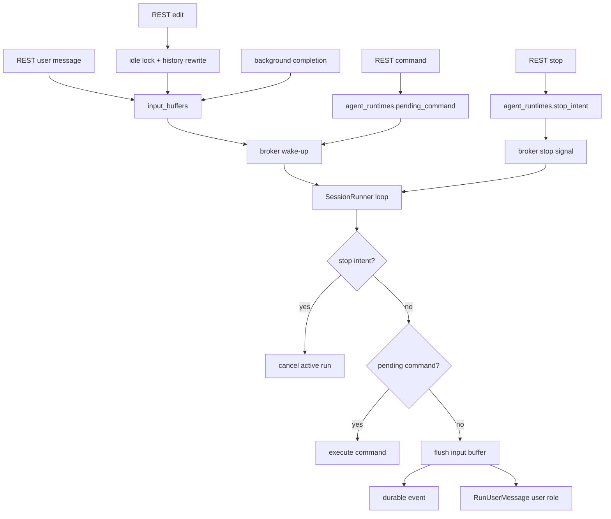

# Input Control Plane Clean Migration Design

## Overview

This design cleans up azents engine ingress based on clean state. Model input payload is stored only in `input_buffers` at session runner ingress; control actions that are not inputs, such as command/stop, are separated into DB state. Redis broker is responsible only for wake-up and fast-path interrupt signals, not payload queue.

Related decisions follow [input-260615/ADR](../adr/input-260615-input-control-plane-clean-migration.md).

## Requirements

### REQ-1. Session runner input payload goes through input buffer

#### Description
User message, edited user message, and background completion must be stored as `input_buffers` rows, not as broker payload or direct `InvokeInput.messages` on session wake-up.

#### Related decisions
- [input-260615/ADR-D1](../adr/input-260615-input-control-plane-clean-migration.md)

#### Acceptance criteria
- There is no direct user input path through `SessionMessage.messages`.
- Background completion creates `input_buffers.kind=background_completion` row.
- Model input from promotion remains `RunUserMessage`.

### REQ-2. Input buffer kind determines durable event and UI rendering taxonomy

#### Description
Input buffer must select durable event kind by kind and allow UI to distinguish user input from system/internal input.

#### Related decisions
- [input-260615/ADR-D2](../adr/input-260615-input-control-plane-clean-migration.md)
- [input-260615/ADR-D4](../adr/input-260615-input-control-plane-clean-migration.md)

#### Acceptance criteria
- `input_buffers.kind` is stored as PostgreSQL enum.
- `user_message` and `edited_user_message` are promoted to `EventKind.USER_MESSAGE`.
- `background_completion` is promoted to `EventKind.BACKGROUND_COMPLETION`.
- Background event is delivered as event kind that Web UI can render differently from user bubble.

### REQ-3. Edit is handled as idle-only history rewrite

#### Description
Edit request is not queued in middle of run. Only after DB lock confirms idle state, history rewrite and edited input buffer creation are performed.

#### Related decisions
- [input-260615/ADR-D3](../adr/input-260615-input-control-plane-clean-migration.md)

#### Acceptance criteria
- Running session edit returns 409 and does not create broker payload.
- Idle session edit reverts transcript after target.
- Idle session edit deletes pending input buffers and creates `edited_user_message` buffer.
- Successful edit transaction transitions session to running and sends wake-up.

### REQ-4. Command is handled as idle-only pending command

#### Description
Slash command is not mixed into input buffer. Command request is stored as single pending command in idle state and executed inside session runner lifecycle.

#### Related decisions
- [input-260615/ADR-D5](../adr/input-260615-input-control-plane-clean-migration.md)

#### Acceptance criteria
- Running session command returns 409.
- If pending command already exists, new command returns 409.
- In idle anomaly state with pending input buffer, command is rejected with 409.
- Session runner processes pending command before input buffer when pending command exists.
- Pending command is cleared after command processing completes/fails.

### REQ-5. Stop is handled as DB-backed interrupt intent

#### Description
Stop request records DB stop intent as source of truth, and broker stop signal is used as fast path for immediate cancel.

#### Related decisions
- [input-260615/ADR-D6](../adr/input-260615-input-control-plane-clean-migration.md)

#### Acceptance criteria
- Stop API records stop intent for running session.
- Runner immediately cancels active run when receiving broker stop signal.
- Runner periodically checks DB stop intent during active run too.
- Even if broker signal is lost, stop intent is detected by recovery/runner poll.
- Stop intent becomes consumed/cleared after stop handling completes.

### REQ-6. Broker is not payload carrier

#### Description
Broker ingress types keep only session wake-up and stop fast-path signal.

#### Related decisions
- [input-260615/ADR-D7](../adr/input-260615-input-control-plane-clean-migration.md)

#### Acceptance criteria
- `SessionMessage.messages` field is absent.
- Broker payload types `SessionMessageKind.USER`, `SessionCommand`, `SessionEditMessage`, `BackgroundCompletionMessage` are absent.
- User/edit/background/command payload is not serialized into Redis broker.

## Decision Table

| ADR decision | Requirements |
| --- | --- |
| [input-260615/ADR-D1](../adr/input-260615-input-control-plane-clean-migration.md). `input_buffers` is source of truth for session runner input payload | REQ-1 |
| [input-260615/ADR-D2](../adr/input-260615-input-control-plane-clean-migration.md). Input buffer item has promotion/rendering taxonomy through `kind` | REQ-2 |
| [input-260615/ADR-D3](../adr/input-260615-input-control-plane-clean-migration.md). Edit is idle-only history rewrite command | REQ-3 |
| [input-260615/ADR-D4](../adr/input-260615-input-control-plane-clean-migration.md). Background completion is stored as separate event kind and model input role remains user | REQ-2 |
| [input-260615/ADR-D5](../adr/input-260615-input-control-plane-clean-migration.md). Command is idle-only pending command, not input buffer | REQ-4 |
| [input-260615/ADR-D6](../adr/input-260615-input-control-plane-clean-migration.md). Stop is DB-backed running-only interrupt intent | REQ-5 |
| [input-260615/ADR-D7](../adr/input-260615-input-control-plane-clean-migration.md). Broker ingress keeps only wake-up and stop signal | REQ-6 |

## Architecture



## Data Model

### `input_buffers`

Because this is clean migration premise, there is no compatibility with existing rows.

| Field | Type | Notes |
| --- | --- | --- |
| `id` | `str(32)` | UUID7 hex, event external id |
| `session_id` | FK `agent_sessions.id` | AgentSession the input belongs to |
| `agent_runtime_id` | FK `agent_runtimes.id` | runtime boundary and idempotency scope |
| `kind` | enum | `user_message`, `edited_user_message`, `background_completion` |
| `actor_user_id` | FK `users.id` nullable | value only for user-origin input |
| `content` | text | model-visible text payload |
| `idempotency_key` | text nullable | duplicate prevention key by source |
| `metadata` | JSONB | source details |
| `attachments` | JSONB | exchange URI snapshot |
| `file_parts` | JSONB | model input file part snapshot |
| `created_at` | timestamptz | accepted time |

`headers` is deleted. It has no meaningful runtime consumer in current write path, and source-specific details are expressed as `metadata`.

### `agent_runtimes` pending control state

| Field | Type | Notes |
| --- | --- | --- |
| `pending_command_id` | `str(32)` nullable | single pending command id |
| `pending_command_name` | text nullable | slash command name |
| `pending_command_payload` | JSONB nullable | command-specific payload |
| `pending_command_user_id` | FK `users.id` nullable | command requester |
| `pending_command_created_at` | timestamptz nullable | command accepted time |
| `stop_requested_at` | timestamptz nullable | active run stop intent |
| `stop_requested_by` | FK `users.id` nullable | stop requester |
| `stop_request_id` | `str(32)` nullable | stop intent idempotency/correlation id |

Pending command is idle-only single action. Stop intent is running-only interrupt intent.

## Promotion Policy

| InputBuffer kind | Durable event kind | Model input role | UI rendering |
| --- | --- | --- | --- |
| `user_message` | `user_message` | user | user bubble |
| `edited_user_message` | `user_message` | user | user bubble |
| `background_completion` | `background_completion` | user | background result |

Promotion uses buffer id as event `external_id`. `idempotency_key` prevents duplicate buffer creation, and event append dedup uses `external_id`.

## API

REST message keeps existing contract but creates `kind=user_message` buffer.

REST edit operates as idle-only command.

```text
POST /chat/v1/sessions/{session_id}/edit-message
```

- If idle, create `edited_user_message` buffer and return snapshot.
- If running, return `409 Conflict`.

REST command creates pending command.

```text
POST /chat/v1/sessions/{session_id}/commands
```

- If idle and no pending command, save `pending_command` and return snapshot.
- Return `409 Conflict` when running, pending command exists, or pending input exists.

REST stop records DB stop intent.

```text
POST /chat/v1/sessions/{session_id}/stop
```

- If running, record stop intent then best-effort send broker stop signal.
- If idle, return success as durable no-op.

## Frontend

- Disable edit/command submit UI during running session.
- Server rejects running edit/command with 409 regardless of UI state.
- Render Background completion event as different view model from user bubble.
- Stop is enabled during running, and after request server live state is expected to converge to stopped/idle.

## Infrastructure

No change. Only PostgreSQL schema and application code change. Redis/Valkey capacity or stream topology does not change.

## Feasibility Verification

| Item | Verification |
| --- | --- |
| Input buffer clean migration | enum/column change possible under operational premise that existing rows are empty |
| Broker payload removal | all `SessionMessage.messages` producers/consumers must be removed |
| Event kind extension | `EventKind` and payload validation/rendering path addition needed |
| Command pending state | idle-only invariant implementable with `agent_runtimes` row lock |
| Stop durable fallback | possible by adding DB stop check to current fast path cancel structure |

## Test Strategy

Product behavior verification is E2E primary. Unit/integration/static checks support implementation quality verification.

### E2E Primary Verification Matrix

| Behavior | Primary E2E path | Evidence |
| --- | --- | --- |
| message write buffer-first | public REST message -> live snapshot -> worker promotion | REST response, history/live state |
| edit idle-only | idle session edit success, running edit 409 | HTTP status, history rewrite, buffer/event |
| background completion rendering | background task completion -> separate event kind | history event kind, UI projection |
| command pending lifecycle | idle command success, running command 409 | pending command state, command event/result |
| stop durable fallback | stop request writes DB intent and cancels active run | run terminal state, stop intent clear |

### E2E Primary Verification Plan

- Use public REST API and WebSocket live subscription in `testenv/azents/e2e`.
- Extend existing azents deterministic E2E fixture for items requiring Worker/runtime.
- Background/stop items use actual runner path.

### Seed/fixture requirements

- user/workspace/agent/session creation fixture
- deterministic runtime fixture that can create running session
- fixture that triggers background task completion

### Credential/prerequisite snapshot requirements

Live path requiring external LLM credential is separated as optional/live. Items verifiable with deterministic fake model/runtime run as required in CI.

### Evidence format

- execution command and working directory
- HTTP response snapshot
- WebSocket action snapshot
- DB read model assertion
- relevant log excerpt

### CI execution policy

Deterministic E2E runs in required CI. Optional/live test SKIPs when credentials are absent, and FAILs when credentials are provided and test fails.

### Optional/live skip/fail criteria

SKIP when credential or external provider quota is absent. FAIL when credential exists and provider response is normal but assertion fails.

## QA Checklist

### QA-1. User message uses buffer-first path

#### What to check
Verify REST message write creates input buffer and worker promotion converts it to durable user message event.

#### Why it matters
Ensures normal chat input is processed without loss even after broker payload removal.

#### How to check
Call message REST endpoint in `testenv/azents/e2e`, then check live snapshot and history event.

#### Expected result
REST response has pending input buffer projection; after run processing, pending projection is removed and durable `user_message` event exists.

#### Execution result
TBD

#### Fixes applied
TBD

### QA-2. Edit operates idle-only

#### What to check
Idle edit performs history rewrite and creates edited buffer, while running edit returns 409.

#### Why it matters
Ensures edit during run does not mix with existing turn and produce awkward response.

#### How to check
Call idle session edit success and active-run edit conflict separately in E2E.

#### Expected result
Idle edit leads to edited user message event, and running edit returns 409 without broker payload.

#### Execution result
TBD

#### Fixes applied
TBD

### QA-3. Background input has event kind different from user bubble

#### What to check
Verify Background completion appears in history/live projection as separate event kind.

#### Why it matters
UI and audit must distinguish direct user message from system/internal model input.

#### How to check
Run background task in E2E and check event kind.

#### Expected result
`background_completion` event is appended and model run continues.

#### Execution result
TBD

#### Fixes applied
TBD

### QA-4. Command uses pending command lifecycle

#### What to check
Idle command is saved as pending command and handled by runner; running command returns 409.

#### Why it matters
Command should be processed inside session runner lifecycle, not separate executor lifecycle.

#### How to check
Call `/compact` or deterministic command in idle/running states in E2E.

#### Expected result
Idle command is processed then pending command is cleared; running command returns 409.

#### Execution result
TBD

#### Fixes applied
TBD

### QA-5. Stop has both fast path and durable fallback

#### What to check
Verify Stop request records DB stop intent and immediately cancels active LLM/tool run.

#### Why it matters
Stop is most used in stuck/slow situations, so it must not rely on broker signal losslessness.

#### How to check
Call stop REST endpoint during long-running model/tool fixture in E2E.

#### Expected result
Run converges to interrupted/stopped terminal and stop intent is consumed/cleared.

#### Execution result
TBD

#### Fixes applied
TBD

## Implementation Plan

1. Schema: add `input_buffers.kind`, actor/idempotency cleanup, pending command, stop intent, event kinds.
2. Ingress: unify user/edit/background/subagent payload into input buffer creation.
3. Runner: remove broker payload, add pending command priority tick and DB stop intent fallback.
4. API/UI: add running edit/command 409 and disabled state, new event rendering.
5. Spec/test: update conversation/execution spec, add deterministic E2E and unit coverage.

## Alternatives Considered

### Keep interim compatibility

Rejected. Under clean state/full migration premise, keeping old broker payload and new buffer path at same time interferes with source-of-truth separation.

### Represent Command as input buffer kind

Rejected. Command is lifecycle action, not model input payload, so pending command is clearer.

### Handle Stop only by DB polling

Rejected. Broker/in-memory fast path must remain to meet expectation of immediate stop during LLM/tool execution.
