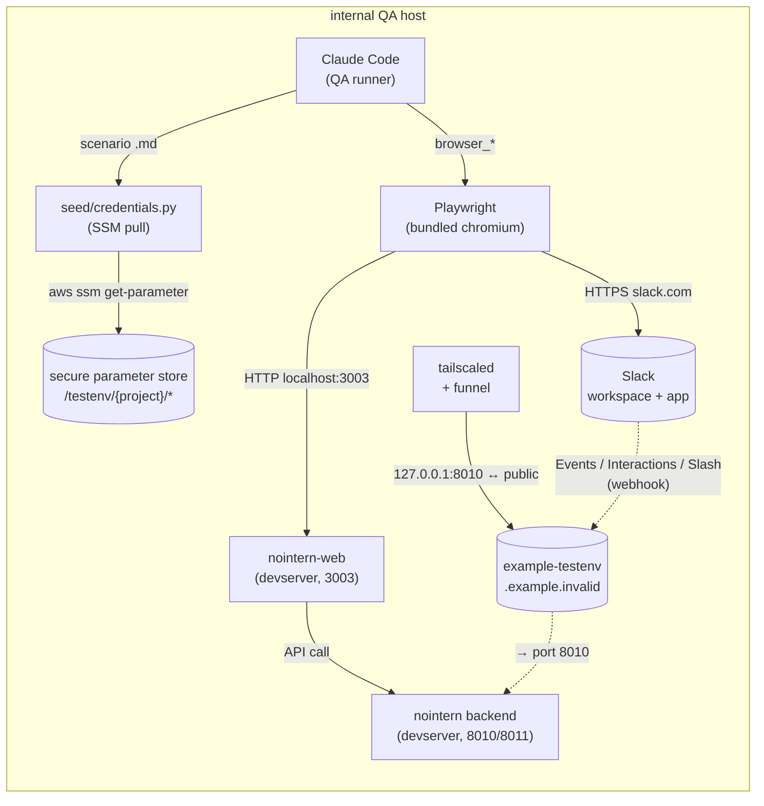

# Slack/Discord Integration-Wide E2E Test Environment Design

## Overview

Stage 4 (browser/web QA) of `testenv/nointern` made standalone UI flows of nointern-web automatable. On top of that, build an integrated test environment that can automatically verify **the whole Slack/Discord integration surface** — OAuth installation, user account linking, channel binding, messages/slash commands/interactions, files, agent toolkit permissions.

Scope expanded during Discussion from only initial OAuth (#2453 initial body) to **the entire integration surface**. First implementation target is **Slack**, and Discord follows same pattern after Slack completion.

### Problems solved

1. **Regression prevention**: automatically verify to prevent recurrence of regressions like #2452 (500 on Settings page when OAuth unconfigured).
2. **Integration behavior verification**: automatically confirm nointern backend Slack/Discord integrations (`services/slack/`, `services/discord/`, `worker/adapters/`) work end-to-end with actual external services.
3. **Shorten development cycle**: replace manual clicking/typing every time Slack/Discord changes with one scenario run.

### Usage scenarios

- After implementing new Slack feature, before PR merge — run `testenv/nointern/scenarios/integrations/TC-INT-SLACK-*.md` scenario once to confirm no regression.
- After modifying Slack OAuth code in nointern backend — immediately verify with Phase 2 OAuth scenario.
- After changing bot response flow — verify with Phase 3 message scenario.

## Background

Code research summarized entire Slack/Discord integration surface as follows (see Discussion #2456):

| Area | Slack | Discord |
|------|-------|---------|
| Installation | Platform mode (BYOA not implemented) | Guild-level |
| User Account Linking | ✅ | ✅ |
| Channel Binding | ✅ | ✅ |
| Event handling | Bolt AsyncApp (multi-workspace authorize callback) | Dual: Gateway (`discord.py`) + REST/Interactions Endpoint (HA Phase 1) |
| Slash Commands | `/nointern connect/link/reset` | `/nointern connect/link/reset` |
| Interactions | Modal, button | Button, select |
| Conversation Session | (channel + thread + user) → ConversationSession | (channel + thread + user) |
| History Injection | Channel + thread | Channel + thread |
| File Up/Down | ✅ | ✅ |
| Bot Output Adapter | `chat_stream` streaming, 5s edit throttle, file upload | REST based (`DiscordRESTClient`), 9s typing refresh, 2000-char split |
| Bot Message Tracking | implicit | explicit (`RDBDiscordBotMessage`) |
| Agent Toolkit permissions | read/write/reactions/privacy | read/write/reactions/privacy/management |
| Signature verification | (handled by Bolt) | Gateway HMAC + Interactions Ed25519 |

Implement scenario set covering this full surface in 5 phases.

## Discussion Points and Decisions

Decisions agreed in Discussion #2456. See each comment thread for pros/cons.

| ID | Decision | Rationale summary |
|----|------|----------|
| **D1** | scenario directory = `scenarios/integrations/` | Same level as existing `scenarios/{sandbox-isolation,shell-tool,mcp-toolkit,chat-streaming,browser}/`, accommodates Slack/Discord/future integrations |
| **D2** | PR split = foundation → stacked by Phase | Merge foundation (`.env`/credentials/browser helper) quickly, distribute review burden by phase. Detailed stack structure in [Implementation Plan](#implementation-plan) |
| **D3** | tunneling = **Tailscale Funnel** (runs on the internal QA host) | Existing production infra uses Tailscale (`infra/argocd/tailscale-operator/`). Caddy limited to closed network, unusable. FRP needs separate VM → adopt Tailscale Funnel with 0 additional infra |
| **D4** | test account = shared QA email + **AWS SSM Parameter Store** + pull script | Existing testenv `.env` pattern is plaintext; 1Password adds tool. AWS SSM is same infra as ExternalSecrets and protected by IAM policy + KMS. Variable names are kebab-case (`/testenv/{project}/slack-platform-app/client-id`, etc.) |
| **D5** | 2FA = optional (TOTP automation supported, skip if absent) | Forcing it increases secret management burden; disabling risks Slack policy changes. Automatable with `pyotp`, but skip if account has no 2FA configured |
| **D6** | data cleanup = Admin API helper (`seed/slack_discord_cleanup.py`) | Automation required, called in scenario beforeAll. Idempotent |

D7 (CI integration) is **excluded from this work scope** per user feedback.

## Architecture

### Runtime structure



Core points:
- **Tunneling runs on the internal QA host** (`tailscale funnel --bg <local-port>`). The public callback URL is environment-specific and should be supplied through local configuration.
- **OAuth redirect URL is FE address** (`http://localhost:3003/oauth/slack/callback`). Slack allows localhost in dev app. Playwright runs on same machine, so localhost is sufficient.
- **Webhook URL (Events/Interactions/Slash) is Funnel address** — Slack server directly calls our backend.
- **Discord** OAuth callback is backend (`/discord/v1/oauth-callback`) — different from Slack.
- **Test account/Slack App secrets** are all AWS SSM SecureString. `seed/credentials.py` is single entrypoint.

### Difference from Stage 4

| | Stage 4 (browser/web) | Stage 5 (integrations) |
|--|----------------------|------------------------|
| Caller | Claude Code (Playwright) | Claude Code (Playwright) |
| Target | nointern-web standalone UI | nointern-web + Slack/Discord external services |
| External dependency | none | Slack workspace + app, Discord guild + app |
| Public URL needed | none | Slack Events/Interactions, Discord OAuth/Interactions |
| Storage state | nointern login | nointern login + Slack login |
| Cleanup | create new user each time | new user + cleanup existing installation |

Stage 4 only sees nointern-web UI. Stage 5 layers external services on top.

## Data Model

### AWS SSM Parameter Store

All `SecureString`. Path prefix `/testenv/{project}/`. kebab-case (D4 decision).

```
/testenv/{project}/
├── slack-platform-app/
│   ├── client-id
│   ├── client-secret
│   ├── signing-secret
│   └── app-token            # optional Socket Mode, currently unused
├── slack-account/
│   ├── workspace-slug       # e.g. "nointernsandbox"
│   ├── email
│   ├── password
│   └── totp-secret          # optional base32 when 2FA enabled
├── discord-platform-app/    # future, after Slack completion
│   ├── client-id
│   ├── client-secret
│   ├── bot-token
│   └── public-key
└── discord-account/         # future
    ├── email
    ├── password
    └── totp-secret
```

### IAM Policy

Single policy `testenv` introduced in PR #2462 (`infra/terragrunt/_modules/testenv/`):

```json
{
  "Statement": [
    {
      "Effect": "Allow",
      "Action": ["ssm:GetParameter", "ssm:GetParameters", "ssm:GetParametersByPath", "ssm:DescribeParameters"],
      "Resource": "arn:aws:ssm:*:*:parameter/testenv/*"
    },
    {
      "Effect": "Allow",
      "Action": "kms:Decrypt",
      "Resource": "*",
      "Condition": {"StringLike": {"kms:ViaService": "ssm.*.amazonaws.com"}}
    }
  ]
}
```

If testenv needs additional AWS permissions later, add Statement to this policy (S3, CloudWatch, etc.).

### testenv environment variables (`.env`)

```bash
# existing (used from Stage 1~4)
NI_RDB_HOST=localhost
NI_RDB_PORT=5433
# ...

# Stage 5 addition
TESTENV_AZENTS_FUNNEL_URL=https://example-testenv.example.invalid
```

`.env` is gitignored. Machine-dependent value. SSM credentials are not in `.env`; `seed/credentials.py` pulls them at runtime.

## seed Helper Implementation

### `seed/credentials.py` (new)

Single entrypoint to fetch testenv credentials from SSM Parameter Store.

```python
# testenv/nointern/seed/credentials.py
"""Single entrypoint for test accounts / Slack App credentials.

Direct environment variable access is forbidden — all access goes through this module.
When switching to another backend (1Password, etc.), modify only one place.
"""

import subprocess
from dataclasses import dataclass


def _ssm_get(name: str, region: str = "us-west-2") -> str:
    result = subprocess.run(
        ["aws", "ssm", "get-parameter", "--region", region,
         "--name", name, "--with-decryption",
         "--query", "Parameter.Value", "--output", "text"],
        capture_output=True, text=True, check=True,
    )
    return result.stdout.strip()


@dataclass(frozen=True)
class SlackPlatformApp:
    client_id: str
    client_secret: str
    signing_secret: str
    app_token: str | None  # None if Socket Mode unused

    @classmethod
    def from_ssm(cls) -> "SlackPlatformApp":
        return cls(
            client_id=_ssm_get("/testenv/{project}/slack-platform-app/client-id"),
            client_secret=_ssm_get("/testenv/{project}/slack-platform-app/client-secret"),
            signing_secret=_ssm_get("/testenv/{project}/slack-platform-app/signing-secret"),
            app_token=_ssm_get("/testenv/{project}/slack-platform-app/app-token") or None,
        )


@dataclass(frozen=True)
class SlackTestAccount:
    workspace_slug: str
    email: str
    password: str
    totp_secret: str | None

    @classmethod
    def from_ssm(cls) -> "SlackTestAccount":
        return cls(
            workspace_slug=_ssm_get("/testenv/{project}/slack-account/workspace-slug"),
            email=_ssm_get("/testenv/{project}/slack-account/email"),
            password=_ssm_get("/testenv/{project}/slack-account/password"),
            totp_secret=(_ssm_get("/testenv/{project}/slack-account/totp-secret") or None) if _has_param("totp-secret") else None,
        )
```

### `seed/oauth_browser.py` (new)

Slack/Discord login + OAuth authorization + storage state management with Playwright bundled chromium.

```python
# testenv/nointern/seed/oauth_browser.py
"""Slack/Discord OAuth browser automation helper.

Login + storage state persistence + OAuth authorize page handling.
"""

from pathlib import Path
from playwright.async_api import BrowserContext, Page, async_playwright

from seed.credentials import SlackTestAccount

CHROMIUM_PATH = "/home/code/.cache/ms-playwright/chromium-1212/chrome-linux64/chrome"
STATE_DIR = Path(__file__).parent.parent / "runs" / "_state"


async def slack_login(
    page: Page, account: SlackTestAccount,
) -> None:
    """Login to workspace by workspace-slug.

    1. Directly enter /sign_in_with_password (skip workspace selection step)
    2. Enter email + password → submit
    3. Wait until ssb/redirect or client URL
    4. If 2FA screen appears, enter automatically with totp_secret
    """
    url = f"https://{account.workspace_slug}.slack.com/sign_in_with_password"
    await page.goto(url, wait_until="networkidle", timeout=45000)
    await page.wait_for_selector("input[type=email], input[name=email]", timeout=10000)
    await page.fill("input[type=email], input[name=email]", account.email)
    await page.fill("input[type=password], input[name=password]", account.password)
    await page.click("button[type=submit], #signin_btn")
    await _maybe_handle_2fa(page, account)
    await page.wait_for_url(
        lambda u: ".slack.com/client" in u or ".slack.com/ssb/redirect" in u,
        timeout=20000,
    )


async def _maybe_handle_2fa(page: Page, account: SlackTestAccount) -> None:
    """If 2FA screen appears, enter TOTP; otherwise skip (D5: optional)."""
    try:
        await page.wait_for_selector('input[name="2fa_code"], input[autocomplete="one-time-code"]', timeout=3000)
    except Exception:
        return  # no 2FA
    if not account.totp_secret:
        raise RuntimeError("2FA prompt appeared, TOTP secret not configured")
    import pyotp
    code = pyotp.TOTP(account.totp_secret).now()
    await page.fill('input[name="2fa_code"], input[autocomplete="one-time-code"]', code)
    await page.click('button[type=submit]')


async def save_storage_state(context: BrowserContext, key: str) -> Path:
    STATE_DIR.mkdir(parents=True, exist_ok=True)
    target = STATE_DIR / f"{key}.json"
    state = await context.storage_state()
    target.write_text(json.dumps(state))
    return target


def load_storage_state_path(key: str) -> Path:
    return STATE_DIR / f"{key}.json"
```

### `seed/slack_discord_cleanup.py` (new)

Called in scenario beforeAll. Cleans existing installation/session/binding/user_link through nointern admin API.

```python
# testenv/nointern/seed/slack_discord_cleanup.py
"""Cleanup helper for isolation between test scenarios."""

from seed.client import build_admin_client


async def cleanup_slack(workspace_id: str) -> None:
    """Delete every Slack-related record in workspace (FK order)."""
    admin = build_admin_client()
    # 1. SlackSession (FK: installation)
    # 2. SlackChannelBinding
    # 3. SlackUserLink
    # 4. SlackInstallation
    ...
```

Prerequisite: confirm nointern admin API has corresponding cleanup endpoint. If absent, adding admin API becomes first PR of this work.

## Scenario Catalog

### Phase 1 — Setup verification (fully automated, no external dependency except credentials)

| test_id | severity | Core verification |
|---------|----------|----------|
| TC-INT-SLACK-001 | medium | Settings page shows "Add to Slack" button when Slack credentials configured |
| TC-INT-SLACK-002 | critical | Graceful when Slack credentials unconfigured (#2452 regression prevention) |
| TC-INT-DISCORD-001 | medium | same for Discord |
| TC-INT-DISCORD-002 | critical | graceful when Discord unconfigured |

### Phase 2 — OAuth flow (semi-automated — first storage state manual once, then automated)

| test_id | severity | Core verification |
|---------|----------|----------|
| TC-INT-SLACK-003 | high | Full installation OAuth (login → authorize → callback → DB storage) |
| TC-INT-SLACK-004 | medium | User Link OAuth |
| TC-INT-DISCORD-003/004 | high/medium | same for Discord |

### Phase 3 — Message flow (Slack/Discord API + Playwright verification)

| test_id | severity | Core verification |
|---------|----------|----------|
| TC-INT-SLACK-005 | high | DM message → bot response |
| TC-INT-SLACK-006 | high | Channel mention → thread response |
| TC-INT-SLACK-007 | high | `/nointern connect` → agent binding |
| TC-INT-SLACK-008 | medium | file upload/download |
| TC-INT-DISCORD-005~008 | same | Discord |

### Phase 4 — Permissions / edge cases

| test_id | severity | Core verification |
|---------|----------|----------|
| TC-INT-SLACK-009 | medium | Agent toolkit permission (read/write/reactions off) |
| TC-INT-SLACK-010 | high | Privacy mode (reject private channel) |
| TC-INT-DISCORD-009 | high | Interactions Ed25519 signature verification (reject invalid signature) |
| TC-INT-DISCORD-010 | medium | Message splitting (auto split over 2000 chars) |
| TC-INT-DISCORD-013 | high | Gateway HMAC verification |

### Phase 5 — Additional features

| test_id | severity | Core verification |
|---------|----------|----------|
| TC-INT-SLACK-011 | medium | Account link nudge (first session by unlinked user) |
| TC-INT-SLACK-012 | medium | Channel history injection |
| TC-INT-SLACK-013 | medium | Thread reply (preserve thread_ts) |
| TC-INT-DISCORD-011 | medium | Typing indicator 9-second refresh |
| TC-INT-DISCORD-012 | medium | Bot message tracking (edit behavior) |
| TC-INT-DISCORD-014 | medium | Thread auto-creation |

### Scenario format

Same runbook .md format as Stage 4 (browser). Additional items:

```markdown
---
test_id: TC-INT-SLACK-NNN
category: integrations
severity: ...
created: YYYY-MM-DD
title: "..."
external_deps: [slack-app, slack-account]   # new
---

# TC-INT-SLACK-NNN — Title

## Objective
Verification target

## Caller
Claude Code (QA runner)

## Preconditions
- `devserver.py up --web`
- AWS SSM credential registered (`/testenv/{project}/...`)
- Tailscale Funnel active (`tailscale funnel status` PASS)
- (Phase 2+) Slack storage state cache exists or one-time login performed
- (per scenario) admin API cleanup complete

## Backend Seed
```python
from seed.credentials import SlackPlatformApp, SlackTestAccount
from seed.slack_discord_cleanup import cleanup_slack
...
```

## QA runner steps
1. `browser_navigate(...)`
2. `browser_snapshot()` → ...
3. ...

## Expected Result
- snapshot text / element
- DB record (admin API verification)
- Slack/Discord external state (verify with Slack API call)
```

## Infrastructure

### Additions/changes

| Item | Status | Method |
|------|------|------|
| testenv IAM policy (`testenv`) | PR #2462 | new Terragrunt module `_modules/testenv/` |
| AWS SSM SecureString (Slack platform app) | ✅ registered complete (4) | manual (`aws ssm put-parameter`) |
| AWS SSM SecureString (Slack test account) | ✅ registered complete (3) | manual |
| AWS SSM SecureString (Discord) | future (after Slack completion) | manual |
| Tailscale tailnet + Funnel enable | ✅ running | Tailscale admin console |
| Tailscale install on QA host | ✅ working | host-specific setup; join with a restricted auth key |
| Funnel URL | ✅ persistent (`--bg`) | environment-specific URL configured outside Git; `tailscale funnel --bg <local-port>` |

### Explicitly no changes

- nointern backend code (`python/apps/nointern/`) — no file modified. Integration test verifies externally without backend change.
- nointern-web code — same.
- ArgoCD / EKS deployment manifest — no change.
- Production Tailscale policy — no change (only separate testenv tailnet or tag added).

## Feasibility Verification

**All verified with actual SSM credentials** (feasibility check comment in Discussion #2456).

| Item | Result | Note |
|------|------|------|
| AWS SSM credential pull (`aws ssm get-parameter`) | ✅ | pull succeeded with `a least-privilege testenv IAM principal` IAM permission |
| Reach external domain with Playwright bundled chromium | ✅ | no block even headless and no stealth |
| Slack `{slug}.slack.com/sign_in_with_password` login | ✅ | email + password auto input → reached ssb/redirect |
| Storage state persistence | ✅ | 8 cookies, 1874 bytes |
| Reuse storage state → immediate OAuth authorize | ✅ | login step completely skipped |
| OAuth authorize URL works with actual client_id | ✅ | both "Allow" button and scope display identified |
| `app.slack.com/client` web client headless load | ✅ | automatically entered default workspace + first channel |
| message input selector (`div[role="textbox"][contenteditable="true"]`) | ✅ | Slack Quill editor |
| message typing + Enter → channel history display | ✅ | reflected within 1~2 seconds, verified by marker text |

Unverified items (all naturally verified in follow-up Phase scenarios):
- Actual OAuth "Allow" click → installation creation (needs devserver)
- Bot response receive (needs actual bot)
- Thread/file/slash command

## Implementation Plan

**Principle (D2)**: foundation → stacked PR by phase. After each stack base is merged, change next PR base to main.

```
main
  └─ feat/integrations-e2e-design     ← this document (PR #1)
      └─ feat/integrations-e2e-base    ← foundation (PR #2)
          ├─ seed/credentials.py
          ├─ seed/oauth_browser.py
          ├─ scripts/pull-secrets.sh
          ├─ checks/tunnel.py (Tailscale Funnel preflight)
          ├─ docs/nointern/testing/slack-discord-setup.md
          └─ pyproject.toml: add pyotp
              └─ feat/integrations-e2e-phase1   ← Phase 1 scenarios (PR #3)
                  └─ feat/integrations-e2e-phase2   ← Phase 2 (PR #4)
                      └─ feat/integrations-e2e-phase3   ← Phase 3 (PR #5)
                          └─ feat/integrations-e2e-phase4   ← Phase 4 (PR #6)
                              └─ feat/integrations-e2e-phase5   ← Phase 5 (PR #7)
```

**Dependencies by phase**:
- Phase 1 ← foundation only. No external service call. Only check Slack credential registration.
- Phase 2 ← foundation + real Slack App + one-time storage state setup.
- Phase 3 ← Phase 2 (starts with OAuth installation complete) + admin API cleanup helper.
- Phase 4 ← Phase 3.
- Phase 5 ← Phase 4.

**Discord proceeds after Slack completion** as separate PR series (D3 decision).

## Risks and Mitigation

| Risk | Mitigation |
|--------|------|
| Slack UI selector changes (message input, "Allow" button, etc.) | selectors documented in runbook .md. quick grep + replace on change. auto-detected when Phase 2+ scenario runs |
| Storage state expires → scenario fails | first scenario step checks state validity + relogin on expiration — `seed/oauth_browser.py` handles fallback |
| Slack account locked (repeated login attempts) | normally reuse storage state → low login attempt frequency. human unlock if locked |
| Tailscale Funnel free tier 3-device limit exceeded | currently only 1 codingbot machine → low risk. switch to paid or FRP if expanding later (Discussion #2456 D3 fallback) |
| nointern-web UI change | same as Stage 4 — grep replace anchor text in runbook .md |
| SSM credential exposure | SecureString + KMS, read-only permission by IAM policy `testenv`, CloudTrail audit possible |
| test messages accumulate in actual workspace | cleanup step per scenario (message delete or temporary channel) |
| Slack bot detection → login block | no block at feasibility time. if occurs, staged response: stealth, headful (Xvfb), residential IP, login frequency throttling, etc. |

## Alternatives Considered

### Tunneling

| Alternative | Rejection reason |
|------|-----------|
| **ngrok free** automation (`devserver.py up --web --tunnel` integration) | URL changes every time → must re-register Slack/Discord App → automation meaningless |
| **ngrok paid** | $8/user/month cost, vendor lock-in. Reusing existing infra (Tailscale) is more natural |
| **FRP on cloud** | separate VM required → additional infra. With Tailscale already running, cost/ops burden high. fallback if Tailscale limit reached later |
| **Cloudflare Tunnel** | azents does not use Cloudflare (Route53 only) → introduces new vendor |
| **Existing Caddy** | operates as closed-network ingress → no public access |

→ Adopt **Tailscale Funnel**. Reuses existing infra, 0 additional tools, minimal operation burden.

### Credential storage

| Alternative | Rejection reason |
|------|-----------|
| plaintext `.env` (`TEST_SLACK_*` prefix) | existing testenv pattern but high secret management burden (accidental commit, exposed if machine compromised). AWS safer |
| 1Password CLI | introduces additional tool, team 1Password license required |
| SOPS + age | setup cost, low team familiarity |
| GitHub Secrets | CI-only. local development flow still separate |

→ Adopt **AWS SSM SecureString**. Consistent with ExternalSecrets pattern and reuses existing IAM infra.

### Browser automation tool

| Alternative | Rejection reason |
|------|-----------|
| **Puppeteer** | Playwright more actively maintained, multi-browser support, Stage 4 already Playwright based |
| **Selenium** | heavier, Playwright better suited for modern SPA of Slack/Discord |
| **Mock OAuth Provider** | deterministic but expensive to bypass hardcoded `slack_sdk` / `discord.com`. loses value of verifying actual OAuth flow |
| **system chrome** (`/opt/google/chrome/chrome`) | launch failed on the internal QA host due to socket binding permission issue. Playwright bundled chromium works |

→ **Playwright bundled chromium** (already `/home/code/.cache/ms-playwright/chromium-1212/`).

### Slack mode

| Alternative | Rejection reason |
|------|-----------|
| **Socket Mode** (`xapp-` token) | external webhook URL unnecessary → simpler. However current Slack App has Socket Mode disabled, only app-token stored in SSM. Can switch later by enabling it |

→ **Webhook mode** (current setting). Use Funnel URL. Can switch to Socket Mode later.

## References

- Issue: azents/azents#2453
- Discussion: azents/azents#2456 (discussion + decisions + feasibility result)
- Separated origin: azents/azents#2450
- Unconfigured graceful handling fix: azents/azents#2454 (merged)
- testenv IAM PR: azents/azents#2462
- Stage 4 (browser/web) design: `docs/nointern/design/stage4-260410-stage4-web.md`, Discussion #2441
