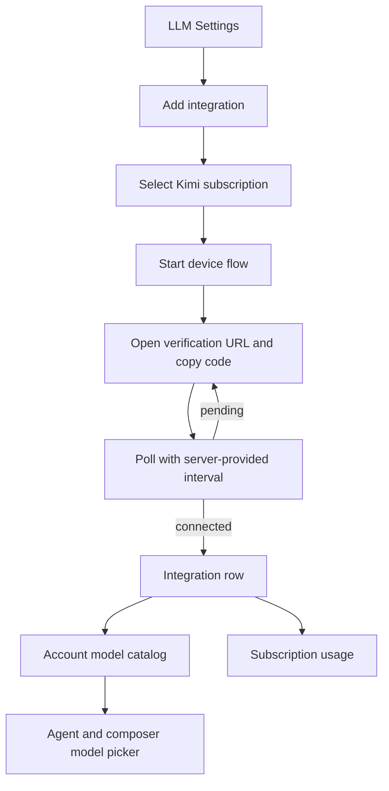

# Kimi Subscription Provider Implementation Plan

## Feature Summary

Implement the accepted [Kimi Subscription Provider Design](./kimi-subscription-provider.md) and [ADR-0171](../adr/0171-add-kimi-subscription-as-an-integration-scoped-provider.md) as an integration-scoped OAuth provider with device authorization, account-visible models, LiteLLM Moonshot runtime routing, token refresh, and normalized subscription usage.

## Boundaries

### In scope

- `kimi_oauth` provider and Moonshot developer enum values.
- Encrypted OAuth/device credentials and a device-session table.
- Public device start, poll, and cancel APIs.
- Integration-scoped `/models` catalog synchronization.
- Runtime token refresh and `moonshot/` LiteLLM invocation mapping.
- `/usages` subscription-usage normalization.
- Generated public/admin clients.
- LLM Settings connection, catalog, usage, and composer usage eligibility.
- Living Spec promotion, deterministic tests, and optional live-test documentation.

### Out of scope

- Moonshot API-key provider.
- Kimi Search/Fetch tools.
- Browser callback authorization.
- Native Kimi transport.
- Durable usage history or billing reconciliation.

## PR Stack

All PRs use the title prefix `Kimi subscription [N/6]`.

### PR 1/6 — Design

Branch: `feature/kimi-subscription-design`

Contents:

- Accepted ADR for provider, catalog, runtime, device identity, and usage boundaries.
- Autonomous feature design with upstream validation and test matrix.

Validation:

- Documentation frontmatter and generated indexes.
- Markdown diff check.

### PR 2/6 — Implementation plan

Branch: `feature/kimi-subscription-plan`

Contents:

- This plan and explicit PR/test boundaries.

Validation:

- Documentation frontmatter and generated indexes.

### PR 3/6 — Backend provider

Branch: `feature/kimi-subscription-backend`

Contents:

- Alembic-generated enum/session migration and revision update.
- Provider, developer, secrets, config, and session domain models.
- OAuth client, repository, service, runtime refresh, and API routes.
- Integration-scoped model listing and catalog projection.
- LiteLLM Moonshot model/credential routing.
- Kimi subscription-usage adapter and service dispatch.
- Backend unit and integration tests.

Dependencies:

- PR 2/6.

Validation:

- Focused OAuth client/service/runtime/repository/API tests.
- Focused catalog and subscription-usage tests.
- Full backend Ruff, Pyright, and Pytest before stack completion.

### PR 4/6 — Frontend and generated clients

Branch: `feature/kimi-subscription-frontend`

Contents:

- Dump updated OpenAPI specs.
- Regenerate Python and TypeScript public/admin clients.
- Add Kimi device-flow tRPC calls and modal connection UI.
- Add translations and provider capability handling.
- Add Kimi to integration and composer subscription-usage eligibility.
- Add or update deterministic Storybook interaction coverage.

Dependencies:

- PR 3/6.

Validation:

- Generated-client commands complete without manual generated-file edits.
- TypeScript format, lint, typecheck, and relevant Storybook tests.
- Backend OpenAPI/spec checks remain clean.

### PR 5/6 — Validation and spec promotion

Branch: `feature/kimi-subscription-validation`

Contents:

- Run the E2E-primary validation matrix against deterministic mocks and public product boundaries.
- Fix implementation defects found during validation.
- Update Model Catalog and subscription/provider flow specs.
- Add a Kimi OAuth Living Spec with current behavior and code paths.
- Record commands, environment, results, optional-live prerequisites, and implementation/spec comparison.

Dependencies:

- PR 4/6.

Validation:

- Backend full quality suite.
- TypeScript full quality suite and web build when feasible.
- Documentation validation.
- Strict spec-to-code comparison.

### PR 6/6 — Cleanup

Branch: `feature/kimi-subscription-cleanup`

Contents:

- Mark the design implemented after validated completion.
- Remove this temporary implementation plan.
- Regenerate documentation indexes.

Dependencies:

- PR 5/6.

Validation:

- Documentation validation.
- Clean diff limited to lifecycle cleanup.

## Backend Data and API Changes

### Database

- Add `kimi_oauth` to PostgreSQL `llm_provider`.
- Add `moonshot` to PostgreSQL `llm_model_developer`.
- Add Kimi connection method and session status enum types.
- Add `kimi_oauth_sessions` with named indexes and encrypted device fields.
- Generate the migration only through `alembic revision` and update `db-schemas/rdb/revision`.

### Public API

- Add Kimi provider capability metadata.
- Add device start/poll/cancel routes.
- Extend generated provider/config/secrets unions.
- Reuse existing catalog and subscription-usage endpoints.

### Runtime

- Refresh Kimi tokens before provider operations.
- Map models to `moonshot/{id}` and credentials to Kimi Code base URL plus compatibility headers.
- Preserve common provider failure and retry semantics.

## Frontend Flow

The modal remains the active work surface. It displays one primary open-authorization action, a copyable code, status, cancel, and retry. Connected integrations use the existing row rather than a new provider-specific dashboard.

## E2E Primary Validation Matrix

| User behavior | Primary assertion | Required fixture/prerequisite |
|---|---|---|
| Discover provider | Kimi appears as experimental with subscription credential type | Provider capability API fixture |
| Start connection | Modal shows provider URL/code and no secret fields | Mock OAuth device response |
| Continue pending connection | Poll state remains pending and follows interval | Pending and slow-down responses |
| Complete connection | Integration row appears and catalog sync starts | Token response and model-list response |
| Recover rejected credential | Reconnect-required state and action appear | Refresh 401/403 response |
| Select model | Account-visible Kimi model is selectable and snapshots Moonshot developer/capabilities | Mock `/models` payload |
| Execute model | Runtime kwargs use `moonshot/`, Kimi base URL, Bearer token, and device headers | Mock LiteLLM boundary |
| Inspect usage | Normalized usage rows appear in settings and selected-model projection | Mock `/usages` payload |
| Isolate session | Another workspace/user cannot poll or cancel | Two authenticated users/workspaces |
| Redact secrets | API/log outputs omit token, device code, and device id | Captured responses and log records |

## Fixture and Prerequisite Support

- Unit and service tests inject `httpx.AsyncClient` mocks; no real credential is stored.
- Existing deterministic integration catalog fixtures are reused for catalog lifecycle behavior.
- Frontend interaction tests mock generated-client calls at the tRPC boundary.
- No test inserts or updates product tables directly except repository unit tests that exercise repository-owned persistence.
- A live provider smoke scenario is optional and requires explicit environment opt-in, a real Kimi subscription, interactive device approval, provider network access, and a prerequisite snapshot stating that the account is safe for one prompt and usage read.

## Test Strategy by Phase

### Backend phase

- Credential discriminated-union parsing.
- Header construction and ASCII safety.
- Device request, pending, slow-down, success, expiry, cancel, rejection, and malformed response.
- Session repository encryption and ownership.
- Token refresh success, rotation, concurrency recovery, permanent rejection, and transient failure.
- Catalog listing normalization and direct projection.
- Runtime mapping and resolver preflight.
- Usage normalization, one-refresh retry, and safe unavailable states.

### Frontend phase

- Provider credential-type selection.
- Device card loading, ready, pending, connected, cancelled, and error states.
- Poll interval updates and cleanup on close/unmount.
- Integration query invalidation after connection.
- Usage eligibility and provider label rendering.
- Generated client type compatibility.

### Validation phase

- Full Python and TypeScript quality commands.
- OpenAPI dump and generation are reproducible.
- Documentation index check.
- E2E-primary matrix evidence and optional-live skip reason.

## Spec Impact Candidates

- New `docs/azents/spec/flow/kimi-oauth.md`.
- `docs/azents/spec/domain/model-catalog.md` for Kimi integration catalogs.
- Existing subscription-usage flow/design references for supported-provider expansion.
- Agent execution spec only if the runtime credential-preflight provider list is explicit.

## Rollout and Recovery

- Provider is visible but marked experimental.
- OAuth host, token path/base URL, and compatibility version have controlled environment overrides for mock environments and upstream recovery.
- Operators can disable an individual integration through the existing enabled flag.
- Removing the provider option in a future release must not delete stored integration history or model snapshots.
- Schema downgrade follows existing PostgreSQL enum policy: session table can be removed, while enum values remain append-only if PostgreSQL cannot safely remove them.

## Known Risks and Blockers

- No deterministic blocker was found.
- Live verification depends on a real Kimi subscription and is therefore optional.
- Upstream public-client acceptance is an external risk; implementation must keep failures typed and reconnectable.
- LiteLLM Moonshot behavior for Kimi account aliases is validated at the mocked boundary in CI and should receive one opt-in live prompt before production enablement.

## Cleanup

After validation and spec promotion:

- set `implemented: 2026-07-19` on the design;
- delete this plan;
- retain ADR, Living Specs, validation report, and tested code as the source of truth.
