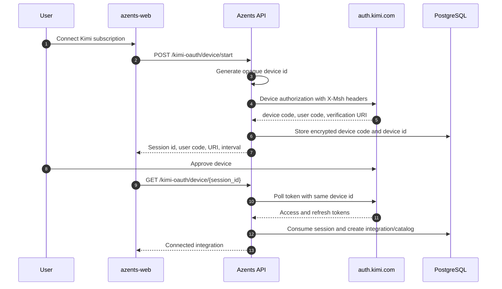
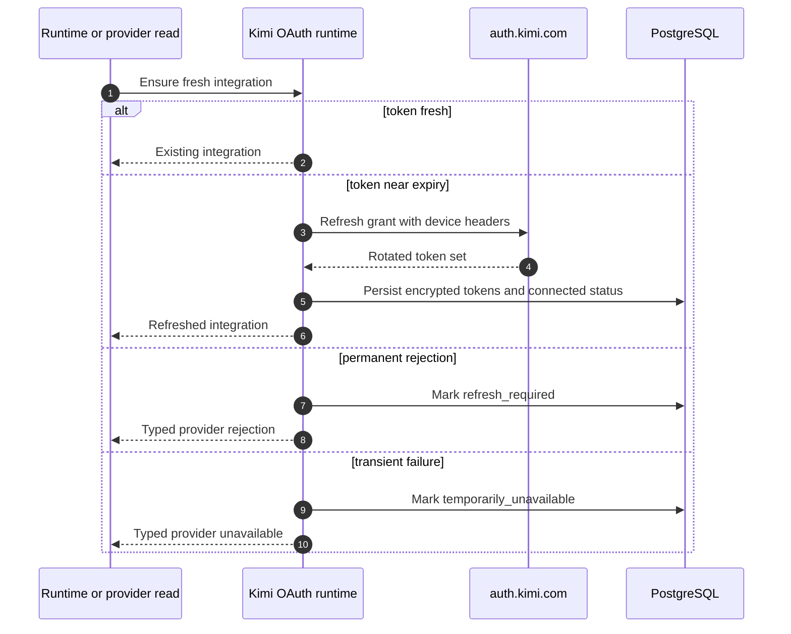

# Kimi Subscription Provider Design

## Problem

Azents cannot currently use a Kimi Code subscription. Users can access Kimi only through unrelated providers such as OpenRouter, while the official Kimi CLI supports user-authorized subscription credentials, account-visible models, token refresh, and quota inspection.

The feature must connect a workspace to a Kimi subscription without exposing tokens, preserve the existing provider/catalog/runtime boundaries, and fail safely if Kimi changes or rejects the public CLI contract.

## Goals

- Connect a workspace-scoped Kimi subscription through device authorization.
- Store access token, refresh token, and stable device identity only in encrypted storage.
- Refresh tokens before model listing, inference, compaction, title generation, and usage reads.
- Populate an integration-scoped catalog from the authenticated Kimi `/models` endpoint.
- Run selectable Kimi models through the existing LiteLLM execution path.
- Show normalized Kimi subscription usage in existing usage surfaces.
- Provide deterministic unit, API, generated-client, and frontend coverage in CI.

## Non-goals

- Add a Moonshot developer API-key provider.
- Add Kimi browser callback authorization.
- Add Kimi Search or Fetch tools.
- Add a Kimi-native Azents transport.
- Persist subscription-usage history or financial accounting.
- Guarantee live-provider availability in normal CI.

## Current Behavior

Azents supports API-key integrations plus ChatGPT and xAI OAuth subscription providers. OAuth integrations use provider-specific device services, encrypted credentials, runtime refresh, and reconnect-required status. Integration-scoped catalogs are synchronized out of band and read from stored projections. ChatGPT and xAI usage adapters project live subscription quota into a provider-neutral public contract.

Kimi is absent from the provider enum, credential unions, catalog adapters, runtime routing, subscription-usage adapters, generated clients, and LLM Settings UI.

## Validated Upstream Contract

The design was validated against MoonshotAI/kimi-cli commit `4a550effdfcb29a25a5d325bf935296cc50cd417` (version 1.49.0).

| Concern | Upstream contract |
|---|---|
| OAuth host | `https://auth.kimi.com` |
| Public client id | `17e5f671-d194-4dfb-9706-5516cb48c098` |
| Device authorization | `POST /api/oauth/device_authorization` |
| Device and refresh token | `POST /api/oauth/token` |
| Runtime base URL | `https://api.kimi.com/coding/v1` |
| Account model listing | `GET /models` |
| Subscription usage | `GET /usages` |
| Required identity headers | `X-Msh-Platform`, `X-Msh-Version`, `X-Msh-Device-Name`, `X-Msh-Device-Model`, `X-Msh-Os-Version`, `X-Msh-Device-Id` |

## Decision Points

### Provider Identity

**Options**

- Add an auth mode to a future Moonshot API-key provider.
- Add a separate `kimi_oauth` provider.

**Decision**: Add `kimi_oauth`. Subscription credentials have a different billing and lifecycle contract and must not be accepted by generic API-key forms.

### Model Catalog Ownership

**Options**

- Project a system catalog from LiteLLM Moonshot metadata.
- Use a Kimi account-scoped integration catalog.

**Decision**: Use the authenticated `/models` response. Kimi aliases and entitlements are account-visible and do not require a LiteLLM metadata match.

### Runtime Transport

**Options**

- Add a native Kimi adapter.
- Reuse LiteLLM with `moonshot/` routing and the Kimi Code base URL.

**Decision**: Reuse LiteLLM. Current Kimi execution semantics fit the existing provider-neutral path, while auth and headers remain provider-specific.

### Device Identity Storage

**Options**

- Generate a new device id per refresh.
- Store a stable id in plaintext integration config.
- Store a stable id in encrypted session and integration secrets.

**Decision**: Store it encrypted. Kimi expects stability, while the identifier is unnecessary in public configuration and should not be exposed by integration responses.

### Subscription Usage

**Options**

- Defer quota presentation.
- Add `/usages` to the existing normalized usage service.

**Decision**: Add the adapter in the first release. Kimi provides the endpoint in its official CLI and the Azents public/UI contract already supports provider-neutral quota rows.

## Proposed Design

### Provider and Credential Contracts

Add `LLMProvider.KIMI_OAUTH` and `LLMModelDeveloper.MOONSHOT`.

Encrypted integration secrets:

```json
{
  "type": "kimi_oauth",
  "access_token": "...",
  "refresh_token": "...",
  "expires_at": "2026-07-19T20:00:00Z",
  "device_id": "..."
}
```

Plain integration config:

```json
{
  "type": "kimi_oauth",
  "connection_method": "device",
  "status": "connected",
  "connected_at": "2026-07-19T19:00:00Z",
  "last_refreshed_at": "2026-07-19T19:00:00Z",
  "last_failed_at": null,
  "last_failure_reason": null
}
```

The generic integration response may expose config but never secrets.

### Device Session

Add `kimi_oauth_sessions` with workspace/user ownership, method, status, encrypted device code, encrypted device id, user code, verification URI, polling interval, and expiry.



Polling returns pending until success, expiry, cancellation, or provider rejection. Provider `slow_down` increases the persisted interval by five seconds when returned.

### Kimi Compatibility Headers

A shared builder receives the encrypted device id and returns fixed, ASCII-only values:

- `X-Msh-Platform: kimi_cli` for public-client compatibility;
- pinned compatibility version with environment override;
- `X-Msh-Device-Name: Azents`;
- `X-Msh-Device-Model: Azents Server`;
- host OS version without hostname;
- stable `X-Msh-Device-Id`.

The same builder is used for device authorization, token poll, refresh, model listing, usage, and runtime requests.

### Token Refresh

The access token refresh window is five minutes.



A stale refresh failure rereads the integration before storing failure. If another request already rotated the refresh token or updated `last_refreshed_at`, the newer integration is returned.

### Model Catalog

After OAuth success, Azents creates an empty integration catalog transactionally and queues initial synchronization. Synchronization:

1. ensures the OAuth token is fresh;
2. requests `GET {base_url}/models` with Bearer token and Kimi headers;
3. validates a top-level `data` list;
4. projects entries directly without a LiteLLM metadata visibility gate;
5. stores context window, text/image/video modalities, tool calling, and non-selectable reasoning metadata;
6. preserves the previous successful snapshot on failure.

Model identifiers become runtime identifiers with a `moonshot/` prefix. The base URL and `custom_llm_provider=moonshot` are supplied through credential kwargs.

### Runtime

The normal resolver loads the selected integration and calls Kimi token freshness before constructing invocation input. Sampling, compaction, and title generation receive:

- `model=moonshot/{provider_model_identifier}`;
- `api_key=<access token>`;
- `base_url` and `api_base` set to the Kimi Code API root;
- `custom_llm_provider=moonshot`;
- Kimi compatibility headers.

No Kimi-specific Engine semantics are added. Unsupported capabilities remain absent from the catalog.

### Subscription Usage

Add a `KimiSubscriptionUsageClient` that calls `/usages` with the same token and device headers. It normalizes:

- optional `usage` summary;
- zero or more `limits` rows, including nested `detail` and `window` values;
- `used`, `limit`, and `remaining` forms;
- reset timestamps and reset durations.

Expected 401 triggers one forced refresh and one retry. Provider rate limit, transport failure, invalid response, and reconnect-required state map to existing normalized outcomes. Raw payloads are not persisted or returned.

### Frontend UX

Kimi appears in the existing `Add integration` modal as `Kimi subscription` with an experimental badge. Selecting it renders a device connection card that keeps the verification URL, user code, copy/open actions, waiting state, retry, and cancel controls inside the modal.

After connection, the ordinary integration row owns alias edit, enabled toggle, deletion, model catalog sync, and subscription usage. The model picker and composer usage projection work through existing provider-neutral contracts.

Utility copy states that availability depends on Kimi subscription entitlement and that the connection uses a user-authorized account.

## API Changes

| Method | Path | Purpose |
|---|---|---|
| `POST` | `/llm-provider-integration/v1/workspaces/{handle}/kimi-oauth/device/start` | Start device authorization |
| `GET` | `/llm-provider-integration/v1/workspaces/{handle}/kimi-oauth/device/{session_id}` | Poll once |
| `DELETE` | `/llm-provider-integration/v1/workspaces/{handle}/kimi-oauth/device/{session_id}` | Cancel pending authorization |

Existing provider capability, integration list, catalog, catalog sync, and subscription-usage endpoints gain the new provider enum value.

## Error Handling

- Device pending returns the existing pending response state.
- Device expiry or invalid ownership returns a typed invalid-session response.
- OAuth 401/403 marks integration `refresh_required`.
- OAuth 429/5xx and transport failures mark `temporarily_unavailable`.
- Catalog credential failures block automatic retry while retaining the previous snapshot.
- Subscription-usage failure never disables inference.
- Model execution failures continue through the common provider-failure classifier and retry boundary.

## Security and Permissions

- Device sessions are bound to workspace and user.
- Connection and cancellation require integration write permission.
- Device code, device id, access token, and refresh token remain encrypted and server-only.
- Public responses contain no provider request/response payloads or token-derived account identifiers.
- Logs use integration/session ids and typed outcomes only.
- The provider remains experimental because the upstream public-client contract can be changed or restricted.

## Migration and Rollout

1. Add PostgreSQL enum values and `kimi_oauth_sessions` through an Alembic-generated migration.
2. Deploy backend schema, API, runtime, and catalog support.
3. Regenerate public/admin OpenAPI clients.
4. Enable the frontend provider option after the backend capability endpoint reports it.
5. Keep live Kimi verification opt-in; deterministic CI remains credential-free.
6. Operators can override OAuth/token/base URLs and compatibility version for controlled test environments.

No existing integration or model snapshot is rewritten.

## Test Strategy

### E2E Primary Verification Matrix

| Scenario | Expected result | CI policy |
|---|---|---|
| Provider discovery | Add-integration modal shows experimental Kimi subscription option | Required deterministic frontend/API test |
| Device start | Verification URI, user code, interval, and expiry render without exposing device code/id | Required mocked API/service test |
| Pending and slow-down polling | UI remains waiting and adopts server interval | Required deterministic service/component test |
| Device success | Integration and empty integration catalog are created, then initial sync is queued | Required backend integration test |
| Catalog sync | Authenticated `/models` payload becomes selectable stored entries | Required mocked backend test |
| Runtime refresh | Near-expiry credential rotates before invocation and maps to Moonshot runtime kwargs | Required backend test |
| Refresh rejection | Integration becomes `refresh_required` and UI offers reconnect | Required backend/frontend test |
| Usage | `/usages` payload renders normalized limits in integration and composer surfaces | Required adapter and frontend contract test |
| Cross-workspace/user session access | Poll and cancel are rejected | Required API/service test |
| Secret redaction | Tokens, device code, and device id are absent from API/log evidence | Required backend test |
| Live Kimi smoke | Device login, model sync, usage, and one safe prompt succeed | Optional; skipped unless operator credentials and explicit opt-in are present |

### Fixture and Prerequisite Support

Deterministic CI uses injected `httpx` mock responses and the existing integration catalog fixture path. It does not need a real Kimi account or direct database writes. A live smoke test requires a Kimi subscription, interactive device approval, and provider network access; it must fail only when explicitly enabled and its prerequisite snapshot is present.

### Evidence

Record exact test commands and results in the validation PR. Do not retain tokens, device codes, provider response bodies, prompts, or account identifiers in artifacts.

## Alternatives Considered

- Generic API-key credential: rejected because it erases refresh and subscription semantics.
- System catalog: rejected because model visibility is account-scoped.
- Native transport: rejected until a semantic gap is demonstrated.
- Kimi Search/Fetch tools: deferred to a separate provider-tool design.

## Open Risks and Assumptions

- Kimi continues accepting its public CLI client identity from third-party user agents.
- Fixed product-neutral device labels satisfy provider validation.
- LiteLLM's Moonshot provider continues to support Kimi Code's chat-completion dialect for arbitrary account-visible model aliases.
- Kimi `/models` and `/usages` remain compatible with the official CLI shapes.
