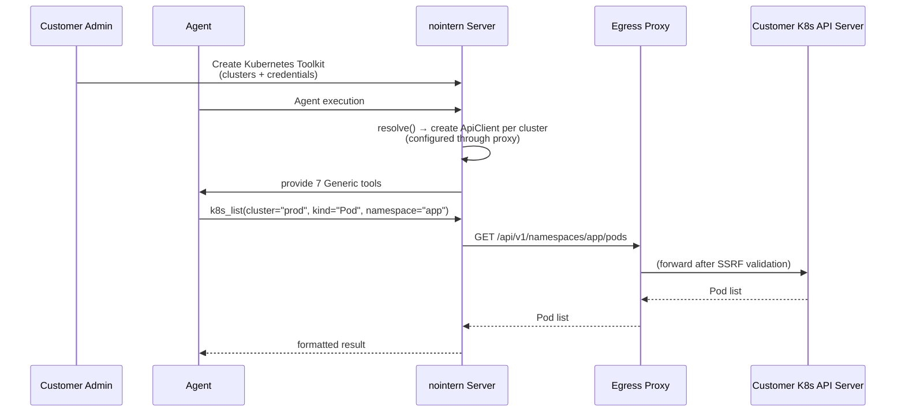
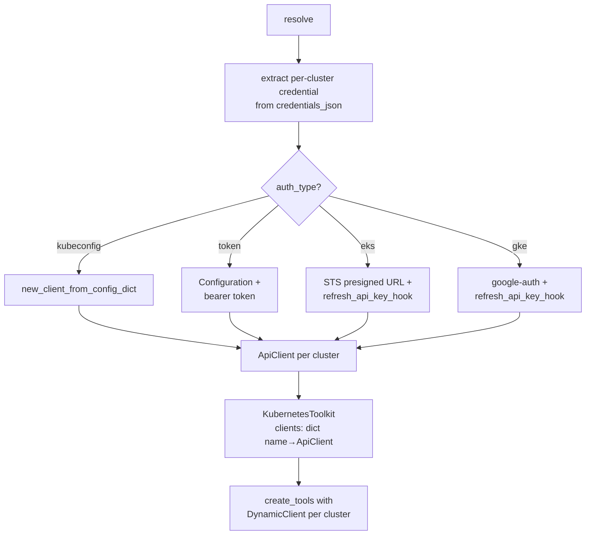
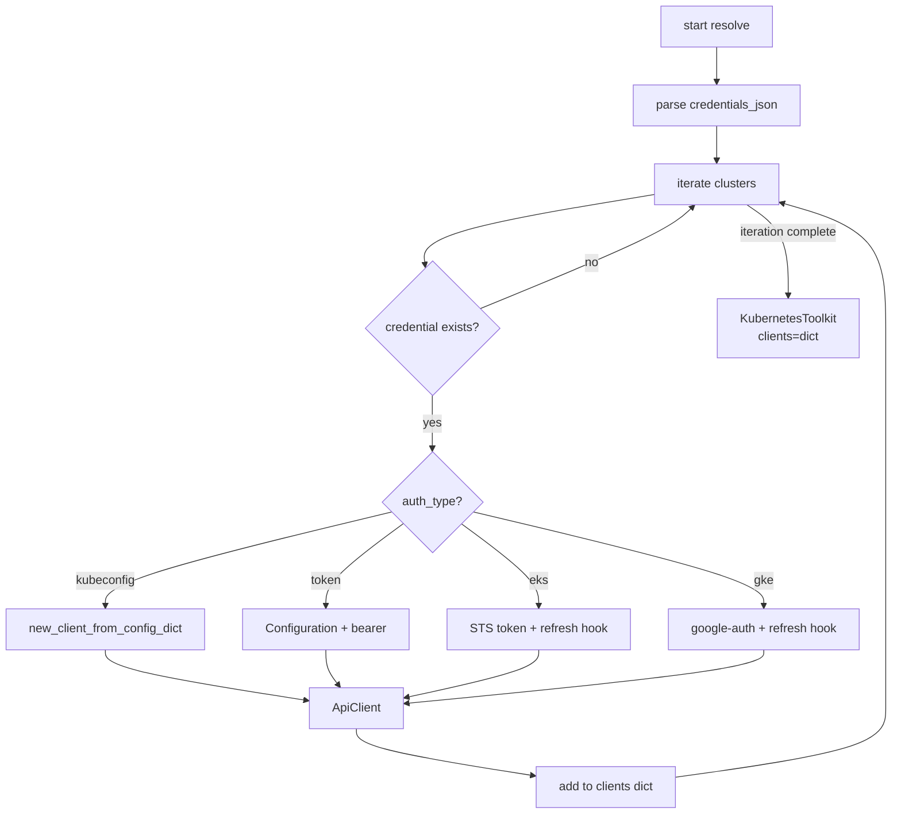

# Kubernetes Toolkit Design

## Overview

A dedicated Toolkit for remotely connecting to customer Kubernetes clusters and querying/managing resources. It uses Python `kubernetes` client's `DynamicClient` to cover all resource types (including CRDs) with 8 generic tools.

**Use cases:**
- Agent queries Pod status in customer EKS/GKE cluster to analyze failure cause
- Monitor Deployment rollout status after deploy and check logs on failure
- Create/update resources by applying YAML manifests
- Manage multiple clusters (production, staging, etc.) simultaneously from one toolkit

## Discussion Points and Decisions

### 1. Implementation method

| Option | Pros | Cons |
|--------|------|------|
| A) MCP server (stdio via mcp-proxy) | tools already implemented, security features built-in | stdio dependency, external binary bundle, difficult per-customer credential isolation |
| B) MCP server (Streamable HTTP) | remote deployment possible | per-customer instance needed, operational complexity |
| **C) Dedicated Toolkit (Python native)** | full control, no external dependency, natural credential isolation | direct tool implementation |

**Decision: C** — Implement native Toolkit based on Python `kubernetes` client, same pattern as Slack/Discord. Customer-specific credentials bind at resolve time, so isolation is natural.

### 2. Resource coverage

| Option | Tool count | Coverage |
|--------|---------|----------|
| A) resource-specific tools | hundreds | only specific resources |
| **B) Generic tools** | 7 | all resources (including CRDs) |
| C) kubectl wrapper | 1 | unlimited (security control difficult) |

**Decision: B** — Use `DynamicClient` to access all resources by `api_version` + `kind` combination. LLM specifies kind such as "Deployment", "Service", "Ingress".

### 3. Multi-cluster support

**Decision:** One toolkit can configure multiple clusters. Each cluster has a `name`, and tool call selects with `cluster` parameter.

### 4. Authentication method

Customers provide credentials because NoIntern connects remotely to customer cluster.

| Auth type | Target | What customer provides | Stored in credential |
|-----------|------|-----------------|------------------|
| `kubeconfig` | all K8s | kubeconfig YAML | full kubeconfig |
| `token` | all K8s | API server URL + SA token | token, ca_cert |
| `eks` | AWS EKS | IAM credentials + region | access_key, secret_key, role_arn |
| `gke` | GCP GKE | SA key + project/location | service_account_key JSON |

For EKS/GKE, cluster endpoint and CA cert are automatically queried through API (`describe_cluster` / `container.projects.locations.clusters.get`). Customer does not need to enter endpoint directly.

**Cluster scan:** Automatically scan accessible cluster list with EKS (`list_clusters`) and GKE (`container.projects.locations.clusters.list`) so customer can choose from dropdown.

**Decision:** Support all 4 auth types. Handle automatic token refresh through `kubernetes` library `Configuration` + `refresh_api_key_hook`.

### 5. Security

| Setting | Default | Description |
|------|--------|------|
| `read_only` | `True` | disable write tools (apply, delete, exec) |
| `allowed_namespaces` | `None` (all) | allow access only to specific namespaces |
| `denied_kinds` | `["Secret"]` | block access to specific resource types |

**kubeconfig validation:** Reject kubeconfig containing `exec` provider for kubeconfig auth. `exec` provider can execute arbitrary commands and creates SSRF/RCE risk. Allow only static auth methods such as `token`, `client-certificate-data`.

**Response truncation:** K8s API response can be large, so apply response size limit to all tools. Default max response size is 32KB, and if exceeded, truncate and add notice `(truncated, showing first N items)`.

**Cloud API vs K8s API proxy:** EKS `describe_cluster`/`list_clusters`, GKE `container.clusters.get`/`list` calls are AWS/GCP APIs, so they do not go through egress proxy. Only K8s API server calls go through egress proxy.

## Architecture



### Runtime structure



## Data Model

### KubernetesToolkitConfig

Non-secret settings stored in `ToolkitConfig.config` (JSONB):

```python
class ClusterConfig(BaseModel):
    """Individual cluster setting (non-secret)."""

    name: str = Field(description="Cluster name referenced by agent")
    auth_type: Literal["kubeconfig", "token", "eks", "gke"] = Field(
        description="Authentication method",
    )
    default_namespace: str = Field(
        default="default",
        description="Default namespace when namespace omitted",
    )
    # auth_type-specific non-secret settings
    context: str | None = Field(
        default=None,
        description="Context name to use for kubeconfig auth",
    )
    api_server: str | None = Field(
        default=None,
        description="API server URL for token auth",
    )
    cluster_name: str | None = Field(
        default=None,
        description="EKS/GKE cluster name",
    )
    region: str | None = Field(
        default=None,
        description="EKS region or GKE location",
    )
    project_id: str | None = Field(
        default=None,
        description="GKE project ID",
    )


class KubernetesToolkitConfig(BaseModel):
    """Kubernetes Toolkit configuration model."""

    clusters: list[ClusterConfig] = Field(
        description="List of clusters to connect",
    )
    read_only: bool = Field(
        default=True,
        description="If True, enable only read tools",
    )
    allowed_namespaces: list[str] | None = Field(
        default=None,
        description="Accessible namespace list (None means all)",
    )
    denied_kinds: list[str] = Field(
        default=["Secret"],
        description="Resource kinds to block",
    )
    timeout: float = Field(default=30.0, description="API request timeout (seconds)")
```

### Credential model

Secrets stored in `encrypted_credentials`:

```python
class KubernetesCredentials(BaseModel):
    """Per-cluster credential."""

    clusters: dict[str, ClusterCredential]


class KubeconfigCredential(BaseModel):
    type: Literal["kubeconfig"] = "kubeconfig"
    kubeconfig_yaml: str  # raw kubeconfig YAML


class TokenCredential(BaseModel):
    type: Literal["token"] = "token"
    token: str  # Service Account token
    ca_cert: str | None = None  # base64-encoded CA cert


class EksCredential(BaseModel):
    type: Literal["eks"] = "eks"
    aws_access_key_id: str
    aws_secret_access_key: str
    role_arn: str | None = None  # cross-account assume role
    # endpoint and CA cert are automatically queried with boto3 describe_cluster


class GkeCredential(BaseModel):
    type: Literal["gke"] = "gke"
    service_account_key: dict[str, object]  # SA key JSON
    # endpoint and CA cert are automatically queried with GKE API


ClusterCredential = (
    KubeconfigCredential | TokenCredential | EksCredential | GkeCredential
)
```

## Tool Design

### 7 Generic tools

| Tool | Description | read_only |
|------|-------------|-----------|
| `k8s_list` | list resources | ✓ |
| `k8s_get` | get specific resource details | ✓ |
| `k8s_logs` | get Pod logs | ✓ |
| `k8s_api_resources` | list available API resources | ✓ |
| `k8s_events` | get events related to resources | ✓ |
| `k8s_apply` | apply YAML manifest (create/update) | ✗ |
| `k8s_delete` | delete resource | ✗ |
| `k8s_exec` | execute command inside Pod | ✗ |

### Tool input models

```python
class K8sListInput(BaseModel):
    """k8s_list tool input."""
    cluster: str = Field(description="Cluster name")
    api_version: str = Field(default="v1", description="API version (e.g. v1, apps/v1)")
    kind: str = Field(description="Resource kind (e.g. Pod, Deployment, Service)")
    namespace: str | None = Field(default=None, description="namespace (default used if omitted)")
    label_selector: str | None = Field(default=None, description="Label selector (e.g. app=nginx)")
    field_selector: str | None = Field(default=None, description="Field selector (e.g. status.phase=Running)")
    limit: int = Field(default=50, ge=1, le=200, description="Max result count")


class K8sGetInput(BaseModel):
    """k8s_get tool input."""
    cluster: str = Field(description="Cluster name")
    api_version: str = Field(default="v1", description="API version")
    kind: str = Field(description="Resource kind")
    name: str = Field(description="Resource name")
    namespace: str | None = Field(default=None, description="namespace")


class K8sLogsInput(BaseModel):
    """k8s_logs tool input."""
    cluster: str = Field(description="Cluster name")
    namespace: str | None = Field(default=None, description="namespace")
    pod: str = Field(description="Pod name")
    container: str | None = Field(default=None, description="Container name (multi-container Pod)")
    tail_lines: int = Field(default=100, ge=1, le=1000, description="Last N lines")
    since_seconds: int | None = Field(default=None, description="Only logs within recent N seconds")


class K8sApplyInput(BaseModel):
    """k8s_apply tool input."""
    cluster: str = Field(description="Cluster name")
    manifest: str = Field(description="YAML manifest string")


class K8sDeleteInput(BaseModel):
    """k8s_delete tool input."""
    cluster: str = Field(description="Cluster name")
    api_version: str = Field(default="v1", description="API version")
    kind: str = Field(description="Resource kind")
    name: str = Field(description="Resource name")
    namespace: str | None = Field(default=None, description="namespace")


class K8sExecInput(BaseModel):
    """k8s_exec tool input."""
    cluster: str = Field(description="Cluster name")
    namespace: str | None = Field(default=None, description="namespace")
    pod: str = Field(description="Pod name")
    container: str | None = Field(default=None, description="Container name")
    command: list[str] = Field(description="Command to execute (e.g. ['ls', '-la'])")
```

### Security validation (common to all tools)

```python
def _check_access(
    config: KubernetesToolkitConfig,
    kind: str,
    namespace: str | None,
) -> None:
    """Check access permission. Raise FunctionToolError on violation."""
    # denied_kinds check
    if kind in config.denied_kinds:
        raise FunctionToolError(f"Access denied: {kind} is in denied_kinds.")
    # allowed_namespaces check
    if config.allowed_namespaces is not None and namespace is not None:
        if namespace not in config.allowed_namespaces:
            raise FunctionToolError(
                f"Access denied: namespace '{namespace}' is not in allowed_namespaces."
            )
```

## Provider Implementation

### KubernetesToolkitProvider

```python
class KubernetesToolkitProvider(ToolkitProvider[KubernetesToolkitConfig]):
    """Kubernetes Toolkit Provider."""

    slug = "kubernetes"
    name = "Kubernetes"
    description = "Kubernetes cluster management"
    system_prompt = dedent("""\
        You have access to Kubernetes cluster management tools.
        Use k8s_list and k8s_get to inspect resources,
        k8s_logs to check pod logs, and k8s_api_resources
        to discover available resource types.
        When specifying resources, use api_version (e.g. "v1",
        "apps/v1") and kind (e.g. "Pod", "Deployment").""")
    config_model = KubernetesToolkitConfig

    async def resolve(
        self,
        config: KubernetesToolkitConfig,
        context: ResolveContext,
    ) -> Toolkit[KubernetesToolkitConfig]:
        credentials = _parse_credentials(context.credentials_json)
        clients: dict[str, ApiClient] = {}

        for cluster_config in config.clusters:
            cluster_cred = credentials.clusters.get(cluster_config.name)
            if cluster_cred is None:
                continue
            clients[cluster_config.name] = _create_api_client(
                cluster_config, cluster_cred,
                proxy_url=context.mcp_proxy_url,
            )

        return KubernetesToolkit(clients=clients)
```

### ApiClient creation (by auth type)

```python
def _create_api_client(
    cluster: ClusterConfig,
    credential: ClusterCredential,
    *,
    proxy_url: str | None = None,
) -> ApiClient:
    """Create ApiClient according to auth type. Route through proxy for SSRF prevention."""
    if isinstance(credential, KubeconfigCredential):
        kubeconfig_dict = yaml.safe_load(credential.kubeconfig_yaml)
        api_client = new_client_from_config_dict(
            config_dict=kubeconfig_dict,
            context=cluster.context,
        )
        if proxy_url:
            api_client.configuration.proxy = proxy_url
        return api_client

    if isinstance(credential, TokenCredential):
        config = Configuration()
        config.host = cluster.api_server
        config.api_key["authorization"] = f"Bearer {credential.token}"
        if credential.ca_cert:
            config.ssl_ca_cert = _write_ca_cert(credential.ca_cert)
        if proxy_url:
            config.proxy = proxy_url
        return ApiClient(configuration=config)

    if isinstance(credential, EksCredential):
        return _create_eks_client(cluster, credential)

    if isinstance(credential, GkeCredential):
        return _create_gke_client(cluster, credential)

    msg = f"Unknown credential type: {type(credential).__name__}"
    raise TypeError(msg)
```

### EKS token auto refresh

```python
def _create_eks_client(
    cluster: ClusterConfig,
    credential: EksCredential,
) -> ApiClient:
    """Create ApiClient for EKS. Authenticate with STS presigned URL."""
    # automatically query endpoint + CA cert through describe_cluster
    endpoint, ca_data = _describe_eks_cluster(
        credential, cluster.cluster_name, cluster.region,
    )
    config = Configuration()
    config.host = endpoint
    config.ssl_ca_cert = _write_ca_cert(ca_data)

    def _get_token() -> str:
        session = boto3.Session(
            aws_access_key_id=credential.aws_access_key_id,
            aws_secret_access_key=credential.aws_secret_access_key,
        )
        if credential.role_arn:
            sts = session.client("sts")
            assumed = sts.assume_role(
                RoleArn=credential.role_arn,
                RoleSessionName="nointern-k8s",
            )["Credentials"]
            session = boto3.Session(
                aws_access_key_id=assumed["AccessKeyId"],
                aws_secret_access_key=assumed["SecretAccessKey"],
                aws_session_token=assumed["SessionToken"],
            )
        return _generate_eks_token(session, cluster.cluster_name, cluster.region)

    config.api_key["authorization"] = f"Bearer {_get_token()}"
    config.refresh_api_key_hook = lambda c: setattr(
        c, "api_key", {**c.api_key, "authorization": f"Bearer {_get_token()}"},
    )
    return ApiClient(configuration=config)
```

### GKE token auto refresh

```python
def _create_gke_client(
    cluster: ClusterConfig,
    credential: GkeCredential,
) -> ApiClient:
    """Create ApiClient for GKE. Authenticate with google-auth."""
    from google.oauth2 import service_account
    import google.auth.transport.requests

    creds = service_account.Credentials.from_service_account_info(
        credential.service_account_key,
        scopes=["https://www.googleapis.com/auth/cloud-platform"],
    )
    request = google.auth.transport.requests.Request()
    creds.refresh(request)

    # query GKE cluster info (endpoint + CA cert)
    endpoint, ca_data = _get_gke_cluster_info(
        creds, cluster.project_id, cluster.cluster_name, cluster.region,
    )

    config = Configuration()
    config.host = f"https://{endpoint}"
    config.ssl_ca_cert = _write_ca_cert(ca_data)
    config.api_key["authorization"] = f"Bearer {creds.token}"

    def _refresh(c: Configuration) -> None:
        if creds.expired:
            creds.refresh(request)
        c.api_key["authorization"] = f"Bearer {creds.token}"

    config.refresh_api_key_hook = _refresh
    return ApiClient(configuration=config)
```

## Resolve Flow



## Tool Creation Flow

```python
async def create_tools(
    self,
    config: KubernetesToolkitConfig,
    context: ToolkitContext,
) -> list[FunctionTool]:
    tools: list[FunctionTool] = [
        _make_list_tool(self._clients, config),
        _make_get_tool(self._clients, config),
        _make_logs_tool(self._clients, config),
        _make_api_resources_tool(self._clients, config),
        _make_events_tool(self._clients, config),
    ]
    if not config.read_only:
        tools.extend([
            _make_apply_tool(self._clients, config),
            _make_delete_tool(self._clients, config),
            _make_exec_tool(self._clients, config),
        ])
    return tools

def render_config_prompt(
    self, config: KubernetesToolkitConfig
) -> str | None:
    cluster_names = [c.name for c in config.clusters]
    parts = [f"Connected clusters: {', '.join(cluster_names)}"]
    if config.read_only:
        parts.append("Mode: read-only")
    else:
        parts.append("Mode: read-write (apply, delete, exec enabled)")
    if config.allowed_namespaces:
        parts.append(f"Allowed namespaces: {', '.join(config.allowed_namespaces)}")
    if config.denied_kinds:
        parts.append(f"Denied resource kinds: {', '.join(config.denied_kinds)}")
    return "\n".join(parts)
```

## Frontend Design

### KubernetesConfigFields component

```
┌───────────────────────────────────────────────────────┐
│  ⎈ Kubernetes                                         │
│                                                       │
│  Clusters                                             │
│  ┌─────────────────────────────────────────────────┐   │
│  │ ┌───────────────────────────────────────────┐   │   │
│  │ │ production-eks                        [✕] │   │   │
│  │ │ Auth: EKS (ap-northeast-2)                │   │   │
│  │ └───────────────────────────────────────────┘   │   │
│  │ ┌───────────────────────────────────────────┐   │   │
│  │ │ staging-gke                           [✕] │   │   │
│  │ │ Auth: GKE (asia-northeast3)               │   │   │
│  │ └───────────────────────────────────────────┘   │   │
│  │                                                 │   │
│  │ [+ Add cluster]                                 │   │
│  └─────────────────────────────────────────────────┘   │
│                                                       │
│  ── When adding/editing cluster ──                    │
│                                                       │
│  Name                                                 │
│  ┌─────────────────────────────────────────────────┐   │
│  │ production-eks                                  │   │
│  └─────────────────────────────────────────────────┘   │
│                                                       │
│  Auth method                                          │
│  ┌─────────────────────────────────────────────────┐   │
│  │ ○ Kubeconfig                                    │   │
│  │ ○ Service Account Token                         │   │
│  │ ○ AWS EKS (IAM)                                 │   │
│  │ ○ Google GKE (Service Account)                  │   │
│  └─────────────────────────────────────────────────┘   │
│                                                       │
│  ── When EKS selected ──                              │
│  Access Key:   [AKIA••••••••        ]                   │
│  Secret Key:   [••••••••••••        ]                   │
│  Role ARN:     [arn:aws:iam::..     ] (optional)        │
│  Region:       [ap-northeast-2  ▾   ]                   │
│                                                       │
│  [Scan clusters]                                      │
│  ┌─────────────────────────────────────────────────┐   │
│  │ ☑ production-cluster (ap-northeast-2)           │   │
│  │ ☐ staging-cluster (ap-northeast-2)              │   │
│  │ ☑ dev-cluster (us-west-2)                       │   │
│  └─────────────────────────────────────────────────┘   │
│                                                       │
│  ── Required permissions guide (dynamic per auth type) ── │
│  ┌─────────────────────────────────────────────────┐   │
│  │ ℹ️ IAM permissions required for EKS:             │   │
│  │   • eks:DescribeCluster (query cluster info)     │   │
│  │   • eks:ListClusters (scan clusters)             │   │
│  │   • sts:GetCallerIdentity (K8s auth)             │   │
│  │                                                 │   │
│  │ K8s RBAC (read_only mode):                       │   │
│  │   • get, list, watch on allowed resources         │   │
│  │   • pods/log (log query)                          │   │
│  │                                                 │   │
│  │ K8s RBAC (read-write mode, additional):          │   │
│  │   • create, update, patch, delete                │   │
│  │   • pods/exec (command execution)                │   │
│  │                                                 │   │
│  │ 📖 Setup guides:                                 │   │
│  │   EKS: "Granting IAM users and roles access"    │   │
│  │   GKE: "Configure access to clusters"            │   │
│  │   (each link points to official docs)            │   │
│  └─────────────────────────────────────────────────┘   │
│                                                       │
│  Security settings                                    │
│  ┌─────────────────────────────────────────────────┐   │
│  │ ☑ Read-only mode (recommended)                   │   │
│  │   Namespace limit: [app, monitoring] (optional)  │   │
│  │   Blocked resources: [Secret] (default)          │   │
│  └─────────────────────────────────────────────────┘   │
│                                                       │
│  [Test connection]                         [Save]      │
└───────────────────────────────────────────────────────┘
```

## Infra

**No external binary or sidecar needed.** Uses Python `kubernetes` client.

**SSRF prevention:** Customer directly enters API server URL, so all K8s API calls must **go through egress proxy** (same as SSRF prevention of existing MCP toolkit). Configure proxy through `kubernetes` client `Configuration.proxy`.

```python
configuration = Configuration()
configuration.host = cluster_endpoint  # customer-input URL
configuration.proxy = context.mcp_proxy_url  # SSRF prevention proxy
```

**Dependencies to add:**
- `kubernetes` (Python package) — add to nointern pyproject.toml
- `boto3` (for EKS auth) — likely already dependency
- `google-auth` (for GKE auth) — likely already dependency

## Feasibility Verification

| Item | Result | Note |
|------|------|------|
| `kubernetes` Python package | ✅ | v35.0.0, actively maintained |
| DynamicClient | ✅ | supports all resource types + CRDs |
| EKS STS token generation | ✅ | implementable with boto3 + RequestSigner |
| GKE google-auth token | ✅ | implementable with google-auth + SA key |
| token auto refresh | ✅ | supports `refresh_api_key_hook` |
| Pod logs | ✅ | CoreV1Api.read_namespaced_pod_log |
| Pod exec | ✅ | kubernetes.stream.stream |
| compatibility with existing Toolkit pattern | ✅ | same 3-tier structure as Slack/Discord |

### Risks

| Risk | Impact | Mitigation |
|--------|------|------|
| Customer cluster network access | nointern must reach customer API server | customer exposes API server via public or VPN/peering |
| Token expiration | EKS ~15 min, GKE ~1 hour | automatic refresh with refresh_api_key_hook |
| DynamicClient does not support logs/exec | CoreV1Api separate use needed | use CoreV1Api only for logs/exec, DynamicClient for rest |
| Large resource response | LLM context overflow | default limit parameter 50, response truncation |

## Implementation Plan

### Phase 1: Core implementation

| Component | Description | Reference pattern |
|-----------|-------------|-------------------|
| `KubernetesToolkitConfig` | Config + ClusterConfig model | `SlackToolkitConfig` |
| Credential model | ClusterCredential union type | `McpSecretsUnion` |
| `KubernetesToolkit` | create_tools (7 tools) + render_config_prompt | `SlackToolkit` |
| `KubernetesToolkitProvider` | resolve (create ApiClient per cluster) | `SlackToolkitProvider` |
| `ToolkitType.KUBERNETES` | add enum | `ToolkitType.SENTRY` |
| Registry registration | deps.py | `deps.py` |
| Auth module | EKS/GKE token generation + refresh | - |
| Cluster scan API | `POST /toolkit/v1/kubernetes/scan-clusters` | - |
| kubeconfig validation | reject exec provider | - |
| Tests | Config, security validation, tool creation, kubeconfig validation | `sentry_test.py` |

### Phase 2: Frontend

| Component | Description | Reference pattern |
|-----------|-------------|-------------------|
| `KubernetesConfigFields.tsx` | cluster list management + auth settings UI | `GcpConfigFields.tsx` |
| ToolkitForm.tsx registration | "kubernetes" type | existing pattern |

## Alternatives Considered

### Alternative 1: MCP server (stdio via mcp-proxy)
- **Rejected because**: Direction is to minimize stdio MCP dependency. Per-customer credential isolation requires instance separation → operational complexity.

### Alternative 2: MCP server (Streamable HTTP)
- **Rejected because**: `containers/kubernetes-mcp-server` supports Streamable HTTP, but operates with single kubeconfig, so per-customer instance is needed → operational complexity.

### Alternative 3: kubectl wrapper (execute from Shell toolkit)
- **Rejected because**: security control is difficult. Arbitrary kubectl command execution possible. kubectl binary installation required.

### Alternative 4: resource-specific tools (Pod query, Deployment query, ...)
- **Rejected because**: Kubernetes has hundreds of resource types. LLM context explodes. CRD support impossible.
