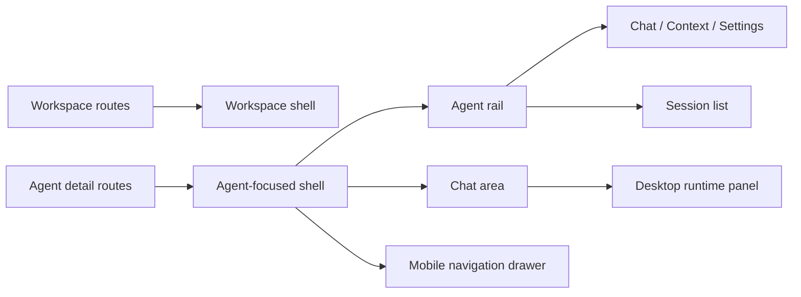

# Agent-Focused Session Layout

## Context

Team Agent sessions are no longer only the single implicit team-primary conversation. The UI needs a visible session list and a create-session action, but the previous `/w/{handle}` workspace shell already used the left side for workspace navigation while Agent chat also used a right runtime panel. Adding a third persistent navigation column to that workspace-wide layout would make desktop dense and mobile ambiguous.

## Decision

Agent detail routes use an Agent-focused shell instead of the workspace-wide shell.

Desktop layout:

- The global app bar remains at the top.
- The workspace sidebar is removed for Agent detail routes.
- A dedicated Agent rail appears on the left.
- The rail contains a workspace escape hatch, Agent identity, Agent tabs, the session list, and a new-session action.
- Chat content remains the main center region.
- The existing runtime/workspace panel remains on the desktop right side of chat.

Mobile layout:

- The page remains single-column.
- The Agent header has a menu button that opens the Agent rail as a drawer.
- The drawer contains Agent tabs and sessions.
- The runtime/workspace panel remains a secondary right drawer opened from the chat header.

## Route Structure

`/w/{handle}` remains the workspace boundary and membership gate. Route groups choose the visual shell below it:

- `(workspace)` wraps workspace pages with `WorkspaceShell`.
- `(agent)` wraps `/agents/{agentId}` detail pages with `AgentFocusedShell`.

This keeps URLs stable while avoiding a workspace-wide layout change for non-Agent pages.

## Test Strategy

E2E coverage should verify the product behavior in a follow-up flow that logs into a workspace, opens an Agent, observes the Agent rail/session list, creates a session, and verifies URL navigation to `/w/{handle}/agents/{agentId}/sessions/{sessionId}`.

For this implementation PR, local verification covers:

- TypeScript typecheck for route-group moves and new tRPC procedures.
- Lint/format for the new shell and story.
- Storybook story states for the pure Agent session rail component: loaded, loading, error, and empty.
