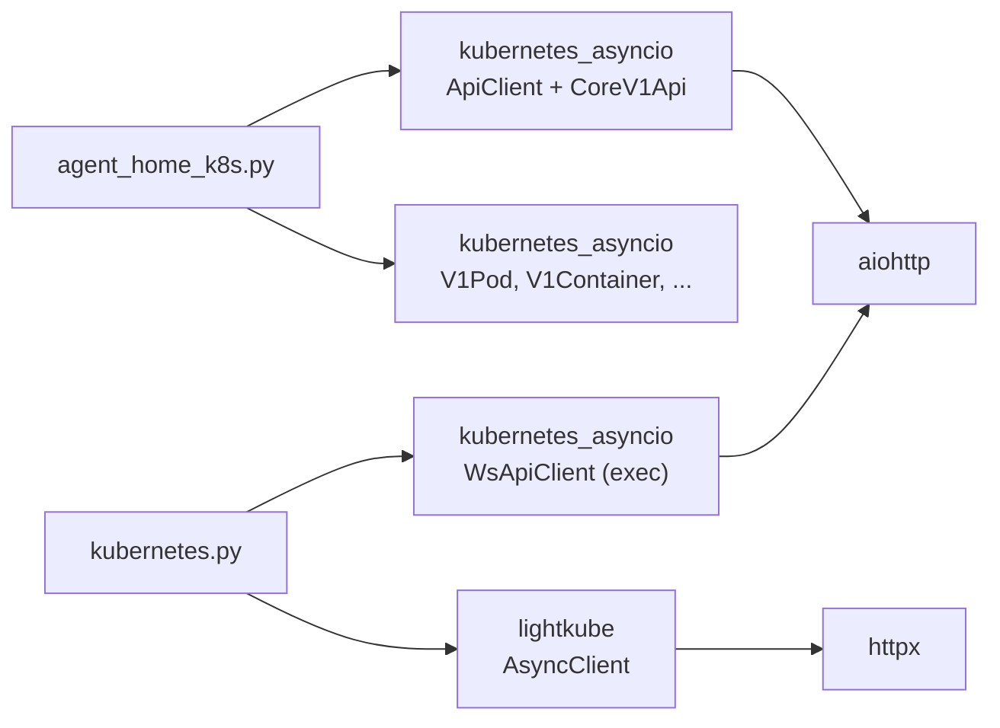
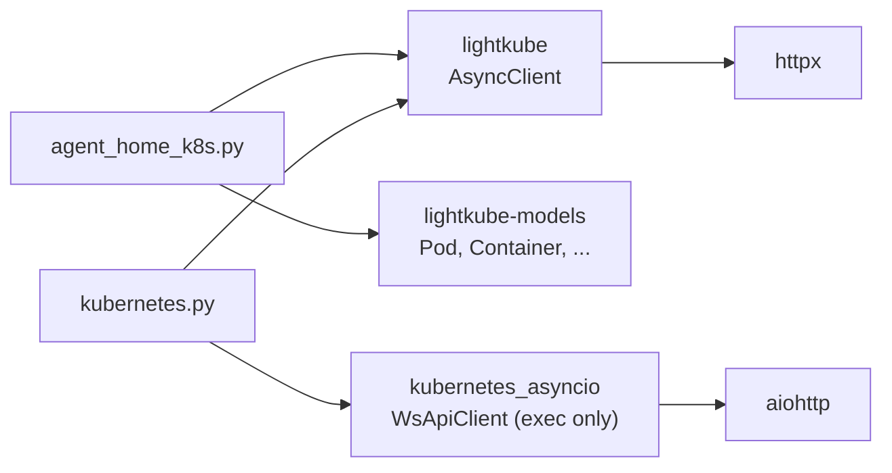

# Agent Home kubernetes_asyncio → lightkube Migration Design

## Overview

Migrate K8s client in Agent Home (`agent_home_k8s.py`) from kubernetes_asyncio to lightkube. In [previous migration](./lightkube-migration.md), only Toolkit was migrated; this extends migration to Agent Home and unifies K8s interface to lightkube.

**Problems solved:**
- K8s interface split between lightkube (Toolkit) and kubernetes_asyncio (Agent Home).
- Burden of manually maintaining V1* model type stubs for kubernetes_asyncio.

**Remaining kubernetes_asyncio scope after migration:**
- `kubernetes.py`: exec tool (`WsApiClient` — WebSocket required)
- `kubernetes_auth.py`: `create_exec_api_client()` (auth for exec)

## Discussion Points and Decisions

See [../adr/lightkube-260403-lightkube-migration-home.md](../adr/lightkube-260403-lightkube-migration-home.md).

Summary:
1. **exec remains**: keep kubernetes_asyncio only for exec (lightkube does not support WebSocket).
2. **Initialization method**: inject AsyncClient externally (DI pattern).
3. **Pod spec build**: use lightkube-models dataclass.

## Architecture

### Before



### After



## Data Model

### Import Mapping

| kubernetes_asyncio | lightkube |
|---|---|
| `V1Pod` | `lightkube.resources.core_v1.Pod` |
| `V1ConfigMap` | `lightkube.resources.core_v1.ConfigMap` |
| `V1Secret` | `lightkube.resources.core_v1.Secret` |
| `V1ObjectMeta` | `lightkube.models.meta_v1.ObjectMeta` |
| `V1PodSpec` | `lightkube.models.core_v1.PodSpec` |
| `V1Container` | `lightkube.models.core_v1.Container` |
| `V1ContainerPort` | `lightkube.models.core_v1.ContainerPort` |
| `V1EnvVar` | `lightkube.models.core_v1.EnvVar` |
| `V1Probe` | `lightkube.models.core_v1.Probe` |
| `V1HTTPGetAction` | `lightkube.models.core_v1.HTTPGetAction` |
| `V1SecurityContext` | `lightkube.models.core_v1.SecurityContext` |
| `V1SeccompProfile` | `lightkube.models.core_v1.SeccompProfile` |
| `V1ResourceRequirements` | `lightkube.models.core_v1.ResourceRequirements` |
| `V1VolumeMount` | `lightkube.models.core_v1.VolumeMount` |
| `V1Volume` | `lightkube.models.core_v1.Volume` |
| `V1PersistentVolumeClaimVolumeSource` | `lightkube.models.core_v1.PersistentVolumeClaimVolumeSource` |
| `V1ConfigMapVolumeSource` | `lightkube.models.core_v1.ConfigMapVolumeSource` |
| `V1SecretVolumeSource` | `lightkube.models.core_v1.SecretVolumeSource` |
| `ApiException` | `lightkube.ApiError` |

### Error Handling Mapping

```python
# Before (kubernetes_asyncio)
from kubernetes_asyncio.client.rest import ApiException
try:
    await v1.read_namespaced_pod(name=name, namespace=ns)
except ApiException as e:
    if e.status == 404:
        return None

# After (lightkube)
from lightkube import ApiError
try:
    await client.get(Pod, name=name, namespace=ns)
except ApiError as e:
    if e.status.code == 404:
        return None
```

### K8sAgentHomeClient Change

```python
class K8sAgentHomeClient(AgentHomeClient):
    def __init__(
        self,
        client: AsyncClient,       # inject lightkube client (existing: internally created)
        namespace: str,
        image: str,
        ready_timeout_secs: int = 180,
        mcp_proxy_image: str = "",
    ) -> None:
        self._client = client       # lightkube AsyncClient
        self._namespace = namespace
        self._image = image
        self._ready_timeout_secs = ready_timeout_secs
        self._mcp_proxy_image = mcp_proxy_image
        self._daemon_clients: dict[str, SandboxDaemonClient] = {}

    # remove _get_api_client() — lazy init no longer needed
```

### Factory Change

```python
# agent_home_factory.py
from lightkube import AsyncClient

def create_agent_home_client(
    agent_home_config: AgentHomeConfig,
    sandbox_config: SandboxConfig,
) -> AgentHomeClient:
    match sandbox_config.backend:
        case "docker":
            return DockerAgentHomeClient(...)
        case "k8s":
            # create lightkube AsyncClient
            if agent_home_config.k8s_kubeconfig:
                from lightkube.config.kubeconfig import KubeConfig
                config = KubeConfig.from_file(agent_home_config.k8s_kubeconfig)
                client = AsyncClient(
                    config=config,
                    namespace=agent_home_config.k8s_namespace,
                )
            else:
                # auto-detect in-cluster
                client = AsyncClient(
                    namespace=agent_home_config.k8s_namespace,
                )
            return K8sAgentHomeClient(
                client=client,
                namespace=agent_home_config.k8s_namespace,
                image=agent_home_config.k8s_image,
                ready_timeout_secs=agent_home_config.k8s_ready_timeout_secs,
                mcp_proxy_image=agent_home_config.k8s_mcp_proxy_image,
            )
```

## CRUD Operation Conversion Details

### Pod lookup (_get_pod)

```python
# Before
api_client = await self._get_api_client()
v1 = CoreV1Api(api_client)
pod = await v1.read_namespaced_pod(name=name, namespace=self._namespace)
return cast(dict[str, Any], pod.to_dict())

# After
pod = await self._client.get(Pod, name=name, namespace=self._namespace)
return pod  # return lightkube Pod object directly (no dict conversion needed)
```

> **Note:** Current `_get_pod()` returns dict and uses access pattern `pod.get("status", {}).get("phase")`. When switching to lightkube, change to typed access like `pod.status.phase`.

### Pod create (ensure_ready)

```python
# Before
await v1.create_namespaced_pod(namespace=self._namespace, body=pod_spec)
# ApiException status=409 → AlreadyExists

# After
await self._client.create(pod_spec, namespace=self._namespace)
# ApiError status.code=409 → AlreadyExists
```

### Pod delete (_delete_pod)

```python
# Before
await v1.delete_namespaced_pod(name=name, namespace=self._namespace)

# After
await self._client.delete(Pod, name=name, namespace=self._namespace)
```

### Pod Annotation patch (update_last_used)

```python
# Before
await v1.patch_namespaced_pod(
    name=name, namespace=self._namespace,
    body={"metadata": {"annotations": {_LAST_USED_ANNOTATION: now}}},
)

# After
await self._client.patch(
    Pod, name=name,
    obj={"metadata": {"annotations": {_LAST_USED_ANNOTATION: now}}},
    namespace=self._namespace,
)
```

### Pod list (list_idle_agents)

```python
# Before
pods = await v1.list_namespaced_pod(
    namespace=self._namespace,
    label_selector=f"app={_APP_LABEL_VALUE}",
)
for pod in pods.items:
    agent_id = pod.metadata.labels.get(_AGENT_ID_LABEL, "")

# After
async for pod in self._client.list(
    Pod,
    namespace=self._namespace,
    labels={"app": _APP_LABEL_VALUE},
):
    agent_id = (pod.metadata.labels or {}).get(_AGENT_ID_LABEL, "")
```

### ConfigMap/Secret CRUD (_ensure_mcp_proxy_resources)

```python
# Before — prefer replace, create if 404
try:
    await v1.replace_namespaced_config_map(name=cm_name, namespace=ns, body=cm)
except ApiException as e:
    if e.status == 404:
        await v1.create_namespaced_config_map(namespace=ns, body=cm)

# After
try:
    await self._client.replace(cm, namespace=self._namespace)
except ApiError as e:
    if e.status.code == 404:
        await self._client.create(cm, namespace=self._namespace)
```

### Pod Spec build (_build_pod_spec)

```python
from lightkube.models.core_v1 import (
    Container, ContainerPort, EnvVar, HTTPGetAction,
    PersistentVolumeClaimVolumeSource, PodSpec, Probe,
    ResourceRequirements, SeccompProfile, SecurityContext,
    SecretVolumeSource, ConfigMapVolumeSource,
    Volume, VolumeMount,
)
from lightkube.models.meta_v1 import ObjectMeta
from lightkube.resources.core_v1 import Pod

def _build_pod_spec(self, agent_id: str, ...) -> Pod:
    return Pod(
        metadata=ObjectMeta(
            name=_pod_name(agent_id),
            namespace=self._namespace,
            labels={"app": _APP_LABEL_VALUE, _AGENT_ID_LABEL: agent_id},
            annotations={
                _LAST_USED_ANNOTATION: datetime.now(timezone.utc).isoformat(),
                "karpenter.sh/do-not-disrupt": "true",
            },
        ),
        spec=PodSpec(
            containers=[
                Container(
                    name=_SANDBOX_CONTAINER,
                    image=self._image,
                    workingDir="/mnt/agent-data",
                    env=[EnvVar(name="ENABLE_PROXY", value="true"), ...],
                    ports=[ContainerPort(name="daemon", containerPort=_DAEMON_PORT, protocol="TCP")],
                    readinessProbe=Probe(
                        httpGet=HTTPGetAction(path="/health", port=_DAEMON_PORT, scheme="HTTP"),
                        initialDelaySeconds=2, periodSeconds=5, failureThreshold=3,
                    ),
                    # ... liveness, security, resources
                ),
            ],
            volumes=[
                Volume(
                    name="agent-data",
                    persistentVolumeClaim=PersistentVolumeClaimVolumeSource(claimName="agent-home-efs"),
                ),
            ],
        ),
    )
```

> **Field name note:** kubernetes_asyncio uses snake_case (`container_port`, `http_get`), while lightkube-models uses camelCase (`containerPort`, `httpGet`).

## Infrastructure

No change. lightkube is already included in pyproject.toml.

## Dependency Change

```toml
# removable
# kubernetes==35.0.0  — used only for type stubs, not actual code

# keep (exec only)
"kubernetes-asyncio==35.0.1"

# keep existing
"lightkube==0.19.1"  # duplicate declaration needs cleanup
```

## Feasibility Verification Results

| Item | Result | Detail |
|------|------|------|
| Pod create/get/delete/patch | OK | lightkube AsyncClient basic CRUD |
| Pod list with labels | OK | `client.list(Pod, labels={...})` |
| ConfigMap/Secret create/replace | OK | `client.create(cm)`, `client.replace(cm)` |
| ApiError status code access | OK | `exc.status.code` (404, 409, etc.) |
| lightkube-models field names | caution | camelCase (`containerPort` not `container_port`) |
| in-cluster config | OK | `AsyncClient()` auto-detects |
| kubeconfig file | OK | `KubeConfig.from_file(path)` |
| namespace specification | OK | `AsyncClient(namespace=...)` or per-method specification |

## Risks

| Risk | Impact | Mitigation |
|--------|------|------|
| lightkube-models field names are camelCase | typo possible during conversion | build-time verification with pyright type check |
| _get_pod() return type change (dict → Pod) | caller code changes needed | change to typed access (pod.status.phase) |
| AsyncClient DI transition | factory change needed | simple change, verify with existing tests |

## Implementation Plan

### Phase 1: Convert K8sAgentHomeClient to lightkube

1. **Change imports**: kubernetes_asyncio V1* → lightkube models/resources.
2. **Change constructor**: internal `ApiClient` creation → external `AsyncClient` injection.
3. **Change _get_pod() return type**: `dict[str, Any] | None` → `Pod | None`.
4. **Convert CRUD methods**: see details above.
5. **Convert _build_pod_spec()**: V1* model → lightkube-models (watch camelCase).
6. **Convert error handling**: `ApiException` → `ApiError`.
7. **Change close()**: `ApiClient.close()` → `AsyncClient.close()` (httpx cleanup).

### Phase 2: Factory + Dependency Cleanup

1. **Modify agent_home_factory.py**: create and inject AsyncClient.
2. **Clean pyproject.toml**: remove duplicate lightkube declaration, remove synchronous kubernetes package.
3. **Clean kubernetes_asyncio type stubs**: agent_home-related stubs unnecessary.

### Phase 3: Tests

1. **Update existing tests**: change mock objects to lightkube types.
2. **Quality check**: ruff, pyright, pytest.

## Alternatives Considered

| Alternative | Rejection reason |
|------|-----------|
| fully replace exec with kr8s | inefficient to mix two libraries, kr8s maturity uncertain |
| implement WebSocket exec directly | SPDY protocol complexity, maintenance risk |
| dict-based Pod spec | does not use lightkube type-safety benefit |
| lightkube auto-loading (without DI) | cannot control kubeconfig path, difficult to test |
| no migration (status quo) | K8s interface remains split, unification goal unmet |
