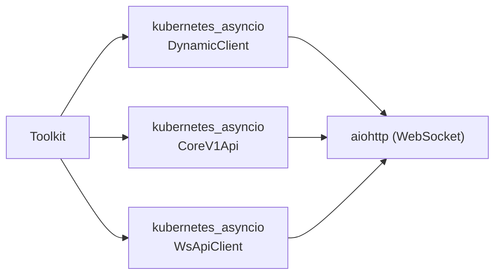
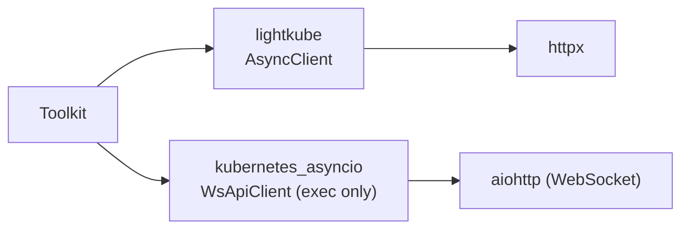

# kubernetes_asyncio → lightkube Migration Design

## Overview

Replace K8s client in Kubernetes Toolkit (`engine/tools/kubernetes.py`) from `kubernetes_asyncio` to `lightkube`.

**Problems solved:**
- Repeated type bugs in kubernetes_asyncio DynamicClient (#2198, NOINTERN-SEVER-3N, etc.)
- Burden of manually maintaining type stubs (kubernetes_asyncio does not provide its own types)

**Not migrated:**
- `runtime/sandbox/agent_home_k8s.py` — uses only typed V1* models, so no type bugs and no change needed

## Discussion Points and Decisions

See [../adr/0016-lightkube-migration.md](../adr/0016-lightkube-migration.md).

Summary:
1. **Scope**: Toolkit only (exclude agent_home_k8s.py)
2. **Pod exec**: keep kubernetes_asyncio WsApiClient (lightkube does not support WebSocket)
3. **API discovery**: direct httpx call to `/apis` + kind→plural cache
4. **Auth**: lightkube KubeConfig + custom httpx.Auth (EKS/GKE token refresh)
5. **Error handling**: `ApiException` → `ApiError`, `ClientError` → httpx exceptions

## Architecture

### Before



### After



## Data Model

### No Change
- `KubernetesToolkitConfig`, `ClusterConfig` — keep existing Pydantic models
- `K8s*Input` tool input models — no change
- Credential models — no change

### Changes

```python
class KubernetesToolkit(Toolkit[KubernetesToolkitConfig]):
    def __init__(
        self,
        *,
        config: KubernetesToolkitConfig,
        clients: dict[str, AsyncClient],          # lightkube (most tools)
        exec_clients: dict[str, ApiClient],       # kubernetes_asyncio (exec only)
    ) -> None:
        ...
```

### ResourceDiscoveryCache (new)

```python
@dataclasses.dataclass
class ResourceInfo:
    """Resource metadata collected from API discovery."""
    group: str
    version: str
    kind: str
    plural: str           # required by lightkube create_*_resource()
    namespaced: bool

class ResourceDiscoveryCache:
    """Cache API resource discovery results per cluster.

    lightkube create_namespaced_resource() requires plural name, so collect
    kind→plural mapping from /api/v1 + /apis/{group}/{version}.
    """

    async def discover(self, client: AsyncClient) -> None:
        """Perform K8s API discovery and cache resource information."""
        ...

    def get_resource_class(
        self, api_version: str, kind: str,
    ) -> type[GenericNamespacedResource] | type[GenericGlobalResource]:
        """Return lightkube resource class by api_version + kind.

        1. Search built-in resources in lightkube.resources.*
        2. Query plural from cache → dynamically create with create_*_resource()
        """
        ...

    def list_all(self) -> list[ResourceInfo]:
        """Full cached resource list (for k8s_api_resources)."""
        ...
```

## Auth Layer Change

### Split kubernetes_auth.py

```python
# for lightkube — used by most tools
async def create_lightkube_client(
    cluster_config: ClusterConfig,
    credential: ClusterCredential,
    *,
    proxy_url: str | None = None,
) -> AsyncClient:
    """Create lightkube AsyncClient."""
    ...

# exec-only — kubernetes_asyncio ApiClient (rename existing create_api_client())
async def create_exec_api_client(
    cluster_config: ClusterConfig,
    credential: ClusterCredential,
    *,
    proxy_url: str | None = None,
) -> ApiClient:
    """Create kubernetes_asyncio ApiClient for exec only."""
    ...
```

### Mapping by Auth Method

| Auth method | kubernetes_asyncio | lightkube |
|-----------|-------------------|-----------|
| kubeconfig | `new_client_from_config_dict()` | `KubeConfig.from_dict()` + keep exec provider validation |
| token | `Configuration.api_key["BearerToken"]` | `KubeConfig.from_one(user=User(token=...))` |
| EKS | `Configuration` + `refresh_api_key_hook` | custom `httpx.Auth` (async_auth_flow) |
| GKE | `Configuration` + `refresh_api_key_hook` | custom `httpx.Auth` (async_auth_flow) |

### EKS/GKE Token Refresh

Because lightkube's `ExecAuth` supports `async_auth_flow()`, implement custom Auth with same pattern:

```python
class CloudTokenAuth(httpx.Auth):
    """Auth handler that automatically refreshes EKS/GKE token.

    Implemented with async_auth_flow() following lightkube ExecAuth pattern.
    On 401 response, calls token_provider and obtains new token.
    """

    def __init__(
        self,
        token_provider: Callable[[], Awaitable[str]],
        initial_token: str,
    ) -> None:
        self._token_provider = token_provider
        self._bearer = f"Bearer {initial_token}"

    async def async_auth_flow(
        self, request: httpx.Request,
    ) -> collections.abc.AsyncGenerator[httpx.Request, httpx.Response]:
        """Async auth flow called by lightkube AsyncClient."""
        request.headers["Authorization"] = self._bearer
        response = yield request
        if response.status_code != 401:
            return
        # 401 → refresh token
        new_token = await self._token_provider()
        self._bearer = f"Bearer {new_token}"
        request.headers["Authorization"] = self._bearer
        yield request
```

EKS token_provider:
```python
async def _eks_token_provider(
    cluster_config: ClusterConfig,
    credential: EksCredential,
) -> str:
    """Issue EKS token with STS presigned URL."""
    # reuse _generate_presigned_url() logic from existing kubernetes_auth.py
    ...
```

GKE token_provider:
```python
async def _gke_token_provider(credential: GkeCredential) -> str:
    """Issue GKE token with GCP service account."""
    # reuse existing google.oauth2 logic from kubernetes_auth.py
    ...
```

### KubeConfig Creation Example

```python
# Token auth
config = KubeConfig.from_one(
    cluster=Cluster(
        server=cluster_config.api_server,
        certificate_auth_data=credential.ca_cert,  # base64
    ),
    user=User(token=credential.token),
)
client = AsyncClient(config=config, proxy=proxy_url)

# EKS/GKE — inject CloudTokenAuth into lightkube
# lightkube does not receive auth parameter directly,
# so create with KubeConfig.from_one(user=User(token=initial_token)) then
# need method to replace auth on httpx client
#
# Alternative: User(exec=UserExec(command="python", args=["-c", "print(token)"]))
# → delegate token refresh to external script
```

> **Implementation note**: lightkube `AsyncClient` constructor does not accept `auth` parameter.
> `User(exec=UserExec(...))` pattern is most stable. Issue EKS/GKE token with inline Python or split into separate helper script.

## Tool Migration Details

### k8s_list

```python
# Before
async with _safe_dynamic_client(api_client) as dyn:
    resource = await dyn.resources.get(api_version=args.api_version, kind=args.kind)
    result = await dyn.get(resource, namespace=ns, limit=args.limit, ...)
    items = [item.to_dict() for item in result.items]

# After
res_class = discovery_cache.get_resource_class(args.api_version, args.kind)
items: list[dict[str, Any]] = []
async for item in client.list(res_class, namespace=ns,
                               chunk_size=args.limit,
                               labels=args.label_selector,
                               fields=args.field_selector):
    items.append(dict(item))
    if len(items) >= args.limit:
        break
```

### k8s_get

```python
# After
res_class = discovery_cache.get_resource_class(args.api_version, args.kind)
result = await client.get(res_class, name=args.name, namespace=ns)
return json.dumps(dict(result), indent=2, default=str)
```

### k8s_logs

```python
# After (lightkube native — CoreV1Api unnecessary)
lines: list[str] = []
async for line in client.log(args.pod, namespace=ns,
                              container=args.container,
                              tail_lines=args.tail_lines,
                              since=args.since_seconds):
    lines.append(line)
return "".join(lines) or "No logs found."
```

### k8s_events

```python
# After (typed resource)
from lightkube.resources.core_v1 import Event
events: list[dict[str, Any]] = []
async for event in client.list(Event, namespace=ns, fields=field_selector):
    events.append(dict(event))
```

### k8s_api_resources

```python
# After — use ResourceDiscoveryCache
resources = discovery_cache.list_all()
lines = [
    f"{r.group}/{r.version}/{r.kind} (namespaced={r.namespaced})"
    if r.group else f"{r.version}/{r.kind} (namespaced={r.namespaced})"
    for r in sorted(resources, key=lambda r: f"{r.group}/{r.version}/{r.kind}")
]
```

discovery_cache is built once at Toolkit resolve time and shared by all tools.

### k8s_apply (Server-Side Apply)

```python
# After — need typed class created with create_*_resource()
# client.apply() does not accept Generic dict!
for doc in docs:
    api_version = doc.get("apiVersion")
    kind = doc.get("kind")
    res_class = discovery_cache.get_resource_class(api_version, kind)
    obj = res_class(doc)  # GenericNamespacedResource(dict) — dict subclass
    await client.apply(obj, field_manager="nointern-toolkit")
```

### k8s_delete

```python
# After
res_class = discovery_cache.get_resource_class(args.api_version, args.kind)
await client.delete(res_class, name=args.name, namespace=ns)
```

### k8s_exec (no change)

```python
# keep kubernetes_asyncio WsApiClient (lightkube has no WebSocket)
exec_api_client = self._exec_clients.get(args.cluster)
ws_client = WsApiClient(configuration=exec_api_client.configuration)
core_v1 = CoreV1Api(ws_client)
response = await core_v1.connect_get_namespaced_pod_exec(...)
```

### test_connection

```python
# After — call /version with lightkube
# Option 1: cannot use lightkube typed resource (no VersionInfo)
# Option 2: direct httpx client usage is private API
# Option 3: verify connection with simple resource list
try:
    # Test connection by listing Namespace (minimal permission)
    from lightkube.resources.core_v1 import Namespace
    async for _ in client.list(Namespace, chunk_size=1):
        break
    results.append(f"{cluster_config.name}: connected")
except ApiError as exc:
    # 403 also means connection succeeded (permission lacking only)
    if exc.status.code == 403:
        results.append(f"{cluster_config.name}: connected (limited access)")
    else:
        results.append(f"{cluster_config.name}: FAILED ({exc.status.code})")
```

## Feasibility Verification Results

| Item | Result | Detail |
|------|------|------|
| SSA (server_side_apply) | ✅ possible | `client.apply(obj, field_manager=...)` |
| Generic.from_dict() | ✅ possible | `Generic.from_dict(dict)` or `Generic(dict)` |
| **apply() with Generic** | ❌ impossible | only typed resource allowed by `isinstance` check → need `create_*_resource()` |
| **plural parameter** | ❌ required | `create_namespaced_resource(group, version, kind, plural)` → discovery cache needed |
| proxy support | ✅ possible | `AsyncClient(proxy=...)` |
| **internal httpx client** | ⚠️ private | `client._client` — api-resources replaced by discovery cache |
| **EKS/GKE token refresh** | ⚠️ workaround | `User(exec=UserExec(...))` or custom httpx.Auth |
| kubeconfig exec blocking | ✅ possible | apply existing validate_kubeconfig() before `KubeConfig.from_dict()` |
| list with limit | ✅ possible | `chunk_size` parameter |
| error handling | ✅ possible | `ApiError.status.code`, `.status.reason` |

## Risks

| Risk | Impact | Mitigation |
|--------|------|------|
| lightkube private API change | api-resources discovery breaks | implement own discovery with ResourceDiscoveryCache |
| EKS/GKE token refresh failure | auth expires | stable implementation with UserExec pattern |
| lightkube update frequency | delayed new K8s API support | cover with Generic resource |
| apply() allows only typed class | extra work for YAML manifest apply | automatic mapping from discovery cache |

## Implementation Plan

### Phase 1: Infrastructure (ResourceDiscoveryCache + Auth)
- Implement `ResourceDiscoveryCache` (discovery via httpx `/api/v1` + `/apis`).
- Add `create_lightkube_client()` function (4 auth methods).
- Implement `CloudTokenAuth` (EKS/GKE).
- Rename existing `create_api_client()` to `create_exec_api_client()`.
- Unit tests.

### Phase 2: Tool Migration
- Read tools: k8s_list, k8s_get, k8s_logs, k8s_events → lightkube.
- k8s_api_resources → ResourceDiscoveryCache.list_all().
- Write tools: k8s_apply (SSA), k8s_delete → lightkube.
- k8s_exec: keep WsApiClient, separate exec_clients.
- Modify KubernetesToolkit/Provider classes.
- Error handling mapping (ApiException → ApiError).
- Update tests.

### Phase 3: Cleanup
- Remove DynamicClient-related type stubs.
- Check lightkube own types (write additional stubs if needed).
- pyproject.toml: add lightkube, keep kubernetes_asyncio (exec + sandbox).
- Remove `_safe_dynamic_client()` wrapper.

## Alternatives Considered

| Alternative | Rejection reason |
|------|-----------|
| kr8s | no SSA support (issue #443) |
| kubernetes (sync) + asyncio wrapper | not true async |
| keep kubernetes_asyncio + improve stubs | not root solution, only defense against DynamicClient internal bug |
| full lightkube migration (including sandbox) | agent_home_k8s.py uses 20+ V1* models, low benefit for cost |
| implement exec with raw websockets | high risk of implementing K8s exec SPDY/WS multiplexing directly |
