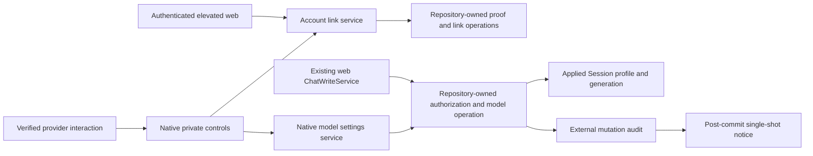

# External Account Linking and Conversation Settings Design

- Snapshot: `linking-260912`
- Requirements: [linking-260912/REQ](../requirements/linking-260912-external-account-settings.md)
- Decisions: [linking-260912/ADR](../adr/linking-260912-external-account-settings.md)
- Delivery: one feature PR, unmerged until requester approval; independent work lanes share this Design, not independent product authority.

## Current Behavior and Gap

The current [External Channel authorization](../spec/flow/external-channel-authorization.md) separates provider principals from Azents Users and authorizes native guest response/location settings with open access, grants, and blocks. `ExternalChannelParticipationService` resolves exact parent or connected-thread scope. Slack uses authenticated actor-private modals; Discord uses signed interactions and ephemeral settings. There is no current Azents account link.

`ChatWriteService.replace_session_model_profile` validates a writable root Session, active Agent, Workspace membership, User-mode ownership, and Agent model options. `AgentSessionRepository.set_applied_inference_profile` is also called by composer/input, edited input, and subagent setup. It has no draft-conflict generation. Applied intent is separate from the immutable prepared model-call snapshot, as specified by [Conversation](../spec/domain/conversation.md). Existing [User authentication](../spec/domain/user-auth.md) supplies live authenticated Sessions and elevated JWTs, but not a durable cross-provider linking proof.

## Design Authority

- Design revision: `2`

| ID | Material design mechanism | Authority | Classification |
| --- | --- | --- | --- |
| M1 | Preserve guest principal/grant/block and canonical execution identity boundaries | REQ-1; current External Channel authorization | required |
| M2 | Native-origin, immutable browser candidate, hash-only code, original-actor proof and same-elevated-Session final commit | ADR-D1; REQ-2, REQ-3, REQ-11 | decided |
| M3 | Workspace links with provider-normalized identity, active uniqueness, terminal unlink, bounded challenge lifecycle and database cleanup | ADR-D2; REQ-2, REQ-3, REQ-9 | decided |
| M4 | Shared canonical model validation/write with generation-fenced native drafts and unchanged web API semantics | ADR-D3; REQ-6, REQ-7, REQ-8 | decided |
| M5 | Nonblocking native transaction locks, bounded whole-operation retry and shared revocation fences | ADR-D2, ADR-D3; REQ-6, REQ-8, REQ-9 | decided |
| M6 | Actor-private native linking/model screens, independent guest controls, bounded drafts and denied-user link-only surface | ADR-D4; REQ-4, REQ-5, REQ-6, REQ-9 | decided |
| M7 | Atomic external mutation audit with single-shot post-commit common notice and separate delivery outcome | ADR-D4; REQ-8, REQ-10 | decided |
| M8 | Personal web link list/unlink and explicit identity-confirmation/return flow using existing auth and elevation | ADR-D1, ADR-D2, ADR-D4; REQ-9, REQ-11 | derived |
| M9 | Additive schema, generated API surfaces, existing lifecycle retention and no guest migration | ADR-D2, ADR-D3, ADR-D4; REQ-1; repository migration/client conventions | derived |

These are the complete material mechanisms. Local names, helper decomposition, equivalent DTO layouts, page components, fixture composition, and test file placement are implementation-owned details. They cannot introduce a new permission mode, fallback, state authority, or product outcome.

## Architecture and Ownership



- Provider adapters own signature checks, transient callback credentials, native rendering, and external I/O.
- New linking and model-settings services sequence completed repository operations and provider calls. They never pass live SQLAlchemy sessions across the service boundary.
- Repositories own all transactions, lifecycle locks, typed persistence and atomic validation/write composition.
- Workspace link identity is independent of existing provider principal identity and never becomes Session execution authority.
- Browser APIs operate only on the authenticated user's linking workflow and links. Model editing remains native-private, not a new web settings fallback.

### Implementation Areas

- `core/external_account_link.py`: bounded immutable domain contracts, identity normalization, safe error categories.
- `rdb/models/external_account_link.py` and `repos/external_account_link/`: link, origin, candidate, cleanup and owner-authorized operations.
- `services/external_account_link.py` and `api/public/external_channel/v1/account_link_route.py`: completed operations and HTTP translation.
- `repos/session_model_profile/`: shared canonical profile validation/write composition extracted from the existing dedicated web write.
- `repos/external_channel/model_settings.py`, corresponding service/domain contracts and model: native draft, authorization, mutation audit and notice preparation.
- Existing Slack `interaction.py`, `slack_http.py`, and Discord `discord_http.py`, `discord_interaction.py`, `discord_settings.py`: narrowly integrated private actions and typed ingress.
- `features/external-account-links`, `/account/external-accounts`, `/external-channel/link/[originId]`, an Account sidebar item and a generated-client-backed tRPC router.

## Identity and Persistence

### Workspace Link

Store an opaque link ID, Workspace ID, Azents User ID, provider, identity scope, external user ID, safe external display label, linked timestamp, and nullable revoked timestamp. Identity scope is `global` for Discord and the actual Slack team ID for Slack. Existing Discord principal IDs stay Guild-scoped and are resolved through verified provider user IDs only for link lookup.

Two partial unique indexes over active rows enforce:

1. `(workspace_id, provider, identity_scope, provider_user_id)`;
2. `(workspace_id, user_id, provider, identity_scope)`.

An exact compatible link can be reported as already connected after valid proof; another owner or an incompatible active identity is a nondisclosing conflict. Never overwrite a row's owner, revive a revoked row, merge guest principals, or migrate a grant. Unlink sets `revoked_at`; future requests must resolve an active link again. Safe display-name refresh does not alter identity.

The link belongs to the Workspace, not the initial connection, Agent, or Session. Connection deletion does not implicitly unlink other conversations. Each operation independently validates its current connection. Existing User/Workspace lifecycle integration must clear feature-owned records in the authorized terminal purge without blocking deletion or cascading into guest records. Historical link IDs remain intact while their owning scope exists.

### Origin and Candidate

Origin fields include opaque ID, Workspace, provider connection and configuration generation, original human principal, originating interaction, exact provider tenant/context needed for private proof and return navigation, creation/expiry, candidate count, invalid-code count, cancellation and consumption timestamps. Do not retain provider callback tokens, signing headers, raw payloads, or content.

Candidate fields include opaque ID, origin ID, immutable User ID and auth Session ID, unique code hash, expiry, provider-proof timestamp, cancellation/consumption timestamps, and resulting link ID when completed. Generate 128 random bits outside the database operation, encode for copy/paste, and store only the hash. Return the plaintext once in the initiating browser response with no-store handling. It is never query-string data, durable provider projection, analytics, logs, or test evidence.

Origins and candidates expire ten minutes after origin creation. An origin permits five candidates and five invalid-code attempts. Validate the signed original actor/connection before decrementing this budget. Other actors cannot exhaust it. Candidate creation is immutable and origin-count updates are atomic. Consuming an origin and selected candidate makes every sibling unusable. Expiry enforcement is synchronous; bounded cleanup after 24 hours only reclaims stale proof rows and is not correctness authority.

## Link Protocol and API

```mermaid
sequenceDiagram
    participant E as Original external user
    participant P as Private provider UI
    participant W as Elevated web Session
    participant DB as PostgreSQL
    E->>P: Choose optional Connect
    P->>DB: Create actor-bound origin
    P-->>E: Web locator and Enter code control
    E->>W: Open locator and confirm own account context
    W->>DB: Create immutable user/auth-Session candidate and code hash
    W-->>E: Show account pair, Workspace and one-time code
    E->>P: Paste own browser code
    P->>DB: Verify same signed actor, origin, generation, hash and expiry
    E->>W: Explicit final Connect
    W->>DB: Revalidate live authority, insert unique link, consume origin/candidate
    W-->>E: Connected; return to original conversation
```

A forwarded locator can neither prove the original external actor nor select another browser's candidate. There is no latest-candidate pointer. A different web account or auth Session starts a new candidate. Instructions explicitly say to enter only a code from the user's own Azents confirmation screen. Linking never replays a pending model draft.

Public API operations under `/external-channel/v1`:

| Operation | Authority and result |
| --- | --- |
| `GET /account-links` | Current authenticated User; own links only, grouped/projected with Workspace and provider identity, timestamp and active/inactive/revoked state |
| `DELETE /account-links/{link_id}` | Elevated current owner; idempotent terminal unlink, no guest mutation |
| `GET /account-link-origins/{origin_id}` | Current authenticated User; bounded external identity and Workspace confirmation context, no conversation detail or other candidate identity |
| `POST /account-link-origins/{origin_id}/candidates` | Elevated current member; create immutable candidate and return ID/code/expiry once |
| `GET /account-link-candidates/{candidate_id}` | Exact current User and auth Session; status only, never recover plaintext code |
| `POST /account-link-candidates/{candidate_id}/confirm` | Exact elevated candidate-owning User/auth Session; atomic finalization |
| `DELETE /account-link-candidates/{candidate_id}` | Exact authenticated candidate owner/auth Session; cancel own candidate without affecting another candidate |

The provider-only origin-create and code-verify operations are reached exclusively from already authenticated provider callbacks. Do not add a public endpoint accepting an arbitrary external user ID as proof. The public API reports authentication/elevation, membership, conflict, expiry and unavailable-scope failures with existing safe status conventions. Cross-user candidate/link lookup is not-found safe. Nonmembers receive general invitation/participation guidance and keep their guest permissions.

Candidate confirmation locks/revalidates the active User, auth Session (not revoked/expired), current membership, origin/candidate, and connection generation. User/account disable, auth-session revoke, membership removal, origin consume and link uniqueness participate in the same commit boundary. JWT elevation is checked by the route; the live Session is separately validated in the repository.

## Native Settings and Private State

### Common and Guest Controls

Existing common settings controls and principal-authorized response/location mutations remain unchanged. Add personalization only after signature validation and private delivery selection. A denied conversation-settings resolution yields an actor-only account-link/management screen with a generic access notice; it does not expose route, Session, model, or other participant details. Its linking authorization checks only current human principal and connection/Workspace context, not conversation permission.

Unlinked private settings show `Connect Azents account · optional` unobtrusively. Linked private settings show state and personal management navigation. No popups appear automatically, and no per-message reminder is added. Future unsupported provider implementations must not call personalized renderers unless an actor-private response is guaranteed. Provider failures never reroute this content to a public response, DM or web conversation-settings surface.

Slack opens or updates its existing modal through `SlackConversationClient.open_interaction_view` and public SDK methods. Its existing `plain_text_input` and signed private metadata support proof input. Discord adds a type-9 modal response and bounded typed code extraction to the existing signed type-5 submission ingress; resulting notices/settings remain ephemeral. Custom IDs and metadata carry opaque actor-bound locators/signatures, not authority derived from an untrusted submitted user ID.

### Shared Model Editor

Expose a separate model-edit action only when current external admission and linked-user same-target web authorization both succeed. The guest form and model Apply are independent so unavailable model authority never prevents response/location saves.

Resolve the exact current Binding and root Session. A thread can edit only that Session; a parent in future-threads mode with no parent Binding has no model editor. Reopening derives state from durable applied intent, not a prior local success message.

The private editor displays scope, current profile, authorized Agent model choices, supported reasoning effort and execution options, and the statement that saving affects the whole conversation and only new model calls. Selections update an actor/interaction-owned typed draft; only explicit Apply changes the Session. Cancel, close, pagination and linking do not save. Bound drafts to the existing 15-minute interaction lifetime and a bounded typed payload; reject mismatched owner, scope or expiry. Provider option limits use private paging/search and opaque option IDs, not truncation or label-based identity. Changing a draft model recalculates supported effort/options using the existing model capability contracts.

## Shared Model Write and Concurrency

Add `applied_profile_generation` to the RDB Session and internal DTO with initial value zero. The common applied-profile setter increments it atomically for every accepted replacement. Inventory at the research baseline:

- `services/chat_write.py`: dedicated profile replacement and edited input;
- `services/agent_session_input.py`: three profile admission/setup paths;
- `engine/tools/subagent.py`: subagent profile setup;
- `repos/agent_session/__init__.py`: the sole applied-profile update statement.

Preserve all existing caller behavior and public PUT schema. Native Apply carries the observed generation and validates it under the same lock used for replacement. ABA and equal-value replacements invalidate older drafts. Web idempotent replay retains its original result and performs no new write. Extract only the bounded canonical model operation; do not refactor unrelated chat writes.

For native Apply, revalidate current connection and configuration, exact resource/Binding/Session/Agent, principal author/tenant, active link/User/membership, Agent options, block/grant/open access, draft ownership and expected generation. Root Session writable rules match web, including active state and User-mode owner restrictions. Linking does not make a provider principal an execution User. No natural-language tool accepting unverified account assertions is introduced.

### Lock and Retry Contract

Existing paths have mixed lock order: web Session then Agent/membership; provider access connection/resource/Binding; archive Session/Binding/resource. New native operations therefore acquire every potentially conflicting row with NOWAIT, including canonical Session/Agent and authorization rows. A common repository helper can accept an explicit nonblocking mode without changing blocking behavior for existing web callers.

Use a narrow transaction-level principal/Agent authorization fence shared with block insertion and grant revocation. Acquire it nonblocking on the native path, including when no block row exists. Relevant existing writers acquire the same fence before their write; the semantics of those writes do not change. Lock current membership against deletion, current User against disable, active link against unlink, and provider scope against lifecycle mutation. Auth-bound finalization additionally locks current auth Session against revoke. Do not assume a native-only advisory lock fences existing writers.

Set a transaction-local bounded `lock_timeout` before acquiring authority. NOWAIT on explicit reads does not bound implicit uniqueness, foreign-key or UPDATE waits; the timeout also covers those waits without changing global database configuration. Classify lock-not-available/lock-timeout, deadlock and serialization SQLSTATEs as retryable infrastructure conflicts, with each failed transaction fully rolled back.

Retry complete DB-only operations at most three times for identified lock contention/deadlock/serialization errors, with any scheduling delay outside the closed transaction. Do not retry domain authorization, expiry, uniqueness conflict, or stale-generation errors as though they were infrastructure failures. Exhaustion returns a retryable failure and leaves no mutation, claimed success or external notice. Provider calls occur only after commit and never inside retry loops. Real concurrent repository tests must validate absence-insert and reversed-order cases before this mechanism is considered verified.

## Mutation Audit and Common Notice

A dedicated external mutation record is unique on provider, connection and originating Apply interaction identity. It stores the immutable actor principal/User/link, target Session/Binding, old/new typed profile, expected/resulting generation, timestamp and notice outcome. Validate current actor and exact target before idempotent replay; a replay does not restore lost authority.

Insert the audit and set notice status to `unknown` atomically with the profile change. Only the newly created operation returns a process-local notice plan. Send after commit using existing `SlackConversationClient.post_message` or `DiscordDeliveryClient.create_message`, to the proven conversation target. Escape external identity/model labels using provider-safe rendering and suppress mentions; output only external display identity, committed changed settings and effective timing. Personal account data and the selectable catalog never enter this plan.

Record delivery outcome in a separate completed repository operation. Failure or ambiguity preserves the save and does not schedule a retry/outbox. Replays never resend. The private response distinguishes saved state from notification failure; reopening always shows actual current profile. Mutation retention follows existing Session purge through its Session foreign key; unlink never deletes audit or resets shared settings.

## Web Experience

Add an External accounts item to `AccountSidebar` and use the existing Account shell. List only the current User's Workspace links with status and explicit disconnect confirmation. An inactive link cannot be presented as current model authority. Disconnect is owner-only and elevated, with scope and preserved guest/history explanation.

The confirmation route shows target Workspace, original external identity/team, and the current web account; uses existing `useElevationModal`/`ElevationView`; stages the immutable candidate only on explicit action; shows the code once; checks status through an explicit refresh or bounded query; and requires explicit final confirmation. A reload without the code can inspect status or create a fresh candidate, not recover a stored plaintext secret. Account switching uses existing sign-out/login and validated same-origin `next`, not an arbitrary return URL. Use generic provider return navigation derived from validated origin context; web Session navigation uses current exact Session authorization. Keyboard access, text errors, mobile overflow and persistent account/scope information are verified in browser tests.

## Migration, Rollout and Operations

Create one new Alembic revision using the repository's `alembic revision` workflow after models are integrated; advance the revision file and retain one linear head. Add link/origin/candidate, bounded native draft/mutation persistence as required, enum/index constraints, and the applied-profile generation column initialized to zero. Preserve current profiles, principals, grants, blocks, bindings, Sessions, defaults and credentials. Do not edit an executed migration or create guest backfill.

Generate OpenAPI and both public clients from the API source. No new provider OAuth secret, deployment credential, Redis dependency, feature flag, or alternative runtime mode is introduced. This feature requires a coordinated stop-and-replace release rather than overlapping old and new profile writers. The current Helm chart defines separate `apiserver`, `adminserver`, `worker`, `scheduler`, and `external-channel-gateway` Deployments under `infra/charts/azents/templates/server/`; their default rolling overlap does not satisfy this prerequisite.

For an explicitly authorized deployment, the operator pauses reconciliation that would restore the old release, blocks incoming application/provider traffic, stops those old backend workloads, and waits for every old writer process and database transaction to terminate. Only then apply the additive schema and replace all backend image references with the generation-aware release. Verify that no old image/process remains, start the new workloads, confirm readiness and migration revision, and reopen traffic. New APIs own writes from old browser clients, so a browser refresh is not relied on for correctness. Record deployed image IDs, old-writer absence and readiness evidence. If the deployment cannot provide this maintenance window and writer absence, do not expose the new native editor; return the rollout conflict for a new technical decision rather than adding an implicit flag or compatibility fallback.

This PR does not execute deployment changes or claim live rollout verification. Local stop/start QA uses the same no-overlapping-writer principle. Rolling back application code likewise requires stopping the new backend writers before starting the old version; it leaves additive data untouched and removes new UI behavior. Dropping feature tables is a deliberate migration rollback only after accounting for retained links/audit, not automatic recovery.

Cleanup runs a bounded database-only scheduler task for proof expiry. Runtime authorization enforces expiry and inactive state independently. Logs contain operation IDs, safe reason codes, retry/delivery outcomes and counts, never code/hash, authentication values, raw callback bodies or personal account pairs. Existing logging integration owns operational error delivery.

## Removal and Replacement

| Existing unit or behavior | Removal authority | Replacement or remaining authority | Removal boundary | Absence verification |
| --- | --- | --- | --- | --- |
| Dedicated web model-profile transaction body owned by ChatWriteService | ADR-D3 and layered architecture convention | Shared repository-owned canonical operation, same web contract | Only dedicated profile operation; unrelated chat writes remain | Web idempotency/API regression tests; inspect service for new SQLAlchemy/session handling |
| Applied-profile update without generation | ADR-D3 | Common setter increments generation while retaining values/semantics | All listed caller paths | Search every applied field write; ABA and caller coverage |
| Native settings renderers containing only guest controls | REQ-4, REQ-5, REQ-6; ADR-D4 | Existing guest controls plus private link/model sections and denied-user link-only screen | No removal of guest actions, scopes or public entry | Existing guest tests plus private-surface matrix |
| Generated public API/client projections | API source under M8/M9 | Regenerated complete projections | New linking operations, unchanged web model schema | Generation checks and no manual generated edits |
| Existing principal/grant/block state, credentials and execution identity | REQ-1 | Remain unchanged | None | Migration review and guest/execution regression assertions |
| Existing provider fake private-control assumptions | E2E fixture conventions; ADR-D1/D4 | Extend typed transient proof/draft controls without retaining secrets | Additive fake support only | Sanitized evidence assertions and signed real callback scenarios |

No legacy linking implementation, provider OAuth configuration, or alternate personalized web settings source exists to remove. Historical design documents remain immutable, not runtime authority.

## Test Strategy

E2E is primary product-behavior evidence, following [E2E strategy](../spec/flow/test-strategy-e2e-primary.md). Unit and repository tests cover focused contracts and deterministic races. Existing Slack/Discord fake providers are prerequisites because real callbacks, signed actor identity, private surfaces and failure injection must be exercised without paid accounts. Extend their transient view/component channels; do not store code/credentials/raw callbacks in durable evidence. Product data is created through public/admin APIs, browser actions and signed provider callbacks, never test DB writes.

### Required E2E Matrix

| Scenario | Required evidence |
| --- | --- |
| Slack and Discord optional link happy path | Native private start, elevated web candidate, original actor code proof, explicit same-session finalization, return and own list |
| Forwarded locator and wrong actor | Separate candidates; wrong principal cannot consume proof/budget; attacker candidate not confirmed by original user's code |
| Wrong web Session/account, expiry, cancellation, duplicate finalization and conflicts | No unwanted link, safe nondisclosing reason, fresh proof for relink |
| Nonmember, disabled user and removed membership | No activation/edit; guest controls preserved where independently authorized |
| Unique Discord across Guilds and Slack per team | Same Workspace singleton enforcement without principal/grant merging or cross-Workspace leakage |
| Unlinked/linked/denied native settings | Guest operations unchanged; optional CTA only private; denied user gets own link-only surface |
| Thread, connected parent and future-thread parent | Exact Session edit; no nonexistent/sibling/default write |
| Model, effort and supported execution options | Same-web choices, independent explicit Apply, no write on draft/cancel/link |
| Concurrent web/composer/native edits and ABA | Stale draft rejects and displays authoritative latest profile |
| Ongoing Run | Current prepared call unchanged, subsequent fresh call uses applied choice; no restart/new input |
| Notice failure/replay and unlink | Saved profile persists, minimal common notice at most one attempt, audit retains historical actor/link, no message reattribution |
| Private delivery failure/unsupported capability | No public/DM/web-settings fallback or personal state leakage |
| Browser accessibility and mobile | Keyboard flow, explicit scope/pair, safe return target, no horizontal overflow |

### Repository and Focused Tests

- Link uniqueness, immutable candidates, hash-only retention, expiry/attempt bounds and origin consumption; conflict and owner scoping.
- Transaction-synchronized races: two finalizations, unlink/finalize, User/auth-session disable/revoke, membership removal, native save versus block insertion/grant revocation and archive.
- Common generation setter exercised through all listed callers; web API idempotency and no side effects; ABA rejection.
- Native input limits, signatures, actor/target binding, draft expiry/paging, replay authorization and safe provider rendering.
- Retry exhaustion terminates without writes or provider I/O; notice failure never rolls back save.
- Migration upgrade/downgrade on disposable data, preservation of existing guest grants/profiles, generated schema/client consistency and lifecycle purge ordering.

### Execution and Evidence

Required CI runs deterministic fake-provider API/web tests and relevant repository tests; do not skip security/authorization cases for missing live credentials. Optional real-provider checks may be marked unverified when credentials are absent, but never count as pass. Evidence records test names/results, revision, sanitized provider observations, browser captures and exact fixture readiness without auth material.

Actual isolated environment QA must additionally validate browser/API operation, target Runtime file write/read and Shell execution, then stop/start persistence with the same isolated browser context and environment. Test summaries distinguish static tests, deterministic E2E, live-provider verification and actual Runtime QA. A prerequisite failure is not evidence of feature success.

## Authority and Feasibility Audit

| Requirement | Mechanisms | Repository evidence and feasibility |
| --- | --- | --- |
| REQ-1 | M1, M3, M4, M6, M9 | Separate principal authorization in participation/access; no guest migration. Feasible. |
| REQ-2 | M2, M3, M5, M8 | Signed Slack/Discord human callbacks, existing elevation and live auth Session. New bounded proof records required. Feasible. |
| REQ-3 | M2, M3 | Current Discord principal is Guild-scoped; new normalized Workspace link keys solve singleton without changing it. Feasible. |
| REQ-4 | M6 | Existing Slack modals and Discord ephemeral settings; typed modal extension and fail-closed rendering. Feasible. |
| REQ-5 | M6 | Existing actor-private settings renderer can add a nonblocking CTA separately from guest submit. Feasible. |
| REQ-6 | M4, M5, M6 | Existing canonical profile option validation and writable root checks; shared fences and real race tests required. Feasible with explicit verification obligations. |
| REQ-7 | M4, M6 | Existing exact Binding resolution and prepared/applied inference separation; no execution changes. Feasible. |
| REQ-8 | M4, M5, M7 | Sole applied-profile setter supports monotonic generation; DB unique interaction audit and post-commit delivery. Feasible. |
| REQ-9 | M3, M5, M6, M8 | Account shell and owner scope; separate denied-user linking handler avoids participation gate disclosure. Feasible. |
| REQ-10 | M7 | Existing SDK message adapters and explicit notice-outcome contract. Feasible. |
| REQ-11 | M2, M6, M8 | Existing safe login-next utility and elevation UI; browser/fake fixtures available. Feasible. |

All M1–M9 mechanisms trace to confirmed authority; no new product decision remains. Accepted D1–D4 cover persistence, security, concurrency and delivery alternatives. The removal table preserves unchanged authority explicitly. At design time, required fixture/code seams exist and the implementation plan is credible; none of the tests above has yet verified the new feature. Local environment provisioning recovered a pinned image-registry retrieval failure using an identical-digest official mirror without changing image content. A separate development-environment adapter import drift is being corrected in its own worktree. Actual environment readiness remains a conditional QA prerequisite, not permission to use stale source data or omit verification.

## Assumptions and Risks

- Copying a code is less seamless than OAuth; it deliberately uses existing verified provider identities without new App secrets. Actual user comprehension remains unmeasured.
- Bounded nonblocking retries can surface a retryable busy response under sustained contention; they must never imply successful application.
- Provider UI limits require paging/search rather than hiding authorized choices. Their behavior must be covered by deterministic fixture tests.
- Single-shot notices may remain unknown after a crash; authoritative applied state and audit distinguish this from a failed save.
- Mixed-version writers require coordinated rollout completion before the new private editor is available. No compatibility fallback is added.

## Design Approval

- Mode: `Autonomous`
- Decision owner: dedicated technical interviewee (`/root/technical-interviewee`).
- Approved on: `2026-09-12` (KST).
- Approved Design revision: `2`.
- Approved authority IDs: `M1, M2, M3, M4, M5, M6, M7, M8, M9`.
- Approved scope: separate Workspace identity/proof and guest preservation; canonical same-target model generation and revocation fences; private native controls and own web linking; immutable mutation audit and single-shot notice; additive schema, retention, generated clients and listed removal/replacement boundaries.
- Authority audit: passed in both directions for REQ-1 through REQ-11 and M1 through M9; no material authority outside D1 through D4.
- Implementation feasibility: passed against current repository seams and the specified E2E/database race strategy. Actual readiness, feature tests, E2E and live rollout are not yet verified.
- This approval permits implementation only. It does not authorize live infrastructure writes or PR merge. Material changes require a new revision and renewed approval.
