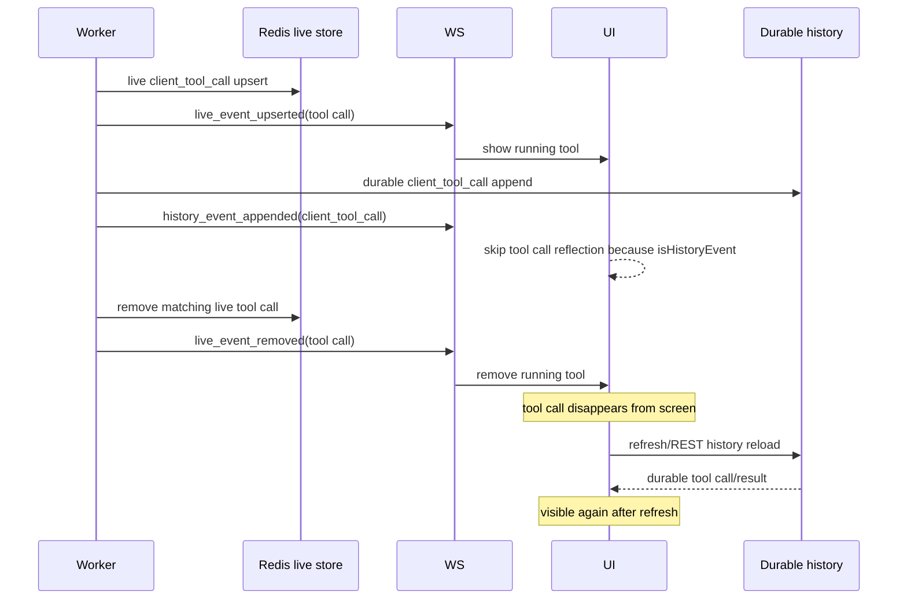
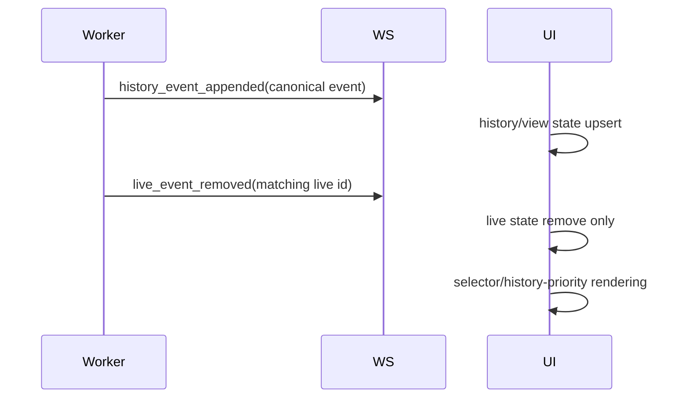
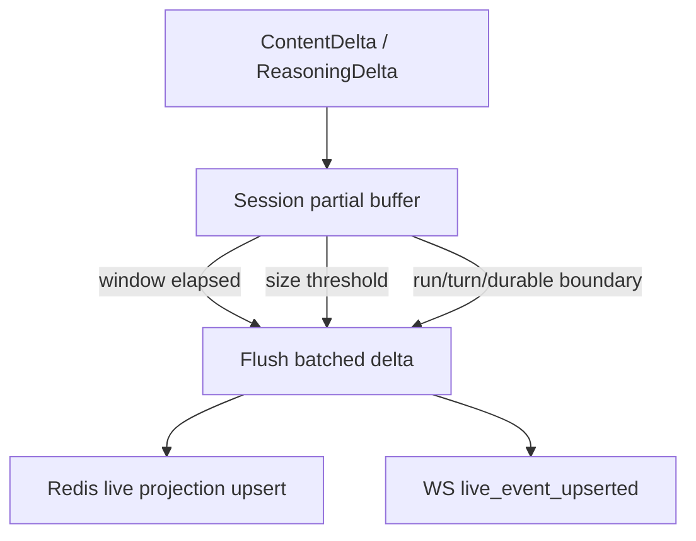

# Chat live/history handoff and streaming partial batching design

## Overview

This corrects UI handoff defect and streaming live projection bottleneck discovered after Chat canonical history/live protocol implementation.

This design is based on [ADR-0050](../adr/0050-live-history-projection-handoff-and-stream-batching.md). Existing history/live split decision in [ADR-0047](../adr/0047-chat-protocol-history-live-state.md) remains.

There are two core goals.

1. When durable history event is appended, UI immediately reflects it into history state, then handles removal of matching live projection.
2. Text/reasoning partials are server-side batched instead of reflecting provider delta cadence directly to Redis and WebSocket.

## Problem Definition

### Live/history handoff defect

Currently frontend `useChatWebSocket` treats both `history_event_appended` and `live_event_upserted` as canonical events. However, for some event kinds, if `isHistoryEvent`, UI reflection is skipped.

Tool call event can disappear in representative flow below.



This problem occurs not because backend fails to update live state correctly, but because frontend reducer does not reflect durable history append into screen state and combines with live projection removal.

### Streaming partial update bottleneck

Worker performs following work for every `ContentDelta` and `ReasoningDelta`.

1. Query Redis live projection
2. Accumulate delta
3. Save Redis live projection
4. Refresh Redis key TTL
5. Broadcast WebSocket `live_event_upserted`

If provider emits small deltas quickly, Redis write/expire and WS publish frequency also increases at same rate. From user-visible UI perspective, text joined over a short window is more stable than 1-token granularity, and backend cost can also decrease.

## Goals

- `history_event_appended` reflects every renderable canonical event into history state.
- `live_event_removed` removes only from live state.
- If same semantic entity exists in both history and live, history takes precedence.
- Durable append action is published before live remove action.
- Text/reasoning partials are server-side batched based on short debounce or size threshold.
- Pending partial is always flushed at run/turn end, durable assistant/reasoning append, cancellation, and error boundaries.
- Redis live store stores only latest live projection.

## Non-goals

- Do not redesign canonical event schema.
- Do not store streaming partial as durable history event.
- Do not include Chat UI visual redesign or scroll anchoring change.
- Do not replace entire provider/tool native event with new protocol.
- Function call argument batching remains separately extensible after text/reasoning stabilization.

## Current State

### Backend

- `EngineWorker.dispatch_event()` first calls `_update_live_event_projection()`, then publishes event through adapter or broker.
- `WebAdapter.handle_event()` broadcasts every event as legacy serialized event, and if `CanonicalEvent`, also broadcasts `history_event_appended`.
- `_update_live_event_projection()` immediately upserts `ContentDelta`, `ReasoningDelta`, `FunctionCallDelta` into Redis live projection and immediately broadcasts `live_event_upserted`.
- When `CanonicalEvent` arrives, it removes matching live counterpart and broadcasts `live_event_removed`.
- Current order in `dispatch_event()` updates live projection before adapter publish. This means live removal of durable canonical event can go out before `history_event_appended`.

### Frontend

- `useChatWebSocket` marks `history_event_appended` as `isHistoryEvent = true` and sends it to canonical event reducer.
- `client_tool_call` and `provider_tool_call` only call `markModelOutputVisible()` when `isHistoryEvent` and skip state reflection.
- `assistant_message` and `reasoning` have special logic replacing finalized streaming placeholder.
- There is no complete `historyEvents` / `liveEvents` separate reducer; it directly reflects into existing `messages` view state.

## Target State

### Handoff invariant



Client-side invariants:

- `history_event_appended`: upsert renderable event into history or current view state.
- `live_event_upserted`: upsert as live projection.
- `live_event_removed`: remove only live projection. Does not remove durable message/tool state.
- `isHistoryEvent` is not condition for rendering skip.

Backend-side invariants:

- If durable append exists, publish history append action first.
- Publish matching live removal after that.
- Best-effort failure does not block durable history save.

### Streaming partial batcher



Batcher operates per session/run inside event loop.

- Add Delta to memory buffer.
- Schedule flush timer when first delta arrives.
- Flush immediately when accumulated chars exceed threshold.
- flush calls existing `LiveEventStore.append_assistant_delta()` / `append_reasoning_delta()` and stores latest projection only.
- Pending batch is flushed before run end, stop, error, canonical assistant/reasoning append.
- Even if flush fails during worker shutdown/cancellation, durable history consistency is maintained.

## Backend Design

### 1. Publish order adjustment

Adjust durable canonical event handling order in `dispatch_event()`.

Current:

1. `_update_live_event_projection(event)`
2. adapter/broker publish

Target:

- For non-durable runtime events such as `ContentDelta`, `ReasoningDelta`, `FunctionCallDelta`, `RunStarted`, `RunComplete`, live projection update may happen first.
- For `CanonicalEvent`, history append publish must happen first, followed by live counterpart removal.

Implementation options:

- A. Split pre/post live projection update in `dispatch_event()` by event type.
- B. `WebAdapter.handle_event()` calls hook after history publish.
- C. `_update_live_event_projection()` puts canonical event remove into delayed queue.

Choice: A.

Reasons:

- event dispatch order can be seen in one place.
- Does not add live store dependency to Adapter implementation.
- broker fallback path can follow same principle.

### 2. Partial batcher location

Batcher is helper injected into `EngineWorker`.

- Worker already observes `PublishedEvent` cadence.
- Live projection store and broadcast dependency live in worker.
- Runtime engine or canonical adapter should remain separated from durable transcript responsibility.

Initial interface example:

```python
class LivePartialBatcher:
    async def append_content_delta(session_id: str, event: ContentDelta) -> None: ...
    async def append_reasoning_delta(session_id: str, event: ReasoningDelta) -> None: ...
    async def flush_session(session_id: str) -> None: ...
    async def close_session(session_id: str) -> None: ...
```

`append_*` returns live event or calls publish callback when flush is needed. For testability, receives callback instead of directly depending on Redis/broadcast.

### 3. Flush boundaries

Flush pending text/reasoning partial before handling following event.

| Boundary | Flush target | Reason |
| --- | --- | --- |
| `CanonicalEvent(kind=assistant_message)` | batch by assistant content index | finalized history must appear before live |
| `CanonicalEvent(kind=reasoning)` | reasoning batch | finalized reasoning handoff |
| `TurnMarker` / `RunMarker` canonical event | all | clear partial before turn/run marker |
| `RunComplete` / `RunStopped` legacy runtime event | all | prevent live projection omission before terminal event |
| exception/error path | all best-effort | minimize stale partial |
| worker session cleanup | all best-effort | clean timer task |

### 4. Timer lifecycle

- At most one timer task per session.
- After flush, clear timer if buffer is empty.
- On Session close, cancel timer and try best-effort flush.
- Re-raise `CancelledError`, but suppress timer cancel during cleanup.

### 5. Configuration

Initial values are code constants.

- `LIVE_PARTIAL_BATCH_MAX_DELAY_SECONDS = 0.075`
- `LIVE_PARTIAL_BATCH_MAX_CHARS = 96`

Promote to Config if operational tuning need is confirmed. Do not create excessive config surface in first PR.

## Frontend Design

### 1. Remove History event skip

Remove `isHistoryEvent` early return for `client_tool_call` and `provider_tool_call`.

- Durable tool call event also reflected with `applyFunctionCallItem`.
- If live tool call and durable tool call use same call id, merge without duplication by id/callId.
- When tool result arrives, existing `applyFunctionCallOutput` attaches to call id.

### 2. Live removal does not delete durable state

Current `live_event_removed` handling removes from `messages` and `pendingInputBuffers` by event id. This policy depends on assumption that durable message id and stable live event id do not collide.

Correction direction:

- `live_event_removed` removes only UI element created from live projection.
- UI element created from durable history event is not removed.
- Current structure is mostly safe because live projection event id and durable event id differ, but reducer separates more explicitly by role/status/source metadata.

### 3. Intermediate structure and final structure

Final structure in ADR-0047 is separate `historyEvents`/`liveEvents` reducer. This follow-up fix prioritizes defect correction.

- Short term: apply history skip removal and live remove guard in existing direct `messages` state reducer.
- Long term: complete selector with separate `historyEvents`/`liveEvents` state.

Acceptance criteria of this design must be satisfied even with short-term correction.

## User-visible behavior

- Tool call visible while running does not disappear when completion/result is appended.
- Durable tool call/result and assistant text appear on screen without refresh.
- Streaming text still appears real-time, but updates smoothly in short batches instead of excessively fast token-by-token updates.
- Reconnect/reload restores same screen with `/history` and `/live` combination.

## Failure mode

- Partial batch flush failure: some live streaming updates can be omitted, but finalized durable history appears at run completion.
- Timer task cancellation: pending batch may not flush, but durable history consistency is maintained.
- WebSocket publish failure: must be restorable via REST history/live reload.
- Redis live store loss: only live projection disappears; durable history remains.

## Test Strategy

### Unit / integration

- Verify batching count and flush content using `RedisLiveEventStore` or batcher fake store.
- Verify `EngineWorker.dispatch_event()` publishes live remove after history append for canonical event.
- Verify in `useChatWebSocket` reducer test or hook-level test that tool call remains after `history_event_appended(client_tool_call)` followed by `live_event_removed`.

### Targeted backend verification

- `uv run pytest src/azents/services/chat/live_events_test.py`
- `uv run pytest src/azents/worker/engine_test.py` tests related to dispatch/live projection
- `uv run ruff check` / targeted `uv run pyright`

### Targeted frontend verification

- `corepack pnpm --filter azents-web typecheck`
- ESLint for changed files
- Add reducer/helper unit test if possible

### Product smoke

- Confirm in chat executing tool call that running tool call does not disappear after completion.
- Confirm streaming text does not create excessively fast live updates via Redis/WS event count.

## Acceptance criteria

- Durable tool call entering through `history_event_appended` is immediately reflected into UI state.
- Even if matching `live_event_removed` follows, durable tool call/result view is not removed.
- Redis upsert and WS `live_event_upserted` count for `ContentDelta` / `ReasoningDelta` can be lower than delta count.
- Pending partial is flushed before boundary event.
- Durable canonical history and Redis live projection remain separated.
- Existing reload/reconnect restoration path remains.

## QA Checklist

### QA-1. Tool call live/history handoff

#### What to check

Verify tool call running live projection does not disappear from UI after durable tool call/result append.

#### Why it matters

This is core path of user-observed problem: “it was running, then disappears when executed, and reappears after refresh”.

#### How to check

Run deterministic chat run that emits tool call and check WS event order and UI state.

#### Expected result

Even after `history_event_appended(client_tool_call)` then `live_event_removed`, tool call UI remains and result attaches to same call id.

#### Execution result

Implementation verification was performed with deterministic worker/frontend static evidence.

- Backend ordering test: `test_dispatch_canonical_event_publishes_history_before_live_removal` fixes WebSocket broadcast order at canonical tool result dispatch to `client_tool_result` legacy payload → `history_event_appended` → `live_event_removed`.
- Frontend reducer path: in `useChatWebSocket.ts`, `history_event_appended(client_tool_call/provider_tool_call)` is also reflected through `applyFunctionCallItem`. It no longer skips tool call state reflection only because of `isHistoryEvent`.
- Frontend merge helper: `applyFunctionCallItem` promotes existing live/streaming tool call to durable `fallbackMsgId` so following live removal does not remove durable message id.
- Local targeted verification: `cd python/apps/azents && uv run pytest -q src/azents/worker/live_partial_batcher_test.py src/azents/worker/engine_test.py::test_dispatch_canonical_event_publishes_history_before_live_removal src/azents/worker/engine_test.py::test_dispatch_flushes_live_partial_batch_before_canonical_event src/azents/worker/engine_test.py::test_dispatch_flushes_reasoning_batch_before_canonical_event` → 8 passed.

Frontend currently has no azents-web package-level unit test runner, so reducer/hook unit test was not newly added. Instead, changed-file ESLint and azents-web typecheck are used as targeted verification.

#### Fixes applied

- In `EngineWorker.dispatch_event()`, separated order so `CanonicalEvent` performs live projection removal after interface publish.
- Removed `client_tool_call` / `provider_tool_call` history-event skip in `useChatWebSocket.ts`.
- Corrected `toolCallMerge.ts` to replace message id with durable event id when promoting durable history.

### QA-2. Streaming text partial batching

#### What to check

Verify Redis live upsert and WS live event count becomes lower than provider delta count in fast text delta stream.

#### Why it matters

This is core performance goal for reducing per-delta save/send bottleneck.

#### How to check

Emit multiple `ContentDelta` with short interval in fake engine or unit test and check batch flush count and payload.

#### Expected result

Multiple deltas are joined into one or more batches, and full text is reflected without omission at flush boundary.

#### Execution result

- `live_partial_batcher_test.py::test_content_deltas_flush_as_single_batch` verifies `hel` + `lo` is combined into single `LivePartialFlush(delta="hello")`.
- `test_content_index_buffers_are_separate` verifies buffer separation by assistant content index.
- `test_size_threshold_flushes_immediately` verifies immediate flush when char threshold reached.
- `test_timer_flushes_pending_batch` verifies pending batch is flushed on delay timer expiration.
- `engine_test.py::test_dispatch_flushes_live_partial_batch_before_canonical_event` verifies after two `ContentDelta`, when canonical boundary arrives, live store has only one assistant delta append `("session-1", "hello", 0)`, and `live_event_upserted` is broadcast before canonical history event.
- Local targeted verification: batcher + worker boundary tests passed together in QA-1 command above.

#### Fixes applied

- Added `LivePartialBatcher` to accumulate session-specific content/reasoning partials in memory buffer.
- Changed `ContentDelta` handling in `EngineWorker._update_live_event_projection()` from immediate live store update to batcher append.
- `EngineWorker._flush_live_partial_batch()` performs existing live store append + WebSocket `live_event_upserted` publish in flush callback.

### QA-3. Reasoning partial batching

#### What to check

Verify Reasoning delta is batched same as text and flushed before final reasoning event append.

#### Why it matters

Reasoning stream has same Redis/WS bottleneck and handoff risk.

#### How to check

Verify `ReasoningDelta` sequence and durable `reasoning` canonical event boundary with unit/integration test.

#### Expected result

Reasoning live projection updates by batch, and pending batch flushes before durable reasoning append.

#### Execution result

- `live_partial_batcher_test.py::test_reasoning_deltas_flush_as_single_batch` verifies `think` + `ing` is combined into single `LivePartialFlush(kind="reasoning", delta="thinking")`.
- `engine_test.py::test_dispatch_flushes_reasoning_partial_batch_before_canonical_event` verifies after two `ReasoningDelta`, at durable `reasoning` canonical event boundary, live store has only one reasoning delta append `("session-1", "thinking")`, and `live_event_upserted` is broadcast before canonical history event.
- Local targeted verification: reasoning batcher + worker boundary tests passed together in QA-1 command above.

#### Fixes applied

- Added `LivePartialBatcher.append_reasoning_delta()`.
- Changed `ReasoningDelta` handling in `EngineWorker._update_live_event_projection()` from immediate live store update to batcher append.
- Call `flush_session()` at `CanonicalEvent`, `RunComplete`, `RunStopped` boundary so pending reasoning batch is reflected before durable reasoning append.

### QA-4. Publish ordering

#### What to check

Verify `history_event_appended` is broadcast before matching `live_event_removed` for durable canonical event.

#### Why it matters

If UI observes live removal first, disappearance/flicker can recur.

#### How to check

Record broadcast payload order in Worker/WebAdapter test.

#### Expected result

Canonical event publish sequence is history append → live removal.

#### Execution result

- `engine_test.py::test_dispatch_canonical_event_publishes_history_before_live_removal` records broadcast payload order using `WebAdapter` + broadcast double + live store double.
- Observed order expectation is `client_tool_result` legacy payload → `history_event_appended` → `live_event_removed`. Canonical transport action order has `history_event_appended` before `live_event_removed`.
- In #4435 CI, Python lint, Python typecheck, azents unit tests, deterministic azents E2E passed. Failed runtime image build was external registry incident due to `ghcr.io/astral-sh/uv` token endpoint `502 Bad Gateway`, and new SHA push triggered rerun.

#### Fixes applied

- `dispatch_event()` branches `CanonicalEvent` and non-canonical runtime event.
- `CanonicalEvent` first awaits `_publish_event_to_interface()`, then `_update_live_event_projection()` performs matching live counterpart removal.
- Non-canonical runtime event keeps existing order: live projection update → interface publish.
