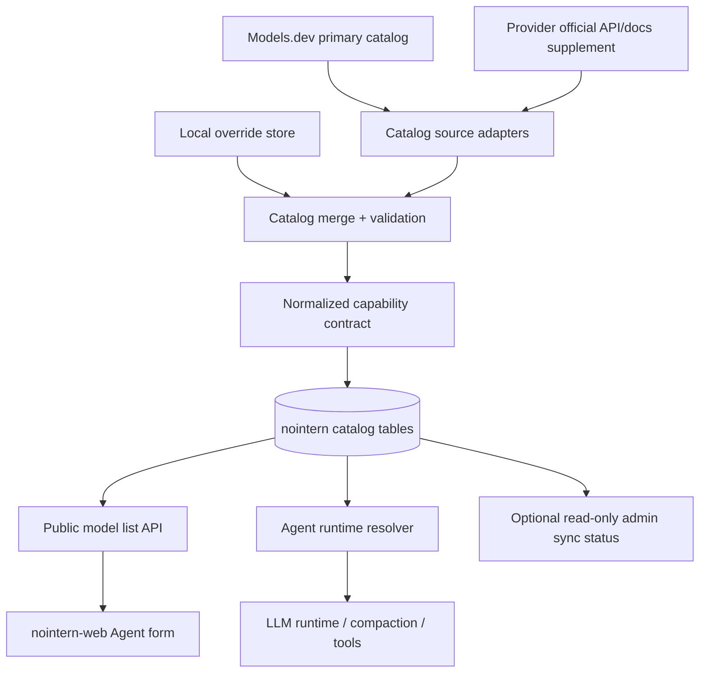
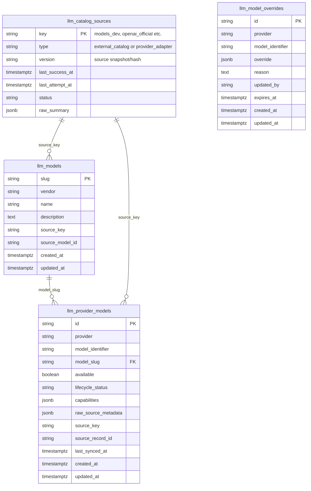
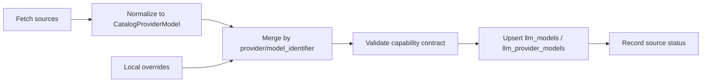

# LLM Model Catalog Sync Design

## Overview / Problem

nointern runs Agents using provider integrations registered by workspace. Model used by Agent is selected from global catalog `LLMModel` / `LLMProviderModel`, and Agent row references `llm_provider_model_id` and `llm_provider_integration_id`.

Current global catalog is directly managed by Admin CRUD. This structure does not match LLM provider environment where model lists are added and deprecated quickly. Capabilities depended on by runtime and frontend are also distributed across these places:

- `llm_provider_models.thinking` column
- `llm_provider_models.metadata.supported_builtin_tools`
- `llm_provider_models.metadata.max_input_tokens`
- LiteLLM fallback in `runtime.context.get_max_input_tokens()`
- model option derivation logic in agent form

As a result, humans must keep correcting model list and capabilities in Admin UI, causing drift between external source, backend, frontend, and runtime. This design changes catalog source of truth to external/official sources plus local override, and normalizes capability into nointern internal typed contract.

## Goals

1. Source model list management from **Models.dev primary catalog**, and use provider official-source adapters as supplemental sources.
2. Move capability decisions from `thinking` column and arbitrary `metadata` patch to internal typed contract.
3. Remove need for model management CRUD in Admin.
4. Preserve existing Agent `llm_provider_model_id` reference stability.
5. Make frontend Agent create/edit screen, backend resolver, runtime compaction/tool selection use same capability contract.
6. Keep last successful sync result in DB/cache so external catalog failure does not immediately break Agent execution.

## Non-goals

- Do not remove workspace-owner-managed `LLMProviderIntegration` CRUD.
- Do not remove per-Agent model selection UX.
- Do not newly build provider credential validation, billing, or quota measurement.
- Do not guarantee immediate support for every model from every provider. Expose available only for provider/model that source adapter can normalize.
- Implementation phase, PR split, and per-file checklist are not covered by this document.

## Current State

### Backend/domain

- `python/apps/nointern/src/nointern/rdb/models/llm_model.py`
  - uses `llm_models.slug` as PK.
  - stores vendor, name, description.
- `python/apps/nointern/src/nointern/rdb/models/llm_provider_model.py`
  - `id` is uuid7 hex PK.
  - `(provider, model_identifier)` is unique constraint.
  - stores `model_slug`, `available`, `thinking`, `metadata`.
- `python/apps/nointern/src/nointern/rdb/models/agent.py`
  - Agent references `llm_provider_model_id` to `llm_provider_models.id`.
  - FK is `ondelete=RESTRICT`, so deleting provider model in use is unsafe.
- `python/apps/nointern/src/nointern/api/admin/llm_model/v1/` and `api/admin/llm_provider_model/v1/`
  - provide Admin CRUD endpoints.
- `python/apps/nointern/src/nointern/api/public/llm_provider_model/v1/`
  - workspace member queries available model list by provider.

### Runtime/frontend capability usage

- `engine/run/resolve.py`
  - loads Agent provider model and builds runtime model string with `to_litellm_model()`.
  - determines context window with `get_max_input_tokens(provider_model.metadata, litellm_model)`.
  - re-queries model vendor from `LLMModel` for built-in tool vendor conversion.
- `engine/context.py`
  - determines max input token in order: `metadata.max_input_tokens` → LiteLLM model info → `128_000` fallback.
- `typescript/apps/nointern-web/src/features/agents/containers/useAgentFormContainer.ts`
  - reads `thinking`, `metadata.supported_builtin_tools`, `metadata.max_input_tokens` from public model list response to build reasoning effort, built-in tools, and compaction model warning.
- `typescript/apps/nointern-admin-web/`
  - has `LLM Models`, `Provider Models` navigation and CRUD screens.

### Core problem

Current `metadata` mixes provider raw data, operator override, and runtime contract. It is unclear which key is stable API contract, and frontend/runtime interpret the same meaning in separate code. Model list is also human-managed CRUD data, so it easily diverges from external/official sources.

## Autonomous Design Decisions with Alternatives

### D1. Catalog source of truth

**Decision: Models.dev primary catalog + provider official adapter + local override are source of truth.**

- Primary source uses Models.dev catalog.
- If source coverage or field quality is insufficient, add supplemental adapters based on provider official API or official docs.
- nointern DB acts as materialized cache for source snapshot and normalized catalog.

Rejected alternatives:

- Keep Admin CRUD: does not solve drift or user requirements.
- Use only LiteLLM model info: insufficient for provider-specific identifiers, deprecation, built-in tools, local custom model policy.

### D2. Location of Local override

**Decision: store local override separately from source catalog and merge it.**

Local override is used only for:

- adding custom model absent from external source
- adjusting nointern exposure/availability of a specific model
- supplementing missing capability from source with verified typed field
- marking disable/deprecation for temporary provider failure or policy change

Local override is not mixed into raw `metadata`. Override has audit fields such as `reason`, `updated_by`, `updated_at`, optional expiry.

### D3. Capability contract

**Decision: capabilities read by runtime/frontend are normalized into internal typed contract.**

Arbitrary keys like `metadata.supported_builtin_tools` are removed from public/runtime contract. Raw source metadata may be preserved, but runtime decision reads only normalized contract.

### D4. Admin UX

**Decision: remove Admin manual model CRUD.**

Admin remains global user/workspace/team/debug operations tool, but model catalog is not directly edited by Admin. If needed, allow only read-only catalog sync status/diff screen.

### D5. Identity stability during sync

**Decision: upsert by natural key `(provider, model_identifier)` and preserve existing `id`.**

Because Agent references `llm_provider_model_id`, catalog sync must not delete and reinsert existing row. Models removed from source transition to `available=false` and deprecation status, and referenced Agents make clear execution decision.

## Target Architecture



In target state, nointern DB is not human-edited source but materialized catalog storing result of merge between external/official source and local override. Runtime does not call external source per request; it uses last successful sync result in DB.

## Data Model

### Core entities

Existing `llm_models` / `llm_provider_models` are retained for Agent FK stability, but expanded from manual CRUD schema to synced catalog schema.



### Field semantics

- `llm_catalog_sources.key`: stable source key such as `models_dev`, `openai_official`, `anthropic_official`, `google_official`.
- `llm_catalog_sources.status`: last sync state (`success`, `failed`, `partial`, etc.).
- `llm_provider_models.lifecycle_status`: normalized operating lifecycle: `active`, `deprecated`, `removed_from_source`, `local_only`, `disabled`.
- `llm_provider_models.capabilities`: typed JSON generated from `ModelCapabilities` schema.
- `llm_provider_models.raw_source_metadata`: traceable raw information from source, not public by default.
- `llm_model_overrides.override`: typed patch with validation, not arbitrary runtime metadata.

Existing `thinking` and arbitrary `metadata` fields should no longer be public/runtime source of truth. Migration can keep them temporarily, but new code must read normalized capability.

## Sync Pipeline



### Source adapter rules

- Each adapter returns source version/hash and normalized list of `CatalogProviderModel`.
- Adapter should not directly write DB. It only produces in-memory snapshot.
- Network/live source failure must be reported as source status failure and must not delete existing catalog.
- Fixture adapter must implement same interface as live adapter so deterministic CI/testenv can run without network.

### Merge rules

1. Group all source models by `(provider, model_identifier)`.
2. Within group, evaluate source priority as `provider_adapter` > `external_catalog`; higher priority row becomes base.
3. If nullable field in base row is empty, fill from lower priority source as field-level fallback. Lower priority source never overwrites already-filled field.
4. Find active override from `llm_model_overrides` by natural key and apply last.
5. If override patch is invalid, do not discard existing merged model. Record validation issue in `local_override` source summary and materialize source model as-is.
6. Local-only model that exists only in override and no source becomes `lifecycle_status=local_only`, `available=true` candidate only when override is valid.
7. Invalid local-only override is excluded from merged result. If same natural-key row was previously materialized, materialization marks it `removed_from_source`.

### Materialization rules

Within one DB transaction:

1. For each `MergedCatalogModel`, upsert `llm_models` slug.
   - If existing slug has same source identity, update.
   - If existing slug is manual/null source or different source identity, fail as slug conflict.
2. Find `llm_provider_models` row by same natural key.
   - If exists, preserve `id` and update `model_slug`, `available`, `lifecycle_status`, `capabilities`, `raw_source_metadata`, `source_key`, `source_record_id`, `last_synced_at`.
   - If absent, generate new `id` and insert.
3. Find existing provider rows tracked by successful source keys of this sync and `local_override` that are absent from merged result.
4. Missing rows are not deleted; update to `available=false`, `lifecycle_status=removed_from_source`, `last_synced_at=<sync time>`.
5. On slug conflict, constraint error, or validation failure during materialization, rollback transaction and record source status `failed`. Existing catalog rows remain last-good.

### Local override example

```yaml
provider: openai
model_identifier: gpt-5.5-custom
override:
  lifecycle_status: local_only
  available: true
  capabilities:
    context_window:
      max_input_tokens: 1047576
      max_output_tokens: 32768
    reasoning:
      supported: true
      effort_levels: [low, medium, high]
    built_in_tools:
      supported: [web_search]
reason: "OpenAI custom deployment verified"
expires_at: null
```

## Capability Contract

Capability contract is semantic contract shared by backend, public API, nointern-web, and runtime. Field names must expose same meaning in Python/Pydantic and TypeScript generated client.

```text
ModelCapabilities
  context_window
    max_input_tokens: int | null
    max_output_tokens: int | null
  modalities
    input: supported list among text/image/pdf/audio/video
    output: supported list among text/image/audio/video
  tool_calling
    supported: bool
    parallel_tool_calls: bool | null
    strict_json_schema: bool | null
  reasoning
    supported: bool
    effort_levels: list of low/medium/high or provider-specific normalized values
    summaries: bool | null
  built_in_tools
    supported: list of nointern built-in tool ids
  compatibility
    provider_family: string | null
    responses_api: bool | null
    unsupported_media_policy: text_substitution/block/null
```

`lifecycle_status` is not inside `ModelCapabilities`; it is separate field on `LLMProviderModelResponse` and `llm_provider_models.lifecycle_status`. Lifecycle is operating state of catalog row; capabilities are technical feature bundle supported by model.

### Contract usage rules

- Agent form decides whether to display reasoning effort UI from `capabilities.reasoning.supported`.
- Agent form decides selectable built-in tools from `capabilities.built_in_tools.supported`.
- Compaction and context threshold use `capabilities.context_window.max_input_tokens` first.
- `max_input_tokens == null` means source does not guarantee value. Runtime may use existing LiteLLM fallback or provider adapter fallback, but fallback result must be observable through logs/metrics.
- Provider compatibility layer may read `compatibility` capability to select request-only transform.
- Raw source metadata and local override raw JSON are not exposed by default in public API.

## Implementation Blueprint

The file/function/behavior in this section should be sufficient to reproduce the same result as intended implementation. Names are to be used as-is during implementation.

### Backend module layout

| Responsibility | File/package | Implement |
| --- | --- | --- |
| capability contract | `python/apps/nointern/src/nointern/core/llm_catalog.py` | `ModelCapabilities` and nested Pydantic models, built-in tool/reasoning/modality enums, `build_initial_model_capabilities()` |
| sync intermediate contract | `python/apps/nointern/src/nointern/core/llm_catalog_sync.py` | `CatalogProviderModel`, `CatalogSourceSnapshot`, `MergedCatalogModel`, `CatalogSyncResult`, override patch model, source key/version helper |
| enum | `python/apps/nointern/src/nointern/core/enums.py` | `LLMModelLifecycleStatus`, `LLMModelCatalogSourceType`, `LLMModelCatalogSourceStatus` |
| RDB model | `rdb/models/llm_catalog_source.py` | `RDBLLMCatalogSource` |
| RDB model | `rdb/models/llm_model_override.py` | `RDBLLMModelOverride` |
| RDB extension | `rdb/models/llm_model.py`, `rdb/models/llm_provider_model.py` | add source/capability/lifecycle columns |
| repository | `repos/llm_catalog_source/` | record source attempt/success/failure |
| repository | `repos/llm_model_override/` | query non-expired overrides with `list_active_at()` |
| repository extension | `repos/llm_model/` | `upsert_catalog_model_slug()` and slug conflict prevention |
| repository extension | `repos/llm_provider_model/` | natural-key upsert, source key query, removed marking, capability query |
| sync service | `services/llm_catalog_sync/` | adapters, override parsing, merge, materialize, orchestration, DI helper, fixture JSON |
| public query service | `services/llm_provider_model/` | normalized response conversion, current selected model lookup |
| runtime | `engine/run/resolve.py`, `engine/context.py`, `core/builtin_tools.py` | capability-based resolver/context/tool decision |
| public API | `api/public/llm_provider_model/v1/` | list-by-provider, current model detail lookup, normalized schema |
| admin API | `api/admin/llm_model/v1/`, `api/admin/llm_provider_model/v1/` | keep only read-only catalog query |

### Source keys and fixture behavior

CI/testenv does not use network. Package fixture adapter must return these source keys through same interface as live adapter.

| Source key | Type | Priority role | Fixture / source meaning |
| --- | --- | --- | --- |
| `models_dev_fixture` | `external_catalog` | primary | deterministic snapshot of Models.dev catalog. Provides base provider/model list. |
| `openai_official` | `provider_adapter` | supplement | field/capability snapshot supplement from OpenAI official catalog/docs/API. |
| `anthropic_official` | `provider_adapter` | supplement | supplement snapshot from Anthropic official catalog/docs/API. |
| `google_official` | `provider_adapter` | supplement | supplement snapshot from Google Gemini official catalog/docs/API. |
| `local_override` | `local_override` | final patch/local-only | derived from DB `llm_model_overrides`. |

`models_dev_fixture` must be able to materialize at least `openai/gpt-5.5` as active/available row. Deterministic E2E uses this row for Agent/Toolkit fixtures.

### Adapter output mapping

Each adapter maps source raw record to `CatalogProviderModel` as follows.

| `CatalogProviderModel` field | Mapping rule |
| --- | --- |
| `source_key` | one of source keys above |
| `source_record_id` | stable id from source record; fallback `{provider}/{model_identifier}` |
| `provider` | normalized to nointern `LLMProvider` enum |
| `model_identifier` | model name passed to provider API, e.g. `gpt-5.5` |
| `vendor` | normalized to nointern `LLMVendor` / runtime vendor |
| `model_slug_candidate` | deterministic slug, e.g. `openai-gpt-5-5` |
| `display_name` | UI display name; fallback `model_identifier` |
| `description` | source description; fallback null |
| `available` | true if source considers usable; deprecated/removed/disabled can be false |
| `lifecycle_status` | normalized source status: `active/deprecated/removed_from_source/local_only/disabled` |
| `capabilities_candidate` | source fields normalized to `ModelCapabilities` candidate |
| `raw_source_metadata` | trace-worthy raw source record; not exposed by default in public API |

### Startup/testenv sync behavior

Normal runtime does not auto-run sync at startup. Use opt-in flags only when fixture catalog is needed, such as deterministic E2E/testenv.

| Setting | Env var | Default | Meaning |
| --- | --- | --- | --- |
| `llm_catalog_sync_enabled` | `NI_LLM_CATALOG_SYNC_ENABLED` | `false` | whether catalog sync feature is available |
| `llm_catalog_startup_sync_enabled` | `NI_LLM_CATALOG_STARTUP_SYNC_ENABLED` | `false` | whether fixture sync runs during app startup |
| `llm_catalog_source_mode` | `NI_LLM_CATALOG_SOURCE_MODE` | `fixture` | startup sync allowed only in `fixture` mode |

FastAPI lifespan calls `_run_startup_llm_catalog_sync()` only when `startup_sync_enabled=true`. Helper must include safeguards:

- If `source_mode != "fixture"`, raise `RuntimeError` immediately to prevent live/prod source from syncing through startup fixture path.
- Take `pg_advisory_xact_lock(35970001)` and run sync so public/admin E2E servers attempting startup sync against same DB are serialized.
- Sync `Failure` fails fast as startup exception rather than hiding as post-readiness request failure.
- Success/failure log messages are English and put source/result summary in structured `extra`.

## API / Backend Changes

### Admin API

- `api/admin/llm_model/v1/` provides only read-only catalog query.
  - keep: `GET /llm-models`, `GET /llm-models/{slug}`
  - remove: `POST /llm-models`, `PATCH /llm-models/{slug}`, `DELETE /llm-models/{slug}`
- `api/admin/llm_provider_model/v1/` provides only read-only provider model catalog query.
  - keep: `GET /llm-provider-models`, `GET /llm-provider-models/{provider}/{model_identifier}`, endpoint by model slug
  - remove: `POST /llm-provider-models`, `PATCH /llm-provider-models/{provider}/{model_identifier}`, `DELETE /llm-provider-models/{provider}/{model_identifier}`
- Remove write route and create/update request schema from OpenAPI. If client calls removed method, normal result is HTTP-layer `405 Method Not Allowed`.
- Admin read endpoint means catalog sync result query only; it does not provide manual model editing.

### Public API

- Keep workspace member provider-specific model list query.
- `GET /workspaces/{handle}/llm-provider-models?provider=...` returns provider model list selectable for new selection.
- `GET /workspaces/{handle}/llm-provider-models/{provider_model_id}` returns current selection detail so existing Agent edit screen can display removed/deprecated/unavailable current model.
- `LLMProviderModelResponse` exposes only these public contract fields:
  - `id`, `provider`, `model_identifier`, `model_slug`, `available`
  - `lifecycle_status`
  - `capabilities`
  - `source` (`source_key`, `source_record_id`, `last_synced_at` summary)
  - `created_at`, `updated_at`
- Response does not include legacy `thinking`, `metadata`-based fields.
- `raw_source_metadata` is not included in public response.
- `available=false` or deprecated models are excluded from new selection list by default, but existing Agent edit screen must still be able to explain status of current selection model.

### Backend services

- `LLMProviderModelService` separates public query and sync-facing write.
  - public query: selectable list by provider, provider model id detail lookup.
  - sync-facing write: `LLMCatalogSyncService` performs natural-key upsert through repository.
  - legacy Admin write path is not public/runtime source of truth and is not exposed in Admin API.
- Runtime resolver loads provider model, then uses `capabilities` and `lifecycle_status` to build `RunRequest`.
  - `disabled` stops with distinct failure.
  - `deprecated` / `removed_from_source` allows existing Agent execution but emits structured warning.
  - `available=false` alone does not block existing Agent execution.
- Compaction model follows same lifecycle policy as main model.
- `get_max_input_tokens()` reads `capabilities.context_window.max_input_tokens` first, not direct `metadata` override.
- Built-in tool decision uses `capabilities.built_in_tools.supported`. Tool absent from source is rejected during Agent create/update validation.
- Reasoning effort decision uses `capabilities.reasoning.supported` and `capabilities.reasoning.effort_levels`.

### Permissions

- Workspace integration permissions remain unchanged.
- Catalog sync write is separated into internal operator/job permission, not user-facing Admin CRUD permission.
- If local override is exposed via UI/API, it must be operator-only audited workflow, not generic Admin model CRUD.

## Frontend / Admin UX Changes

### nointern-web

- `typescript/apps/nointern-web/src/trpc/routers/llm-provider-model.ts`
  - `listByProvider` uses list endpoint from generated public client.
  - `getById` uses current detail endpoint from generated public client and converts 404 to `null`.
- `features/agents/containers/useAgentFormContainer.ts`
  - `ModelOption` does not have legacy `thinking`, `metadata`.
  - Instead has `lifecycleStatus`, `available`, `selectable`, `reasoningSupported`, `reasoningEffortLevels`, `supportedBuiltinTools`, `maxInputTokens`, `source`, `missingFromCatalog`, `preserveModelParameters`.
  - selectable condition: `available=true` and lifecycle is `active` or `local_only`.
  - Edit screen queries current main model through current detail endpoint and merges it into option even if absent from selectable list.
  - `compaction_model_id` stores model identifier, not provider model DB id; if absent from current selectable list, add placeholder option `compaction:<identifier>`.
  - Current model that completely disappeared from catalog is shown with `missingFromCatalog=true`, `preserveModelParameters=true`, so existing `reasoning_effort` / `builtin_tools` are not cleared unless user changes model.
- `features/agents/components/AgentForm.tsx`
  - reasoning effort UI determined only by `selectedModel.reasoningSupported` and `selectedModel.reasoningEffortLevels`.
  - built-in tool UI determined only by `selectedModel.supportedBuiltinTools`.
  - compaction warning determined by `selectedModel.maxInputTokens`.
  - cleanup effect must not erase existing `reasoning_effort` / `builtin_tools` before current model option finishes async loading.
  - changing integration/provider resets main model, compaction model, reasoning effort, and built-in tools together.
  - deprecated/removed/disabled/unavailable/missing states are shown as warning/alert.
- `AgentForm.stories.tsx` fixes static fixtures for capability controls, deprecated current model, missing current model parameter preservation, compaction warning states.

### nointern-admin-web

- Remove `LLM Models` and `Provider Models` navigation entries from `typescript/apps/nointern-admin-web/src/app/client-layout.tsx`.
- Remove `src/app/llm-models/page.tsx`, `src/app/provider-models/page.tsx`.
- Remove `src/features/llm-models/**`, `src/features/provider-models/**`.
- Remove `src/trpc/routers/llmModel.ts`, `src/trpc/routers/llmProviderModel.ts`, and router registration from `src/trpc/routers/_app.ts`.
- If needed, provide separate read-only `Catalog Sync` screen with:
  - last success/attempt time
  - status/version by source
  - model count by provider
  - local override count
  - sync error summary
- This read-only screen does not provide model create/update/delete forms.

## Runtime Behavior Impact

- Agent execution does not call external source in real time; it uses last-good catalog materialized in DB.
- `available=false` means block new selection, not always block existing Agent execution. Execution blocking is determined by `lifecycle_status` and provider adapter policy.
- `disabled` means operator intentionally blocked model, so existing Agent execution must stop with clear error.
- `removed_from_source` means model disappeared from source. Existing Agent may run during compatibility period, but UI/logs expose migration-needed status.
- Context compaction threshold uses normalized capability. If value missing, fallback can be used but must log/metric the fallback to improve source quality.
- Provider compatibility layer applies media/tool/reasoning restrictions more consistently through capability contract.

## Rollout / Migration / Failure Modes

### Migration prerequisites

- Export current DB `llm_provider_models` to understand existing `(provider, model_identifier)`, id, Agent reference count, `thinking`, `metadata` values.
- Existing `metadata.supported_builtin_tools`, `metadata.max_input_tokens`, `thinking` must be convertible into normalized capability or local override candidate.
- Items not reproduced by source adapter in current production model list must be explicitly kept as local override.

### Rollout policy

- Initial rollout generates dry-run diff and compares with existing catalog before applying sync result.
- Automatic delete is forbidden. Missing models transition to unavailable/deprecated state.
- Before/after Admin CRUD removal, verify public model list and Agent execution keep same model id.
- After OpenAPI/client generation, remove nointern-web paths directly reading `metadata` key.

### Failure modes

- **External catalog fetch failure**: keep existing DB catalog, record source status failure, alert operations.
- **Source schema change**: adapter validation failure stops applying that source, keep existing catalog.
- **Capability validation failure**: leave row `available=false` or keep previous valid capability and record in error summary.
- **Local override error**: do not fail entire sync; skip that override and leave operator-visible error. If safety override such as model disable fails, raise alert priority.
- **Provider model rename**: do not auto-change id. New `model_identifier` creates new row and previous row is deprecated.
- **Existing Agent references disabled model**: pre-run resolver returns clear error for user/operator.

## Test Strategy

nointern product behavior verification is E2E-primary. testenv QA is fallback/diagnostic only for fixture readiness, deterministic source snapshot, and sync prerequisites that are hard to verify through E2E. Do not wrap E2E with `testenv qa run`.

### E2E primary / testenv fallback matrix

| Behavior | E2E primary | testenv fallback / diagnostic | Evidence |
|---|---|---|---|
| Fixture catalog materialization | deterministic E2E server startup materializes `openai/gpt-5.5` into `llm_provider_models` and Agent/Toolkit fixtures use it | diagnose startup sync fixture path, source status, readiness failure | E2E pass log, admin read-only catalog response, startup sync structured log |
| Public model list/detail contract | workspace member queries provider model list/detail and receives `capabilities`, `lifecycle_status`, `source`; response lacks `thinking`, `metadata`, `raw_source_metadata` | spot-check API response JSON for schema mismatch | response body assertion, generated client typecheck |
| Runtime capability consumption | Agent create/edit/run E2E interprets reasoning effort, built-in tools, context compaction max input token from normalized capability | change capability fixture values and narrow-check runtime resolver with unit/integration test | Agent CRUD/execute E2E, resolver/context unit test result |
| nointern-web Agent form | browser E2E or component UI verification builds reasoning/tool/compaction UI from capability and displays deprecated/removed current model but excludes it from new selection | reproduce UI state with Storybook fixture and API fixture | E2E screenshot/DOM assertion or Storybook story + typecheck/lint |
| Admin model management removal | admin-web E2E/compile check has no `LLM Models`, `Provider Models` nav/page/router; backend Admin OpenAPI lacks create/update/delete operations | OpenAPI diff and route list spot-check write surface leftovers | admin-web typecheck/lint, admin OpenAPI assertion |
| Source failure and last-good behavior | service integration test keeps existing catalog and records source status `failed` on source fetch/materialization failure | verify per-source failure summary with fixture adapter failure mode | service test result, source status row assertion |
| Local override merge | service/repository test applies local override patch, invalid override does not remove valid source row; expired/invalid local-only moves existing local row to removed/unavailable | diagnose validation issue summary with override fixture JSON | merge/materialize service test result |

### E2E primary plan

- Deterministic E2E does not call network live catalog. It materializes `models_dev_fixture` primary source and `openai_official`, `anthropic_official`, `google_official` supplement sources through package fixture adapter.
- E2E server runs startup sync only with explicit opt-in:
  - `NI_LLM_CATALOG_SYNC_ENABLED=true`
  - `NI_LLM_CATALOG_STARTUP_SYNC_ENABLED=true`
  - `NI_LLM_CATALOG_SOURCE_MODE=fixture`
- Startup sync fail-fast if mode is not fixture. If readiness passes, catalog fixture materialization should also be considered successful.
- Agent/Toolkit E2E fixture does not create model through Admin write API. It references `openai/gpt-5.5` provider model materialized by startup sync.
- Admin model lifecycle E2E verifies read-only synced catalog visibility, not create/update/delete.

### Fixture, seed, and prerequisite policy

- CI and deterministic E2E do not depend on external network, Models.dev live availability, or provider credential.
- Fixture must use same schema as source adapter interface. If fixture schema diverges from live adapter output, adapter validation must fail.
- Catalog seed is not created with direct DB write. Catalog row is created only by startup sync or sync service materialization path.
- Provider credential is not prerequisite for model catalog verification. Workspace provider integration E2E keeps existing fake credential fixture.
- Optional live catalog smoke test is not CI requirement. Without network/credential, skip. With credential, source schema mismatch fails.

### Evidence and CI policy

- Each phase PR must pass unit/type/lint for backend/frontend/admin/E2E scope changed by that phase.
- Verification phase PR body records:
  - Pre-verification audit verdict
  - E2E commands run and working directory
  - deterministic E2E full result
  - if failures were fixed, individual rerun commands and results
  - if testenv fallback/diagnostic was run, summary of `qa run <qa-id> --json` result
- Finally run deterministic E2E full suite once to verify no regression.

## QA Checklist

This section fixes design-time verification items and leaves space to fill actual execution/fix records in E2E/testenv verification phase. Design PR keeps `Execution result` and `Fixes applied` as `TBD`.

### QA-1. Fixture catalog materialization

#### What to check

Deterministic E2E server materializes fixture catalog through startup sync, and `openai/gpt-5.5` provider model can be used by Agent/Toolkit fixture.

#### Why it matters

If Admin model CRUD is removed, E2E can no longer depend on manual Admin seed. Catalog source of truth must materialize through actual sync service path so product tests verify same path as production architecture.

#### How to check

Run deterministic E2E from `testenv/nointern/e2e`. Server env uses `NI_LLM_CATALOG_SYNC_ENABLED=true`, `NI_LLM_CATALOG_STARTUP_SYNC_ENABLED=true`, `NI_LLM_CATALOG_SOURCE_MODE=fixture`. If needed, confirm `openai-gpt-5-5` / `openai:gpt-5.5` mapping through admin read-only catalog API.

#### Expected result

Startup readiness passes, and admin read-only catalog query shows `openai-gpt-5-5` and `openai/gpt-5.5` provider model mapping. Agent/Toolkit E2E passes by referencing this model without Admin write API.

#### Execution result

TBD

#### Fixes applied

TBD

### QA-2. Public model API normalized contract

#### What to check

When workspace member queries provider model list/detail, response contains `capabilities`, `lifecycle_status`, `source`, and does not contain legacy `thinking`, `metadata`, `raw_source_metadata`.

#### Why it matters

To end capability divergence, public contract must use typed normalized contract as source of truth, not arbitrary metadata key.

#### How to check

Assert provider model list/detail response in public API E2E or targeted API test. Also run generated client typecheck.

#### Expected result

`gpt-5.5` detail response has `capabilities.context_window.max_input_tokens`, `lifecycle_status=active`, `source.source_key=models_dev_fixture`, and legacy fields are absent from response model/JSON.

#### Execution result

TBD

#### Fixes applied

TBD

### QA-3. Runtime capability consumption

#### What to check

Agent create/edit/run path reads reasoning effort, built-in tools, context compaction max input token from normalized `ModelCapabilities`.

#### Why it matters

If backend runtime still reads legacy `thinking` / `metadata`, actual execution constraints will diverge again even after UI/API changes.

#### How to check

Run Agent CRUD/execution E2E and resolver/context unit tests. Include disabled/deprecated/removed lifecycle and compaction model path.

#### Expected result

`disabled` model returns clear failure. `deprecated` / `removed_from_source` allow existing execution with structured warning. Context compaction uses capability `max_input_tokens` first.

#### Execution result

TBD

#### Fixes applied

TBD

### QA-4. nointern-web Agent form capability UI

#### What to check

Agent form builds reasoning/tool/compaction UI from `capabilities.reasoning`, `capabilities.built_in_tools`, `capabilities.context_window`, and displays deprecated/removed current model while excluding it from new selection.

#### Why it matters

If frontend remains on legacy `thinking` / `metadata`, user-visible behavior still diverges from source of truth even after normalized public API is introduced.

#### How to check

Run nointern-web typecheck/lint and Agent form Storybook fixture or browser/component E2E. Include current non-selectable model and missing current model parameter preservation.

#### Expected result

Reasoning effort and built-in tool controls are exposed by capability. Current deprecated/removed/missing model is preserved with warning, and existing model parameters do not disappear unless user changes model.

#### Execution result

TBD

#### Fixes applied

TBD

### QA-5. Admin model management removal

#### What to check

`LLM Models` / `Provider Models` navigation, pages, and tRPC routers are removed from nointern-admin-web, and backend Admin OpenAPI has no model/provider-model create/update/delete operation.

#### Why it matters

If Admin manual write surface remains, it can bypass external catalog source of truth and local override boundary, recreating drift.

#### How to check

Run nointern-admin-web typecheck/lint, admin OpenAPI diff/operation assertion, and E2E admin catalog read-only visibility test.

#### Expected result

Admin UI has no manual model CRUD entrypoint, and Admin API provides only read-only catalog endpoints. Synced catalog can be viewed through admin read-only query.

#### Execution result

TBD

#### Fixes applied

TBD

### QA-6. Source failure and last-good behavior

#### What to check

When source fetch/materialization fails, existing catalog row remains and source status is recorded as `failed`.

#### Why it matters

External catalog can fail due to network/schema changes. Failure must not immediately break Agent execution and model list, preserving operational stability.

#### How to check

Reproduce fixture adapter failure, slug/materialization conflict, and validation issue in catalog sync service test.

#### Expected result

Sync returns `Failure(CatalogSyncFailure)` and updates related source status/raw_summary. Existing provider model identity and last-good capability are not deleted.

#### Execution result

TBD

#### Fixes applied

TBD

### QA-7. Local override merge and local-only lifecycle

#### What to check

Local override patch takes precedence over source catalog row; invalid override does not remove valid source row; expired/invalid local-only override transitions existing local row to `removed_from_source` / unavailable.

#### Why it matters

Local override is operator safety mechanism for source gaps. Override error must not corrupt full source catalog or break existing Agent identity.

#### How to check

Run merge/materialize/service tests for valid patch, invalid patch, local-only, expired override.

#### Expected result

Valid override appears in merged capability/source output. Invalid source override is recorded as validation issue but valid source row is preserved. Invalid/expired local-only row is excluded from new selection and materialized as removed/unavailable.

#### Execution result

TBD

#### Fixes applied

TBD

## testenv Fallback / Diagnostic Outline

- Local/testenv must be able to use fixture adapter or recorded source snapshot without direct network call to external source.
- Catalog sync dry-run must produce diff without DB write so QA can compare existing seed catalog and sync result.
- Public API diagnostic checks whether available model list returns normalized capability in workspace with provider integration.
- nointern-web diagnostic checks Agent create/edit screen behavior for reasoning effort, built-in tool, and compaction warning based on `capabilities`.
- Runtime diagnostic checks max input token decision is capability-based and fallback is observable when source value is missing.
- Admin diagnostic confirms model CRUD navigation/page disappeared and manual model create/update/delete cannot be performed.

## Acceptance Criteria

- Source of truth for model list is merge result of external/official source adapters and local override. Admin manual CRUD data is not source of truth.
- Models.dev catalog is primary source; missing providers are supplemented by official adapters.
- Models absent from external/official source are added only by local override, which remains auditable and separated from source catalog.
- Distributed capability dependencies such as `thinking`, `metadata.supported_builtin_tools`, `metadata.max_input_tokens` are replaced with normalized internal capability contract.
- Backend resolver, runtime compaction/tool/reasoning decisions, and nointern-web Agent form use same capability contract.
- Model management CRUD is removed from Admin UI so Admin does not need to manage model list directly.
- Existing Agent `llm_provider_model_id` references are preserved after catalog sync.
- Models removed from source are not deleted immediately; they are displayed as unavailable/deprecated.
- If external catalog sync fails, Agent execution and model list query continue with last successful catalog, and operator can inspect failure status.
- Public model list API provides normalized capability instead of arbitrary raw metadata.
- QA plan clearly separates E2E primary / testenv fallback boundaries and verifies deterministic fixture sync, public API contract, runtime capability consumption, nointern-web Agent form, Admin CRUD removal, source failure/last-good, and local override merge with evidence.

## Alternatives Considered

### Keep Admin CRUD and only auto-update seed data

Rejected. Operators can still manually edit, so drift is not fundamentally prevented. Boundary between external source and local override remains unclear.

### Use LiteLLM metadata as sole source

Rejected. It is already used as fallback in runtime, but insufficient to represent nointern-required built-in tools, lifecycle/deprecation, local custom models, and provider-official differences.

### Keep documenting raw `metadata` JSONB schema

Rejected. It appears quick, but frontend/runtime/public API continue depending on arbitrary JSON keys. It does not satisfy goal of fixing capability divergence.

### Query external catalog on every request

Rejected. Although always fresh, it creates latency, outage propagation, rate limit, and reproducibility problems. nointern runtime must use last successful sync result materialized in DB.

### Immediately delete models removed from source

Rejected. It breaks Agent FK and existing execution stability. Provider model identity stability is required, so removals are represented as lifecycle state instead of deletion.
