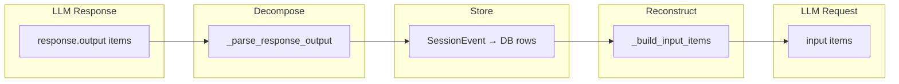
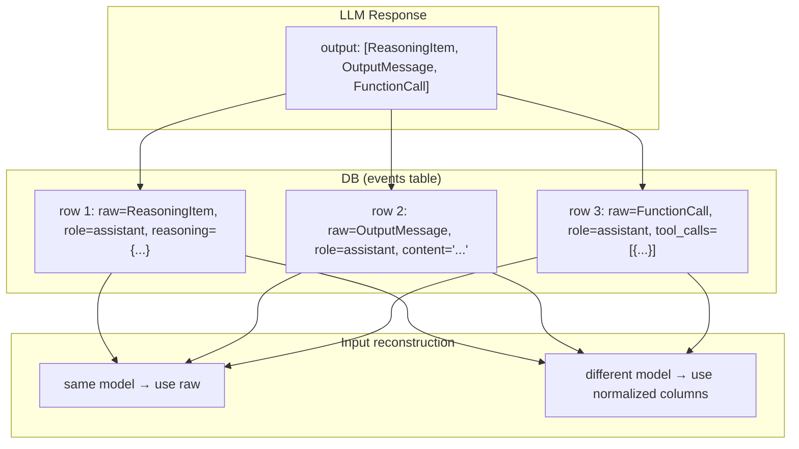
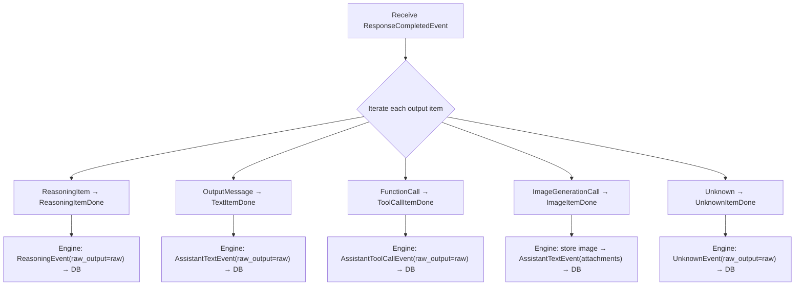
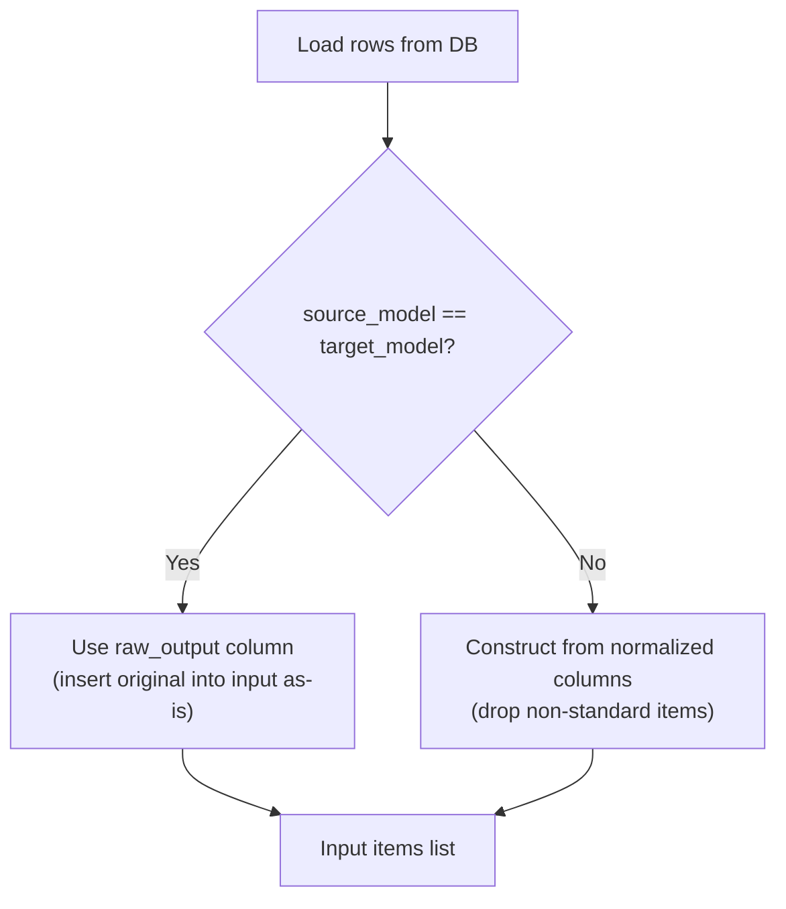

# LLM Event Storage/Reconstruction Redesign

## 1. Background

### Current Structure

LLM (Responses API) output is returned as a flat item list:

```
response.output = [ReasoningItem, OutputMessage, FunctionCall, FunctionCall, ...]
```

Current engine **decomposes** this output, converts it into internal type (`SessionEvent`), stores it in DB, and **reconstructs** that `SessionEvent` back into Responses API input format on the next turn.



### Problems

1. **Information loss**: original structure is lost during decomposition
   - Example: `OutputMessage` content and `FunctionCall`s from same turn are separated into different SessionEvent types, and reconstruction creates structure different from original.
2. **Reconstruction bug**: provider constraints are violated when separated fragments are combined again
   - Real case: empty assistant message inserted after reasoning item violates GPT constraint "reasoning must be followed by its output" (`litellm.BadRequestError`).
3. **Maintenance burden**: `_parse_response_output` (decomposition) ↔ `_build_input_items` (reconstruction) must be exactly symmetric, but logic on both sides is written independently and can diverge.
4. **Inefficient token cache**: reconstruction into structure different from original lowers provider prompt cache hit rate.

### Goals

- **Lossless round-trip**: no information loss in LLM output → DB → LLM input process
- **Client compatibility**: keep existing REST API / WebSocket streaming contract
- **Cross-model support**: fallback to normalized columns on model switch
- **Special cases such as images**: binary data keeps existing extract & replace pattern

---

## 2. Design

### Core Idea

> Store each output item as one DB row.
> Store both **original (raw)** and **normalized columns** in one row.



### Data Flow

#### Save

When LLM client receives `ResponseCompletedEvent`, it yields each output item as individual Done event. Engine processes these Done events in order and stores them in DB.



#### Input reconstruction (Load for LLM)



#### Client query (Load for REST API)

```
Same as existing — read from normalized columns (role, content, tool_calls, attachments, reasoning_summary).
raw_output is not exposed to client.
```

---

## 3. Data Model Changes

### DB schema: `events` table

Keep existing columns and add `raw_output` column.

| Column | Type | Purpose | Change |
|------|------|------|------|
| `id` | String(32) PK | UUID7 | — |
| `session_id` | String(32) FK | session reference | **changed (channel_id → session_id)** |
| `role` | ENUM | user / assistant / tool | — |
| `content` | Text | text content | — |
| `tool_calls` | JSONB | tool call list | — |
| `tool_call_id` | Text | tool result call_id | — |
| `metadata` | JSONB | user metadata | — |
| `attachments` | JSONB | file attachment list | — |
| `reasoning` | JSONB | reasoning item (opaque) | — |
| `model` | Text | generation model name | — |
| `raw_output` | **JSONB** | **Responses API original output item** | **new** |
| `created_at` | TimestampTZ | creation time | — |

**`raw_output` column description**:
- Store `model_dump()` result of LLM output item as-is.
- `NULL` for rows that are not LLM output, such as UserInputEvent, ToolResultEvent.
- When re-requesting with same model, use this value as input item as-is.

### Output Item → DB Row Mapping

| Responses API Output Item | role | raw_output | normalized columns |
|---------------------------|------|------------|-------------|
| `ResponseReasoningItem` | assistant | original dict | `reasoning_summary` = summary text (for client display) |
| `ResponseOutputMessage` | assistant | original dict | `content` = joined text |
| `ResponseFunctionToolCall` | assistant | original dict | `tool_calls` = `[{id, name, arguments}]` |
| `ImageGenerationCall` | assistant | NULL (binary excluded) | image → session data store → stored as Attachment in `attachments` |
| **Unknown / unparsed item** | assistant | original dict | **all normalized columns NULL** |

> **Note**: Each `ResponseFunctionToolCall` is stored as separate row.
> Currently multiple tool_calls in same turn are grouped into one `AssistantToolCallEvent` row, but new structure separates by output item.

### Raw-only row (non-normalizable item)

Future output item types may be added, or currently unparsed unknown item may arrive. In this case only `raw_output` is filled, and normalized columns (`content`, `tool_calls`, `reasoning`) are all NULL.

| Situation | Behavior |
|------|------|
| reconstruct input with same model | insert `raw_output` as-is into input → works normally |
| reconstruct input with different model | normalized columns are empty, so **silently skip** |
| client REST API | normalized columns are empty, so **exclude from response** (avoid exposing empty message) |

This design safely stores/delivers unknown output items. If parsing logic is later added, normalized columns can also be backfilled from existing raw data.

### Existing row types (unchanged)

| Event | role | raw_output | Note |
|--------|------|------------|------|
| UserInputEvent | user | NULL | not LLM output |
| ToolResultEvent | tool | NULL | generated by engine (not LLM output) |

---

## 4. Major Changes

### 4.1 Per-item streaming events (`StreamEnd` → Done events)

~~Change `StreamEnd` to include raw output item list.~~

**Implementation result**: `StreamEnd` was reduced to include only `usage`, and **per-item Done events** corresponding to each output item were introduced.

```python
# Delta (during streaming) ↔ Done (on completion) correspondence
# ReasoningDelta    → ReasoningItemDone(reasoning, raw_item)
# ContentDelta      → TextItemDone(content, raw_item)
# ToolCallDelta     → ToolCallItemDone(tool_call, raw_item)
# —                 → ImageItemDone(images)
# —                 → UnknownItemDone(raw_item)

@dataclasses.dataclass(frozen=True)
class StreamEnd:
    """Stream end. Includes usage only."""
    usage: TokenUsage | None
```

When LLM client `stream()` method receives `ResponseCompletedEvent`, it yields each output item as individual Done event in original order. Engine processes them in order and stores in DB.

### 4.2 `UnknownEvent` (new SessionEvent type)

Added `UnknownEvent` to `SessionEvent` union for unparsed output item.

```python
@dataclasses.dataclass(frozen=True)
class UnknownEvent:
    """Unparsed output item. Stores only raw_output."""
    raw_output: dict[str, object]
    source_model: str | None = None
```

- DB save: `role=ASSISTANT`, `content=NULL`, only `raw_output` filled.
- DB load: if content/tool_calls/reasoning all NULL and only raw_output exists, restore as `UnknownEvent`.
- same model → insert `raw_output` as-is into input, different model → skip.

### 4.3 Add `source_model` to `AssistantTextEvent`

Added `source_model: str | None` field same as `AssistantToolCallEvent`, `ReasoningEvent`. Injected from `rdb.model` on DB load.

### 4.4 EventStore save/load logic

**Save**: Engine converts each Done event into `SessionEvent` and passes to store. Each event includes `raw_output`, and store saves it to DB.

**Load**: `_to_session_event()` injects `raw_output` and `source_model` into every assistant event type.

### 4.5 `_build_input_items` change

```
same model + raw_output exists:
  AssistantTextEvent    → insert raw_output as-is into input
  AssistantToolCallEvent → insert raw_output as-is into input
  ReasoningEvent         → insert raw_output as-is into input
  UnknownEvent           → insert raw_output as-is into input

not same model or raw_output is NULL:
  use existing normalized-column based logic (same as current)
  reasoning row → drop (model incompatible)
  function_call row → include after call_id normalize
  UnknownEvent → skip (non-normalizable)
```

### 4.6 Image handling

In Phase 2+3, `ImageItemDone` event was introduced so image is handled independently from other output items.

| Image type | Handling |
|-------------|-----------|
| LLM-generated image (`ImageGenerationCall`) | `ImageItemDone` → session data store → separate DB row `AssistantTextEvent(content="", attachments=[...])` |
| Tool-returned image (`read_image`, etc.) | not stored in DB, provided only as input in next turn within same run (unchanged) |
| User-uploaded image | not stored in DB, provided only as input in next turn within same run (unchanged) |

Images are not stored in `raw_output` due to binary data size.

### 4.7 Client API

**REST API**: unchanged because it reads from normalized columns.

**WebSocket streaming**: changed to share same shape with DB event model.

Current streaming event and DB event models differ:

```
Streaming: {type: "text_end", id, text, attachments}
REST:      {id, role: "assistant", content, tool_calls, attachments, reasoning_summary}
```

After unification:
- streaming event = "not-yet-completed DB row" (same field structure + status indicator)
- when completed, same shape as DB row
- client renders with same model whether streaming or REST query

---

## 5. Migration Strategy

### Existing data compatibility

- Existing rows with `raw_output` NULL operate based on normalized columns (same as current).
- `raw_output` is filled starting from newly stored rows.
- Even on model switch, if `raw_output` is NULL, it naturally falls back to normalized fallback.

### Rollback safety

- `raw_output` is additional column, so it can be ignored on rollback.
- Normalized columns are always filled, so existing functionality works normally without raw_output.

---

## 6. Implementation Status

| Phase | Content | Status | Commit |
|-------|------|------|------|
| **Phase 1** | Add DB `raw_output` column + add `raw_output_items` to `StreamEnd` + store with `raw_by_type` mapping in engine | ✅ complete | `b626548` |
| **Phase 2+3** | Introduce Per-item Done events + reduce `StreamEnd` + raw-based round-trip + `UnknownEvent` | ✅ complete | `66e9eeb` |

### Phase 2+3 changed files

| File | Changes |
|------|-----------|
| `engine/types.py` | Added `ReasoningItemDone`, `TextItemDone`, `ToolCallItemDone`, `ImageItemDone`, `UnknownItemDone`. Added `UnknownEvent`. `StreamEnd` → usage only. Added `source_model` to `AssistantTextEvent` |
| `runtime/llm.py` | `stream()`: yield per-item Done. `_build_input_items()`: raw round-trip + `UnknownEvent` handling |
| `engine/engine.py` | `run()`: process per-item Done by event (immediate yield ReasoningEnd/TextEnd, independent ImageItemDone handling) |
| `repos/message/store.py` | `_to_session_event()`: inject raw_output/source_model + restore UnknownEvent. `_event_to_rdb_kwargs()`: save UnknownEvent |
| `runtime/llm_test.py` | Added 7 raw round-trip tests |
| `engine/engine_test.py` | Changed `_FakeLLMClient` to per-item Done method, updated existing tests |

## Implementation Plan

### Phase 1: Raw output storage infra

**Goal**: establish foundation to store raw output in DB. No existing behavior change — raw is stored but not used yet.

> **Complete** (`b626548`)

#### 1-1. DB migration

**Files:**
- `nointern/rdb/models/message.py` — add `raw_output` column
- `nointern/rdb/migrations/versions/` — Alembic migration

Add nullable `raw_output` JSONB column to `events` table.

```python
# add to RDBEvent
raw_output: Mapped[dict[str, Any] | None] = mapped_column(
    JSONB, nullable=True, default=None
)
```

Reference pattern: `20279d111590_add_model_column_to_events.py`

#### 1-2. Extend StreamEnd

**File:** `nointern/engine/types.py`

Add `raw_output_items` field to `StreamEnd`:

```python
@dataclasses.dataclass(frozen=True)
class StreamEnd:
    content: str | None
    tool_calls: list[ToolCall]
    usage: TokenUsage | None
    images: list[ImageSource] = ...
    reasoning: list[dict[str, object]] = ...
    # new
    raw_output_items: list[dict[str, object]] = dataclasses.field(
        default_factory=list[dict[str, object]],
    )
```

Provide empty list as default_factory so existing test code does not break.

#### 1-3. LLM client — collect raw output

**File:** `nointern/runtime/llm.py`

Change `stream()` method:
- On `ResponseCompletedEvent`, store each item in `response.output` after `model_dump()` into `raw_output_items`.
- Pass `raw_output_items` when creating `StreamEnd`.

`_parse_response_output()`:
- Keep existing return values (content, tool_calls, reasoning_items, images).
- Do not separately return raw items — directly collect in `stream()`.

`complete()` method also adds `raw_output_items` to `CompletionResponse`, or deprioritize batch because currently unused.

#### 1-4. Engine save logic

**File:** `nointern/engine/engine.py`

After receiving `StreamEnd` in `run()`:
- Existing: construct reasoning_items + `AssistantTextEvent`/`AssistantToolCallEvent` → pass to store
- Changed: pass corresponding raw output item together when constructing each `SessionEvent`

Method for matching raw output item to SessionEvent:
- Iterate `raw_output_items` list and map by type.
- `ReasoningItem` → map to `ReasoningEvent`.
- `OutputMessage` → map to `AssistantTextEvent`.
- `FunctionToolCall` → map to each tool_call of `AssistantToolCallEvent`.
- `ImageGenerationCall` → skip (S3 handling).

#### 1-5. EventStore save

**File:** `nointern/repos/message/store.py`

Choose either adding optional `raw_output` field to `SessionEvent` type or passing raw_output as separate argument to `EventStore.append()`.

**Recommended**: Add `raw_output` field to `SessionEvent` types (also used in Phase 2)

```python
@dataclasses.dataclass(frozen=True)
class ReasoningEvent:
    reasoning: dict[str, object]
    source_model: str | None = None
    raw_output: dict[str, object] | None = None  # new

@dataclasses.dataclass(frozen=True)
class AssistantTextEvent:
    content: str
    attachments: list[Attachment] = ...
    raw_output: dict[str, object] | None = None  # new

@dataclasses.dataclass(frozen=True)
class AssistantToolCallEvent:
    tool_calls: list[ToolCall]
    content: str | None = None
    source_model: str | None = None
    raw_output: dict[str, object] | None = None  # new
```

Include `raw_output` field in RDBEvent kwargs in `_event_to_rdb_kwargs()`.

#### Verification

- Existing tests pass (raw_output optional, so no impact on existing code)
- After LLM call with nointern shell, check DB: `raw_output` column filled
- `uv run ruff check --fix . && uv run ruff format . && uv run pyright && uv run pytest`

---

### Phase 2: Input reconstruction based on Raw output

**Goal**: achieve lossless round-trip with raw output when same model.

> **Complete** — implemented together with Phase 3 (`66e9eeb`)

#### 2-1. Inject raw_output when loading EventStore

**File:** `nointern/repos/message/store.py`

Change `_to_session_event()`:
- If `RDBEvent.raw_output` exists, inject into `raw_output` field of corresponding `SessionEvent`.

#### 2-2. Refactor `_build_input_items`

**File:** `nointern/runtime/llm.py`

Core change:

```python
for event in events:
    # use original if raw_output exists and same model
    if hasattr(event, 'raw_output') and event.raw_output and source_model == model:
        items.append(event.raw_output)
        continue
    # otherwise: existing normalized logic
    match event:
        case UserInputEvent(...): ...
        case AssistantTextEvent(...): ...
        ...
```

**Notes**:
- `UserInputEvent`, `ToolResultEvent` never have `raw_output`, so always use existing logic.
- trailing reasoning removal logic is maintained even in raw mode (defense against failed response).
- Existing workaround (`if content:` empty string check) can be removed.

#### 2-3. Existing workaround cleanup

**File:** `nointern/runtime/llm.py`

- line 211: `if content:` → unnecessary in raw mode, but keep in normalized fallback path.
  - Do not delete because still needed for legacy data with raw_output NULL.

#### 2-4. Tests

**Files:**
- `nointern/runtime/llm_test.py` — unit tests
- `nointern/engine/engine_test.py` — integration tests

Tests to add:
1. **Same-model round-trip**: event with raw_output → `_build_input_items` → returns original dict as-is
2. **Cross-model fallback**: raw_output exists but model differs → use normalized logic
3. **Legacy data**: raw_output is NULL → normal behavior through existing logic
4. **Reasoning compatibility**: same model → include reasoning raw, different model → drop
5. **Mixed history**: mixed history where some have raw and some do not

#### Verification

- All tests pass
- Actual LLM call with nointern shell: same-model multi-turn conversation → confirm no error
- GPT 5.2 reasoning + tool_call scenario: confirm existing `BadRequestError` does not reproduce

---

### Phase 3: Output item unit row split

**Goal**: Store each output item as independent DB row (ungroup FunctionCall)

> **Complete** — implemented together with Phase 2 (`66e9eeb`). Per-item Done event method introduced `ReasoningItemDone`, `TextItemDone`, `ToolCallItemDone`, `ImageItemDone`, `UnknownItemDone` instead of `StreamEnd`. Engine converts each item into individual SessionEvent and stores in DB.
>
> **§3-3 client API aggregation** not implemented — REST API consecutive tool_call row aggregation logic proceeds in Phase 4 or separate work.

#### 3-1. Engine save logic change

**File:** `nointern/engine/engine.py`

Current:
```python
# reasoning events + one AssistantToolCallEvent (includes multiple tool_calls)
events_to_store = [ReasoningEvent(...), ..., AssistantToolCallEvent(tool_calls=[tc1, tc2])]
```

Changed:
```python
# individual event per output item
events_to_store = [
    ReasoningEvent(reasoning=..., raw_output=...),
    AssistantToolCallEvent(tool_calls=[tc1], raw_output=...),  # individual
    AssistantToolCallEvent(tool_calls=[tc2], raw_output=...),  # individual
]
```

When OutputMessage + FunctionCall are in same response:
- OutputMessage → `AssistantTextEvent` row
- each FunctionCall → individual `AssistantToolCallEvent` row

#### 3-2. EventStore load compatibility

**File:** `nointern/repos/message/store.py`

`_to_session_event()`:
- row with single item in `tool_calls` → `AssistantToolCallEvent(tool_calls=[tc])`
- legacy row with multiple items in `tool_calls` → existing `AssistantToolCallEvent(tool_calls=[tc1, tc2, ...])`
- both cases must work correctly

#### 3-3. Client API aggregation

**File:** `nointern/repos/message/__init__.py`

When querying message list in REST API, aggregate consecutive assistant function_call rows into one `ChatMessage`:

```
DB rows:
  [assistant, reasoning, ...] [assistant, tool_call, fc1] [assistant, tool_call, fc2] [tool, result1] [tool, result2]

Client view:
  [assistant, reasoning] [assistant, tool_calls=[fc1,fc2]] [tool, result1] [tool, result2]
```

Aggregation criteria: consecutive `role=assistant, tool_calls IS NOT NULL, content IS NULL, reasoning IS NULL` rows.

#### 3-4. Existing data compatibility

- legacy `tool_calls: [{...}, {...}]` row remains one ChatMessage without aggregation.
- new consecutive single tool_call rows are aggregated.
- mixed forms work correctly.

#### Verification

- Existing tests + new tests pass.
- REST API `/sessions/{id}/messages`: both existing and new data render correctly.
- WebSocket streaming: ToolCallStart/ToolCallEnd events emitted correctly.

---

### Phase 4: Streaming event unification

**Goal**: Unify streaming event and DB event models.

#### 4-1. Define unified event model

Redefine streaming events (`TextPartial`, `TextEnd`, `ToolCallStart`, etc.) with same field structure as DB row.

Current:
```
Streaming: {type: "text_end", id, text, attachments}
REST:      {id, role: "assistant", content, tool_calls, attachments, reasoning_summary}
```

Unified:
```
{id, role, content, tool_calls, attachments, reasoning_summary, status: "partial" | "complete"}
```

- `status: "partial"` — streaming, content still accumulating
- `status: "complete"` — complete, final state stored in DB

#### 4-2. Change broker serialization

**File:** `nointern/broker/serialization.py`

Change `serialize_event()` / `deserialize_event()` to unified model.

#### 4-3. Clean engine event types

**File:** `nointern/engine/engine.py`

Replace or map existing `TextPartial`, `TextEnd`, `ToolCallStart`, `ToolCallEnd`, etc. to unified model.

#### 4-4. Frontend change

Change client code to render with same component from streaming receive and REST query.

#### Verification

- Confirm streaming event and REST message query have same shape.
- Existing frontend features (text streaming, tool call display, reasoning display) work correctly.
