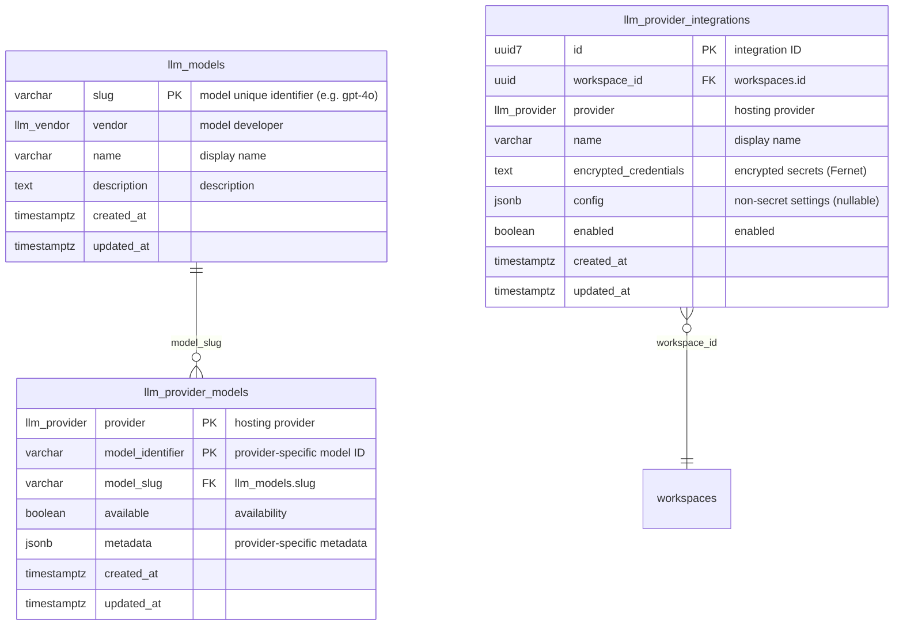
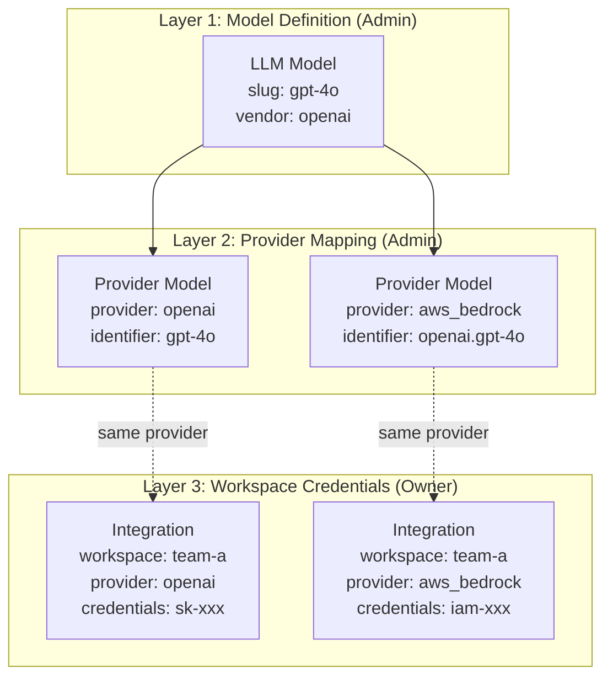
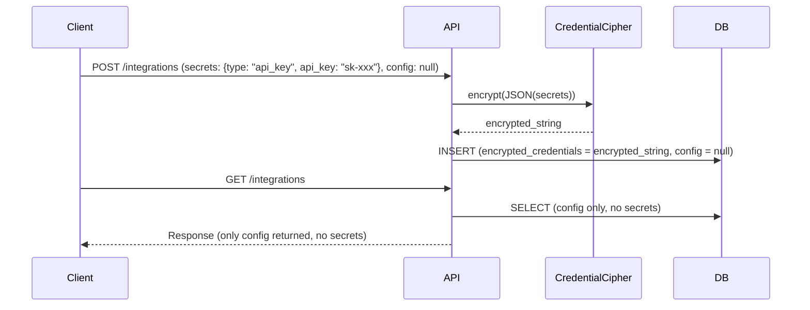
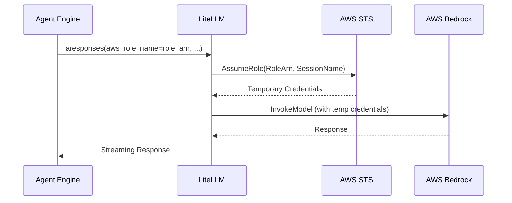

# LLM Provider Integration Design

Design document for three-layer structure to use LLM models in workspace.

## Overview

nointern platform integrates models from multiple LLM providers (OpenAI, Anthropic, etc.) to run AI agents. To support this, it adopts design separated into three layers: **model definition**, **provider mapping**, and **workspace-specific credentials**.

### Core Terms

| Term | Description | Example |
|------|------|------|
| **Vendor** | company that developed model | OpenAI, Anthropic, Google, Meta, Mistral |
| **Provider** | service that hosts/serves model | OpenAI API, AWS Bedrock, Google Vertex AI |
| **Model** | AI model created by vendor | GPT-4o, Claude Sonnet, Gemini Pro |
| **Provider Model** | model identifier at specific provider | `gpt-4o` (OpenAI), `anthropic.claude-3-sonnet-20240229-v1:0` (Bedrock) |
| **Integration** | provider credential in workspace | OpenAI API Key, Bedrock IAM credentials |

## Data Model

### ERD



### Three-layer Relationship



### ENUM Types

```python
class LLMProvider(StrEnum):
    """LLM hosting provider."""
    OPENAI = "openai"
    ANTHROPIC = "anthropic"
    GOOGLE_GEMINI = "google_gemini"
    AWS_BEDROCK = "aws_bedrock"
    GOOGLE_VERTEX_AI = "google_vertex_ai"

class LLMVendor(StrEnum):
    """LLM model developer."""
    OPENAI = "openai"
    ANTHROPIC = "anthropic"
    GOOGLE = "google"
    META = "meta"
    MISTRAL = "mistral"
```

**Why distinguish Vendor vs Provider**: models from same vendor can be provided by multiple providers. For example, Anthropic Claude can be used through both direct Anthropic API call and AWS Bedrock, each with different auth method and model identifier.

### Credential Structure (Secrets + Config Separation)

Credentials are stored in two columns depending on security level:

- **`encrypted_credentials`** (Fernet encrypted): contains only sensitive secrets
- **`config`** (JSONB plaintext): non-secret settings (Region, Access Key ID, etc.)

| Provider | Secrets (encrypted) | Config (JSONB) |
|-----------|-----------------|---------------|
| OpenAI | `ApiKeySecrets { api_key }` | — |
| Anthropic | `ApiKeySecrets { api_key }` | — |
| Google Gemini | `ApiKeySecrets { api_key }` | — |
| AWS Bedrock | `AwsSecrets { secret_access_key }` | `AwsConfig { access_key_id, region, role_arn? }` |
| Google Vertex AI | `GcpSecrets { service_account_json }` | `GcpConfig { project_id, region }` |

Distinguish provider-specific schemas with discriminated union pattern (`type` field). Definition: `nointern/core/credentials.py`

## Management Owner

| Layer | Owner | API | Description |
|------|-----------|-----|------|
| LLM Model | **Admin** | Admin API | platform-wide model catalog management |
| LLM Provider Model | **Admin** | Admin API | model-provider mapping management |
| LLM Provider Integration | **Workspace Owner** | Public API | workspace-specific credential management |

- Admin pre-registers model catalog and provider mappings.
- Workspace Owner configures provider API Key etc. to use in their workspace (BYOK).
- Manager/Member can only read Integration list (credentials not included in response).

## API Design

### Admin API

| Method | Path | Description |
|--------|------|------|
| POST | `/llm-model/v1/llm-models` | register model |
| GET | `/llm-model/v1/llm-models` | list models |
| GET | `/llm-model/v1/llm-models/{slug}` | get model details |
| PATCH | `/llm-model/v1/llm-models/{slug}` | update model |
| DELETE | `/llm-model/v1/llm-models/{slug}` | delete model |
| POST | `/llm-provider-model/v1/llm-provider-models` | register provider model |
| GET | `/llm-provider-model/v1/llm-models/{model_slug}/llm-provider-models` | list provider models |
| GET | `/llm-provider-model/v1/llm-provider-models/{provider}/{model_identifier}` | get provider model |
| PATCH | `/llm-provider-model/v1/llm-provider-models/{provider}/{model_identifier}` | update provider model |
| DELETE | `/llm-provider-model/v1/llm-provider-models/{provider}/{model_identifier}` | delete provider model |

### Public API

| Method | Path | Permission | Description |
|--------|------|-----------|------|
| POST | `/llm-provider-integration/v1/workspaces/{handle}/llm-provider-integrations` | `llm_integrations:write` | create integration |
| GET | `/llm-provider-integration/v1/workspaces/{handle}/llm-provider-integrations` | `llm_integrations:read` | list integrations |
| GET | `/llm-provider-integration/v1/workspaces/{handle}/llm-provider-integrations/{id}` | `llm_integrations:read` | get integration details |
| PATCH | `/llm-provider-integration/v1/workspaces/{handle}/llm-provider-integrations/{id}` | `llm_integrations:write` | update integration |
| DELETE | `/llm-provider-integration/v1/workspaces/{handle}/llm-provider-integrations/{id}` | `llm_integrations:write` | delete integration |

## Security

### Credential Encryption

Sensitive information (Secrets) of LLM provider is stored in DB using **Fernet symmetric encryption**. Non-secret settings (Config) are stored as plaintext JSONB.



- **Encryption key**: environment variable `NI_CREDENTIAL_ENCRYPTION_KEY` (base64-encoded 32-byte Fernet key)
- **Secrets storage**: stored as Fernet-encrypted string in DB `encrypted_credentials` column
- **Config storage**: stored as plaintext JSONB in DB `config` column (nullable)
- **Read**: Public API response does not include secrets, returns only config
- **Decrypt**: performed internally only during agent execution

### RBAC (Role-based Access Control)

| Role | `llm_integrations:read` | `llm_integrations:write` |
|------|:-:|:-:|
| Owner | O | O |
| Manager | O | X |
| Member | O | X |

- Owner: can create/update/delete integrations (WILDCARD permission)
- Manager/Member: can only list (secrets excluded from response, only config returned)
- Non-workspace member: no access (403)

### Workspace Isolation

All API endpoints perform isolation based on `workspace_id`:

- `get_workspace_member` dependency verifies current user's workspace membership.
- On create, use `member.workspace_id` (do not accept workspace_id from request).
- On query/update/delete, verify resource `workspace_id` matches requester's workspace.

### STS AssumeRole (AWS Bedrock)

For AWS Bedrock integration requiring cross-account access, if `AwsConfig.role_arn` is set, authenticate through STS AssumeRole.

- If `role_arn` is `None`, authenticate directly with Access Key (existing behavior).
- If `role_arn` is set, litellm receives `aws_role_name` + `aws_session_name` kwargs and automatically performs STS AssumeRole.
- Server automatically generates `aws_session_name` in `nointern-{workspace_id[:8]}` format.
- STS temporary credentials are issued by litellm on every call (no caching).



## Frontend

### Workspace Settings Page

- Path: `/w/{handle}/settings`
- Add "Settings" menu to sidebar.
- Owner: can add/update/delete integrations and toggle enabled state.
- Manager/Member: read-only (hide manage buttons).

### Permission-based UI

```typescript
// query current role with meQuery → derive canManage
const meQuery = trpc.workspaceMember.me.useQuery({ handle });
const canManage = meQuery.data?.role === "owner";

// show management buttons only to Owner
{canManage && <Button onClick={onOpenCreate}>Add integration</Button>}
```

Frontend is split into provider-specific form sub-components:
- `ApiKeyForm` — OpenAI, Anthropic, Google Gemini
- `AwsCredentialsForm` — AWS Bedrock (Access Key ID + Secret Access Key + Region)
- `GcpServiceAccountForm` — Google Vertex AI (Project ID + Region + Service Account JSON)

## Future Plans

- [x] Provider-specific credentials schema validation — implemented with Secrets/Config discriminated union
- [x] Agent entity — LLM model setting by referencing Integration + Provider Model (CRUD, Admin management, frontend complete)
- [ ] Agent Runtime — connect LLM API calls through Integration (ReAct loop)
- [ ] MCP Tool Layer — credential isolation on tool execution (platform injects token server-side)
- [ ] Integration health check (API Key validity check)
- [ ] Usage tracking and cost monitoring (Observability dashboard)
