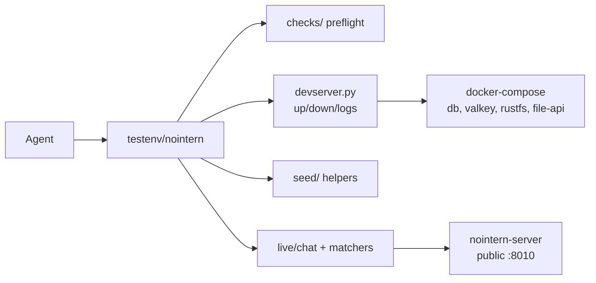

# Stage 3 — testenv Tool Execution + Sandbox + MCP Verification Platform

## Overview

Up to Stage 2, `testenv/nointern` became capable of preflight → devserver → seed → WebSocket LLM pipeline verification. Stage 3 aims to make **agent tool execution paths** (shell / file tool / Sandbox isolation / MCP toolkit credential injection) reproducible and verifiable locally. A large portion of bugs discovered only after deployment are concentrated in this area.

**Fundamental premise — testenv is not an automated e2e framework.** testenv is a platform used when an agent (coding agent such as Claude Code) acts as **QA engineer** and manually verifies nointern-server. Scenarios are not auto-execution scripts but **markdown procedures read and followed by agent** (hybrid of SRE runbook + Gherkin BDD + IEEE 829 test case).

Parent context: [#2327](https://github.com/azents/azents/issues/2327) — Stage 3 of full nointern test environment build.
Discussion record: [Discussion #2403](https://github.com/azents/azents/discussions/2403) — 10 discussion points and feasibility verification result.

## Target Scenarios

Agent should be able to do following in local testenv:

1. **Scenario C — Shell/file tool execution**
   Agent instructs sub-agent to "write a file" → collect `function_call_item` event through WebSocket → verify actual file was created in sandbox.

2. **Scenario D — MCP toolkit (credential injection verification)**
   Seed toolkit_config → agent instructs sub-agent to call MCP tool → verify by echo that mcp-proxy passed correct credential to mock stdio MCP server.

3. **Scenario E — Sandbox isolation**
   Directly call sandbox-daemon HTTP API with low-level `live.sandbox` helper → verify curl to denied domain is blocked and allowed domain passes.

## Key Decisions (Discussion #2403 Summary)

| # | Item | Decision | Rationale |
|---|---|---|---|
| 1 | Sandbox backend | **Start Docker-only** — force `sandbox_backend: "docker"` in testenv. K8s verification is future work (separate Stage). | nointern runtime already has Docker/K8s abstraction layer (`agent_home_factory.py`), so testenv can reproduce most deployment bugs locally with Docker path only. K8s-specific (NetworkPolicy) is infra layer concern. |
| 2 | Image build automation | **Separate `devserver.py build-runtime` command** — build 3 images (agent-runtime / sandbox-daemon / mcp-proxy) with this command. preflight image existence failure fix_hint points to this command. | agent-runtime is not compose service (DockerAgentHomeClient directly `docker run`s) → tying into compose `build:` is conceptual mismatch. |
| 3 | `live/` module extension | **Split submodules** — `live/chat.py` (existing), `live/sandbox.py`, `live/tools.py`, `live/mcp.py`, `live/matchers.py` (extension). | Each module owns one concern. Consistent with Stage 2 `chat` separation philosophy. |
| 4 | Isolation verification method | **Low-level helper** (`live/sandbox.py`) — directly wrap `DockerAgentHomeClient` + `SandboxDaemonClient`, bypass LLM. | LLM prompt-based isolation verification is non-deterministic + requires real key. Low-level is deterministic + dummy-key-safe → can run in CI. |
| 5 | MCP test strategy | **Start with Mock stdio server, design capable of covering real MCP later**. Add `testenv/nointern/fixtures/mock_mcp_server.py` + `mcp==1.26.0` dependency. | Verification target is not "MCP server itself" but "does our infra deliver credential correctly to MCP server". mock is optimal for credential injection verification. |
| 6 | Preflight checks added | 4 required checks: `docker-socket-accessible`, `agent-runtime-image-exists`, `sandbox-daemon-image-exists`, `mcp-proxy-image-exists`. All FAIL category. | WARN-level checks have maintenance cost > value. fix_hint guides to `devserver.py build-runtime`. |
| 7 | Matchers extension | **4 `function_call_item` based** + 2 for `live.sandbox`. Details below. | feasibility check found actual event type is single `function_call_item` (what we called "tool_call") — integrate earlier 7 proposals into 4. |
| 8 | Phase split | **8 phase stacked PR** — same as Stage 2. See implementation plan below. | Independent review per PR and early abandonment possible if direction wrong. |
| 9 | LLM key requirement | **Separate by path** — `live/sandbox` low-level scenarios pass with dummy-key (CI-friendly), `live/tools`·`live/mcp` require real LLM key. Scenario runner reuses `LLMApiKeyAvailable` preflight. | Maximize area where CI can detect regression. |
| 10 | Scenario management format | **`scenarios/<category>/<name>.md` catalog + INDEX.md** — YAML frontmatter (test_id, category, severity, requires, matchers, estimated_minutes, last_reviewed, regression_of) + Objective / Preconditions / Setup / Test Steps / Expected Result / Troubleshooting sections. Record results in `runs/<date>/<id>.md`. | Agent acts as QA engineer, not test target. Hybrid of SRE runbook + Gherkin BDD + IEEE 829 test case. Reusable as-is in Stage 4 (Playwright UI). |

## Architecture

### Current (Stage 2 baseline)



### Target (after Stage 3 completion)

```mermaid
flowchart LR
  A[Agent] --> R[scenarios/*.md<br/>catalog]
  R --> B[testenv/nointern]
  B --> C[checks/ + agent_home/docker/mcp checks]
  B --> D[devserver.py<br/>up/down/logs/build-runtime]
  B --> E[seed/ + toolkit seed]
  B --> F[live/chat + tools + sandbox + mcp]
  B --> T[fixtures/mock_mcp_server.py]
  D --> G[docker-compose<br/>existing + agent-runtime image build verification]
  F --> H[nointern-server<br/>public :8010]
  F --> I[DockerAgentHomeClient<br/>reuse]
  I --> J[agent-home-{id}<br/>container]
  J --> K[sandbox-daemon]
  J --> L[mcp-proxy + mock MCP]
  A -.execution results.-> X[runs/YYYY-MM-DD/]
```

## Data Model

### Scenario File Schema

YAML frontmatter + markdown body. `testenv/nointern/scenarios/<category>/<name>.md`.

```yaml
---
test_id: TC-SHELL-001          # globally unique ID. TC-<CATEGORY>-<SEQ>
category: shell-tool           # matches directory name
severity: high                 # low | medium | high | critical
requires:                      # prerequisite tags checked by runner
  - llm-key                    # → links to LLMApiKeyAvailable preflight
  - agent-runtime-image        # → links to AgentRuntimeImageExists preflight
matchers:                      # matcher names used by this scenario
  - has_function_call
  - function_call_succeeded
estimated_minutes: 2           # for agent time budget judgment
last_reviewed: 2026-04-09      # last manual verification date
regression_of: null            # or "#1234" (related issue/incident)
---
```

Body sections:
1. **Objective** — one paragraph on what to verify
2. **Preconditions** — state before start (preflight requirements, etc.)
3. **Setup** — seed call code snippet (executable Python)
4. **Test Steps** — sequence for agent to perform (including natural language command)
5. **Expected Result** — objective observations such as `function_call_item` event type, matcher result, sandbox-daemon HTTP response
6. **Troubleshooting** — where to look on failure (code paths, log locations) — inspired by SRE runbook

### INDEX.md Schema

Catalog root `testenv/nointern/scenarios/INDEX.md` has table of every scenario:

```markdown
| test_id | category | severity | requires | estimated_minutes | last_reviewed |
|---------|----------|----------|----------|-------------------|---------------|
| TC-SHELL-001 | shell-tool | high | llm-key, agent-runtime-image | 2 | 2026-04-09 |
| TC-SBOX-001 | sandbox-isolation | critical | agent-runtime-image | 3 | 2026-04-09 |
...
```

Agent reads this file first and selects relevant scenario when user asks. Maintained manually (or by directory scan with `scripts/regen-index.py`).

### Result Record Schema

`testenv/nointern/runs/<YYYY-MM-DD>/<test_id>.md`:

```markdown
---
test_id: TC-SHELL-001
executed_at: 2026-04-09T12:34:56Z
verdict: PASS | FAIL | INCONCLUSIVE
duration_seconds: 118
---

# Execution Log

## Event List
['run_started', 'function_call_item', 'content_delta', 'run_complete']

## Matcher Results
- has_function_call(name='execute_code'): PASS
- function_call_succeeded: PASS

## Judgment Evidence
{natural language judgment summary by agent}

## Failure Details
{not applicable / discovered issue / items checked in Troubleshooting}
```

## Module Implementation

### `testenv/nointern/live/sandbox.py`

Thin wrapper around `DockerAgentHomeClient` + `SandboxDaemonClient`. Low-level helper bypassing LLM.

```python
# pseudocode
@dataclass(frozen=True)
class Sandbox:
    """Low-level helper for Sandbox isolation verification.

    Reuses DockerAgentHomeClient to directly start agent container and verifies
    shell/file execution through sandbox-daemon HTTP API. Bypasses LLM path, so
    works even in dummy-key environment (CI).
    """

    config: TestenvConfig
    image: str = "nointern-agent-runtime:testenv"

    def start(
        self,
        agent_id: str,
        allowed_domains: list[str] | None = None,
        denied_domains: list[str] | None = None,
    ) -> AgentHome:
        """Start Agent Home container and return ready state."""
        client = DockerAgentHomeClient(
            image=self.image,
            network="nointern-testenv_default",
            data_path="/tmp/nointern-testenv/agent-data",
        )
        # ... ensure_ready + return AgentHome

    def exec(self, home: AgentHome, command: str, timeout: int = 30) -> ExecResult:
        """Call sandbox-daemon /exec."""
        ...

    def write_file(self, home: AgentHome, path: str, content: str) -> None: ...
    def read_file(self, home: AgentHome, path: str) -> str: ...

    def stop(self, home: AgentHome) -> None:
        """Call delete_agent, cleanup container."""
        ...
```

### `testenv/nointern/live/tools.py`

Combination of `live.chat` + matchers. High-level helper used when agent verifies LLM-routed tool execution.

```python
@dataclass(frozen=True)
class Tools:
    config: TestenvConfig

    def run_and_collect(
        self,
        chat: Chat,
        session: Session,
        message: str,
        timeout: int = 120,
    ) -> list[Event]:
        """Send message and collect events until run_complete.

        Uses Chat.stream() + collect() from live/chat.py as-is, but provides
        tool-call scenario specific timeout default and error branches.
        """
        ...
```

### `testenv/nointern/live/mcp.py`

Start Mock stdio MCP server + seed toolkit_config.

```python
@dataclass(frozen=True)
class Mcp:
    config: TestenvConfig

    def start_mock_server(
        self,
        tools: dict[str, Callable],
        credentials_to_echo: list[str] | None = None,
    ) -> MockMcpServer:
        """Start fixtures/mock_mcp_server.py as subprocess.

        `tools` is {tool_name: handler} dict. `credentials_to_echo` specifies
        which env variables server returns as echo — for credential injection
        verification.
        """
        ...

    def seed_toolkit_config(
        self,
        user: User,
        workspace: Workspace,
        mock_server: MockMcpServer,
        credentials: dict[str, str],
    ) -> ToolkitConfig:
        """Create toolkit_configs row (including encrypted_credentials).

        This is seed helper but lives in live area — purpose is verifying MCP
        runtime path.
        """
        ...
```

### `testenv/nointern/live/matchers.py` (extension)

Feasibility check confirmed real event type is single `function_call_item`. Therefore, 7 proposals → 4 (+ 2 sandbox-specific).

```python
def has_function_call(events: list[Event], name: str | None = None) -> None:
    """At least one function_call_item event exists. If name provided, name matches."""
    ...

def function_call_count(events: list[Event], name: str, expected: int) -> None:
    """Verify count of function_call_item with specific name."""
    ...

def function_call_succeeded(events: list[Event], name: str | None = None) -> None:
    """Verify function_call_item has output and no error.

    output.content must be non-empty and output itself must not be null.
    """
    ...

def function_call_output_contains(events: list[Event], name: str, substring: str) -> None:
    """Verify function_call_item.output.content contains substring."""
    ...

# low-level sandbox only (LLM bypass path)
def sandbox_exec_ok(result: ExecResult) -> None:
    """Verify sandbox-daemon ExecResponse exit_code == 0."""
    ...

def sandbox_exec_blocked(result: ExecResult) -> None:
    """Verify ExecResponse was blocked by isolation (stderr or exit_code pattern)."""
    ...
```

## Preflight Checks

Add to `testenv/nointern/checks/`:

| check id | category | status | verification |
|---|---|---|---|
| `docker-socket-accessible` | system | FAIL | `docker.sock` accessible + `docker ps` succeeds |
| `agent-runtime-image-exists` | images | FAIL | `docker image inspect nointern-agent-runtime:testenv` |
| `sandbox-daemon-image-exists` | images | FAIL | `docker image inspect nointern-sandbox-daemon:testenv` |
| `mcp-proxy-image-exists` | images | FAIL | `docker image inspect nointern-mcp-proxy:testenv` |

All FAIL fix_hint:
> `cd testenv/nointern && uv run devserver.py build-runtime`

## devserver.py Extension

```python
# pseudocode — add typer subcommand
@app.command()
def build_runtime(force: bool = False) -> None:
    """Build 3 images: agent-runtime / sandbox-daemon / mcp-proxy.

    Args:
        force: ignore cache and rebuild
    """
    images = [
        ("agent-runtime", "docker/nointern/agent-runtime/Dockerfile"),
        ("sandbox-daemon", "docker/nointern/sandbox-daemon/Dockerfile"),
        ("mcp-proxy", "docker/nointern/mcp-proxy/Dockerfile"),
    ]
    for name, dockerfile in images:
        tag = f"nointern-{name}:testenv"
        cmd = ["docker", "build", "-f", dockerfile, "-t", tag]
        if force:
            cmd.append("--no-cache")
        cmd.append(str(repo_root))
        subprocess.run(cmd, check=True)
```

## Dependencies Added

Add to `testenv/nointern/pyproject.toml`:
- `python-frontmatter==1.1.0` — scenario file parsing
- `mcp==1.26.0` — mock stdio MCP server implementation

Feasibility verification confirmed both packages already exist in nointern app but are missing in testenv.

## Phase Split

| Phase | PR number | Title | Major deliverables |
|---|---|---|---|
| 1 | 1/11 | design document | this document |
| 2 | 2/11 | implementation plan | temporary plan based on PR/Issue |
| 3 | 3/11 | preflight + devserver build-runtime | 4 checks in `checks/images.py` + `devserver.py build_runtime` + pyproject dependency addition |
| 4 | 4/11 | live/sandbox low-level helper | `live/sandbox.py` + sandbox-only matchers + 2 low-level dummy-key-safe scenarios |
| 5 | 5/11 | live/tools (function_call_item matchers) | matchers extension + `live/tools.py` + 2 shell-tool scenarios |
| 6 | 6/11 | live/mcp + mock stdio server | `live/mcp.py` + `fixtures/mock_mcp_server.py` + 2 MCP scenarios |
| 7 | 7/11 | scenarios/ catalog + INDEX.md + runs/ | 10 scenario files + INDEX.md + README section |
| 8 | 8/11 | agent-runtime domain filter investigation + sandbox-isolation scenarios | resolve Phase 4 Open Question + 3 `sandbox-isolation` category scenarios |
| 9 | 9/11 | README + full scenario live verification | README "Scenario catalog" section + dry-run 10 scenarios on real devserver |
| 10 | 10/11 | cleanup | remove temporary plan |

Phase 8 **depends on Phase 4 Open Question**, so sandbox-isolation scenarios are concentrated there. Phase 4 does not touch domain filter and covers neutral scenarios such as "does shell execution work".

## Initial Scenario List (10)

| test_id | category | severity | LLM key needed? | Purpose |
|---|---|---|---|
| TC-SBOX-001 | sandbox-isolation | high | No | Does basic shell execution of sandbox-daemon work (smoke) |
| TC-SBOX-002 | sandbox-isolation | high | No | file write → read roundtrip (sandbox-daemon HTTP) |
| TC-SBOX-003 | sandbox-isolation | critical | No | Is denied domain curl blocked (Phase 8) |
| TC-SBOX-004 | sandbox-isolation | high | No | Does allowed domain curl pass (Phase 8) |
| TC-SBOX-005 | sandbox-isolation | high | No | Is file write outside mount path blocked (Phase 8) |
| TC-SHELL-001 | shell-tool | high | Yes | LLM calls shell tool → file write → function_call_item + content_delta |
| TC-SHELL-002 | shell-tool | medium | Yes | LLM reads file and generates summary response |
| TC-MCP-001 | mcp-toolkit | high | Yes | mock MCP server tool call → credential correctly injected as env (echo verification) |
| TC-MCP-002 | mcp-toolkit | high | Yes | MCP tool execution → function_call_item output is mock server response |
| TC-CHAT-001 | chat-streaming | medium | Yes | normal message → text_item → content_delta streaming (verified in Stage 2 but migrated to scenarios/ format) |

## Feasibility Verification Result

Verified in Discussion #2403 on 2026-04-09. Overall result: **7/7 items possible**, 2 ⚠️ (resolved by dependency addition).

| # | Item | Result | Resolution |
|---|---|---|---|
| 1 | Reuse `DockerAgentHomeClient` | ✅ | constructor `(image, network, data_path, docker_host)`, instantiable without nointern DI |
| 2 | `docker build` for 3 images | ✅ | buildx not required, no secrets |
| 3 | MCP mock server | ⚠️ | add `mcp==1.26.0` to testenv pyproject |
| 4 | YAML frontmatter parsing | ⚠️ | add `python-frontmatter==1.1.0` to testenv pyproject |
| 5 | tool event type | ✅ | **single `function_call_item`** — redesign matcher names (7 → 4) |
| 6 | sandbox-daemon API | ✅ | `/exec`, `/files`, `/files/glob`, `/files/grep` all public |
| 7 | testenv directory conflict | ✅ | no conflict when adding `scenarios/`, `runs/`, `fixtures/` |

## Open Questions

### (a) agent-runtime domain blocking implementation location (moved Phase 4 → Phase 8)

`agent_home_docker.py:132-133` only injects `ALLOWED_DOMAINS`, `DENIED_DOMAINS` as environment variables. Actual blocking happens somewhere inside agent-runtime container entrypoint, but exact mechanism (mitmproxy? iptables? CNI?) was not confirmed in this feasibility investigation.

→ Prior investigation needed before starting Phase 8. Investigation output recorded in design document appendix or Phase 8 PR body. If misunderstood, TC-SBOX-003/004/005 scenarios may not verify real isolation.

### (b) Mock MCP server injection path

Exact method to inject mock server Python file into agent-runtime container:
- Option 1: build testenv-only agent-runtime image variant (Dockerfile extension)
- Option 2: copy file after container start with `docker cp`
- Option 3: expose host file inside container with bind mount

Choose during Phase 6 design. Current recommendation is **Option 3 (bind mount)** — extend only in testenv without prod image change and control only path read by mcp-proxy through config.

### (c) `runs/` directory management

Result records accumulate and `runs/` grows. retention policy:
- Commit to Git? (result logs comparable in PR review) — storage burden
- `.gitignore`? (local only) — results not shareable
- Commit only recent N? — manual cleanup hassle

**Current decision — add to `.gitignore`.** Share result by pasting into PR body/comment or separate paste service if needed. Reconfirm in Phase 7.

## Alternatives Considered

| Alternative | Rejection reason |
|---|---|
| Reproduce prod environment exactly with K8s (kind/minikube) | local CPU/memory burden, Docker backend abstraction already exists so can bypass. K8s-specific bugs separated into separate Stage. |
| auto-build agent-runtime through compose `build:` section | agent-runtime is not compose service but image that DockerAgentHomeClient `docker run`s → conceptual mismatch. |
| Extend only `live.chat`, integrate sandbox/tools/mcp | sandbox isolation verification must not use LLM to be deterministic → does not fit `chat` category. concern separation fails. |
| LLM prompt-based isolation verification | non-deterministic + real key required + slow. low-level helper much more reliable. |
| Use real MCP server (analytics-mcp) | requires GA4 credential, external API call → unstable + slow. target is "credential injection by our infra", so mock is enough. |
| pytest + pytest-examples scenario automation | conflicts with testenv philosophy ("not pytest, agent runs manually"). Cannot preserve Stage 2 investment. |
| Anthropic/SWE-bench/METR style task catalog | Those are agent capability evaluation frameworks. We need software verification → QA runbook + Gherkin fits. |
| Define custom event type instead of `function_call_item` | separating from prod event type breaks "real path verification". |

## References

- Parent issue: [#2327](https://github.com/azents/azents/issues/2327)
- Sub issue: [#2401](https://github.com/azents/azents/issues/2401)
- Previous Stage 2: [#2376](https://github.com/azents/azents/issues/2376)
- Design discussion: [Discussion #2403](https://github.com/azents/azents/discussions/2403)
- Stage 2 outputs: `testenv/nointern/live/chat.py`, `live/matchers.py`, `checks/config.py` (`LLMApiKeyAvailable`)
- nointern runtime: `python/apps/nointern/src/nointern/runtime/sandbox/agent_home_docker.py`, `agent_home_factory.py`
- sandbox-daemon: `python/apps/nointern-sandbox-daemon/src/nointern_sandbox_daemon/routes.py`
- Dockerfile: `docker/nointern/agent-runtime/Dockerfile`, `sandbox-daemon/Dockerfile`, `mcp-proxy/Dockerfile`
