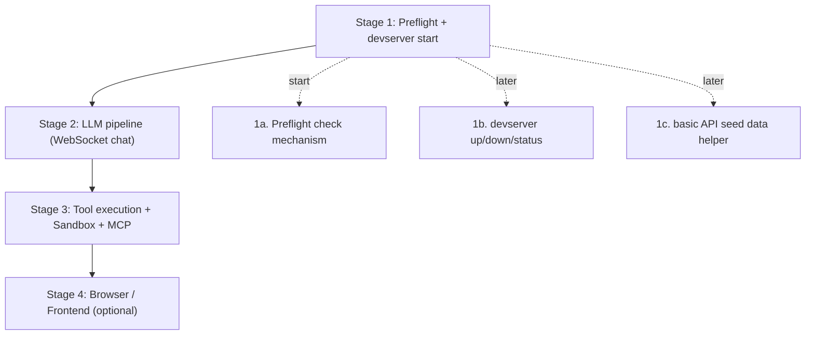
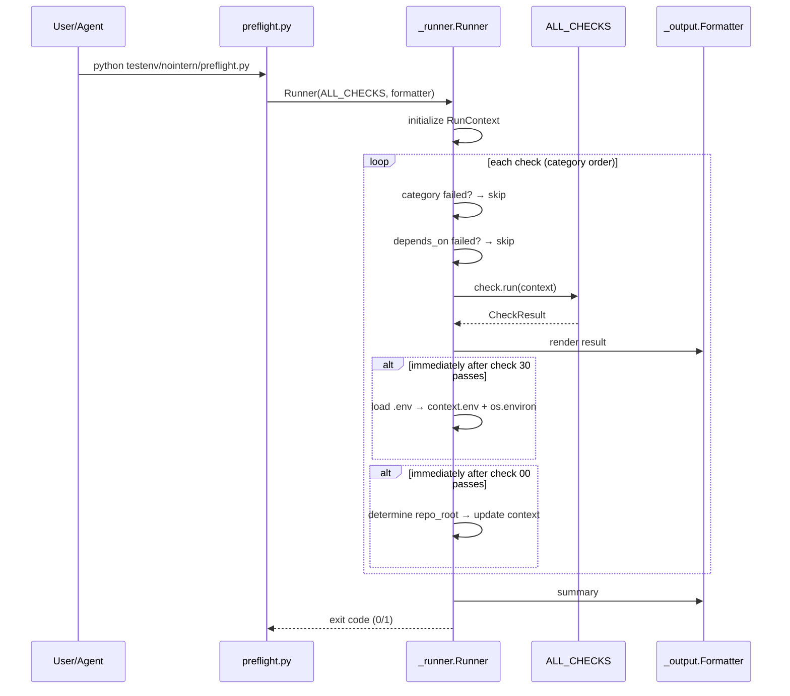

# Full-stack Local Test Environment — Stage 1 (Preflight)

> Related issues: azents/azents#2327 (parent), azents/azents#2328 (this design)

## Overview

Most NoIntern features can currently be verified only after deployment. Goal is to let an agent (Claude Code) directly set up environment locally, verify feature behavior, and reproduce bugs after implementing a new feature.

This document covers **Stage 1 — Preflight check mechanism** of the whole vision.

### Test scope

Only deterministically verifiable items are covered.

| Layer | Items |
|---|---|
| **Tools/infra** | prompt assembly, tool execution, MCP toolkit, Sandbox isolation |
| **LLM pipeline** | request/response/rendering, image generation/input (structural verification only) |

**Out of scope**: LLM response quality evaluation. Whether "agent is smart" is not what CC should judge.

### User scenario

Assume agent A implemented new MCP toolkit type.

1. Agent A completes code changes and wants to "verify behavior"
2. Run `./testenv/nointern/preflight.py` → check all prerequisites
3. Resolve failed checks one by one using fix hints
4. preflight passes → start devserver (stage after Stage 1)
5. Create toolkit via API call → invoke actual tool through chat session (Stage 2/3)
6. Confirm expected behavior → done. If bug found, reproduce in same environment

Stage 1 owns **up to step 3**. Remaining parts are Stage 2+.

## Overall Roadmap



This document is final design for **Stage 1a (Preflight check mechanism)**. Stage 1b/1c and Stage 2~4 continue in separate design documents.

## Stage 1a Architecture

### Location

```
<repo root>/
└── testenv/
    └── nointern/
        ├── preflight.py              # entrypoint
        ├── README.md                 # usage + guide for adding checks
        └── checks/
            ├── __init__.py           # explicit ALL_CHECKS list
            ├── _base.py              # Check, CheckResult, Status, RunContext
            ├── _runner.py            # runner logic
            ├── _output.py            # output formatting (TTY/ASCII)
            ├── system.py             # 00, 10~14
            ├── ports.py              # 20
            ├── config.py             # 30, 31
            ├── infra.py              # 40~44
            └── runtime_state.py      # 70
```

- `testenv/`: new top-level directory in repo root. Dedicated to test harness
- `nointern/`: project scope. Can expand to `testenv/azents/` etc. in future

### Execution model



### Core principles

- **Zero dependency**: Python standard library only. Must run independently of `uv`/project dependencies (check 14 verifies project dependency install, so preflight itself cannot depend on it)
- **No side effects**: all checks are **read-only**. No state changes (e.g., no alembic upgrade, no docker compose up)
- **Category-level stop**: if any check in category fails, all following categories are skipped
- **Explicit registration**: no auto-discover. Instances are explicitly listed in order in `ALL_CHECKS`

## Data Model

### Status

```python
class Status(Enum):
    PASS = "pass"
    FAIL = "fail"
    WARN = "warn"
    SKIP = "skip"
```

| Status | Meaning | Exit code impact |
|---|---|---|
| PASS | check passed | none |
| FAIL | check failed — requires resolution | exit 1 |
| WARN | can proceed but attention needed | none |
| SKIP | dependency failure or category skip | none |

### CheckResult

```python
@dataclass
class CheckResult:
    status: Status
    detail: str = ""       # additional info on PASS (e.g., "v28.0.1")
    message: str = ""      # reason on FAIL/WARN/SKIP
    fix_hint: str = ""     # resolution on FAIL/WARN

    @classmethod
    def ok(cls, detail: str = "") -> "CheckResult": ...

    @classmethod
    def fail(cls, message: str, fix_hint: str = "") -> "CheckResult": ...

    @classmethod
    def warn(cls, message: str, fix_hint: str = "") -> "CheckResult": ...

    @classmethod
    def skip(cls, reason: str) -> "CheckResult": ...
```

Check functions create result only through above factory methods. Do not directly call `CheckResult(...)`.

### RunContext

```python
@dataclass
class RunContext:
    repo_root: Path                                  # determined by check 00, fixed afterward
    nointern_dir: Path                               # repo_root / "python/apps/nointern"
    env_file: Path                                   # nointern_dir / ".env"
    env: dict[str, str] = field(default_factory=dict)
    previous_results: dict[str, CheckResult] = field(default_factory=dict)
```

- `repo_root` is determined by check 00. Runner updates context afterward.
- `env` is loaded immediately after check 30 passes. It is also injected into `os.environ` (for subprocess inheritance).
- `previous_results` is used for `depends_on` evaluation. Direct reference inside check is only exceptional.

### Check base class

```python
class Check:
    id: str = ""
    name: str = ""
    category: str = ""
    depends_on: list[str] = []          # ids of other checks

    def run(self, context: RunContext) -> CheckResult:
        raise NotImplementedError
```

To add new check:

1. Define subclass in appropriate module file
2. Declare metadata as class attributes
3. Implement `run(context)`
4. Add instance to `ALL_CHECKS` in `checks/__init__.py` in order

### ALL_CHECKS registration

```python
# testenv/nointern/checks/__init__.py
from .system import (
    RepoRoot,
    DockerRunning,
    DockerComposeAvailable,
    UvInstalled,
    PythonVersion,
    PythonDepsInstalled,
)
from .ports import DevserverPortsFree
from .config import EnvFileExists, RequiredEnvVars
from .infra import (
    PostgresContainerHealthy,
    PostgresConnectable,
    ValkeyReachable,
    RustfsReachable,
    FileApiHealthy,
)
from .runtime_state import DbMigrationCurrent

ALL_CHECKS: list[Check] = [
    RepoRoot(),
    DockerRunning(),
    DockerComposeAvailable(),
    UvInstalled(),
    PythonVersion(),
    PythonDepsInstalled(),
    DevserverPortsFree(),
    EnvFileExists(),
    RequiredEnvVars(),
    PostgresContainerHealthy(),
    PostgresConnectable(),
    ValkeyReachable(),
    RustfsReachable(),
    FileApiHealthy(),
    DbMigrationCurrent(),
]
```

## Check Detailed Specification

For each category, specify id, what is verified, and fix hint on failure.

### System (00, 10~14)

| id | name | Verification method | fix hint |
|---|---|---|---|
| `repo-root` | Repo root detected | find `docker-compose.nointern.yaml` from current working directory or ancestors | Run from monorepo root |
| `docker-running` | Docker daemon running | `docker info` subprocess, returncode 0 | Start Docker Desktop / `sudo systemctl start docker` |
| `docker-compose-available` | docker compose plugin | `docker compose version` returncode 0 | Install docker compose v2 plugin |
| `uv-installed` | uv installed | `shutil.which("uv")` | `curl -LsSf https://astral.sh/uv/install.sh \| sh` |
| `python-version` | Python 3.14+ | verify python exists satisfying `requires-python` in `python/apps/nointern/pyproject.toml` (`uv run python --version` or `python3.14 --version`) | Install Python 3.14 via pyenv/mise |
| `python-deps-installed` | nointern deps installed | check `python/apps/nointern/.venv` exists + `uv run python -c "import nointern"` succeeds | `cd python/apps/nointern && uv sync` |

**Note**: `python-version` checks **Python 3.14 required by nointern project**, not Python used by preflight itself (could be 2.x). Preflight itself uses only Python 3.8+ standard library.

### Ports (20)

| id | name | Verification method | fix hint |
|---|---|---|---|
| `devserver-ports-free` | Devserver ports free | whether ports 8010, 8011 are free (`socket.bind` attempt → OSError means in use) | Stop existing devserver. Find process: `lsof -i :8010` |

**Note**: Infra ports (5433, 6379, 9000, 9001, 8081) are not verified. It is normal for `docker compose` to use them, and they are judged in 40-range checks.

### Config (30, 31)

| id | name | Verification method | fix hint |
|---|---|---|---|
| `env-file-exists` | .env file exists | file `python/apps/nointern/.env` exists | `cp .env.example .env && edit` |
| `required-env-vars` | Required env vars set | all variables below exist + `NI_CREDENTIAL_ENCRYPTION_KEY` format verification | missing variable names + guide to `.env.example` |

**List checked by `required-env-vars`**:

Existence only:
- `NI_RDB_HOST`
- `NI_RDB_PORT`
- `NI_RDB_USER`
- `NI_RDB_PASSWORD`
- `NI_RDB_DB_NAME`
- `NI_AUTH_JWT_SECRET_KEY`
- `NI_REDIS_URL`
- `NI_WORKSPACE_S3_BUCKET`
- `NI_WORKSPACE_S3_ENDPOINT_URL`
- `NI_AGENT_HOME_K8S_MCP_PROXY_IMAGE` (Settings required even if K8s unused)
- `NI_AGENT_HOME_K8S_SANDBOX_DAEMON_IMAGE` (same)

Format verification:
- `NI_CREDENTIAL_ENCRYPTION_KEY`: exactly 32 bytes after base64 decoding

**.env loading timing**: runner parses `.env` immediately after check 30 (`env-file-exists`) passes and injects into `context.env` and `os.environ`. From check 31 onward, environment variables can be safely used.

### Infra (40~44)

Separately verifies container state and actual reachability.

| id | name | Verification method | fix hint |
|---|---|---|---|
| `postgres-container-healthy` | Postgres container healthy | parse output of `docker compose -p nointern ps --format json db`, confirm `State=running` | `docker compose -f docker-compose.nointern.yaml up -d db` |
| `postgres-connectable` | Postgres connectable | actually attempt `psycopg.connect()` via `uv run python -c "..."` in nointern project | verify auth info / port |
| `valkey-reachable` | Valkey reachable | parse `NI_REDIS_URL` → TCP connection attempt (`socket`) | `docker compose up -d valkey` |
| `rustfs-reachable` | RustFS reachable | `urllib.request.urlopen(".../minio/health/live")` from `NI_WORKSPACE_S3_ENDPOINT_URL` | `docker compose up -d rustfs` |

**`postgres-connectable` implementation**:

```python
# depends_on = ["python-deps-installed", "postgres-container-healthy", "required-env-vars"]

def run(self, context: RunContext) -> CheckResult:
    script = (
        'import psycopg, os, sys;'
        'try:'
        ' psycopg.connect('
        '  host=os.environ["NI_RDB_HOST"],'
        '  port=int(os.environ["NI_RDB_PORT"]),'
        '  user=os.environ["NI_RDB_USER"],'
        '  password=os.environ["NI_RDB_PASSWORD"],'
        '  dbname=os.environ["NI_RDB_DB_NAME"]).close();'
        ' print("ok")'
        'except Exception as e:'
        ' print(f"fail: {e}", file=sys.stderr); sys.exit(1)'
    )
    result = subprocess.run(
        ["uv", "run", "python", "-c", script],
        cwd=context.nointern_dir,
        capture_output=True,
        text=True,
    )
    if result.returncode != 0:
        return CheckResult.fail(
            message=result.stderr.strip() or "connection failed",
            fix_hint="Verify NI_RDB_* env vars match docker-compose",
        )
    return CheckResult.ok()
```

### Runtime State (70)

| id | name | Verification method | fix hint |
|---|---|---|---|
| `db-migration-current` | DB migration up to date | compare output of `uv run alembic -c db-schemas/rdb/alembic.ini current` and `heads` | `cd python/apps/nointern && uv run alembic upgrade head` |

**`depends_on`**: `["python-deps-installed", "postgres-connectable"]`

## Runner Algorithm

```python
def run(checks: list[Check], formatter: Formatter) -> int:
    context = RunContext(
        repo_root=Path.cwd(),          # overridden by check 00
        nointern_dir=Path.cwd() / "python/apps/nointern",
        env_file=Path.cwd() / "python/apps/nointern/.env",
    )

    current_category: str = ""
    category_failed = False
    totals = {Status.PASS: 0, Status.FAIL: 0, Status.WARN: 0, Status.SKIP: 0}

    for check in checks:
        # print header + reset failed flag on category transition
        if check.category != current_category:
            current_category = check.category
            category_failed = False
            formatter.category_header(current_category)

        # category failed → skip
        if category_failed:
            result = CheckResult.skip("previous category failed")
        # depends_on failed → skip
        elif _dependency_failed(check, context):
            failed_deps = _failed_dependencies(check, context)
            result = CheckResult.skip(f"dependency failed: {', '.join(failed_deps)}")
        else:
            try:
                result = check.run(context)
            except Exception as e:
                result = CheckResult.fail(
                    message=f"check raised: {type(e).__name__}: {e}",
                    fix_hint="Bug in preflight check; report to maintainers",
                )

        # output
        formatter.check_result(check, result)

        # record state
        context.previous_results[check.id] = result
        totals[result.status] += 1

        # post-processing by result
        if result.status == Status.PASS:
            _post_pass_hooks(check, context)
        if result.status == Status.FAIL:
            category_failed = True

    formatter.summary(totals)
    return 0 if totals[Status.FAIL] == 0 else 1


def _post_pass_hooks(check: Check, context: RunContext) -> None:
    """Update context immediately after specific check passes."""
    if check.id == "repo-root":
        # reflect repo_root determined by check 00 into context
        context.repo_root = _detected_repo_root
        context.nointern_dir = context.repo_root / "python/apps/nointern"
        context.env_file = context.nointern_dir / ".env"
    elif check.id == "env-file-exists":
        # check 30 passed → load .env
        _load_env_file(context.env_file, context.env)
        os.environ.update(context.env)
```

- `_detected_repo_root` delivery method: parse `detail` field of `RepoRoot` check result, or add temporary slot to context. Decide during implementation.
- `.env` parsing: ignore `#` comments, simple parse `KEY=VALUE`, remove quotes. stdlib only, no python-dotenv dependency

## Output Format

TTY auto-detection: `sys.stdout.isatty()` → if True ANSI color + Unicode symbol, otherwise ASCII.

### TTY example

```
NoIntern Preflight

[system]
  ✓ Repo root detected                      /home/user/azents
  ✓ Docker daemon running                   v28.0.1
  ✓ docker compose plugin                   v2.30.3
  ✓ uv installed                            v0.5.11
  ✓ Python 3.14+                            3.14.3
  ✓ nointern deps installed

[ports]
  ✗ Devserver ports free
    → 8010 is in use
    → fix: Stop existing devserver. Find process: lsof -i :8010

[config]
  ⊘ .env file exists                        (skipped: previous category failed)
  ⊘ Required env vars set                   (skipped)

[infra]
  ⊘ Postgres container healthy              (skipped)
  ⊘ Postgres connectable                    (skipped)
  ⊘ Valkey reachable                        (skipped)
  ⊘ RustFS reachable                        (skipped)

[runtime_state]
  ⊘ DB migration up to date                 (skipped)

Result: 6 passed, 1 failed, 0 warned, 8 skipped
```

### Plain ASCII example (pipe/CI/log)

```
NoIntern Preflight

[system]
  [PASS] Repo root detected                 /home/user/azents
  [PASS] Docker daemon running              v28.0.1
  ...

[ports]
  [FAIL] Devserver ports free
    - 8010 is in use
    - fix: Stop existing devserver. Find process: lsof -i :8010

...

Result: 6 passed, 1 failed, 0 warned, 8 skipped
```

### Symbol mapping

| Status | TTY | ASCII |
|---|---|---|
| PASS | `✓` (green) | `[PASS]` |
| FAIL | `✗` (red) | `[FAIL]` |
| WARN | `⚠` (yellow) | `[WARN]` |
| SKIP | `⊘` (dim) | `[SKIP]` |

### Language

**English**. Follow CLAUDE.md rule: "user/log messages are English". However, comments/docstrings remain Korean.

### Machine parsing

Stage 1a supports machine parsing **only through exit code**. JSON flag (`--json`) can be added after Stage 1b if needed.

- exit 0: no failures
- exit 1: one or more FAIL

## Extension Mechanism

Adding new check has 3 steps:

1. **Define check class** (in appropriate `checks/*.py`):
    ```python
    # testenv/nointern/checks/infra.py
    class MyNewCheck(Check):
        id = "my-new-check"
        name = "My new check"
        category = "infra"
        depends_on = ["postgres-container-healthy"]

        def run(self, context: RunContext) -> CheckResult:
            # verification logic
            if ...:
                return CheckResult.fail("...", fix_hint="...")
            return CheckResult.ok("detail")
    ```

2. **Register in `ALL_CHECKS`** (`checks/__init__.py`):
    ```python
    from .infra import MyNewCheck

    ALL_CHECKS = [
        ...,
        PostgresContainerHealthy(),
        MyNewCheck(),  # here by order
        ...,
    ]
    ```

3. **Update README.md**: add one row to check list table

### Adding new category

If new category is needed (e.g., `build`, `network`):

1. Create new module file (`checks/build.py`)
2. Decide category name (keep numbering system: 50-range? 80-range?)
3. Reflect in `ALL_CHECKS` order
4. Output formatter automatically detects category name, so no change needed

## Infra Changes

**No change.** This design only adds new directory (`testenv/nointern/`) and Python script to codebase, and does not touch following:

- existing nointern python app
- docker-compose.nointern.yaml
- CI pipeline (`.github/workflows/`)
- agent-runtime Dockerfile
- Alembic migration

## Feasibility Verification

### Verification items

| Item | Verification | Result |
|---|---|---|
| implementation with Python stdlib only | `subprocess`, `pathlib`, `socket`, `urllib.request`, `base64`, `dataclasses`, `enum`, `json` all stdlib | ✓ |
| container filtering by docker compose project name | `name: nointern` field specified in compose file → can use `docker compose -p nointern ps --format json` | ✓ |
| psycopg import for `postgres-connectable` | confirmed `psycopg` included in nointern project deps. usable after check 14 passes | ✓ |
| Alembic current vs head comparison | confirmed `uv run alembic -c db-schemas/rdb/alembic.ini current/heads` works. env.py uses NI_* env vars so .env load needed | ✓ |
| RustFS MinIO-compatible health endpoint | `rustfs-init` works with `mc` (MinIO client) → MinIO-compatible API. `/minio/health/live` likely. fallback to TCP port check if fails | ✓ (fallback secured) |
| TTY detection | standard API `sys.stdout.isatty()` | ✓ |
| .env parsing with stdlib only | simple KEY=VALUE format. only comments/quotes handling needed | ✓ |
| port in-use detection | `socket.socket().bind(('127.0.0.1', port))` → whether OSError occurs | ✓ |
| subprocess timeout | `subprocess.run(timeout=N)` standard support | ✓ |

### Risks and mitigations

| Risk | Likelihood | Impact | Mitigation |
|---|---|---|---|
| RustFS does not support `/minio/health/live` | medium | medium | fallback to TCP port connection (docker-compose healthcheck also uses only TCP) |
| `alembic heads` output format may differ by version | low | medium | extract revision hash with regex and compare both sides same way |
| `uv run` automatically triggers venv creation → check 14 accidentally "passes" | medium | low | check 14 first verifies `.venv` directory exists. prefer direct `.venv/bin/python` over `uv run` |
| `NI_WORKSPACE_S3_ENDPOINT_URL` set to `http://host.docker.internal:9000` is unreachable from host | medium | medium | treat as warn + guide "may not be host-access URL" |
| Python below 3.8 environment (stdlib dependency) | low | high | top of preflight checks `sys.version_info < (3, 8)` and early exits |
| `devserver-ports-free` fails because another session running existing preflight | low | low | include `lsof -i :PORT` guidance in error message |

### Unverified items

Following need actual execution during implementation to confirm:

- Actual RustFS `/minio/health/live` response
- `docker compose -p nointern ps --format json` output schema (diff by docker compose v2 version)
- Exact `uv run alembic current` output format

→ Verify in **Implementation Phase 2**.

## Implementation Plan

Stage 1a is implemented in 4 phases. Commits are phase-level, but submit whole Stage 1a as single PR.

### Phase 1: Skeleton + common infra

Files:
- `testenv/nointern/preflight.py`
- `testenv/nointern/checks/__init__.py` (empty `ALL_CHECKS`)
- `testenv/nointern/checks/_base.py` (`Status`, `CheckResult`, `RunContext`, `Check`)
- `testenv/nointern/checks/_runner.py` (`Runner`)
- `testenv/nointern/checks/_output.py` (`Formatter`, TTY detection)

Artifact verification: `python testenv/nointern/preflight.py` → prints "No checks registered" or empty summary.

### Phase 2: one pipeline-verification check

- Implement `RepoRoot` in `testenv/nointern/checks/system.py`
- Add to `ALL_CHECKS`
- Manually verify PASS case (run from repo root) and FAIL case (run from `/tmp`)
- Verify both output formats (TTY/ASCII)

### Phase 3: remaining 14 checks

Add by category order:

1. system: `DockerRunning`, `DockerComposeAvailable`, `UvInstalled`, `PythonVersion`, `PythonDepsInstalled`
2. ports: `DevserverPortsFree`
3. config: `EnvFileExists`, `RequiredEnvVars`
4. infra: `PostgresContainerHealthy`, `PostgresConnectable`, `ValkeyReachable`, `RustfsReachable`, `FileApiHealthy`
5. runtime_state: `DbMigrationCurrent`

After adding each category, run in actual local environment and confirm behavior.

### Phase 4: documentation

- Write `testenv/nointern/README.md`:
  - usage (how to run, interpret output, common failure cases)
  - guide to adding new check (3 steps + example code)
  - check list table
- top-level `testenv/README.md` (if exists) or omit

### Commit strategy

- Commit 1: Phase 1 + Phase 2 (skeleton + dummy check for pipeline verification)
- Commit 2: Phase 3 by category or all
- Commit 3: Phase 4 docs

## Alternatives Considered

### 1. Bash script

- **Tried**: individual check = independent bash file, source common helper `lib/check.sh`, result as exit code + temp file
- **Rejected because**: requirements (aggregation, category skip, individual dependency, .env loading, color output) accumulated and bash IPC complexity increased. It effectively became "subprocess + result file", harder to maintain than Python. User feedback: "If we are going to have module structure, we would use a language with proper module structure like Python."

### 2. Auto-discover (decorator registration)

- **Tried**: register check function with `@register(id=..., category=...)` decorator → auto-collected into registry on module import
- **Rejected because**: User dislikes import side-effect based auto-discover. "I hate auto discover mechanisms." Explicit `ALL_CHECKS` list controls order and registration in one place and is easier to debug.

### 3. Function + metadata dataclass instead of Python class

- **Tried**:
    ```python
    def docker_running() -> CheckResult: ...

    CHECKS = [
        Check(id="docker-running", name="...", category="system", fn=docker_running),
    ]
    ```
- **Rejected because**: class inheritance is more idiomatic and has better IDE support. Metadata is explicit as class attributes. Common logic between checks is easier to place in base class (currently base is only abstract, but leaves future extension room).

### 4. Makefile entrypoint

- **Tried**: call with `make preflight`
- **Rejected because**: project does not yet have Makefile convention. Introducing new Makefile creates separate convention. Single command (`./testenv/nointern/preflight.py`) is simpler. Consider Makefile or dispatcher later if more commands appear.

### 5. Stop on first failure (instead of category skip)

- **Tried**: runner exits on first FAIL. No summary, no complex dependency management.
- **Rejected because**: showing multiple problems at once is valuable. Meaningless failures like "postgres check when docker is down" can be avoided with category-level stop. Balanced solution.

### 6. Support independent execution per check file (single-file direct call)

- **Tried**: each check file can run independently with `if __name__ == "__main__":` guard
- **Rejected because**: out of Stage 1 scope. Running through `ALL_CHECKS` list and runner guarantees consistent output/context. Add as option later if needed.

## Later Stage Preview

Next steps after Stage 1a completion (for reference, out of this document scope):

**Stage 1b — devserver lifecycle commands**: `up`, `down`, `status`, `logs`. Process management (PID file / tmux / nohup), guaranteed graceful shutdown, ready detection.

**Stage 1c — test data seed helper**: register LLM model with Admin API, create auth/workspace/agent with Public API. Reuse E2E `utils.py` pattern.

**Stage 2 — LLM pipeline**: WebSocket client helper, event stream verification, image input/generation verification. Need decide LLM API key management convention.

**Stage 3 — tool execution + Sandbox**: agent-runtime image build automation, Agent Home container verification, MCP toolkit behavior confirmation, Sandbox isolation verification.

**Stage 4 — browser**: local nointern-web execution, UI verification with Playwright MCP.
