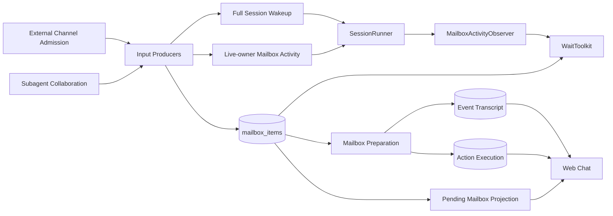

# Unified Agent Input Mailbox Design

- Snapshot: `mailbox-260726`
- Document reference: `mailbox-260726/DESIGN`
- Requirements: [Unified Agent Input Mailbox Requirements](../requirements/mailbox-260726-unified-agent-input-mailbox.md) (`mailbox-260726/REQ`)
- ADR: [Unified Agent Input Mailbox](../adr/mailbox-260726-unified-agent-input-mailbox.md) (`mailbox-260726/ADR`)

## Overview

This design replaces the current InputBuffer domain with one explicit, consume-on-read AgentSession mailbox. User messages, Goal continuations, Agent messages, External Channel invocation envelopes, and Turn Actions enter the same ordered mailbox after their target Session and delivery eligibility are resolved.

Mailbox persistence is passive. Producers own admission orchestration, Session-running transitions, broker wakeups, queue-only activity notifications, and live projection publication. The Agent input path owns atomic promotion or operation-action handoff and deletes the mailbox item only after the next authoritative state is durable.

A new independent `WaitToolkit` uses a Run-scoped `MailboxActivityObserver` owned by `SessionRunner`. The initial wait condition remains active descendant work, but any pending mailbox item ends an eligible wait. The observer never carries input payload and never consumes scheduler or mailbox state.

The backend exposes typed pending mailbox projections. Web reuses source-specific renderers with a common pending presentation and correlates each pending item with its durable event or active Turn Action execution.

## Traceability

| Requirement | ADR decisions | Design mechanisms |
| --- | --- | --- |
| `mailbox-260726/REQ-1` | `ADR-D1`, `ADR-D2`, `ADR-D3`, `ADR-D5` | In-place `mailbox_items` migration, typed envelope payloads, passive mailbox service, producer-owned signaling, atomic terminal delivery |
| `mailbox-260726/REQ-2` | `ADR-D2`, `ADR-D7` | Embedded stable item keys, typed pending projections, durable-before-removal handoff |
| `mailbox-260726/REQ-3` | `ADR-D1`, `ADR-D2`, `ADR-D3`, `ADR-D4`, `ADR-D7` | Single FIFO, unchanged kind processors, source-owned scheduling, server-owned correlation |
| `mailbox-260726/REQ-4` | `ADR-D4`, `ADR-D6` | `ActiveDescendantWaitCondition`, current descendant activity projection |
| `mailbox-260726/REQ-5` | `ADR-D3`, `ADR-D4`, `ADR-D6` | Full-wakeup observation, live-owner queue activity, level-triggered mailbox checks |
| `mailbox-260726/REQ-6` | `ADR-D3`, `ADR-D6` | Existing timeout schema, observer wait loop, reconciliation interval |
| `mailbox-260726/REQ-7` | `ADR-D6` | Independent `WaitToolkit`, concise prompts, structured outcomes |
| `mailbox-260726/REQ-8` | `ADR-D3`, `ADR-D5` | Atomic queue-only terminal envelope, live-owner activity, pure wait observer |

## Current Behavior and Gaps

### Shared persistence without explicit mailbox ownership

`input_buffers` already stores five ordered kinds and `InputBufferService` already provides idempotent enqueue, single-head locking, promotion, event append, Turn Action handoff, and delete-after-success. However, the domain is still named and modeled as preparation buffering rather than the canonical Agent input mailbox. Producer code constructs generic `InputBufferEnqueue` records directly, and pending presentation remains tied to InputBuffer-specific contracts.

### External Channel pending input is a pointer

An authorized External Channel invocation currently enqueues one `EXTERNAL_CHANNEL_INVOCATION` row containing an invocation batch ID. Promotion re-reads External Channel repository projections and builds multiple durable `external_channel_message` events. The pending Agent input therefore remains dependent on source-domain records and has no pending Web projection.

### Wait observes only Agent messages

`wait_agent` polls `InputBufferKind.AGENT_MESSAGE` every 100 milliseconds and performs terminal-result repair. User messages, Turn Actions, External Channel invocations, and Goal continuations do not end the wait. Broker wakeups received while a Run is active accumulate in `SessionRunnerInbox` and are not exposed to the executing tool.

### Terminal result delivery is eventual

A child terminal Run is committed before direct-parent result delivery. Normal terminal handling, parent wait polling, and later source Session reuse each attempt repair. The result itself is queue-only and does not wake an idle parent.

### Pending UI contracts differ by kind

User input has a dedicated reduced-emphasis pending bubble. Agent and action inputs have partial live-event projections. External Channel invocation returns no pending projection. The frontend therefore cannot apply one mailbox lifecycle across every input kind.

## Proposed Architecture



### Ownership boundaries

#### Mailbox domain

Owns:

- unread AgentSession input envelopes;
- one FIFO position per envelope;
- item kind and scheduling intent;
- idempotent admission identity;
- complete immutable typed input snapshots;
- non-consuming reads and single-head claims; and
- atomic delete as part of successful promotion or operation handoff.

Does not own:

- Session-running transitions;
- broker wakeups or transient activity notifications;
- External Channel authorization or context collection;
- descendant activity policy;
- model-visible wait tools; or
- consumed history.

#### Producer domains

Own:

- target and delivery-eligibility resolution;
- complete mailbox payload construction;
- admission transaction orchestration;
- producer-specific Session-running state changes;
- post-commit full wakeup or queue-only activity notification;
- idempotency keys; and
- pending live-projection publication after commit.

#### SessionRunner

Owns:

- Session broker inbox and sticky ownership;
- full-wakeup delivery;
- live-owner queue-activity delivery;
- one Run-scoped `MailboxActivityObserver`;
- observer notification while the Run is active; and
- observer cleanup at Run completion or handover.

#### Wait domain

Owns:

- model-visible `wait` exposure;
- current wait-condition evaluation;
- mailbox level checks;
- observer waiting and timeout calculation; and
- structured outcome generation.

It does not own mailbox delivery, descendant terminal repair, Session scheduling, or tool interruption.

#### Web projection boundary

Owns:

- typed pending envelope-item projections;
- stable pending-to-durable/action correlation;
- source-specific presentation payloads;
- live transition ordering; and
- resync precedence.

## Persistence Model

### `mailbox_items`

Rename and evolve `input_buffers` in place. Existing IDs and FIFO order remain stable.

| Field | Purpose |
| --- | --- |
| `id` | Stable envelope identity preserved through migration |
| `session_id` | Target AgentSession and FIFO partition |
| `kind` | Closed mailbox kind enum |
| `scheduling_mode` | `queue_only` or `wake_session` producer intent |
| `requested_model_target_label` | Optional requested inference target for producing input |
| `requested_reasoning_effort` | Optional requested effort |
| `actor_user_id` | Nullable initiating user identity |
| `idempotency_key` | Optional producer identity scoped by Session and kind |
| `payload` | Typed immutable JSON envelope payload |
| `created_at` | FIFO and presentation timestamp |

Rename the PostgreSQL enum and schema objects to mailbox terminology. Rename indexes, constraints, repository types, service types, and related columns such as terminal-delivery and action-execution source IDs. Do not retain `InputBuffer` aliases.

### Typed envelope payload

Use a closed discriminated union. Every payload contains an ordered `items` list. Each item has a stable `item_key` unique within the envelope.

```text
MailboxEnvelopePayload
├── UserMessageMailboxPayload
├── GoalContinuationMailboxPayload
├── AgentMessageMailboxPayload
├── ExternalChannelInvocationMailboxPayload
└── TurnActionMailboxPayload
```

Common item data includes:

- `item_key`;
- semantic presentation kind;
- source identity and safe presentation metadata;
- content or typed action data;
- attachment and FilePart snapshots when applicable; and
- deterministic durable correlation identity.

The envelope remains the FIFO, scheduling, claim, and delete unit. Embedded items are presentation and durable-correlation units.

### External Channel payload

The External Channel domain retains raw provider events, authorization state, pending context, source messages, revisions, and invocation-batch history. When an authorized trigger completes admission eligibility, the producer builds the complete ordered context-plus-trigger projection and stores it in one mailbox payload.

The payload contains every safe field currently required to construct `ExternalChannelMessagePayload`, including provider/resource identity, source message and revision identity, author and authorization presentation, normalized body, bounded attachment locators, reference mappings, lifecycle, provider timestamps, original URL, truncation facts, and correction identity.

Promotion reads only the mailbox payload. External Channel repository state is not needed to construct the Agent input after admission. The source batch may retain the admitted mailbox ID as an idempotency and management reference without becoming the pending-delivery source of truth.

### Turn Action payload and handoff

`TurnActionMailboxPayload` retains the typed Goal, Skill, or create-worktree action plus its user-authored presentation data.

- Goal and Skill processors keep their existing side effects and durable event outputs.
- Create-worktree processing atomically creates or returns `ActionExecution` using `source_mailbox_item_id`, then deletes the mailbox envelope.
- Action execution owns progress after handoff and eventually appends the durable `action_execution_result` before deleting live execution state.

The mailbox item is not retained until operation completion.

### Terminal result delivery

Terminal child finalization locks the root SessionAgent tree boundary, child Run, and direct parent in the established lock order. In one transaction it:

1. finalizes the child Run and safe terminal projection;
2. validates direct-parent eligibility;
3. inserts one idempotent queue-only Agent-message mailbox envelope;
4. records the final delivery state and mailbox item identity; and
5. commits all terminal and delivery state together.

Introduce one transaction-aware terminal finalization coordinator and route every
terminal transition through it. This includes normal Run completion, failed Run
finalization, Session lifecycle terminal marking, user stop, interruption, and
cancellation. The current short-transaction terminal markers must not commit an
eligible child terminal state before direct-parent mailbox preparation.

After commit, the producer sends a live-owner-only mailbox activity notification to the parent. It does not mark the parent running and does not send `SessionWakeUp`. If the transaction fails, the child Run remains recoverable and finalization retries the complete operation.

Remove parent-wait and source-session-reuse delivery repair. Promotion-time direct-parent observation acknowledgment remains transactional with durable event append and mailbox deletion.

## Mailbox Service Contract

Replace `InputBufferService` with mailbox terminology and separate passive persistence from producer orchestration.

Primary operations:

```text
enqueue(session, request) -> MailboxAdmission
list_pending(session_id) -> list[MailboxItem]
has_pending(session_id) -> bool
peek_head(session_id) -> MailboxHead
claim_and_prepare_head(...) -> PreparedMailboxResult
delete_claimed(...) -> count
```

`enqueue` performs no Session mutation, broker I/O, activity notification, or live publication. It returns the durable item and whether the idempotent call created it.

Preparation retains the current stale-head restart, attachment preparation, inference resolution, single-head lock, event deduplication, run-input association, side-effect application, and delete-after-authoritative-handoff behavior.

## Producer Admission and Scheduling

### Full Session-waking producers

Current full-wakeup producers remain:

- user messages;
- Goal continuations;
- Turn Actions;
- spawn assignments;
- follow-up tasks; and
- External Channel invocation envelopes.

Their producer transaction inserts the mailbox item and ensures the target Session is running. After commit, the producer sends one payload-free `SessionWakeUp`. If the SessionRunner is already active, receiving that signal also advances the Run-scoped mailbox observer.

### Queue-only producers

Current queue-only producers remain:

- ordinary `send_message`; and
- descendant terminal results.

After mailbox commit, the producer sends a transient mailbox-activity signal only to the existing live Session owner. It does not create ownership, ensure running state, or enqueue a scheduler message. If there is no live owner, the signal is discarded and the durable mailbox item remains pending.

### Live-owner activity transport

Extend the Redis runtime signaling boundary with an owner-targeted activity signal distinct from `BrokerMessage` bodies.

- Resolve the current live owner through the existing Session lock and heartbeat keys.
- If no live owner exists, return `not_delivered` without publishing to the global incoming stream.
- If a live owner exists, publish a typed activity entry to that worker's stream.
- Decode the worker stream entry before normal broker-message draining so the
  worker can distinguish activity-only delivery from a queued `BrokerMessage`.
- The worker routes the activity entry only to an existing matching
  `SessionRunner`; it must branch before the current create-runner path.
- A missing runner after routing is a benign drop; the signal must never create a runner.
- The runner advances the observer revision and does not enqueue a `SessionWakeUp`.

The activity signal has no mailbox payload. Redis failure is logged by the producer boundary but does not roll back committed mailbox input.

## Run-scoped Mailbox Activity Observer

`SessionRunner` creates one observer when an Engine Run begins and passes it through
`RunExecutor`, the Engine Run context, and `EngineAdapter` into `TurnContext`.

```text
MailboxActivityObserver
- current_revision() -> int
- wait_after(revision, timeout_seconds) -> activity | timeout
- notify() -> None
- close() -> None
```

The observer uses a monotonic revision and condition-style notification rather than a raw one-shot Event. Multiple signals may coalesce because durable mailbox state is level-triggered.

Runner behavior:

- matching `SessionWakeUp`: preserve inbox behavior and call `notify()`;
- live-owner mailbox activity: call `notify()` only;
- Run shutdown or handover: close the observer before Session ownership release so
  waiting tool calls settle through normal Run cancellation;
- later Run: create a fresh observer.

## Wait Toolkit

### Ownership and extension boundary

Add an independent auto-bound `WaitToolkit`. It depends on:

- `AgentWaitService`;
- `MailboxService`;
- the Run-scoped `MailboxActivityObserver`; and
- the current `WaitCondition` implementation.

The initial condition is `ActiveDescendantWaitCondition`, which reuses the existing descendant tree and activity rules. This snapshot exposes no condition selector. Future condition composition requires a later Requirements snapshot and does not move the tool.

### Wait algorithm

Eligibility is checked before starting a new wait. Once waiting has started,
mailbox state is checked before descendant state so an atomic terminal-result
commit cannot be mistaken for descendant idleness.

```text
1. Snapshot observer revision.
2. Evaluate the active-descendant condition.
   - No descendants: return not_waitable/no_descendants.
   - Descendants but none active: return not_waitable/all_descendants_idle.
3. Check whether any mailbox envelope is pending.
   - If yes, return activity/mailbox.
4. Wait for observer revision change, reconciliation interval, or remaining timeout.
5. After the wait starts, recheck mailbox state first.
   - If pending, return activity/mailbox.
6. Re-evaluate the active-descendant condition.
   - If no longer waitable and no mailbox item is pending, return the matching
     not_waitable outcome.
7. Snapshot the current revision and repeat from step 4.
8. Before returning timed_out, perform one final mailbox-first check followed by
   the condition check.
```

Use a bounded one-second reconciliation interval. Normal activity is signal-driven; reconciliation covers a producer crash or Redis failure after mailbox commit without returning to 100-millisecond continuous polling.

The tool never consumes mailbox items, returns input content, repairs terminal delivery, or interrupts another tool.

### Tool contract

Input:

```json
{"timeout_seconds": 30}
```

`timeout_seconds` remains optional with range 0 through 600.

Outcomes:

```json
{"outcome":"activity","reason":"mailbox"}
```

```json
{"outcome":"not_waitable","reason":"no_descendants"}
```

```json
{"outcome":"not_waitable","reason":"all_descendants_idle"}
```

```json
{"outcome":"timed_out"}
```

### Prompt changes

Wait tool description:

> Wait while descendant work is active. Returns when any mailbox item arrives, no descendants exist, all descendants are idle, or the timeout expires. This tool does not consume mailbox items. Default timeout: 30 seconds. Maximum: 600 seconds. Do not use this tool only to wait for future user or External Channel input.

Subagent prompt updates remain short:

- root: `Use wait only while descendant work is active. Any mailbox item may end the wait.`
- child: `Use wait only for descendants you created, not to wait for parent instructions.`
- shared direct-call hint: replace `wait_agent` with `wait`;
- fork reminder: `Use wait only for descendants you created.`;
- terminal result: `Your final response is queued in your parent's mailbox. It can end an active wait but does not wake an idle parent.`

Remove `wait_agent` from tool resolution, prompt fixtures, E2E fixtures, and supported built-in presentation allowlists. Add `wait` without an alias.

## Pending Web Projection

### Public projection

Expose a distinct projection rather than raw mailbox rows or temporary Events.

```text
PendingMailboxEnvelope
- mailbox_item_id
- session_id
- kind
- scheduling_mode
- created_at
- items: list[PendingMailboxPresentationItem]

PendingMailboxPresentationItem
- id
- mailbox_item_id
- item_key
- kind
- state = pending
- presentation
- created_at
```

`presentation` is a closed source-specific union that reuses public-safe payload models where appropriate but remains wrapped as pending mailbox state.

### REST and live actions

Rename the live-state pending field to mailbox terminology and regenerate public clients. Add dedicated WebSocket actions:

- `mailbox_item_upserted` with one envelope projection;
- `mailbox_item_removed` with the mailbox item ID.

Do not send pending mailbox items through `live_event_upserted`.

REST `/live` reconstructs pending projections from PostgreSQL mailbox rows. A transient live publication failure is repaired by normal refetch/resync.

### Transition ordering

Message promotion:

1. commit durable event append and mailbox deletion;
2. publish `history_event_appended` for every promoted durable event;
3. publish `mailbox_item_removed`.

Operation Turn Action handoff:

1. commit `ActionExecution` ownership and mailbox deletion;
2. publish `action_execution_updated`;
3. publish `mailbox_item_removed`.

The frontend deduplicates by `(mailbox_item_id, item_key)`. Durable history or active action execution wins over a pending item with the same correlation. Pending opacity remains the current 0.6 presentation unless later visual review changes it.

### Rendering

- user messages reuse the user bubble;
- Agent messages reuse the Agent mailbox message renderer;
- External Channel items reuse the External Channel message renderer;
- Goal continuations reuse their existing source presentation;
- Goal/Skill actions reuse their action/control presentation;
- operation actions reuse their action card before and after handoff.

Pending state changes emphasis only. It does not flatten source-specific semantics into a generic bubble.

## Failure Handling and Concurrency

### Admission and notification

- Mailbox transaction failure produces no wake or live projection.
- Full-wakeup producer failure before broker send leaves durable `running` state; existing recovery can resume the Session.
- Queue-only activity notification failure leaves the item pending; active wait reconciliation observes it within the bounded interval.
- Duplicate producer retries converge through the mailbox idempotency key and must not create duplicate pending projections.

### Wait races

- Pending state is checked before waiting.
- Observer revision is snapshotted before the check and `wait_after` observes only later revisions.
- A commit between snapshot and DB check is seen by the DB check.
- A commit after the DB check normally advances the observer; a lost signal is seen by reconciliation.
- Final timeout performs another DB check before returning.

### Preparation and handoff

- FIFO head identity is revalidated after external attachment or inference preparation.
- Message events, Run input association, side effects, and mailbox deletion remain one transaction.
- ActionExecution creation and mailbox deletion remain one transaction.
- Failure before authoritative handoff leaves the mailbox item unread.

### Terminal results

- Terminal finalization and parent mailbox delivery share one transaction.
- Queue-only activity failure does not invalidate the delivery.
- Parent wait does not repair or acknowledge delivery.
- Promotion validates child identity and terminal metadata before observation-cursor advancement.

## Security and Permissions

- Producers must resolve target AgentSession and delivery eligibility before mailbox admission.
- Raw or unapproved External Channel messages remain outside the mailbox and Web AgentSession projection.
- Mailbox targets must remain active and in the expected Agent or SessionAgent ownership boundary.
- Direct human writes to child subagent Sessions remain rejected.
- Pending projections use the same Session authorization as live chat state.
- Internal provider diagnostics, credentials, and raw External Channel envelopes are excluded from mailbox presentation payloads.
- Deletion or editing affordances remain restricted to input kinds that currently permit user control; visibility of a pending item does not grant mutation authority.

## Migration and Rollout

### Schema migration

Use one generated Alembic revision for the in-place transition.

1. Rename `input_buffers` to `mailbox_items`.
2. Rename enum types, indexes, constraints, and columns to mailbox terminology.
3. Add the typed `payload` column.
4. Backfill existing rows from current content, metadata, action, attachment, FilePart, and inference fields.
5. Materialize complete External Channel invocation snapshots for any pending invocation rows from their admitted batch records.
6. Make the payload non-null and remove superseded generic payload columns.
7. Rename related terminal-delivery, action-execution, live API, and repository fields.

The migration preserves mailbox IDs so idempotency records and source-domain references remain stable. Because old application code cannot use the renamed table and new application code requires the typed payload, deployment is coordinated rather than mixed-version rolling. The migration must fail before destructive column removal if any row cannot be converted to a valid typed envelope.

### Application cutover

The release changes all producers, worker preparation, recovery, live-state projection, generated clients, frontend state, and tests together. There is no dual-read, dual-write, legacy alias, or old public pending-input field.

### Rollback

Rollback is code-and-schema coordinated. Before the new application processes mailbox rows using the new payload contract, the schema migration can be reversed by renaming objects and restoring derived columns. After new-kind payloads or compound External Channel snapshots have been admitted, rollback requires a forward repair migration rather than lossy automatic downgrade.

## Observability

Add structured metrics and logs for:

- mailbox admission by kind, scheduling mode, and created/deduplicated result;
- mailbox head age and pending count by Session;
- full wakeup send success/failure;
- queue-only activity delivered/dropped/no-owner/failure;
- wait outcomes, requested timeout, actual duration, and reconciliation wake count;
- terminal finalization and atomic parent-delivery failures;
- mailbox promotion and operation-handoff retry counts;
- pending-to-durable/action correlation misses; and
- External Channel envelope item count and snapshot size.

Do not log mailbox content, credentials, raw provider payloads, or user attachments.

## Feasibility Validation

Repository validation was performed against `origin/main` commit `666655a2`.
No requirement or accepted ADR decision is blocked at the design level. The
conditional items require coordinated implementation and cannot be split into
optional follow-up work.

### Requirement feasibility

| Requirement | Result | Repository evidence and required work |
| --- | --- | --- |
| `mailbox-260726/REQ-1` | Conditional | Existing `input_buffers` already provides FIFO, idempotency, locking, retry, and delete-after-handoff. A generated migration must rename the table and dependent references, preserve IDs, backfill typed payloads, and cut over every producer without aliases or dual-write. |
| `mailbox-260726/REQ-2` | Conditional | Current live state exposes `input_buffer_events` and omits External Channel pending input. The backend projection, REST and WebSocket contracts, OpenAPI, generated Python and TypeScript clients, and Web state/rendering must change together. |
| `mailbox-260726/REQ-3` | Conditional | Current promotion ordering is reusable. External Channel promotion must stop re-reading mutable source projections, and queue-only producers need the new live-owner activity path while retaining their scheduling mode. |
| `mailbox-260726/REQ-4` | Feasible | Existing `wait_agent` observation already computes no-descendant, all-idle, and active-descendant states, including pending wake-session work. Extract it as `ActiveDescendantWaitCondition`. |
| `mailbox-260726/REQ-5` | Conditional | Current wait checks only pending Agent messages every 100 milliseconds. The shared all-kind mailbox check, Run-scoped observer, live-owner activity route, and subscribe/recheck ordering provide a credible race-safe path. |
| `mailbox-260726/REQ-6` | Feasible | The current input schema already enforces the 30-second default and inclusive 0-to-600-second range. Preserve those bounds and replace prose results with structured outcomes. |
| `mailbox-260726/REQ-7` | Feasible | Existing auto-bound Toolkit resolution can host an independent `WaitToolkit`. Rename the model-visible tool and update all prompt and fixture surfaces without an alias. |
| `mailbox-260726/REQ-8` | Conditional | Current terminal state commits before later repair delivery. Converging every terminal path on one transaction-aware finalizer makes atomic queue-only parent delivery implementable; removing repair first would violate the requirement. |

### ADR feasibility

| Decision | Result | Repository evidence and required work |
| --- | --- | --- |
| `mailbox-260726/ADR-D1` | Conditional | `external_channel_invocation_batches.input_buffer_id` has a real FK to `input_buffers`; action execution and Agent Run references are non-FK source identities. The migration must rename all columns, constraints, indexes, and vocabulary deliberately. |
| `mailbox-260726/ADR-D2` | Conditional | Current External Channel rows store only a batch reference and promotion calls `list_invocation_projection_items()`. Admission must instead serialize the complete ordered `ExternalChannelMessagePayload` snapshots and stable item keys. |
| `mailbox-260726/ADR-D3` | Conditional | Redis already routes wakeups by owner heartbeat, but `AgentWorker` creates a runner for every received broker message. A separately decoded activity signal must be dropped when the owner or active runner is absent. |
| `mailbox-260726/ADR-D4` | Conditional | `TurnContext` has a single Engine adapter construction boundary but no observer field. The observer can flow from `SessionRunner` through the Run context and must close before handover or ownership release. |
| `mailbox-260726/ADR-D5` | Conditional | `_deliver_one()` already enqueues and marks delivery in one locked transaction after terminal commit. Move that work into every terminal transition transaction, then remove parent-wait, terminal-boundary, and source-session repair paths. |
| `mailbox-260726/ADR-D6` | Feasible | The current Subagent Toolkit contains separable wait schema, condition observation, prompts, and tests. Existing Toolkit auto-binding supports a dedicated provider and the timeout contract is already validated. |
| `mailbox-260726/ADR-D7` | Conditional | Current REST and frontend contracts are InputBuffer/Event-shaped. Stable envelope/item correlation and typed pending payloads require a coordinated backend, client-generation, and Web migration, but existing durable-before-live-removal publication ordering is reusable. |

## Test Strategy

### E2E primary verification matrix

| Scenario | Expected evidence |
| --- | --- |
| Active descendant plus user message | `wait` returns mailbox activity; pending user bubble promotes once |
| Active descendant plus Turn Action | `wait` returns; action pending presentation transitions correctly |
| Active descendant plus `send_message` | queue-only activity ends wait without starting an idle Session |
| Active descendant terminal result | atomic parent mailbox delivery ends active wait; idle parent remains idle |
| Active descendant plus External Channel invocation | finalized context-plus-trigger envelope wakes Session and ends wait; all pending channel items promote contiguously |
| Active descendant plus Goal continuation | wait ends and continuation follows normal promotion |
| No descendants | immediate `not_waitable/no_descendants` |
| All descendants idle | immediate `not_waitable/all_descendants_idle` |
| No mailbox activity | default and explicit timeout outcomes |
| Signal loss simulation | reconciliation observes committed mailbox state before overall timeout |
| Browser refresh with pending items | `/live` reconstructs every source-specific pending projection |
| Message promotion | durable item appears before pending removal with no duplicate |
| Worktree action handoff | active action projection appears before pending removal |

### Backend verification

- mailbox repository rename, FIFO, idempotency, locking, and stale-head tests;
- closed typed payload validation for every kind;
- External Channel snapshot creation and promotion without repository reread;
- full-wakeup and live-owner-only activity routing tests;
- SessionRunner observer lifecycle and revision tests;
- WaitToolkit schema, outcomes, prompt snapshots, and race tests;
- atomic terminal finalization and parent delivery rollback tests;
- action handoff atomicity and recovery tests;
- REST live projection and WebSocket transition-order tests; and
- migration tests containing one pending row of every current kind.

### Frontend verification

- source-specific pending renderers with common reduced emphasis;
- compound External Channel pending ordering;
- pending/durable and pending/action deduplication;
- refresh and WebSocket reconnect reconciliation;
- deletion affordance permissions; and
- generated client type coverage.

### Fixtures and prerequisites

Extend deterministic AIMock subagent fixtures to call `wait` and produce user, Agent, terminal, and timeout outcomes. Extend External Channel fixtures with retained context plus an authorized trigger. Add deterministic REST/live snapshots for every mailbox kind and a worktree Turn Action handoff.

No live Slack credentials are required for the primary E2E. Optional live-provider checks must skip when credentials are absent and fail only after the prerequisite snapshot confirms the provider is configured.

### Evidence and CI policy

Primary evidence is deterministic public API and browser E2E, with backend unit/integration tests covering transaction and race boundaries. Python Ruff, Pyright, and targeted pytest; TypeScript format, lint, typecheck, build, and frontend tests; OpenAPI client regeneration checks; migration upgrade checks; and documentation validation are required in CI.

## Implementation Phases

This feature spans persistence, producer domains, worker/runtime control, tool prompts, public live-state contracts, and Web rendering. Use a stacked implementation rather than one focused PR.

1. **Mailbox persistence foundation** — schema rename, typed envelopes, repository/service rename, migration fixtures.
2. **Producer and preparation cutover** — user, Goal, Turn Action, Agent, terminal, and External Channel payload admission; remove source rereads.
3. **Runtime activity and Wait Toolkit** — live-owner activity routing, SessionRunner observer, independent `wait`, prompt and fixture updates.
4. **Pending projection API** — backend typed projections, REST/live actions, OpenAPI and generated clients.
5. **Web pending lifecycle** — source renderers, correlation, transition ordering, refresh/resync.
6. **E2E, spec sync, and cleanup** — deterministic cross-source coverage, remove old InputBuffer terminology and repair paths, update living specs.

Create all stack PRs before waiting on CI. Run spec review once after the implementation phases and before final QA.

## Living Spec Updates

Implementation must update at least:

- `docs/azents/spec/flow/agent-execution-loop.md`;
- `docs/azents/spec/domain/conversation.md`;
- `docs/azents/spec/domain/toolkit.md`;
- `docs/azents/spec/flow/chat-session-resync.md`; and
- External Channel current behavior sections that reference invocation InputBuffers.

Current behavior must use mailbox terminology after cutover. Historical Requirements, ADRs, and Designs remain immutable.

## Remaining Assumptions

- A coordinated schema-and-application deployment is acceptable for the no-alias in-place migration selected by `ADR-D1`.
- A one-second reconciliation interval is operationally acceptable as the failure fallback while normal activity remains signal-driven.
- Existing External Channel admission records contain enough data to backfill any pending invocation envelope during migration.
- The current SessionAgent lock order can include atomic child terminal finalization and parent mailbox admission without introducing a lock cycle.
- Terminal transition callers can be moved to the shared finalization coordinator in
  phases without allowing a mixed path to commit eligible child terminal state
  without parent mailbox preparation.
