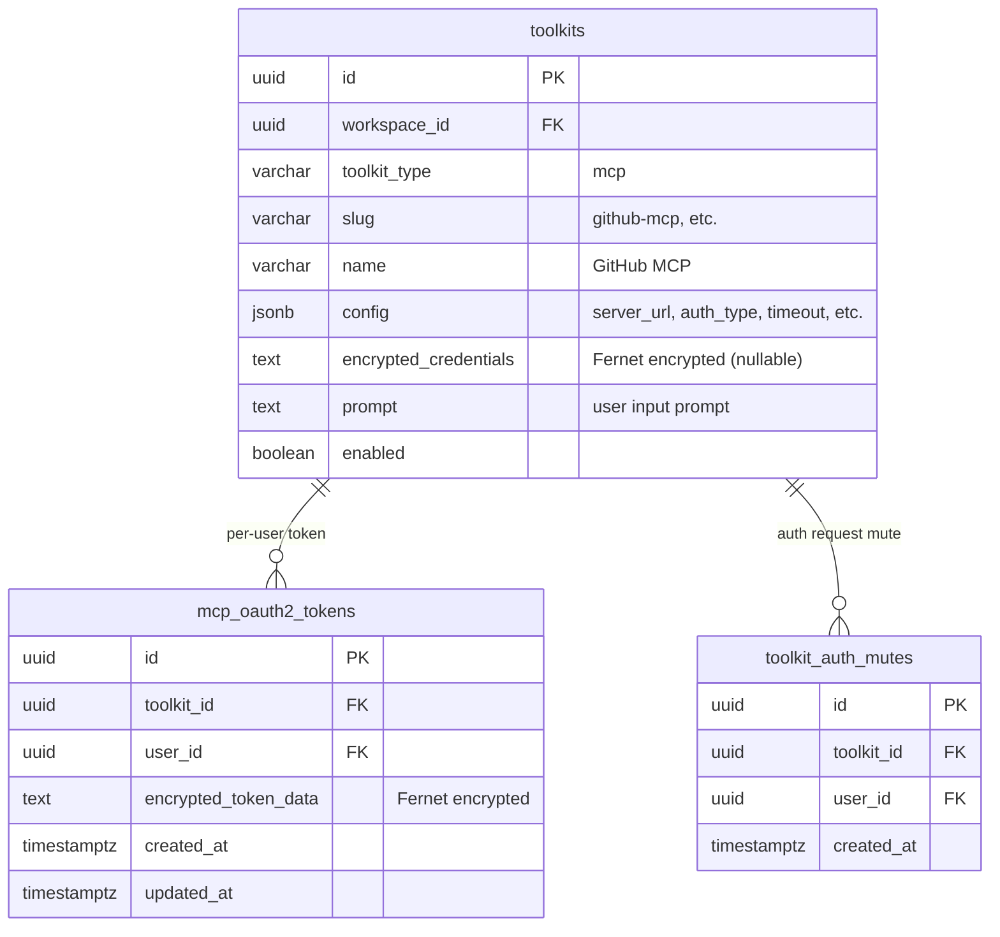
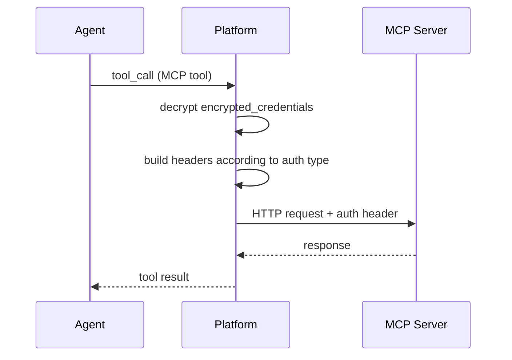
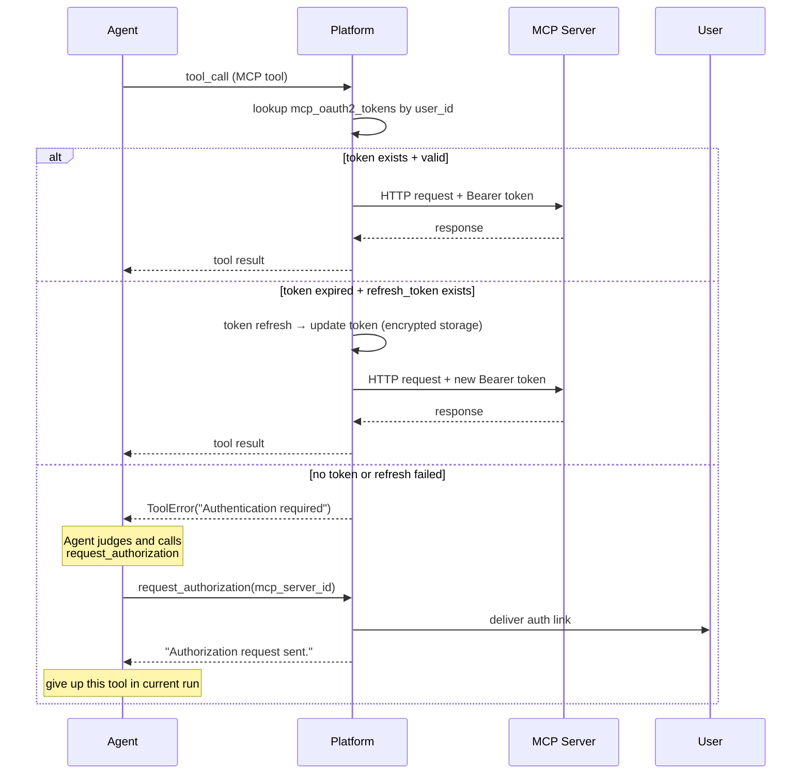

# MCP Toolkit Design

## Overview

Integrate MCP (Model Context Protocol) server as nointern Toolkit so agent can use tools from external MCP servers.

### Background

Current Toolkit system supports only **platform-implemented tools** such as Shell. Adding MCP Toolkit allows external MCP server tools to be connected to agents, enabling third-party services such as GitHub, Slack, Jira as Toolkits.

### Prerequisite: ToolkitProvider Interface Refactor

Current `ToolkitProvider` has tool list fixed at class level with `tool_names: ClassVar[list[str]]`. MCP Toolkit needs interface change because tool list must vary depending on config and context:

- each MCP server provides different tools
- per-user auth toolkit must not provide tools in system context (scheduled run, etc.)

## Dynamic Tool List

### ToolkitContext Extension

```python
@dataclasses.dataclass(frozen=True)
class ToolkitContext:
    session_id: str
    workspace_id: str | None
    user_id: str | None       # None means system context (scheduled run, etc.)
    publish_event: Callable[[EngineEvent], Awaitable[None]]
```

If `user_id` is `None`, it is a run without interactive user (scheduled prompt, etc.). Toolkit can decide whether to provide tools based on this value.

### Empty Tool List Handling Rule

If `create_tools()` returns empty list, completely exclude that toolkit **from system prompt as well**:

```python
# inside resolve_agent_tools()
tools = await definition.create_tools(validated_config, context)
if not tools:
    continue  # exclude from prompt too
```

This supports context-based dynamic tool list at **ToolkitProvider interface level** without MCP-specific logic. For example, if per-user auth MCP toolkit returns empty `[]` in system context, agent does not even know that toolkit exists.

## Authentication System

ToolkitConfig authentication has two categories: **Global / Per-user**.

### Global Auth

All users share same credential. **Usable in scheduled runs as well**.

| Type | Description | Secrets (encrypted) | Config (plaintext) |
|------|------|-----------------|-------------|
| `none` | public MCP server without auth | — | — |
| `api_key` | send API Key with custom header | `api_key` | `header_name` |
| `bearer` | `Authorization: Bearer` header | `token` | — |
| `oauth2_client_credentials` | Machine-to-machine, no user consent needed | `client_id`, `client_secret` | `token_url`, `scopes` |
| `oauth2_delegated` | one specific user OAuth-authenticates and token is shared by everyone | `client_id`, `client_secret` | `token_url`, `auth_url`, `scopes` |

`oauth2_delegated` is activated only after config creator (Manager/Owner) completes OAuth flow directly.

### Per-user Auth

Each user calls with their own token after individual OAuth consent.

| Type | Description | Secrets (encrypted) | Config (plaintext) |
|------|------|-----------------|-------------|
| `oauth2_per_user` | per-user OAuth token | `client_id`, `client_secret` | `token_url`, `auth_url`, `scopes` |

- **In system context (scheduled run, etc.), `create_tools()` returns empty `[]`** → not exposed to agent
- In interactive run, unauthenticated user is guided to authenticate with `request_authorization` tool

### Auth Type Model

Follows Secrets/Config discriminated union pattern of LLM Provider Integration:

```python
class McpAuthNone(BaseModel):
    type: Literal["none"] = "none"

class McpAuthApiKey(BaseModel):
    type: Literal["api_key"] = "api_key"
    api_key: str
    header_name: str = "X-API-Key"

class McpAuthBearer(BaseModel):
    type: Literal["bearer"] = "bearer"
    token: str

class McpAuthClientCredentials(BaseModel):
    type: Literal["oauth2_client_credentials"] = "oauth2_client_credentials"
    client_id: str
    client_secret: str
    token_url: str
    scopes: list[str] = []

class McpAuthDelegated(BaseModel):
    type: Literal["oauth2_delegated"] = "oauth2_delegated"
    client_id: str
    client_secret: str
    token_url: str
    auth_url: str
    scopes: list[str] = []

class McpAuthPerUser(BaseModel):
    type: Literal["oauth2_per_user"] = "oauth2_per_user"
    client_id: str
    client_secret: str
    token_url: str
    auth_url: str
    scopes: list[str] = []

McpAuth = (
    McpAuthNone | McpAuthApiKey | McpAuthBearer
    | McpAuthClientCredentials | McpAuthDelegated | McpAuthPerUser
)
```

## Data Model

### ERD



### Config vs Secrets Separation

Use `CredentialCipher` (Fernet) in same pattern as LLM Provider Integration:

| Storage location | Content | Example |
|-----------|------|------|
| `config` (JSONB, plaintext) | non-sensitive settings | `server_url`, `auth_type`, `timeout`, `token_url`, `scopes` |
| `encrypted_credentials` (TEXT, encrypted) | sensitive secrets | `api_key`, `token`, `client_secret` |

Toolkits without secret values such as Shell have `encrypted_credentials` as `NULL`.

### Per-user Token Storage

Store per-user OAuth tokens encrypted in `mcp_oauth2_tokens` table:

```python
class OAuthTokenData(BaseModel):
    """Structure stored in encrypted_token_data."""
    access_token: str
    refresh_token: str | None
    expires_at: datetime | None
    token_type: str = "Bearer"
```

- Unique constraint: `(toolkit_id, user_id)` — one token per toolkit per user
- When token expires, Platform auto-refreshes; if refresh fails, delete token

## Runtime Flow

### Global Auth



- `oauth2_client_credentials`: Platform obtains access_token from token endpoint (cached)
- `oauth2_delegated`: use stored access_token, refresh with refresh_token on expiration

### Per-user Auth



## `request_authorization` Tool

Tool for agent to request authentication from user when receiving 401 response from per-user auth MCP toolkit. It is **fire-and-forget**: only sends request and does not wait for authentication completion in that run.

### Tool Context Injection

LLM provides only `args`; Platform injects `context` at execution time:

```python
# schema seen by LLM
{ "name": "request_authorization", "parameters": { "mcp_server_id": "..." } }

# actual execution signature
async def handle_request_authorization(
    context: ToolContext,  # injected by Platform (run_id, user_id, etc.)
    args: RequestAuthArgs,  # provided by LLM
) -> str:
    ...
```

`context` is general-purpose structure usable not only by `request_authorization` but by all tools.

### Responses

| Situation | Response |
|------|------|
| delivered normally | `"Authorization request sent to the user."` |
| Rate limit | `"Authorization was already requested in this run. Please try again in the next run."` |
| Muted | `"The user has disabled authorization requests for this tool."` |

### Rate Limiting

Prevent duplicate auth requests for same user + same MCP server combination within same **run**.

- Platform detects duplicate by `context.run_id`.
- If combination was already requested in same run, return rate limit response.
- Can request again in next run.

### Mute Feature

User can turn off OAuth auth request notification for specific ToolkitConfig.

- Managed by `toolkit_auth_mutes` table.
- When `request_authorization` is called in muted state, return muted response.
- If agent receives muted response, it completely gives up using that tool.

### Auth Request Delivery

Platform delivers auth request to user **per interface**:

| Interface | Delivery method |
|-----------|----------|
| WebSocket chat | auth message bubble |
| Slack | auth link by DM |
| API | webhook or polling |

Platform publishes auth event, and each interface implements rendering.

## Comparison with LLM Provider Integration

MCP Toolkit auth structure extends existing LLM Provider Integration pattern:

| Item | LLM Integration | MCP Toolkit |
|------|----------------|-------------|
| Auth subject | Global only (workspace-level) | **Global + Per-user** |
| Secret storage | `encrypted_credentials` | `encrypted_credentials` (same) |
| Encryption | `CredentialCipher` (Fernet) | `CredentialCipher` (same) |
| Per-user token | none | `mcp_oauth2_tokens` table |
| System context | always usable | only Global usable, per-user excluded |

## References

- [MCP Authorization Spec (Draft)](https://modelcontextprotocol.io/specification/draft/basic/authorization) — OAuth 2.1 based MCP auth standard
- [Toolkit assignment design](../design/toolkit-260225-toolkit-assignment.md) — existing Toolkit 3-layer structure
- [LLM Provider Integration design](../design/llm-260221-llm-integration.md) — encryption pattern reference
