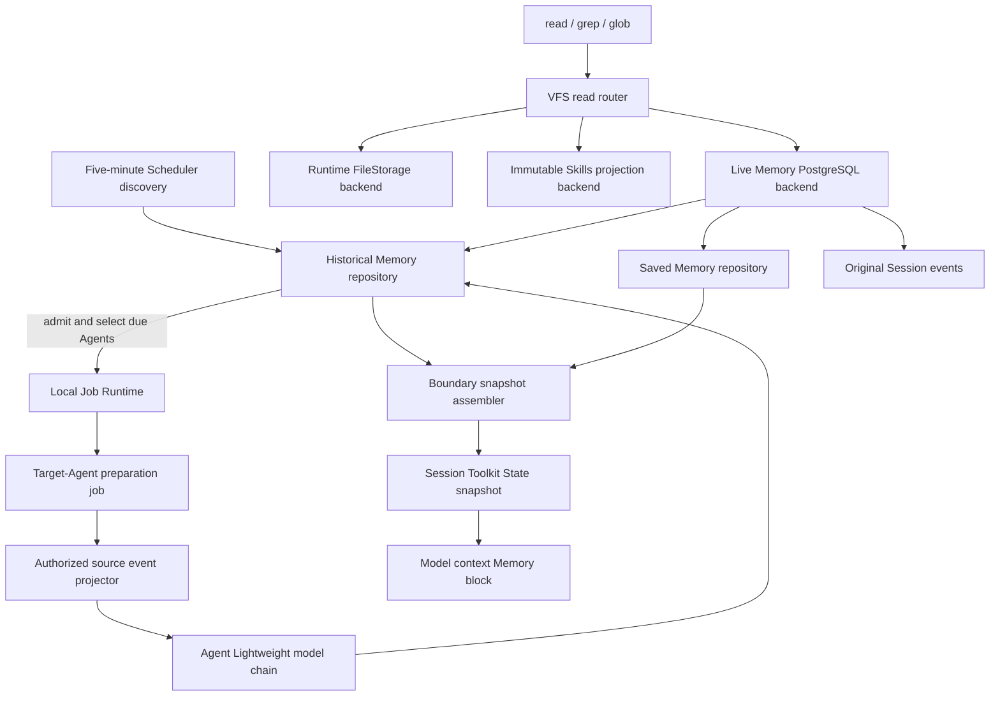

# Historical Session Context Design

- Snapshot: `memory-260930`
- Document reference: `memory-260930/DESIGN`
- Requirements: [`memory-260930/REQ`](../requirements/memory-260930-passive-session-context.md)
- Decisions: [`memory-260930/ADR`](../adr/memory-260930-passive-session-context.md)
- Mode: Collaborative
- Decision owner: requester

## Summary

Azents prepares bounded Historical Memory from recently active, now-idle root
Sessions and supplies selected source summaries beside independently managed
Saved Memory. Preparation runs asynchronously through the existing Scheduler,
Job Runtime, Lightweight model chain, and PostgreSQL. Each source keeps one
latest available summary plus minimal admission, success, and retry progress.

Automatic context is selected only at the first model context of a Session and
after successful compaction. A Session-owned snapshot preserves the selected
content across ordinary turns. Explicit current lookup uses a live read-only
`azents://memory` VFS mount through the generic `read`, `grep`, and `glob` tools.
The VFS router allows each mount backend to implement efficient native reads:
immutable Skills use the current AgentRun projection, while Memory queries
PostgreSQL and rechecks current source authority on every operation.

No Historical result automatically creates or changes Saved Memory. Original
Session evidence remains canonical. Historical Memory may be stale and is never
current authorization or proof.

## Current Behavior and Gaps

Current behavior is described by the Memory, Toolkit, Context Compaction,
Periodic Execution, and External Channel specs.

- Saved Memory is stored in `agent_memories`, projected dynamically on every
  model turn, and read through five Memory tools.
- Original authorized history is read separately through three Session-history
  tools. It is not a prepared summary store.
- Compaction advances `model_input_head_event_id` but retains original events.
  Its summary is an execution checkpoint, not Historical Memory.
- Current VFS is an immutable AgentRun projection containing release and Toolkit
  resources. It supports only the `skills` mount. Ordinary `read`, `grep`, and
  `glob` accept Runtime paths and do not resolve `azents://`.
- `read`, `grep`, and `glob` are owned by RuntimeToolkit and disappear when the
  complete Runtime capability is unavailable.
- `channel_action` participant replies are durable client-tool arguments. The
  current history search/page projection does not render them as Agent
  conversation.
- No source-summary record, rolling admission job, boundary snapshot, live
  Memory VFS backend, Historical settings inventory, or truthful Historical
  Memory model-operation kind exists.

The requested behavior cannot be produced by extending the current dynamic
Saved Memory prompt or by treating compaction summaries as another evidence
source. It requires new source-owned preparation state, snapshot state, model
operation attribution, semantic event projection, VFS routing, and read-only
settings surfaces.

## Requirement and Decision Traceability

| Requirement | Design mechanisms | ADR authority |
| --- | --- | --- |
| `REQ-1` | M1, M8, M10, M12, M14 | D3, D5, D11, D12-D14 |
| `REQ-2` | M1, M2, M8-M11, M14 | D1, D5, D12-D14 |
| `REQ-3` | M1-M3, M15 | D1, D6, D15 |
| `REQ-4` | M4-M7, M14 | D4, D7-D10 |
| `REQ-5` | M8 | D3, D11 |
| `REQ-6` | M2, M8-M11, M14-M15 | D2 withdrawal, D6, D11-D15 |
| `REQ-7` | M8, M11 | D3, D5, D11, D14 |
| `REQ-8` | M9-M12, M14 | D5, D9, D12-D14 |
| `REQ-9` | M13-M14 | D5, D14 |
| `REQ-10` | M2-M4, M8, M15 | D1, D4, D6, D10-D11 |

## Architecture



### Ownership

- **Historical Memory repository** owns source admission, latest available
  summary, completed-input markers, retry progress, and source-linked deletion.
- **Historical Memory discovery service** owns eligibility and bounded dispatch.
- **Historical Memory preparation service** owns event projection, model
  operation, strict output decoding, and atomic publication.
- **Memory snapshot service** owns deterministic selection and Session-bound
  snapshot persistence. It does not own source summaries.
- **VFS read router** owns location parsing, backend selection, common limits,
  result normalization, and execution-owner admission.
- **Memory VFS backend** owns Memory/source path semantics and current domain
  authorization. It creates no stored file copies.
- **Original Session events** remain source evidence.
- **Saved Memory repository and tools** retain independent write/delete
  semantics.

## Persistent Data

### Historical Memory source record

Add one `historical_memory_sources` table with one row per source root Session.
The row combines admitted preparation progress and the latest completed result;
there is no separate durable attempt or lease table.

| Column | Purpose |
| --- | --- |
| `source_session_id` | Primary key and FK to root `agent_sessions.id`, `ON DELETE CASCADE` |
| `admitted_at` | Durable proof that the source entered preparation while inside the rolling admission window |
| `last_attempt_at` | Most recent preparation start for observability and retry calculation |
| `next_retry_at` | Earliest rediscovery after failure; nullable when immediately due or completed |
| `failure_count` | Bounded consecutive failure count |
| `last_failure_code` | Safe typed failure category; no provider text |
| `model_operation_state` | Nullable serialized `ModelOperationSnapshot` for the Lightweight candidate chain |
| `completed_source_activity_at` | Latest activity timestamp represented by the last successful empty or non-empty preparation |
| `completed_source_tail_event_id` | Captured source tail represented by the completed result |
| `prepared_at` | Completion time; null means no successful preparation yet |
| `source_title_snapshot` | Source title at successful preparation |
| `summary` | Latest bounded Markdown summary; null with non-null `prepared_at` means successful no-useful-context result |
| `created_at`, `updated_at` | Durable row timestamps |

Constraints and indexes:

- primary/unique source identity on `source_session_id`;
- FK cascade makes purge remove dependent Historical Memory;
- check `prepared_at IS NOT NULL` when a completed source marker is present;
- check non-negative bounded `failure_count`;
- indexes for `next_retry_at`, admitted-but-unprepared rows, and prepared rows;
- discovery indexes continue to use `agent_sessions.last_activity_at`, status,
  Agent, Workspace, root kind, and active-Run predicates.

A completed empty result is distinct from failure because `prepared_at` and the
completed source markers are present while `summary` is null. A failed refresh
updates retry progress but preserves all latest completed-result columns.

The table does not duplicate Saved Memory rows, source ACLs, Session status,
associated User ownership, or current title. Those remain canonical in their
own domains.

### Boundary snapshot state

Store one typed Toolkit State value under namespace `memory` and state name
`context_snapshot` for each consuming Session.

```text
MemoryContextSnapshotState
  schema_version
  boundary_head_event_id?   # current model_input_head_event_id, null at initial boundary
  created_at
  saved_entries[]
    memory_id
    scope
    name
    type
    description_snapshot
    updated_at_snapshot
    vfs_path
  historical_entries[]
    source_session_id
    source_scope
    source_title_snapshot
    source_activity_through
    prepared_at
    summary_snapshot
    summary_vfs_path
    source_vfs_path
```

The snapshot stores rendered entry data, not only IDs, so Saved/Historical
updates elsewhere do not refresh ordinary turns. Before each model-context use,
current Memory enablement and entry/source availability are rechecked. Deleted
Saved entries and denied/archived/purged Historical sources are omitted without
selecting replacements. This is filtering, not reselection.

The boundary identity is the current `model_input_head_event_id`. Initial
Sessions use null. Ordinary appended events do not change it. Successful
compaction changes it; failed or stale compaction does not.

The engine invokes snapshot selection only with an explicit boundary signal:
the first model context before any completed model turn, or the first model
context after the head moves to a successful compaction summary. The selector
persists even an empty result. Ordinary turns only load/filter the state. A
missing, corrupt, or mismatched snapshot outside an explicit boundary
contributes no automatic Memory and is not reconstructed until the next
approved boundary.

## Rolling Admission and Discovery

Register `historical_memory_discovery` as a code-owned Scheduler task:

- interval: five minutes, completion-based;
- bounded-backoff task retry;
- short timeout covering discovery/admission/dispatch only;
- enabled in the final rollout phase.

The handler obtains a fresh aware UTC time inside the handler rather than
reusing a stale scheduler-round timestamp. It performs a bounded transaction:

1. select active root Sessions whose Agent has Memory enabled;
2. exclude Sessions with an ongoing Run;
3. for sources with no Historical row, require
   `now - 10 days <= last_activity_at <= now - 6 hours`;
4. for admitted rows, bypass the ten-day maximum and select work when no success
   exists, retry is due, or source activity is later than the completed marker;
5. verify Team/User root ownership and current Workspace membership;
6. insert missing admission rows with conflict-safe uniqueness;
7. group due source IDs by Agent and return a bounded set of Agent jobs;
8. commit before submitting background jobs.

After commit, submit registered Job Runtime handler
`historical_memory.prepare` with execution key `historical-memory:<agent_id>`.
The discovery handler does not await model work. The closed Job Runtime registry
adds this handler with no rerun-on-coalesce. An active same-Agent job coalesces;
later discovery finds remaining due work.

A configurable process-local Historical Memory admission semaphore is strictly
smaller than the application Job Runtime concurrency, reserving at least one
slot for non-memory work. Each Agent job claims no durable attempt lease and
processes a bounded source batch. Cross-process duplicates and restart reruns
remain allowed by D6.

## Source Preparation

### Source boundary

For one attempt, capture the current last non-reverted source event ID and source
activity timestamp before loading evidence. Only permitted events at or before
that tail are candidates. Later events do not invalidate or discard the result;
they make the source eligible for a later refresh after six hours.

Compaction marker and generated compaction-summary events are excluded from raw
Historical evidence. Original events remain available after compaction. Hidden
instructions, reasoning, native artifacts, bytes, reverted events, and denied
content are excluded.

### Conversational tool registry

Add one immutable declarative registry of durable final client-tool names.
Each entry declares:

- participant-visible text JSON paths;
- speaker role;
- input conditions such as `mode != ignore`;
- optional structured work-state paths;
- result correlation by call ID;
- result status selectors and mappings.

The registry is consumed by both Historical extraction and Memory VFS source
search/read. The generic projector has no tool-name branch. Adding a compatible
future conversational tool adds one data entry. Historical names remain
registered after tool removal while stored events may still exist.

For `channel_action`, `message` is Agent conversation, title/task fields are
scoped work-state evidence, and the reply outcome distinguishes delivered,
failed, or unknown delivery. Malformed legacy arguments fall back to bounded
ordinary tool evidence and never invent a message.

### Codex-style bounded evidence selection

Map eligible evidence into ordered tiers:

1. human-authored user, action, and external invocation conversation;
2. visible Agent conversation, including registered tool-mediated utterances;
3. other-Agent or harness context that is permitted and useful;
4. ordinary tool calls/results.

Allocate 70 percent of the selected Lightweight candidate's effective context
window to source evidence. Within each tier select newest evidence first under
row/tool/total bounds, then restore selected evidence to source chronological
order. Insert one omission marker per omitted interval. The database projector
may page by tier and event ID; it must not load an unbounded transcript merely
to discard it.

Use the Compaction-readable label style but a Historical-specific allowlist and
prompt. Plaintext-custom tool input remains omitted. Tool result text has a
strict per-row bound. Transport fragmentation may split the prepared input into
multiple request items but remains one model operation.

### Model operation and prompt

Add `ModelOperationKind.HISTORICAL_MEMORY` and model-stream call kind
`historical_memory`. Build/freeze the Agent's current Lightweight option and
candidate chain in the source row. Use existing integration credential
resolution, health/cooldown observation, watchdog, quota handling, and candidate
advancement. No Main-chain fallback or model-facing tools are enabled.

The system prompt is the requester-reviewed Codex V2 adaptation. It asks for a
bounded, self-contained historical account that prioritizes user requests,
corrections, decisions, constraints, chronology, evidence status, failures,
unfinished work, and safe retrieval clues without converting task-scoped
requests into global preferences. Source text is untrusted data. Saved Memory
is never mutated.

The strict output schema is:

```json
{"summary": "string"}
```

An empty string is successful no-useful-context. Source identity, title,
boundary, scope, and preparation time are service-owned. Enforce a 9,000-byte
UTF-8 summary guard, matching the inspected Codex V2 source-summary guard;
oversized output is deterministically truncated at a valid UTF-8 boundary with
a visible truncation note. Structured-output incompatibility advances or fails
through the existing candidate policy; it does not switch to an unstructured
contract.

### Atomic publication

The provider call executes with no open database transaction. Publication uses
one short transaction that:

- locks the source record and source root;
- rechecks source existence, active status, Agent/Workspace ownership, Memory
  enablement, and associated-User validity;
- writes the completed source markers, title snapshot, prepared time, and
  summary/empty result together;
- resets failure/retry and terminal model-operation progress.

Source content changes do not reject publication. A duplicate late attempt may
replace a more recently prepared result with an older historical boundary, as
accepted by D6. Archive/access loss prevents new availability; publication may
be discarded when current source authority is unavailable. Purge cascades.

## Deterministic Context Snapshot

### Selection

Candidate Saved entries come from currently permitted Saved Memory summaries.
Candidate Historical entries join prepared non-empty source rows to currently
active/authorized sources.

- New Session: Historical order by source activity descending, preparation time
  descending, source Session ID.
- Post-compaction: lexical relevance between the current compaction checkpoint
  and source title + summary, then the same recency/tie-break order.
- Pack only complete Historical blocks within a 10,000-byte Historical budget.
- Present selected Historical blocks by source activity ascending.
- Preserve the existing Saved index-first representation under a separate
  bounded Saved section.

Byte-identical normalized Historical summary bodies may be rendered once with
all contributing source metadata. Semantically similar but non-identical text is
not merged. This provides deterministic repeated-context condensation without
inventing reconciliation or dropping source references.

The first implementation uses distinct whitespace terms, case-insensitive
all-term matches before partial matched-term count, then recency. No embedding,
importance model, usage feedback, or hidden ongoing-work classification exists.

### Rendering

Render the accepted D11 Memory guidance and explicit
`HISTORICAL MEMORY BEGINS/ENDS` data boundary. Every Saved index entry and
Historical source block includes its exact live VFS path. Historical blocks also
include source scope, Session ID, source activity boundary, preparation time,
and source VFS path.

Current user instructions and verified current evidence take precedence.
Repeated text is not independent corroboration. Exact wording/evidence should be
read through the live VFS only when it can materially change the answer.

The snapshot provider replaces the current per-turn Saved Memory dynamic query.
It still renders on every context assembly, but it reads and filters the stored
boundary snapshot rather than selecting current memories each turn.

## Pluggable VFS Read Architecture

### Router and backend registry

Add a DI-owned `VfsReadBackendRegistry` keyed by canonical mount. Duplicate mount
registration is fatal at composition. VFS mount support is determined by this
registry instead of one static `AZENTS_VFS_SUPPORTED_MOUNTS` allowlist.

The router accepts a server-created `VfsReadContext` containing current Run,
concrete/root Session, Agent, Workspace, associated User, owner generation, and
Memory enablement. It validates execution ownership, parses one of:

- exact file URI for text read/transfer;
- directory/file URI for grep;
- separately validated VFS glob pattern.

A backend declares `read_text`, `grep`, `glob`, and optional `transfer_read`
capabilities. Unsupported operations fail explicitly. The router never
materializes an entire backend as fallback.

Common result contracts reuse `TextReadResult` and `GrepResult` and introduce a
sorted canonical-URI `VfsGlobResult`. Generic tool limits and deadlines are
upper bounds. Backends may stop earlier and must return truncation reasons.

### Generic read tools independent of Runtime

Create one auto-bound readable-storage Toolkit that owns `read`, `grep`, and
`glob` regardless of Runtime availability. Remove those three names from
RuntimeToolkit.

The handlers route:

- absolute POSIX path: lazy Runtime FileStorage adapter; requires current
  Runtime filesystem capability and otherwise returns the existing capability
  error;
- canonical `azents://`: VFS router; backend authority applies independently;
- other input: invalid location.

Runtime `write`, `delete`, `edit`, patch, process, import destination, and shell
behavior remains Runtime-owned. `import_file` can later use optional
`transfer_read`; Skills retains its current transfer authority, while Memory
need not support transfer.

### Backends

- **Skills backend:** loads the immutable current AgentRun projection, resolves
  exact entries, and performs bounded in-memory grep/glob over the at-most-8-MiB
  projection. Existing projection hashes and source revisions remain unchanged.
- **Memory backend:** queries PostgreSQL and renders virtual text lazily. Every
  operation rechecks Memory enablement, root authorization, source status, and
  access. It never copies the full corpus into AgentRun VFS state.
- **Runtime adapter:** preserves existing FileStorage behavior for absolute
  paths and is not an `azents://` mount.

## Memory VFS Namespace

```text
azents://memory/README.md
azents://memory/saved/agent/<memory-id>.md
azents://memory/saved/user/<memory-id>.md
azents://memory/historical/team/<source-session-id>/summary.md
azents://memory/historical/user/<source-session-id>/summary.md
azents://memory/sources/team/<session-id>/session.md
azents://memory/sources/team/<session-id>/events/<event-id>.md
azents://memory/sources/team/<session-id>/tool-results/<event-id>.txt
azents://memory/sources/user/<session-id>/session.md
azents://memory/sources/user/<session-id>/events/<event-id>.md
azents://memory/sources/user/<session-id>/tool-results/<event-id>.txt
```

There are no required directory index files. README explains the namespace and
glob/grep patterns. Paths use database IDs; labels and arbitrary names stay in
file content.

### Read rendering

Saved files contain safe frontmatter, description, and full content. Historical
files contain source metadata, complete available summary, and exact source
path. Session files contain safe metadata, optional summary path, and latest
visible event path. Event files contain bounded semantic text, provenance,
delivery status where applicable, and previous/next visible event paths.

Tool-result files return bounded persisted textual output only. They exclude
inputs, native artifacts, references, attachment/file bytes, and hidden
metadata. Broad grep never searches tool-result bodies.

### Glob and grep

Memory glob translates path grammar to indexed ID queries and returns sorted
canonical URIs without rendering bodies.

Memory grep behavior by prefix:

- `saved`: name, description, content;
- `historical`: current source title and available summary;
- `sources/.../events`: visible user/Agent/action/external-channel and
  registered conversational-tool text;
- `tool-results`: unsupported for broad grep.

Compile the common regex at the tool boundary. The backend may extract safe
literal candidates for SQL prefiltering, page bounded rows, render canonical
lines, and apply the common regex in application code. Patterns without useful
prefilters remain bounded by visited-row/byte/time limits. No query performs an
unbounded full-table scan.

Unavailable or denied paths return one non-enumerating unavailable result.
Archive removes Historical/source paths from the next operation; restore may
make retained rows visible; purge removes them permanently.

## Model-Facing Tool Surface

Final Memory-gated domain tools:

- `save_memory`: Saved Memory upsert only;
- `delete_memory`: Saved Memory delete only.

Generic tools provide all reads:

- `read`;
- `grep`;
- `glob`.

Remove model exposure and implementation factories for:

- `list_memories`;
- `get_memory`;
- `search_memories`;
- `search_sessions`;
- `read_session_history`;
- `read_session_tool_result`.

No compatibility aliases remain. The Memory prompt directs the model to selected
exact paths, `azents://memory/README.md`, and narrow glob/grep roots. Memory
disablement removes automatic Memory context and denies the Memory mount, while
generic tools can still serve other authorized locations.

## Public API and Settings UI

Keep existing Saved Memory CRUD routes and generated clients unchanged except
for shared UI composition.

Add read-only paginated routes under the existing Agent Memory resource:

```text
GET /agent/v1/workspaces/{handle}/agents/{agent_id}/historical-memories
GET /agent/v1/workspaces/{handle}/agents/{agent_id}/historical-memories/{source_session_id}
```

The list supports exact source scope (`team` or `user`), optional lexical query,
and opaque cursor. It returns source ID/title, source activity boundary,
preparation time, bounded summary, and current source link. The detail returns
the complete bounded summary and source link. Every request rechecks Agent
visibility, associated User scope, source active/access status, and settings
inspection authority. Memory disablement does not hide retained settings data;
it disables Agent preparation, automatic context, and the model-facing Memory
VFS mount. Private or unavailable records return the same non-enumerating
not-found behavior as current Memory APIs.

Extend the existing Agent Memory settings page with Saved and Historical kinds.
Historical is read-only, grouped by Team and the current User's personal
conversations, searchable, and linked to original conversation. It has no edit
or delete actions, no separate toggle, badge, notification, or per-answer usage
claim.

Regenerate public OpenAPI clients after route/schema changes.

## Security and Privacy

- Preparation, publication, snapshot use, VFS operations, and UI/API reads each
  reauthorize independently.
- Team execution never infers personal scope from sender/requester provenance.
  User scope derives only from the root Session's associated User and current
  Workspace membership.
- Subagents receive root-bounded VFS context and cannot widen it through paths.
- VFS path parsing prevents traversal, backslashes, percent-encoded aliases,
  user info, ports, queries, fragments, and unregistered mounts.
- IDs are exposed only after the owning backend authorizes the path or listing.
- Historical summaries and source events treat stored text as data. They do not
  execute embedded instructions.
- Secrets and access-bearing URL values are redacted before model summary
  persistence. Broad source grep excludes tool-result bodies.
- Source archive/access loss denies new context and VFS reads immediately.
  Restore can re-enable retained context; purge cascades dependent rows.
- Saved Memory remains independently owned and is never automatically mutated.

## Failure, Retry, and Recovery

- Discovery failure follows Scheduler bounded backoff and admits no partial job
  population outside committed rows.
- Job Runtime rejection or restart leaves admitted rows due for later discovery.
- No durable running state exists; cross-process duplicate calls are possible.
- Model/provider failures retain the prior summary, store safe failure progress,
  and set bounded exponential `next_retry_at`.
- Candidate quota/cooldown advances through the persisted Lightweight operation.
  Chain exhaustion delays the next refresh; it never falls back to Main.
- Invalid/oversized output is failure or bounded guarded output according to the
  strict contract; it never becomes Saved Memory.
- Successful summary and completed source marker publish atomically. Successful
  empty output prevents repeated work for unchanged source content.
- Snapshot selection/render failure contributes no automatic memory and does not
  block conversation. A corrupt snapshot is treated as absent at the approved
  boundary; ordinary turns do not silently reselect.
- VFS backend failures are ordinary bounded tool errors and do not mutate
  snapshot or source state.
- Redis availability/persistence is not required for correctness.

## Observability

Add structured metrics/logs without summary or source text:

- discovery scanned, newly admitted, due, dispatched, deferred, denied;
- preparation started, succeeded, empty, failed, timed out, duplicate/coalesced;
- source input event/byte/token estimates and omission counts by tier;
- summary bytes and truncation;
- provider/candidate/usage metadata under `historical_memory` operation kind;
- retry delay/failure category;
- snapshot candidate, selected, filtered, byte counts and boundary kind;
- VFS operation mount/backend/operation, duration, visited rows/files/bytes,
  matches, truncation reason, unavailable/denied outcome;
- settings API list/detail counts and latency.

Never log summary text, raw event text, Saved content, tool-result text, secrets,
or provider credentials.

## Migration, Rollout, and Rollback

### Migration

1. Generate an Alembic revision for `historical_memory_sources`, indexes,
   constraints, and enum/state storage as applicable.
2. Update `db-schemas/rdb/revision`.
3. Create no historical backfill rows in the migration. The rolling scanner owns
   admission after enablement.
4. Add the new ModelOperation kind and compatible serialization changes.

### Delivery phases

1. **Persistence and disabled services:** schema, repositories, semantic event
   projector/registry, model operation, and tests. Scheduler task remains disabled.
2. **VFS platform:** backend protocol/registry, URI grammar, Skills adapter,
   readable-storage Toolkit, Runtime adapter, and conformance tests.
3. **Memory behavior:** live Memory backend, preparation, snapshot, prompt, VFS
   files, settings API/UI, and deterministic model fixtures.
4. **Cutover:** remove six read/history tools and old per-turn Saved Memory
   selection, enable five-minute discovery, update Specs/OpenAPI clients, and run
   E2E/scale validation.

Intermediate branches are not final compatibility modes. The final product has
one read path through generic VFS tools and no aliases.

### Rollback

- Disable the discovery task to stop new preparation.
- Existing source rows and Saved Memory remain intact.
- Disable Memory use through the existing Agent setting for affected Agents.
- A code rollback can restore prior read tools because the migration is additive;
  no destructive data conversion is required.
- Do not delete prepared summaries during operational rollback. Purge remains
  source-lifecycle-owned.

## Test Strategy

### E2E primary matrix

| Scenario | Expected evidence |
| --- | --- |
| Team source inside six-hour-to-ten-day window | Background summary becomes available; new Session receives source block and exact VFS paths |
| Source newer than six hours / older than ten days | No first admission |
| Admitted work ages past ten days | Retry can complete; summary remains usable afterward |
| Old source receives new activity | Qualifies after a new six-hour idle period |
| User Session privacy | Associated User sees permitted Team + own personal paths; Team and another User cannot read personal paths |
| Ordinary turn after new summary elsewhere | Existing snapshot remains unchanged; live VFS lookup sees current permitted data |
| Successful compaction | New boundary snapshot selected using lexical relevance; failed compaction does not refresh |
| Archive / restore / purge | Next VFS/context use denies, restores retained record, or permanently removes record respectively |
| Memory disabled / re-enabled | No preparation/context/mount while disabled; re-enable admits only current rolling window |
| Summary provider failure | Conversation proceeds; prior summary remains; retry progress visible in state/metrics |
| Conversational tool projection | `channel_action.message` appears as Agent conversation with delivery status in summary and source VFS grep/read |
| Runtime unavailable | VFS read/grep/glob still operate; absolute Runtime paths return capability error |
| Tool-result sensitivity | Broad grep excludes body; exact authorized tool-result path reads bounded text |
| Saved Memory independence | Historical preparation does not create/update/delete Saved rows; save/delete tools still work |
| Settings UI | Read-only Historical list/search/detail and source link; no edit/delete or extra toggle |

### E2E plan and fixtures

Use deterministic testenv model responses for Historical summary JSON and
foreground continuation. Seed root Sessions, source events, activity timestamps,
Agent model chains, Team/User membership, archive state, and tool call/result
pairs directly through supported fixtures. Use scheduler/manual test trigger and
a bounded wait on authoritative database/job state, never fixed sleeps.

The fixture model must support:

- valid non-empty and empty summary responses;
- malformed/oversized response;
- provider failure and candidate fallback;
- a summary that distinguishes user correction, Agent proposal, result evidence,
  unfinished work, and channel delivery uncertainty.

Capture final evidence as API responses, model-input snapshot text, VFS tool
results, database state, and structured job/metric observations. All required
CI journeys use local deterministic providers. Live provider tests are optional,
fail only when explicitly enabled, and never gate correctness covered by the
fixture path.

### Focused automated coverage

- repository eligibility, admission, retry, cascade, and atomic publication;
- scheduler task definition and actual-time query boundary;
- Job Runtime handler registration/coalescing/restart rediscovery;
- evidence tiering, omissions, D9 registry, redaction, strict output decoding;
- snapshot identity, empty state, filtering without reselection, compaction
  boundary change;
- VFS URI/file/directory/glob validation and backend conformance;
- Memory backend scope, lifecycle, regex bounds, adjacent events, and tool result;
- generic tool Runtime/VFS routing and Runtime-independent exposure;
- removal/catalog snapshot tests for obsolete tools;
- Public API authorization and generated client consistency;
- frontend Saved/Historical rendering and read-only actions.

### Scale and reliability validation

Run one-time report-style load validation for:

- discovery across representative Session/Agent counts;
- bounded Memory grep with common literal, regex-only, and no-match patterns;
- source event adjacency lookup and large tool-result exact reads;
- snapshot selection with many summaries and Team/User competition;
- background concurrency proving at least one non-memory Job Runtime slot remains.

Preserve environment, query plans, commands, limits, results, and reproduction
steps in a validation report.

## Feasibility Assessment

| Area | Status | Evidence and condition |
| --- | --- | --- |
| Source eligibility and lifecycle | Feasible | `agent_sessions` has root kind, status, last activity, archive/purge, Agent/Workspace/User ownership; active Run queries exist. Add indexed repository query. |
| Periodic discovery | Feasible | Code-owned Scheduler and five-minute task patterns already exist. Handler must use fresh actual time. |
| Background execution and recovery | Feasible with accepted duplicate risk | Closed LocalJobRuntime registry, execution-key coalescing, deadlines and task-local DI exist. Add one handler and source progress; restart reruns rather than resumes. |
| Lightweight model chain | Feasible | Session-title repository/service demonstrates frozen Lightweight chain, candidate health, credentials, watchdog, and quota advancement. Add truthful operation kind and source-owned state. |
| Source evidence | Feasible | Original non-reverted events remain after compaction; repositories support Session/event paging. New projector/queries are required for tier-efficient selection. |
| Conversational tool reconstruction | Feasible | Durable client calls contain final name/arguments/call ID and results. Declarative registry can correlate them. Historical legacy schemas require fallback tests. |
| Boundary snapshot | Feasible | Typed Session Toolkit State and `model_input_head_event_id` provide durable boundary identity and optimistic replacement. |
| VFS router and Skills backend | Feasible | Canonical URI/projection/service exist. Requires broadening from exact immutable resolution to registered read backends without changing projection semantics. |
| Runtime-independent generic reads | Conditional | Current tools are RuntimeToolkit-owned and disabled without complete Runtime capability. The readable-storage Toolkit refactor must avoid duplicate names and preserve Runtime guards. |
| Live Memory VFS | Feasible | Saved/session repositories and authority resolvers exist. Requires new backend queries, path grammar, result normalization, and exact source checks. |
| Memory grep performance | Conditional | Existing lexical Session search is bounded but no general Memory VFS regex index exists. Candidate prefilter, hard limits, query-plan/load evidence, and possibly new indexes are required. |
| Public settings | Feasible | Existing Memory API/UI tabs and Session links exist. Add read-only routes, generated clients, and UI panels. |
| Summary quality | Conditional | Codex prompts are evidence, not Azents quality proof. Representative correction/continuation fixtures and model evaluation must meet acceptance scenarios. |
| Privacy and purge | Feasible | Existing root authority, membership checks, archive status, and purge lifecycle exist. FK cascade and per-operation backend checks must be verified E2E. |

No confirmed Requirement or ADR is blocked. Conditional items affect performance,
quality, and refactor evidence; they have credible bounded implementation and
verification plans without introducing a new material choice.

## Alternatives and Non-Blocking Risks

- A dynamic per-turn Memory query was rejected because it violates boundary
  snapshots.
- Compaction summaries were rejected as the sole source because they optimize
  current execution state and may omit meaningful history.
- A dedicated Historical Memory model setting was rejected in favor of the
  existing Lightweight label.
- A separate cross-Session integration model was rejected by D3.
- Multi-pass source summarization was rejected in favor of Codex-style bounded
  single-call selection; old evidence may be omitted.
- Dedicated Memory/history read tools were rejected in favor of live VFS reads.
- The current summary and snapshot budgets may require adjustment after quality
  and load validation. Such adjustment is non-material while the accepted
  bounded/whole-block behavior remains.
- PostgreSQL-backed regex over large histories is the principal performance
  risk. Hard bounds and candidate prefiltering are mandatory.
- Late duplicate publication can move a summary boundary backward. This is an
  accepted stale-history risk; access controls still apply.

## Design Authority

- Design revision: `1`

| ID | Material design mechanism | Authority | Classification |
| --- | --- | --- | --- |
| M1 | Rolling six-hour-to-ten-day first admission with age-free admitted retry and result retention | `memory-260930/REQ-3`, ADR-D15 | `required` |
| M2 | One source-owned PostgreSQL row for latest result and minimal progress, no attempt ledger | `REQ-4`, `REQ-6`, `REQ-10`, ADR-D6 | `decided` |
| M3 | Five-minute discovery dispatching bounded target-Agent LocalJobRuntime work | `REQ-3`, `REQ-10`, ADR-D1, ADR-D6 | `decided` |
| M4 | Truthful Historical Memory operation on the Agent Lightweight chain | `REQ-3`, `REQ-4`, `REQ-10`, ADR-D4 | `decided` |
| M5 | Historical-specific source projector using Compaction-readable text and Codex-style 70% single-call tier selection | `REQ-4`, ADR-D7, ADR-D8 | `decided` |
| M6 | Declarative durable-name conversational-tool registry shared by extraction and source VFS | `REQ-4`, `REQ-8`, ADR-D9 | `decided` |
| M7 | Strict one-field summary output with service-owned source metadata | `REQ-4`, ADR-D10 | `decided` |
| M8 | Session Toolkit State boundary snapshot with deterministic selection and whole source blocks | `REQ-5`, `REQ-7`, `REQ-10`, ADR-D3, ADR-D5, ADR-D11 | `decided` |
| M9 | Registered pluggable VFS read backends with backend-native bounded operations | `REQ-8`, ADR-D12, ADR-D13 | `decided` |
| M10 | Live read-only `azents://memory` tree for Saved, Historical, source events, and exact tool results | `REQ-2`, `REQ-6`, `REQ-8`, ADR-D14 | `decided` |
| M11 | Runtime-independent generic read/grep/glob Toolkit with capability-gated Runtime path branch | `REQ-8`, ADR-D12, ADR-D13 | `derived` |
| M12 | Remove six dedicated read/history tools; retain Saved save/delete only | `REQ-1`, `REQ-8`, ADR-D5, ADR-D12, ADR-D14 | `decided` |
| M13 | Read-only Historical settings API/UI within existing Memory settings | `REQ-9` | `required` |
| M14 | Independent authorization/lifecycle filtering at preparation, snapshot, VFS, and UI boundaries | `REQ-1`, `REQ-2`, `REQ-6`, `REQ-8`, `REQ-9` | `required` |
| M15 | Failed refresh retains prior result and recovers through persisted retry progress and periodic rediscovery | `REQ-6`, `REQ-10`, ADR-D6 | `decided` |

## Authority Audit

### Requirement to mechanism

Every Requirement maps to at least one mechanism in the traceability table.
Privacy, lifecycle, failure continuity, source content, model context, live
lookup, and settings inspection each have separate enforcement points rather
than relying on one trusted earlier check.

### Mechanism to authority

Every material mechanism in the Design Authority table cites confirmed
Requirements, accepted ADRs, or unchanged current Specs. The following are local
implementation details rather than new authority: Python module boundaries,
class names, exact retry constants, precise SQL/index syntax, Markdown cosmetic
wording, fixture names, and metric names.

### Removal authority

Removal of dedicated read/history tools is explicitly authorized by ADR-D12 and
ADR-D14 after VFS replacement verification. Dynamic per-turn selection is
replaced by `REQ-7` boundary snapshots and ADR-D11. No Saved mutation, original
history, Session lifecycle, or public Saved CRUD authority is removed.

### Remaining decisions

No unresolved product question or material architecture choice remains in this
revision. Numerical tuning and equivalent local structures remain Design/QA work
within accepted bounds.

## Removal and Replacement

| Existing unit or behavior | Removal authority | Replacement or remaining authority | Removal boundary | Absence verification |
| --- | --- | --- | --- | --- |
| `list_memories`, `get_memory`, `search_memories` factories/exposure | ADR-D12, ADR-D14 | Generic VFS `glob`/`grep`/`read`; Saved write/delete remain | Final cutover after VFS E2E | Tool catalog snapshot and repository grep find no exposed factories/names |
| `search_sessions`, `read_session_history`, `read_session_tool_result` exposure | ADR-D12, ADR-D14 | Memory VFS source/session/event/tool-result tree | Final cutover after source VFS E2E | Tool catalog absence tests and spec search |
| Per-turn `collect_memory_prompt` current Saved query | `REQ-7`, ADR-D5, ADR-D11 | Session-bound boundary snapshot renderer | Memory context cutover | Ordinary-turn test proves no reselection; code search removes dynamic selection call from prompt path |
| RuntimeToolkit ownership of `read`, `grep`, `glob` | ADR-D13 | Runtime-independent readable-storage Toolkit with Runtime adapter | VFS platform phase | Catalog has one instance of each name with Runtime unavailable/available |
| Static read routing via `AZENTS_VFS_SUPPORTED_MOUNTS` | ADR-D12-D13 | Registered mount backend registry | VFS platform phase | No read resolver depends on static supported-mount set; exact Skills tests pass |
| Skills-only exact VFS read service as generic read path | ADR-D12-D13 | Skills VFS backend adapter; existing projection authority remains | VFS platform phase | Import/Skill/VFS tests pass and projection schema unchanged |
| Memory settings Saved-only content area | `REQ-9` | Saved + read-only Historical kinds in same settings surface | Frontend/API phase | UI E2E shows Historical tab and no mutation controls |
| Current Memory Spec tool list and dynamic prompt behavior | Full snapshot | Updated current Specs after implementation | Spec-sync phase | `/spec-review` and Living Spec validation |
| Existing Saved Memory table/API CRUD | None | Retained unchanged as Saved Memory authority | N/A | Existing API/tool tests remain green |
| Original Session event/history storage | None | Retained as source evidence | N/A | Source VFS reads canonical existing events; no copy/backfill table |

## Design Approval

- Mode: `Collaborative`
- Decision owner: requester
- Approved on: 2026-10-01
- Approved Design revision: `1`
- Approved authority IDs: `M1`, `M2`, `M3`, `M4`, `M5`, `M6`, `M7`, `M8`, `M9`, `M10`, `M11`, `M12`, `M13`, `M14`, `M15`
- Approved scope: rolling source admission and background preparation; Codex-grounded source extraction; deterministic Session-bound snapshots; pluggable VFS read backends; live Memory VFS; Saved-only mutation tools; read-only Historical settings; lifecycle, recovery, migration, rollout, removal, and verification mechanisms in revision 1.
