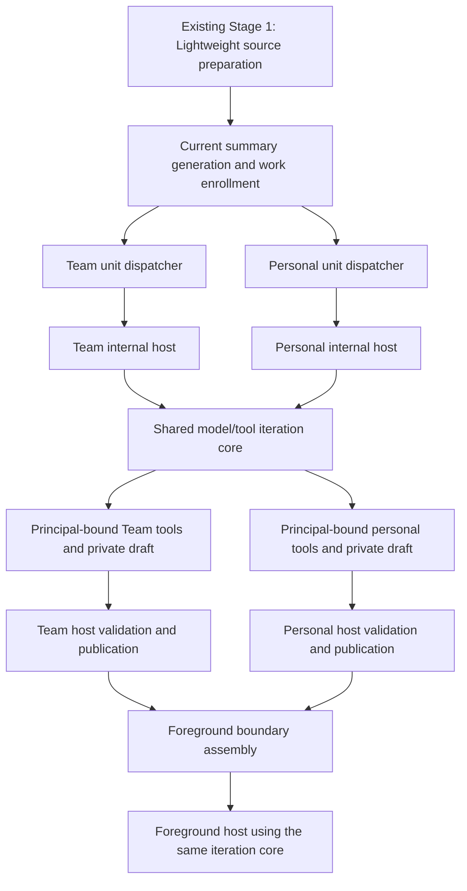

# Agentic Historical Memory and Shared Execution Design

## Status and Scope

- Design revision: **2**.
- Product authority: [memory-261002/REQ](../requirements/memory-261002-consolidated-history.md).
- Decision history: [memory-261002/ADR](../adr/memory-261002-consolidated-history.md), including requester decisions D1–D8 and directly reviewed technical completion decisions D9–D13.
- Effective workflow: direct primary-Agent completion; final Design approval belongs to the requester. Earlier subagent decision-owner assignment is corrected in the ADR and supplies no approval authority.
- This document consolidates the effective contract. Earlier alternatives and numeric recommendations in the [supporting exploration](../notes/consolidated-historical-memory-redesign-2026-10-02.md) are not implementation authority.
- No implementation, migration execution, rollout, performance proof or requester Design approval is claimed.

The feature retains source-specific preparation, then adds a genuine Agent-controlled consolidation loop. Team and personal consolidators are mutually isolated model executions. Each authors its own compact Markdown overview within an independent 10,000-UTF-8-byte rendered allowance. Only the ordinary foreground host composes permitted finished overviews; it performs no further semantic reconciliation.

## Current System and Evidence Baseline

The worktree baseline is `f42dc1f262239bf04fdc741125cc37968f5101e6`. Refreshed `origin/main` was `602b1720e4cc707d4326113273fa7349b7bbbd0b`; inspected memory, execution, VFS and relevant E2E paths had no material delta. Implementation must nevertheless use refreshed account/workspace operation interfaces rather than restore older service-owned transactions.

| Current surface | Verified behavior and design consequence |
|---|---|
| `engine/events/execution.py` | Model preparation, adapters, normalization and tool execution are injected, but the request, barriers and repository operations are foreground-specific. Extract a shared core rather than copy it. |
| `engine/events/types.py` | Public event envelopes require a Session identity. Internal transient messages must not pretend to be persisted Session events. |
| `services/historical_memory/preparation.py` and `repos/historical_memory/preparation.py` | Stage 1 already uses Lightweight, quota-only candidate advancement and bounded retry. Preserve it. |
| `repos/historical_memory/__init__.py` | Source publication reauthorizes and locks source/Session/Agent/membership; personal foreground candidates deliberately include Team OR own User. Consolidation needs a stricter query. |
| `rdb/models/historical_memory.py` | Current summaries are mutable; source rows cascade with Session deletion. Add source-version identity and retain dependency identity independently. |
| `core/historical_memory_snapshot.py` | The old snapshot contains per-source bodies and accepts `schema_version >= 1`; it is not a future-schema dispatcher. Replace its shape explicitly. |
| `services/historical_memory/context_snapshot.py` and `engine/tools/builtin.py` | Root Run start and committed compaction are distinct refresh hooks; ordinary turns filter current access without refreshing. Preserve those boundaries. |
| `services/vfs_read.py` | Canonical registry, capability checks and authority-before-I/O already exist. The optional transfer protocol is a precedent for separate mutation protocols. Context is still Session-bound. |
| `engine/tools/readable_storage.py` | Generic VFS reads can avoid Runtime startup. Mutation tools are still registered through the Runtime provider. |
| `job_runtime/local.py` | Coalescing and task ownership are process-local. PostgreSQL must own cross-process consolidation state. |
| `testenv/azents/e2e/src/tests/required/public/test_historical_memory.py` | Deterministic Runtime-free Memory E2E exists; extend its proxy with actual internal tool sequences. Existing coverage does not prove consolidation. |

### Codex Comparison

Reference evidence is pinned to Codex `14a477ea89712071944244022e8a10142845456e`, not claimed as the latest release. Its ephemeral consolidation Agent edits files; its host waits for completion, shuts down the Agent, validates artifacts and checks job ownership. It retains workspace files across attempts, uses a DB lease and selects a bounded ranked source set. Its single summary is byte-bounded at write time and independently token-truncated at read time. It also has explicit V1/V2 dual-write and sibling artifact stores.

Azents retains the useful shared-loop, ephemeral-execution, file-editing and host-validation pattern, but deliberately differs: both stages use Lightweight; generation is strictly single-scope; work progresses through finite resumable passes; drafts/publication are separate database states; denial suppresses the whole affected aggregate; foreground documents are not truncated; cutover is coordinated rather than dual-mode. Codex is evidence, not product authority.

## Design Authority

- Design revision: `2`.
- Classification uses only confirmed Requirements, the effective ADR decisions, retained Specs and project transaction/privacy constraints.

| ID | Material mechanism | Authority | Classification |
|---|---|---|---|
| M1 | One execution-neutral iteration core with distinct foreground/internal hosts and foreground parity | REQ-8; ADR-D1 | decided |
| M2 | Ephemeral internal conversation and exact-unit model/tool context isolation | REQ-1/REQ-3/REQ-7; ADR-D2/D3/D8 isolation clarification | required |
| M3 | Current-summary generation/hash, complete evidence receipts and metadata work enrollment | REQ-4; ADR-D10/D12/D13 | decided |
| M4 | Runtime-independent routing with separate optional mutation and atomic-patch interfaces | ADR-D4 and its interface acceptance | decided |
| M5 | Private draft revisions, frozen observed preconditions and idempotent transactional mutations | ADR-D4/D7/D11 | decided |
| M6 | Host-owned validation and atomic aggregate/dependency/progress publication | REQ-1/REQ-6; ADR-D4/D10/D12 | decided |
| M7 | Lightweight model route, existing quota progression and truthful operational usage | ADR-D5 | decided |
| M8 | Finite work-ID passes, exact dispositions and recoverable unpublished progress | ADR-D7 coverage/work reuse; ADR-D12 | decided |
| M9 | Per-unit PostgreSQL lease, cancellation and stale-writer fencing | ADR-D7 ownership | decided |
| M10 | Whole-affected-unit denial and clean regeneration without contaminated work | REQ-3/REQ-4; ADR-D6 | decided |
| M11 | Approved operational limits, productive continuation, failure backoff and fenced cleanup | ADR-D7 operational envelope | decided |
| M12 | Independent 10,000-byte documents, up to 20,000-byte authorized foreground composition and unchanged refresh boundaries | REQ-2/REQ-3/REQ-5; ADR-D8 | decided |
| M13 | Live read-only authorized aggregate lookup, separate from boundary selection and private drafts | REQ-2/REQ-7; ADR-D8; current Memory Spec | derived |
| M14 | Additive storage, coordinated old/new handover, snapshot replacement and explicit rollback | REQ-5/REQ-6/REQ-7/REQ-8; ADR-D9/D10 | decided |
| M15 | Revocation continuity across source restore, grant recreation and old-code rollback | REQ-3/REQ-4; ADR-D6/D13 | decided |

Equivalent class names, file layout, exact helper signatures, internal locator spelling and fixture names are local details. A new persistent mode, authority source, fallback, retention rule or output transformation is not a local detail.

## Requirement Traceability

| Requirement | Mechanisms and observable acceptance |
|---|---|
| REQ-1 semantic integration | M1/M2/M4–M6: the model chooses evidence reads, edits a draft over multiple turns, receives tool feedback and completes for host validation. No one-shot replacement. |
| REQ-2 compact knowledge and routes | M6/M12/M13: complete authored context plus exact meaningful source routes, independent per-unit byte validation and authorized detail lookup. |
| REQ-3 isolation | M2/M3/M9/M10/M12/M15: distinct model inputs, exact-scope queries and principals; only foreground composition sees both permitted units. |
| REQ-4 lifecycle/correction | M3/M8/M10/M15: versioned changes remain pending; denial and its continuity exclude dependent content before new use; current instructions/evidence retain precedence. |
| REQ-5 refresh boundaries | M12/M14: root Run start and successful compaction reconstruct independently; ordinary turns do not reselect. |
| REQ-6 nonblocking/failure | M6–M11/M14: background execution, no foreground generation wait, truthful failed/pending states and safe absence of a result. |
| REQ-7 Saved/source preservation | M2/M10/M13/M14: unchanged Saved mutation, source inventory and original-history authority; no automatic promotion or destructive backfill. |
| REQ-8 shared execution | M1/M7/M14: ordinary conversation first runs through the generalized core with existing transactions, ordering, cancellation and recovery. |

## Architecture and Ownership

The shared box denotes reusable code, not shared conversation state. There is no Team-to-personal evidence or draft edge. A unit key is `(workspace, agent, scope, associated_user)` with no User for Team and exactly one durable User for personal scope. Database constraints enforce valid key shapes and one logical unit per key.

### Execution hosts

The common core owns the model/tool iteration algorithm, provider response normalization, call/result matching, cancellation propagation and bounded-turn control. It consumes execution-neutral messages, an opaque logical execution identity and explicit host operations; it must not manufacture Session IDs to satisfy existing public event types.

The foreground host retains durable AgentRun/Session state, mailbox/TurnAction admission, provider-output transaction groups, event persistence before live delivery, interruption, compaction, terminal effects and provider-continuation behavior. Existing repository operation boundaries remain authoritative. Refactor the live foreground path onto the common core before connecting consolidation; do not retain a copied production loop.

The internal host owns one attempt and RAM-only messages. It exposes no public channel, subagent, shell, Runtime, Skill, Saved mutation, raw SQL or generic original-transcript tools. Its telemetry carries job/unit/Agent/Workspace identity and no invented public Run/Session. The closed catalog contains only scoped inventory/search/read and draft file operations; optional patch is gated separately by backend and model wire support.

A normal internal final response is a termination signal, not a publication payload. The host quiesces tools/model activity and validates the authoritative draft. Invalid output fails the attempt. Safe failure metadata may help a later fresh attempt; the finished conversation is not reopened.

### Model-visible isolation

Internal input consists of an invariant consolidation task, its own 10,000-byte document allowance, one scoped inventory/change view, its own still-authorized previous aggregate or draft, and scoped tool schemas. Neither prompt describes a peer consolidator or a combined budget. Never inject the ordinary foreground Memory prompt/README, Agent Saved Memory, another unit's artifacts or the parent conversation.

Personal consolidation queries match personal scope and associated User exactly. They must not reuse the existing personal foreground candidate predicate that ORs in Team history. Search snippets, inventory titles, validation errors, model hints and retry metadata follow the same boundary. Shared scheduling/health infrastructure is not model-visible peer work state.

## Persistence and Transaction Boundaries

Names below are logical records; equivalent normalized table names are implementation-owned.

| Record | Owned state and key constraints |
|---|---|
| Current source summary | Existing source identity/body plus monotonically advancing summary generation and deterministic evidence hash; update summary and rendered-evidence metadata atomically. Separate monotonic evidence-availability generation records denial continuity. Empty/unprepared states remain distinguishable. |
| Consolidation unit | Exact scope key, current published revision pointer, owner generation/token and lease, retry/eligibility metadata, active pass/draft references. |
| Source-work enrollment | Body-free scope key, source ID, content generation/hash, availability/grant identity, sequence, change/removal kind and processing state; idempotent unique enrollment for the full evidence/change identity. No ownership-row-locking FK/trigger on insert. |
| Pass/progress | Finite upper work sequence, current slice identity and exact draft-considered/disposition work IDs. It never means all IDs below a scalar watermark are complete. |
| Draft and files | One current recoverable draft per unit, aggregate revision, canonical paths, UTF-8 file bytes and non-reused file revisions, complete influencing dependency set. |
| Attempt | Owner binding, model-operation candidate state, absolute deadline and counters, terminal reason, bounded safe failure category. No durable model/tool conversation. |
| Evidence receipt | Attempt and source identity/content generation/hash/availability generation, plus applicable grant identity, exposed to the model; includes metadata/snippets and inherited dependencies, with no duplicate summary-body archive. |
| Mutation receipt | Attempt/tool-call ID, exact-byte-significant canonical request digest and safe result metadata/revision; no replaced plaintext or raw transcript. |
| Published revision | Authored document, canonical rendered block/size, scope/provenance, complete independent dependency manifest and coverage linkage. Retain revisions while referenced by a valid boundary; do not create an unbounded user-facing history archive. |

Dependency source identity must survive a source-row cascade for as long as an aggregate/draft refers to it. Do not cascade-delete the evidence of dependency. Missing source identity is denial. Whole-unit/Agent deletion may remove the entire owning aggregate/work graph; deleting a single source must never turn a previously dependent result into a valid dependency-free result.

Use separate partial uniqueness constraints for Team and personal unit keys so a nullable Team User field cannot admit duplicates. Draft path uniqueness and attempt/tool-call receipt uniqueness are database-enforced, not only application checks.

### Source publication and enrollment

Keep Stage 1's existing admission, preparation, authorization and model behavior. Its completed repository transaction also advances generation/hash and inserts scoped change enrollment, including empty-summary updates. The evidence hash covers the exact summary and metadata that the internal summary renderer can expose, rather than volatile unrelated operational fields. Backfill current prepared rows deterministically; it does not rerun model extraction or create old-body revisions.

Enrollment inserts do not acquire the consolidation ownership row while holding source/Agent locks. A dispatcher separately ensures the unit exists and claims due work. Archive/purge/eligibility changes enqueue body-free reconsideration where applicable; access denial never waits for that notification. Idempotent periodic reconciliation recovers missed events and rollback intervals.

### Repository discipline

All model/provider/tool external I/O occurs after database operations close. Publication and draft operations own their transactions. Use consistent stable source/Session/Agent/membership authority ordering before the unit's final mutation fence; heartbeat touches only its unit. Never hold unit ownership and then invert the established source-publication authority order.

Full-manifest validation uses indexed joins/anti-joins and stable ordered authority checks, not one unbounded Python body load. Tool pages do not cap dependency cardinality. The operation must have a deadline and fail closed on timeout/conflict; it cannot drop dependencies to make progress. Large-manifest query time and lock footprint are explicit implementation QA gates, not assumed constant-time operations. No additional epoch authority or distributed transaction coordinator is introduced by this Design.

## Source Evidence and Finite Coverage

A source generation is a version of current evidence, not a retained historical file. Work enrollment captures `(source_id, generation, hash)`. Before supplying it, the repository rechecks exact unit authority and current generation. A mismatch marks that enrollment superseded/unconsumed only after the current generation is safely pending. A body is never fabricated from stale metadata.

Every evidence-producing operation records complete model-visible dependencies before delivery: initial inventory metadata, grep snippets, summary reads and prior aggregate dependencies. A subsequent draft mutation atomically attaches the union that could have influenced it. Visible Markdown citations are not the dependency manifest. After restart, inherit only dependencies belonging to recovered work; unused prior transcript/evidence is not replayed.

A generation change after a legitimate read does not invalidate authorized older evidence by itself. It remains pending follow-up under relaxed freshness. Archive/purge/scope denial invokes whole-unit invalidation regardless of generation or queue state.

Availability continuity is independent of content freshness. Dependency receipts capture a source's monotonic availability generation and applicable durable membership grant identity. Source-level denial increments availability generation transactionally; restore never resets it. Changed/recreated membership invalidates the old grant. A current access check cannot revive old work after an intervening denial.

Restore enrollment includes the new availability/grant identity even when content generation/hash did not change. It must not collide with an already completed pre-denial enrollment. A lifecycle loss and its evidence-generation update commit together; asynchronous notification is only a scheduling aid.

### Pass and slice algorithm

1. Discover still-pending scoped work and claim the unit without waiting in a foreground Run.
2. Reauthorize recovered work; otherwise start from the latest authorized published revision or a clean empty draft.
3. Capture a finite upper work-sequence bound for the pass. List at most 50 pending entries per page within it, with stable ordering.
4. Let the Agent choose needed reads/searches and edit its own document. Maintain exact work dispositions as private domain metadata. A received page, a read, an omission and semantic incorporation are distinct.
5. A normally completed slice may publish useful partial consolidation together with its exact validated dispositions. Undisposed items stay pending. Hard deadline/quota/budget interruption saves permitted work but cannot publish.
6. Continue remaining pass work through bounded scheduling; new generations/arrivals remain pending for later passes. Do not restart at the newest entries on every arrival.
7. At completion, discover pending work again independently of the prior cursor. A database sequence is not commit order: a lower-sequence row committed late must still be found.

Dispositions are tied to exact source versions and a draft revision. A host may validate that work was presented/explicitly omitted and that routes are legitimate; it does not claim to prove semantic truth. Draft-only dispositions become published coverage only with successful host publication. Expiring/discarding the supporting unpublished draft resets dependent work to pending.

Bound journal operations and active references; coalesce safely obsolete unconsumed generations and sweep terminal rows after durable progress no longer depends on them. This is not an infinite event history, a fixed corpus-size cap or exactly-once model execution. Independent dependency manifests remain valid after work-row cleanup.

## VFS and File Tool Contract

### Interfaces and registration

Retain the read backend contract. Add a separate optional mutation protocol and a separate optional atomic-patch protocol, following the existing optional transfer interface pattern. A read-only backend is complete without mutation members, abstract obligations or `NotImplementedError` stubs. A single-file writable backend remains complete without a patch stub.

Registration validates that declared capabilities correspond to real interfaces. Router capability/authority rejection occurs before backend I/O. The public read-only Memory/Skills backends do not become writable. Internal bindings expose only a scoped summary surface and private draft surface; URI possession grants nothing.

Use the existing canonical parser and reject unsupported schemes, noncanonical forms, traversal and cross-domain targets. Route VFS before resolving Runtime. Absolute Runtime paths retain their capability-gated adapter and existing failure semantics; an unsupported VFS operation never falls back to Runtime. Register each generic tool name once.

`read`, `grep`, `glob`, `write`, `edit` and `delete` are the ordinary interface. `apply_patch` is exposed only when both the bound backend and the selected model's compatible wire profile support it. Lack of optional V4A support does not disqualify a candidate that can use the required ordinary tools. Update tool descriptions and both patch wire dialects to describe actual VFS versus Runtime semantics.

### Internal principal

Use a discriminated server-owned job principal containing exact unit identity, attempt and owner generation/token. Foreground Session authority remains a separate binding. Do not widen existing nullable Session context fields or fabricate Run/Session IDs. For writes, recheck the lease/current owner and exact unit inside the repository transaction; router admission alone is insufficient.

### Observed revisions and mutation receipts

Revision-aware draft reads establish an execution-local observation ledger; partial reads must consistently identify their file version. If concurrent/chunked reads span versions, invalidate the ambiguous observation and require a fresh read instead of claiming a coherent view. Successful current mutations update the observation; a new attempt starts without old read observations.

Freeze expected versions/existence at tool-call admission. Parallel siblings use their pre-dispatch observation snapshot. Do not let an earlier sibling silently refresh the preconditions of a later one.

- `write(overwrite=false)`: atomic create-if-absent.
- Existing-target overwrite: explicit intent and matching observed revision; a stale observed file that disappeared cannot silently become a create.
- `edit`: nonempty exact match; one occurrence unless replace-all; match, replace and commit atomically.
- `delete`: exact file only, observed revision required; no recursive mount deletion.
- Recreate: a fresh never-reused file revision prevents delete/recreate ABA.
- Patch: resolve every target inside the same authorized draft domain, capture all existing-target preconditions, validate every hunk first, and commit files/versions/dependencies/receipt all-or-none. Mixed Runtime/VFS, cross-mount or cross-draft requests fail before writing.

Receipts are keyed by attempt/tool-call ID and canonical request digest preserving exact text bytes. Same identity/digest replays safe original result metadata; changed digest under the same ID fails. Reauthorize before replay. A replay identifies the originally committed revision and does not claim it remains current or roll back the read ledger. Result loss therefore cannot duplicate a mutation; a fresh attempt rereads current work rather than replaying an old conversation.

A write transaction joins the file change, revised dependency union, draft/file versions and bounded receipt. Failed applicability or revision conflict changes nothing. Runtime patch retains its existing separately documented partial commit behavior; database atomicity is not promised across backends.

## Host Completion and Atomic Publication

The Agent has no publication-submission tool. File-tool errors are ordinary loop feedback; final host-validation errors fail the attempt and may be summarized as safe metadata for a later fresh attempt.

After normal completion:

1. Quiesce the internal execution and outstanding tools. Freeze the authoritative draft revision; final assistant prose is not an alternative payload.
2. Validate required document sections, UTF-8/body/file bounds, meaningful source routes and canonical source identities. Empty useful output produces no fabricated historical account.
3. Check the complete influencing dependency set, current source scope/lifecycle, Agent/Workspace/associated-User authority and Memory-enabled state. Current absence/denial fails closed. Version drift alone leaves newer work pending.
4. In one repository-owned transaction, recheck frozen draft/version and current lease, write the new immutable published revision and manifest, atomically switch the unit pointer and record exact successful work dispositions/progress. No provider call occurs in this transaction.
5. Acknowledge success only after commit. On an uncertain result, inspect the authoritative attempt/revision outcome; do not repeat publication or claim success from local text.

A timeout, exhausted hard budget, cancellation, lost owner, validation failure or missing dependency cannot become success because a file exists. The previous authorized published result remains usable during ordinary failure. A D6-invalidated result remains unusable even if rebuilding repeatedly fails.

The designated overview is a UTF-8 Markdown file with two required semantic sections: historical context and source routes. The implementation may choose equivalent stable English heading names; it must validate every declared route as a canonical permitted summary locator plus a nonempty description. It must also reject forged managed locators elsewhere in the document rather than validating only well-formed bullets. Other draft files are private working material and are not automatically concatenated into output.

A valid empty-content result atomically publishes an empty overview outcome and its exact dispositions, replacing any previous current overview without inventing filler text. Existing still-authorized frozen foreground snapshots retain ordinary boundary semantics; later boundaries/live reads observe the empty outcome. Empty outcome is not inferred from a failed attempt or a truncated result.

Publication formats and canonical route validation cannot prove every natural-language claim is correct. Keep generated history marked as source-dependent data; test correction/uncertainty behavior and preserve current instruction precedence.

## Model Route, Ownership and Recovery

Both stages resolve the Agent's existing Lightweight chain. Reuse provider credential/transport, model metadata, health and usage semantics; no new consolidation model selector, Main fallback or one-shot degradation is introduced.

Recognized quota/billing failure records current candidate health and permits advancing within the same chain. Other provider errors/timeouts fail work for later retry. Unsupported required tools are explicit capability failure, not synthetic quota. Freeze candidate admission/profile coherently for an attempt; an advanced candidate starts through normal scoped work recovery, never provider-specific continuation from another model.

Use the shared loop's provider usage/cost evidence and estimator provenance. Stage 2 operational attribution identifies its Agent/Workspace/unit/attempt, not an arbitrary source Session or fabricated foreground Run. Missing usage is unknown. Do not persist prompts/results to make a cost log or add a billing UI.

### Lease lifecycle

A short PostgreSQL claim selects one current owner per unit. Duplicate triggers preserve pending work instead of creating speculative model attempts. Lease renewal is independent of model latency. Every mutation and publication is owner-fenced, including receipt replay.

On lost/unconfirmed ownership, stop admitting new work and request cancellation. Late provider/tool responses remain unable to commit even if physical cancellation fails. After expiry, a new owner reauthorizes the retained draft, scope, dependencies and source deltas before starting a new RAM-only execution. Neither Redis nor process-local task dictionaries establish this authority.

### Operational defaults

| Control | Initial approved value and semantics |
|---|---|
| Attempt | Absolute ten minutes; at most 32 dispatched model requests and 96 dispatched tool calls. |
| Token budget | Cumulative 250,000 input / 16,000 output, including repeated context; preflight estimates/reservations plus available actual usage. No fabricated zero for missing usage or exact billing ceiling claim. |
| Input window | Checkpoint/stop before the next request exceeds 70% of the resolved input window; apply provider output limits. |
| Tool results | 50 inventory rows per page; 12,000 UTF-8 bytes per text-result body with explicit continuation. |
| Draft payload | One current draft, at most 16 files and 256 KiB UTF-8 file content; body-free metadata is separately normalized. |
| Lease | 120 seconds, renewed every 30 seconds, database time and commit fencing. |
| Process capacity | Preparation default 12, consolidation default 2, combined Memory maximum 14 of 16 local slots. Validate configured combinations together. |
| Discovery | Five-minute recovery cadence; event-driven coalesced admission may start sooner. |
| Retry | One-minute exponential failure backoff capped at six hours. Due eligibility is not a promise of execution exactly at that time. |
| Progress | Productive completed slices yield/requeue without failure delay. Three no-progress slices/attempts produce backoff and an operational warning. |
| Ineligible work | Wait for authorization/Memory eligibility instead of repeated model calls. |
| Cleanup | Recoverable draft eligible after 24 hours without meaningful progress; superseded/terminal private payloads eligible immediately for periodic fenced cleanup. |

Per-process concurrency is not a deployment-wide spend ceiling. Do not add an undisclosed configuration surface; reuse existing configuration ownership and update default/cross-limit validation. The deployment must account for all worker replicas during capacity QA.

Token estimates may differ from billed usage. Stop new requests when admitted budgets are exhausted; request/tool/time limits remain enforceable even where usage is incomplete. Do not publish on a hard cutoff. A changed file version alone is not unlimited-progress evidence: repeated identical states/reads must not defeat no-progress accounting.

Count actual model-request dispatches, including retries, at the internal provider dispatch boundary rather than only counting successful loop turns. Integration QA must observe the proxy's request journal to prove that transport retries cannot bypass the reserved request budget. Foreground retry behavior remains unchanged; a provider adapter that cannot honor the internal admission contract must fail explicitly rather than silently exceed it.

### Cleanup consistency

Protect active current-owner work. Remove completed attempt receipts/private payloads once no recovery reference requires them. Inactive draft expiry invalidates draft-dependent unpublished dispositions and resumes from a valid published checkpoint/pending sources. It must not erase the only dependency proving that a published aggregate used a deleted source.

Source/aggregate denial is immediate for use; physical cleanup may wait for the sweeper or outage recovery. Twenty-four hours is cleanup eligibility, not a deletion-time guarantee during downtime. Source inventory and Saved records are not deleted by draft cleanup. Published revisions remain only while needed by the current unit or retained automatic snapshots and their dependency checks; cleanup never makes a referenced snapshot silently point to different bytes.

## Privacy, Invalidation and Foreground Context

Before each new internal model request, check every consumed/inherited dependency. Denial invalidates the working state; abandon its conversation/draft as future model input and rebuild from currently authorized summaries. Do not remove a link and keep prose that may contain the source. Already admitted/in-flight model input cannot be recalled; enforcement applies at the next admission and before any publication.

Before each foreground automatic use and explicit aggregate read, apply current authority/dependency checks. Remove the entire affected Team or personal aggregate. Do not select a replacement during an ordinary turn; only an approved refresh boundary can admit newer text. Independent authorized units and Saved Memory remain available.

Archive followed by restore between reads still requires a clean rebuild: compare availability-generation/grant identity, not only the present archived flag or membership existence. Wire the generation change into `AgentSessionRepository.archive_tree`/direct archive and corresponding automatic lifecycle paths; bind grant loss to membership operations. Purge absence remains a fail-closed fallback. Restore/eligibility-gain enrolls fresh work without making earlier manifests valid. The test matrix must cover each producer, including fast revoke/restore with no intervening reader.

### Canonical unit envelope

Each consolidator receives only its own 10,000-UTF-8-byte contract. Publication uses one canonical self-contained envelope: authored historical Markdown plus server-owned scope, provenance and data-boundary guidance. Its entire automatic-context footprint, including allocated separators/framing, is at most 10,000 bytes. The Agent's body limit is the remaining space after its own framing; it is unrelated to peer presence or length.

Foreground composition concatenates up to two validated self-contained blocks without unbudgeted outer framing, yielding at most 20,000 Historical bytes. Team-only/single-unit use remains at most 10,000. No lending, peer-budget hints, scope weighting, alternative large/small variants, runtime truncation or topic-based item packing. Saved budgeting stays separate.

### Snapshot replacement

Use an explicit new snapshot kind/version containing root boundary head, creation time, unchanged Saved index data and up to two aggregate revision references with their exact validated rendered blocks and provenance. Do not use `schema_version >= 1` to reinterpret old source-summary payloads.

At root Run preparation, select current authorized published revisions. After successful committed compaction, independently reconstruct the continuing Run's next input using the same selection service. Preserve existing CAS, unchanged-visible-content reuse and root-to-child inheritance. Other iterations use the selected bytes while filtering access loss.

Snapshot filtering must have complete dependency evidence for its selected revision even after the unit publishes something newer. Do not authorize old snapshot bytes using only the new unit pointer's manifest. Source changes without denial do not refresh text mid-turn.

Existing provider-continuation/request fingerprinting must recognize a changed Memory prefix and perform the supported replay/reset path. No cached previous response or hidden server-side context may bypass removal of denied automatic Memory. This is a required regression check of the common host, not a new provider transport.

## Read APIs and Surface Changes

No public aggregate CRUD, new settings screen or Memory toggle is added. Existing source settings, Saved mutations and original-history authorization stay intact. Internal jobs use separate closed tool bindings and repository operations, not public API impersonation.

Add read-only aggregate locations to the ordinary Memory VFS, for example:

- `azents://memory/consolidated/team/summary.md`
- `azents://memory/consolidated/user/summary.md`

The personal alias binds to the current foreground associated User; a supplied path cannot choose another User. Root authority, Memory enablement, Agent/Workspace membership and complete aggregate dependencies are rechecked. Missing/denied results remain non-enumerating. Authorized glob/grep can discover/search current published material within existing bounds, but never drafts, receipts or invalidated bytes. No transfer/import support is added for Memory.

Explicit reads return the latest currently authorized published document and provenance. They may be newer than the automatic boundary snapshot and do not silently replace it. Detail beyond the compact overview comes from existing authorized source summaries, not a hidden larger version of the aggregate. A missing aggregate does not trigger synchronous generation or source-packing fallback.

## Migration, Rollout and Rollback

### Forward handover

1. Prepare additive tables/columns/indexes and bounded idempotent source-generation/work backfill. Preserve canonical summaries, Saved Memory and source history. Follow the repository's current linear migration conventions.
2. Coordinate affected old execution admission, not only the scheduler. Drain old work or use normal durable owner-fenced handoff; verify old readers/writers cannot resume against the new automatic-state contract.
3. Apply the explicit automatic snapshot reset/new-kind cutover in bounded batches, under the quiesced handover. Canonical Saved rows remain; reselect their index through normal preparation.
4. Activate the new coherent application version. Interrupted Runs keep IDs/history/status and resume through ordinary root preparation before a newly lowered model request; children retain root inheritance. Do not fabricate terminal events or erase conversation history.
5. Seed/discover units from already prepared currently authorized exact-scope summaries. Do not wait for the old Stage 1 six-hour admission rule again and do not rerun extraction just for the feature.
6. Until aggregates exist, omit Historical overviews while conversation, Saved and source lookup continue. Allow bounded normal backfill/progress; verify ownership, usage, privacy and E2E before declaring rollout complete.

This does not add a hidden mixed-version reader, shadow activation setting or dual-write mode. Pause duration and safety must be rehearsed; zero downtime is not promised. Source and account authority transactions use the refreshed main-branch ownership interfaces.

### Explicit rollback

Quiesce and fence new workers, stop new attempt admission, reset new automatic snapshots and restore the tested previous application version. Rebuild its normal snapshots from retained canonical data at the ordinary preparation boundary. Keep additive consolidation tables inert; do not destructively downgrade or treat rollback as an in-process fallback.

Old code does not maintain new source generations/outbox state. Before reactivation, bounded reconciliation must revalidate/hash current summaries, advance/invalidate incompatible identity/work state and re-enroll changes. Retained generation values alone cannot prove no source changed while old code was running.

Because old code also cannot prove availability continuity, reactivation invalidates retained new consolidation revisions/drafts and their unpublished progress even if current body hashes match. Rebuild from currently authorized canonical summaries and reset new automatic snapshots; do not reuse an aggregate that could have crossed an unobserved revoke/restore interval.

## Removal and Replacement

| Existing behavior/surface | Authority | Replacement or retained authority | Boundary and absence verification |
|---|---|---|---|
| Independently foreground-coupled model/tool loop | REQ-8; D1 | One common core with foreground host retaining its operations | Land parity refactor first; search for a second production inference loop or fake internal Session. |
| Automatic whole-source summary ranking/dedup/packing | REQ-1/REQ-2; D8 | Complete compact unit documents | Remove `_select_historical_entries` usage on automatic path and topic ranking for new aggregates; retain source inventory reads. |
| Old Historical snapshot entry shape and candidate cap | D8/D9 | Exact new aggregate snapshot kind and selected-revision dependency checks | Coordinated reset, explicit decoder and new fixtures; no old-body compatibility interpretation. |
| Runtime-exclusive registration of generic mutation names | D4 | Shared routing with separate Runtime/VFS adapters | Verify exactly one tool per name, VFS without Runtime and unchanged absolute-path behavior. |
| Read-backend mutation placeholders | Explicit D4 interface rule | Optional mutation/patch protocols | Read-only test backend has no mutation members; no throwing stubs. |
| Prior preparation concurrency default 15 | D7 operational approval | Default 12, consolidation 2, combined cap 14 | Config validation/default tests and deployment-value audit. |
| Obsolete source-packing tests/fixtures and current Spec text | D8/D9 | New aggregate/scope/refesh tests and same-PR Living Spec updates | Search old automatic-body assertions, update deterministic proxy; do not rewrite historical implemented snapshots. |
| Supporting proposal's explicit submit/Main/entry packing/shared 10k alternatives | D4/D5/D8 | This Design and effective ADR decisions | Proposal remains historical exploration with an explicit supersession notice. |

Retain Stage 1's `engine/events/historical_memory_projection.py`, source preparation/inventory/settings, Saved CRUD, original-source VFS, immutable Skills projections/import and public foreground events. They are not collateral removal targets. No generated public API client change is currently required because no public route/schema is added; if implementation changes one, regenerate it through the normal workflow rather than assume exemption.

## Test Strategy

### E2E-first matrix

Extend `test_historical_preparation_snapshot_runtime_free_vfs_and_lifecycle` and its deterministic proxy in `testenv/azents/e2e/src/support/image_generation_openai_proxy.py`. Add an explicit phase/unit-aware script that performs multiple model/tool rounds, reads summaries, edits files and returns normal completion. It must not merely return prewritten final JSON.

| Scenario | Required observable evidence |
|---|---|
| Shared-loop foreground parity | Existing streaming, persistence-before-delivery, cancellation, compaction and terminal recovery remain unchanged. |
| Independent Team and personal generation | Separate sentinel corpora, captured full model inputs/tool schemas/results and no peer existence/work hints, including retries/errors. |
| Real agentic consolidation | At least two evidence/edit rounds with valid file mutations; final host publication, not final-text parsing. |
| Runtime-free operation | No Runtime ensure/start, Runner RPC or filesystem materialization. |
| Host validation failure | Prior aggregate unchanged; failed attempt state; later fresh attempt can repair a retained permitted draft. |
| Read/search then source denial | Next model admission does not contain contaminated work; denied aggregate absent from snapshots and live reads. |
| Source purge | Independent manifest identity remains; missing-source denial cannot become an empty-valid manifest. |
| Revoke then restore before a reader runs | Availability/grant identity invalidates old aggregates/drafts even though access is currently allowed; a new clean result is required. |
| Coverage larger than several slices | Stable finite pass, exact dispositions, new/late lower-sequence work remains pending, no unseen work marked complete. |
| Recovery and replay | Crash around draft commit/publication acknowledgement, stale owner, matching receipt replay and conflicting receipt digest. |
| Scope budgets | Multilingual exact 10k per complete block, 20k combined, empty peer, long routes and complete framing without truncation. |
| Refresh boundaries | New root and post-compaction update; ordinary iteration stable; child inheritance; live read may be newer without implicit reselection. |
| Quota/general failure | Only quota advances the Lightweight chain; no Main fallback; truthful unknown usage. |
| Cutover/rollback | Existing interrupted root/child Runs, all-old-worker absence, explicit snapshot reset, Saved preservation and reconciliation after old-code writes. |

### Repository and unit tests

Use existing `engine/events/execution_test.py`, ownership/repository operation tests, `services/vfs_read_test.py`, `engine/tools/readable_storage_test.py`, Runtime edit/patch tests, `services/memory_vfs_test.py`, and historical snapshot/repository tests as regression anchors.

Add deterministic synchronized races for two claims, expiry/takeover, source read/update, revoke/publish, read-ledger sibling calls, delete/recreate ABA, patch all-or-none, absent capability rejection, lost acknowledgement, late sequence commit, cleanup while active and input-version change during a pass. Assert no open database transaction around model/provider callbacks. Test lock order with actual PostgreSQL transactions, not only mocks.

### Fixtures and prerequisites

Deterministic required E2E uses the normal PostgreSQL/application/proxy prerequisites and no live provider credentials. Seed one Team unit, at least two personal users, sources beyond multiple pages, empty summaries, revoked membership and archived/purged roots. Runtime must be absent for consolidation scenarios and present only for existing Runtime adapter regression scenarios.

Use explicit fake clocks/barriers and authoritative state rather than fixed sleeps. Add proxy support tests under `support_tests/test_historical_memory_proxy.py`. Testenv is fixture/diagnostic support, not a substitute for the product E2E.

### Evidence and CI

Record commit SHA, selected scope, model/tool sequence, source generations, draft/aggregate revisions, dependency counts, exact UTF-8 sizes, owner transitions, publication/coverage outcome and absence of Runtime calls. Never attach private prompts or live memory bodies; synthetic sentinel fixtures suffice.

Required CI includes documentation validation, backend format/lint/type/test, migrations, repository/concurrency tests, foreground parity and deterministic required Memory E2E. Live provider smoke tests are optional and skip only when required credentials/prerequisites are absent; a configured deterministic or live test failure is not a skip.

One-time performance QA must measure small and large manifests, several work pages, repeated source changes, model context growth, PostgreSQL lock/query latency and multiple worker capacities. Report environment, commands, source counts, latency/usage and results. Do not infer production cost or scale from this document.

## Feasibility and Risks

| Requirement/mechanism | Assessment and evidence | Implementation verification gate |
|---|---|---|
| Shared core / M1 | Conditionally feasible: existing injected seams, but Session-bound event/request/repository couplings must be replaced | Foreground parity before internal host attachment |
| Isolation / M2/M13 | Feasible with dedicated query/principal; existing foreground personal predicate is intentionally too broad | Full model/tool input capture for exact scopes |
| Versions/work / M3/M8 | Feasible via additive current-source identity and metadata enrollment; no old bodies required | Late commits, concurrent updates, rollback reconciliation |
| VFS mutations / M4/M5 | Feasible: optional transfer protocol is a precedent; current mutations require new database adapters | No stubs, revision/replay/patch races, no Runtime startup |
| Publication/denial / M6/M10/M15 | Conditionally feasible: existing repository reauthorization precedent; multi-source manifest latency/lock order and lifecycle-producer completeness need QA | Purge, revoke/restore continuity, stale owner, complete manifest, bounded-deadline failure |
| Lightweight / M7 | Feasible as route reuse, conditional on selected candidate's actual required tool support | Provider-profile fixtures; optional patch remains optional |
| Limits/recovery / M9/M11 | Feasible with durable owner/work state; per-process scheduler alone is insufficient | Crash/retry/cleanup, capacity and cost-evidence tests |
| Whole documents / M12 | Feasible deterministic renderer; independent framing must be measured exactly | Multilingual 10k/20k and provider prefix replay tests |
| Migration / M14 | Conditionally feasible as explicit coordinated handover, not proven live | Forward/reverse rehearsal, existing Run/child recovery |

No known requirement contradiction remains after the direct review. Conditional entries are named implementation/QA obligations, not claims that unimplemented behavior has been tested. Main risks are common-loop regression, incomplete lifecycle-producer coverage, large conservative dependency unions, repeated model work under small attempt budgets, and temporary recall gaps during denial/backfill/cutover. None authorizes a hidden fallback, relaxed privacy or alternate model route.

## Delivery Outline

This is not an implementation plan or execution authorization. A later implementation request should create reviewable phases tied to these mechanism IDs:

1. Foreground-only common-core extraction and parity evidence (M1).
2. Additive identity/work schema, exact-scope authority and optional VFS mutation adapters (M2–M5/M9).
3. Internal Lightweight host, durable coverage, validation/publication and limits (M6–M11).
4. Whole-document snapshots/read paths and explicit cutover tooling (M12–M14).
5. Full deterministic E2E, migration/rollback rehearsal, performance report, Living Spec synchronization and removal checks.

Availability-continuity wiring and restore tests (M15) belong with source authority in phase 2 and the lifecycle/cutover verification in phases 4–5, not a deferred post-release hardening task.

Create the full planned PR stack before monitoring its CI if delivery uses stacked PRs. No merge or production action is authorized by this document.

## Direct Review Results

The primary Agent completed the final review directly on 2026-10-02 UTC. No subagent was used for final Design approval.

- All eight Requirements have explicit mechanism and acceptance mapping.
- M1–M15 are unique, authority-linked and represented in the architecture, state/lifecycle, removal and verification sections.
- The effective ADR index distinguishes requester choices from primary-Agent technical completion and corrects the earlier interviewee assignment.
- Direct review added availability/grant continuity to close the fast revoke/restore and old-code rollback gap; it also checked source-version absence, exact-row work acknowledgement, nullable-key uniqueness, optional patch exposure, retry counting and complete-envelope byte accounting.
- `python -m unittest scripts.tests.test_docs_catalog -q`: **18 tests passed**.
- `python scripts/docs_catalog.py validate`: **passed**.
- `python scripts/docs_catalog.py snapshot memory-261002`: **Requirements/ADR/Design trio found**.
- `git diff --check` plus explicit checks of the untracked documents: **passed** whitespace/fence/local-link checks.
- Structural audit: **passed** REQ-1–REQ-8 mapping, effective ADR-D1–ADR-D13 index, M1–M15 authority set and consistent Design revision 2/approval boundary.
- Final fetch still resolved `origin/main` to `602b1720e4cc707d4326113273fa7349b7bbbd0b`.

Implementation, model/DB concurrency tests, E2E, migration rehearsal and load/cost measurements were **not run** because implementation is outside this task. Their explicit gates remain in Test Strategy and Feasibility. Document validation is not evidence that the proposed behavior already works.

## Design Approval

- Mode: direct primary-Agent design completion; requester retains final approval.
- Decision owner for final approval: requester.
- Approved Design revision: `2`.
- Approved authority IDs: `M1`, `M2`, `M3`, `M4`, `M5`, `M6`, `M7`, `M8`, `M9`, `M10`, `M11`, `M12`, `M13`, `M14`, `M15`.
- Approved on: `2026-10-02`, at `21:25:10 UTC` (the request's source timestamp).
- Approved scope: the complete revision 2 contract delivered for review, including independent Team/personal generation, the shared loop, VFS drafts, host publication, Lightweight execution, recovery, operational envelope, aggregate views, lifecycle continuity and coordinated cutover.
- Document/authority/feasibility review: performed directly by the primary Agent; verification results are recorded with the final design report.
- Requester approval: the requester directed implementation after delivery of this revision and its review report.
- Implementation authorization: **granted** by that request. GitHub merge and live production deployment are not authorized.

Any material correction changes the revision and must update the authority/feasibility record before implementation of that correction. Implementation plans decompose this approved contract and do not introduce design authority.
