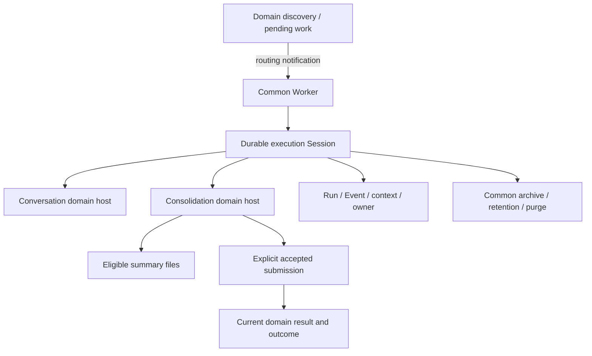

# Memory Summary Workflow Design

- Snapshot: `memory-261006`
- Requirements: [memory-261006/REQ](../requirements/memory-261006-summary-workflow.md)
- Decisions: [memory-261006/ADR](../adr/memory-261006-summary-workflow.md)
- Source baseline: `b5e819ac62ccf45a802adbc65074a326eb70a2e2`.
- Existing behavior: [Memory](../spec/domain/memory.md) and [Agent execution loop](../spec/flow/agent-execution-loop.md).

## System framing and gaps

Current consolidation is Scheduler-local, accumulates RAM messages, seeds a PostgreSQL private draft from prior publication, uses whole-draft/file revisions and exposure dependencies, requires `coverage.json`, and closes/freezes/publishes on normal model completion. Repeated source-manifest checks also remain in foreground aggregate consumers. The common iteration core already exists, but sharing it does not integrate durable context/compaction or Worker lifecycle.

Current `AgentSession` mixes public identity/title/pin/product mode with owner/heartbeat/context/archive state. `AgentRun` and `Event` reference that identity directly. Worker validation and purge require public root/subagent lineage. There is no complete generic SessionStore to plug in.

Settings Saved lists return at most 100 full entries without paging, then map every entry. Historical already has cursor queries but uses Load more; it has no integrated-summary overview read. The header flex column beside the enable control compresses mobile description width.

## Design Authority

- Design revision: `1` (development-document metadata only, not runtime authoring versioning).

| ID | Mechanism | Authority | Classification |
| --- | --- | --- | --- |
| M1 | Eligible prepared files; no original/prior aggregate input | REQ-1/2, ADR-D1 | decided |
| M2 | Autonomous Markdown; safe renderer and exact final allowance | REQ-3, ADR-D1 | decided |
| M3 | Submit/feedback/continuation and exact durable completion | REQ-4/5/11/13, ADR-D4 | decided |
| M4 | Common model/tool/context/compaction with existing policy | REQ-6/7, ADR-D2 | decided |
| M5 | Common durable Session, Conversation relation, single owner | REQ-8, ADR-D2/D3 | decided |
| M6 | Clean start, generic archive/retention/purge, retained audit | REQ-9, ADR-D5 | decided |
| M7 | Operation-local DB retry; separate post-commit health | REQ-10/11, ADR-D3/D4 | decided |
| M8 | Remove versions/coverage/source inheritance and consumers | REQ-12, ADR-D1/D4 | decided |
| M9 | Settle only execution-associated work after accepted submit | REQ-13, ADR-D4 | required |
| M10 | Semantic task guidance and representative verification | REQ-14, ADR-D1 | required |
| M11 | Responsive header and actual cursor infinite lists | REQ-15/16/18, ADR-D6 | decided |
| M12 | Scope-specific integrated overview and one-level details | REQ-17, ADR-D6 | decided |

Local names, page sizes, helper/file layout and equivalent representations do not introduce new policy. New runtime versioning, retention overrides, retry modes, queue settings or public roles are outside this authority.

## Architecture and ownership

### Common Session and Conversation

Keep common Session IDs as the durable execution identity, including existing Run/Event references. Move conversation-only fields (public handle/title/title generation, pin, public product/primary designation, last user input and conversation-specific command/input semantics) to a one-to-one Conversation profile. Common fields retain Agent/Workspace execution identity, model resolution/context head, current owner, execution/stop state and lifecycle.

Separate canonical execution-record DTO/repositories from public Conversation DTO repositories. Internal rows have no Conversation profile and must not receive empty/fictional public fields. Conversation list/exact-ID/event/history/source admission joins the Conversation relation; absence is non-enumerating unavailable. Root/subagent tree validation belongs to the conversation domain projection. Internal hosts load their exact scope/unit without a fake public root tree.

Migration backfills profiles for existing conversation rows and updates every writer/read consumer in the owning phase. One authoritative storage writer replaces the old columns; there is no fallback to them or second transcript store. Public response identities and conversation semantics remain stable.

### Worker and execution authority

Generalize dispatch/supervision/recovery around common Session identity and a domain execution projection. Broker messages remain routing-only; Redis/InMemory parity and DB recovery remain. The common Session owner admits provider/tool work and fences dependent result writes. Domain consolidation units refer to the active execution and retain work/result data; remove their independently renewable lease as the replacement activates.

Retain current admitted absolute deadline and turn accounting across retries/takeover/quota transitions. No admission-time timeout reset or new lane/fairness configuration is introduced. Domain inputs, tools and completion callbacks vary; iteration, provider transport, cancellation and context mechanics do not fork into a Memory engine.

## Input and context contract

At fresh-host start, fence the predecessor and archive abandoned/terminal predecessors for the exact unit without touching legitimate active owners or unrelated Sessions. Allocate clean private working files and select all eligible prepared summaries needed for the fresh scope aggregate. Retrieval can page internally, without imposing a corpus cap or exposing a ledger.

Check input access/scope/non-archived eligibility at provision. Copy plain input files into the current execution; do not silently replace them mid-read or require version-mediated re-reads. No previous integrated result, predecessor unfinished transcript/draft/receipts, original events or automatic Memory injection enters this host.

Expose common file read/search/glob/mutation tools over that private file domain, plus explicit submit. No ordinary Toolkit/Runtime/Saved/source mount is implicitly inherited. The common input window and compaction path fits real lowered model requests while preserving current files/authored work. Durable canonical history supports current-execution compaction; fresh host recovery does not replay previous unfinished history.

Keep configured Lightweight selection and approved quota transition, max turns and absolute timeout. Common owner generations are execution fencing, not file versions or document history.

## Submission and pending settlement

The submit tool references the execution-authored Markdown artifact without work action/reason/source/revision/epoch arguments. At invocation:

1. Admit current common owner, scope/unit association, stop/deadline/turn policy.
2. Settle concurrent mutations of the submitted result through existing common tool barriers.
3. Read authored bytes, safely render/frame without changing meaning, and measure the final UTF-8 block against the existing independent 10,000-byte allowance.
4. Return actionable ordinary feedback for correctable format/size/artifact errors; preserve Session/files/history for resubmission.
5. Commit current domain result, original accepted-submission outcome and execution-associated pending settlement together.
6. Stop on durable acceptance without another model call.

Inventory/reads/body changes never acknowledge work. Associate admitted work with its execution server-side; accepted submission settles only those actual associated identities. New work arriving afterward remains pending. Do not reintroduce model-authored coverage or auto-acknowledge every current pending row.

Normal model ending without accepted submit adds a continuation reminder to the same common execution. Real stop/owner/deadline/turn loss uses existing terminal behavior. Submission ambiguity reads the original durable outcome; a newer current result does not prove that original submission succeeded. No document history API is introduced. Current result and safe original outcome scalar remain independent of temporary Session purge.

Post-commit archive/SDK close/follow-up scheduling faults remain observable secondary health. They neither invalidate accepted outcome nor replay publication. Retry only rollback-confirmed repository operations with current authority, keeping obtained external results outside the transaction and not re-invoking the whole model handler.

## Generic archive-retention-purge and audit

Terminal domain settlement closes admission, archives the private Session and uses applicable existing archive-retention resolution, including Unlimited. Retain canonical provided inputs, dialogue/events, tool call/results and terminal state during that period; freeing RAM/transports/live worktrees must not erase those durable records.

Generalize the existing pipeline, not separate per-kind purgers:

- eligibility and durable job claim;
- owner/active-effect protection;
- actual associated execution/resource collection;
- resource participant cleanup, checkpoints/retry and verification;
- restrictive common Run/Event/files/Session finalization.

Conversation root/subtree and External Channel/Scheduled Task connections are domain/resource associations. They do not become fake prerequisites for internal Sessions. Resource-specific handlers may differ, but scheduling/retention/retry/finalization is one pipeline. Purge preserves canonical source summaries, Saved rows, current domain result, pending work and required completion/usage scalar.

Use operational read endpoints under existing admin authentication for retained Session metadata, paged canonical events and private provided/authored file reads. Add these under the current admin debug service boundary; no new admin UI or role. DTOs expose canonical safe persisted records, not credentials, SDK hidden/native scratch or newly captured reasoning. Scope/authorization is repository/service controlled; ordinary public conversation APIs still exclude the internal execution. Purged/missing data is unavailable. Verify real endpoint queryability during retention rather than only DB existence.

## Settings UI and API

### Header

Separate title/enable-control arrangement from a full-width description. Preserve surrounding settings layout and enable semantics; allow mobile wrapping without narrow description columns. No blanket centered text requirement.

### Cursor Saved list

Add required explicit cursor/limit parameters to human Saved list operations and a `next_cursor` response. Preserve lexical all-term type/query/exact Agent/User filtering. Order by current type/name with ID tie-breaker and bind cursor meaning to Agent/scope/type/query. Bad/mismatched cursor is 422. SQL fetches limit+1, not all entries; runtime Saved reads/mutations are unchanged.

Expose paged query through generated OpenAPI public client and tRPC. Client infinite query renders received pages, invalidates correct keys on CRUD, and never mixes scope/query pages. Sentinel uses the actual `overflow:auto` container, checks next-page availability/in-flight state and stops at exhaustion. Page count is not a whole-list maximum; no virtualizer dependency is required.

### Integrated Historical overview

Add `GET /agent/v1/workspaces/{handle}/agents/{agent_id}/consolidated-memory?scope=team|user` for the current accepted human-visible document. Resolve personal owner from current authenticated User and Agent visibility/membership. Inspection remains available with Memory disabled as current settings semantics allow; reads never trigger generation.

Historical defaults to selected-scope integrated document/empty state. A session-details action enters one in-page level with existing per-session search/list/source links and back navigation. Keep Team/User grouping and exclude internal drafts. Existing historical list cursor remains; replace Load more with the same scroll sentinel. Distinguish initial loading/error/empty, next-page loading/error and end state. No unnecessary route layout refactor.

The UI phase uses existing current aggregate authorization until the later Memory consumer replacement phase, then scope-only current-result reads replace revision manifests. This is an explicit dependency boundary, not retention of obsolete manifest behavior in the final feature.

Regenerate public clients/specs from changed API sources. Generated files are never edited manually.

## Removal and Replacement

| Existing surface | Removal authority | Replacement / remaining authority | Boundary | Absence verification |
| --- | --- | --- | --- | --- |
| Normal-finish close/freeze/publish | REQ-4/5/11, ADR-D4 | Explicit durable submit | New host activation | Final-only never publishes |
| Exact headings/routes/coverage ledger | REQ-3/12, ADR-D1 | Markdown/render/size feedback | New artifact contract | Prompt/schema/tool args/tests contain no ledger requirement |
| Prior aggregate draft seed/history replay | REQ-2/9 | Clean provided summary files | Fresh-host start | Prior-only text absent from actual model input |
| Draft/file revision/epoch and dependency conflicts | REQ-12 | Common file semantics/owner | File domain conversion | Independent mutations have no global version conflict |
| Exposure/draft/revision dependency tables and admission checks | REQ-12, ADR-D1 | Input provision and scope/owner admission | Host plus consumers | No full-source validator at per-operation boundaries |
| Immutable revision history/current pointer consumers | REQ-12 | Current result/original outcome | Foreground snapshot/VFS/UI conversion | No source-manifest/revision authoring contract or restore API |
| Scheduler-local consolidation executor | REQ-8, ADR-D2 | Shared Worker host | Producer handover | No concurrent old/new writer/second semaphore consumer |
| RAM-only canonical transcript | REQ-7/8 | Shared durable Run/Event | Internal activation | Restart and compaction tests |
| Conversation-only Session fields/access | REQ-8, ADR-D2 | Conversation profile | Backfill and single-writer conversion | No internal placeholder/public get exposure |
| ROOT-only purge target/finalizer | REQ-9, ADR-D5 | Common execution/resource pipeline | Lifecycle conversion | Both kinds run same job/retry/finalizer |
| Early deletion of audit payload | REQ-9 | Retain until common purge | Archive resource split | Actual diagnostic reads survive archive |
| Full Saved response/map and Historical Load more | REQ-16/18 | Cursor infinite queries | UI/API phase | >100 rows reachable; no manual load button |
| Top-level session list/narrow header | REQ-15/17 | Integrated overview/detail and full-width explanation | UI phase | Mobile/browser layout and navigation tests |

Include model/repository fields, prompt/tool schemas, foreground boundary memory selection and consolidated VFS aliases, fixture/test assertions, public API clients, current Specs and job registries. Old snapshots remain immutable. Preserve current accepted data/sources/Saved/pending/outcome while converting obsolete schema; do not interpret no-prior-input as deletion of all historical retained execution records.

## Migration, rollout and rollback

Use reviewable phases: UI/API, common Session/Conversation/lifecycle, then Memory host and obsolete consumer/state removal with integrated validation. No extra docs-only PR for workflow appearance.

Backfill Conversation profiles and retain Session/Run/Event identities; switch writers and readers atomically with their migration. Generate migration skeletons only with Alembic. Test existing-data upgrade and permitted rollback boundaries before schema removal. Do not add dual-write compatibility modes.

For Memory activation, preserve current accepted result and pending work, resolve/fence existing owners, and ensure old Scheduler execution cannot overlap the new Worker host. Implement operator handover prerequisites but do not actuate live quiesce, restart, apply, migration or merge as part of this code request. Destructive schema phases must state where old-code rollback becomes invalid; do not promise it after removal.

## Test Strategy

E2E is primary for product behavior; existing `testenv/azents/e2e/src/tests/required/public/test_historical_memory.py` and browser/Storybook surfaces provide fixtures/prerequisites, not substitutes for actual execution.

| Matrix | Evidence |
| --- | --- |
| Authorized Team/User active/archived/denied summaries | Actual input files/model prompt scope, no originals/prior aggregate |
| Final-only, invalid then corrected submit, accepted submit | Same execution/history/files, one accepted outcome, no auto publish |
| Korean byte boundary/free Markdown/empty result | Final rendered allowance/feedback, no invented filler |
| Lost commit ack and post-commit close/archive/dispatch fault | Original outcome, one persistence, secondary logging |
| Two Workers, takeover, duplicate broker, Redis reset | Single owner/fenced old submit, fresh host, preserved deadline/pending |
| Small true resolved model window and growing dialogue | Common compaction and measured lowered request fit |
| Retention/Unlimited/audit/expiry/cleanup failure | Actual authorized reads, same purge pipeline, no early payload loss |
| Public exact-ID/list/events/search/source admission | Internal unavailable; ordinary conversations unchanged |
| Input-associated work and late arrivals | Only associated work settled after acceptance |
| >100 Saved rows, scope/query and CRUD | Initial page only, automatic next pages, no mix/duplicate |
| Historical overview/details/back and empty/disabled scope | Current integrated first, no generation side effect |
| Mobile/desktop real scroll root | Full-width explanation and no Load more |
| Corrections/status/one-task preference fixtures | Representative output comparison, not a runtime judge |

Use deterministic scripted provider/DB synchronization for control races; never claim it proves real window fitting or all future semantic quality. Required deterministic tests fail CI on violations. Optional live/provider tests skip only for explicitly recorded missing prerequisites. Preserve SHA, policy/model metadata and safe evidence; never dump credentials/private text into logs. Run root-owned Ruff/typechecker/Pytest, migration tests and frontend format/lint/typecheck/build plus focused browser/Storybook/E2E. Keep current required CI topology; do not add lanes merely to claim speed.

## Authority and feasibility check

All REQ-1..18 trace to M1..M12 and the matrix. No runtime versioning, second owner, ledger, public role/UI, separate purger/engine or timeout reset is authorized. Current common core, Run/Event identity and durable purge participants are reusable; public Session DTO, Worker lineage and ROOT purge require extraction, not flags.

Source feasibility is established at the affected code boundaries; actual migration/cancellation/cascade/window/UI evidence is an implementation obligation and not claimed complete. Data-preservation, actual audit endpoint access, source-manifest consumer absence and one-writer handover are mandatory phase acceptance gates. Local discoveries that change these mechanisms return to authority review, not an invented plan mechanism.

## Design Approval

- Mode: `Collaborative`.
- Decision owner: requester.
- Approved on: `2026-10-06` KST.
- Approved Design revision: `1`.
- Approved authority IDs: `M1, M2, M3, M4, M5, M6, M7, M8, M9, M10, M11, M12`.
- Approved scope: discussed summary-only explicit submission workflow; recommended common Session/Conversation separation and single owner; generic audit-preserving lifecycle; four settings UI outcomes.
- Approval evidence: explicit instruction to proceed through implementation after the combined design, B recommendation and retention/purge clarification. This formal record consolidates that scope without introducing a new material feature.
- Implementation and live deployment are not claimed complete. Material scope changes require renewed approval; local names/layout/page sizes remain implementation-owned.
