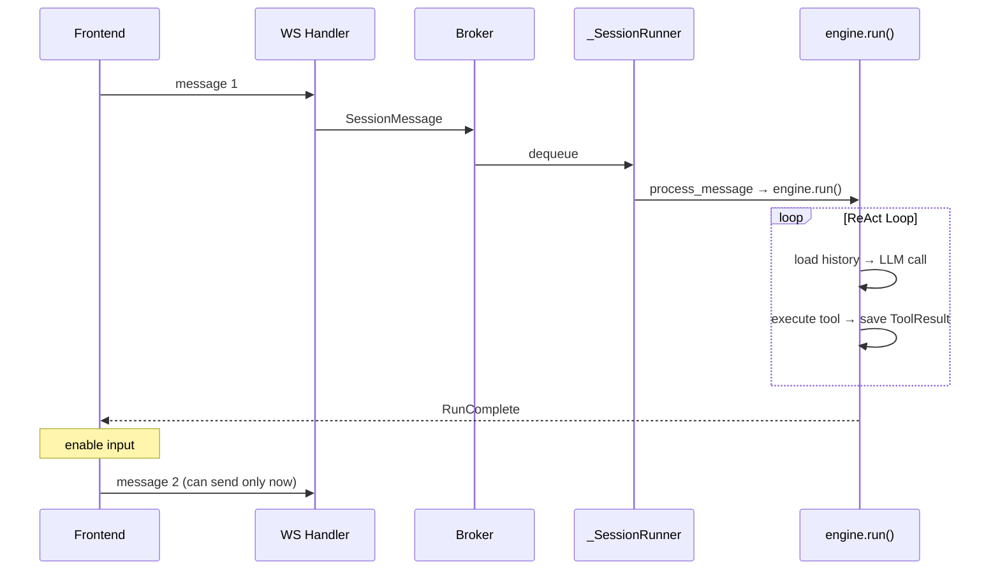
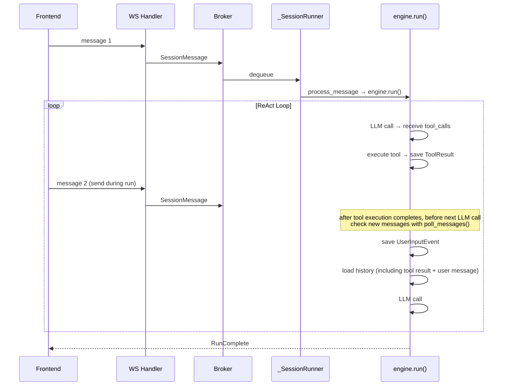

# Message Queueing — User Message Injection During Run

## Overview

Currently agent session does not process next message until `engine.run()` completes (RunComplete). FE also enables input only after receiving RunComplete.

Improve this by creating structure where user message sent while run loop is running is **injected into next LLM turn**.

## Current Structure



## Target Structure



## Decisions

### 1. Message injection point → **After tool execution, before next LLM call**

- After LLM returns tool_calls and tools execute, check queue before next LLM call.
- If LLM gives final answer (no tool_calls), keep existing RunComplete + return.
- Therefore, **inject only inside tool call loop** — do not inject at final answer point.

**Reason**: tool result + new user message enter history together, so LLM can naturally respond "based on tool result + reflecting additional user request."

### 2. Mechanism to deliver messages to engine → **Inject callback function**

```python
async def run(
    self,
    request: RunRequest,
    poll_messages: PollMessages | None = None,
):
```

- `poll_messages` is callback shaped like `async () -> list[SessionMessage]`.
- engine checks new messages with `await poll_messages()` after tool execution.
- If messages exist, store as UserInputEvent and continue.
- Worker layer implements callback (e.g. by taking directly from broker queue).

**Reason for choosing callback instead of asyncio.Queue**: If messages are put into Queue and engine dies with exception, messages are lost. Callback is safer because original remains in broker/worker queue.

### 3. FE notification event → **No ack in first phase, add as follow-up**

- First implementation: no separate ack — user sends and it is naturally reflected in next assistant response.
- **Follow-up**: add `MessageQueued` ack event — feedback "received, will be reflected in next turn."
  - Split into separate work because it affects FE + broker + serialization broadly.

### 3-1. EventStore storage gap → **Accept in first phase, solve with ack in follow-up**

User message is stored in EventStore when `poll_messages()` is called. There is **storage gap** between message send and poll:

```
user message send → broker queue → _SessionRunner queue → poll_messages() → EventStore
                   immediate       immediate             after tool ends     stored then

                   ├──── message not in store during this interval ────┤
```

**Impact**: If FE refreshes during this gap, REST list_messages does not show that message. User's own message cached on client is also lost on refresh.

**First phase response**: accept gap. FE temporarily caches sent message in localStorage or similar and displays it.

**Follow-up (with ack event)**:
- When `MessageQueued` ack is introduced, remove gap by storing in EventStore immediately at ack publication time.
- Or review storing in EventStore immediately when WS handler receives message.
- With ack, FE can trust "stored on server" state, so cache becomes unnecessary.

### 4. RunStarted/RunComplete lifecycle → **one run includes multiple user messages**

- RunStarted once → (process multiple user messages) → RunComplete once.
- From FE perspective, "processing" state remains continuously.
- Naturally fits structure injecting inside tool execution loop.

### 5. Command message handling → **FE blocks command send during run**

- During run, FE blocks sending commands (`/compact`, etc.).
- Backend defensively does not inject `SessionCommand` in `poll_messages()`.
- Commands can be used only after run completes.

### 6. Multiple messages → **Store all at once**

- If multiple messages are queued between turns, store all as UserInputEvent.
- Include all in next LLM call.
- LLM can see consecutive messages together and understand context.

## Implementation Plan

### Change Scope Summary

| Layer | File | Change |
|--------|------|-----------|
| Runtime type | `engine/types.py` | add `PollMessages` type alias |
| Engine | `engine/engine.py` | add `poll_messages` parameter to `run()`, poll + store after tool loop |
| Worker | `worker/engine.py` | create callback + pass to engine in `process_message()` |
| Frontend | TypeScript (chat) | enable input during run, block commands |

### Phase 1: Engine Layer — receive poll_messages callback + inject

#### 1-1. `PollMessages` type alias (`engine/types.py`)

```python
PollMessages: TypeAlias = Callable[[], Awaitable[list[UserInputEvent]]]
```

- Return `list[UserInputEvent]` so engine does not depend on broker type.
- Worker layer handles SessionMessage → UserInputEvent conversion.

#### 1-2. Change `engine.run()` signature (`engine/engine.py:296`)

```python
async def run(
    self,
    request: RunRequest,
    poll_messages: PollMessages | None = None,
) -> AsyncIterator[EngineEvent]:
```

- Default `None` for compatibility with existing call sites.
- If `poll_messages is None`, keep existing behavior.

#### 1-3. Message injection after tool execution (`engine/engine.py:563` and after)

Current flow:
```
tool execution → save ToolResult → (while True again) → load history → LLM call
```

After change:
```
tool execution → save ToolResult → poll_messages() → save UserInputEvent → load history → LLM call
```

```python
# after tool execution loop (after line 563), before returning to while True
if poll_messages is not None:
    injected = await poll_messages()
    if injected:
        await self._store.append(sid, injected, model=request.model)
```

- If no message (`injected` is empty list), do nothing.
- If messages exist, store in EventStore → included in next `_store.list(sid)`.
- LLM sees both tool result and user message and responds.

#### 1-4. Tests

- Inject `poll_messages` mock into `engine.run()` unit test.
- Verify after tool execution poll → injected message appears in history of next LLM call.
- Verify existing behavior remains when `poll_messages=None`.

### Phase 2: Worker Layer — create and pass callback

#### 2-1. Change `_SessionRunner._loop()` (`worker/engine.py:445`)

Current:
```python
await self._worker.process_message(message)
```

Change:
```python
await self._worker.process_message(message, poll_fn=self._make_poll_fn())
```

#### 2-2. New `_SessionRunner._make_poll_fn()` method

```python
def _make_poll_fn(self) -> PollMessages:
    """Create poll_messages callback to inject into engine.run()."""
    async def poll() -> list[UserInputEvent]:
        messages: list[UserInputEvent] = []
        while not self._queue.empty():
            try:
                msg = self._queue.get_nowait()
            except asyncio.QueueEmpty:
                break
            if isinstance(msg, SessionMessage):
                messages.append(UserInputEvent(
                    content=msg.user_message,
                    metadata=msg.metadata,
                    attachments=...,  # convert SessionMessage.attachments → Attachment
                ))
            # ignore SessionCommand (design decision #5)
        return messages
    return poll
```

**Note**: `SessionMessage.attachments` is `list[str]` (URI), `UserInputEvent.attachments` is `list[Attachment]`. Determine conversion logic with reference to existing `resolve_invoke_input` flow. Simplification option: deliver only text without attachment in intermediate injected messages.

#### 2-3. Change `EngineWorker.process_message()` signature (`worker/engine.py:183`)

```python
async def process_message(
    self,
    message: SessionMessage,
    poll_fn: PollMessages | None = None,
) -> None:
```

Engine call part (line 293):
```python
async for event in self.engine.run(run_request, poll_messages=poll_fn):
```

#### 2-4. Tests

- `_SessionRunner` unit test: verify message `enqueue()`d during run is delivered to engine through poll callback.
- Verify `process_message(poll_fn=...)` passes callback to engine.run().

### Phase 3: Frontend — Enable Input During Run

#### 3-1. Change input state management

Current: `RunStarted` → disable input, `RunComplete` → enable input

Change: keep input enabled after `RunStarted`

- Keep "processing" state display (spinner, etc.).
- Input field stays enabled.
- Send button stays enabled.

#### 3-2. Command blocking

Block `/` command input during run:
- detect command such as `/compact` in input field and block send, or
- hide command autocomplete UI

#### 3-3. UX handling

- Optimistically show sent message in chat (no ack).
- Optional hint such as "Message will be reflected in next response."
- Message may not appear after refresh because of storage gap → localStorage cache (first phase).

### Phase 4: Integration Test + Manual Verification

#### 4-1. Integration scenarios

1. **Basic flow**: send message 1 → during tool execution send message 2 → message 2 reflected in next turn
2. **Multiple messages**: send messages 2, 3, 4 during tool execution → all injected at once
3. **Command blocking**: send `/compact` during run → ignored (FE block + backend defense)
4. **No message**: no additional message during tool execution → existing behavior unchanged
5. **Error recovery**: engine errors during tool execution → unpolled messages remain in queue and are processed in next run

#### 4-2. Manual verification

```bash
# Backend quality check
cd python/apps/nointern && uv run pyright && uv run ruff check . && uv run pytest

# WS manual test
# 1. send message → confirm tool execution starts
# 2. send additional message during tool execution
# 3. confirm additional message content is reflected in next assistant response
```

### Follow-up Items

| Item | Description | Dependency |
|--------|------|------|
| `MessageQueued` ack | server confirms message receipt to FE | after Phase 3 complete |
| Immediate EventStore save | remove gap by saving to EventStore at ack time | with ack |
| FE refresh recovery | localStorage cache → reliable state management based on ack | with ack |

### Implementation Order

```
Phase 1 (Engine) → Phase 2 (Worker) → Phase 3 (Frontend) → Phase 4 (integration test)
```

- Phase 1~2 can be completed backend-only (`poll_messages=None` keeps existing behavior).
- Phase 3 requires FE changes, so separate work.
- After Phase 1~2, backend behavior can be verified with WS manual test.
