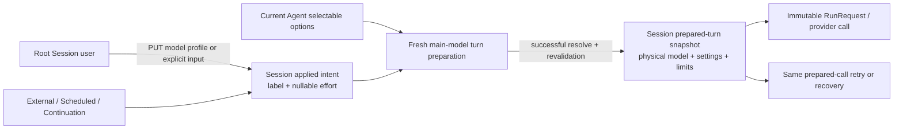

# Session Model Change Design

- Snapshot: `model-260819`
- Document reference: `model-260819/DESIGN`
- Requirements: [`model-260819/REQ`](../requirements/model-260819-session-model-change.md)
- Decisions: [`model-260819/ADR`](../adr/model-260819-session-model-change.md)

## Current Behavior and Requirement Gaps

AgentSession currently stores one complete `SessionInferenceState` containing the requested label and effort, physical `AgentModelSelection`, model-scoped settings, effective context limits, and resolution time. The worker treats equal label and effort as sufficient to reuse that physical snapshot. Agent updates replace selectable options only on the Agent row, so a Session can keep using a stale physical model or settings behind the same label.

Human message and TurnAction requests store an explicit profile on a mailbox row, but the Session state changes only when the worker later promotes that row. There is no model-only Session mutation. A direct model-only row update would also be vulnerable to an older queued message overwriting it during promotion.

External-channel, Scheduled Task, command, continuation, and other implicit producers already enqueue no explicit profile. They therefore inherit Session state, but they inherit the same stale complete snapshot.

The web Composer stores model state in both a scoped last-selected local-storage key and the draft `inference_profile`. Restore precedence lets browser state supersede the server Session projection. The reviewed pending glow and check action exist in the current visual-review code but are not connected to an authoritative applied Session profile in the concrete chat surface.

| Requirement | Current gap |
| --- | --- |
| `model-260819/REQ-1`, `REQ-2` | Picker state is not reliably compared with server-applied Session intent; reviewed pending styling is not connected end to end. |
| `model-260819/REQ-3` | Explicit profile is applied asynchronously during promotion, not atomically with admission, so a later model-only choice can be overwritten. |
| `model-260819/REQ-4` | Empty Composer input has no transcript-free model-profile API and is normally rejected as a missing message. |
| `model-260819/REQ-5` | Implicit triggers inherit Session state, but no model-only application path exists and the inherited physical snapshot can be stale. |
| `model-260819/REQ-6` | Equal label and effort reuse an old physical model/settings snapshot after Agent option updates. |
| `model-260819/REQ-7` | The worker rebuilds a same-Run request only after mailbox-driven invalidation; an Agent remap or direct Session intent change alone is invisible. |
| `model-260819/REQ-8` | Browser local storage persists both last-selected and draft-embedded model state. |
| `model-260819/REQ-9` | Existing worker resolution is safe, but the new direct mutation and admission-time application need equivalent root-only validation and failure atomicity. |

## Requirement and Decision Traceability

| Requirement | ADR authority | Primary design mechanisms |
| --- | --- | --- |
| `model-260819/REQ-1`, `REQ-2` | Fixed visual outcome | M7, M8 |
| `model-260819/REQ-3` | `model-260819/ADR-D4` | M4, M7 |
| `model-260819/REQ-4` | `model-260819/ADR-D1` | M3, M7 |
| `model-260819/REQ-5` | `model-260819/ADR-D2`, `ADR-D3`, `ADR-D4` | M1, M5, M6 |
| `model-260819/REQ-6` | `model-260819/ADR-D2`, `ADR-D3` | M1, M2, M5 |
| `model-260819/REQ-7` | `model-260819/ADR-D2`, `ADR-D3` | M2, M5 |
| `model-260819/REQ-8` | Confirmed requirement | M8 |
| `model-260819/REQ-9` | `model-260819/ADR-D1`, `ADR-D4`, `ADR-D6` | M3, M4, M9 |

## Architecture and Ownership

AgentSession owns two independent durable profile states.



- **Applied Session intent** is the user-visible and cross-trigger source of truth. It contains only an Agent-owned label and nullable effort.
- **Prepared-turn state** is internal execution recovery state. It contains the complete physical model snapshot, model-scoped settings, effective context/compaction limits, resolved label/effort, and resolution timestamp for one prepared main-model call.
- **Agent selectable options** remain the source of physical model and model-scoped settings behind each label.
- **RunRequest** remains the immutable in-memory request for a provider call already prepared.
- **AgentRun** remains the multi-turn lifecycle record and gains no model snapshot ownership.
- **Mailbox requested profile** and durable message requested-profile fields remain historical request provenance. They do not own Session state or actual turn provenance.

## Data Model

### Applied intent

Add a nullable applied-intent group to `agent_sessions`:

- `applied_model_target_label`: nullable label, maximum 80 characters;
- `applied_reasoning_effort`: nullable `model_reasoning_effort`.

Valid states are:

- both fields null: the Session has no explicit applied intent and inherits the current Agent main/default intent at each fresh boundary;
- label non-null with nullable effort: explicit Session intent, where null effort means model Default.

An effort without a label is invalid.

The AgentSession domain model exposes this group as a dedicated applied-profile type. The public `AgentSessionResponse.current_model_target_label` and `current_reasoning_effort` field names remain stable but are populated from this group.

### Prepared-turn state

Retain the existing complete database column group:

- `current_model_target_label`;
- `current_model_selection`;
- `current_model_settings`;
- `current_reasoning_effort`;
- `current_effective_context_window_tokens`;
- `current_effective_auto_compaction_threshold_tokens`;
- `current_inference_resolved_at`.

Repository and worker domain code reclassify this as `prepared_inference_state` or an equivalent explicit prepared type. Its existing all-null/all-present invariant remains. The physical fields are not added to Session public responses.

The prepared label and effort describe the already prepared call and may differ from the applied intent after a concurrent model change. That divergence is expected until the next fresh boundary.

## Public API and Generated Contracts

### Model-only replacement

Add:

```http
PUT /chat/v1/sessions/{session_id}/model-profile
```

Request shape:

```json
{
  "client_request_id": "client-generated-id",
  "model_target_label": "Quality",
  "reasoning_effort": "high"
}
```

`reasoning_effort` is required but nullable. The request is a full replacement; omission is not a partial-update mode.

Response shape:

```json
{
  "session_id": "session-id",
  "model_target_label": "Quality",
  "reasoning_effort": "high"
}
```

The service:

1. validates the Session identifier and requester access;
2. locks and requires an active root Session, then looks up idempotency by
   `(session_id, requester_user_id, client_request_id)`;
3. for an existing record, verifies the mutation type and normalized payload,
   returning the stored original projection on a match or `409` on a mismatch;
4. only for a newly accepted key, locks and requires the active owning Agent through
   the canonical lock order;
5. validates the label and effort against the current Agent selectable options
   without contacting a provider;
6. replaces applied intent under the Session lock and stores the accepted result;
   and
7. returns the canonical applied-profile projection.

A same-key, same-payload retry returns the original projection without reapplying
historical state or revalidating that historical label and effort against current
Agent options. This remains true when the option was later deleted, renamed, or had
its supported effort changed. A payload or mutation-type mismatch returns `409`.
Only a newly accepted request validates current options; unknown labels and
unsupported effort then return a client error without mutation.

The route creates no mailbox item, event, command, Run, wake-up, provider request, or live control frame.

### Existing input responses

Every successful explicit human input admission changes applied intent synchronously. `ChatWriteSnapshotResponse` therefore includes the authoritative applied-profile projection so the Composer can adopt server state from the successful response instead of inventing a browser-owned value. Commands and other null-profile writes return the unchanged applied profile.

First-message Team/User Session creation returns the applied intent created in the same transaction. The OpenAPI specification and generated TypeScript and Python public clients are regenerated through the standard client-generation workflow.

After every successful model-profile PUT or explicit-profile input response, the
frontend invalidates and refetches the Session query. A mutation response may supply
the immediate projection, but the refreshed Session query is the final cache
authority. Therefore replaying an old idempotency result cannot leave its historical
projection overwriting a later committed Session profile in the client.

## Admission and Idempotency Flow

Explicit message, edit, and TurnAction admission use one transaction:

1. resolve and lock the Agent and Session through the canonical lock order;
2. authorize Workspace/Session access and root-session write capability;
3. process idempotency before applying a duplicate request;
4. validate the explicit label and effort against the locked Agent option snapshot;
5. claim attachments and validate the input/action contract;
6. create the mailbox or edit admission record;
7. replace Session applied intent; and
8. commit the idempotency record, input admission, and applied intent together.

Only a newly accepted idempotent request performs step 7. Returning an existing successful write never reapplies its old profile.

For first-message creation, root Session creation, applied intent, workspace/setup admission, message admission, and idempotency commit are one atomic boundary. Failed admission creates no Session.

After admission commits:

- later action execution or preparation failure does not roll back the profile;
- deleting the pending mailbox item does not roll back the profile;
- mailbox requested-profile fields remain immutable provenance; and
- worker promotion must not write Session applied intent.

Commands carry a null profile and leave applied intent unchanged.

## Fresh Main-Model Turn Preparation

A fresh boundary exists immediately before:

- the first main-model provider dispatch of a new Run; or
- every later main-model dispatch in the same Run after a completed call, including follow-up after client-tool results and continuation work.

Provider retry/backoff, replay of the same logical provider attempt, and recovery of an already prepared call are not fresh boundaries.

Fresh preparation performs:

1. read the latest Session applied intent and relevant Agent model configuration;
2. if applied intent is null, derive temporary intent from the current Agent main label and default reasoning effort without writing applied columns;
3. resolve the current selected option, model-scoped settings, integration, effort, and effective limits;
4. complete provider credential/token preparation required by the existing resolver;
5. re-read and lock the Agent and Session through the canonical order and owner-generation fence;
6. verify that the applied intent and relevant Agent selected/default option snapshots still match the candidate;
7. discard and retry when either side drifted;
8. persist the complete prepared-turn snapshot; and
9. commit before provider dispatch.

The prepared-state commit is the turn linearization boundary. Later Session or Agent changes belong to the next fresh boundary. No Agent-to-Session fanout or model-configuration revision is required.

The worker replaces equal-label/effort snapshot reuse as freshness authority. Equality may remain a local optimization only after current Agent mapping has been re-read and proven equivalent; it cannot skip the boundary pull or revalidation.

### Retry and recovery

An already prepared main-model call uses its durable prepared snapshot for provider retry and worker/process recovery. Recovery does not re-resolve current Agent or Session state mid-attempt. Once that call finishes and another model turn is needed, the next fresh boundary performs current resolution.

Context compaction and lightweight-model dispatch retain their existing Agent lightweight selection behavior. The Composer does not select or persist a lightweight profile.

## Trigger Behavior

External-channel, Slack, Discord, Scheduled Task, command, goal continuation, idle continuation, and other implicit producers continue to enqueue no requested main-model profile. At their eventual fresh main-model boundary they use the latest Session applied intent.

An implicit row admitted before a later human model change also uses the later applied intent if provider dispatch has not yet been prepared. Mailbox admission time does not freeze an implicit profile.

No external integration receives a picker, per-invocation override, or copied physical model configuration.

## Failure, Retry, and Recovery

### Admission-time failures

Unknown labels, unsupported effort, authorization failure, inactive/read-only Session, attachment failure, invalid action/input, and idempotency conflict fail the admission transaction. The previous applied intent, mailbox state, and Session creation state remain unchanged.

### Late resolution drift

A label deleted or renamed after admission, newly unsupported effort, invalid current option, or typed unavailable integration/configuration fails closed at the fresh boundary before provider dispatch.

- no new prepared snapshot is written;
- no physical model/provider provenance is claimed for the failed boundary;
- the prior prepared snapshot remains available only for its already prepared call and diagnosis;
- applied intent remains unchanged;
- no Agent default, alternate label, alias, or stale prepared snapshot is used as fallback; and
- expected failures use the existing typed pre-provider failure/system-error and Run terminalization boundary.

A same-Run next-turn failure preserves earlier successful output and terminalizes the Run without another provider call. First-turn expected failure uses the existing durable failure-event/no-provider path. Deterministic invalid work must not remain as a permanently blocking FIFO head.

Unexpected database, process, or infrastructure exceptions keep existing rollback and pending retry/recovery behavior. A fresh retry resolves current state again.

Repairing the Session profile or Agent mapping does not wake the Session or replay consumed work. A later new input, supported explicit retry, or external/scheduled trigger starts a fresh boundary and may succeed.

## Frontend Behavior

### Server-owned applied state

Concrete Session chat derives its nullable applied intent from the Session query.
The effective Composer baseline is derived as follows:

1. use the explicit Session applied label and effort when they are non-null; or
2. when both applied fields are null, use the current Agent main/default profile
   supplied by the server Agent projection.

The derived baseline is view state for picker initialization and pending comparison
only. It is never persisted as Session intent and does not become a second source of
truth. Applying it with text or through the model-profile PUT stores an explicit
Session intent. Client-only `latestHumanInferenceProfile` no longer competes as a
separate source of truth. Draft/new-Session composition uses the same current Agent
main/default profile because no durable Session exists before first-message
admission.

`ChatView` passes the nullable applied Session intent and effective Composer baseline
to `ChatInput`. `ChatInput` alone keeps the pending picker selection in component
memory until it is applied. `ChatSessionView` no longer mirrors that selection in
`composerInferenceProfileState`, relays
`handleComposerInferenceProfileChange`/`onComposerInferenceProfileChange`, or treats
it as Session state. Reload discards `ChatInput` memory and rehydrates the current
effective baseline.

Header subscription-usage presentation is an agent-owned UI detail after the local
profile relay is removed. It may derive only from already authoritative
server/effective profile inputs, must not retain another applied-profile state, and
must not feed Session mutation or execution selection. Its exact refresh timing
relative to an unapplied picker change is not a product contract in this snapshot.

### Pending state

Pending is true when the component-memory picker label or effort differs from the
effective Composer baseline. Returning both values to that baseline clears pending.
This comparison works identically for an explicit applied intent and for null
applied intent that currently inherits the Agent main/default profile.

The reviewed V2 treatment is retained:

- blue picker outline;
- blue status point;
- matching light-blue outer glow on the picker and applicable action control;
- normal styling when no change is pending.

### Action selection

The model-only check action is applicable when a profile change is pending and there is no submittable message content, attachment, or selected action. File-only messages and run-producing TurnActions remain input submissions and use their existing send/action affordance while applying the profile at admission. Commands submit with a null profile and do not consume the pending model choice.

When text or other run-producing input is present, the Send/action request includes
the selected profile. A successful authoritative write response supplies the
immediate projection, invalidates/refetches the Session query, and clears pending
against the refreshed baseline.

When only a profile change is applicable, the same submission control uses the
reviewed check icon and calls the model-profile PUT. Success supplies the immediate
projection, invalidates/refetches the Session query, and clears pending against the
refreshed baseline without clearing text/action draft state or starting a Run.

Existing Stop authority remains available during a running call. When both Stop and model-only Apply are applicable, the action cluster exposes both controls without relocating the picker or redesigning the Composer; this is required to preserve existing Stop behavior while allowing the active-Run next-turn change.

### Browser and session-local profile-state removal

The Composer draft persists only:

- message text; and
- selected action.

Remove:

- the `azents.chat.lastSelectedInferenceProfile.*` storage key and all read/write/cleanup helpers;
- `inference_profile` from draft serialization and restoration;
- stored-profile parsers used only by those paths; and
- Storybook/test setup that seeds browser profile state;
- `useChatSessionContainer.latestHumanInferenceProfile` and its setter/update paths;
- `ChatSessionView.composerInferenceProfileState` and
  `handleComposerInferenceProfileChange`;
- the `ChatView.onComposerInferenceProfileChange` prop and its `ChatInput` relay; and
- subscription selection derived from an unapplied composer profile.

Existing browser keys and old draft profile fields are left inert. No compatibility reader, migration, or cleanup write is added. Reload discards unapplied picker state and reconstructs the picker from the effective Composer baseline.

## Security and Permissions

- Only authorized human users may mutate a root Team or owned User Session profile.
- Subagent Sessions reject direct human profile replacement and explicit human input as read-only.
- Clients submit only label and effort. Provider, integration, credentials, model identifiers, capabilities, settings, and effective limits remain server-owned.
- Admission validation uses current Agent-owned options and normalized supported effort levels.
- The model-profile response and failures do not expose secrets or physical provider configuration.
- Agent lifecycle and Session active-state fences remain in force.
- Final turn preparation revalidates Session owner generation and Agent/Session state before committing prepared execution data.

## Migration, Cutover, Rollback, and Compatibility

Use a new forward migration; do not modify prior migrations.

### Pre-cutover drain

Before enabling the new schema semantics:

1. quiesce or fence old profile-bearing human writers and old workers;
2. drain or terminalize every pending mailbox row with a non-null requested profile under legacy worker semantics;
3. verify no explicit-profile mailbox row remains; and
4. abort cutover if the drain cannot complete.

Implicit null-profile rows may remain.

### Schema migration

1. add nullable applied label and effort columns;
2. add the applied-intent consistency constraint;
3. backfill applied intent from the existing complete current/prepared state;
4. keep all-null Sessions null to preserve dynamic Agent-default inheritance;
5. validate that no partial current inference state exists; and
6. add any idempotency write-type migration required by the chosen implementation.

Do not add AgentRun inference columns and do not rewrite the retained physical prepared group.

### Deployment

Migration, API, worker, generated clients, and frontend deploy as one coordinated release. Mixed old/new binaries are unsupported after new applied-intent writes begin.

Database downgrade is safe only before feature traffic writes divergent applied/prepared state. After that boundary, rollback requires a compatible application deployment with a database snapshot or forward repair. Retained physical columns are not authority to restore old combined semantics.

## Observability and Operational Risks

Structured logs and metrics should cover:

- model-profile mutation accepted, replayed, conflicted, or rejected;
- Session ID, Agent ID, logical label, nullable effort, and safe failure code;
- fresh-boundary resolution source: explicit Session intent or inherited Agent default;
- candidate discarded because Session or Agent state drifted;
- prepared snapshot commit and recovery reuse;
- late deterministic resolution failure before provider dispatch; and
- cutover drain count of explicit-profile mailbox rows.

Do not log credentials, provider request bodies, physical model snapshots, or unbounded provider error content.

Primary operational risks are:

- mixed binaries interpreting retained physical columns with old semantics;
- an incomplete pre-cutover explicit-profile drain;
- lock-order regressions across Agent and Session mutations;
- stale workers committing a prepared candidate after state drift; and
- frontend fallback logic hiding a server-applied label that later becomes unavailable.

The coordinated deployment, final Agent/Session revalidation, owner-generation fence, fail-closed behavior, and E2E matrix mitigate these risks.

## Test Strategy

Product verification is E2E-first and uses deterministic provider and Agent option fixtures.

### E2E primary verification matrix

| Scenario | Required evidence |
| --- | --- |
| Pending picker selection | Picker and action show the V2 shared glow/status point; Session API remains unchanged until application. |
| Null applied-intent baseline | A Session with null applied fields initializes from the server Agent main/default profile; selecting another profile shows pending, and reload restores the derived baseline without persisting it. |
| Revert pending selection | Returning label and effort to applied state removes pending styling. |
| Apply with text | One write applies the profile and admits the message; response reports the applied profile; the resulting model call uses it. |
| Apply without text | PUT updates Session profile; history, mailbox, Runs, wake-ups, and provider journal remain unchanged. |
| File-only and TurnAction submission | Submission remains a run-producing action rather than model-only apply; selected profile applies at admission. |
| Command with pending profile | Command sends without a profile and the unapplied picker selection remains pending. |
| Active Run model-only change | Current provider call uses the old prepared snapshot; the next same-Run model call uses the new Session intent. Stop remains available. |
| Same-label Agent remap | Existing Session keeps its label; the next fresh call uses the new physical model/settings without a chat message. |
| Agent main-label change | A Session with non-null applied intent keeps its label; a null-intent Session inherits the new default at its next boundary. |
| External/Scheduled trigger after model-only apply | Trigger carries no override and provider journal shows the Session-applied model. |
| Earlier queued implicit input | A later committed profile change wins before fresh dispatch. |
| Older queued explicit message vs later model-only change | Worker promotion does not overwrite the later applied intent; the next turn follows the latest Session state. |
| Idempotent model PUT retry | Same key/payload returns original projection and does not revert a later profile; conflicting payload returns 409. |
| Invalid direct profile | Request fails, prior applied intent remains, and no mailbox/Run/provider side effect occurs. |
| Label or effort invalidated after admission | Typed pre-provider failure, no provider call, applied intent and prior prepared snapshot remain unchanged. |
| Same-Run late drift | Prior output remains; next call is not dispatched; Run reaches the existing terminal failure state. |
| Repair after failure | New input or supported retry performs fresh resolution and succeeds; repair alone causes no wake or replay. |
| Root/subagent authority | Root Team/User mutation succeeds with correct access; subagent mutation returns the existing read-only failure. |
| Reload and another browser | Existing Session displays server-applied profile; unapplied picker state is discarded. |
| Local-storage absence | Text/action draft survives reload; model label/effort are absent from draft and no last-selected key is read or written. |

### E2E plan

Extend the existing per-prompt inference-profile E2E suite and browser chat E2E coverage. Use at least two labels with distinct deterministic model identifiers and settings, a same-label remap fixture, supported/unsupported effort variants, an integration-unavailable fixture, a controllable multi-turn tool barrier, external-channel and Scheduled Task triggers, and provider request journaling.

Use explicit barriers rather than fixed sleeps to place a mutation:

- while a provider call is active;
- after a message is admitted but before promotion;
- between two model turns in one Run; and
- during Agent/Session revalidation races.

### Fixture and prerequisite support

Testenv requires:

- deterministic selectable Agent options with distinct physical model IDs and settings;
- provider request capture and call-count assertions;
- a controllable client-tool continuation to force a second same-Run model turn;
- Session mailbox barriers for admission/promotion ordering;
- deterministic external-channel and Scheduled Task trigger fixtures;
- root Team, root User, and subagent Session fixtures; and
- migration data for complete, all-null, and intentionally inconsistent legacy Session states.

No live provider credential is required. Optional live-provider checks may skip only for an explicit missing-credential reason and are not release evidence.

### Lower-level coverage

Backend and repository tests cover:

- applied/prepared round trips and constraints;
- migration backfill and fail-closed partial-state validation;
- model-profile idempotency and original-response replay;
- replay lookup before current-option validation, including a historical label or
  effort that is no longer selectable;
- replay followed by Session refetch, proving an older original projection does not
  displace a later committed profile;
- admission-time validation and atomic rollback;
- duplicate request paths that do not reapply intent;
- fresh-boundary candidate revalidation under Agent/Session drift;
- prepared snapshot recovery reuse;
- typed late-failure behavior and no fallback; and
- public projections sourcing applied rather than prepared fields.

Frontend/unit/Storybook coverage covers:

- draft parsing/serialization without model state;
- explicit and null applied-intent effective baseline derivation;
- pending comparison and profile reset behavior;
- absence of the container/`ChatSessionView`/`ChatView` profile relay and any
  subscription presentation state that can act as applied-profile authority;
- text, attachment, action, command, empty, active-Run, and Stop combinations;
- authoritative write-response cache updates;
- desktop/mobile V2 visual states; and
- absence of the removed local-storage key and helpers.

### Evidence and CI policy

Record migration tests, Python format/lint/typecheck/tests, generated-client diff validation, TypeScript format/lint/typecheck/build, deterministic E2E results, provider request journals, and desktop/mobile screenshots. Deterministic failures block shipping; no required scenario may skip.

## Feasibility

| Requirement | Assessment | Repository evidence |
| --- | --- | --- |
| `model-260819/REQ-1`, `REQ-2` | `feasible` | `ChatInput` already owns picker state and the reviewed V2 visual primitives; it needs authoritative applied-profile wiring and behavior tests. |
| `model-260819/REQ-3` | `feasible` | `AgentSessionInputService` already admits idempotent mailbox writes under a Session transaction; applied-intent validation/update can join that boundary. |
| `model-260819/REQ-4` | `feasible` | Existing Session-scoped mutation and idempotency patterns support a dedicated no-mailbox PUT; no provider call is required for label/effort validation. |
| `model-260819/REQ-5` | `feasible` | External, scheduled, and continuation producers already store null requested profiles and naturally defer to Session state. |
| `model-260819/REQ-6` | `feasible` | `resolve_invoke_input_with_profile` already resolves current Agent labels; moving it to every fresh boundary removes stale equal-profile reuse. |
| `model-260819/REQ-7` | `feasible` | `RunRequest.inference_state` is immutable for the call and current Session physical state already provides durable recovery; a boundary pull can rebuild later turns. |
| `model-260819/REQ-8` | `feasible` | All browser model persistence is localized in `ChatInput`, its parser helper, stories, and tests; text/action persistence is separable. |
| `model-260819/REQ-9` | `feasible` | Existing root/subagent authorization and typed resolution failures can be reused at the new mutation, admission, and boundary paths. |

Overall feasibility: **feasible**. No requirement or accepted ADR decision requires a new external service, provider feature, Redis authority, or unverified browser capability.

## Alternatives and Non-Blocking Risks

Rejected architectural alternatives are recorded in `model-260819/ADR`.

Non-blocking implementation risks:

- exact existing worker phases may require a narrow helper to distinguish same-call recovery from a fresh follow-up boundary;
- the current visual-review files are unapproved mock edits and must be reconciled with the final container/API behavior rather than treated as implementation;
- current browser automation instability means final CSS must be validated in a stable Storybook/browser run, not by the composited review screenshots alone; and
- a server-applied label removed from current options may require careful non-fallback rendering so the UI does not silently display another option. The product failure mode remains the accepted typed error, not a new status mode.

## Implementation and Living-Spec Scope

A reviewable implementation may be split into stacked changes, but migration and runtime deployment remain coordinated:

1. Session applied/prepared domain split, migration, repository/API contracts, and generated clients;
2. admission-time profile application, idempotency, and fresh-boundary worker reconciliation;
3. Composer server-state wiring, model-only action, persistence removal, and responsive visual behavior;
4. deterministic E2E, migration/cutover verification, and Living Spec updates.

Implementation updates:

- `docs/azents/spec/domain/conversation.md` for Session applied/prepared state, input admission, API, failure, and trigger behavior;
- `docs/azents/spec/flow/agent-execution-loop.md` for fresh-boundary resolution and recovery;
- `docs/azents/spec/domain/agent.md` for current label mapping resolution by Session turns; and
- re-verifies `docs/azents/spec/domain/model-catalog.md`; no catalog authority change is expected.

## Design Authority

- Design revision: `2`

| ID | Material design mechanism | Authority | Classification |
| --- | --- | --- | --- |
| M1 | AgentSession stores a distinct applied label and nullable effort as the public and future-turn source of truth. | `model-260819/REQ-4`, `REQ-5`, `REQ-6`; `model-260819/ADR-D2` | `decided` |
| M2 | AgentSession retains a separate complete prepared-turn physical snapshot for current-call retry and recovery. | `model-260819/REQ-7`; `model-260819/ADR-D2`, `ADR-D3` | `decided` |
| M3 | A dedicated idempotent full-replacement Session model-profile PUT replays a matching accepted result before current-option validation; only a new key mutates applied intent, and refetch establishes final client convergence. | `model-260819/REQ-4`, `REQ-9`; `model-260819/ADR-D1` | `decided` |
| M4 | Explicit human message, edit, and TurnAction profiles validate and apply at admission under the Session lock; promotion retains provenance but does not mutate intent. | `model-260819/REQ-3`, `REQ-5`, `REQ-9`; `model-260819/ADR-D4` | `decided` |
| M5 | Every fresh main-model turn resolves latest applied intent through current Agent options, while same-call retry/recovery reuses prepared state. | `model-260819/REQ-6`, `REQ-7`; `model-260819/ADR-D3` | `decided` |
| M6 | Implicit triggers carry no profile authority and use current Session intent at their fresh boundary. | `model-260819/REQ-5`; Conversation and Agent Execution Loop Living Specs; M1, M5 | `derived` |
| M7 | The Composer alone keeps an unapplied selection, compares it with an effective server baseline—explicit Session intent or, when null, the server Agent main/default profile—and uses V2 pending visuals plus Send or model-only Apply according to submittable content. | `model-260819/REQ-1`, `REQ-2`, `REQ-3`, `REQ-4`; Conversation and Agent Execution Loop Living Specs | `derived` |
| M8 | Browser persistence retains only text and selected action; model label/effort persistence and the container/`ChatSessionView`/`ChatView` local applied-profile relay are removed without compatibility readers. | `model-260819/REQ-5`, `REQ-8` | `required` |
| M9 | Late deterministic resolution drift fails before provider dispatch without intent rollback, fallback, prepared overwrite, or invented physical provenance. | `model-260819/REQ-6`, `REQ-7`, `REQ-9`; `model-260819/ADR-D6` | `decided` |
| M10 | Existing root access, subagent read-only, Agent-owned label, supported-effort, lifecycle, and owner-generation fences remain authoritative. | `model-260819/REQ-9`; Agent and Conversation Living Specs | `existing` |
| M11 | Existing Stop authority and model-only Apply remain simultaneously accessible during an active call when both actions are available. | `model-260819/REQ-4`, `REQ-7`; Agent Execution Loop Living Spec | `derived` |

## Removal and Replacement

| Existing unit or behavior | Removal authority | Replacement or remaining authority | Removal boundary | Absence verification |
| --- | --- | --- | --- | --- |
| One combined Session inference state used as both applied UI intent and prepared physical execution state | `model-260819/REQ-5`, `REQ-6`, `REQ-7`; `model-260819/ADR-D2` | Separate applied intent and prepared-turn state | AgentSession domain/repository/model/API projection | Migration/repository tests prove divergence is representable; public response tests read applied fields only |
| Equal label/effort as authority to reuse a physical Session snapshot at a fresh turn | `model-260819/REQ-6`, `REQ-7`; `model-260819/ADR-D3` | Current Agent mapping resolution at every fresh boundary | Worker turn preparation and boundary poll | E2E same-label remap and same-Run next-turn tests observe new physical requests |
| Worker promotion mutating Session applied intent from mailbox profile | `model-260819/REQ-3`, `REQ-5`; `model-260819/ADR-D4` | Admission-time applied-intent mutation; mailbox profile remains provenance | AgentSessionInput/ChatWrite admission and mailbox promotion | Ordering E2E proves an older queued row cannot overwrite a later model-only change; source search finds no promotion write to applied fields |
| No transcript-free model-only Session mutation | `model-260819/REQ-4`; `model-260819/ADR-D1` | Dedicated idempotent model-profile PUT | Public API, service, tRPC, generated clients | API/E2E proves no mailbox/event/Run/provider side effects |
| `azents.chat.lastSelectedInferenceProfile.*` persistence | `model-260819/REQ-8` | None | `ChatInput` storage hooks/helpers/stories/tests | Source search and browser test show no read/write of the key |
| Composer draft `inference_profile` field and restore precedence | `model-260819/REQ-8` | Text and selected-action draft only; server Session profile supplies applied state | Draft parser/serializer and restore initialization | Unit/browser tests inspect stored JSON and reload behavior; source search finds no draft profile field |
| Client-local applied-profile relay as a competing concrete-Session source (`latestHumanInferenceProfile`, `composerInferenceProfileState`, change handlers/props, and pending-profile subscription selection) | `model-260819/REQ-5`, `REQ-8`; `model-260819/ADR-D4` | Nullable Session applied intent plus server Agent main/default projection as the derived Composer baseline; only `ChatInput` owns unapplied picker memory; Session refetch is final cache authority; header presentation owns no profile state | `useChatSessionContainer`, `ChatSessionView`, `ChatView`, `ChatInput`, and subscription-usage selection | Source search finds no removed state/handler/prop or secondary profile-state path; container/component tests cover explicit/null baselines, stale idempotency replay, server-query convergence, and reload |
| Silent fallback to stale prepared snapshot or Agent default after late profile drift | `model-260819/REQ-6`, `REQ-7`, `REQ-9`; `model-260819/ADR-D6` | Typed fail-closed pre-provider boundary | Worker resolution failure path | Provider journal stays empty; state assertions prove intent/prepared preservation and no fallback |
| Old and new binaries sharing combined inference semantics after new writes | `model-260819/ADR-D2`, `ADR-D4` | Coordinated drain, migration, and deployment | Release/cutover procedure | Pre-cutover query verifies zero explicit-profile rows; deployment evidence records matched versions |
| New WebSocket model-profile control/status frame | `model-260819/ADR-D1`, `ADR-D6` | None; REST response and ordinary Session resync remain | Public live-event contracts | OpenAPI/live contract diff contains no new frame; cross-browser reload E2E converges |

## Design Approval

- Mode: `Autonomous`
- Decision owner: `model-260819-decision-owner`
- Approved on: `2026-08-19`
- Approved Design revision: `2`
- Approved authority IDs: `M1, M2, M3, M4, M5, M6, M7, M8, M9, M10, M11`
- Approved scope: complete Design authority and feasibility, including the applied/prepared Session state split, idempotent model-profile replacement, admission-time profile application, fresh-boundary resolution and recovery, fail-closed drift handling, effective Composer baseline, frontend source-of-truth and persistence removal, Stop/Apply coexistence, migration/cutover/rollback, generated contracts, observability, E2E verification, Living Spec scope, and all removal/replacement obligations.
