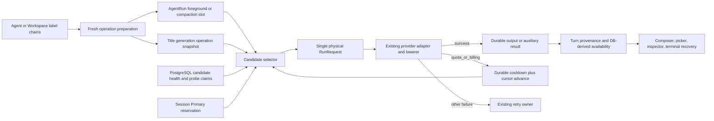

# Model Quota Fallback Design

- Snapshot: `model-260912`
- Requirements: [model-260912/REQ](../requirements/model-260912-quota-fallback.md)
- Decisions: [model-260912/ADR](../adr/model-260912-quota-fallback.md)

## Current Behavior and Requirement Gaps

Agents and Workspace defaults currently store an ordered list of selectable labels, but each label owns only one physical `AgentModelSelection` snapshot and one settings object. Main and Lightweight labels point at those flat options. Agent creation copies Workspace defaults, and runtime resolves a label from the current Agent snapshot without consulting current catalog data.

A Session stores semantic label intent separately from a single prepared physical `SessionInferenceState`. `RunExecutor` reuses the same Run across retries and `agent_runs.retry_state` durably preserves the failed-attempt budget, history, and next retry time through worker handover. Every classified provider failure currently uses the same full same-model retry budget even though the existing provider taxonomy already distinguishes `quota_or_billing` from ordinary `rate_limit`.

Successful output admission, turn-marker provenance, and retry-state clearing already commit atomically. Failed attempt partials are discarded and the logical request is reconstructed from durable canonical history, including cross-provider lowering before output or tool-call admission. These are suitable candidate-switch boundaries, but no durable chain, candidate cursor, shared cooldown, half-open probe, or Primary reservation exists.

Compaction resolves the Agent Lightweight model inside the foreground Run and uses the Run retry controller. Automatic title generation is independent best-effort work keyed by the title-generation event and retries only one Lightweight model. The Web editor, public v1 schemas, generated clients, Composer, live Run projection, and tests all assume one physical model per label.

## Requirement and Decision Traceability

- `REQ-1`, `REQ-7` → nested canonical chains and migration (`ADR-D1`), clean public contract (`ADR-D4`), shared nested editor (M1–M3, M10).
- `REQ-2`, `REQ-3`, `REQ-5` → bounded AgentRun operation slots and quota-before-retry progression (`ADR-D2`, `ADR-D6`; M4–M6).
- `REQ-4` → PostgreSQL cooldown/probe authority (`ADR-D3`; M7).
- `REQ-6` → fenced Session reservation and DB-derived availability (`ADR-D5`; M8, M10).
- `REQ-8` → bounded route provenance, diagnostics, metrics, and deterministic E2E (`ADR-D7`; M9, M11).

## Architecture and Ownership



Ownership is split deliberately:

- Agent and Workspace JSONB own configured label chains.
- AgentRun foreground and compaction slots own frozen in-flight routing and candidate outcomes.
- The title-generation event owns the independent title operation snapshot.
- PostgreSQL candidate-health rows own Workspace cooldown, reservation, probe lease, and generation fencing.
- AgentSession owns one pending Primary reservation for the concrete Session.
- Existing retry state owns non-quota retry count and backoff for the current candidate.
- Durable events and turn markers own completed model output and applied route provenance.
- Redis/WebSocket publish invalidation and live observations only; REST/DB state repairs any loss.

## M1. Canonical Agent and Workspace Chain Model

Replace the core flat option with these semantic records:

```text
SelectableModelOption
- label
- subagent_enabled
- subagent_guidance
- candidates[1..5]

SelectableModelCandidate
- model_selection
- settings
  - context_window_tokens
  - max_output_tokens
  - builtin_tools
```

The outer selectable-label list keeps its existing 1–10 bound and label order. Validation trims and uniquely validates labels, validates label-level subagent guidance, rejects duplicate `(llm_provider_integration_id, model_identifier)` within one label, resolves every submitted candidate through the current stored catalog projection, and validates candidate settings against that candidate snapshot. Separate labels may contain the same physical identity.

The first candidate supplies the label's Primary selectable reasoning-effort levels and execution-option definitions. Composer remains label-oriented and does not calculate candidate intersections. Runtime compatibility checks every later candidate against the immutable explicit request and skips unsupported reasoning effort or execution options.

Agent and Workspace JSONB remain authoritative. Internal denormalized main/lightweight selection columns remain exact derived mirrors of the selected labels' Primary candidates for current internal read seams; all writes update chains, labels, and mirrors in one repository transaction. No runtime path builds a candidate from live catalog state.

## M2. Existing-Row Migration and Database Invariants

Generate one Alembic revision after the current head and update `db-schemas/rdb/revision`. For every Agent and Workspace option, lift `settings.subagent_enabled` and `settings.subagent_guidance` to label level and place the existing selection plus remaining settings into the first candidate.

Replace the current outer-array checks with named checks that retain valid label counts and require every stored option to contain an array of one through five candidates. Application typed decoding and service validation remain authoritative for complete nested object shape, label uniqueness, duplicate physical identity, and catalog-backed candidate construction.

The migration also creates the AgentRun operation-state column, Session reservation/title-operation columns or equivalent typed JSON state, and the candidate-health table described below. Existing candidate-health and reservation state starts empty. Historical event payloads remain readable; only current mutable Agent/Workspace rows receive the clean shape rewrite.

The migration is coordinated and non-overlapping because old application code cannot decode the new chain shape and new code has no legacy row reader. Stop old API/Worker/background-title processes, apply the migration, deploy the new API/Worker/Web and regenerated clients, then resume work. Before any new-format write, rollback may restore the old release only together with a verified database downgrade. After new-format configuration is written, recovery is roll-forward; collapsing a chain to one model is not an automatic rollback.

## M3. Public v1 API and Generated Clients

Cleanly replace public `SelectableModelOptionInput` and response schemas with label policy plus `candidates`. Add explicit candidate input/response records. Remove direct Agent and Workspace mutation fields that accept `model_selection`, `lightweight_model_selection`, `default_model_selection`, or `default_lightweight_model_selection`; `main_model_label` and `lightweight_model_label` remain the public selectors.

Remove singular `selectable_model_options[].model_selection/settings` response fields. Label responses expose Primary-derived reasoning and execution-option presentation needed by Composer, while candidate responses expose candidate snapshots/settings for authorized settings editors. Runtime availability is not embedded in Agent configuration responses.

Regenerate the public OpenAPI document and checked-in Python client. Regenerate the TypeScript public client during the coordinated Web build and update tRPC schemas and hand-written adapters. Admin API changes are unnecessary unless implementation search finds a current Admin consumer of the removed public shape.

The release notes must call out the breaking v1 model-settings change. Stale callers fail validation; the server contains no alias, deprecated field, singular decoder, parallel v2 mutation, or response duality.

## M4. Durable Model Operation State

Add one typed `model_operation_state` container to `agent_runs` with two nullable bounded slots:

- `foreground`: sampling for the current inference-bearing input and its tool follow-ups;
- `compaction`: context preparation for that Run.

Each slot contains a schema version, stable operation ID and kind, semantic label, requested reasoning effort and execution options, frozen ordered candidate snapshots, cursor, one current/final outcome record per candidate, and an optional transferred probe claim. Candidate snapshots persist selections and settings but never credentials. Dispatch reloads current integration authorization/secrets by ID and refreshes runtime tokens through existing provider-specific services.

Fresh preparation writes the complete applicable chain before provider dispatch. The single physical `SessionInferenceState` remains the current-candidate lowering/provenance snapshot and is replaced from the operation slot whenever the cursor advances. The foreground slot survives tool calls and follow-up model steps for the same promoted input. A later input/profile boundary replaces it with a newly resolved chain. Compaction has an independent slot so it cannot erase foreground recovery state.

Every operation transition is fenced by Session owner generation, Run ID, operation ID, and expected current state. Intermediate successful calls may append tool calls, tool results, and turn provenance while retaining the foreground slot for the same promoted input. Final end-turn completion after admitted client tools finish clears the foreground slot in the existing output/turn-marker/retry-clear transaction. A newly promoted input/profile boundary replaces it, while User Stop or terminal Run finalization clears it defensively. Compaction success, stale plan, cancellation, and terminal compaction failure clear only its slot.

## M5. Candidate Preparation and Compatibility

A shared typed candidate-selection service consumes a frozen operation state and current candidate-health snapshot. It records closed skip outcomes for active cooldown, busy probe, duplicate previously quota-attempted identity, and unsupported explicit reasoning/execution options. It does not downgrade the request or create cooldown for incompatibility.

For the selected candidate, preparation rebuilds the existing physical `RunRequest`: integration credentials, provider/model, candidate settings, built-in tools, effective context/output limits, execution options, and provider-specific lowering. Candidate-specific effective context calculation reuses the existing window and compaction boundaries. If the current transcript exceeds the selected candidate's effective threshold, context preparation may run before dispatch through the independent Lightweight compaction slot. Existing non-quota preparation and lowering failures retain their current failure category rather than being mislabeled as quota fallback.

The service is shared at the selection/health layer only. Foreground sampling, compaction, and title keep their distinct output, retry, cancellation, and persistence owners instead of using one generic provider-call loop.

## M6. Quota-Before-Retry Execution Flows

### Foreground sampling

`RunExecutor` handles `ModelProviderFailure(category=quota_or_billing)` before `_record_failed_run_attempt()` and retry publication. It discards failed-attempt live partials through the existing projector, then performs one DB-only transition that appends the quota outcome, renews candidate health, advances the foreground cursor, and clears retry state for the previous candidate. After commit it prepares and dispatches the next eligible candidate immediately.

Each candidate owns a fresh instance of the existing non-quota retry budget. Ordinary rate limit, transport, provider unavailable, invalid request, and other categories stay on the current candidate and continue through the current retry/finalizer contract. If selection records `chain_exhausted`, the Run enters the failed-run terminal boundary once with bounded chain metadata and no chain restart.

User Stop remains higher priority than failure persistence or cursor advancement. A durably observed quota outcome survives worker handover. Process loss before an outcome reaches the fenced transition remains an unknown in-flight attempt under current recovery semantics and is not inferred as quota.

### Context compaction

Before compaction provider dispatch, persist the Lightweight chain in the compaction slot. Quota advances that slot before the generic Run retry controller. Each candidate change rebuilds the compaction plan from current durable transcript boundaries; the existing final head/tail revalidation still discards a stale summary without marker or head change. Non-quota failure uses the current owning Run retry budget. Compaction exhaustion fails the owning foreground preparation through one terminal failed-run path.

### Automatic title generation

Add a typed title model-operation snapshot conditioned on the existing `title_generation_event_id`. It freezes the initial eligible prompt boundary and current Lightweight chain. Quota renews shared health and advances before the title retry policy. Non-quota failures retain the existing best-effort retry/backoff. Structured-output-to-plain-text compatibility transition remains an internal same-candidate envelope transition and has a separate flag/counter.

Background title and compaction skip active cooldown/probe identities and never acquire half-open claims. A background quota result still updates shared candidate health. Title exhaustion leaves the deterministic initial title, emits bounded evidence, and cannot fail the foreground Run. Manual title changes or superseded generation events conditionally clear stale title operation state.

## M7. PostgreSQL Candidate Health and Half-Open Claims

Create one candidate-health row keyed by Workspace, integration ID, and model identifier. Store a monotonic generation, cooldown deadline, optional claim kind (`reservation` or `probe`), owner identity, and claim deadline. Use database time for all comparisons.

On quota, upsert a higher generation with `cooldown_until = database_now + 5 minutes` and clear every older matched claim owner. Before the deadline, ordinary operations skip the candidate; only a matching Primary reservation transferred through M8 may perform the approved one-shot bypass. After the deadline, the first foreground operation may atomically claim a higher-generation probe lease. Other operations skip while that lease is active. Background operations never claim.

A matching probe success deletes or clears the row. A matching quota result writes a new cooldown generation. That generation change immediately revokes any older Session reservation or probe authority even when a concurrently dispatched request created the older claim after it began. An expired probe lease can be replaced by a higher generation. Every completion compares owner and generation so a stale Worker cannot clear or renew newer state. Rows remain after cooldown expiry until a successful foreground probe proves recovery; this preserves the half-open requirement when a candidate is unused for a long period. Integration deletion cascades its obsolete rows.

Selection reads healthy candidates without taking long locks. Only claim/renew/clear transitions lock the exact candidate row in short database-only transactions. Redis may publish invalidation but never allocates, extends, clears, or restores health authority.

## M8. Session Primary Reservation and Availability API

Add one nullable typed Primary reservation to concrete root Sessions. It stores semantic label, exact Primary integration/model identity, reservation generation, and database creation/expiry times. Reserving also places the unique `reservation` claim on the M7 candidate-health row; the lease is at most five minutes. The server creates this state only when the exact Primary has an active cooldown or an expired cooldown awaiting half-open recovery. A fully healthy Primary returns the current availability without creating a reservation or claim.

Add idempotent reserve and cancel mutations under the existing Session write authorization boundary. The reserve request carries the expected label and exact Primary identity from the latest availability response. Only the same Session's identical active reservation is an idempotent success. A healthy Primary, stale label/Primary, non-root/draft Session, unavailable authorization, or another active reservation/probe returns a bounded conflict and current availability. Cancellation uses expected reservation generation so stale UI cannot cancel a newer reservation.

During fresh foreground preparation, the same label and exact Primary plus request compatibility allow one transaction to transfer the Session reservation and Workspace claim into the foreground operation slot only while candidate-health generation, reservation generation, and owner still match. The Session reservation is consumed only on successful transfer. Provider dispatch follows commit. Label change, exact Primary replacement, archive/removal, expiry, explicit cancellation, or a newer candidate-health generation revokes the reservation. A pre-transfer unrelated failure leaves it armed.

Add a DB-derived model-availability projection to the authoritative Session/live/bootstrap response and reserve/cancel responses. A Session reservation is active only when its exact candidate identity, health generation, reservation generation, and owner match the current candidate-health claim. Generation mismatch immediately projects cooldown/probe state without `primary_next`; transfer/cancel or the next authoritative Session mutation conditionally clears the stale row, and best-effort invalidation prompts earlier refetch. Lease expiry is the final cleanup bound. The projection contains Primary public display/identity, `available | cooldown | probing | primary_next`, deadline, server time, first compatible usable fallback display, and current Session reservation. Compatibility is evaluated against the latest persisted Session model profile; an unsaved Composer draft first uses the existing profile update and then refetches availability. The projection excludes the full fallback order, other owner identity, and raw diagnostics.

The current Session publishes best-effort availability invalidation after health/reservation transitions. Other open Sessions converge through `/live` resync, picker-open/focus refetch, deadline-triggered refetch, and the next Run snapshot; no Workspace-wide real-time fanout is correctness authority.

## M9. Applied Route Provenance, Terminal Diagnostics, and Observability

Extend turn-marker applied provenance with operation ID/kind, candidate ordinal/role, exact provider/integration/model identity, public display name, and current allowlisted effective limits. Requested semantic label, effort, and execution options remain separate. Historical readers decode absent route fields as unavailable, while all new constructors write them explicitly.

Do not add text or badges to assistant responses. The context inspector or a dedicated explicit details surface reads immutable turn-marker provenance. Each operation retains exactly one bounded mutable/final record per candidate: `pending` becomes `active` and then one of `succeeded | quota_or_billing | cooldown | probe_busy | incompatible`. `succeeded` is final only when that candidate completes the logical operation; an intermediate tool-producing call keeps the record active with the foreground slot. Chain exhaustion is an operation-level terminal code, so at most five candidate records exist. Each record carries candidate ordinal, safe display/identity, database timestamp, and typed reason. Provider-authored text remains governed by the existing bounded redaction contract.

Add low-cardinality metrics for operation kind, provider family, candidate role, transition/result/reason, progression latency, fallback success, exhaustion, probe grant/busy/recovery, reservation lifecycle, and repeated-candidate invariant violations. Workspace, Session, integration, and model identifiers belong only in structured log correlation fields. Prompts, outputs, credentials, raw bodies, headers, and arbitrary provider payloads are excluded.

## M10. Web Configuration and Recovery Surfaces

Refactor the shared `SelectableModelOptionsEditor` form model into ordered label values with ordered candidate values. Reuse the catalog picker, drag primitives, and settings modal, but key modal/edit state by both label and candidate identity. Label reorder remains separate from candidate reorder. Enforce one-to-five candidates, duplicate physical identity, last-candidate removal, unsaved whole-list state, and read-only permissions in the form while the server independently validates all rules.

Desktop renders compact candidate rows; narrow layouts render vertical candidate cards. Candidate settings show only controls supported by that candidate. `Primary settings copy` is a local one-time form action that copies compatible values and reports omitted settings. Save remains the existing Agent or Workspace whole-form mutation. Workspace defaults continue to populate only untouched new-Agent forms.

Composer model intent remains label-only. Primary-derived effort and execution-option definitions drive controls. Remove the physical model identifier secondary line from the normal label picker. Add compact `Fallback` and `Primary next` states from the authoritative availability projection. The detailed cooldown/current fallback/countdown/reserve/cancel controls live inside the existing desktop Popover and mobile bottom Drawer. Active Run progress may show a compact candidate transition, but assistant bubbles remain unchanged.

Run retry/exhaustion UI consumes bounded terminal chain metadata and keeps the existing manual `Retry run` action distinct from Primary reservation. REST and WebSocket decode treat authoritative null/absence and generations consistently with current live-state replacement rules. Storybook covers each pure chain, badge, reservation, conflict, exhaustion, read-only, error, and mobile state.

## M11. Deterministic E2E-First Test Strategy

### Primary verification matrix

Required credential-free E2E covers:

1. migrated one-candidate rows consumed through the clean v1 Agent/Workspace chain API, plus chain CRUD, reorder, copy, validation, and read-only authorization;
2. Workspace chain deep-copy to a new Agent and later default independence;
3. foreground Primary quota followed by compatible fallback success with one durable answer and no inline marker;
4. reasoning/execution incompatibility skip and unchanged explicit request;
5. quota versus ordinary rate-limit behavior;
6. same logical operation never calling an already quota-attempted candidate again;
7. Workspace cooldown shared by concurrent Sessions;
8. cooldown expiry with one half-open winner, busy skips, crash/lease expiry, and stale-completion fencing;
9. worker shutdown/handover preserving foreground and compaction slots, cursor, retry state, and probe ownership;
10. User Stop and manual failed-run retry fresh-chain behavior;
11. Primary reserve, idempotency, conflict, cancel, expiry, stale Primary, transfer, success, and renewed quota;
12. a concurrently dispatched quota result advancing candidate-health generation after reservation creation, revoking `primary_next`, rejecting stale transfer, and converging through REST/live invalidation;
13. Lightweight compaction fallback, stale-plan safety, and foreground-slot independence;
14. Lightweight title fallback, envelope compatibility, deterministic-title retention, and manual-title race;
15. chain exhaustion terminal diagnostics and Retry entry;
16. immutable actual-candidate turn provenance and explicit details presentation;
17. Redis unavailable/empty recovery from PostgreSQL authority;
18. desktop Agent/Workspace editor and Composer picker states;
19. mobile candidate cards, Drawer recovery action, keyboard/non-pointer reorder alternative, and scroll reachability.

The migration transform and database constraints are primarily verified by migration/schema
integration tests. Required E2E starts from a migrated representative state and proves that the new
application consumes and updates it correctly; it does not replace the migration harness.

### Test substrate

Extend the deterministic model-provider fake or AIMock matching so scripted outcomes select integration/model and expose attempt-admitted/release barriers plus a request journal. Add DB-time injection or a bounded test control for cooldown/reservation deadlines. Use explicit Worker shutdown/handover controls and authoritative API/DB state polling. Fixed sleeps never establish ordering.

The provider fake is a prerequisite/evidence surface, not a second product implementation. Required CI uses no live provider credential. Optional live quota tests may diagnose provider classification but cannot satisfy acceptance criteria.

### Supporting checks

Repository and unit tests cover typed validation, migration transforms/checks, catalog snapshot construction, exact duplicate identity, operation-state serialization, owner/generation CAS, retry interception order, title counters, live/public schema decoding, metrics cardinality, and redaction. Run backend Ruff, configured type checker, focused/full pytest as appropriate; regenerate OpenAPI/Python client and run TypeScript format, lint, typecheck, build, Storybook/static checks, public API E2E, Web E2E, code review, and spec review.

## Security, Permissions, and Data Safety

Agent and Workspace chain mutations preserve existing authorization. Reserve/cancel uses the existing concrete root Session write authorization; no draft, archived, inaccessible, or subagent Session can own a reservation. Integration IDs remain scoped to the owning Workspace and every candidate save and dispatch revalidates that boundary.

Candidate health contains no credentials or request/output content. AgentRun and title snapshots store model selection metadata/settings but not secrets; credentials are loaded just before dispatch. Provider diagnostics retain the current sanitizer and bounded typed fields. Public availability hides other Session owners and raw provider taxonomy details beyond the approved quota status.

All provider and coordination calls occur outside database transactions. Cooldown, cursor, reservation, and output transitions use short repository-owned transactions. Stale owner generations and expected-state mismatches fail closed.

## Migration, Rollout, and Rollback

Deliver as a staged implementation under one approved Design, with a coordinated final cutover:

1. Add deterministic provider/test controls and typed internal records behind no active product path.
2. Add migration, repositories, and runtime chain/cooldown state while retaining build-time coordination inside the branch.
3. Cut backend APIs, OpenAPI, generated clients, Web forms, and fixtures to the new schema.
4. Complete engine sampling, compaction, title, recovery, observability, and UI integration.
5. Update Living Specs and run the full E2E/quality matrix.
6. For deployment, stop old readers/writers, apply migration, deploy the complete new release, verify health and representative chain reads, then resume work.

The final merged code contains no feature flag, dual schema, old decoder, or mixed mutation mode. Rollback before new writes requires old application plus database downgrade. After new-format writes, rollback is roll-forward repair because automatic chain collapse would destroy authorized configuration. Cooldown/reservation tables may be cleared only through an explicit incident response that accepts temporary loss of suppression, never as ordinary application rollback.

## Living Spec and Generated Surface Updates

Update at implementation completion:

- `docs/azents/spec/domain/agent.md`
- `docs/azents/spec/domain/model-catalog.md`
- `docs/azents/spec/domain/conversation.md`
- `docs/azents/spec/flow/agent-execution-loop.md`
- `docs/azents/spec/flow/run-resume.md`
- `docs/azents/spec/flow/context-compaction.md`
- `docs/azents/spec/flow/session-context-inspector.md`
- `docs/azents/spec/flow/chat-session-resync.md`
- `docs/azents/spec/flow/test-strategy-e2e-primary.md` when the deterministic provider controls become shared policy.

Regenerate `python/apps/azents/specs/public/openapi.json`, the checked-in Python public client, and the TypeScript public client used by the Web build. Rename current test/helper wording where “fallback” means missing-label first-option normalization so it cannot be confused with quota candidate fallback.

## Feasibility Assessment

- `REQ-1`: **feasible** — current JSONB whole-list settings, catalog resolution, shared editor, and migration precedent provide direct seams.
- `REQ-2`: **feasible** — requested label/effort/options are already durable and candidate support is available in saved model snapshots.
- `REQ-3`: **feasible** — the provider taxonomy and RunExecutor retry owner provide an exact quota interception point; canonical request reconstruction supports candidate switching.
- `REQ-4`: **feasible** — PostgreSQL is already the durable cross-worker authority; the new exact-key fenced row is bounded and requires no external service.
- `REQ-5`: **feasible with coordinated state changes** — AgentRun recovery and owner-generation locks are reusable, but the dual operation slots must be added to every terminal/recovery path.
- `REQ-6`: **feasible** — current model-profile authorization, Popover/Drawer, `/live` resync, and local availability decode are reusable.
- `REQ-7`: **feasible with a maintenance cutover** — existing rows transform deterministically, but clean schema replacement precludes rolling mixed-version readers.
- `REQ-8`: **feasible after deterministic fake extension** — existing request journal, fail-sequence, browser E2E, and Worker controls cover the required evidence once matching/barriers and DB-time controls are added.

No requirement is blocked. The maintenance cutover and deterministic provider-fake extension are implementation obligations, not unresolved product or architecture decisions.

## Removal and Replacement

| Existing unit or behavior | Removal authority | Replacement or remaining authority | Removal boundary | Absence verification |
| --- | --- | --- | --- | --- |
| Singular selectable option `model_selection/settings` storage shape | `REQ-1`, `REQ-7`; `ADR-D1` | Uniform label `candidates` plus label subagent policy | Core types, Agent/Workspace JSONB, service/repository DTOs, fixtures | Strict decode/migration tests; repository search for singular option access |
| Direct Agent main/lightweight and Workspace default model-selection mutation fields and compatibility decoders | `REQ-1`, `REQ-7`; `ADR-D4` | `main_model_label`, `lightweight_model_label`, nested candidates | Agent/Workspace v1 requests, service compatibility branches, OpenAPI, generated clients, tRPC | OpenAPI diff and generated-client compile; grep removed inputs/decoders |
| Public denormalized main/lightweight effective-selection response mirrors | `REQ-1`, `REQ-7`; `ADR-D4` | Label chain responses and Primary-derived label capability projection; internal DB mirrors remain derived-only | Agent and Workspace v1 responses, OpenAPI, generated clients, Web adapters | Response schema snapshots and grep removed response fields |
| Outer-only JSONB count checks | `REQ-1`; `ADR-D1` | Label count plus per-label 1–5 candidate checks | Agent and Workspace constraints | Migration schema inspection and invalid-row tests |
| Session single-model snapshot as complete retry routing authority | `REQ-3`, `REQ-5`; `ADR-D2` | Current-candidate Session snapshot derived from AgentRun operation slot | preparation, recovery, handover, retry | Restart/handover E2E and constructor search |
| One undifferentiated full retry budget for quota failures | `REQ-3`; `ADR-D6` | quota-before-retry candidate transition; existing retry for other categories | RunExecutor, compaction, title | Provider journal assertions and terminal-state tests |
| Same-model-only title and compaction quota retries | `REQ-3`, `REQ-5`, `REQ-7`; `ADR-D6` | independent Lightweight operation chains | compaction/title services and snapshots | scripted candidate E2E and state cleanup tests |
| Flat model settings editor and candidate-agnostic modal key | `REQ-1`, `REQ-6`; `ADR-D1`, `ADR-D4` | nested label/candidate editor | Agent and Workspace Web forms/stories | desktop/mobile browser E2E and story states |
| Live/session contracts without availability/reservation | `REQ-4`, `REQ-6`; `ADR-D5` | DB-derived availability and fenced reserve/cancel | Chat API, live projection, Web decode | REST/WS/reload convergence tests |
| Turn provenance without candidate route | `REQ-8`; `ADR-D7` | bounded immutable applied route | turn marker, inspector, terminal metadata | history/reload provenance E2E |
| Generated public clients for singular shape | `REQ-1`, `REQ-7`; `ADR-D4` | regenerated clean chain clients | Python and TypeScript public clients | generator checks, typecheck, build |

No provider adapter, failure taxonomy, canonical transcript, existing tool-call recovery, Session label intent, authorization model, or assistant response format is removed.

## Non-Blocking Risks

- Clean public v1 and storage cutover requires a maintenance deployment and coordinated client update.
- A user can reserve a half-open opportunity for up to five minutes without sending work; fallback remains available.
- Candidate-specific context limits can cause additional compaction or a non-quota preparation failure after a Primary quota result.
- Availability events may be delayed without Redis/WebSocket, but authoritative REST and runtime selection converge from PostgreSQL.
- Candidate-health rows intentionally remain after expiry until a successful foreground probe or integration deletion.
- Post-release evidence is still required to confirm that the compact badge is discoverable and reduces manual model switching.

## Design Authority

- Design revision: `2`

| ID | Material design mechanism | Authority | Classification |
| --- | --- | --- | --- |
| M1 | Canonical nested label/candidate configuration and derived Primary mirrors | `model-260912/REQ-1`, `REQ-7`; `ADR-D1` | `decided` |
| M2 | One-candidate data migration, nested checks, and coordinated non-overlapping cutover | `model-260912/REQ-7`; `ADR-D1`, `ADR-D4` | `decided` |
| M3 | Clean public v1 chain schema and regenerated clients | `model-260912/REQ-1`, `REQ-7`; `ADR-D4` | `decided` |
| M4 | Bounded AgentRun foreground and compaction operation slots | `model-260912/REQ-3`, `REQ-5`; `ADR-D2` | `decided` |
| M5 | Primary-owned Composer capability projection and server-side candidate compatibility | `model-260912/REQ-2`; `ADR-D1`, `ADR-D4` | `derived` |
| M6 | Quota-before-retry candidate progression for sampling, compaction, and title | `model-260912/REQ-3`, `REQ-5`; `ADR-D6` | `decided` |
| M7 | PostgreSQL candidate cooldown and fenced foreground probe claims | `model-260912/REQ-4`; `ADR-D3` | `decided` |
| M8 | Bounded Session Primary reservation, transfer, and DB-derived availability | `model-260912/REQ-4`, `REQ-6`; `ADR-D5` | `decided` |
| M9 | Immutable applied-route provenance, bounded terminal diagnostics, and low-cardinality telemetry | `model-260912/REQ-8`; `ADR-D7` | `decided` |
| M10 | Shared nested settings editor and Composer/picker/mobile recovery presentation | `model-260912/REQ-1`, `REQ-6`; `ADR-D4`, `ADR-D5` | `derived` |
| M11 | Credential-free deterministic provider fake and E2E-first acceptance matrix | `model-260912/REQ-8`; `ADR-D7`; current E2E-primary Spec | `decided` |
| M12 | Existing label intent, provider classification, canonical transcript, retry finalizer, Stop, and authorization boundaries retained | `model-260912/REQ-2`, `REQ-3`, `REQ-5`; current Agent, conversation, execution-loop, run-resume, and compaction Specs | `existing` |

Authority audit result: every Requirement has at least one mechanism, every material mechanism has confirmed Requirement/ADR or unchanged Spec authority, and no optional second routing, cooldown, mutation, or response authority remains.

## Design Approval

- Mode: `Autonomous`
- Decision owner: delegated autonomous technical decision owner
- Approved on: 2026-09-12
- Approved Design revision: `2`
- Approved authority IDs: `M1, M2, M3, M4, M5, M6, M7, M8, M9, M10, M11, M12`
- Approved scope: Agent/Workspace label-local candidate chains and migration; clean public v1
  cutover; durable foreground, compaction, and title routing state; quota-before-retry progression;
  PostgreSQL cooldown, half-open probe, and Session Primary reservation generation fencing;
  DB-derived availability and stale-reservation convergence; bounded applied-route provenance and
  diagnostics; desktop/mobile configuration and recovery UI; credential-free deterministic E2E
  evidence; and coordinated rollout/removal.
- Authority audit: passed for `REQ-1` through `REQ-8` and `M1` through `M12`.
- Feasibility and removal/replacement audits: passed with no blocked Requirement.
