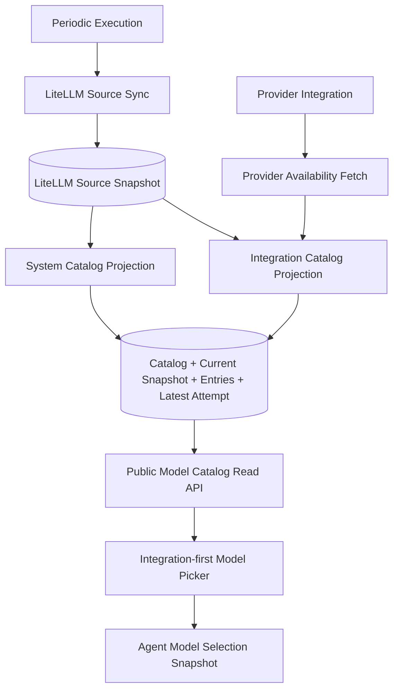

# Model Catalog Projection and Sync Design

## Overview

Azents currently lists selectable models by calling provider or external catalog sources on the normal read path. For AWS Bedrock, this means the model picker can call `ListFoundationModels` with a user integration credential. When that credential lacks listing permission, the provider error becomes a server-side listing failure instead of a user-visible integration catalog state.

This design replaces request-time listing with persisted catalog projections. Catalog sync fetches source data outside the normal read path, records current snapshot and latest attempt state, and exposes paginated stored entries to the model picker.

The design is based on [ADR-0067: Model Catalog Projection and Sync](../adr/0067-model-catalog-projection-sync.md). It assumes the periodic execution infrastructure from [ADR-0068](../adr/0068-periodic-execution-infrastructure.md) and `docs/azents/spec/flow/periodic-execution.md` already exists.

## Problem

The current model listing implementation has these problems:

- normal model picker reads can depend on external provider/catalog availability;
- user credential listing failures surface like Azents server failures;
- models.dev is a request-time external dependency for non-integration sources;
- Bedrock and Vertex visible models depend on integration credential, account, project, region, and permission;
- LiteLLM metadata is useful for runtime projection but should not become permanent platform truth;
- the UI cannot show catalog sync status, stale snapshot state, latest failure, model count, or infinite-scroll catalog browsing;
- agent model selection already stores a runtime snapshot, so mutable catalog rows must not silently mutate existing agents.

## Goals

- Store system and integration model catalog projections before read APIs serve them.
- Remove external catalog/provider listing calls from normal model picker reads.
- Convert user credential/provider listing failures into persisted, actionable sync state.
- Use LiteLLM model metadata as the current lowerer-target projection source without making LiteLLM permanent platform truth.
- Use provider availability plus target projection for Bedrock and Vertex integration catalogs.
- Provide an integration-first model picker with sync status, failure state, search, pagination/infinite scroll, and capability metadata.
- Preserve Agent model selection snapshot semantics.
- Use periodic execution for system LiteLLM source sync and system projections.
- Keep catalog history minimal: current successful snapshot plus latest attempt state only.

## Non-goals

- Do not build a generic scheduler or job framework in this feature; periodic execution already owns that.
- Do not add OpenAI or Anthropic API-based model listing.
- Do not keep models.dev in the catalog source path.
- Do not make LiteLLM permanent platform source of truth.
- Do not create an attempt history/audit table in v1.
- Do not add a broad admin CRUD surface for model catalog entries.
- Do not mutate existing Agent model selection snapshots when catalog entries change.
- Do not implement provider-specific alias/fuzzy matching for Bedrock/Vertex in v1.

## Current State

Backend code paths:

- `services/model_listing/__init__.py` loads integration secrets, checks workspace membership/enabled state, and calls `list_dynamic_models()` on normal reads.
- `services/model_listing/providers.py` calls models.dev, Bedrock `list_foundation_models`, or Vertex publisher model APIs depending on provider.
- Provider listing errors can be wrapped as `ListingProviderError` and escape as operational failures.
- `services/model_listing/catalog.py` already contains source adapter data shapes such as `CatalogProviderModel` and `CatalogSourceSnapshot`, but the persisted sync/projection model is not implemented.
- `AgentModelSelection` stores selected model snapshot fields on the agent, so runtime already does not require a mutable catalog FK.

Frontend state:

- The agent form uses a model select/listing flow and does not yet expose catalog sync lifecycle, paginated catalog browsing, or latest sync failure details.

Existing documentation:

- `docs/azents/design/llm-model-catalog-sync.md` is an older pre-ADR design that still references nointern-era static catalog tables and models.dev. This new design supersedes it for ADR-0067 implementation.

## Target State

Model catalog is split into two ownership scopes:

- system catalog: Azents-owned, independent of customer integration credentials;
- integration catalog: scoped to one LLM provider integration and dependent on that integration's provider visibility and configuration.

Normal read APIs return stored catalog data only. Sync jobs and explicit integration-sync operations perform external fetches and write current snapshots/attempt state.

## Requirements

### REQ-1. Split system catalog and integration catalog

Related decisions: ADR-0067-D1

Acceptance criteria:

- Catalog identity records distinguish system scope from integration scope.
- Integration-scoped catalogs are keyed by provider integration.
- Model picker selects provider integration first, not provider alone.
- Provider without enabled integration is not shown as a selectable source.

### REQ-2. Remove external listing from normal read path

Related decisions: ADR-0067-D2

Acceptance criteria:

- Model picker read APIs query stored catalog projections.
- Read APIs do not call models.dev, Bedrock `ListFoundationModels`, Vertex publisher APIs, or LiteLLM remote metadata refresh.
- Read APIs include catalog sync metadata, stale/failure state, and pagination cursor.

### REQ-3. Implement full sync units

Related decisions: ADR-0067-D3, ADR-0067-D4, ADR-0067-D5

Acceptance criteria:

- System catalog sync fetches and projects a full source list.
- Integration catalog sync fetches the full provider-visible list for one integration.
- System sync runs through periodic execution and optional admin/operator surface only.
- Integration sync runs after integration create/update, explicit user retry, or throttled stale refresh when viewed.
- Integration sync is throttled per integration/workspace and disables concurrent duplicate sync.

### REQ-4. Persist user credential failures as domain state

Related decisions: ADR-0067-D6, ADR-0067-D17

Acceptance criteria:

- Access denied, invalid credential, assume-role, invalid region/project, and permission failures are recorded as sync attempt failures.
- These failures do not surface as unhandled 5xx errors in normal model picker reads.
- Existing successful snapshot remains readable when a later sync attempt fails.
- Picker and integration detail UI show actionable failure guidance.

### REQ-5. Provide integration-first picker with catalog state

Related decisions: ADR-0067-D7

Acceptance criteria:

- Agent form shows selected model summary and opens a modal/drawer/popup for model changes.
- Picker first selects integration.
- Picker displays sync status, last synced time, model count, failure panel, search input, and infinite-scroll model list.
- Sync button is shown only for user/integration catalogs.
- Selecting a model writes selected integration and model snapshot into the form.

### REQ-6. Store canonical projection entries

Related decisions: ADR-0067-D8, ADR-0067-D9, ADR-0067-D10, ADR-0067-D18

Acceptance criteria:

- Stored entries are canonical Azents projections, not raw provider records.
- Projection includes provider integration id when applicable, provider, publisher/developer, provider model id, lowerer target, runtime model id, display name, family, capabilities, lifecycle/visibility, source metadata snapshot, and projection metadata.
- Projection records lowerer target so future target-specific projection sources can coexist.
- v1 uses LiteLLM metadata as the current projection source.
- Hygiene filters hide unsupported/noisy entries and record diagnostics.
- v1 does not require allow policy.

### REQ-7. Combine provider availability with target projection for Bedrock/Vertex

Related decisions: ADR-0067-D11, ADR-0067-D19

Acceptance criteria:

- Bedrock/Vertex integration sync fetches provider-visible models for that integration.
- Selectable entries require provider visibility and exact match against current target projection key.
- Bedrock v1 exact match uses `bedrock/{model_id}`.
- Vertex v1 exact match uses `vertex_ai/{model_id}` or `vertex_ai/{name_last_segment}`.
- Fallback normalization candidates are diagnostic only and not selectable in v1.

### REQ-8. Keep OpenAI/Anthropic listing and models.dev out of scope

Related decisions: ADR-0067-D12, ADR-0067-D14

Acceptance criteria:

- OpenAI and Anthropic system catalogs use current lowerer target projection source, not provider listing APIs.
- models.dev is not used by sync or read path.
- Any remaining models.dev code is removed from active model catalog source path or isolated as dead/legacy code until removed.

### REQ-9. Preserve Agent snapshot semantics

Related decisions: ADR-0067-D13

Acceptance criteria:

- Agent model selection continues to store a snapshot needed for runtime.
- Catalog updates do not silently mutate existing Agent selections.
- Agent edit UI can diagnose drift between current snapshot and current catalog.
- Missing/deprecated catalog entries do not block runtime by themselves.
- Deleted/disabled integration can still block runtime as integration availability failure.

### REQ-10. Store LiteLLM source snapshots separately from projections

Related decisions: ADR-0067-D15

Acceptance criteria:

- LiteLLM source sync stores the latest successful source snapshot and latest attempt metadata.
- Source snapshot records source hash, model count, source URL, LiteLLM version, loaded source, and failure metadata.
- System/integration projection reads the latest successful LiteLLM source snapshot.
- Integration sync does not fetch LiteLLM remote metadata directly.

### REQ-11. Keep current snapshot and latest attempt only

Related decisions: ADR-0067-D16

Acceptance criteria:

- Catalog records point to the current successful projection snapshot.
- Failed attempts do not overwrite current snapshots.
- When a new successful projection becomes current, previous snapshot entries can be deleted.
- Latest attempt state records status, timing, produced snapshot if any, failure code/message/action hint, and stats.
- Read APIs return current snapshot summary, latest attempt summary, and paginated entries.

## Decision Table

| ADR decision | Requirements |
| --- | --- |
| ADR-0067-D1 | REQ-1 |
| ADR-0067-D2 | REQ-2 |
| ADR-0067-D3 | REQ-3 |
| ADR-0067-D4 | REQ-3, REQ-10 |
| ADR-0067-D5 | REQ-3, REQ-4 |
| ADR-0067-D6 | REQ-4 |
| ADR-0067-D7 | REQ-5 |
| ADR-0067-D8 | REQ-6 |
| ADR-0067-D9 | REQ-6, REQ-10 |
| ADR-0067-D10 | REQ-6 |
| ADR-0067-D11 | REQ-7 |
| ADR-0067-D12 | REQ-8 |
| ADR-0067-D13 | REQ-9 |
| ADR-0067-D14 | REQ-8 |
| ADR-0067-D15 | REQ-10 |
| ADR-0067-D16 | REQ-11 |
| ADR-0067-D17 | REQ-3, REQ-4 |
| ADR-0067-D18 | REQ-6 |
| ADR-0067-D19 | REQ-7 |

## Data Model

### llm_catalogs

Logical catalog identity.

Fields:

- `id`
- `scope`: `system` or `integration`
- `provider`
- `provider_integration_id`, nullable for system catalog
- `lowerer_target`
- `current_snapshot_id`, nullable until first success
- `latest_attempt_id`, nullable until first attempt
- `stale_after`
- `created_at`, `updated_at`

Constraints:

- one system catalog per provider/lowerer target;
- one integration catalog per provider integration/lowerer target.

### llm_catalog_snapshots

Current successful projection snapshot. History is not retained in v1 beyond current snapshot during replacement.

Fields:

- `id`
- `catalog_id`
- `source_snapshot_id`
- `entry_count`
- `visible_count`
- `hidden_count`
- `diagnostics`
- `created_at`

### llm_catalog_entries

Projected model entries for one successful snapshot.

Fields:

- `id`
- `catalog_id`
- `snapshot_id`
- `provider_integration_id`, nullable for system entries
- `provider`
- `publisher`
- `provider_model_identifier`
- `lowerer_target`
- `runtime_model_identifier`
- `display_name`
- `family`
- `normalized_capabilities`
- `lifecycle_status`
- `visibility_status`
- `source_metadata`
- `projection_metadata`
- `hidden_reason`, nullable
- `created_at`

Indexes:

- `(catalog_id, display_name)` for browsing/search;
- `(catalog_id, provider_model_identifier)` for lookup;
- `(snapshot_id)` for current snapshot entry replacement.

### llm_catalog_sync_attempts

Latest attempt state. v1 may keep only the latest attempt per catalog/source by replacing or pruning old rows.

Fields:

- `id`
- `catalog_id`, nullable for source-only attempts
- `source_key`
- `status`: `running`, `succeeded`, `failed`
- `started_at`, `finished_at`
- `produced_snapshot_id`, nullable
- `failure_code`, `failure_message`, `action_hint`
- `fetched_count`, `matched_count`, `skipped_count`, `hidden_count`
- `diagnostics`

### litellm_source_snapshots

Latest successful LiteLLM source metadata.

Fields:

- `id`
- `source_key`
- `source_url`
- `source_hash`
- `model_count`
- `litellm_version`
- `loaded_source`: `remote` or `bundled_fallback`
- `payload`
- `created_at`

The payload is internal source data and is not returned by public model picker APIs.

## Backend Behavior

### Source sync

LiteLLM source sync runs through periodic execution. It fetches or loads LiteLLM model metadata, validates it, computes source hash, records latest attempt, and updates latest successful source snapshot only on success.

If source sync fails, the previous successful source snapshot remains active and the latest attempt records failure.

### System catalog projection

System projection reads the latest successful LiteLLM source snapshot and projects provider catalogs for providers that do not require customer integration listing. OpenAI, Anthropic, Gemini, and ChatGPT OAuth-compatible OpenAI listings are projection-source based in v1.

System projection is periodic/admin only. Normal users cannot trigger it.

### Integration catalog projection

Integration projection fetches provider visibility for one integration, then intersects provider-visible models with current lowerer-target projection metadata.

Bedrock and Vertex use exact-only matching in v1. Non-matching provider-visible models are hidden with diagnostics.

Integration sync can start after integration create/update, explicit user retry, or throttled stale refresh while viewed. Create/update succeeds even if the initial background catalog sync later fails.

### Error classification

Credential/config failures become catalog attempt state, not unhandled server errors.

Examples:

- access denied;
- invalid access key or secret;
- assume role denied;
- invalid region/project;
- missing Bedrock/Vertex list permission.

Transient provider failures also become controlled sync failures. They can be retried according to integration-specific throttle/backoff.

### Read API

Public read APIs query stored projections only.

Required API capabilities:

- list catalogs/integrations available to a workspace member;
- read one catalog's sync summary;
- paginate/search catalog entries;
- request integration catalog sync/retry;
- read current selected snapshot diagnostics for an Agent edit screen.

Responses include current snapshot summary, latest attempt state, entries, and pagination cursor. Raw source payloads are not exposed.

## Frontend Behavior

### Agent form summary

Agent form shows selected model summary and a model change affordance. It does not render the full provider model select inline.

### Model picker modal/drawer

The picker flow:

1. Select integration.
2. Show catalog status and model count for that integration.
3. If latest attempt failed and no current snapshot exists, show an error panel with retry action.
4. If current snapshot exists and latest attempt failed, show entries plus a warning banner.
5. Search and infinite-scroll entries.
6. Show capability badges and lifecycle/visibility diagnostics.
7. Select model and write integration id plus model snapshot back to the form.

### Sync controls

User-triggered sync is available only for integration catalogs. The button is disabled while a sync is already running or throttle/backoff blocks retry. System catalog sync is not user-triggered.

### Drift diagnostics

When editing an existing Agent, the UI compares selected snapshot to current catalog. If the selected model is missing, deprecated, removed, or has changed capabilities, the UI shows warning/diagnostic while preserving existing selection unless the user changes it.

## Permissions

- Workspace members can read catalogs for integrations visible in their workspace according to existing integration access rules.
- Integration sync retry requires permission equivalent to editing/operating that integration.
- System sync/admin operations are operator/admin-only and not exposed to ordinary workspace users.
- Catalog raw source payloads and provider credentials are never exposed through public APIs.

## Operational Prerequisites

- Periodic execution scheduler is deployed and heartbeat-verified.
- LiteLLM source sync task can perform outbound fetch or use bundled fallback according to environment policy.
- Sentry/logging records source sync and projection failures.
- Existing deterministic fixture support is updated so E2E can run without live provider credentials.

## Rollout and Failure Modes

### Rollout

- Introduce new persisted catalogs alongside the current request-time listing path.
- Backfill or first-sync system catalogs.
- Switch read APIs/model picker to stored projections.
- Add integration sync retry and failure UI.
- Remove request-time models.dev/provider listing from normal model picker reads after stored path is verified.

### Failure modes

- **No successful source snapshot**: system catalog read returns empty/error state with latest failure details.
- **Source sync failure after prior success**: keep prior source/projection and show stale/failure warning.
- **Integration credential failure**: show integration catalog failure and retry/configuration guidance.
- **Provider transient failure**: preserve previous snapshot, schedule retry according to policy.
- **Projection mismatch**: hide unmatched models, record diagnostics, and show hidden/matched counts.
- **Selected snapshot missing from current catalog**: preserve Agent snapshot and show drift warning.

## Test Strategy

Product behavior verification is E2E-primary. testenv is used only for fixture/prerequisite support that enables deterministic E2E execution or live prerequisite snapshots.

### E2E primary verification matrix

| Behavior | E2E primary | Expected result |
| --- | --- | --- |
| System catalog stored read path | Seed/sync fixture LiteLLM source, open model picker for non-integration/system provider | Picker reads stored catalog, shows model count and entries without external network. |
| Integration catalog first sync success | Create deterministic integration fixture and wait for background sync | Integration detail/picker shows succeeded sync and entries. |
| Integration credential failure | Create integration fixture whose provider listing returns access denied | Create/update succeeds; picker shows catalog failure panel, not server 500. |
| Current snapshot survives failed retry | Start with successful integration snapshot, then force retry failure | Picker still shows old entries and warning banner. |
| Manual integration retry | Trigger sync from picker/integration UI | Button disables while running; latest attempt updates; success/failure is visible. |
| Infinite scroll/search | Browse a fixture catalog with more than one page | Cursor pagination returns stable pages and search filters stored entries. |
| Agent snapshot preservation | Select a model, update catalog so model is missing/deprecated, edit Agent | Existing selection is preserved with drift warning. |
| Bedrock/Vertex exact matching | Fixture provider-visible rows include matched and unmatched entries | Only exact target-projected models are selectable; unmatched rows are diagnostics. |

### Unit/integration support checks

- Source snapshot validation and hash calculation.
- LiteLLM source sync success/failure/fallback paths.
- System projection hygiene filters and diagnostics.
- Bedrock/Vertex exact match logic.
- Catalog repository current snapshot replacement and previous entry cleanup.
- Latest attempt state success/failure behavior.
- Read service never calls external providers on list/search/detail.
- Permission checks for integration catalog read/sync retry.

### Fixture and prerequisite requirements

- Deterministic LiteLLM source fixture with enough model metadata for OpenAI, Anthropic, Bedrock, and Vertex scenarios.
- Deterministic provider availability fixtures for Bedrock/Vertex success, access denied, transient failure, matched, and unmatched rows.
- No live credentials are required for deterministic CI.
- Optional live verification can use prerequisite snapshots for Bedrock/Vertex credentials, but deterministic E2E must not require them.

### Evidence format

Verification phase must record:

- commands run;
- working directory;
- fixture/prerequisite snapshot used;
- HTTP response or UI trace evidence for picker states;
- sync attempt/snapshot DB summaries with secrets redacted;
- PASS verdict per matrix row;
- fixes applied for any failure.

### CI execution policy

- Deterministic E2E and backend tests run in normal CI.
- Live/external provider verification is optional and gated by the existing live-external policy.
- Requested live verification fails when credentials are missing; nightly optional verification records prerequisite-not-ready as skip summary.

### Skip/fail criteria

- A product behavior row cannot be considered verified by unit/static checks alone.
- If fixture support is missing, add fixture support or E2E coverage before marking verification complete.
- Live provider checks can be skipped only when they are optional; deterministic equivalent must still pass.

## QA Checklist

### QA-1. Normal read path has no external listing calls

#### What to check

Verify model picker read APIs only read stored projections and do not call models.dev, Bedrock, Vertex, or LiteLLM remote fetch.

#### Why it matters

This is the main reliability and credential-error isolation goal.

#### How to check

Run deterministic E2E with external network/provider fixtures disabled, inspect service code, and add tests that fail if read services call external adapters.

#### Expected result

Model picker list/search/detail works from stored catalog only.

#### Execution result

TBD — verification phase must fill this with executed commands and evidence.

#### Fixes applied

TBD — verification phase must fill this if failures are found.

### QA-2. Credential failures are user-visible catalog state

#### What to check

Verify access denied/invalid credential/provider permission errors become sync attempt failure state.

#### Why it matters

User-owned credential issues must not become unhandled Azents server errors.

#### How to check

Run deterministic integration failure E2E and assert create/update succeeds, latest attempt records failure, and picker shows actionable panel.

#### Expected result

No unhandled 5xx; previous snapshot remains usable if present.

#### Execution result

TBD — verification phase must fill this with executed commands and evidence.

#### Fixes applied

TBD — verification phase must fill this if failures are found.

### QA-3. System and integration catalogs are separated

#### What to check

Verify system sync and integration sync have separate catalog identities and user permissions.

#### Why it matters

One user's action must not refresh global Azents-owned catalog, and integration visibility must stay scoped.

#### How to check

Run backend repository/service tests and E2E for model picker integration-first flow.

#### Expected result

System catalogs are periodic/admin only; integration sync affects one integration catalog.

#### Execution result

TBD — verification phase must fill this with executed commands and evidence.

#### Fixes applied

TBD — verification phase must fill this if failures are found.

### QA-4. LiteLLM source snapshot and projections are separated

#### What to check

Verify LiteLLM source sync stores source snapshot first and projections read from latest successful snapshot.

#### Why it matters

Integration sync must not repeatedly fetch LiteLLM metadata or mix source payloads with projections.

#### How to check

Run source sync/projection tests and inspect DB state after system and integration projections.

#### Expected result

Source snapshot metadata and projection entries are separate records.

#### Execution result

TBD — verification phase must fill this with executed commands and evidence.

#### Fixes applied

TBD — verification phase must fill this if failures are found.

### QA-5. Agent snapshot semantics are preserved

#### What to check

Verify catalog updates do not mutate existing Agent model selection snapshots.

#### Why it matters

Runtime source of truth remains the Agent snapshot; catalog drift should diagnose, not silently rewrite.

#### How to check

Run E2E where an Agent selection is made, catalog changes, and Agent edit/runtime state is inspected.

#### Expected result

Existing selection is preserved and UI shows drift warning.

#### Execution result

TBD — verification phase must fill this with executed commands and evidence.

#### Fixes applied

TBD — verification phase must fill this if failures are found.

### QA-6. Bedrock/Vertex exact matching is enforced

#### What to check

Verify provider-visible Bedrock/Vertex models are selectable only when exact current target projection match exists.

#### Why it matters

Fallback fuzzy matching can create runtime-incompatible selections.

#### How to check

Run fixture tests with matched and unmatched provider-visible entries.

#### Expected result

Matched entries are selectable; unmatched entries are hidden with diagnostics.

#### Execution result

TBD — verification phase must fill this with executed commands and evidence.

#### Fixes applied

TBD — verification phase must fill this if failures are found.

### QA-7. Requirements and ADR audit is complete

#### What to check

Compare implementation against every REQ and ADR-0067 decision.

#### Why it matters

The user explicitly requires verification to audit ADR/requirements against implementation and fill missing pieces before merge.

#### How to check

Create an audit table mapping REQ-1 through REQ-11 and ADR-0067-D1 through D19 to implementation files/tests and fix high-impact gaps.

#### Expected result

Every requirement and ADR decision is implemented and verified or explicitly marked out of scope with rationale consistent with this design.

#### Execution result

TBD — verification phase must fill this with executed commands and evidence.

#### Fixes applied

TBD — verification phase must fill this if failures are found.

## Superseded/Related Documents

- Supersedes current implementation direction in `docs/azents/design/llm-model-catalog-sync.md` where it conflicts with ADR-0067, especially models.dev source path and nointern-era static catalog table references.
- Related current specs:
  - `docs/azents/spec/domain/agent.md`
  - `docs/azents/spec/flow/agent-execution-loop.md`
  - `docs/azents/spec/flow/periodic-execution.md`
