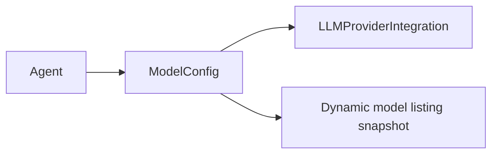
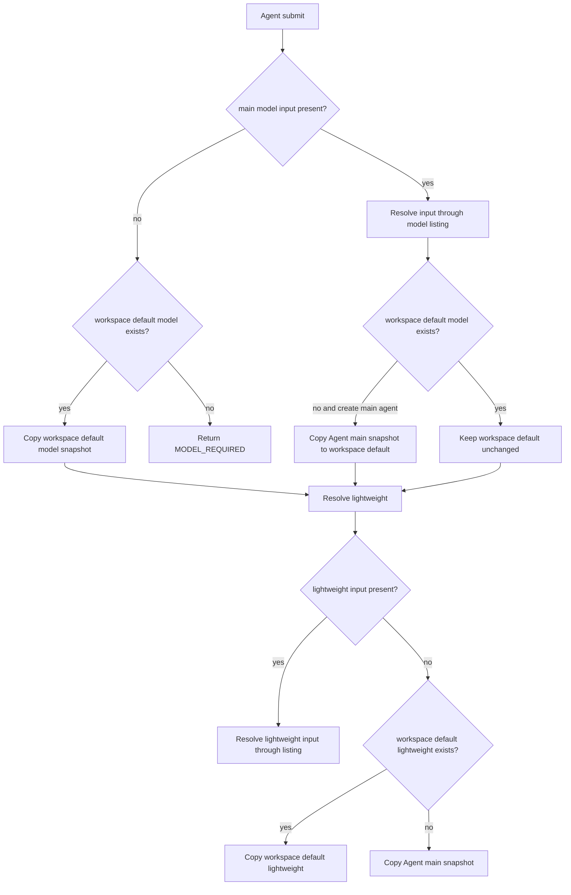
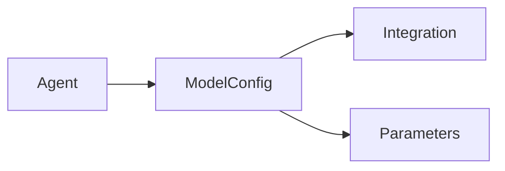
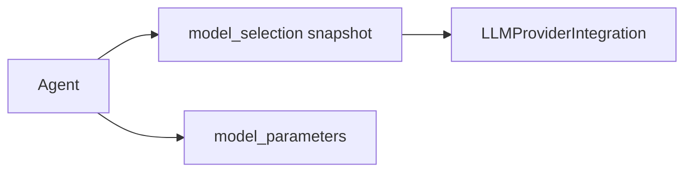

# ModelConfig Removal and Agent Model Snapshot Design

## 1. Problem / Background

Current azents model selection structure operates around `ModelConfig`.



`ModelConfig` was designed as workspace-level alias/preset, but actual Agent creation UX is closer to "choose provider integration and select catalog model." Separate `ModelConfig` CRUD creates this complexity.

- Alias/preset must be managed before Agent model selection.
- Advanced parameter defaults are split between `ModelConfig` and Agent override.
- Workspace default model is needed, but runtime alias inheritance is not needed.
- `ModelConfig` update is immediately reflected in referencing Agent and implicitly changes execution model of existing Agent.

This design removes `ModelConfig` and makes Agent directly store model catalog selection snapshot.

## 2. Goals

1. Remove `ModelConfig` table/API/service/repository/frontend route.
2. Agent create/update receives catalog model selection key and stores server-verified snapshot in Agent.
3. Introduce Workspace default main/lightweight model snapshot.
4. Workspace default is used only as copy source at Agent submit time.
5. Consolidate advanced model parameters into one Agent setting.
6. Remove Subagent model inherit mode and give subagent its own snapshot as well.
7. Remove legacy `model_config_id` API/runtime path without backward compatibility.

## 3. Non-goals

- Automatic drift correction between Agent snapshot and latest catalog listing is out of scope.
- Bulk update preset feature is out of scope.
- Provider failover, model quota, and billing policy are out of scope.
- Catalog listing cache table is out of scope.

## 4. Target Data Model

### 4.1 Agent model fields

Add these fields to `agents`.

| Column | Type | Semantics |
|---|---|---|
| `model_selection` | JSONB NOT NULL | main model runtime snapshot |
| `lightweight_model_selection` | JSONB NOT NULL | lightweight/compaction model runtime snapshot |
| `model_parameters` | JSONB NULL | Agent-local advanced parameters |

`model_selection` and `lightweight_model_selection` use same schema.

```json
{
  "llm_provider_integration_id": "int_...",
  "provider": "openai",
  "model_identifier": "gpt-5.2",
  "model_display_name": "GPT-5.2",
  "model_developer": "openai",
  "model_family": "gpt-5",
  "normalized_capabilities": {
    "context_window_tokens": 400000,
    "max_output_tokens": 128000,
    "reasoning": {
      "supported": true,
      "effort_levels": ["minimal", "low", "medium", "high"]
    },
    "builtin_tools": {
      "web_search": true,
      "image_generation": false
    }
  },
  "model_snapshot": {
    "source": "provider_listing",
    "raw_id": "gpt-5.2"
  },
  "source_metadata": {
    "listed_at": "2026-06-16T00:00:00Z"
  },
  "last_refreshed_at": "2026-06-16T00:00:00Z"
}
```

Python domain type is `AgentModelSelection`.

### 4.2 Workspace model settings

Create separate table.

```text
workspace_model_settings
- workspace_id PK/FK -> workspaces.id cascade
- default_model_selection JSONB NULL
- default_lightweight_model_selection JSONB NULL
- created_at timestamptz
- updated_at timestamptz
```

Rules:

- `default_model_selection` can initially be null.
- Once non-null, cannot be reverted to null.
- `default_lightweight_model_selection` allows null.
- effective default lightweight is `default_lightweight_model_selection ?? default_model_selection`.

## 5. API Contract

### 5.1 Model selection input

Client sends only selection key, not full snapshot.

```json
{
  "llm_provider_integration_id": "int_...",
  "model_identifier": "gpt-5.2"
}
```

Server checks integration ownership and enabled state at submit time, queries same identifier again from model listing service, and creates snapshot.

### 5.2 Agent create/update request

Remove `model_config_id`, `lightweight_model_config_id`, `model_config_inherit_mode`, `model_parameter_overrides`.

```json
{
  "name": "Agent",
  "description": null,
  "model_selection": {
    "llm_provider_integration_id": "int_...",
    "model_identifier": "gpt-5.2"
  },
  "lightweight_model_selection": null,
  "model_parameters": {
    "temperature": 0.7,
    "max_tokens": 8192,
    "reasoning_effort": "medium"
  }
}
```

Create/update resolution:



### 5.3 Agent response

```json
{
  "id": "agent_...",
  "model_selection": { "...": "snapshot" },
  "lightweight_model_selection": { "...": "snapshot" },
  "model_parameters": { "temperature": 0.7 }
}
```

Remove `effective_model_config_id`, `effective_lightweight_model_config_id`, `effective_model_config_source_agent_id`.

### 5.4 Workspace model settings API

Add new public API.

```http
GET /workspace-model-settings/v1/workspaces/{handle}
PUT /workspace-model-settings/v1/workspaces/{handle}
```

PUT request:

```json
{
  "default_model_selection": {
    "llm_provider_integration_id": "int_...",
    "model_identifier": "claude-sonnet-4-5"
  },
  "default_lightweight_model_selection": null
}
```

Response:

```json
{
  "default_model_selection": { "...": "snapshot" },
  "default_lightweight_model_selection": null,
  "effective_default_lightweight_model_selection": { "...": "snapshot" }
}
```

Validation:

- Reject `default_model_selection: null` if existing default exists.
- In workspace without initial default, PUT can send null, but settings remain incomplete.
- `default_lightweight_model_selection: null` is always allowed.

## 6. Runtime Resolve

Existing:



After change:



`resolve_invoke_input()` only does the following.

1. Check Agent enabled.
2. Read Agent `model_selection` / `lightweight_model_selection`.
3. Load `LLMProviderIntegration` by integration id in snapshot.
4. Check integration enabled / credential refresh.
5. Create runtime input from snapshot provider/model_identifier/capabilities and Agent parameters.

Remove `ModelConfigNotFound`, `ModelConfigDisabled`, default lightweight lookup, and ModelConfig parameter merge.

## 7. Migration Plan

Migration switches at once without legacy compatibility.

1. Add `workspace_model_settings` table.
2. Add `agents.model_selection`, `agents.lightweight_model_selection`, `agents.model_parameters`.
3. Backfill workspace default settings from existing `model_configs`.
4. Backfill existing Agent `model_config_id` / `lightweight_model_config_id` into snapshots.
5. If `lightweight_model_config_id` is null, backfill from workspace default lightweight, or main snapshot if absent.
6. Copy `agents.model_parameter_overrides` to `agents.model_parameters`.
7. Drop `agents.model_config_id`, `agents.lightweight_model_config_id`, `agents.model_config_inherit_mode`, `agents.model_parameter_overrides`.
8. Drop `model_configs` table.
9. Drop `agent_model_config_inherit_mode` enum.
10. Drop `model_config_reasoning_effort` enum if no longer referenced.

If required snapshot cannot be created for Agent during backfill, migration must fail. This is clean migration, so no silent fallback.

## 8. Frontend Plan

### 8.1 Removal

- Remove ModelConfig list/create/update/delete UI.
- Remove model-config tRPC router.
- Remove ModelConfig selector from Agent form.

### 8.2 Add/change

- Put integration selector + model catalog picker directly in Agent form.
- Put default main/default lightweight model picker in Workspace settings.
- Agent form main model empty state:
  - default exists: “Use workspace default …”
  - no default: submit disabled or show server error
- Lightweight empty state:
  - default lightweight exists: “Use workspace lightweight default …”
  - absent: “Use main model”
- Advanced settings are saved inside Agent form.

## 9. Test Strategy

### Backend

- Agent create main model explicit + workspace default absent → Agent created and workspace default bootstrapped.
- Agent create main model empty + workspace default absent → `MODEL_REQUIRED`.
- Agent create main model empty + workspace default present → default snapshot copied.
- Agent create lightweight empty + default lightweight present → default lightweight copied.
- Agent create lightweight empty + default lightweight absent → main snapshot copied.
- Workspace default model clear after set → error.
- Workspace default lightweight clear → success.
- Runtime resolve uses Agent snapshot only.
- Integration delete blocks when referenced by Agent snapshot or workspace default setting.
- Migration backfills Agent/Workspace snapshots and drops ModelConfig columns/table.

### Frontend

- Agent form renders catalog picker directly.
- Agent form shows workspace default fallback copy behavior.
- Workspace settings default model cannot be cleared after set.
- ModelConfig route/router references are removed.

### E2E

- New workspace with integration and no default:
  - Agent create without model fails.
  - Agent create with model succeeds and sets workspace default.
- Change workspace default and verify existing Agent keeps previous snapshot.
- Create Agent without lightweight and verify runtime uses copied main/default lightweight snapshot.

## 10. Rollout / Verification

- Run migration in CI and staging-like test DB.
- Verify OpenAPI no longer exposes `/model-config/v1` or `model_config_id` fields.
- Verify production Agent run logs show model resolved from Agent snapshot.
- Verify no `ModelConfig` lookup occurs before `RunStarted`.
