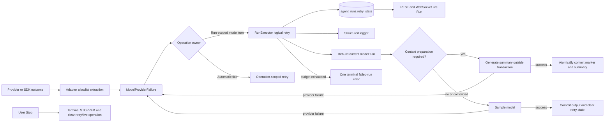

# Model Provider Failure Transparency and Retry Design

## Summary

Azents will replace adapter-specific provider failure handling with one typed, provider-neutral failure contract. Bounded and redacted provider-authored explanations will remain available through automatic retry, worker handover, terminal failed-run history, structured logging, and frontend presentation.

Retry lifecycle changes are part of the transparency design rather than a separate reliability feature. A provider failure can occur during automatic context preparation or sampling and must retain the same safe diagnostic contract while one logical model-turn controller applies the complete retry budget. Automatic compaction therefore moves under the Run-owned retry lifecycle and exposes one reconnect-safe live operation.

User Stop remains terminal and non-replayable. This design does not restore the stopped-Run recovery, source linkage, endpoint, UI, or schema that existed in the reverted implementation.

This document implements ADR-0165 as one coordinated backend, worker, API, frontend, logging, and test cutover.

## Problem

Equivalent provider outcomes currently cross Azents through different paths:

- OpenAI-native terminal errors frequently lose their provider-authored explanation and become `Model call failed.`.
- Final OpenAI SDK failures become `OpenAI Responses request failed.` and retain little actionable safe context outside the adapter.
- LiteLLM and OpenAI adapters expose different exception types and classification behavior.
- Known provider request, authentication, authorization, quota, policy, context, and output-limit failures may finalize on their first attempt because diagnostic retryability currently controls retry count.
- Automatic compaction owns a separate lifecycle, persists a started marker before external generation, and can emit durable failed/cancelled markers for an operation that should remain an attempt inside the current model turn.
- Stop during failed-run backoff currently promotes the latest failure into terminal failed-run output rather than preserving the user-selected stopped outcome.
- Unknown provider outcomes have no stable safe fingerprint for immediate classifier-gap alerting.

These behaviors make provider failures appear to be unexplained Azents failures and prevent one consistent user-visible and operational explanation from surviving the full execution lifecycle.

## Goals

- Normalize all supported adapter failures into one closed `ModelProviderFailure` contract before they cross the Engine boundary.
- Preserve only bounded and redacted provider-authored scalar messages and validated scalar identifiers.
- Keep provider-attributed failures distinct from cancellation, Azents watchdog expiry, and internal programming failures.
- Give every provider-attributed failure the initial attempt plus the complete configured retry budget.
- Keep `RunExecutor` as the single logical retry owner around automatic compaction and sampling in one model turn.
- Commit compaction history only after summary generation and enrichment succeed.
- Expose one context-preparation live operation across retry, reconnect, and worker handover.
- Preserve terminal failed-run manual Retry from durable history without adding stopped-Run replay.
- Keep User Stop terminal, non-recoverable, and non-replayable.
- Apply the same provider classification and retry policy to best-effort title generation.
- Emit safe structured attempt telemetry and immediately group unknown provider failures by a stable fingerprint.

## Non-goals

- Exposing raw provider bodies, serialized SDK exceptions, request input, model output, headers, cookies, credentials, stack traces, request IDs, response IDs, or raw streaming frames.
- Adding provider-specific taxonomy values to the public API.
- Showing concrete provider, integration, or model identity in the default error card.
- Retrying Azents programming failures as provider failures.
- Relabeling Azents watchdog expiry as a provider-authored failure.
- Letting provider retry hints change the standard Azents backoff schedule.
- Reopening, resuming, copying, or replaying a terminal stopped Run.
- Adding stopped-Run recovery state, source linkage, a retry endpoint, or frontend recovery action.
- Adding an application-owned incident database or calling the Sentry SDK from runtime product code.
- Preserving adapter-specific generic error behavior after cutover.

## Current Behavior

### Provider errors

`ModelCallError`, `TransientModelCallError`, and `NonRetryableModelCallError` are the current Engine-visible families. OpenAI-native and LiteLLM adapters map provider outcomes independently. Some paths preserve a fixed status-specific message or bounded code, while other paths replace the provider reason with a generic string.

ADR-0157 intentionally prevents raw OpenAI SDK exception and response propagation. The implementation must retain that security boundary while allowing explicitly selected, bounded, redacted scalar error fields to cross through a typed Azents contract.

### Failed-run retry

`RunExecutor` owns durable retry state in `agent_runs.retry_state`. It records failed attempts, publishes `run.retry`, waits until `next_retry_at`, preserves state through worker handover, and retries the same model turn and `run_id`.

The retry budget is scoped to one model turn. Successful normalized model output clears retry state in the same transaction that admits the output. The next model turn starts with a fresh budget.

Known failures classified as non-retryable currently finalize on the first failed attempt. This design changes that rule only for typed provider-attributed failures.

The existing `POST /chat/v1/sessions/{session_id}/retry-failed-run` route remains limited to the latest visible terminal failed-run `system_error`. It soft-reverts the terminal failure and creates a new pending execution boundary over durable transcript history. Completed tool results are not replayed.

### User Stop

The stop finalizer persists valid live assistant or reasoning output when permitted, repairs active tools as cancelled, appends `interrupted(reason=user_requested)` and the interrupted run marker, marks the Run terminal, consumes stop intent, and allows later input to follow the normal path.

The failed-run retry wait currently has a separate path that finalizes the latest failure with `retry_stopped_by_user`. This design removes that exception and sends User Stop through the ordinary stop finalizer.

### Context compaction

The compactor currently writes a `compaction_marker` before external summary generation, then appends a successful summary or a terminal failed/cancelled marker. Automatic compaction also performs operation-local handling inside the Engine path.

That lifecycle is not suitable for model-turn retry because failed external attempts become transcript history and the retry controller cannot represent automatic context preparation as one current attempt.

### Automatic title generation

Title generation is best-effort and must not fail the owning Agent Run. It already validates title ownership before committing the model result, but provider failure classification and retry behavior are not shared consistently with foreground model operations.

## Proposed Architecture



The logical model-turn attempt starts before automatic context preparation and ends only after model output is durably admitted. Automatic compaction and sampling therefore share one attempt number, retry state, stop boundary, and worker-handover boundary.

## Provider Failure Contract

### Domain type

Add `engine/run/provider_failure.py` with a closed exception contract.

`ModelProviderFailure` contains:

- `operation`: `sampling | compaction | session_title`;
- `category`: `authentication | permission | quota_or_billing | rate_limit | invalid_request | model_unavailable | context_limit | content_policy | provider_unavailable | transport | unknown`;
- `retryability`: `transient | user_action_required | non_retryable | unknown`;
- nullable bounded redacted provider message;
- nullable HTTP status;
- nullable bounded provider code and error type;
- nullable bounded retry-delay hint;
- internal provider, integration, and model identity;
- stable safe fingerprint;
- stable generic failure code.

The public `user_message` derived from the contract is always one of:

- `Model provider error: <bounded provider message>`; or
- `Model provider error: The model provider could not process the request.`

Category and diagnostic retryability do not determine whether the provider failure receives the remaining retry budget.

### Safe extraction and sanitization

Adapters extract only allowlisted scalar fields from typed SDK exceptions and terminal event structures. An SDK status error may be inspected only for scalar `message`, `code`, and `type` fields. The containing body is never retained, serialized, or logged.

The shared sanitizer applies the following rules:

1. Accept strings only; reject mappings, sequences, exception objects, response objects, and arbitrary values.
2. Reject an input larger than 8 KiB instead of truncating a probable body dump.
3. Normalize control characters and repeated whitespace.
4. Reject body-shaped HTML and oversized JSON-shaped text.
5. Redact authorization schemes, credential-shaped key/value pairs, token patterns, URL user-info, and cookie-like values.
6. Cap the final message at 1,000 Unicode code points.
7. Validate code and type independently as at most 96 identifier-safe characters.

The typed failure is raised without attaching the original SDK exception as a public cause. Product code must not use `str(exc)`, `repr(exc)`, `exc.__dict__`, or response serialization when constructing provider diagnostics or structured log fields.

### Attribution boundary

An adapter creates `ModelProviderFailure` only when the outcome is attributable to the provider request or its transport. Examples include:

- typed provider terminal failure or error events;
- typed HTTP status failures;
- typed SDK connection or timeout failures after SDK-owned retries end;
- WebSocket handshake, stream I/O, and premature EOF failures attributable to the provider transport.

Request construction bugs, unsupported internal variants, response normalizer programming failures, repository/service failures, and other Azents faults remain internal exceptions.

`asyncio.CancelledError` is matched first and re-raised. User Stop remains cancellation. The Azents `ModelStreamWatchdog` retains its own typed timeout failures and is not relabeled with a provider-authored message.

## Adapter Mapping

### OpenAI-native Responses

The OpenAI-native adapter maps:

- typed `response.failed`, `response.error`, `error`, and relevant `response.incomplete` outcomes;
- final `APIStatusError` values using only allowlisted scalar `error.message`, `error.code`, and `error.type` fields;
- typed SDK connection and timeout failures;
- WebSocket handshake status, stream I/O failure, and EOF before an accepted terminal event;
- the existing exact `previous_response_not_found` continuation fallback before general provider-failure mapping.

The adapter does not retain provider request or response IDs in the failure contract. Existing continuation telemetry may continue to record only whether a previous response ID was supplied.

### LiteLLM Responses

The LiteLLM adapter maps final typed LiteLLM/OpenAI exception families and terminal Responses output errors into the same contract. It reads only explicit scalar attributes or allowlisted scalar error fields. Generic exception string formatting is not a provider-message source.

### Exhaustiveness

Both adapter families use the same taxonomy, sanitizer, and presentation tests. Adding a category or contract field requires exhaustive adapter, retry-state, and projection updates. Provider-specific codes remain diagnostics and never become public category values.

## Retry Ownership and Lifecycle

### Run-scoped model turn

`RunExecutor` remains the logical retry owner. For each failed logical attempt it:

1. rechecks durable User Stop before recording a failure;
2. discards attempt-local assistant, reasoning, and provider-tool live projections;
3. converts `ModelProviderFailure` into a bounded provider failure stored inside `FailedRunRetryState`;
4. persists the failed attempt and standard backoff deadline;
5. emits structured attempt telemetry;
6. publishes the authoritative live Run projection;
7. waits while observing User Stop and worker shutdown;
8. rebuilds the current model turn from durable state for the next attempt.

Every provider failure receives the remaining configured attempts, including categories whose diagnostic retryability is `non_retryable` or `user_action_required`. Existing non-provider deterministic failures may still finalize immediately.

Provider retry hints are stored only in internal diagnostics and logs. The existing Azents retry schedule remains the backoff authority.

### Attempt reset boundary

Successful durable model-output admission clears `retry_state` in the same transaction. The next model turn begins with a fresh budget. This includes a tool-less model continuation after preceding output is committed.

Worker handover observes either unfinished output with active retry state, or committed output with null retry state. It never resets the active model turn's count or carries an older completed turn's count forward.

### Automatic compaction followed by sampling

A successful compaction commit is authoritative. If later sampling fails, the next logical attempt rebuilds from the committed summary. It does not repeat compaction unless the rebuilt request independently exceeds its threshold.

A failed compaction provider call commits no marker or summary. The next logical attempt creates a fresh plan from current durable history.

### Manual failed-run Retry

The existing terminal failed-run Retry stays limited to the latest visible failed-run `system_error` while the Session is idle. It continues from durable transcript state at the failed model-turn boundary and does not invoke completed tool side effects again.

The route does not accept a stopped Run ID and does not create source linkage to stopped execution.

## Context Preparation Operation

### Plan, generate, commit

Automatic and manual compaction use a three-step boundary.

#### 1. Plan

Capture:

- selected transcript and fixed cutoff;
- compaction reason;
- summary budget;
- continuity inputs;
- current model-input head required to validate commit.

Planning does not append a marker or move the head.

#### 2. Generate

Generate the summary and run enrichment hooks outside a database transaction. The provider call uses the shared watchdog and provider-failure contract. Continuity remains separate from the generated summary until enrichment completes.

A provider failure propagates to the operation owner. Cancellation, User Stop, or worker shutdown discards the uncommitted summary.

#### 3. Commit

Lock the Session and verify that:

- the captured cutoff still exists;
- the model-input head has not been advanced by another compaction;
- the required model-order insertion positions remain available.

Then atomically append the successful `compaction_marker` and `compaction_summary` at adjacent model-order positions and advance the model-input head to the summary.

Inputs appended during generation receive later model orders and remain after the inserted summary. A stale plan is discarded and rebuilt through the normal logical attempt path rather than partially committed.

### Live projection

`ChatLiveRunState` gains one optional operation:

```json
{
  "kind": "preparing_context",
  "operation_id": "<run-id>:preparing-context",
  "status": "running"
}
```

The operation is present while the active Run is preparing context, including retry backoff after a compaction provider failure. Repeated attempts keep the same operation ID.

Success, exhaustion, User Stop, or terminal transition removes it. The default English UI text is `Preparing conversation context…`. The UI does not create one item per attempt or expose the technical term `compaction` in the live status.

The authoritative live Run operation replaces transient frontend-only compaction state for reconnect and resync. No compatibility fallback is retained after the coordinated cutover.

## User Stop Semantics

User Stop has priority over a concurrent provider failure or watchdog result. Before recording a failed attempt, and while waiting for retry, `RunExecutor` rechecks the durable stop signal.

When Stop wins:

1. cancel or close the active provider operation;
2. discard an uncommitted compaction summary;
3. preserve valid live assistant or reasoning output through the existing stop finalizer;
4. repair active tool calls through the existing idempotent cancellation boundary;
5. append the existing `interrupted(reason=user_requested)` and interrupted Run marker;
6. mark the Run terminal and clear `retry_state`, phase activity, model-call timestamp, active tools, and the live context-preparation operation;
7. consume stop intent and clear the live Run projection.

The last provider failure may be emitted as safe structured telemetry, but it is not promoted into terminal `system_error` history. New writes no longer use `failed_run.finalization_reason = retry_stopped_by_user`; historical values remain readable.

A stopped Run has no Retry action, recovery projection, retry deadline, source linkage, or automatic worker resume. A later user message follows the ordinary input-buffer path. A user may submit a new manual-compaction command after stopping one, but the stopped command Run itself remains terminal.

## Standalone Model Operations

### Automatic title generation

Title generation uses the same provider contract and shared retry policy in an operation-scoped loop. It does not create or mutate `agent_runs.retry_state`.

Before every retry and before committing a generated title, the service revalidates that the original prompt event and `auto_initial` title source are still current. A manual title change terminates the operation without another provider call. Exhaustion keeps the deterministic initial title and cannot fail the owning Agent Run.

### Manual compaction

Manual compaction executes inside its command Run. `RunExecutor` therefore provides durable retry, stop, and handover behavior. It uses the same plan, generate, and commit boundary and the same live context-preparation projection. Stop marks the command Run terminal and does not create a command replay action.

## Data Model

No database migration is required.

`agent_runs.retry_state` remains the only durable active retry field. Its typed JSON model gains an optional provider-failure object containing only bounded validated fields required for handover, finalization, and logging.

Terminal `agent_runs` rows continue to clear retry state defensively. The current schema does not regain stopped recovery columns or source linkage.

## Public API

### Live Run

`GET /chat/v1/sessions/{session_id}/live`, REST write snapshots, and `live_run_updated` add optional `run.operation` for context preparation.

`run.retry` and terminal failed-run metadata add a presentation discriminator:

```text
error_kind = model_provider | runtime
```

The discriminator selects the default card heading. It carries no provider identity or taxonomy. Public attempt summaries continue to contain only bounded user-safe messages and existing timing/count fields.

Provider, integration, model, category, status, code, type, retry hint, and fingerprint remain server-side diagnostics.

### Retry routes

`POST /chat/v1/sessions/{session_id}/retry-failed-run` remains the only model-failure Retry route. Its validation continues to require the latest visible terminal failed-run error and an idle Session.

No stopped-Run retry route, request type, accepted-write variant, recovery response, or source-run identifier is added.

The OpenAPI document and generated Python and TypeScript clients are regenerated for the live-operation and presentation-discriminator changes.

## Frontend Design

The latest-following timeline can render:

- one `Preparing conversation context…` live item;
- one active `Model provider error` retry card with the latest safe message and retry timing;
- one terminal `Model provider error` card after exhaustion;
- the existing manual Retry action only for the latest terminal failed-run error while idle.

The provider card does not display concrete provider identity, integration, model, HTTP status, category, code, type, diagnostic retryability, fingerprint, or SDK exception class. Runtime failed-run cards retain their existing generic runtime presentation.

Reconnect replaces `run.operation` and `run.retry` from the authoritative `/live` baseline. `live_run_cleared` removes them only when the Run ID matches. User Stop produces ordinary interrupted history and no stopped recovery card.

Meaningful Storybook states include context preparation, active provider retry, provider retry during context preparation, terminal provider exhaustion with manual failed-run Retry, and generic runtime failure.

## Structured Telemetry and Alerting

Every provider failed attempt emits one structured warning containing only:

- Session and Run identifiers as event context;
- operation;
- internal provider, integration, and model identity;
- category and diagnostic retryability;
- status and bounded code or type;
- provider-failure fingerprint;
- attempt number and configured budget;
- retry outcome: `scheduled | recovered | exhausted | stopped`.

Shared fields are bound once when multiple log calls reuse the same context. Per-attempt values are passed through structured `extra` fields rather than interpolated messages.

Unknown categories additionally emit `logger.error("Unknown model provider failure", extra=...)` on every failed attempt. Reporting does not wait for exhaustion, and later recovery does not erase the classifier gap.

The base fingerprint is a hash of bounded internal provider identity, operation, status, code or type, and normalized safe-message shape. It excludes Session and Run IDs from grouping and excludes credentials, raw bodies, request input, output, and arbitrary SDK serialization. The shared logging integration combines `provider_failure_fingerprint` with the deployed release when assigning the monitoring fingerprint. Runtime product code uses only the application logger.

Known customer-scoped provider failures remain warnings and metric inputs by default. Provider-wide failure-rate or retry-exhaustion alerts remain separate operational policy.

## Error Handling and Security

- Sanitization failure removes the provider message but keeps provider attribution and any safe classification.
- Unknown provider semantics remain `ModelProviderFailure(category=unknown)` rather than becoming an internal Azents error.
- Cancellation is matched before provider exception handling.
- Provider failures are raised without a raw SDK exception cause.
- Structured log fields are explicit allowlists; logging the provider failure object, exception object, response object, or `__dict__` is forbidden.
- Retry-state JSON contains only validated typed fields and no open-ended metadata.
- Logging and monitoring delivery cannot affect retry state, user output, or finalization.
- A stale manual failed-run Retry remains rejected through the existing conflict contract.
- Worker shutdown preserves active retry state for handover but treats stopped Runs as terminal.

## Migration and Rollout

The feature ships as one coordinated cutover:

1. add the typed provider-failure contract, sanitizer, and exhaustive adapter mappings;
2. route automatic compaction and sampling provider failures to the single `RunExecutor` retry boundary;
3. change compaction to plan, generate, and commit and add the authoritative live operation;
4. correct User Stop during retry to use ordinary stop finalization;
5. add operation-scoped title retries and safe structured fingerprint logging;
6. update public projections, OpenAPI, generated clients, frontend, living specs, and deterministic fixtures;
7. deploy backend, workers, frontend, and logging integration as one compatible artifact set.

There is no schema rollout, stopped-recovery compatibility path, feature flag, or fallback to the previous generic provider-error behavior.

A code rollback restores the previous behavior without a schema rollback.

## Test Strategy

### E2E-first verification matrix

All product behavior tests use public REST, WebSocket, command, and browser paths. They do not write directly to the database.

1. A safe provider message appears under `Model provider error`; provider and integration identity remain hidden.
2. Credential-shaped, body-shaped, HTML, oversized, control-character, and token-bearing messages are redacted or replaced in live state, durable history, UI, and captured structured logs.
3. Authentication, permission, quota, policy, invalid-request, context-limit, transient, and unknown provider failures receive the configured complete attempt budget unless User Stop occurs.
4. A fail-N-then-succeed provider fixture restores normal output and clears retry and live-operation state.
5. Automatic context-preparation failures retain one live operation across backoff, reconnect, and worker handover and append no compaction event before success.
6. Successful compaction followed by sampling failure keeps the committed summary and does not repeat the compaction provider call on the next attempt.
7. Exhaustion appends one terminal failed-run `system_error`, one failed Run marker, and no per-attempt compaction failure history.
8. User Stop during sampling, automatic compaction, manual compaction, retry wait, and retry attempt produces terminal stopped/interrupted history, no provider `system_error`, no Retry action, and no live operation after resync.
9. A new public message after Stop starts normally and is not interrupted by stale stop state.
10. Terminal failed-run Retry continues from durable history without invoking an already completed side-effecting tool again.
11. REST and WebSocket reconnect restore the same active retry count, deadline, and context-preparation operation.
12. Worker handover preserves active provider retry state and never resumes a stopped Run.
13. Automatic title failure or exhaustion keeps the deterministic initial title and does not affect the Agent Run.
14. Unknown provider fixtures emit immediate error-level structured logs with stable same-release grouping; different safe fingerprints or releases separate groups.
15. OpenAI-native HTTP, WebSocket, and terminal-event fixtures and LiteLLM exception and terminal fixtures produce equivalent provider-neutral behavior.

### Fixtures and prerequisites

Extend deterministic model fixtures with:

- typed provider terminal failures carrying status, message, code, and type;
- malicious scalar messages and body-shaped payloads;
- fail-N-then-succeed sequences keyed by operation;
- independently countable compaction and sampling calls;
- blocking gates for sampling, compaction, retry wait, and title generation;
- unknown failures with controlled message shapes;
- a side-effecting public test tool whose invocation count is visible through its normal public result.

Deterministic fixtures are required CI prerequisites and fail setup when unavailable. Live-provider credentials are optional diagnostics only. Missing optional credentials skip only explicitly marked live-provider tests; deterministic contract tests never skip.

### Unit and integration coverage

- sanitizer bounds, redaction patterns, identifier validation, and message-shape fingerprinting;
- taxonomy and diagnostic retryability classification;
- exhaustive OpenAI HTTP, WebSocket, and terminal mapping;
- exhaustive LiteLLM exception and terminal mapping;
- cancellation precedence and absence of raw exception chaining;
- provider complete-budget finalization versus non-provider early finalization;
- retry-state serialization, handover, success clearing, and structured log fields;
- compaction plan ordering, concurrent later input, atomic successful commit, failed-attempt event absence, and committed-summary reuse;
- Stop races before failure recording, during backoff, before compaction commit, and after compaction commit;
- title retry, title ownership revalidation, and best-effort exhaustion;
- REST/live contracts, OpenAPI snapshots, generated clients, frontend reducers, cards, locales, and stories;
- logging integration fingerprint mapping without direct runtime Sentry calls.

### Evidence and CI policy

CI evidence includes:

- public E2E assertions for history, live state, WebSocket replacement, and UI actions;
- deterministic provider call counters and captured structured `LogRecord` fields;
- Python Ruff, Pyright, and focused/full Pytest results;
- TypeScript format, lint, typecheck, build, and Storybook test results;
- OpenAPI and generated-client diffs;
- documentation index validation and living-spec review.

The change fails validation if a deterministic adapter path loses a safe provider message, exposes a raw body or credential, short-circuits a provider category, creates repeated durable compaction failures, resumes or retries a stopped Run, re-executes a completed tool side effect, delays unknown reporting until exhaustion, or requires direct database mutation for product E2E coverage.

## Alternatives Considered

### Preserve adapter-specific exceptions

Rejected because retry, compaction, presentation, and observability would continue to depend on provider-specific behavior.

### Add transparency only at terminal error rendering

Rejected because the provider reason would still be lost during adapter normalization, retry-state persistence, compaction wrapping, and worker handover.

### Retry only transient provider categories

Rejected by ADR-0165 in favor of one predictable complete-budget provider policy. Diagnostic retryability remains observable but does not shorten the budget.

### Keep compaction's current independent lifecycle

Rejected because it creates a second logical retry owner and persists operation history before the external provider attempt succeeds.

### Persist one compaction failure marker per attempt

Rejected because attempt failures belong to live retry state and structured telemetry. Only successful compaction and terminal failed-run output are durable user history.

### Recover or replay stopped Runs

Rejected because User Stop is terminal and Run-level replay can duplicate already completed tool side effects. Future work begins through ordinary input or a newly submitted command.

### Store raw SDK exceptions for operators

Rejected because SDK serialization can include response bodies, request content, credentials, and unstable provider-specific objects. The typed allowlist is sufficient for user transparency and operational classification.

### Add a dedicated incident service

Rejected because the existing structured logger and monitoring integration already provide delivery, grouping, occurrence counts, and release context.

## Validation Result

The design fits the current model-turn-scoped `agent_runs.retry_state`, failed-run finalizer, User Stop finalizer, public failed-run Retry route, event model-order gap, live Run replacement projection, OpenAPI generation, and frontend latest-following state.

No new persistent column is required. The only durable shape change is a bounded typed extension inside existing retry-state JSON. The User Stop contract aligns retry wait and active provider operations with the current terminal interruption model.

The reverted PR #513 remains historical implementation evidence, not the design source of truth. This design intentionally retains its provider-transparency and retry-lifecycle goals while excluding stopped-Run recovery, replay, API, UI, and schema.

## Required Living Spec Updates

Implementation must update at least:

- `docs/azents/spec/flow/agent-execution-loop.md`;
- `docs/azents/spec/flow/context-compaction.md`;
- `docs/azents/spec/flow/run-resume.md`;
- `docs/azents/spec/flow/chat-session-resync.md`;
- `docs/azents/spec/domain/conversation.md`;
- provider-specific flow specs whose adapter failure behavior changes.

## Open Questions

None. ADR-0165 fixes the product decisions, and this design defines their implementation boundaries against the latest main behavior.
