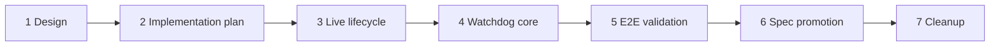

# Model Stream Timeout Watchdog Implementation Plan

## Feature Summary

Implement the approved [Model Stream Timeout Watchdog](./model-stream-timeout-watchdog.md) and [ADR-0146](../adr/0146-model-stream-parsed-event-idle-and-attempt-bounds.md) as a reviewable stacked PR series. The feature bounds streaming Responses calls by connection establishment, parsed-event inactivity, and absolute attempt time while preserving completion-only durability, preemptive User Stop, failed-run retry, and caller-specific failure behavior.

## Scope Boundaries

The stack includes only behavior required to make timeout and retry transitions correct:

- serialize live model-partial mutation and failed-attempt discard;
- correct the existing retry-budget drift from ADR-0084;
- apply one common watchdog to primary sampling, compaction, and Session title generation;
- classify, observe, clean up, and retry timed-out attempts;
- verify product behavior through deterministic E2E and promote the living spec.

The stack does not add preparing-tool UI, tool-projection identity changes, semantic-progress classification, persistent provider/model timeout settings, non-streaming call deadlines, or compatibility fallbacks.

## PR Stack

### 1. Design

**Branch:** `azents/credit-coffee-put`
**Base:** `main`

Records the approved policy, failure semantics, cleanup ownership, observability, rollout, and E2E requirements.

### 2. Implementation plan

**Branch:** `azents/model-stream-watchdog-plan`
**Base:** `azents/credit-coffee-put`

Records PR boundaries, dependencies, validation coverage, fixture prerequisites, spec impact candidates, and cleanup ownership.

### 3. Phase 1 — Failed-attempt live lifecycle

**Branch:** `azents/model-stream-watchdog-live-lifecycle`
**Base:** `azents/model-stream-watchdog-plan`

Dependencies: PR 2.

Runtime changes:

- add one per-Session sequencing boundary for model-partial append, timer flush, explicit flush, failed-attempt discard, and durable replacement;
- prevent a pending or in-flight live upsert from recreating model partials after discard;
- discard buffered and published assistant/reasoning partials before retry-state publication for non-User-Stop attempt failures;
- retain User Stop as the only path that may promote valid partial assistant text;
- correct retry exhaustion so `max_retries = 10` means ten retries after the initial attempt, as defined by ADR-0084.

Tests:

- deterministic batcher/projector concurrency tests for timer, flush, discard, and durable replacement ordering;
- RunExecutor tests proving discard precedes retry publication and the next attempt starts with no failed output;
- retry-boundary tests for initial attempt plus the configured retry count;
- regression tests for User Stop partial preservation.

### 4. Phase 2 — Common model-stream watchdog

**Branch:** `azents/model-stream-watchdog-core`
**Base:** `azents/model-stream-watchdog-live-lifecycle`

Dependencies: PR 3.

Runtime changes:

- add the typed timeout policy and resolver with 15-second connect, 300-second parsed-event idle, 1,800-second absolute attempt, and 5-second cleanup defaults;
- pass the connect-only lower-level timeout through supported LiteLLM Responses paths;
- start idle and absolute clocks before `aresponses()` and reset idle after every yielded parsed provider event without inspecting its type or payload;
- add typed timeout errors and stable failure codes for connection, idle, and absolute expiration;
- apply the common boundary to primary sampling, compaction, and best-effort Session title generation while preserving their current failure meanings;
- race timeout with User Stop so active-attempt Stop wins simultaneous readiness;
- bound iterator cancellation/close and transfer non-cooperative work to a process-owned cleanup registry;
- emit structured timing, outcome, retry, and cleanup logs without generated content or provider payloads.

Tests:

- policy validation and resolution precedence;
- initial response acquisition, first event, repeated event, idle, and absolute boundary tests with a controllable monotonic clock;
- all-event idle refresh without semantic inspection;
- LiteLLM timeout mapping and internal-retry clock ownership;
- simultaneous Stop/timeout precedence;
- cooperative and non-cooperative cancellation, close, late-result discard, and shutdown drain;
- primary, compaction, and Session title caller-specific behavior.

### 5. E2E/testenv validation

**Branch:** `azents/model-stream-watchdog-validation`
**Base:** `azents/model-stream-watchdog-core`

Dependencies: PR 4 and deterministic AIMock stream-control support.

Changes and evidence:

- add deterministic test-worker timeout overrides so E2E uses sub-second or low-second bounds without changing production defaults;
- extend AIMock fixture support only as needed to delay the first event, emit a prefix then stall, emit frequent events past the absolute cap, and select a successful response on the next attempt;
- exercise Sessions through public APIs and the real browser; do not write PostgreSQL or Redis directly;
- record commands, environment/image versions, pytest results, relevant worker/AIMock logs, WebSocket actions, and browser evidence for failures;
- compare implemented behavior strictly against the current Agent Execution Loop spec and fix implementation defects before spec promotion.

### 6. Spec promotion

**Branch:** `azents/model-stream-watchdog-spec`
**Base:** `azents/model-stream-watchdog-validation`

Dependencies: PR 5 passing validation.

Changes:

- run `/spec-review` against the complete implementation stack;
- update the Agent Execution Loop living spec with effective timeout boundaries, failed-attempt live cleanup, timeout retry/finalization, and User Stop precedence;
- update `last_verified_at` and `spec_version`;
- mark the design implemented only after validation passes;
- retain ADR-0146 unchanged after adoption.

### 7. Cleanup

**Branch:** `azents/model-stream-watchdog-cleanup`
**Base:** `azents/model-stream-watchdog-spec`

Dependencies: PR 6.

Removes this temporary implementation plan and regenerates the documentation index. It contains no behavior or refactoring changes.

## Dependency Graph

## API, Data, and Runtime Impact

- No PostgreSQL migration or durable schema change.
- No public/admin API or generated-client change.
- No new WebSocket envelope; existing live upsert/removal and run retry projections remain canonical.
- Worker configuration gains validated process-level timeout defaults and test overrides.
- Provider/model/profile override maps remain internal and empty in this release.
- Timeout failures reuse existing durable retry state and terminal failed-run metadata.

## Test Strategy

### E2E primary validation matrix

| Scenario | User-visible and durable assertions |
| --- | --- |
| No initial parsed event | The attempt times out under the test policy, enters retry state, and appends no durable assistant output. |
| Idle after visible prefix | The prefix appears live, disappears before retry state, and never combines with the next attempt. |
| Events refresh idle | A call whose total duration exceeds idle succeeds while every parsed-event gap stays below idle. |
| Absolute attempt cap | Frequent parsed events cannot keep the attempt alive beyond the absolute test deadline. |
| Retry recovery | A timed-out first attempt and successful next attempt complete one Run without a durable timeout error. |
| Retry exhaustion | Attempt history carries stable timeout codes and only the exhausted failure becomes durable. |
| User Stop race | Stop during the active attempt wins and preserves only valid partial assistant text without timeout retry. |
| Reconnect during retry | REST and WebSocket resync show retry state with no failed-attempt model partial. |
| Compaction timeout | The blocking compaction failure follows the existing Run failed-attempt boundary and stores no partial summary. |
| Session title timeout | Best-effort title generation is abandoned without failing the completed Run. |

### Fixture and prerequisite requirements

AIMock `ghcr.io/copilotkit/aimock:1.24.1` is already the deterministic model fixture. Before Phase 5, verify whether its fixture schema can express first-event delay, inter-event delay/stall, event cadence, and sequence selection. If any primitive is missing, extend the local fixture boundary or pin an AIMock version that provides it; do not replace product-path verification with direct database or Redis mutation.

The E2E worker needs validated timeout overrides that are isolated to the deterministic fixture environment. Tests use the existing `agent-basic`/dummy model setup and public Session creation/message APIs. No live provider credentials are required, so the suite runs in normal `not live_external` CI. Missing AIMock, worker, Redis, WebSocket, browser, or fixture capabilities fail the required suite rather than skip.

### Lower-level quality gates

Phase 3 and Phase 4 run focused Ruff, Pyright, and pytest checks from `python/apps/azents`. Phase 5 runs focused E2E first, then the normal deterministic E2E selection when practical. Every PR runs documentation index validation and `git diff --check`; final CI is monitored only after all planned PRs exist.

## Blockers and External Actions

- Phase 5 is blocked until AIMock stream-delay/stall fixture capability is verified or added.
- The local Python virtual environment currently contains OpenAI Python 2.37.0 while the current lockfile resolves 2.45.0; implementation validation must synchronize with `uv sync` before relying on dependency behavior.
- Production rollout requires no migration, credential, or manual external action.

## Spec Impact Candidates

Primary candidate: `docs/azents/spec/flow/agent-execution-loop.md`.

The promoted spec must describe:

- timeout policy ownership and effective defaults;
- parsed-event idle reset behavior and absolute cap;
- caller-specific timeout consequences;
- failed-attempt non-durable cleanup before retry publication;
- User Stop precedence and partial assistant preservation;
- timeout retry/finalization and structured failure codes;
- bounded non-cooperative cleanup ownership.

## Rollout and Cleanup

The watchdog ships enabled for all streaming Responses calls with no per-Session flag or legacy fallback. Structured logs expose effective policy, event timing, timeout classification, recovery, and cleanup registry state. Rollback uses deployment rollback or validated process-level duration adjustment.

After validation and spec promotion, the cleanup PR removes this plan. The adopted ADR, implemented design, living spec, tests, and code remain the long-term sources of truth.
