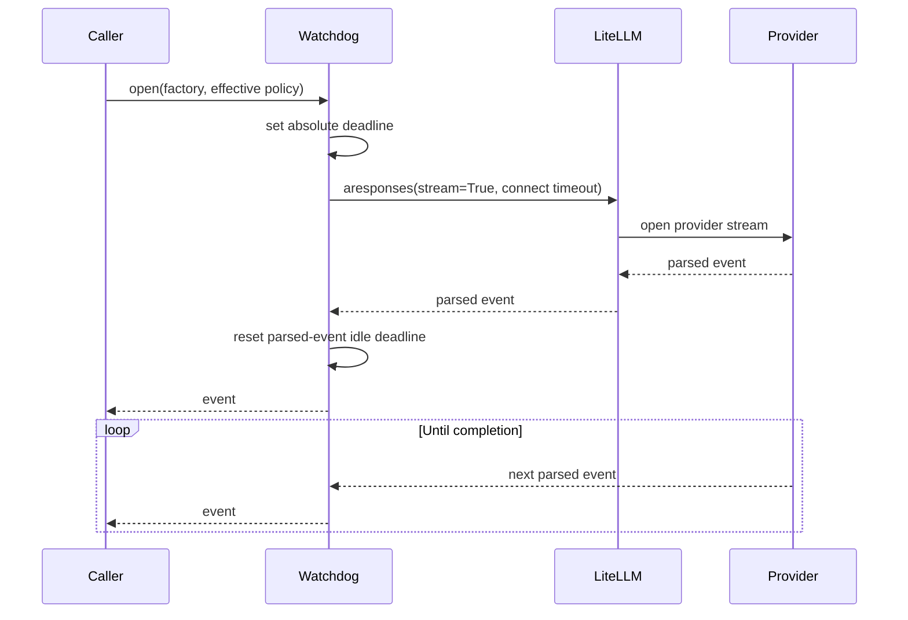
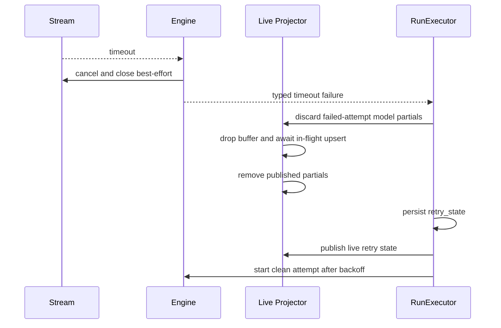

# Model Stream Timeout Watchdog

## Status

Approved design based on [stream-260715/ADR](../adr/stream-260715-stream-parsed-event-idle-and-attempt-bounds.md). Implementation has not started.

## Problem

Azents has no application-owned deadline around a streaming model attempt. `LiteLLMResponsesModelAdapter.stream()` and the shared Responses helper await LiteLLM and provider iterators until they complete or raise. A connection that remains pending, an iterator that stops yielding parsed events, or an active stream that never completes can therefore keep a model call open according to provider, LiteLLM, and HTTP-library behavior rather than a stable Azents contract.

Restored incremental projection makes healthy output visible before provider completion, but it also means a timed-out attempt may already have non-durable assistant or reasoning output in Redis and the browser. Retrying without an ordered cleanup can combine failed-attempt output with the next attempt or let an in-flight timer recreate output after removal.

## Goals

- Apply an Azents-owned watchdog to every streaming Responses model call.
- Treat every parsed provider event equally; do not infer semantic progress.
- Bound connection establishment, parsed-event inactivity, and total provider-attempt duration independently.
- Preserve existing failed-run retry behavior, including up to ten retries, durable retry state, worker handover, and user-controlled stop.
- Remove failed-attempt live output before retry state becomes visible.
- Preserve the existing User Stop exception that may durably retain valid partial assistant text.
- Ensure a provider stream that ignores cancellation cannot block timeout handling, retry, terminal handling, or worker shutdown.
- Provide deterministic tests and structured operational evidence without persisting provider deltas or generated content.

## Non-goals

- Classifying whether an event represents meaningful or semantic model progress.
- Treating raw network bytes, SSE comments, or provider heartbeats as the product-level activity signal.
- Adding timeout settings to PostgreSQL, public/admin APIs, Agent configuration, or UI.
- Adding a special Deep Research, Flex, low-priority, or other ultra-long-running profile.
- Applying parsed-event idle policy to non-streaming model calls.
- Changing LiteLLM's existing internal retry behavior.
- Redesigning the failed-run retry policy or limiting total Run duration.
- Persisting partial output, native provider events, or per-event timestamps.
- Implementing preparing-tool UI or broader tool-projection identity changes.

## Current Behavior

### Streaming call paths

Current `main` has three streaming Responses paths:

| Call kind | Entry point | Current failure meaning |
| --- | --- | --- |
| Primary sampling | `LiteLLMResponsesModelAdapter.stream()` from `AgentRunExecution._stream_model()` | A propagated model/runtime error enters failed-run retry. |
| Context compaction | `call_responses_model(stream=True)` from compaction summary generation | Compaction converts provider failures to `CompactionFailedError`; the blocking Run attempt fails and retries. |
| Automatic Session title | `call_responses_model(stream=True)` from `SessionTitleService` | Best-effort failure is logged and the title is abandoned without failing the Run. |

The primary adapter calls `aresponses()` inside its async generator before yielding its first `LiteLLMEvent`. The compaction/title helper currently awaits `aresponses()` before returning the iterable. Both stages must therefore be under the same initial watchdog period; wrapping only the returned iterator would leave response-handle acquisition unbounded.

### Retry boundary

`RunExecutor` converts a run-stopping exception into `FailedRunAttempt`, stores `agent_runs.retry_state`, publishes live retry state, waits through exponential backoff, and retries the same Run. The declared policy is ten retries after the initial attempt. Intermediate attempts do not append durable `system_error` or terminal markers.

Validation found an existing implementation drift: `_failed_run_finalization_reason()` currently finalizes when `failed_attempt_count >= max_retries`, so a configured value of ten permits ten total failed attempts rather than an initial attempt plus ten retries. The retry prerequisite phase corrects this off-by-one behavior to the accepted [failed-260627/ADR](../adr/failed-260627-failed-error-retry.md) policy before timeout failures rely on it.

### Live partial boundary

`LivePartialBatcher` coalesces content and reasoning for 75 milliseconds or 96 characters. Its current timer, explicit flush, Redis mutation, and WebSocket publication are not serialized with failed-attempt discard. `LiveEventProjector.clear_session()` also clears more than the model partials needed for an attempt transition. A targeted, serialized discard operation is required before timeout retry can be correct.

## Accepted Policy

| Boundary | Default | Basis and reset rule |
| --- | ---: | --- |
| Connection establishment | 15 seconds | Azents-owned general connection policy. Codex uses the same value only for Responses WebSocket connection/prewarm. Applies to each lower-level connection attempt. |
| Parsed-event idle | 300 seconds | Matches the Codex stream-idle duration. Starts before `aresponses()` in Azents; every parsed provider event resets it. |
| Absolute provider attempt | 1,800 seconds | Azents production-data policy; starts before `aresponses()` and never resets. Codex has no equivalent absolute cap. |
| Timeout close grace | 5 seconds | Internal bounded-cleanup budget before registry adoption; User Stop does not wait for this grace. |
| Failed-run retry | 10 retries after the initial attempt | Existing Azents [failed-260627/ADR](../adr/failed-260627-failed-error-retry.md) policy, not the Codex reconnect budget. Timeout uses the existing retry state and backoff policy. |

The absolute deadline bounds one provider attempt, not the Run. A background Run may remain active for hours while retrying. This is intentional and remains under explicit user Stop control.

## Proposed Design

### Policy types and resolution

Introduce a frozen `ModelStreamTimeoutPolicy` value with positive durations for:

- `connect_timeout`;
- `parsed_event_idle_timeout`;
- `absolute_attempt_timeout`.

A separate process-level cleanup setting owns the five-second timeout close grace; it is not a provider/model/profile behavior override.

A typed `ModelStreamTimeoutPolicyResolver` resolves one immutable effective value for each streaming call. Resolution order is:

1. model or inference-profile override;
2. provider override;
3. Azents default.

The first implementation has empty override maps. It adds no database, API, or UI contract. Process-wide defaults may be supplied through validated worker configuration so deterministic test workers and emergency operations can shorten or lengthen the common defaults. Provider/model/profile mappings remain injected resolver inputs rather than a serialized product setting.

Each call resolves once before the provider request. Internal LiteLLM retries do not re-resolve policy. A later Azents failed-run retry resolves again on the worker that owns that attempt, so a deployment configuration change can take effect after handover without a migration or durable Run snapshot.

### Common watchdog lifecycle

A common watchdog owns both response-handle acquisition and iteration. It accepts an async factory that opens the LiteLLM response. If the result is an async iterable, the watchdog wraps iteration with parsed-event and absolute deadlines. A completed non-stream result remains valid for shared compaction/title extraction, while the primary streaming adapter preserves its existing validation that requires an async iterable.

The initial 300-second idle period begins before awaiting `aresponses()`. It therefore bounds response-handle acquisition and the first parsed event together. Once an iterable exists, each `anext()` runs in a child task. The wait duration is the smaller of the idle duration and the remaining absolute duration. If local event processing passes the absolute deadline, the next iterator wait fails immediately; the watchdog does not cancel an in-progress live-store mutation merely to meet the wall-clock boundary exactly.

Every yielded item resets idle, including metadata and lifecycle events. The watchdog does not inspect event type or payload. Raw bytes or heartbeats filtered by LiteLLM do not reset idle.

### LiteLLM transport and internal retry

Pass a granular HTTP timeout whose only shorter product limit is connection establishment. Pool acquisition, request-body write, and raw read do not receive competing Azents deadlines; the outer parsed-event wait bounds them. Operating-system and transport failures may still terminate earlier.

LiteLLM's existing internal retries remain inside one Azents provider attempt:

- the parsed-event idle clock does not reset for an internal retry unless a parsed event was yielded;
- the absolute clock never resets;
- only the exception or timeout that exits the complete watched call enters failed-run retry.

This avoids multiplying the Azents attempt count by exposing every LiteLLM implementation retry as a separate durable retry attempt.

### Timeout errors

`ModelStreamTimeoutError` extends the user-visible model-call error hierarchy and stores:

- timeout kind;
- configured deadline;
- elapsed monotonic duration;
- provider/model/call kind where available;
- stable failure code.

Failure codes are:

- `model_connect_timeout`;
- `model_stream_idle_timeout`;
- `model_attempt_timeout`.

The failed-run conversion sets `source = model` and `retryability = transient`. The user-safe message contains no provider response, assistant content, credentials, or stack trace. Expected timeout attempts use structured warning logs rather than exception stack traces. Retry exhaustion uses the existing failed-run finalizer and durable error metadata.

### Caller-specific error behavior

| Caller | Timeout handling |
| --- | --- |
| Primary sampling | Propagate `ModelStreamTimeoutError` to `RunExecutor`. |
| Compaction | Convert it to `CompactionFailedError` while preserving failure code in the exception metadata/log fields. |
| Session title | Log structured timeout context and return no generated title. |

Session-title failure remains best-effort and does not consume the active Run's failed-run retry budget.

### User Stop priority

The active iterator wait remains cancellable by the existing preemptive User Stop path. When a watchdog deadline becomes ready, it yields once to pending task cancellation and checks the injected stop state before claiming timeout. If User Stop and timeout are ready together, User Stop wins and `AgentRunExecution` uses its existing interrupted-output accumulator.

Once `ModelStreamTimeoutError` has been raised, timeout owns the attempt transition. A later cancellation during failed-attempt cleanup is treated as stopping retry: cleanup and failed-attempt recording complete, then the latest timeout is finalized through the existing `retry_stopped_by_user` path. Discarded output is not reconstructed.

### Cooperative cancellation and orphan ownership

The watchdog never waits indefinitely for provider cleanup.

For a watchdog timeout:

1. Stop requesting another event and cancel the active `anext()` child task.
2. If the task settles, call the iterator/response close hook when still needed.
3. Allow a total five-second cooperative cancellation/close grace period.
4. If cancellation or close remains pending, transfer the task to `ModelStreamCleanupRegistry`.
5. Continue retry handling.

For User Stop, request cancellation/close and transfer unfinished work to the registry immediately; do not spend the timeout close grace before interrupted-run finalization. Shutdown uses the existing handover window and transfers any remaining cleanup before the worker-level final drain.

All event normalization and output projection occur only after the owning caller receives an event from the child task. A registry-owned late result is consumed and discarded, so the detached task has no route to Redis, WebSocket, or durable history.

The registry is process-scoped and dependency-injected into the worker graph. It keeps a strong reference and metadata keyed by Session, Run when present, call kind, and attempt. A done callback consumes success, cancellation, and exceptions. Adoption and completion logs include task age and current registry count. The initial implementation does not drop task ownership to enforce a numeric registry cap; losing the reference would create an unobserved task without reclaiming the underlying resource.

On worker shutdown, the registry cancels every remaining task and drains for five seconds. It records any tasks still pending after the drain and returns so process termination can reclaim them. Orphan cleanup never delays Session lock release indefinitely.

### Failed-attempt live partial lifecycle

Timeout correctness depends on a generic failed-attempt discard operation, not a timeout-only Redis shortcut. The live batcher/projector gains Session-serialized operations:

- `append`: buffer a content/reasoning delta and schedule one tracked timer;
- `flush`: cancel the timer, serialize with any previous mutation, publish buffered output, and return after the mutation settles;
- `discard`: block new output for the failed attempt, drop unflushed buffers, wait for an in-flight mutation, remove published model partials, and publish removals;
- `replace_with_durable`: serialize durable handoff as history publication followed by live removal.

`RunExecutor` invokes failed-attempt discard before persisting/publishing retry state for every non-User-Stop run attempt failure, not only watchdog timeouts. The operation removes assistant/reasoning live projections and any future incomplete preparing-tool projection, but does not clear unrelated input buffers, live Run state, or previously admitted active tools.

Live cleanup remains best-effort. A Redis/WebSocket failure is logged and does not block durable retry-state persistence indefinitely, but the sequencing primitive always prevents a known local timer/upsert from running after discard.

## API and Data Model Impact

- No PostgreSQL migration.
- No public or admin API change.
- No generated client change.
- No new WebSocket envelope.
- Existing `agent_runs.retry_state` stores the typed timeout error and failure code through its current fields.
- Existing live event IDs and cumulative snapshot protocol remain unchanged.
- Worker configuration gains validated common timeout defaults; persistent provider/model/profile settings remain out of scope.

## Observability

Emit one structured start record, one first-event record, and one terminal record per streaming call. Do not log every parsed event.

Common fields:

- `session_id` and `run_id` when available;
- call kind: sampling, compaction, or session title;
- provider and model;
- effective connect, idle, and absolute deadlines;
- request-to-response-handle duration;
- request-to-first-parsed-event duration;
- total call duration;
- maximum parsed-event gap;
- outcome and timeout failure code;
- failed-run attempt number when available;
- parsed event count without event payloads.

Cleanup-registry logs add task age, adoption reason, close-grace duration, and active task count. Generated text, reasoning, tool arguments, native event payloads, credentials, and attachments are excluded.

Grafana/Loki log metrics derive:

- timeout count and rate by failure code, provider, model, and call kind;
- first-event and total-duration distributions;
- maximum event-gap distribution;
- retry recovery versus retry exhaustion after timeout;
- orphan adoption, orphan age, and pending-on-shutdown counts.

Initial alerts target a sustained timeout-rate increase and any cleanup task that survives worker shutdown drain. No new in-process metrics client or durable timing columns are introduced.

## Security and Permissions

The watchdog does not change authorization or provider credentials. Timeout exceptions and logs contain identifiers and durations only. User-safe durable errors never contain raw provider bodies or generated content. Detached tasks cannot publish because their result is not passed back to normalizer or output sinks.

## Rollout and Rollback

The watchdog is enabled by default for every streaming Responses call in one deployment. There is no legacy fallback path or per-Session feature flag.

Operational safeguards are:

- process-wide validated duration settings;
- structured timeout and cleanup logs available immediately after deploy;
- empty provider/model/profile override maps;
- rollback by reverting the deployment;
- a later explicit provider override if evidence shows legitimate event silence beyond the default.

The implementation first lands live-partial lifecycle hardening, then the watchdog. This prevents enabling timeout retries before failed-attempt cleanup ordering exists.

## Test Strategy

### Primary E2E verification matrix

| Scenario | Primary assertion |
| --- | --- |
| No first parsed event | Shortened test policy times out, publishes retry state, and leaves no durable assistant output. |
| Idle after partial | First-attempt partial appears, is removed before retry state, and never combines with second-attempt output. |
| Events reset idle | A stream exceeding the idle duration in total succeeds when every event gap remains below the deadline. |
| Absolute cap | Frequent parsed events do not prevent the shortened absolute test deadline. |
| Retry recovery | A timed-out first fixture attempt and successful next attempt complete the same Run without durable timeout error. |
| Retry exhaustion | The existing retry history records typed timeout codes and only the final exhausted error is durable. |
| User Stop race | Stop chosen while the attempt is active preserves only valid assistant text and bypasses timeout retry. |
| Reconnect during retry | REST/live WebSocket resync shows retry state and no failed-attempt model partial. |
| Compaction timeout | The blocking compaction call enters existing Run retry without committing a partial summary. |
| Session-title timeout | The title attempt is abandoned without failing or delaying completion of the agent Run. |

### E2E plan

Product behavior tests live under `testenv/azents/e2e` and use public APIs or the real browser. They do not write PostgreSQL or Redis directly.

A dedicated timeout-test worker configuration uses short common deadlines. AIMock streaming fixtures use deterministic TTFT, token cadence, chunk sizing, and sequence behavior to create:

- a first attempt whose first parsed event arrives after the test idle deadline;
- an attempt that emits a visible prefix and then stalls or disconnects;
- a continuously active stream longer than the test absolute deadline;
- a successful response selected on the next attempt.

The E2E suite observes WebSocket actions and REST live/history state. A browser assertion is required for failed-prefix disappearance followed by one clean successful assistant response. Reconnect assertions prove that Redis/live state contains no discarded first-attempt projection.

These deterministic tests run in the normal non-`live_external` CI suite. Missing AIMock, Redis, WebSocket, or browser prerequisites fail rather than skip. Evidence includes pytest output, relevant worker/AIMock logs, captured WebSocket actions, and browser screenshot/page source for UI failures.

### Lower-level coverage

- Policy resolver precedence and positive-duration validation.
- Connection timeout passed to every `aresponses()` path.
- Initial handle acquisition and first event share the idle deadline.
- Parsed metadata events reset idle without payload inspection.
- LiteLLM internal retries remain inside the same idle and absolute clocks.
- Idle versus absolute deadline classification at boundary races.
- User Stop wins when Stop and deadline are simultaneously ready.
- Cooperative iterator cancellation and close.
- Non-cooperative `anext()` and `aclose()` adoption, late-result discard, exception consumption, and shutdown drain.
- Batcher append/flush/discard/durable-replace ordering with controllable in-flight Redis and WebSocket callbacks.
- Retry state is published only after discard returns.
- Timeout remains non-durable until exhausted.
- Compaction and Session title retain their caller-specific failure behavior.

## Alternatives Considered

### Raw transport read inactivity

Rejected because raw chunks or heartbeats can continue while LiteLLM yields no parsed event to Azents.

### Semantic-progress classification

Rejected because provider event vocabularies and LiteLLM transformations do not provide a safe cross-provider semantic contract.

### A first-event-only deadline

Rejected because the same parsed-event inactivity rule applies before and after the first event. A separate early lifecycle event guarantee does not exist across current providers.

### Timeout-specific retry budget

Rejected. Background agents should continue automatic recovery under the existing ten-retry policy, while users retain explicit Stop control.

### Await provider close indefinitely

Rejected because a non-cooperative close would make the watchdog itself unbounded.

### Fire-and-forget cancellation

Rejected because untracked tasks can leak resources, hide exceptions, and outlive Session ownership without observability.

### Persistent timeout settings now

Rejected because no current model/profile requires an override. Adding DB/API/UI contracts before an actual use case would create migration and snapshot semantics without product value.

## Validation Evidence

Validation used `origin/main` commit `6788ddbe552c0db05a38128166e211111e6c9557`. Its lockfile pins LiteLLM 1.87.0, OpenAI Python 2.45.0, and HTTPX 0.28.1. The existing local virtual environment still contains OpenAI Python 2.37.0 and must be synchronized before implementation validation.

- OpenAI Codex `2e1607ee2fa8099a233df7437adee5f16a741905` uses a 300-second stream-idle default around each parsed SSE-event wait and each WebSocket-frame wait, a 15-second Responses WebSocket connect/prewarm timeout, five stream reconnection retries, and four HTTP request retries. Its stream loops have no absolute attempt cap. Only the 300-second duration and all-event treatment are direct comparison evidence for the corresponding Azents idle choice.
- The existing run-stall reliability discussion records 4,494 successful normal model calls over 14 days, with a maximum total duration of 1,155.462 seconds. This supports the 1,800-second absolute cap and does not establish a maximum parsed-event gap.
- Repository search found exactly three production `stream=True` Responses callers: primary sampling, compaction, and Session title generation.
- Compaction and Session title already share `call_responses_model()` and `extract_response_text()`, so common watchdog reuse does not require a parallel provider adapter.
- LiteLLM 1.87.0 `aresponses()` accepts `float | openai.Timeout | None`; `httpx.Timeout(None, connect=15.0)` supplies the chosen connect-only lower-level bound.
- LiteLLM `Timeout` subclasses OpenAI `APITimeoutError`, allowing narrow timeout mapping before the existing broader OpenAI error conversion.
- `LivePartialBatcher` currently has independently scheduled timer callbacks with no discard operation or Session mutation lock, confirming that ordered failed-attempt cleanup must land first.
- Current retry finalization uses `failed_attempt_count >= max_retries`, confirming the existing off-by-one drift from [failed-260627/ADR](../adr/failed-260627-failed-error-retry.md)'s initial-attempt-plus-ten-retries policy.
- The Agent Execution Loop spec already defines completion-only durability, incremental non-durable projection, User Stop partial assistant preservation, and durable retry state. The proposed watchdog refines rather than replaces those boundaries.
- [preemptive-260607/ADR](../adr/preemptive-260607-preemptive-stop.md) requires preemptive User Stop and non-blocking provider cleanup; bounded close and late-task adoption are consistent with that accepted control boundary.

## Open Risks and Validation Questions

- LiteLLM 1.87.0 provider adapters may wrap connection timeouts differently; validation must confirm the specific `model_connect_timeout` mapping for supported provider paths.
- A provider task that suppresses cancellation can continue consuming local resources until process exit. The registry makes this bounded in ownership and observable, but Python cannot forcefully kill arbitrary coroutine code.
- The deterministic E2E fixture must prove a parsed-event stall rather than only a transport disconnect; fixture capability is validated before implementation begins.
- The working branch must be rebased onto latest `origin/main` before implementation because current source and documentation have advanced.

## Implementation Phases

### Phase 1: Live partial lifecycle prerequisite

- Serialize batcher timer, flush, discard, and durable replacement.
- Add targeted failed-attempt model-partial discard.
- Invoke discard before retry-state publication for non-User-Stop failures.
- Correct the existing failed-run `max_retries` off-by-one so ten means ten retries after the initial attempt.
- Add concurrency and retry cleanup tests.
- Keep preparing-tool UI outside this phase.

### Phase 2: Common stream watchdog

- Add policy/resolver, watched Responses stream, typed timeout errors, and caller-specific mapping.
- Apply to primary sampling, compaction, and Session title.
- Add bounded close and cleanup registry.
- Add structured logs and lower-level tests.

### Phase 3: E2E, operational validation, and spec sync

- Add deterministic AIMock/test-worker fixtures and API/browser E2E coverage.
- Validate Grafana/Loki queries and timeout/cleanup evidence.
- Update `docs/azents/spec/flow/agent-execution-loop.md` with implemented behavior.
- Run spec review immediately before final QA.

All implementation PRs are created before CI monitoring. Merge order follows the dependency order above. The design and ADR are approved; implementation begins only after an explicit implementation request.
