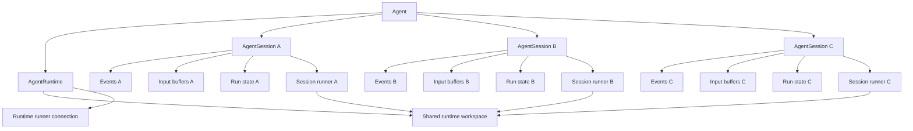

# Multi-Active AgentSession Migration Overview

## Overview

Azents is moving toward an agent-centered model where an `Agent` has one runtime and many sessions. `AgentRuntime` and `AgentSession` are sibling models under `Agent`, not parent/child models. `AgentRuntime` owns the shared runtime workspace and provider lifecycle. `AgentSession` owns conversation, input, and execution-control state.

The current foundation still contains single-current-session assumptions. This document defines the high-level migration direction from that foundation to a model where multiple `AgentSession` rows for the same `Agent` can be open and executable. It is an overview document only. Step-specific schema, API, worker, and UI designs should be documented separately when each migration phase is implemented.

## Target Direction

The long-term target is:

- One `Agent` has one `AgentRuntime`.
- One `Agent` has multiple open `AgentSession` rows at the same time.
- `AgentRuntime` and `AgentSession` are independent sibling models connected by `agent_id`.
- Each `AgentSession` is an independent execution-control boundary.
- Events, input buffers, pending commands, stop requests, run state, and recovery heartbeat belong to `AgentSession`.
- `AgentRuntime` owns sandbox/runtime lifecycle, provider desired/observed state, runner connectivity, workspace path, and other runtime infrastructure state.
- The runtime workspace is shared by sessions of the same agent. Workspace operations are concurrent by default and use optimistic conflict detection rather than a global tool mutex.

In this target, `AgentSession` is not a child of `AgentRuntime`. It is one of the agent's execution/conversation surfaces. The runtime is the agent's shared execution environment.

## Non-Goals

This overview does not define the full implementation details for:

- Exact database migration DDL for each phase.
- Final public API shape for all session list/focus/create routes.
- Frontend multi-session navigation UX.
- Detailed shared workspace conflict UX and retry behavior.
- Subagent or ephemeral agent spawn semantics.
- Per-session sandbox isolation.

Those topics should be handled in follow-up design documents.

## Current Single-Current Assumptions

The current foundation still has these single-current assumptions:

1. `agent_sessions` has a partial unique index on `agent_runtime_id` that allows only one active session for the agent in practice.
2. `agent_runtimes.current_session_id` is used as the current active session pointer.
3. Some service paths resolve writes through the runtime's current active session instead of the explicitly requested `AgentSession`.
4. Reset/new semantics rotate the current session by archiving the old one and creating a new active one.
5. Some user-facing APIs use `active-session` vocabulary.
6. The UI mostly treats the current session as the only writable chat surface for an agent.

These assumptions are compatible with the foundation phase but block true multi-active session execution.

## Ownership Boundary

The migration should converge on this ownership split.

| Domain | Owner | Notes |
|---|---|---|
| Runtime desired/observed lifecycle | `AgentRuntime` | Provider state, start/stop/reset, generation tracking. |
| Runner connectivity | `AgentRuntime` | Runner generation, readiness, operation routing. |
| Workspace path and sandbox identity | `AgentRuntime` | Shared across sessions of the same agent. |
| Event transcript | `AgentSession` | Each session has independent history. |
| Input buffers | `AgentSession` | Writes target an explicit session. |
| Run state and heartbeat | `AgentSession` | Each session can be recovered independently. |
| Pending command | `AgentSession` | Commands are queued for one session. |
| Stop request | `AgentSession` | Stop intent interrupts one session's run. |
| Goal/todo/toolkit lifecycle | `AgentSession` | Session-scoped state remains session-scoped. |
| Selected session | UI or user preference state | Optional product state, not runtime state or execution source of truth. |

`AgentRuntime` must not decide which session receives user input. It may provide runtime services to a session after that session has already been selected by the API or external event routing layer.

## Target Model

The session runner remains session-keyed. Multiple sessions can be scheduled independently. Runtime workspace operations are not globally serialized by default; they behave like normal shared workspace edits from multiple agents, users, or background processes.

## Migration Scope Rule

When implementation or design evidence contradicts the sibling-model target, correcting that inconsistency is in scope for this migration. This is a clean migration: mismatched runtime-child assumptions, old active-session terminology, and runtime-owned session selection paths should be removed rather than preserved behind compatibility boundaries.

## Migration Principles

### 1. Preserve runtime/session independence

Do not model sessions as runtime children. Both `AgentRuntime` and `AgentSession` belong to `Agent`. The runtime workspace remains agent/runtime-owned even when sessions become independently executable.

### 2. Make explicit session routing authoritative

If an API path, external event router, or worker message contains an `agent_session_id`, that session is the execution target. Runtime-owned session pointers must not silently redirect the write to another session.

### 3. Avoid silent session redirection

A write that was accepted for session A must not enqueue input into session B. If a route intentionally resolves a default session, that resolution should be explicit in the API contract and response.

### 4. Remove single-current assumptions gradually

Single-current constraints should be removed only after write routing and recovery are already session-owned. The migration should avoid a step where multiple active sessions are allowed but writes still route through the runtime current session pointer.

### 5. Treat workspace conflicts as normal shared workspace behavior

Multi-active sessions do not require a global per-runtime mutex for normal workspace tools. File, shell, git, and code generation operations should run against the current workspace state and surface conflicts through ordinary tool failures, exact-match edit failures, patch failures, git conflicts, process errors, logs, and diffs. Serialization is reserved for runtime lifecycle/control-plane state or runner protocol limitations, not for general workspace mutation.

### 6. Remove old terms as part of the migration

Old single-current terms such as `active-session` and `current_session_id` should be removed from the target design and implementation. Do not keep them as compatibility vocabulary. If the product needs a selected session concept, name and model it explicitly as session selection state without reusing runtime-owned active/current terminology.

## High-Level Migration Phases

### Phase 1: Session-owned execution state

Move execution-control state from `AgentRuntime` to `AgentSession`.

State moved to `AgentSession` includes:

- `run_state`
- `run_heartbeat_at`
- pending command fields
- stop request fields
- stuck-running recovery scan target

This phase establishes that the session is the durable execution-control owner.

### Phase 2: Explicit session write target

Change input enqueue paths so that writes target the requested `AgentSession` directly.

Expected direction:

- REST session message writes enqueue into the path session.
- External event routing resolves a concrete session before enqueue.
- `AgentSessionInputService` validates agent/runtime membership but does not replace the requested session with the runtime current session.
- Broker wake-up uses the same target session id as the input buffer.

This phase can happen before removing the single-current database constraint. It changes source-of-truth direction without immediately exposing multiple active sessions.

### Phase 3: Remove runtime-owned session selection

Remove `AgentRuntime.current_session_id` and runtime-owned active/current session lookup from the target model. If the product needs a selected session, model it outside `AgentRuntime` with new terminology.

Expected direction:

- Runtime state is not used for session selection or write routing.
- Session list and direct session routes become authoritative for chat surfaces.
- `active-session` APIs are removed rather than kept as compatibility routes.

### Phase 4: Allow multiple open sessions per agent

Remove the one-current-session invariant after write routing no longer depends on it.

Expected direction:

- Drop or replace the partial unique index on `agent_runtime_id` that currently allows only one active session for the agent in practice.
- Redefine `AgentSession.status = active` as open/non-archived rather than globally current.
- Starting a new session no longer archives all other sessions of the agent.
- Reset/archive/delete semantics are defined per session.

### Phase 5: Shared workspace conflict semantics

Define the expected behavior for concurrent workspace access without introducing a global workspace tool mutex.

Expected direction:

- Session runs can be scheduled independently.
- Workspace tools operate on the current filesystem/process/git state.
- File edit tools should keep optimistic conflict checks such as exact-match replacement or patch failure.
- Git conflicts, changed files, failed commands, and unexpected diffs are treated as visible outcomes that the agent must handle.
- Runtime lifecycle/control-plane operations remain protected by their own generation, lease, or idempotency mechanisms.
- Runner protocol limitations may still require transport-level queuing, but that queue must not be documented as workspace integrity protection.

### Phase 6: Multi-session product/API exposure

Expose multiple open sessions as a first-class product concept.

Expected direction:

- API supports creating, listing, focusing, archiving, and deleting sessions independently.
- UI can open and write to multiple sessions under one agent.
- WebSocket/live state subscriptions remain per session.
- History, live events, goal, todo, and context inspector are session-specific.

## Important Intermediate State

A safe intermediate state is:

- Execution state is session-owned.
- Writes target explicit sessions.
- Database still allows only one current/open session.
- UI still shows one default current session.

This is useful because it removes hidden runtime-current routing before allowing multiple open sessions. It also keeps behavior mostly unchanged while preparing the codebase for multi-active sessions.

An unsafe intermediate state is:

- Database allows multiple active sessions.
- But write routing still calls `ensure_active()` and silently writes to the runtime current session.

That state would make API behavior unpredictable and should be avoided.

## Shared Workspace Concurrency

The shared runtime workspace is intentionally not a transactional data store. Multiple sessions, users, background processes, formatters, generators, and external commands can modify the same files. Azents should not pretend to provide file-level integrity with a global runtime tool lock.

Default policy:

- Session runner concurrency is allowed.
- Workspace tools are concurrent by default.
- File/process/git races are normal shared workspace behavior.
- Conflict detection happens optimistically at the tool boundary.
- Failed exact string replacement, patch rejection, git conflict, changed diff, command failure, and test failure are acceptable signals for the agent to observe and repair.
- Runtime lifecycle/control-plane state remains protected separately.

This keeps the model close to real development workspaces where multiple agents and humans can edit at the same time. If a specific runner implementation cannot process operations concurrently, it may queue operations as an implementation limit, but that must not be treated as semantic workspace locking.

## Current Consistency Gaps

The following current code and design surfaces conflict with the target sibling-model direction. They are part of the migration scope and must be changed or removed. This section is based on a code/design scan at the time this overview was written.

### Schema gaps

- `agent_sessions.agent_runtime_id` currently makes `AgentSession` depend directly on `AgentRuntime`. In the target model, session identity should be agent-owned. Keeping `agent_runtime_id` temporarily as denormalized compatibility metadata is acceptable, but it must not be the authoritative ownership edge.
- `uq_agent_sessions_runtime_active` enforces one active session per runtime. This blocks multiple open sessions for the same agent and must be removed or replaced.
- `agent_runtimes.current_session_id` stores the current active session pointer on runtime. This must be removed from the target model. If selected-session product state is needed, it should be modeled as new UI or user preference state, not runtime ownership.

### Repository/API gaps

- `AgentSessionRepository.ensure_active(...)`, `ensure_active_with_runtime_lock(...)`, `get_active_by_runtime_id(...)`, and `rotate_active_with_previous(...)` are runtime-id-centered APIs. They create or select sessions through `AgentRuntime` and update `runtime.current_session_id`. These APIs need agent/session-centered replacements.
- `AgentRuntimeRepository.get_by_current_session_id(...)`, `lock_by_current_session_id(...)`, and `set_current_session(...)` encode current-session lookup on runtime. These should be removed as part of the clean migration.
- `AgentSessionCreate` and `AgentSession` domain models currently require `agent_runtime_id`. The target domain should not require runtime ownership to construct or identify a session.

### Service routing gaps

- `ChatSessionService.ensure_session(...)` currently creates/ensures an `AgentRuntime`, then ensures the active session through the runtime. Multi-session creation should create/select an `AgentSession` by `agent_id` without routing through runtime current state.
- `AgentSessionInputService.create_buffered_agent_input(...)` accepts an explicit `agent_session_id`, but currently resolves the runtime active session and enqueues into that active session. This silent redirection is incompatible with explicit session routing and should be one of the first code changes.
- `ChatWriteService._lock_runtime_for_idle_control(...)` validates a session by comparing `agent_session.agent_runtime_id` with the ensured runtime. In the target model, validation should be based on `agent_id` and workspace access. Runtime lookup should only provide shared runtime services.

### Design/spec gaps

- `foundation-260504-foundation.md` describes `1 AgentRuntime = multiple AgentSessions` and exactly one active session. That document records the foundation phase and is no longer the target architecture for multi-active sessions.
- Design documents that describe active session lookup through runtime, including external event routing and session workspace project diagrams, need follow-up updates or superseding documents.
- Implemented ADRs should not be rewritten retroactively. New design documents should supersede old assumptions where the target architecture has changed.

### Non-conflicting runtime references

Not every `agent_runtime_id` reference is wrong. Runtime-owned resources such as sandbox workspace, runner operations, runtime provider lifecycle, runtime-scoped toolkit state, and session workspace project application may legitimately reference `AgentRuntime`. The consistency problem is only when runtime identity is used as the ownership edge or routing authority for `AgentSession` itself.

## Open Questions

- If a selected-session concept is needed, should it live as per-user preference state, route state, or another UI state table?
- Should `agent_sessions.agent_runtime_id` be removed, retained as a denormalized compatibility field, or replaced by agent-level association only?
- What conflict and retry UX should be shown when two sessions, a human, or a background process modifies the same file?
- Which workspace tool failures should be treated as retryable conflict signals versus ordinary command failures?
- How should session archive/delete interact with an active run?
- How should external channels choose a target session when several open sessions exist for the same agent?

## Follow-Up Design Documents

Create focused documents when implementing each phase:

1. Explicit session write target migration.
2. Selected-session product state, if needed.
3. Multi-open-session schema migration.
4. Shared workspace conflict semantics and retry UX.
5. Multi-session frontend navigation and live state UX.
6. External event target session resolution.
