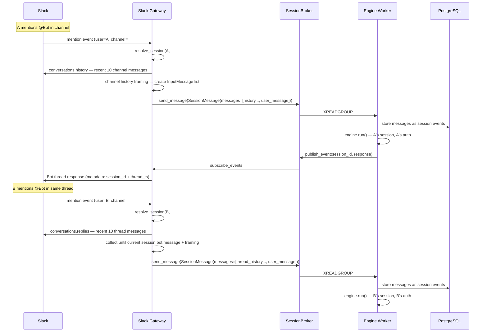

# Multi-user Scenario

This document defines scenarios where multiple users interact with Bot simultaneously in Slack channels. It includes rationale for core design decisions such as session model, history injection, broker protocol, and LLM role decision.

## Background

In nointern's session model, **session directly owns events (conversation history)**. Conversation history from external channels (such as Slack channel) is fetched from external platform API when needed and stored as session events.

## Basic Rules

### Response model

In all cases (channel, DM), **respond in thread**:

- **Channel message**: respond in mention message's thread → create new thread
- **DM message**: respond in message thread → create new thread
- **Message inside thread**: respond in that thread

Always use thread without exception, so session boundary is clear.

### Mention rules

- **Channel top-level**: `@Bot` mention required
- **Inside channel thread**: `@Bot` mention required
- **DM top-level**: mention not required (react to every message)
- **Inside DM thread**: mention not required

### Session key

`(installation_id, slack_channel_id, slack_thread_ts, slack_user_id)`

- In same thread, User A and User B each have **independent sessions**
- Different thread means separate session even for same user
- DM is also separated by thread

---

## Scenario 1: Single-user conversation

### Flow

1. A mentions Bot in channel: `@Bot tell me deployment schedule`
2. Gateway fetches channel history from Slack API
3. Bot responds in thread → create new thread and A's session
4. Bot responds while running run loop (multi-turn possible)
5. Later A continues conversation in same thread

### Key points

- **Bot runs with A's auth context**: use A's personal integrations (OAuth token) + team integrations
- **Events are stored in A's session**: Bot's run loop internal events (LLM call, tool use, etc.)

---

## Scenario 2: Consecutive mentions by same user (message queueing)

### Flow

1. A mentions Bot: `@Bot review PR #142`
2. Bot starts run loop (A's session)
3. While Bot is calling tools, A adds another mention in same thread: `@Bot also this PR is an urgent hotfix`
4. Additional message is added to broker queue
5. Bot's run loop receives queued messages with `poll_messages()` in next turn
6. Store new messages as session events and continue run loop

### Key points

- **One run loop absorbs multiple user messages**: one RunStarted → process N messages → one RunComplete
- **Still runs in A's session**: consecutive mentions by same user, so no session change
- See [Message Queueing design](./message-260305-message-queueing.md) for detailed mechanism

---

## Scenario 3: Simultaneous mentions by different users

### Flow

1. A mentions Bot: `@Bot review PR #142` → thread created
2. Bot is running run loop in A's session
3. B mentions Bot in same thread: `@Bot tell me Jira blocker status`
4. **B's separate session is activated** (same thread, different user → different session)
5. B's request runs independently in B's session

### Why B's request must not be merged into A's session

| Problem | Description |
|------|------|
| **Auth isolation violation** | If B's message is handled in A's session, B's request runs with A's auth |
| **Tool permission misuse** | A's personal integrations (Calendar, Gmail, etc.) could be used for B's request |
| **Conversation flow pollution** | Mixing B's Jira question into A's PR review context degrades quality for both |

### Key points

- **Independent session per user**: A mention → A session, B mention → B session
- **Concurrent execution possible**: Engine Worker processes each session independently
- **Same thread reference**: both sessions are in same thread, but sessions are separated

---

## History Injection

### Overview

History injection is split into **channel history** and **thread history**. Both are injected as `user` role, framed by gateway.

### Channel history

When mentioned at channel top-level, inject recent channel conversation as context. Channel mention always creates new thread → new session, so inject **once at session creation**.

#### Spec

- Call `conversations.history(channel, limit=11, latest=current_message_ts)`
- Use `latest` parameter to fetch messages before current mention message
- **Reason for limit=11**: actual injection max is 10. Request 11 to detect overflow:
  - returns 10 or fewer → entire channel conversation is included, inject as-is
  - returns 11 → there are more above, drop oldest 1 and inject 10 only + add `(Earlier messages were omitted)` framing at front
- Information to include per message:
  - `ts` (message ID)
  - author info (user id, display name — queried with `users.info` API, by unique user)
  - file attachment info (file name, type)
  - reaction emoji
  - message with thread shows `reply_count` (e.g. `(N replies)`)
- Inject as `user` role + framing
- **Store in DB as session event** (included in compaction target)

#### Framing example

```
The following is a recent conversation from this Slack channel.
Messages marked [Bot] are your previous responses to other users' requests.

(Earlier messages were omitted)
[A]: When is deployment?
[Bot]: Deployment is scheduled for 3 PM today.
[B]: Thanks (3 replies)
[C]: @Bot which services are included in deployment?
```

### Thread history

Because multiple users each have independent sessions inside same thread, inject **other users' conversation** missing from own session.

#### Spec

- Call `conversations.replies(channel, ts=thread_ts, limit=11, latest=current_message_ts)`
- **Reason for limit=11**: same as channel history. Request 11 to determine whether more than 10 exists
- Traverse from latest messages backward:
  - **Stop when current session's bot message is encountered** (determined by message metadata `session_id`)
  - Exclude messages from own session because they are already in DB
  - Include other users' messages and bot responses as context
- If traversal reaches end without stop point and 11 were returned, drop oldest 1 and add `(Earlier messages were omitted)` framing
- **Inject every turn** (conversation continues accumulating inside thread)
- **Store in DB as session event** (no duplicate with previous turn because it stops at own session bot message)
- `user` role + framing

#### Framing example

```
The following is a recent conversation from this thread.
Messages marked [Bot] are your previous responses to other users' requests.

[B]: What do you think about this part?
[Bot]: B's response...
[A]: @Bot another way instead of that?
```

### Bot message Metadata

Attach metadata to every Slack message sent by Bot and use it for session tracking:

```json
{
  "event_type": "nointern_response",
  "event_payload": {
    "session_id": "abc123",
    "thread_ts": "1234567890.123456"
  }
}
```

- `session_id`: session ID that created this message
- `thread_ts`: thread message if present, channel top-level message if absent

When injecting Thread history, if a bot message has `thread_ts` and `session_id` matching current session, stop traversal.

### LLM role decision: why `user` role

| Perspective | `assistant` role | `user` role (adopted) |
|------|-----------------|-------------------|
| **hallucination risk** | Bot may think it called tools before → answer without verification | treated as reference material → recheck with tool if needed |
| **tool_call pair issue** | Must reproduce tool_call/tool_response pairs from previous Bot response | only surface text, no internal events needed |
| **implementation complexity** | role classification + user/assistant alternation rules | deliver whole channel history as one context block |
| **persona continuity** | natural ("as I said earlier...") | supplemented by framing ("your previous statements") |

Core rationale for choosing **`user` role + framing**:

1. **Real bug experience**: when events from another session were inserted into same space, `Missing corresponding tool call for tool response message` occurred. Putting only surface text with `user` role makes this structurally impossible.
2. **Bot can understand "what it said" through framing**: if explicitly framed as "your previous response", LLM keeps persona while not confusing it with tool call result.
3. **Slack channel messages are already rendered final text**: internal events (reasoning, tool_call, etc.) are absent, so even `assistant` role would be incomplete information.

---

## Control message (Stop button)

Send control message to thread/DM on RunStarted. Delete on RunComplete/RunStopped.

### Spec

- **Include session owner mention**: `@UserA Responding...` + Stop button
  - Multiple sessions can run in same thread simultaneously, so mention identifies whose run it is
- **Do not use ephemeral**: ephemeral messages cannot be deleted/updated, so use normal message
- Stop button click → `SessionStopRequest` → broker → engine `check_stop()` → `RunStopped`
- **Button types**:
  - **Stop**: stop current run only. `SessionStopRequest` → broker → engine `check_stop()` → `RunStopped`
  - **Stop & Clear Session**: stop run + delete session mapping. Next mention starts as new session (same effect as `/nointern reset`)
- **Only session owner can operate**: include `session_id` and `slack_user_id` in button `value`; if clicking user is not session owner, block and respond with "You cannot stop another user's session." alert
- Delete with `chat.delete` on RunComplete/RunStopped
- `actions` block structure allows adding other buttons/actions in future

---

## Broker protocol change

For history injection, `SessionMessage` must be able to deliver multiple messages.

### Before

```python
@dataclasses.dataclass(frozen=True)
class SessionMessage:
    agent_id: str
    session_id: str
    user_message: str
    user_id: str | None = None
    metadata: dict[str, str] = ...
    attachments: list[str] = ...
```

### After

```python
@dataclasses.dataclass(frozen=True)
class InputMessage:
    """Individual message delivered through broker."""
    text: str
    user_id: str | None = None   # set only for session owner's message
    metadata: dict[str, str] = ...

@dataclasses.dataclass(frozen=True)
class SessionMessage:
    agent_id: str
    session_id: str
    messages: list[InputMessage]  # multiple messages
    attachments: list[str] = ...
```

- Each `InputMessage` has independent `text`, `user_id`, `metadata`
- `user_id` is set only for session owner's message (nointern user_id; None if not linked)
- History context message is delivered with `user_id = None`
- **Framing is gateway responsibility**: gateway composes Slack API response into framed text and puts it in `InputMessage.text`
- Engine stores and processes received messages as session events without changing them

---

## Web vs Slack comparison

| Item | Web | Slack |
|------|-----|-------|
| **External channel** | none (session = conversation) | Slack channel/DM |
| **Response method** | WebSocket streaming | thread response (both channel and DM) |
| **Mention rule** | N/A | channel/thread: mention required, DM: not required |
| **Session key** | user_id + session_id (explicit creation) | installation_id + channel_id + thread_ts + slack_user_id |
| **Channel history injection** | unnecessary (session events are full history) | once on session creation, stored as session event |
| **Thread history injection** | N/A | every turn, only range after own session bot message |
| **Multi-user** | 1:1 (user = session owner) | N:N (multiple users in same thread, each independent session) |

---

## Data flow summary



---

## Design decision rationale summary

| Decision | Rationale |
|------|------|
| **Always respond in thread** | clear session boundary, unify DM and channel logic |
| **Include slack_user_id in session key** | per-user auth isolation and tool permission isolation inside same thread |
| **Channel history: store once on session creation** | channel mention always creates new thread/session, so once is enough |
| **Thread history: store every turn** | conversation keeps accumulating inside thread, so latest context needed |
| **Attach metadata to bot messages** | distinguish sessions with session_id + thread_ts, determine stop point during history traversal |
| **Inject history as `user` role** | prevent hallucination + resolve tool_call pair issue + keep persona through framing |
| **Gateway owns framing** | engine remains platform-agnostic, gateway handles Slack-specific format |
| **Broker protocol: multiple messages** | deliver history + user message together, interface does not touch store directly |
| **InputMessage has user_id** | distinguish session owner's message; engine can identify speaker |

## Implementation Plan

Design document: [multi-user-scenario.md](../design/multi-user-scenario.md)

---

### Phase overview

| Phase | Title | Core change | Dependency |
|-------|------|----------|--------|
| 1 | Session key normalization | DB migration + query change + DM thread model | none |
| 2 | Broker protocol change | introduce `InputMessage`, `SessionMessage.messages` | none |
| 3 | Strengthen mention rule + improve Stop button | mention required in thread, permission check, Stop & Clear | Phase 1 |
| 4 | Attach Bot message Metadata | metadata in `chat_stream.stop()` + `chat_postMessage` | none |
| 5 | Channel history injection | `conversations.history` + framing + session event store | Phase 1, 2, 4 |
| 6 | Thread history injection | `conversations.replies` + bot message stop point + every-turn injection | Phase 1, 2, 4 |

Phases 1-4 are independent and can proceed in parallel. Phases 5 and 6 proceed after 1, 2, and 4 are complete.

---

### Phase 1: Session key normalization

#### Goal

Change session key from `(installation_id, channel_id, thread_ts)` to `(installation_id, channel_id, thread_ts, slack_user_id)` to guarantee per-user session isolation. Always create thread in DM as well to unify channel/DM logic.

#### 1-1. DB migration

**File:** `db-schemas/rdb/migrations/versions/` (new)

- Change `ix_slack_sessions_context` index: `(installation_id, slack_channel_id, slack_thread_ts)` → `(installation_id, slack_channel_id, slack_thread_ts, slack_user_id)`
- Drop existing index + create new index
- `slack_user_id` column already exists, so no schema change
- **downgrade**: restore reverse index

#### 1-2. Repository query change

**File:** `repos/slack_session/__init__.py`

Change `get_by_slack_context()` signature:

```python
async def get_by_slack_context(
    self,
    session: AsyncSession,
    installation_id: str,
    slack_channel_id: str,
    slack_thread_ts: str | None,
    slack_user_id: str,              # added
) -> SlackSession | None:
```

- Add `slack_user_id` condition to WHERE clause

#### 1-3. Service layer change

**File:** `services/slack/session.py`

`resolve_or_create_session()`:
- already receives `slack_user_id` as parameter
- only add passing `slack_user_id` to `get_by_slack_context()` call

Change `reset_session()` signature:

```python
async def reset_session(
    self,
    installation_id: str,
    slack_channel_id: str,
    slack_thread_ts: str | None,
    slack_user_id: str,              # added
) -> None:
```

#### 1-4. Handler change — DM thread model

**File:** `services/slack/handlers.py`

Change `handle_message()`:
- current: for DM, `reply_thread_ts = None`
- changed: even for DM, `reply_thread_ts = thread_ts or event_ts` (same as channel)
- result: every response creates a thread

Change `handle_reset_command()`:
- add `slack_user_id` parameter and call `reset_session()`

#### 1-5. Verification

- existing unit tests pass
- pyright, ruff pass
- manual test: verify separate sessions are created when different users mention in same thread

#### Modified files summary

| File | Change |
|------|------|
| `db-schemas/rdb/migrations/versions/` | index migration |
| `db-schemas/rdb/revision` | latest revision ID |
| `repos/slack_session/__init__.py` | add parameter to `get_by_slack_context()` |
| `services/slack/session.py` | update `resolve_or_create_session()`, `reset_session()` |
| `services/slack/handlers.py` | DM thread model, update `handle_reset_command()` |

---

### Phase 2: Broker protocol change

#### Goal

Change `SessionMessage.user_message: str` → `SessionMessage.messages: list[InputMessage]` to secure protocol for delivering history + user message together.

#### 2-1. Define InputMessage type

**File:** `broker/types.py`

```python
@dataclasses.dataclass(frozen=True)
class InputMessage:
    """Individual message delivered through broker."""
    text: str
    user_id: str | None = None
    metadata: dict[str, str] = dataclasses.field(default_factory=dict)
```

#### 2-2. Change SessionMessage

**File:** `broker/types.py`

```python
@dataclasses.dataclass(frozen=True)
class SessionMessage:
    agent_id: str
    session_id: str
    messages: list[InputMessage]        # changed: user_message → messages
    attachments: list[str] = dataclasses.field(default_factory=list)
    type: Literal["session_message"] = "session_message"
```

- remove `user_message`, `user_id`, `metadata` fields
- keep `attachments` (files are session-level)

#### 2-3. Worker-side consume change

**File:** `worker/engine.py`

`process_message()`:
- use last message (user message) from `messages` list when creating `InvokeInput`
- first through n-1 messages are history context

```python
# determine last message with user_id among messages as user message
last_msg = message.messages[-1]
invoke_input = InvokeInput(
    agent_id=message.agent_id,
    session_id=message.session_id,
    user_message=last_msg.text,
    user_id=last_msg.user_id,
    metadata=last_msg.metadata,
    attachments=message.attachments,
)
```

History message processing:
- store `messages[:-1]` as session events (convert to UserInputEvent)
- existing `resolve_invoke_input()` naturally includes history when loading events

`_make_poll_fn()`:
- use last message `content` + `metadata` from `SessionMessage.messages`

#### 2-4. WebSocket Handler change

**File:** `api/public/chat/v1/__init__.py`

```python
await broker.send_message(
    SessionMessage(
        agent_id=parsed.agent_id,
        session_id=session_id,
        messages=[
            InputMessage(
                text=parsed.message,
                user_id=current_user.user_id,
                metadata={"timestamp": datetime.now(tz).isoformat()},
            )
        ],
        attachments=attachment_uris,
    )
)
```

#### 2-5. Slack Handler change

**File:** `services/slack/handlers.py`

```python
await broker.send_message(
    SessionMessage(
        agent_id=agent_id,
        session_id=session_id,
        messages=[
            InputMessage(
                text=text,
                user_id=user_id,
                metadata={},
            )
        ],
        attachments=attachment_uris,
    )
)
```

In Phase 5 and 6, history messages are added before user message in `messages` list.

#### 2-6. Verification

- update existing unit tests (engine_test.py) + pass
- verify existing WebSocket conversation flow works normally
- pyright, ruff pass

#### Modified files summary

| File | Change |
|------|------|
| `broker/types.py` | add `InputMessage`, change `SessionMessage` |
| `worker/engine.py` | update `process_message()`, `_make_poll_fn()` |
| `api/public/chat/v1/__init__.py` | update WebSocket message creation |
| `services/slack/handlers.py` | update Slack message creation |
| `engine/run/input.py` | review `InvokeInput` change if needed |

---

### Phase 3: Strengthen mention rule + improve Stop button

#### Goal

- Require `@Bot` mention inside channel thread too
- Add session owner mention to Stop button
- Permission check so only session owner can Stop
- Add "Stop & Clear Session" button

#### 3-1. Require mention in thread

**File:** `services/slack/handlers.py`

Current code:

```python
if not is_dm and thread_ts is None:
    # only channel top-level mention check
```

Change:

```python
if not is_dm:
    # mention check for channel top-level + thread
    authorizations = body.get("authorizations", [])
    bot_user_id = authorizations[0].get("user_id", "") if authorizations else ""
    if not bot_user_id or f"<@{bot_user_id}>" not in text:
        return
```

#### 3-2. Stop button — session owner mention

**File:** `services/slack/streaming.py`

Change `_post_control_message()`:
- add `slack_user_id` parameter
- message text: `<@{slack_user_id}> Responding...`
- store button `value` as `session_id:slack_user_id` format (for permission check)

```python
async def _post_control_message(
    client: AsyncWebClient,
    channel: str,
    thread_ts: str | None,
    session_id: str,
    slack_user_id: str,       # added
) -> str | None:
```

#### 3-3. Stop button — permission check

**File:** `services/slack/handlers.py`

Change `handle_stop_action()`:
- parse `session_id:slack_user_id` from button `value`
- compare with `body["user"]["id"]`
- if mismatch → respond with Slack `response_action: errors` or ephemeral message "You cannot stop another user's session."

#### 3-4. Add "Stop & Clear Session" button

**File:** `services/slack/streaming.py`

Add button to `actions` block in `_post_control_message()`:

```python
{
    "type": "button",
    "text": {"type": "plain_text", "text": "Stop & Clear Session"},
    "action_id": "stop_and_clear_run",
    "value": f"{session_id}:{slack_user_id}",
}
```

**File:** `services/slack/handlers.py`

Add `handle_stop_and_clear_action()`:
- Stop behavior + delete session mapping (same as `/nointern reset`)

**File:** `services/slack/bolt.py`

- register `app.action("stop_and_clear_run")`
- inject `SlackSessionService` into handler

#### 3-5. Change stream_to_slack signature

**File:** `services/slack/streaming.py`

Pass `slack_user_id` when calling `_post_control_message()` from `stream_to_slack()`:

```python
control_msg_ts = await _post_control_message(
    client, channel, thread_ts, session_id, slack_user_id
)
```

`slack_user_id` is already a parameter, so only pass it through.

#### Modified files summary

| File | Change |
|------|------|
| `services/slack/handlers.py` | expand mention check scope, permission check, `handle_stop_and_clear_action()` |
| `services/slack/streaming.py` | mention in control message + add button |
| `services/slack/bolt.py` | register `stop_and_clear_run` action |

---

### Phase 4: Attach Bot Message Metadata

#### Goal

Attach metadata to every Slack message sent by Bot and use it as session tracking / traversal stop point during history injection.

#### 4-1. Update Type Stub

**File:** `typings/slack_sdk/web/async_chat_stream.pyi`

Add `metadata` parameter to `stop()` method:

```python
async def stop(
    self,
    *,
    markdown_text: str | None = None,
    metadata: dict[str, object] | None = None,
) -> None: ...
```

**File:** `typings/slack_sdk/web/async_client.pyi`

Add `metadata` parameter to `chat_postMessage()`:

```python
async def chat_postMessage(
    self,
    *,
    channel: str,
    text: str | None = None,
    thread_ts: str | None = None,
    blocks: list[dict[str, object]] | None = None,
    metadata: dict[str, object] | None = None,
) -> AsyncSlackResponse: ...
```

#### 4-2. Pass Metadata in Streaming

**File:** `services/slack/streaming.py`

`stream_to_slack()`:
- create metadata structure:

```python
bot_metadata = {
    "event_type": "nointern_response",
    "event_payload": {
        "session_id": session_id,
    },
}
```

- pass `metadata=bot_metadata` when calling `streamer.stop()`
- pass `metadata=bot_metadata` when calling `chat_postMessage()` (case where message is sent directly without stream at TextEnd)

#### 4-3. Verification

- After bot response, check metadata with `conversations.replies(include_all_metadata=True)`
- Verify `event_type`, `event_payload.session_id` exist

#### Modified files summary

| File | Change |
|------|------|
| `typings/slack_sdk/web/async_chat_stream.pyi` | `stop()` metadata parameter |
| `typings/slack_sdk/web/async_client.pyi` | `chat_postMessage()` metadata parameter |
| `services/slack/streaming.py` | attach metadata to bot response |

---

### Phase 5: Channel history injection

#### Goal

When mentioned at channel top-level, inject recent channel conversation as context. Inject once at session creation and store as session event.

#### 5-1. Add Type Stub

**File:** `typings/slack_sdk/web/async_client.pyi`

```python
async def conversations_history(
    self,
    *,
    channel: str,
    cursor: str | None = None,
    include_all_metadata: bool | None = None,
    latest: str | None = None,
    limit: int | None = None,
    oldest: str | None = None,
) -> AsyncSlackResponse: ...

async def users_info(
    self,
    *,
    user: str,
) -> AsyncSlackResponse: ...
```

#### 5-2. History collection module

**File:** `services/slack/history.py` (new)

```python
async def collect_channel_history(
    client: AsyncWebClient,
    channel: str,
    latest: str,
    session_id: str,
) -> list[InputMessage]:
    """Collect channel history and convert to InputMessage list."""
```

Implementation details:
- call `conversations.history(channel, limit=11, latest=latest)`
- call `users.info(user=msg["user"])` (by unique user, avoid duplicate calls)
- if 11 returned → drop oldest 1 and use only 10 + `(Earlier messages were omitted)` framing
- if 10 or fewer returned → use all
- Message format:
  - `[DisplayName]: {text}` (normal message)
  - `[Bot]: {text}` (bot message)
  - File attachment: show `(File: filename.pdf)`
  - Reactions: show `(Reactions: 👍 3, ❤️ 1)`
  - reply_count: show `(N replies)`
- Return one `InputMessage(text=framed_text, user_id=None)` containing framing text + message list
- `user_id=None`: history context is not session owner's message

#### 5-3. Handler integration

**File:** `services/slack/handlers.py`

`handle_message()`:
- if session newly created (`was_created=True`) + channel top-level mention:
  - call `collect_channel_history()`
  - prepend result to `SessionMessage.messages`

```python
history_messages: list[InputMessage] = []
if was_created and not is_dm and thread_ts is None:
    history_messages = await collect_channel_history(
        client, slack_channel_id, event_ts, session_id
    )

await broker.send_message(
    SessionMessage(
        agent_id=agent_id,
        session_id=session_id,
        messages=[
            *history_messages,
            InputMessage(text=text, user_id=user_id, metadata={}),
        ],
        attachments=attachment_uris,
    )
)
```

#### 5-4. Worker side — store history events

**File:** `worker/engine.py`

`process_message()`:
- Convert `messages[:-1]` (history) to `UserInputEvent`
- call `engine.store.append()` and store as session event
- Then proceed with user message through `resolve_invoke_input()` → `engine.run()`
- History naturally included in compaction

#### 5-5. Verification

- Confirm history is included in LLM context on first mention in channel
- Confirm `(Earlier messages were omitted)` appears when more than 10 messages
- Confirm history is not re-injected on second mention (same thread)

#### Modified files summary

| File | Change |
|------|------|
| `typings/slack_sdk/web/async_client.pyi` | `conversations_history`, `users_info` stubs |
| `services/slack/history.py` | **new** — channel history collection |
| `services/slack/handlers.py` | channel history injection logic |
| `worker/engine.py` | history messages → session event store |

---

### Phase 6: Thread history injection

#### Goal

When mentioned inside thread, inject thread history every turn to supplement other users' conversation not present in own session.

#### 6-1. Add Type Stub

**File:** `typings/slack_sdk/web/async_client.pyi`

```python
async def conversations_replies(
    self,
    *,
    channel: str,
    ts: str,
    cursor: str | None = None,
    include_all_metadata: bool | None = None,
    latest: str | None = None,
    limit: int | None = None,
    oldest: str | None = None,
) -> AsyncSlackResponse: ...
```

#### 6-2. Thread history collection

**File:** `services/slack/history.py`

```python
async def collect_thread_history(
    client: AsyncWebClient,
    channel: str,
    thread_ts: str,
    latest: str,
    current_session_id: str,
) -> list[InputMessage]:
    """Collect thread history.

    Stop traversal when current session's bot message is encountered.
    """
```

Implementation details:
- call `conversations.replies(channel, ts=thread_ts, limit=11, latest=latest, include_all_metadata=True)`
- traverse from newest to oldest:
  - if message metadata has `event_type == "nointern_response"` && `session_id == current_session_id` → stop
  - exclude own session messages (already in DB)
  - collect other users' messages + bot responses
- if 11 returned and traversal reached end without stop point → add `(Earlier messages were omitted)` framing
- framing: `"The following is a recent conversation from this thread.\nMessages marked [Bot] are your previous responses to other users' requests."`
- if no collected messages, return empty list (no injection)

#### 6-3. Handler integration

**File:** `services/slack/handlers.py`

`handle_message()`:
- if inside thread (`thread_ts is not None`):
  - call `collect_thread_history()`
  - prepend result to `SessionMessage.messages`

```python
if thread_ts is not None and not is_dm:
    thread_history = await collect_thread_history(
        client, slack_channel_id, reply_thread_ts, event_ts, session_id
    )
    history_messages = thread_history
```

#### 6-4. Worker side — store history events

Same mechanism as Phase 5. Convert `messages[:-1]` to `UserInputEvent` and store as session event. Since traversal stops at own session bot message, it does not duplicate previous turn.

#### 6-5. Verification

- Confirm other user's conversation is included in context when mentioned after another user's conversation inside thread
- Confirm only range after own session bot response is injected
- Confirm injection updates every turn

#### Modified files summary

| File | Change |
|------|------|
| `typings/slack_sdk/web/async_client.pyi` | `conversations_replies` stub |
| `services/slack/history.py` | add `collect_thread_history()` |
| `services/slack/handlers.py` | thread history injection logic |

---

### Full modified file map

```
python/apps/nointern/
├── typings/slack_sdk/web/
│   ├── async_client.pyi              # Phase 4, 5, 6: add method stubs
│   └── async_chat_stream.pyi         # Phase 4: stop() metadata
├── src/nointern/
│   ├── broker/
│   │   └── types.py                  # Phase 2: InputMessage, SessionMessage
│   ├── repos/slack_session/
│   │   └── __init__.py               # Phase 1: get_by_slack_context query
│   ├── services/slack/
│   │   ├── handlers.py               # Phase 1, 2, 3, 5, 6: core changes
│   │   ├── streaming.py              # Phase 3, 4: Stop improvement, metadata
│   │   ├── session.py                # Phase 1: reset_session change
│   │   ├── bolt.py                   # Phase 3: action registration
│   │   └── history.py                # Phase 5, 6: **new** history collection
│   ├── services/agent_runtime/
│   │   └── data.py                   # Phase 2: review InvokeInput change
│   ├── worker/
│   │   └── engine.py                 # Phase 2, 5: message consumption change
│   └── api/public/chat/v1/
│       └── __init__.py               # Phase 2: WebSocket message creation
└── db-schemas/rdb/
    ├── migrations/versions/          # Phase 1: index migration
    └── revision                      # Phase 1: revision update
```

---

### Recommended implementation order

```mermaid
gantt
    title Slack Multi-user Implementation Schedule
    dateFormat X
    axisFormat %s

    section Foundation
    Phase 1 session key normalization       :p1, 0, 1
    Phase 2 broker protocol                 :p2, 0, 1
    Phase 3 mention + Stop improvement      :p3, 0, 1
    Phase 4 bot message Metadata            :p4, 0, 1

    section History Injection
    Phase 5 channel history                 :p5, after p1 p2 p4, 1
    Phase 6 Thread history                  :p6, after p5, 1
```



Phases 1-4 are independent and can be done concurrently. Phase 5 proceeds after 1, 2, and 4 are all complete. Phase 6 reuses Phase 5 history module, so it proceeds after Phase 5.

---

### Slack app permission check

OAuth scopes needed for history injection:
- `channels:history` — read public channel history
- `groups:history` — read private channel history
- `im:history` — read DM history
- `mpim:history` — read group DM history
- `users:read` — read user info

Need to confirm whether existing scopes include them. If not, add in Slack app settings.
