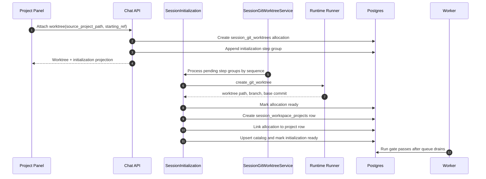

# Multi-Worktree Registration

## Problem

Azents can create a new AgentSession in one Azents-owned Git worktree, but the current `session_git_worktrees` model has a unique `session_id` constraint and the worktree initialization runner assumes one allocation per session. Existing sessions can register ordinary existing folders as Projects, but they cannot request additional Azents-owned Git worktrees from the Project panel.

Users need to attach multiple Git worktree Projects to an existing active session without creating a new session for each isolated branch/workspace.

## Goals

- Allow an active AgentSession to own multiple Git worktree allocations.
- Reuse the existing `SessionInitialization` lifecycle as the session-level sequential workspace preparation queue.
- Register each completed worktree as a normal `SessionWorkspaceProject` so prompt/tool Project scope continues to use the existing Project registry.
- Keep Runner Git operations typed and reuse existing `list_git_refs`, `create_git_worktree`, `remove_git_worktree`, and `delete_git_branch` operations.
- Keep this feature focused on multiple worktree registration, not a broad Project cleanup redesign.

## Non-Goals

- Do not introduce a separate generic background-job lifecycle.
- Do not replace `session_workspace_projects` as the prompt/tool Project boundary.
- Do not let agents create worktrees through tool calls.
- Do not redesign archive cleanup beyond iterating all session-owned worktree allocations.
- Do not add setup scripts or dependency bootstrap steps.

## Current Behavior

`POST /chat/v1/agents/{agent_id}/sessions/messages` and `POST /chat/v1/agents/{agent_id}/sessions` accept `workspace_mode.type = "git_worktree"` for new-session creation. The service creates one `SessionInitialization`, one `session_git_worktrees` row, and the fixed initialization steps:

- `create_git_worktree`
- `register_workspace_project`
- `upsert_project_catalog`
- `refresh_project_status`

The runner executes Git worktree creation, then the backend registers the final worktree path as a `SessionWorkspaceProject` and upserts the Agent Project Catalog. `session_git_worktrees.session_id` is unique, so a session can have at most one allocation.

For existing sessions, `POST /chat/v1/agents/{agent_id}/sessions/{session_id}/projects/register` registers an existing directory as a Project, but it does not create a Git worktree or record Git ownership metadata.

## Proposed Design

Use the single `SessionInitialization` row for each session as a sequential workspace preparation queue. New-session Git worktree creation remains the first queued work. Existing-session worktree registration appends a new worktree allocation and a new step group to the same session initialization.



### Step Groups

Each worktree allocation gets a unique step group. Step keys include the `worktree_id` so multiple groups can coexist under the same initialization:

| Step key pattern | Type | Blocking | Executor |
| --- | --- | --- | --- |
| `create_git_worktree:{worktree_id}` | `create_git_worktree` | true | runner |
| `register_workspace_project:{worktree_id}` | `register_workspace_project` | true | backend |
| `upsert_project_catalog:{worktree_id}` | `upsert_project_catalog` | true | backend |
| `refresh_project_status:{worktree_id}` | `refresh_project_status` | false | backend |

`sequence` is allocated after the current maximum step sequence for the session initialization. The processor handles pending step groups in sequence order.

### Run Gate

The existing initialization run gate remains authoritative. While appended blocking worktree steps are pending or running, initialization status is `pending` or `running`, so normal run dispatch waits. This avoids starting a model turn with a Project set that is still being changed. After all blocking queued steps complete, initialization returns to `ready` and the next wake-up can run with the updated Project registry.

### Concurrency

Concurrent attach requests append independent step groups. Processing is serialized per session by reading the ordered pending steps. If a processor is already running, the additional group remains pending and is picked up by the same processor loop or by a later wake/retry.

The implementation should avoid relying on fixed step keys and should find a worktree's steps through the `worktree_id` suffix or resource descriptor metadata.

## Data Model Changes

### `session_git_worktrees`

- Remove `uq_session_git_worktrees_session_id`.
- Add nullable `session_workspace_project_id` FK to `session_workspace_projects.id` with `ON DELETE SET NULL`.
- Add indexes:
  - `ix_session_git_worktrees_session_id_status`
  - `ix_session_git_worktrees_session_workspace_project_id`

Existing rows remain valid. `session_workspace_project_id` is nullable because older rows and failed allocations may not have a registered Project row.

### `session_initialization_steps`

No schema change is required. Multiple worktree groups are represented by unique `step_key` values and ordered `sequence` values.

## API Changes

Add existing-session worktree registration:

```http
POST /chat/v1/agents/{agent_id}/sessions/{session_id}/git-worktrees
```

Request:

```json
{
  "source_project_path": "/workspace/agent/azents",
  "starting_ref": "refs/heads/main"
}
```

Response:

```json
{
  "worktree": {
    "id": "...",
    "session_id": "...",
    "source_project_path": "/workspace/agent/azents",
    "starting_ref": "refs/heads/main",
    "worktree_path": "/workspace/agent/.azents/worktrees/.../azents",
    "branch_name": "azents/session-handle",
    "status": "pending",
    "session_workspace_project_id": null
  },
  "initialization": {
    "id": "...",
    "status": "pending",
    "steps": []
  }
}
```

The existing Git ref preview endpoint remains unchanged:

```http
GET /chat/v1/agents/{agent_id}/git-refs?source_project_path=...
```

Retry can initially reuse the existing session initialization retry endpoint by resetting failed retryable steps. A worktree-specific retry endpoint can be added later if the UX needs per-allocation retry controls.

## Backend Behavior

### Attach request

1. Validate agent/session/user access.
2. Reject archived sessions.
3. Reject team-primary sessions only if product policy decides worktree attachment is non-primary-only; otherwise allow any active session with Project registry access.
4. Normalize `source_project_path` and require a non-empty `starting_ref`.
5. Ensure or fetch the session's `SessionInitialization` row.
6. Create a `session_git_worktrees` allocation with generated target path and branch name.
7. Append the four worktree step records using `worktree_id`-scoped step keys.
8. Mark initialization `pending` and append an informational initialization event.
9. Schedule background processing and return the compact initialization projection.

### Processor

Replace the single-allocation assumption with ordered pending work:

- list all worktree allocations for the session;
- list initialization steps for the session;
- group worktree steps by `worktree_id`;
- process the earliest pending group to completion before moving to the next group;
- after the queue drains, mark initialization `ready`.

The existing create/register/catalog/refresh step implementations can be reused after they accept a worktree allocation and its scoped steps.

### Archive cleanup

Archive cleanup should iterate all non-cleaned allocations for the session. This is a narrow extension of current behavior and does not change cleanup authority: only `session_git_worktrees` ownership rows authorize destructive worktree/branch deletion.

## Frontend Behavior

The Project panel adds a `New worktree` action near existing Project registration.

Flow:

1. User opens `New worktree` from an existing session's Project panel.
2. User selects a source Project directory.
3. UI previews Git refs through the existing `previewAgentGitRefs` tRPC query.
4. User chooses a starting ref and submits.
5. UI calls the new attach mutation.
6. The existing initialization live projection shows workspace update progress.
7. When ready, Project queries and Project Browser manifest are invalidated so the new worktree appears as a registered Project.

The UI copy should avoid implying first-session-only setup. Prefer labels like `Updating workspace` or `Preparing Project` for queued existing-session work.

## Error Handling

- Invalid source path or missing starting ref returns `400`.
- Agent/session not found or inaccessible returns the existing 404-safe session behavior.
- Runtime runner not ready is recorded as initialization failure when discovered during background processing.
- Git command semantic failures are recorded on the matching worktree allocation and scoped initialization step.
- Backend registration/catalog failures fail only that worktree step group and leave later groups pending until retry.

## Security and Permissions

- Worktree attachment uses the same workspace membership/session access boundary as Project registration.
- Source paths remain constrained to the Agent Workspace root.
- Destructive cleanup remains authorized only by matching `session_git_worktrees` ownership rows.
- Runner operations remain typed Git operations; no arbitrary shell command strings are introduced.

## Migration and Rollout

1. Generate an Alembic migration that removes the unique session constraint and adds `session_workspace_project_id` plus indexes.
2. Existing single-worktree sessions continue to work because their allocation rows remain unchanged.
3. Backend processor changes should support both legacy fixed step keys and new scoped step keys until all active old initializations have completed or failed.
4. Public API clients must be regenerated after API schema changes.

## Test Strategy

Product behavior verification is E2E primary. Unit and integration tests cover backend queue correctness and API contracts.

### E2E primary verification matrix

| Behavior | E2E path | Expected evidence |
| --- | --- | --- |
| Attach first worktree to existing session | Open Project panel, create worktree from source Project/ref | Initialization progress appears and Project list includes created worktree |
| Attach second worktree to same session | Repeat attach flow with same or different source Project | Session contains two worktree-created Project rows |
| Sequential queue behavior | Submit two attach requests before first completes | Initialization processes groups in sequence and returns to ready after both complete |
| Run gate while updating workspace | Send message while worktree registration is pending | Input stays pending until initialization is ready, then run starts with updated Projects |
| Failed worktree creation | Use invalid ref or non-Git source fixture | Initialization shows scoped failure and no Project row is registered for failed allocation |

### Supporting tests

- Repository test for multiple `session_git_worktrees` rows per session.
- Service test for scoped step key creation and sequence allocation.
- Service test for ordered processing of two allocations.
- API test for the new attach endpoint and error mapping.
- Frontend component/container tests or Storybook states for the Project panel worktree attach UI.

### Fixture and prerequisite requirements

- Runtime fixture with a Git repository under the Agent Workspace.
- Ability to preview refs and create multiple branch-backed worktrees in the same runtime.
- Test evidence should include created session ID, worktree IDs, Project paths, and initialization status transitions.

### CI policy

- Backend repository/service/API tests must run in normal CI.
- Browser E2E can run in the existing E2E lane when the runtime fixture is available.
- Runtime-dependent E2E tests may be marked optional only when the CI environment cannot provide a ready runner; API/service coverage must not be skipped.

## Alternatives Considered

### Separate worktree operation lifecycle

A separate operation lifecycle would avoid overloading `SessionInitialization`, but it would duplicate live projection, retry, and run-gating behavior. The current scope is specifically workspace preparation for a session, so the existing initialization lifecycle is the smaller and more consistent model.

### Worktree registration without run gate

Allowing runs while worktree registration is in progress would keep the composer unblocked, but it can start a turn before the intended Project exists in prompt/tool scope. Blocking through the existing initialization gate is safer and reuses current worker semantics.
