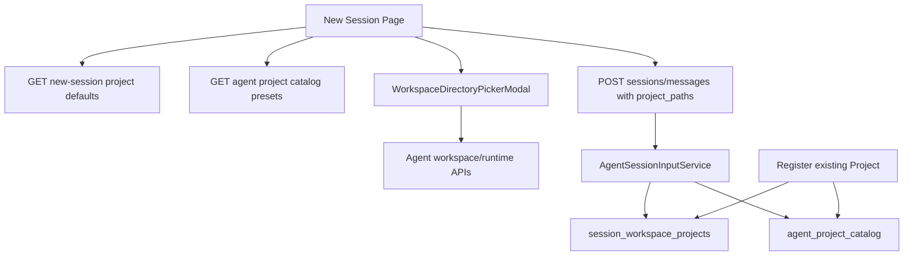

# New Session Project Selection Design

## Overview

Azents currently creates new team sessions from `/sessions/new` only after the user sends the first message. The backend creates the concrete `AgentSession`, buffers the first input, and historically copies Projects from the team-primary session.

This design changes new session creation so users can choose the session's Project paths before sending the first message. The selected chip list becomes the exact Project set for the created session. A lightweight Agent-owned Project Catalog stores previously used Project paths as presets for the dropdown, but remains only a preset store.

This design implements the first step of the broader session Project roadmap captured in `docs/azents/notes/session-project-model-research.md`.

## Requirements

### REQ-1. Exact Project set for new sessions

New session creation must register exactly the `project_paths` submitted by the client.

Related decisions: ADR-0086-D1, ADR-0086-D2

Acceptance criteria:

- `project_paths: []` creates a non-primary session with no `session_workspace_projects` rows.
- `project_paths: [A, B]` creates exactly rows for `A` and `B`.
- Team-primary Projects are not copied implicitly.

### REQ-2. Required `project_paths` on session creation APIs

Both direct session creation and first-message session creation require `project_paths`.

Related decisions: ADR-0086-D2

Acceptance criteria:

- Public request schemas include required `project_paths`.
- tRPC callers send `projectPaths` explicitly.
- Missing `project_paths` is rejected by request validation.

### REQ-3. Default selected Projects from latest non-primary session

The new session page must initialize its chip list from the latest active non-primary session for the Agent.

Related decisions: ADR-0086-D3

Acceptance criteria:

- If the Agent has active non-primary sessions, the most recently created one provides default Project paths.
- If there are no active non-primary sessions, the default list is empty.
- Team-primary Projects are not used as fallback defaults.

### REQ-4. Agent-owned Project Catalog presets

The Add Project dropdown must load preset paths from an Agent-owned Project Catalog.

Related decisions: ADR-0086-D4, ADR-0086-D5

Acceptance criteria:

- Catalog rows are keyed by `(agent_id, path)`.
- Session creation upserts submitted Project paths into the catalog.
- Existing Project registration upserts the registered Project path into the catalog.
- Catalog presets are returned sorted by most recent update descending.
- Migration deduplicates existing `session_workspace_projects` into catalog rows.

### REQ-5. Catalog remains preset-only

The catalog must not become the canonical session Project identity in this phase.

Related decisions: ADR-0086-D4, ADR-0086-D6

Acceptance criteria:

- `session_workspace_projects` do not contain a catalog FK.
- Existing prompt/tooling behavior can continue reading session Project paths directly.
- Catalog APIs expose path/timestamp preset data only.

### REQ-6. Nested and overlapping Projects

Project path validation must allow nested Project paths and parent/child overlap within the same session.

Related decisions: ADR-0086-D7

Acceptance criteria:

- `/workspace/agent/repo/packages/api` is accepted as a Project path.
- `/workspace/agent/repo` and `/workspace/agent/repo/packages/api` can coexist in the same session.
- `/workspace/agent` itself remains invalid.
- Exact duplicate paths in a request are deduplicated before row creation.

### REQ-7. New-session Project selector UI

The new session page must render a Project chip selector above the chat input.

Related decisions: ADR-0086-D1, ADR-0086-D3, ADR-0086-D4

Acceptance criteria:

- Chips show the folder basename.
- Clicking a chip shows full path and a remove action.
- Add Project dropdown shows catalog presets with basename and dimmed full path.
- Already selected presets are disabled or marked as selected.
- The selected chips are submitted with the first message.

### REQ-8. Direct directory picker

The selector must support direct folder selection through a dedicated directory picker modal.

Related decisions: ADR-0086-D8

Acceptance criteria:

- Runtime inactive state shows a start runtime CTA.
- Runtime transition states show loading/recovery UI.
- Ready state shows a directory tree.
- Nested directories can be selected.
- `/workspace/agent` and files cannot be selected.
- File-management actions are not exposed.

### REQ-9. Session creation does not require runner existence checks

Session creation validates path shape but does not check runner directory existence.

Related decisions: ADR-0086-D9

Acceptance criteria:

- Session creation succeeds with stale preset paths if they pass registry-level validation.
- Existing explicit Project registration may continue to require runtime directory existence.
- First-message session creation does not fail only because the runtime is not ready for path stat/list checks.

## Decision Table

| ADR decision | Requirements |
| --- | --- |
| ADR-0086-D1 | REQ-1, REQ-7 |
| ADR-0086-D2 | REQ-1, REQ-2 |
| ADR-0086-D3 | REQ-3, REQ-7 |
| ADR-0086-D4 | REQ-4, REQ-5, REQ-7 |
| ADR-0086-D5 | REQ-4 |
| ADR-0086-D6 | REQ-5 |
| ADR-0086-D7 | REQ-6 |
| ADR-0086-D8 | REQ-8 |
| ADR-0086-D9 | REQ-9 |

## Current Implementation Findings

Relevant current frontend files:

- `typescript/apps/azents-web/src/app/(app)/w/[handle]/(agent)/agents/[agentId]/sessions/new/page.tsx`
- `typescript/apps/azents-web/src/features/agents/AgentDraftChatPage.tsx`
- `typescript/apps/azents-web/src/features/agents/components/AgentDraftChat.tsx`
- `typescript/apps/azents-web/src/features/agents/containers/useAgentDraftChatContainer.ts`
- `typescript/apps/azents-web/src/features/chat/workspace/components/FileBrowser.tsx`
- `typescript/apps/azents-web/src/features/chat/workspace/components/RuntimeActivationView.tsx`
- `typescript/apps/azents-web/src/features/chat/workspace/containers/useWorkspacePanelContainer.ts`
- `typescript/apps/azents-web/src/trpc/routers/chat.ts`

Relevant current backend files:

- `python/apps/azents/src/azents/api/public/chat/v1/__init__.py`
- `python/apps/azents/src/azents/api/public/chat/v1/data.py`
- `python/apps/azents/src/azents/services/chat/__init__.py`
- `python/apps/azents/src/azents/services/agent_session_input.py`
- `python/apps/azents/src/azents/services/session_workspace_project/__init__.py`
- `python/apps/azents/src/azents/repos/session_workspace_project/__init__.py`
- `python/apps/azents/src/azents/rdb/models/session_workspace_project.py`

Current findings:

- `/sessions/new` is a draft page; the session is created by `createTeamAgentSessionMessage` on first send.
- Direct session creation exists as `createTeamAgentSession`, although current UI mainly uses first-message creation.
- Workspace file APIs are Agent-scoped and do not truly require a session ID, even though the tRPC wrapper currently accepts one in `readAgentWorkspacePath`.
- Existing `FileBrowser` is a management browser and exposes destructive actions; it should not be reused directly for Project selection.
- Current Project path validation rejects nested paths and parent/child overlap; this must change.

## Proposed Architecture



The Project selector owns draft-time selected paths. On send, `projectPaths` is included in the first-message mutation.

The backend creates the session, deduplicates/validates submitted paths, inserts session Project rows, upserts catalog presets, then creates the input buffer.

## Data Model

### New table: Agent Project Catalog / Presets

Implementation name should avoid over-promising logical Project semantics. A table name such as `agent_project_presets` is preferred even if the product discussion calls it a catalog.

Proposed columns:

```text
agent_project_presets
- id string(32) primary key
- agent_id string(32) not null references agents(id) on delete cascade
- path text not null
- created_at timestamptz not null default now()
- updated_at timestamptz not null default now()
```

Constraints/indexes:

```text
unique(agent_id, path)
index(agent_id, updated_at desc)
```

Migration:

```sql
INSERT INTO agent_project_presets (agent_id, path, created_at, updated_at)
SELECT
  s.agent_id,
  p.path,
  MIN(p.created_at),
  MAX(p.updated_at)
FROM session_workspace_projects p
JOIN agent_sessions s ON s.id = p.session_id
GROUP BY s.agent_id, p.path;
```

The migration should use the app's ID generation pattern rather than relying on database-generated IDs if IDs are generated in Python models.

### Existing table: session_workspace_projects

No catalog FK is added.

Path-only binding remains:

```text
session_workspace_projects
- id
- session_id
- path
- created_at
- updated_at
```

The unique `(session_id, path)` constraint remains useful.

## Backend Design

### Repository additions

Add repository for presets, or add a dedicated module:

```text
python/apps/azents/src/azents/repos/agent_project_preset/
```

Domain models:

```python
@dataclass(frozen=True)
class AgentProjectPreset:
    id: str
    agent_id: str
    path: str
    created_at: datetime
    updated_at: datetime
```

Repository methods:

```python
async def upsert_preset(session, *, agent_id: str, path: str) -> AgentProjectPreset: ...
async def list_presets(session, *, agent_id: str) -> list[AgentProjectPreset]: ...
async def bootstrap_from_existing_session_projects(session) -> None: ...  # migration only
```

### Path validation changes

`normalize_session_workspace_path` should keep:

- absolute path required;
- under `/workspace/agent` required;
- `/workspace/agent` root rejected.

It should remove:

- direct-child-only restriction.

Conflict checking should remove parent/child rejection. Exact duplicate handling for session creation should deduplicate input paths before row creation. Existing single Project registration can keep exact duplicate rejection through repository unique constraint / existing duplicate check.

### Session creation changes

Create a shared helper used by `ChatSessionService` and `AgentSessionInputService`:

```python
async def bootstrap_session_projects(
    session: AsyncSession,
    *,
    agent_id: str,
    session_id: str,
    project_paths: list[str],
) -> None:
    normalized_paths = dedupe_preserving_order(
        normalize_session_workspace_path(path) for path in project_paths
    )
    for path in normalized_paths:
        await session_workspace_project_repository.create_project(
            session,
            SessionWorkspaceProjectCreate(session_id=session_id, path=path),
        )
        await agent_project_preset_repository.upsert_preset(
            session,
            agent_id=agent_id,
            path=path,
        )
```

Do not runner-stat these paths during session creation.

### Direct Project registration changes

Existing Project registration should:

- keep runtime directory existence validation;
- allow nested paths;
- allow parent/child overlap;
- upsert the registered path into `agent_project_presets` on success.

### Defaults API

Add endpoint:

```http
GET /chat/v1/agents/{agent_id}/session-project-defaults
```

Response:

```json
{
  "project_paths": ["/workspace/agent/azents"],
  "source": {
    "type": "recent_session",
    "session_id": "..."
  }
}
```

If no latest non-primary active session exists:

```json
{
  "project_paths": [],
  "source": { "type": "empty" }
}
```

The service should validate Agent access through workspace membership.

### Presets API

Add endpoint:

```http
GET /chat/v1/agents/{agent_id}/project-presets
```

Response:

```json
{
  "items": [
    {
      "id": "...",
      "path": "/workspace/agent/azents",
      "created_at": "...",
      "updated_at": "..."
    }
  ]
}
```

The frontend can compute basename from `path`.

### Public API schemas

Add/update:

```python
class AgentSessionCreateRequest(BaseModel):
    project_paths: list[str]

class ChatSessionCreateMessageWriteRequest(BaseModel):
    client_request_id: str
    message: str
    attachments: list[str] | None = None
    project_paths: list[str]

class AgentProjectPresetResponse(BaseModel):
    id: str
    path: str
    created_at: datetime
    updated_at: datetime

class AgentProjectPresetListResponse(BaseModel):
    items: list[AgentProjectPresetResponse]

class AgentSessionProjectDefaultsResponse(BaseModel):
    project_paths: list[str]
    source: AgentSessionProjectDefaultsSourceResponse
```

Regenerate OpenAPI and `@azents/public-client`.

## Frontend Design

### Draft container state

Extend `useAgentDraftChatContainer`:

```ts
selectedProjectPaths: string[];
projectPresets: ...;
projectDefaults: ...;
onAddProjectPath(path: string): void;
onRemoveProjectPath(path: string): void;
onOpenProjectPicker(): void;
onCloseProjectPicker(): void;
```

Initial selection:

- load `session-project-defaults`;
- set selected paths from defaults once, unless the user already edited selection.

Message send:

```ts
createMessageMutation.mutateAsync({
  agentId: agent.id,
  clientRequestId: crypto.randomUUID(),
  message,
  attachments: attachmentUris,
  projectPaths: selectedProjectPaths,
});
```

### Project selector component

Add component:

```text
typescript/apps/azents-web/src/features/agents/components/NewSessionProjectSelector.tsx
```

UI shape:

```text
Projects
[ azents × ] [ api × ] [ + Add project ]
```

Add dropdown:

```text
+ Add project
  azents      /workspace/agent/azents
  api         /workspace/agent/azents/packages/api
  ─────────────────────────────────
  Choose folder...
```

Chip behavior:

- label: basename path segment;
- click opens popover;
- popover shows full path and Remove button;
- later can add git metadata in the same popover.

Already-selected presets:

- disabled or marked as selected.

Duplicate prevention:

- frontend should not add the same exact path twice;
- backend also deduplicates session-creation inputs.

### Directory picker modal

Add component:

```text
typescript/apps/azents-web/src/features/chat/workspace/components/WorkspaceDirectoryPickerModal.tsx
```

It should use a dedicated hook or a small container:

```text
useWorkspaceDirectoryPicker
```

Responsibilities:

- query `getAgentWorkspace` with transition polling;
- start runtime via `startAgentRuntime`;
- read directories via `readAgentWorkspacePath`;
- maintain current directory/tree expansion/search state;
- select directories only.

Selection policy:

- `/workspace/agent` root is visible but not selectable;
- nested directories are selectable;
- file rows are visible only if useful for context, but disabled for selection. MVP can hide files to reduce noise.

### tRPC changes

Add procedures:

```ts
listAgentProjectPresets({ agentId })
getAgentSessionProjectDefaults({ agentId })
```

Update procedures:

```ts
createTeamAgentSession({ agentId, projectPaths })
createTeamAgentSessionMessage({ agentId, clientRequestId, message, attachments, projectPaths })
readAgentWorkspacePath({ agentId, path, limit? }) // remove/optionalize sessionId
```

## API Examples

### Create first-message session

Request:

```json
{
  "client_request_id": "...",
  "message": "Work on this",
  "attachments": [],
  "project_paths": [
    "/workspace/agent/azents",
    "/workspace/agent/azents/packages/api"
  ]
}
```

Result:

- new non-primary session created;
- two `session_workspace_projects` rows inserted;
- both paths upserted into `agent_project_presets`;
- first input buffer created;
- broker wake-up uses created session ID.

### Empty Project session

Request:

```json
{
  "client_request_id": "...",
  "message": "General question",
  "attachments": [],
  "project_paths": []
}
```

Result:

- new non-primary session created;
- no Project rows inserted;
- first input buffer created.

## Feasibility Verification

| Area | Finding | Risk |
| --- | --- | --- |
| New session UI | Existing draft page owns first-message mutation | Low |
| Runtime file browser | Existing Agent-scoped workspace APIs can support picker | Low |
| Existing FileBrowser | Too management-oriented for direct reuse | Medium if reused directly |
| Backend session creation | Two code paths create sessions and copy Projects | Medium; shared helper needed |
| Path validation | Current direct-child/overlap rejection conflicts with desired UX | Medium; tests must be updated |
| Preset model | Minimal Agent-owned table is straightforward | Low |
| OpenAPI/client | Public API contract changes required | Medium; regenerate and update callers |

## Test Strategy

Product behavior verification is E2E primary. Unit/integration/static checks are supporting quality gates, not the primary QA evidence.

### E2E primary verification matrix

| Behavior | E2E path | Expected evidence |
| --- | --- | --- |
| Default Projects load from latest non-primary session | Seed Agent with two sessions and Projects; open `/sessions/new` | UI chips match latest non-primary session Projects |
| Empty Project set creates no Project rows | Use UI/API to send first message with no chips | Created session has empty Project list |
| Nested Project selection | Start runtime, create/select nested folder, send first message | Created session includes nested Project path |
| Parent/child overlap | Select parent and nested child, send first message | Created session includes both paths |
| Catalog preset appears after session creation | Create session with Project, open new session page again | Add dropdown contains that path |
| Runtime inactive picker | Stop/hibernate runtime, open direct picker | Start runtime CTA visible |

### E2E plan

Use `testenv/azents/e2e` or equivalent product-level harness to:

1. seed user/workspace/agent;
2. seed or create Agent runtime when direct picker flows require it;
3. exercise public API and browser UI paths;
4. assert session Project API responses after creation;
5. capture UI evidence for chip/dropdown/modal states.

### Fixture and seed requirements

- Authenticated user and workspace membership.
- Agent with active team-primary session.
- At least two non-primary sessions for latest-session default tests.
- Runtime fixture capable of listing `/workspace/agent` and nested directories.
- Existing Project rows for migration/preset tests.

### Credential/prerequisite snapshot

No external credentials should be required for MVP. Runtime provider/testenv prerequisites must be captured in the test run output.

### Evidence format

- E2E command and working directory.
- Seed data summary: agent ID, session IDs, selected paths.
- API response snippets for created session Projects.
- Screenshot or DOM assertion summary for chip/dropdown/modal UI.

### CI execution policy

- API/service integration tests should run in normal CI.
- Browser E2E can run in the existing E2E/testenv lane if available.
- Runtime-dependent direct picker tests may be optional/live if CI cannot reliably start a runner.

### Optional/live skip/fail criteria

- If runtime provider is unavailable in CI, direct picker runtime-start UI can be skipped with explicit environment prerequisite evidence.
- API-level session creation and catalog tests must not be skipped.

## QA Checklist

### QA-1. New session exact Project set

#### What to check

Creating a new session with explicit `project_paths` creates exactly those session Project rows.

#### Why it matters

This verifies the core product contract and prevents hidden team-primary copying from returning.

#### How to check

Run E2E/API flow: seed Agent, call first-message session creation with `project_paths`, then call list Projects for the created session.

#### Expected result

The session Project list exactly equals the submitted paths after normalization/deduplication.

#### Execution result

TBD — E2E/testenv verification phase.

#### Fixes applied

TBD — E2E/testenv verification phase.

### QA-2. Empty Project session

#### What to check

Creating a new session with `project_paths: []` creates no Project rows.

#### Why it matters

Users must be able to start non-project/general sessions deliberately.

#### How to check

Run first-message session creation with empty Project chips and query session Projects.

#### Expected result

Created session exists and has an empty Project list.

#### Execution result

TBD — E2E/testenv verification phase.

#### Fixes applied

TBD — E2E/testenv verification phase.

### QA-3. Latest non-primary defaults

#### What to check

The new session page initializes chips from the latest active non-primary session.

#### Why it matters

This replaces hidden primary copy with an explicit, predictable convenience default.

#### How to check

Seed two non-primary sessions with different Projects and open the new session page.

#### Expected result

Initial chips match the Projects of the newest non-primary session only.

#### Execution result

TBD — E2E/testenv verification phase.

#### Fixes applied

TBD — E2E/testenv verification phase.

### QA-4. Catalog preset dropdown

#### What to check

Previously used Project paths appear in the Add Project dropdown from the Agent-owned preset catalog.

#### Why it matters

Preset retrieval must not depend on ad hoc session distinct queries or primary session fallback behavior.

#### How to check

Create session with Project paths, open another new session page, open Add Project dropdown.

#### Expected result

Dropdown contains the path labels sorted by recent update and selected paths are disabled/marked.

#### Execution result

TBD — E2E/testenv verification phase.

#### Fixes applied

TBD — E2E/testenv verification phase.

### QA-5. Nested and overlapping Project paths

#### What to check

Nested Project paths and parent/child Project pairs can be selected and created.

#### Why it matters

This is required for monorepo and multi-scope workflows.

#### How to check

Select `/workspace/agent/repo` and `/workspace/agent/repo/packages/api`, send first message, and query session Projects.

#### Expected result

Both paths are present in the created session Project list.

#### Execution result

TBD — E2E/testenv verification phase.

#### Fixes applied

TBD — E2E/testenv verification phase.

### QA-6. Directory picker runtime states

#### What to check

The direct folder picker handles inactive and ready runtime states.

#### Why it matters

Direct selection requires runtime/runner access and must not strand users when runtime is off.

#### How to check

Open picker with runtime inactive; assert start CTA. Start runtime or use a ready runtime fixture; assert directory tree and nested directory selection.

#### Expected result

Inactive state shows runtime start CTA; ready state allows selecting nested directories but not files or `/workspace/agent` root.

#### Execution result

TBD — E2E/testenv verification phase.

#### Fixes applied

TBD — E2E/testenv verification phase.

## Implementation Plan

### Phase 1. Backend contract and catalog

- Add `agent_project_presets` model and migration.
- Backfill presets from existing `session_workspace_projects` joined to `agent_sessions`.
- Add repository/service methods for preset upsert/list.
- Add defaults API for latest active non-primary session Projects.
- Add presets API.
- Update session creation schemas to require `project_paths`.
- Remove implicit primary Project copy in session creation paths.
- Update tests and regenerate OpenAPI/public client.

### Phase 2. Project validation update

- Remove direct-child-only path validation.
- Allow parent/child Project overlap.
- Keep `/workspace/agent` root rejection.
- Deduplicate exact paths during session creation.
- Keep existing explicit Project registration runtime existence check.
- Add/update service tests.

### Phase 3. Frontend Project selector

- Add new session Project selector with chips/popovers/dropdown presets.
- Load defaults and presets in `useAgentDraftChatContainer`.
- Submit `projectPaths` with first-message creation.
- Update direct session creation caller(s) to pass `projectPaths`.

### Phase 4. Directory picker modal

- Add `WorkspaceDirectoryPickerModal` and picker hook.
- Reuse workspace runtime APIs and runtime start mutation.
- Support nested directory selection.
- Hide destructive file-management actions.
- Optional: extract file-tree helpers from `FileBrowser`.

### Phase 5. E2E/testenv verification

- Add or update E2E/testenv scenarios for QA checklist.
- Fill QA execution results in a verification follow-up if this design is kept as an implemented design record.

## Alternatives Considered

### Keep hidden primary Project copy

Rejected by ADR-0086-D1. It makes the new Project selector misleading and keeps primary session as implicit source of truth.

### Optional `project_paths` with legacy omission behavior

Rejected by ADR-0086-D2. Required exact-set semantics are clearer even though this is a breaking public API change.

### Presets from distinct session rows only

Rejected by ADR-0086-D4/D5. A minimal Agent-owned preset store gives a simple query path and future extension point without turning into a logical Project model.

### Catalog FK from session Project rows

Rejected by ADR-0086-D6. Catalog is preset-only; session Project rows remain path-only bindings.

### Direct-child-only Project paths

Rejected by ADR-0086-D7. Nested directories must be valid Project working scopes.

### Reuse WorkspacePanel directly for picker

Rejected by ADR-0086-D8. WorkspacePanel is a file management panel with destructive actions; Project selection needs a dedicated directory picker.

### Runner existence checks during session creation

Rejected by ADR-0086-D9. Session creation should not depend on runtime readiness, especially when selecting catalog presets.

## Open Follow-ups

- Project-scoped AGENTS.md behavior with overlapping Project paths needs a dedicated context-loading design.
- Git metadata, clone bootstrap, worktree materialization, archive cleanup, and file-browser git diff are out of scope for this design.
- Catalog naming should avoid implying more semantics than preset storage; implementation names should prefer `preset` language when practical.
