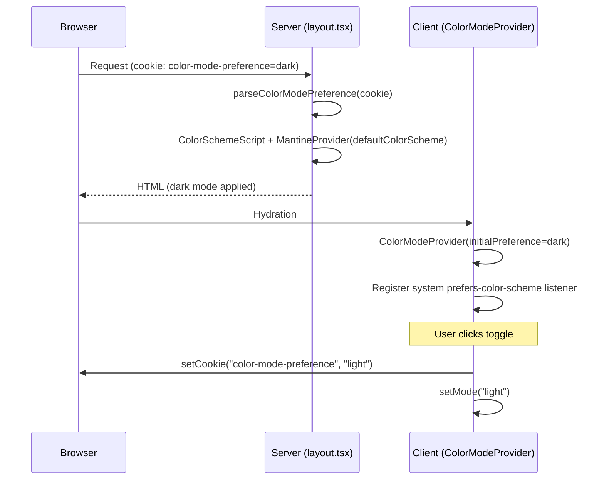

# nointern-web Design System

## Design Philosophy: Editorial Minimalism

A design that intentionally excludes common AI SaaS landing page clichés.

### Removed Clichés

| Cliché pattern | Alternative |
|------------|------|
| Purple/violet default color | Black/white-centered (gray primary) |
| Center-aligned Hero + gradient text | Left-aligned, plain text |
| Product screenshot (browser mockup) | No screenshot, text only |
| Frosted glass navigation | Solid background, thin border |
| "Trusted by" logo bar | None (before actual customer acquisition) |
| 3x2 card grid (features) | 2-column icon+text list |
| Tab-based Use Cases | List all cases with before/after |
| 3-step "How it works" | None |
| 3-tier pricing table | None (pricing undecided) |
| Testimonial cards | None (no real testimonials) |
| Gradient CTA banner | Simple text + buttons |
| Scroll animation | None |
| Dot grid / noise texture | None |

### Essential Elements Kept

- Navigation (required for routing)
- Product description (required to communicate value)
- CTA buttons (login/create workspace)
- Feature introduction (required to understand product)
- Use cases (required for visitor self-identification)
- Footer (required for legal/navigation)

---

## Theme

### Design Decisions

```typescript
createTheme({
  primaryColor: "gray",
  primaryShade: { light: 9, dark: 0 },
  autoContrast: true,
});
```

- **`primaryColor: "gray"`**: use neutral gray instead of purple/blue.
- **`primaryShade: { light: 9, dark: 0 }`**: near-black buttons in light mode, near-white buttons in dark mode.
- **`autoContrast: true`**: automatically adjust button text color.

### Dark Canvas Tokens

Landing page only (fixed dark):

| Use | Value |
|------|-----|
| Main background | `#000000` |
| Card background | `#0a0a0a` |
| Primary text | `#ededed` |
| Secondary text | `#999999` |
| Muted text | `#666666` |
| Border | `#1a1a1a` |
| Card radius | `16px` |

Accent colors per feature card (radial gradient):

| Card | Color |
|------|------|
| teamAgents | `#0070f3` |
| uiBuilder | `#8b5cf6` |
| batteryIncluded | `#10b981` |
| security | `#f97316` |
| automation | `#06b6d4` |
| multiAgent | `#ec4899` |

> Landing page is fixed dark, so hardcoded colors are used. Future pages that support light/dark should use Mantine CSS variables (`var(--mantine-color-*)`).

---

## Color Mode Architecture

Cookie-based color mode management:

```
src/shared/lib/color-mode.ts        — parsing utilities (server/client shared)
src/shared/providers/color-mode.tsx  — Context + Provider (client only)
```

### Flow



### Cookie

- `color-mode-preference`: `"light" | "dark" | "system"` (user choice)
- `color-mode-resolved`: `"light" | "dark"` (actually applied mode)

### Dark Theme Override Structure

Landing page is always dark. Do not force it in layout; nest `MantineProvider` at page level to override:

```
layout.tsx           → MantineProvider (default theme, no color scheme specified)
  └── page.tsx       → MantineProvider forceColorScheme="dark" (landing only)
  └── dashboard/     → (future) default theme or user choice
```
