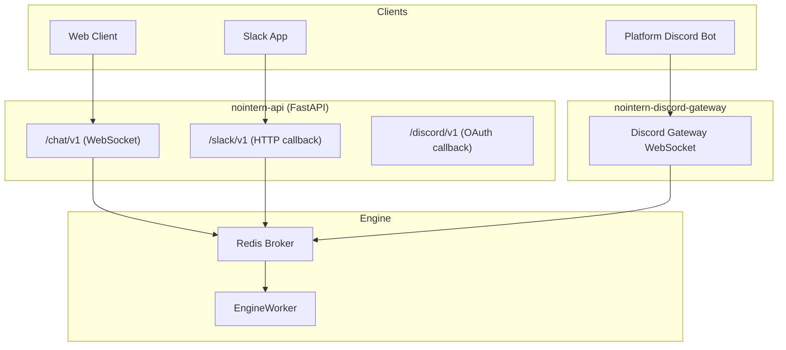
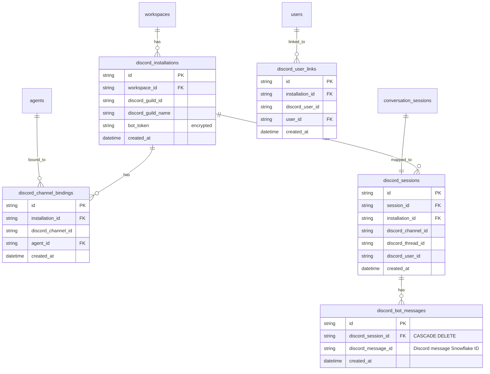
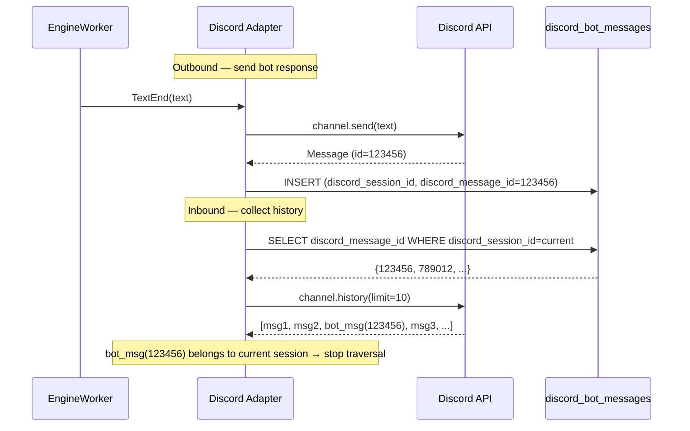
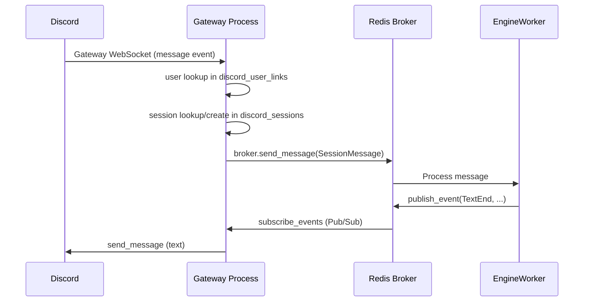
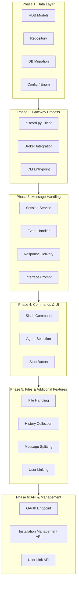

# nointern Discord Integration Design

## Overview

This design integrates nointern AI agents with Discord. The integration shares the same engine and broker layers as the Slack integration while reflecting Discord's Gateway-based event delivery model.

**Core principles**:

- Use the same architecture pattern as Slack: adapter → broker → engine.
- Keep Discord sessions fully separate from web and Slack sessions.
- Do not change the existing EngineWorker or AgentEngine.

## Integration Model



### nointern Platform Bot

- A single Discord Bot provided by nointern.
- Invited to a server through OAuth2.
- Supports multiple agents through channel bindings.
- Provides slash commands: `/nointern connect`, `/nointern reset`, and `/nointern link`.

> **Note**: Discord requires a Gateway WebSocket connection per bot token and does not support HTTP-based delivery for normal message events. Unlike Slack, Discord therefore does not support a BYOA (Bring Your Own App) model in this design.

## Data Model



### Table Descriptions

**discord_installations** — Discord Bot installation unit. `discord_guild_id` is unique, so a single Discord server can be connected to only one nointern workspace.

**discord_channel_bindings** — Mapping that binds an agent to a channel. Managed by the `/nointern connect` command.

**discord_user_links** — Mapping between a Discord user and a nointern user. The `installation_id` scopes the link to a workspace. If a link exists, session creation fills `user_id`; otherwise sessions are created with `user_id = NULL`.

**discord_sessions** — Mapping between a Discord channel/thread and a nointern ConversationSession.

**discord_bot_messages** — Tracks Discord message IDs sent by the bot. It depends on `discord_sessions` through a `discord_session_id` foreign key and is cascade-deleted when the session is deleted. It is used to identify the current session's bot responses while collecting thread history. This corresponds to Slack's `metadata.event_payload.session_id` approach.

## Session Mapping

### Context-Specific Mapping Rules

Same pattern as Slack:

| Context | Session Mapping Key | Bot Response Method |
|----------|-------------|-------------|
| **DM** | `discord_guild_id + discord_channel_id + thread_id` | Reply in a thread |
| **Channel** | `discord_guild_id + discord_channel_id + thread_id` | Reply in a thread |

- DMs and channels behave the same way: the bot creates a thread to make session boundaries explicit.
- Each new message creates a new thread, which means a new session.
- Messages inside an existing thread continue that thread's session.

### Mention Rules

- **DM**: respond to every message.
- **Channel/Thread**: require an `@bot` mention for every message.

### Session Reset

`/nointern reset` resets the session for the current context. It breaks the existing session mapping and creates a new session.

## Event Ingestion

### Gateway-Based Architecture

Slack receives events through HTTP callbacks, but Discord delivers normal message events only through the Gateway (WebSocket). The Interactions Endpoint (HTTP) can handle only limited events such as slash commands and buttons.

Therefore this design runs a separate Gateway process:

- **`nointern-discord-gateway`** — Maintains a Discord Gateway WebSocket connection and receives events.
- Forwards received events to the Redis broker so the existing engine worker can process them.
- Also receives interactions such as slash commands through the Gateway; no separate Interactions Endpoint is operated.

### Gateway Resume

Discord Gateway provides a Resume mechanism. If the client reconnects within roughly 90 seconds after a disconnect, Discord replays missed events.

### MESSAGE_CONTENT Intent

Discord MESSAGE_CONTENT is a privileged intent and is required to read content from messages that do not mention the bot. This intent is required for handling follow-up messages inside a thread where the bot may not be mentioned.

- Discord review is required after installation in more than 100 guilds.

## Streaming Conversion

### Event Mapping

Unlike Slack, Discord has no native streaming API, so the adapter sends messages at turn granularity.

```mermaid
sequenceDiagram
    participant U as Discord User
    participant E as EngineWorker
    participant B as Broker
    participant A as Discord Adapter
    participant D as Discord API

    E->>A: RunStarted
    A->>D: trigger_typing_indicator
    A->>D: send_message(status embed + Stop button)

    E->>A: ToolCallStart(web_search)
    A->>D: edit_message(update status embed)

    E->>A: TextPartial (tokens)
    Note over A: Buffer only; do not send

    E->>A: TextEnd
    A->>D: send_message(full text)

    E->>A: RunComplete
    A->>D: delete_message(status message)

    rect rgb(255, 230, 230)
        Note over U,E: Stop flow when the user clicks the Stop button
        U->>D: Click Stop button
        D->>A: interaction callback
        A->>B: SessionStopRequest
        B->>E: check_stop() → true
        E->>A: RunStopped
        A->>D: delete_message(status message)
    end
```

### Discord UI Components

| Component | Purpose |
|----------|------|
| Typing indicator | Shows that a run is in progress |
| Embed (status message) | Shows tool usage status and contains the Stop button |
| Button (Stop) | Stops the run |
| Plain text message | Agent text response, sent at turn granularity |

### Message Length Limit

Discord messages are limited to 2,000 characters. When a response exceeds the limit, the adapter automatically splits it into multiple messages. The splitter recognizes code block boundaries and avoids cutting in the middle of a code block.

## Bot Message Tracking

### Problem

Discord API does not provide a way to attach custom metadata to messages, unlike Slack's `metadata.event_payload`. When collecting thread history, the adapter must stop when it sees a bot response. If it only checks `msg.author.id == bot_user_id`, it can stop on a bot response from another user's session that happens to share the same thread.

### Slack Approach for Reference

Slack inserts `metadata.event_payload.session_id` into bot response messages, so it can identify only the current session's bot responses:

```python
# Slack streaming.py — inserts session_id metadata into the bot response
await client.chat_postMessage(
    ...,
    metadata={"event_type": "nointern_response", "event_payload": {"session_id": session_id}},
)

# Slack history.py — checks whether the bot response belongs to the current session
def _is_own_bot_response(msg, current_session_id):
    payload = msg.get("metadata", {}).get("event_payload", {})
    return payload.get("session_id") == current_session_id
```

### Discord Approach: DB-Based Tracking

Discord records the Discord message ID of each bot-sent message in the `discord_bot_messages` table. This table depends on `discord_sessions` through a foreign key and is automatically cascade-deleted when the session is deleted.



**Core logic**:

- In `stream_to_discord`, store the returned `Message.id` from `channel.send()` in the DB.
- In `collect_thread_history`, query the set of bot message IDs for the current session from the DB.
- While walking history in reverse order, stop when a bot message belonging to the current session is encountered.

## Adapter Architecture

### Deployment Structure

Unlike Slack, Discord requires a separate Gateway process:

```text
nointern/
├── api/public/
│   ├── chat/v1/              ← existing WebSocket interface
│   ├── slack/v1/             ← Slack HTTP callback
│   └── discord/v1/           ← Discord OAuth callback
├── services/discord/
│   ├── __init__.py
│   ├── gateway.py            ← Discord Gateway connection management (discord.py)
│   ├── handlers.py           ← event/command business logic
│   ├── session.py            ← session service (installation/agent/session resolution)
│   └── streaming.py          ← Broker → Discord message conversion
```

### Deployment Units

| Process | Role | Deploy Strategy |
|----------|------|------------|
| `nointern-api` | REST API + WebSocket + Slack callback + Discord OAuth | Rolling |
| `nointern-worker` | EngineWorker | Rolling |
| `nointern-discord-gateway` | Discord Gateway WebSocket, single instance | **Recreate** |

The Gateway runs as a single instance. If multiple instances connect to the Gateway with the same bot token, Discord can deliver duplicate events. During a Recreate deploy, Gateway Resume prevents event loss as long as reconnection happens within roughly 90 seconds.

### Message Processing Flow



### Slash Commands

- Commands: `/nointern connect`, `/nointern reset`, `/nointern link`.
- The Gateway process automatically registers them per guild when the bot starts.

### File Handling

Same pattern as Slack:

- **Inbound**: Discord attachments (`message.attachments`) → download by CDN URL (no authentication required) → SharedDataStorage → engine.
- **Outbound**: engine attachment → SharedDataStorage → attach to Discord message as `discord.File`.

## Technology Stack

| Package | Purpose |
|--------|------|
| `discord.py` (v2.x) | Gateway connection, automatic reconnect/Resume, rate limit handling, sharding |

## Major Differences from Slack

| Item | Slack | Discord |
|------|-------|---------|
| Event ingestion | HTTP callback (stateless) | Gateway WebSocket (stateful) |
| Deployment | Inside API process | Separate Gateway process |
| Deploy strategy | Rolling | Recreate (Gateway) |
| Text streaming | ChatStream (token-level) | Full message per turn |
| Status display | `assistant.threads.setStatus` | Typing indicator + Embed message |
| Message limit | ~40,000 chars | 2,000 chars (auto split) |
| Slash command | Every app | Platform Bot only |
| File download | bot token authentication required | CDN URL (no authentication required) |

## Implementation Plan

### Overview

This is the phased plan for implementing the design above. Reuse the architecture pattern from the existing Slack integration as much as possible while reflecting Discord's Gateway-based model.

**Overall structure**:



---

### Phase 1: Data Layer

Create Discord tables using the same pattern as the existing Slack data model.

#### 1.1 Add Config & Enum

**`core/config.py`**:

```python
class DiscordConfig(BaseModel):
    bot_token: str           # Platform Bot token
    client_id: str           # OAuth2 application ID
    client_secret: str       # OAuth2 client secret
```

- Add `NI_DISCORD_BOT_TOKEN`, `NI_DISCORD_CLIENT_ID`, and `NI_DISCORD_CLIENT_SECRET` environment variables to `Settings`.
- `Config.discord: DiscordConfig | None` — disable Discord features when not configured.

#### 1.2 RDB Models

**`rdb/models/discord.py`** — one-to-one equivalents of Slack models:

| Discord Model | Slack Equivalent | Note |
|---|---|---|
| `RDBDiscordInstallation` | `RDBSlackInstallation` | `discord_guild_id` unique |
| `RDBDiscordChannelBinding` | `RDBSlackChannelBinding` | |
| `RDBDiscordUserLink` | `RDBSlackUserLink` | |
| `RDBDiscordSession` | `RDBSlackSession` | `discord_thread_id` (NOT NULL) |

#### 1.3 Repository

**`repos/discord_installation/`**, **`repos/discord_session/`**, **`repos/discord_channel_binding/`**, **`repos/discord_user_link/`**

Each repository exposes the same method set as its Slack counterpart:

- `create`, `get_by_id`, `delete_by_id`
- Installation: `get_by_discord_guild_id`, `list_by_workspace`
- Session: `get_by_discord_context`, `get_by_session_id`, `delete_by_session_id`
- ChannelBinding: `get_by_channel`, `upsert_by_channel`
- UserLink: `get_by_discord_user`, `list_by_user`

#### 1.4 DB Migration

Create four tables plus indexes. Use the Slack migration (`61d68c3ce6fc`) as the reference.

#### Verification

```bash
cd python/apps/nointern
uv run ruff check --fix . && uv run ruff format .
uv run pyright
uv run alembic -c db-schemas/rdb/alembic.ini upgrade head  # local DB
```

---

### Phase 2: Gateway Process

Use discord.py to implement a separate process that connects to Discord Gateway and forwards events to the Redis broker.

#### 2.1 Add Dependency

Add `discord.py` (v2.x) to `pyproject.toml`.

#### 2.2 Gateway Client

**`services/discord/gateway.py`**:

```python
class DiscordGateway:
    """Manage the Discord Gateway connection and forward events to the broker."""

    def __init__(
        self,
        config: DiscordConfig,
        container: di.Container,
    ) -> None: ...

    async def run(self, shutdown_event: asyncio.Event) -> None:
        """Start the Gateway connection and receive events."""
        ...
```

- Create a discord.py `Client` or `Bot` internally.
- `Intents`: `guilds`, `guild_messages`, `dm_messages`, `message_content`.
- Call the message handler from the `on_message` event.
- Handle slash commands and buttons from the interaction event.

#### 2.3 CLI Entrypoint

**`cli/discord_gateway.py`**:

```python
"""Discord Gateway process entrypoint."""
# Use the run_with_container(config) pattern; see engineworker.py.
```

- `run_with_container(config)` → resolve `DiscordGateway` → `gateway.run()`.
- Graceful shutdown: close Gateway connection when SIGTERM is received.

#### 2.4 Dockerfile & Kubernetes

- Reuse the existing nointern Docker image and change only the entrypoint.
- Kubernetes Deployment: `replicas: 1`, `strategy: Recreate`.

#### Verification

```bash
# Check discord.py installation
cd python/apps/nointern && uv sync
# Run Gateway process locally (bot token required)
uv run python src/cli/discord_gateway.py
```

---

### Phase 3: Message Handling

Implement the core receive message → resolve session → send to broker → deliver response pipeline.

#### 3.1 Session Service

**`services/discord/session.py`** — `DiscordSessionService`:

Same method set as Slack's `SlackSessionService`:

- `resolve_installation(discord_guild_id)` → get installation
- `resolve_agent_id(installation, discord_channel_id)` → resolve agent from channel binding
- `resolve_or_create_session(...)` → session lookup/create
- `resolve_user_id(installation_id, discord_user_id)` → user mapping
- `reset_session(...)` → reset session

#### 3.2 Event Handler

**`services/discord/handlers.py`**:

```python
async def handle_message(
    message: discord.Message,
    installation: DiscordInstallation,
    discord_session_service: DiscordSessionService,
    broker: SessionBroker,
    session_storage: SharedDataStorage | None = None,
) -> None:
    """Handle a Discord message."""
```

Flow, matching Slack `handle_message`:

1. Ignore the bot's own messages.
2. Determine whether the context is a DM or channel.
3. For channels: check bot mention, or check whether the message is inside an existing thread.
4. Resolve agent and session.
5. Create a thread for a new message.
6. Download files if present.
7. Build the system prompt.
8. Send `SessionMessage` to the broker.
9. Start a response streaming task.

#### 3.3 Response Delivery

**`services/discord/streaming.py`**:

```python
async def stream_to_discord(
    broker: SessionBroker,
    session_id: str,
    channel: discord.TextChannel | discord.Thread,
    ...,
) -> None:
    """Convert broker events into Discord messages."""
```

Event mapping:

| EngineEvent | Discord Action |
|---|---|
| `RunStarted` | start typing indicator + send status embed with Stop button |
| `ToolCallStart` | edit status embed and update tool name |
| `TextPartial` | buffer only; do not send |
| `TextEnd` | send full text as a new message, splitting over 2,000 chars |
| `RunComplete` | delete status embed |
| `RunStopped` | delete status embed |

#### 3.4 Interface Prompt

**`services/discord/prompt.py`**:

```python
def build_discord_system_prompt(
    *,
    discord_user_id: str,
    user_id: str | None,
    is_dm: bool,
) -> str:
    """Build the system prompt for the Discord interface."""
```

Use the same structure as the Slack prompt, with Discord-specific context.

#### 3.5 Message Splitting Utility

**`services/discord/split.py`**:

```python
def split_message(text: str, limit: int = 2000) -> list[str]:
    """Split text to fit Discord message length limits."""
```

- Recognize code block boundaries and avoid splitting inside ``` blocks.
- Prefer splitting by line; fall back to character-level splitting when necessary.

#### Verification

```bash
# Local test: run Gateway, mention the bot in Discord
# Verify message reception → session creation → broker delivery → response delivery
```

---

### Phase 4: Commands & UI

Implement slash commands and interactive components.

#### 4.1 Slash Command Registration

Register per guild when the Gateway starts:

- `/nointern connect` — bind an agent
- `/nointern reset` — reset a session
- `/nointern link` — link a user

Use discord.py's `app_commands` module:

```python
@app_commands.command(name="nointern")
@app_commands.describe(action="Action to perform")
@app_commands.choices(action=[
    app_commands.Choice(name="connect", value="connect"),
    app_commands.Choice(name="reset", value="reset"),
    app_commands.Choice(name="link", value="link"),
])
async def nointern_command(interaction: discord.Interaction, action: str) -> None: ...
```

#### 4.2 Agent Selection UI

When `/nointern connect` runs:

- Show the agent list using a Discord `Select` component.
- Save the selected agent in `discord_channel_bindings`.
- This plays the same role as the Slack modal.

#### 4.3 Stop Button

Include a Stop button with `discord.ui.Button` in the status embed:

- On click, send `SessionStopRequest` to the broker.
- This is equivalent to Slack's `stop_run` action.

#### Verification

```bash
# /nointern connect → select agent → verify binding
# /nointern reset → verify session reset
# Stop button → verify run stop
```

---

### Phase 5: Files & Additional Features

#### 5.1 File Handling

**`services/discord/files.py`**:

- `download_discord_files()` — download from `message.attachments` CDN URLs → SharedDataStorage.
- `upload_discord_files()` — SharedDataStorage → attach as `discord.File` to a message.

Unlike Slack, Discord downloads do not require authentication because attachments expose CDN URLs.

#### 5.2 History Collection

**`services/discord/history.py`**:

- `collect_thread_history()` — collect messages in a thread and convert them into `InputMessage` list.
- Same pattern as Slack `history.py`, using the discord.py API.

#### 5.3 User Linking

**`services/discord/user_link.py`** — `DiscordUserLinkService`:

- Same as Slack's `SlackUserLinkService`.
- `/nointern link` → issue JWT token → web login → complete link.

#### Verification

```bash
# Message with file attachment → verify agent can read it
# Agent-created file → verify Discord file upload
```

---

### Phase 6: API & Management

#### 6.1 OAuth Endpoint

**`api/public/discord/v1/__init__.py`**:

HTTP endpoint for the Discord Bot OAuth2 flow, mounted in nointern-api:

- `GET /discord/v1/oauth-callback` — exchange OAuth code and create installation record.

#### 6.2 Installation Management API

**`api/public/discord_installation/v1/__init__.py`**:

Same pattern as Slack installation API:

- `GET /workspaces/{handle}/discord-installations` — list installations
- `POST /workspaces/{handle}/discord-installations/oauth-url` — create OAuth URL
- `DELETE /workspaces/{handle}/discord-installations/{id}` — delete installation

#### 6.3 User Link API

**`api/public/discord_user_link/v1/__init__.py`**:

Same as Slack user link API:

- `GET /workspaces/{handle}/me/discord-links` — list my Discord links
- `POST /workspaces/{handle}/me/discord-links` — create link
- `DELETE /workspaces/{handle}/me/discord-links/{id}` — delete link

#### Verification

```bash
cd python/apps/nointern
uv run ruff check --fix . && uv run ruff format .
uv run pyright
uv run pytest
```

---

### Infrastructure

#### Terraform / Kubernetes

| Resource | Description |
|---|---|
| K8s Deployment (`nointern-discord-gateway`) | `replicas: 1`, `strategy: Recreate` |
| K8s Service (not needed) | Gateway has no inbound HTTP |
| Secret | `NI_DISCORD_BOT_TOKEN`, `NI_DISCORD_CLIENT_ID`, `NI_DISCORD_CLIENT_SECRET` |
| Discord Developer Portal | Create Bot, enable MESSAGE_CONTENT intent, configure OAuth2 redirect URL |

#### CI/CD

Reuse the existing nointern CI pipeline. The Gateway process uses the same Docker image and only changes the entrypoint:

```yaml
# K8s Deployment
containers:
  - name: discord-gateway
    image: nointern:latest
    command: ["uv", "run", "python", "src/cli/discord_gateway.py"]
```

---

### File Summary

#### New or Modified Files

| File | Phase | Description |
|---|---|---|
| `core/config.py` (modify) | 1 | Add `DiscordConfig` |
| `core/enums.py` | 1 | Add `ConversationSessionType.DISCORD` |
| `rdb/models/discord.py` | 1 | Four RDB models |
| `repos/discord_installation/` | 1 | Installation repository |
| `repos/discord_session/` | 1 | Session repository |
| `repos/discord_channel_binding/` | 1 | Channel binding repository |
| `repos/discord_user_link/` | 1 | User link repository |
| DB migration | 1 | Create tables |
| `services/discord/gateway.py` | 2 | discord.py Gateway client |
| `cli/discord_gateway.py` | 2 | CLI entrypoint |
| `services/discord/session.py` | 3 | Session service |
| `services/discord/handlers.py` | 3 | Event/command handler |
| `services/discord/streaming.py` | 3 | Response delivery |
| `services/discord/prompt.py` | 3 | Interface prompt |
| `services/discord/split.py` | 3 | Message splitting utility |
| `services/discord/files.py` | 5 | File download/upload |
| `services/discord/history.py` | 5 | History collection |
| `services/discord/user_link.py` | 5 | User linking service |
| `services/discord/installation.py` | 6 | Installation management service |
| `api/public/discord/v1/` | 6 | OAuth endpoint |
| `api/public/discord_installation/v1/` | 6 | Installation management API |
| `api/public/discord_user_link/v1/` | 6 | User link API |

#### Slack Reference Files

| Discord File | Slack Reference File |
|---|---|
| `rdb/models/discord.py` | `rdb/models/slack.py` |
| `repos/discord_*/` | `repos/slack_*/` |
| `services/discord/gateway.py` | `services/slack/bolt.py` |
| `services/discord/session.py` | `services/slack/session.py` |
| `services/discord/handlers.py` | `services/slack/handlers.py` |
| `services/discord/streaming.py` | `services/slack/streaming.py` |
| `services/discord/files.py` | `services/slack/files.py` |
| `services/discord/history.py` | `services/slack/history.py` |
| `services/discord/prompt.py` | `services/slack/prompt.py` |
| `services/discord/installation.py` | `services/slack/installation.py` |
| `services/discord/user_link.py` | `services/slack/user_link.py` |
| `api/public/discord*/` | `api/public/slack*/` |
| `cli/discord_gateway.py` | `cli/engineworker.py` |
