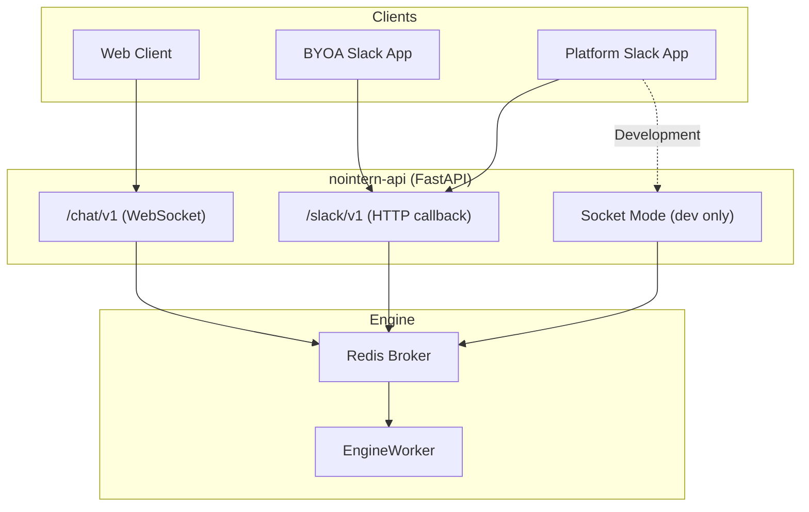
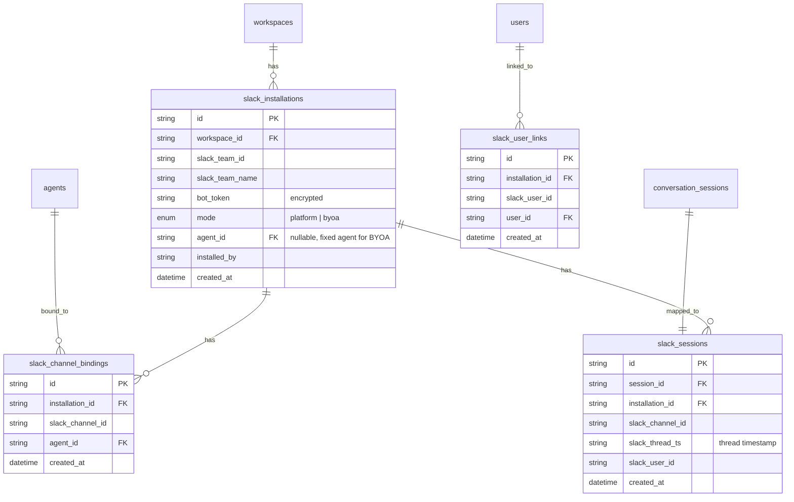
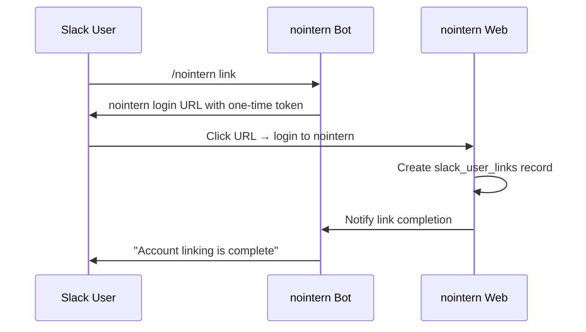
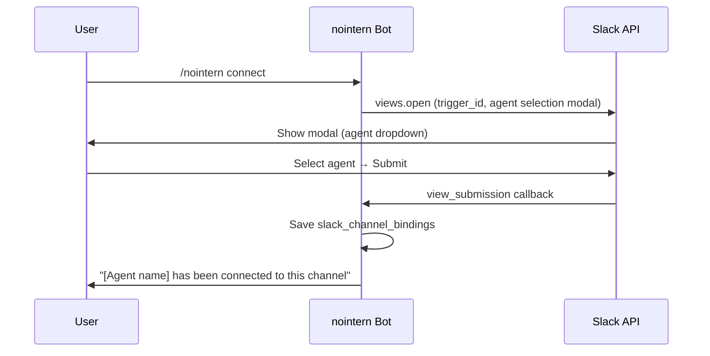
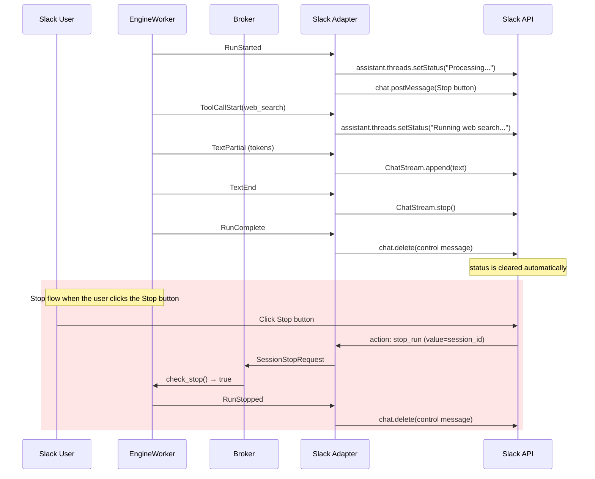
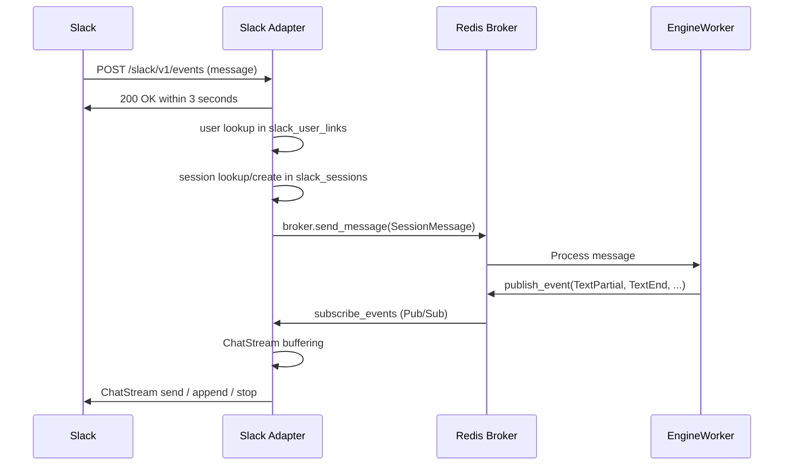

# nointern Slack Integration Design

## Overview

This design integrates nointern AI agents with Slack. It supports two integration models and shares the same engine and broker layers as the existing WebSocket-based interface.

**Core principles**:

- Keep Slack sessions fully separate from web sessions.
- Do not change the existing EngineWorker or AgentEngine.
- Design with future messenger extensions, such as Discord, in mind.

## Integration Model



### Model A: BYOA (Bring Your Own App)

- The agent owner creates a Slack App directly and registers the bot token with nointern.
- 1 App = 1 Agent, so no routing is required.
- Enables custom branding and scope control.

### Model B: nointern Platform App

- A single Slack App provided by nointern.
- One-click installation through "Add to Slack".
- Multi-agent support, available only in the Platform App model.
- Agent bindings per channel or DM.

## Data Model



### Table Descriptions

**slack_installations** — Slack App installation unit. `slack_team_id` is unique, so a single Slack workspace can be connected to only one nointern workspace. Within the same nointern workspace, multiple BYOA apps and the Platform App can coexist. This table implements Bolt's `AsyncInstallationStore` interface.

**slack_channel_bindings** — Mapping that binds an agent to a channel or DM in the Platform App model. Managed by the `/nointern connect` command. BYOA routes directly through `slack_installations.agent_id`, so it does not use this table.

**slack_user_links** — Mapping between a Slack user and a nointern user. The `installation_id` scopes the link to a workspace. If a link exists, session creation fills `user_id`; otherwise sessions are created with `user_id = NULL`.

**slack_sessions** — Mapping between a Slack channel/thread and a nointern ConversationSession. Used as the session lookup key.

## User Identity Mapping

### Mapping Method

When a Slack message arrives, look up the nointern user in `slack_user_links`:

- If the user is linked → fill `ConversationSession.user_id`.
- If the user is not linked → create the session with `user_id = NULL`.
- If the user links later → new sessions created after that point will have `user_id` filled.

### Link Timing

Do not force account linking. Instead, guide users naturally:

1. **DM nudge on first conversation** — If the user first talks in a channel, send a one-time DM explaining account linking.
2. **Prompt when a feature needs it** — Encourage linking when the user tries a feature that requires a nointern user, such as per-user OAuth toolkits.
3. **Manual linking** — Users can link at any time with `/nointern link`.

### Link Flow



## Session Mapping

### Context-Specific Mapping Rules

| Context | Session Mapping Key | Bot Response Method |
|----------|-------------|-------------|
| **DM** | `slack_team_id + slack_channel_id + thread_ts` | Reply in a thread |
| **Channel** | `slack_team_id + slack_channel_id + thread_ts` | Reply in a thread |

- DMs and channels behave the same way: the bot replies in a thread to make the session boundary explicit.
- Each new message creates a new thread, which means a new session.
- Messages in an existing thread continue that thread's session.

### Session Reset

`/nointern reset` resets the session for the current context. It breaks the existing session mapping and creates a new session.

Session lifetime management is delegated to the existing compaction mechanism.

## Agent Routing

### BYOA

No routing is required. The installation is fixed to `slack_installations.agent_id`.

### Platform App

Bind an agent to a channel or DM:



- If a DM conversation starts without an agent binding, send a text message guiding the user to `/nointern connect`.
- To change the binding, run `/nointern connect` again.

## Streaming Conversion

### Event Mapping



### Slack UI Components

| Component | Purpose | Status |
|----------|------|------|
| `assistant.threads.setStatus` | Show tool-call status as a loading indicator | Implemented |
| `ChatStream` (`chat_stream`) | Stream text responses with `buffer_size` buffering | Implemented |
| Control message (Stop button) | Stop execution and host future actions | Implemented |
| `setSuggestedPrompts` | Suggested prompts for first conversation, up to 4 | Not implemented yet |

## Adapter Architecture

### Deployment Structure

Implemented as an internal nointern-api module. No separate process is required:

```text
nointern/
├── api/public/
│   ├── chat/v1/           ← existing WebSocket interface
│   └── slack/v1/          ← Slack HTTP callback, delegated to Bolt handler
│       └── __init__.py    ← FastAPI router, delegates to Bolt handler
├── services/slack/
│   ├── __init__.py
│   ├── bolt.py            ← creates Bolt AsyncApp shared by HTTP and Socket Mode
│   ├── handlers.py        ← event/command business logic
│   ├── session.py         ← session service (installation/agent/session resolution)
│   └── streaming.py       ← Broker → Slack streaming conversion
```

### Connection Method by Environment

| Environment | Platform App Connection | BYOA Connection |
|------|-------------------|-----------|
| **Production** | HTTP Events API (`/slack/v1/events`) | HTTP Events API |
| **Development** | Socket Mode (default for devserver) | HTTP Events API |

When running the devserver, the Platform App always uses Socket Mode. This allows local testing without a public endpoint.

### Message Processing Flow



## Implementation Feasibility

### Technology Stack

| Package | Version | Purpose |
|--------|------|------|
| `slack-bolt` | >= 1.22 | Bolt framework (AsyncApp, Assistant, FastAPI adapter) |
| `slack-sdk` | >= 3.40 | Slack API client, ChatStream, assistant.threads.setStatus |
| `aiohttp` | >= 3.x | Required dependency for AsyncApp HTTP client |

### Feasibility Summary

| Item | Feasible | Notes |
|------|----------|------|
| Bolt + FastAPI integration | **Yes** | Official `AsyncSlackRequestHandler` adapter |
| AsyncApp (async/await) | **Yes** | Full async support |
| Chat streaming | **Yes** | `ChatStream` helper, SDK >= 3.34 |
| Assistants API | **Yes** | `Assistant` class, Bolt >= 1.21 |
| Multi-workspace OAuth | **Yes** | `AsyncInstallationStore` interface |
| Modal (agent selection) | **Yes** | `views.open` + `trigger_id` |
| Python 3.14 | **Yes** | Officially supported |
| Socket Mode (dev) | **Yes** | `AsyncSocketModeHandler` |

### FastAPI Integration Method

```python
# Integrate Bolt AsyncApp as a FastAPI router
from slack_bolt.async_app import AsyncApp
from slack_bolt.adapter.fastapi.async_handler import AsyncSlackRequestHandler

bolt_app = AsyncApp(...)
handler = AsyncSlackRequestHandler(bolt_app)

@router.post("/events")
async def slack_events(req: Request):
    return await handler.handle(req)
```

### Blocking Risks

None. All required features are supported by official SDKs and fit naturally into the existing nointern architecture.

## Frontend UI

### Workspace Settings (`/w/[handle]/settings`)

Platform App management:

- "Add to Slack" button → start Slack OAuth flow.
- Installation status display, including connected Slack workspace name.
- Disconnect button.

Add this as a section or tab on the same page as existing LLM Provider Integrations.

### Agent Edit (`/w/[handle]/agents/[agentId]/edit`)

BYOA Slack App connection:

- Slack App creation guide, presented as collapsible step-by-step instructions.
- `manifest.json` download button, dynamically generated with agent name, description, and required scopes prefilled.
- Bot Token input field (`xoxb-...`).
- Connection status display.

Follow the Setup Guide pattern used by existing LLM settings.

### User Profile (`/w/[handle]/profile`)

Connected accounts section:

- Slack link status: connected, showing Slack username; or not connected.
- Disconnect button.

### `/nointern link` Landing Page

Landing page for the URL provided by the Slack `/nointern link` command:

- If the user is not logged in → login or prompt signup.
- After login → create `slack_user_links` → show "link complete".
- The detailed flow can be decided later after observing usage patterns.

### Slack Session / Usage History

TBD — decide together with the history page design.

## Future Expansion

This design uses Slack-specific tables and adapter code, while keeping the same pattern available for other messengers:

```text
nointern/api/public/
├── slack/v1/           ← Slack adapter
├── discord/v1/         ← Discord adapter (future)

nointern/rdb/models/
├── slack.py            ← slack_* tables
├── discord.py          ← discord_* tables (future)
```

Each messenger adapter owns:

- Its own data model for installations, channel bindings, user links, and session mappings.
- Its own event handlers and streaming conversion.
- Connection to EngineWorker through the shared Redis Broker.
