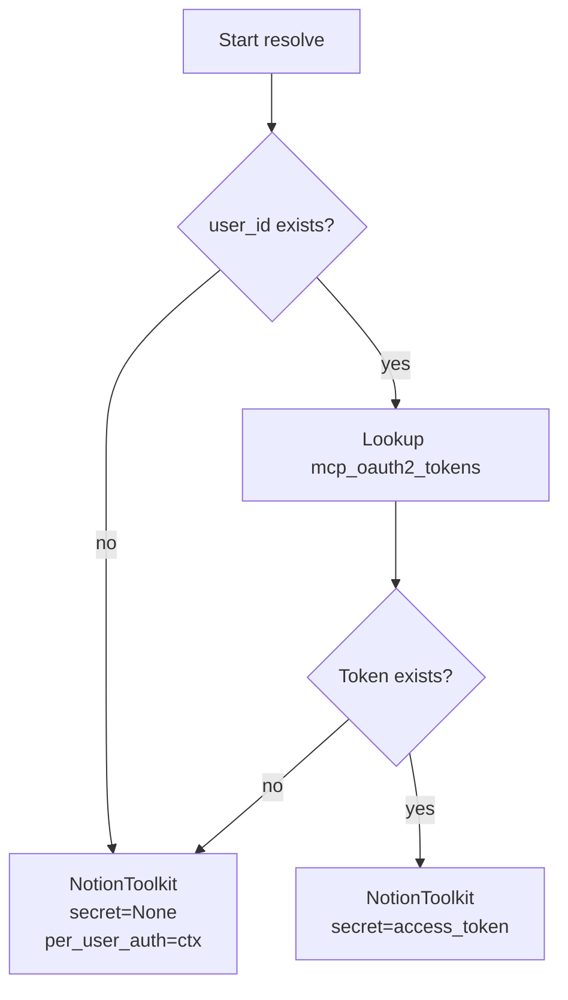

# Notion Toolkit Design

## Overview

Service Toolkit based on Notion official MCP server (`https://mcp.notion.com/mcp`). Like GitHub Toolkit, it extends `McpBasedToolkitProvider` and is implemented as independent `notion` ToolkitType.

Notion MCP server supports only OAuth2 + DCR (Dynamic Client Registration), so provide it as dedicated Toolkit with fixed auth settings. Users do not need to configure MCP server URL or auth method manually.

## Authentication

### per_user (current implementation)

Each user completes Notion OAuth authorization individually and uses Notion tools within their own permission scope.

- **Auth flow**: Reuse existing MCP `oauth2_per_user` + DCR infrastructure as-is.
- **Token storage**: `mcp_oauth2_tokens` table (toolkit_id + user_id).
- **Autonomous behavior mode**: unavailable — user-specific authorization is required.

### Planned future implementation

The following auth modes are implemented in separate future phases:

- **shared**: One user completes OAuth authorization, and the workspace shares that authorization. Usable in autonomous behavior mode.
- **api_key**: Third-party MCP server integration using Notion Integration API Key. Usable in autonomous behavior mode.

### Definition of "autonomous behavior mode"

When exposing system session to users, call it "autonomous behavior mode".

- **Autonomous behavior mode** = mode where agent acts independently without user session, such as scheduled execution or automated workflow.
- Guide text: "Features requiring per-user authorization cannot be used in autonomous behavior mode."

## Data Model

### NotionToolkitConfig

Non-secret settings stored in `ToolkitConfig.config` (JSONB):

```python
class NotionToolkitConfig(McpToolkitConfig):
    server_url: str = "https://mcp.notion.com/mcp"
    auth_type: str = "oauth2_per_user"
```

It extends `McpToolkitConfig`, but fixes `server_url` and `auth_type` values. There are no separate Notion-specific fields because per_user mode reuses existing MCP per-user OAuth infrastructure.

### Credential Model

Use existing MCP credential model without separate credential type:

| State | Storage type |
|------|-----------|
| Initial | `null` |
| DCR complete | `McpSecretsOAuth2Dcr` |
| Per-user OAuth complete | `mcp_oauth2_tokens` (existing per-user token table) |

### Reuse Existing Tables

| Table | Purpose |
|--------|------|
| `toolkits` | Store NotionToolkitConfig + encrypted_credentials |
| `mcp_oauth2_tokens` | Per-user tokens in per_user mode |
| `mcp_auth_requests` | Track auth request rate limit / mute |

> Reuse existing MCP infrastructure without adding separate new tables.

## MCP Server Connection

- **URL**: `https://mcp.notion.com/mcp` (fixed)
- **Auth**: OAuth2 + DCR (RFC 9728 + RFC 7591)
- **Protocol**: Streamable HTTP

## Resolve Flow

Same as existing per-user OAuth resolve in `McpToolkitProvider`:



## Tool Creation Flow

Use existing `McpBasedToolkit.create_tools()` as-is:

| State | Result |
|------|------|
| Autonomous behavior mode (system session) | empty list → toolkit excluded |
| User not connected (user_id = None) | `link_account` tool |
| No token | `request_authorization` tool |
| Token exists | All Notion MCP tools |

## Frontend Design

### NotionConfigFields component

MCP server URL and auth method are fixed, so do not expose them to users. Show only per-user authorization guidance text and autonomous behavior mode limitation explanation.

Show future shared/api_key modes as disabled options.

## Implementation Scope

### NotionToolkitProvider

```python
class NotionToolkitProvider(ToolkitProvider[NotionToolkitConfig]):
    slug = "notion"
    name = "Notion"
    config_model = NotionToolkitConfig
```

### New Implementation Needed

| Component | Description | Reference pattern |
|-----------|------|-----------|
| `NotionToolkitConfig` | Pydantic config model (fixed values) | `GitHubToolkitConfig` |
| `NotionToolkit` | MCP-based Toolkit instance | `McpToolkit` |
| `NotionToolkitProvider` | resolve (per-user OAuth) | `McpToolkitProvider` |
| `ToolkitType.NOTION` | add enum | `ToolkitType.GITHUB` |
| `NotionConfigFields.tsx` | frontend settings UI | `GithubConfigFields.tsx` |

### Reused Existing Infrastructure

| Component | Purpose |
|-----------|------|
| `McpBasedToolkit` | MCP connection, tool list, wrapping, auth headers |
| `mcp_oauth2_tokens` | token storage for per_user mode |
| `mcp_auth_requests` | auth request tracking |
| `request_authorization` tool | prompt user to OAuth login |
| `discover_oauth_metadata()` | OAuth2 AS discovery |
| `register_client()` | DCR (Dynamic Client Registration) |
| OAuth authorize/exchange API | reuse existing MCP OAuth endpoints |
| `/oauth/mcp/callback` page | OAuth callback handling |
| `McpPerUserAuthContext` | per-user auth context |
