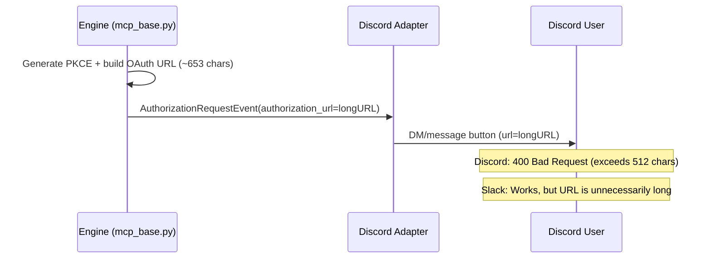
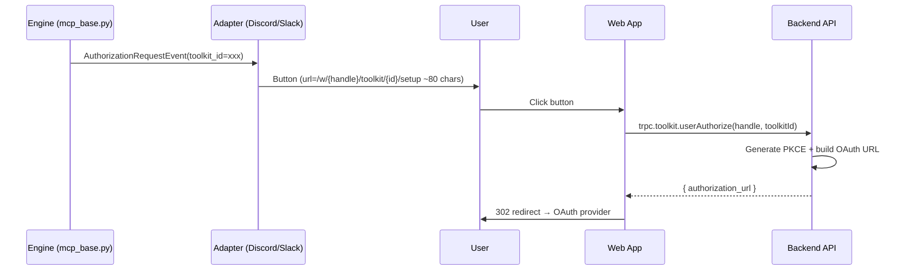

# AuthorizationRequestEvent OAuth URL → Web App Setup Page Migration

## Overview

### Problem

The URL of the OAuth setup button sent through Discord DM exceeds Discord's 512-character limit, causing 400 Bad Request.

- **Cause**: `AuthorizationRequestEvent` includes the full OAuth URL (PKCE state ~306 chars + code_challenge, etc.), about ~653 chars.
- **Impact**: Discord users cannot receive toolkit OAuth setup button. Slack currently works because it has a 3000-character limit, but the same duplicated path problem exists.

### Solution Direction

For every adapter (Discord, Slack), instead of putting OAuth URL directly in button, put a short web app URL containing toolkit_id in button and start OAuth flow from web app. Unify into one path.

## Architecture

### Current Flow (Problem)



### Flow After Change



## Changes

### 1. Web app: add new page

**Path**: `/w/[handle]/toolkit/[toolkitId]/setup`

When user visits this page:
1. Check login state (redirect to login page if not logged in).
2. Call `trpc.toolkit.userAuthorize`.
3. Redirect to returned `authorization_url`.

```typescript
// typescript/apps/nointern-web/src/app/(app)/w/[handle]/toolkit/[toolkitId]/setup/page.tsx
export default function ToolkitSetupPage({
  params,
}: {
  params: { handle: string; toolkitId: string };
}) {
  return <ToolkitSetupRedirect handle={params.handle} toolkitId={params.toolkitId} />;
}
```

```typescript
// ToolkitSetupRedirect component (pseudocode)
function ToolkitSetupRedirect({ handle, toolkitId }) {
  const mutation = trpc.toolkit.userAuthorize.useMutation({
    onSuccess: (data) => {
      window.location.href = data.authorization_url;
    },
  });

  useEffect(() => {
    mutation.mutate({ handle, toolkitConfigId: toolkitId });
  }, []);

  if (mutation.error) return <ErrorMessage />;
  return <LoadingSpinner message="Redirecting to setup..." />;
}
```

### 2. Discord + Slack Adapter: use same URL

**Files**: `discord.py`, `slack.py`

Both adapters use web app URL instead of `authorization_url` when handling `AuthorizationRequestEvent`:

```python
# Before (common to Discord/Slack)
case AuthorizationRequestEvent(
    toolkit_name=toolkit_name,
    authorization_url=auth_url,
):
    # Use auth_url directly in button (Discord: exceeds 512 chars, Slack: works but unnecessarily long)

# After (common to Discord/Slack)
case AuthorizationRequestEvent(
    toolkit_id=toolkit_id,
    toolkit_name=toolkit_name,
):
    setup_url = (
        f"{self._web_url}/w/{self._workspace_handle}"
        f"/toolkit/{toolkit_id}/setup"
    )
    # ... use setup_url in button (~80 chars)
```

### 3. Remove `authorization_url` from AuthorizationRequestEvent

Remove PKCE generation + OAuth URL build logic from `mcp_base.py`, and include only `toolkit_id` in event. Web app `userAuthorize` API owns PKCE generation, removing duplication.

```python
# Before
@dataclasses.dataclass(frozen=True)
class AuthorizationRequestEvent:
    toolkit_id: str
    toolkit_name: str
    authorization_url: str  # remove

# After
@dataclasses.dataclass(frozen=True)
class AuthorizationRequestEvent:
    toolkit_id: str
    toolkit_name: str
```

### 4. Existing code impact

- **Web adapter**: Needs separate review because web frontend shows OAuth button inline. Can be unified by calling `userAuthorize` with toolkit_id.
- **mcp_base.py**: Remove PKCE + OAuth URL generation logic. Keep rate limiting/muting logic.

## Discussion Points and Decisions

### Single OAuth flow path

**Decision**: Use web app setup page in every adapter. Remove PKCE + OAuth URL generation from `mcp_base.py` and centralize through web app `userAuthorize` API.

**Pros**:
- OAuth URL generation logic exists in one place (`userAuthorize` API).
- Same path without adapter-specific branches.
- `AuthorizationRequestEvent` becomes simpler (`toolkit_id` + `toolkit_name` only).

### Authentication handling

- Web app page requires JWT authentication (login required).
- Click button in Discord → browser opens → if not logged in, login page → after login, return to setup page.
- Existing Next.js auth middleware handles this automatically.

## Implementation Plan

### Phase 1: Add web app page

1. Create `/w/[handle]/toolkit/[toolkitId]/setup/page.tsx`.
2. Implement `ToolkitSetupRedirect` component.
3. Handle error/loading states.

### Phase 2: Modify AuthorizationRequestEvent + adapters

1. Remove `authorization_url` field from `AuthorizationRequestEvent`.
2. Remove PKCE + OAuth URL generation logic from `mcp_base.py` (keep rate limiting/muting).
3. Unify Discord + Slack adapters to use web app setup URL.
4. Review and modify Web adapter.

### Phase 3: Test + deploy

1. Confirm existing tests pass.
2. Manual test: verify Discord/Slack button → web app → OAuth provider flow.

## Alternatives Considered

| Alternative | Rejection reason |
|------|----------|
| Add "already linked" branch to account linking page | Complicates existing account linking flow and mixes responsibilities |
| Backend signed-token redirect | Requires token generation/verification logic; over-engineering |
| Remove code_verifier from state (store in DB) | Requires complete OAuth callback logic change; large impact |
| Use URL shortener | Adds external dependency and availability risk |
