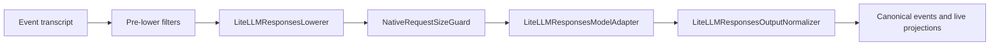

# OpenAI-Compatible Responses HTTP Migration

## Summary

Migrate every OpenAI API-key and ChatGPT OAuth Responses HTTP call from LiteLLM transport to the official OpenAI Python SDK while preserving Azents request semantics, canonical events, native artifacts, usage, cost estimates, lifecycle behavior, and operational rollback.

The migration restores the generic adapter pipeline originally designed by ADR-0039. OpenAI-compatible calls use an Azents-owned immutable request type and official SDK `ResponseStreamEvent` objects. LiteLLM remains the transport for non-migrated providers and a public in-process pricing utility for OpenAI-compatible cost estimates.

Phase 1 covers primary sampling, context compaction, and automatic Session title generation for both migrated providers. Phase 2 WebSocket work remains deferred until this HTTP migration is implemented and validated.

## Problem

The current implementation has one dictionary-oriented `NativeModelRequest` and routes Responses calls through LiteLLM. That request object mixes logical request fields, provider routing, credentials, and transport options. LiteLLM also converts official Responses events into its own objects and injects private cost metadata.

This prevents the official OpenAI SDK from owning the OpenAI-compatible protocol boundary and makes a later HTTP/WebSocket transport family depend on LiteLLM-specific request and event representations. Migrating only primary sampling would leave compaction and Session title generation on a second transport owner.

## Goals

- Use official OpenAI SDK HTTP streaming for OpenAI API-key and ChatGPT OAuth.
- Cover sampling, compaction, and automatic Session title generation together.
- Restore generic request and event types across the adapter pipeline.
- Preserve provider-specific request semantics, including ChatGPT Responses Lite.
- Preserve canonical events, live projections, terminal classification, usage, and cost estimates.
- Preserve application-owned timeout, cancellation, cleanup, and failed-run behavior.
- Retain strict native artifact compatibility-key equality.
- Cut over atomically without a runtime LiteLLM fallback.
- Permit operational rollback by deploying the preceding code version.

## Non-Goals

- Responses WebSocket transport or connection pooling across model operations.
- Migrating non-OpenAI-compatible providers away from LiteLLM.
- Replacing the LiteLLM pricing map with an Azents-owned pricing authority.
- Rewriting or backfilling stored native artifacts.
- Preserving byte-identical LiteLLM HTTP bodies, SSE frames, or Python wrapper classes.
- Logging response IDs, request IDs, provider bodies, inputs, outputs, or raw frames.

## Current Behavior

Primary sampling follows:



The adapter owns in-memory OpenAI continuation for eligible API-key calls. ChatGPT OAuth uses `store=false`, full context, encrypted reasoning content, and no `previous_response_id`. Primary sampling applies Responses Lite headers and input extensions only when the saved model capability enables that dialect.

Compaction and Session title generation use the shared LiteLLM Responses helper instead of the sampling adapter pipeline. They use standard Responses input/instructions and discard helper usage after text extraction. Primary sampling token usage comes from the completed response, and LiteLLM injects its cost through `_hidden_params.response_cost`.

Native artifacts are opaque sanitized dictionaries. Replay requires exact equality of:

```text
adapter:native_format:provider:model:schema_version
```

## Proposed Architecture

### Generic adapter pipeline

Restore generics across the full pipeline:

- `AdapterLowerer[TNativeRequest]`
- `PostLowerFilter[TNativeRequest]`
- `ModelAdapter[TNativeRequest, TNativeStreamEvent]`
- `AdapterOutputStream[TNativeStreamEvent]`
- `AdapterOutputNormalizer[TNativeStreamEvent]`
- `PreparedModelCall[TNativeRequest]` and its preparer
- `AgentRunExecution[TNativeRequest, TNativeStreamEvent]`

Shared filters use narrow structural protocols. They do not require every provider to inherit from a common field-based request model.

The LiteLLM adapter receives its own request type for non-migrated providers. The migration does not force LiteLLM extensions into the OpenAI request contract.

### Internal API and dependency boundary

This migration changes internal Python protocols and types only. It adds no public API field, database column, durable event kind, or migration. Existing canonical event and `TokenUsagePayload` schemas remain readable by the preceding application version.

Pin `openai==2.45.0` as a direct application dependency instead of relying on LiteLLM's transitive dependency. SDK upgrades require review of request signatures, event unions, retry defaults, serialization, and pricing inputs before the pin changes.

Optional request fields preserve three distinct states where the provider contract permits them: omitted, explicit `null`, and a concrete value. The request representation and dispatch serializer must not collapse an omitted field into `None`. Continuation equality compares the lowered semantic request, including field presence, rather than only Python field values.

### OpenAI logical request

Introduce an immutable Azents-owned `OpenAIResponsesRequest`. It contains the complete logical request before physical continuation reduction and exposes supported Responses fields explicitly. It uses official SDK parameter types where the public OpenAI schema applies and Azents-owned extension types where ChatGPT Responses Lite differs.

The logical request includes, where applicable:

- model and ordered input items;
- instructions;
- client and provider-hosted tools;
- tool choice and parallel tool-call policy;
- text configuration;
- reasoning configuration;
- include values;
- temperature, top-p, and maximum output tokens where the current call site supports them;
- the currently forwarded stop-sequence option as an explicit Azents extension because SDK 2.45.0 has no named Responses `stop` parameter;
- prompt-cache key and other currently supported request options;
- explicit `store=false` for ChatGPT OAuth;
- required ChatGPT Responses Lite request headers and extension input items when the saved sampling-model capability enables that dialect.

The request does not contain:

- API keys, OAuth bearer tokens, or base URLs;
- SDK client instances or HTTP clients;
- stream mode;
- connect, idle, or absolute deadlines;
- reduced physical input or `previous_response_id`;
- response handles or mutable continuation state.

OpenAI API-key lowering omits `store`; it does not send JSON `null`. Every ChatGPT OAuth call supplies `store=false`, complete logical input, encrypted reasoning inclusion, and the common ChatGPT endpoint identity headers from resolved client configuration.

Primary sampling obtains this request from `OpenAIResponsesLowerer`. A saved ChatGPT capability with `responses_lite=false` uses the standard Responses request. When `responses_lite=true`, sampling additionally supplies `parallel_tool_calls=false`, `reasoning.context="all_turns"`, raw Session cache and affinity values, the version and Responses Lite headers, developer instructions, the developer `additional_tools` input item, an empty top-level tools list, and input images without unsupported detail fields.

Compaction and title helpers construct the same request type from their prepared prompts without manufacturing a transcript. They preserve the current shared-helper dialect: ordinary user input plus top-level instructions, no sampling tool catalog, no Responses Lite transformation, and no prompt-cache or affinity field. ChatGPT helper calls still use the ChatGPT base URL and common identity headers, `store=false`, encrypted reasoning inclusion, full input, and no continuation.

### Complete-request guards

File and attachment availability filters, model-file materialization, automatic compaction, and `NativeRequestSizeGuard` remain before transport reduction.

`NativeRequestSizeGuard` inspects the complete logical input through a narrow OpenAI request inspection protocol. Continuation never allows a physically smaller request to bypass the logical request limit.

### SDK client ownership

A client factory converts resolved credential and endpoint configuration into `AsyncOpenAI` outside the logical request. It preserves the OpenAI `AZ_OPENAI_BASE_URL` override and ChatGPT's Codex base URL, bearer token, `originator`, Azents User-Agent, and account header. Per-call Responses Lite protocol and affinity headers remain dispatch fields rather than client identity.

- Sampling owns one client for one `AgentRunExecution` and reuses it across turns.
- Compaction owns one client for one compaction invocation.
- Session title generation owns one client for one title invocation.

Clients are never shared across Runs, bounded helper operations, credential snapshots, or event loops. Every operation closes its active stream and client on success, failure, timeout, and cancellation. The generic adapter lifecycle must expose async cleanup to its execution owner.

The application must keep the `openai`, `httpx`, and `httpcore` transport loggers from emitting debug request options, bodies, headers, or response details. Azents-owned logs record only the allowlisted operational fields in this design; enabling SDK wire logging is not a supported diagnostic mode.

The SDK default retry policy remains enabled. Under OpenAI SDK 2.45.0, one SDK call may issue the initial request plus up to two retries for supported transient transport and HTTP failures.

### Physical HTTP dispatch

The HTTP adapter derives an ephemeral dispatch plan from the complete logical request.

For eligible OpenAI API-key turns, `ResponsesContinuationPlanner` may replace the physical input with a non-empty delta and add the immediately preceding response ID. Eligibility continues to require exact equality of model, tools, logical request options, and option presence plus an exact prior input/output prefix. State is committed only after successful `response.completed`.

ChatGPT OAuth never uses `previous_response_id` and never reduces physical input.

If OpenAI returns the exact `previous_response_not_found` error before a stream opens, the adapter disables continuation for its remaining lifetime and retries that logical request once with full input. This explicit semantic fallback is separate from SDK transient HTTP retries.

The adapter calls `AsyncOpenAI.responses.create(stream=True)` with official SDK request arguments, per-call ChatGPT dialect headers where required, and a connect-only `httpx.Timeout`. Omitted logical fields are passed as SDK omission rather than `None`. The current stop-sequence option is carried only through the SDK's public `extra_body` extension and must pass deterministic request capture plus both live provider gates; it is never silently dropped. The adapter yields the official `ResponseStreamEvent` union directly.

### Typed event normalization

The output normalizer consumes official SDK event objects without an Azents dictionary wrapper. Supported handlers require both the expected SDK class and documented wire `event.type` so an unknown discriminator represented by an incidental SDK fallback class is not promoted incorrectly.

The stream state tracks:

- text, reasoning, and function-call deltas for ephemeral projection;
- ordered completed output items;
- explicit terminal success or failure;
- the completed typed `Response` and `ResponseUsage`;
- preservable partial assistant text for User Stop.

`ResponseFailedEvent` with `type="response.failed"`, `ResponseIncompleteEvent` with `type="response.incomplete"`, and `ResponseErrorEvent` with `type="error"` fail before durable model output is appended. SDK 2.45.0 has no typed `response.error` variant; ADR-0160 corrects ADR-0157's earlier event list. EOF without a class-and-wire matched `ResponseCompletedEvent` also fails.

Unsupported stream events do not create live or canonical projections. A completed output item with an unsupported item type is still serialized into the existing canonical `unknown_adapter_output` artifact; an otherwise unknown stream event is not independently persisted.

### Native artifacts

Runtime SDK objects are serialized only at plain-data boundaries. The serializer uses `model_dump(mode="json", exclude_unset=True, warnings=False)` without `exclude_none=True`, then applies the existing recursive raw-blob sanitizer.

This preserves explicit nulls, provider extras, and the wire discriminator without adding absent fallback defaults. Python SDK objects are never persisted.

New artifacts use:

```text
openai:responses:{provider}:{model}:{schema_version}
```

Replay remains exact compatibility-key equality. The OpenAI lowerer does not accept old `litellm:responses:...` artifacts. Old artifacts use canonical fallback after cutover; new OpenAI artifacts use canonical fallback after code-version rollback to LiteLLM.

### Usage and cost

Normalize usage directly from the completed SDK `ResponseUsage`:

| SDK field | Canonical field |
| --- | --- |
| `input_tokens` | `prompt_tokens` |
| `output_tokens` | `completion_tokens` |
| `total_tokens` | `total_tokens` |
| `input_tokens_details.cached_tokens` | `cached_tokens` |
| `input_tokens_details.cache_write_tokens` | `cache_creation_tokens` |
| `output_tokens_details.reasoning_tokens` | `reasoning_tokens` |

The raw canonical usage is the SDK usage dump, not a LiteLLM response wrapper. New usage does not synthesize `_hidden_params`.

Calculate `cost_usd` for both migrated providers through LiteLLM's public `completion_cost()` API using a minimal cost-only view: model, OpenAI provider identity, Responses call type, provider-reported usage, applicable service tier, and only the output-type or built-in-tool metadata required for tool charges. Do not pass credentials, prompt content, response text, reasoning content, tool arguments, or raw frames.

ChatGPT OAuth cost is an API price-map estimate rather than actual subscription billing. Unsupported pricing, calculator exceptions, non-finite values, and negative values leave `cost_usd=None` without failing a successful model response.

Primary sampling materializes this canonical usage and cost on the existing turn marker. Compaction and title generation consume the typed completed response for text and terminal validation but retain their current behavior of not persisting a turn usage record or calculating a product-visible cost.

### Timeout, cancellation, and errors

The existing `ModelStreamWatchdog` remains authoritative.

- The connect-only HTTP timeout applies to each SDK physical request.
- Parsed-event idle and absolute attempt deadlines include SDK retry and backoff time.
- `asyncio.CancelledError` is re-raised immediately after initiating cleanup.
- User Stop retains priority over a concurrent deadline.
- Non-cooperative cleanup remains owned by the process cleanup registry.

Map provider-originated SDK exceptions at the adapter boundary without copying raw SDK exception strings or objects into user messages or logs.

- Final 401, 403, 429, and 5xx failures become fixed user-safe `ModelCallError` variants.
- Other final 4xx, connection, and provider parsing failures become sanitized internal failures.
- Safe metadata may include SDK exception class, HTTP status, and an allowlisted bounded provider error code.
- The sanitized internal form preserves `context_length_exceeded` so compaction can retain its bounded input-truncation retry without retaining provider text.
- Unexpected non-SDK programming errors propagate normally.

Mapped failures do not chain a raw SDK exception into a logger-visible traceback. No error path logs or persists response IDs, request IDs, provider bodies, model inputs, model outputs, or raw SSE frames.

## Call-Site Migration

### Primary sampling

`AgentEngineAdapter` selects the OpenAI-native lowerer, adapter, normalizer, and operation-scoped client for `LLMProvider.OPENAI` and `LLMProvider.CHATGPT_OAUTH`. Other providers retain the LiteLLM components.

Continuation is instantiated only for OpenAI API-key sampling. ChatGPT OAuth uses the same SDK adapter without continuation.

### Context compaction

The shared summary helper selects the OpenAI-native operation for both migrated providers. It constructs `OpenAIResponsesRequest` directly from the summary prompts, uses the same client factory and watchdog, requires typed terminal completion, and extracts completed text without LiteLLM transport.

The migrated helper preserves the current OpenAI-compatible output-limit behavior: `max_output_tokens` remains omitted from the physical compaction request, while the existing post-response character budget remains authoritative. It also preserves `context_length_exceeded` classification and the existing bounded older-input omission retry sequence. ChatGPT uses the standard helper dialect described above rather than sampling-only Responses Lite transformation.

Non-migrated providers continue through the LiteLLM shared Responses helper.

### Automatic Session title

Title generation uses the same provider routing rule and OpenAI-native bounded-operation helper as compaction. Its OpenAI-compatible physical request continues to omit `max_output_tokens`, matching the current helper contract, and ChatGPT uses the standard helper dialect rather than sampling-only Responses Lite transformation. Timeout, terminal failure, premature EOF, or sanitized provider failure retains the existing best-effort title behavior and does not fail a completed Agent Run.

## Atomic Cutover and Rollback

All six provider/call-site combinations switch routing in one final cutover. ADR-0161 packages the design, implementation, tests, specs, and cutover in one pull request so reverting that pull request restores the complete LiteLLM implementation. The pull request may contain reviewable commits, but none are released independently. There is no feature flag, shadow request, or SDK-to-LiteLLM runtime fallback.

Pre-cutover gates require deterministic parity and bounded live evidence for both provider dialects. Failure blocks cutover.

Rollback deploys the preceding application version. No database migration or artifact rewrite is required. The preceding LiteLLM lowerer ignores newer `openai` artifacts by exact compatibility key and reconstructs input from canonical events. In-memory client and continuation state is disposable.

The release must retain the prior deployable artifact and validate a backward fixture in which the old implementation reads a transcript containing new canonical events, OpenAI-native artifacts, and SDK-normalized usage.

## Security and Privacy

- Credentials and OAuth tokens exist only in operation-scoped client configuration.
- No request, response, stream frame, response ID, or request ID is logged.
- Third-party SDK and HTTP transport debug logging is disabled at the application boundary.
- Native artifact sanitization removes raw blob fields before persistence.
- Cost calculation receives only usage and non-content pricing metadata.
- Safe exception mapping avoids storing or chaining displayed provider bodies.
- Deterministic fixtures use synthetic IDs and content; live evidence is redacted before retention.

## Test Strategy

### Primary E2E verification matrix

| Provider | Sampling | Compaction | Session title |
| --- | --- | --- | --- |
| OpenAI API-key | Text, reasoning, function tools, hosted tools, usage/cost, continuation and full-input fallback | Manual and automatic summary through SDK with output-limit omission and context retry | Successful generated title, output-limit omission, and best-effort failure |
| ChatGPT OAuth | Standard and capability-enabled Responses Lite sampling; full-context `store=false`, encrypted reasoning, usage/cost, and no continuation | Full-context standard-dialect summary through SDK with common identity headers | Full-context standard-dialect title request and best-effort failure |

Cross-cutting E2E cases cover terminal failure events, premature EOF, SDK-retried pre-stream failure, parsed-event idle timeout, absolute timeout, User Stop, partial projection cleanup, strict artifact mismatch, and old-code rollback of a new-version transcript.

### E2E plan

The product E2E suite is the primary verification surface. Extend the existing AIMock-based OpenAI Responses fixture and its journal where it can express the case; add a supplemental controllable fixture endpoint only for retry, delay, disconnect, or dialect behavior AIMock cannot model. The fixture support must:

- record a redacted semantic request snapshot;
- validate omitted-versus-null fields, standard ChatGPT helper requests, standard sampling, Responses Lite sampling, common identity headers, redacted affinity headers, and the stop-sequence `extra_body` path;
- emit deterministic typed SSE sequences, unknown event discriminators including `response.error`, explicit nulls, and extra fields;
- return retryable and non-retryable HTTP statuses;
- delay connection or events and terminate before completion;
- reject one continuation ID and accept the following full request;
- return deterministic usage and tool-output types for cost tests.

E2E assertions use public chat/session behavior, durable events, usage projections, and redacted fixture observations. Direct testenv inspection is diagnostic support rather than a substitute for product behavior assertions.

### Hermetic unit and integration coverage

Ordinary CI requires no provider credentials. It covers:

- direct SDK pin and generic protocol typing, field-presence semantics, and adapter lifecycle cleanup;
- lowerer request fields for standard OpenAI, standard ChatGPT, and capability-enabled Responses Lite sampling;
- compaction/title helper request parity, output-limit omission, and context-window retry;
- request-size checks before continuation;
- official SDK event handling with class and wire-type guards;
- known, unknown, extra-field, explicit-null, and artifact serialization fixtures;
- terminal success/failure and premature EOF;
- SDK exception redaction, raw-cause suppression, safe metadata, and third-party logger guards;
- default SDK retry interaction with outer deadlines;
- usage mapping and minimal LiteLLM pricing arguments;
- calculator failure with preserved successful usage;
- all six routing combinations and absence of runtime fallback;
- forward cutover and previous-version rollback transcript compatibility.

### Fixtures and snapshots

Store synthetic request/event fixtures in the relevant Python tests and existing testenv AIMock fixture package. Snapshots exclude credentials, authorization values, raw affinity values, raw content, request IDs, response IDs, and unstable SDK representation details. Assertions may retain boolean presence and stable one-way equality markers for affinity fields so their semantics are verified without retaining the Session identifier. Assertions target semantic fields and canonical outcomes.

Live prerequisite snapshots record only provider/model capability and credential availability, never credential values. ChatGPT OAuth live tokens follow the existing credential lifecycle and are not printed in evidence.

### Live verification and CI policy

Hermetic tests run in the repository's ordinary `not live_external` pull-request CI and fail on any mismatch.

Live OpenAI API-key and ChatGPT OAuth cases use the existing `live_external` policy: same-repository PR execution requires the `azents-live-e2e` label and maintainer authorization, with manual and nightly entry points retained. An ordinary run without live prerequisites reports an explicit skip. A requested cutover verification treats both provider credentials and supported models as required; missing prerequisites, skipped required scenarios, redaction violations, or semantic mismatches fail the gate. Nightly optional verification may retain its existing prerequisite-not-ready skip summary, but it is not accepted as cutover evidence.

Retained live evidence consists of the scenario name, provider/model, pass/fail result, redacted semantic request fields, canonical event/usage summary, and safe lifecycle outcome. Raw requests, responses, SSE frames, and identifiers are not retained.

## Implementation Phases

All phases below are commits or logical work units in the single pull request required by ADR-0161, not separately deployable pull requests.

1. Pin the official SDK directly and restore generic adapter request/event typing, field-presence semantics, and async lifecycle cleanup.
2. Add OpenAI request types, lowerer, client factory, continuation dispatch, typed normalizer, safe error mapping, and SDK/HTTP logger guards.
3. Add SDK usage normalization and the isolated public LiteLLM cost wrapper.
4. Migrate compaction and Session title helpers without changing routing yet.
5. Add deterministic fixtures, product E2E coverage, live-gate tooling, and rollback compatibility fixtures.
6. Atomically switch both providers at all three call sites and remove migrated LiteLLM routing.
7. Update living specs and capture cutover evidence. Begin WebSocket design only after Phase 1 validation completes.

## Required Spec Updates

Implementation must update at least:

- `docs/azents/spec/flow/agent-execution-loop.md`
- `docs/azents/spec/flow/chatgpt-oauth.md`
- `docs/azents/spec/flow/session-context-inspector.md`

The specs must describe the official SDK transport owner, provider-specific storage and continuation behavior, typed terminal semantics, operation-scoped clients, usage/cost provenance, atomic cutover, and version rollback behavior.

## Alternatives Considered

- Keep LiteLLM as OpenAI HTTP fallback or use its private WebSocket entry point — rejected because one provider would retain two request and normalization owners, and the WebSocket entry point is not a supported outbound-client API.
- Migrate only OpenAI API-key sampling — rejected because ChatGPT OAuth, compaction, and title generation would remain split transport owners.
- Preserve LiteLLM wire bodies or wrapper types — rejected in favor of semantic request and Azents-observable parity.
- Wrap SDK events in Azents dictionaries — rejected because it discards the official event union before normalization.
- Accept cross-adapter native artifacts — rejected because compatibility keys remain exact schema-ownership boundaries.
- Disable SDK retries or share clients process-wide — rejected in favor of the official retry default and credential-isolated logical-operation lifetimes.
- Use feature flags, shadow calls, or runtime LiteLLM fallback — rejected because they create split ownership or duplicate-call ambiguity; rollback deploys the preceding version instead.

## Decisions and References

- ADR-0039: generic adapter and normalized transcript architecture.
- ADR-0148: semantic parity rather than LiteLLM wire parity.
- ADR-0149: LiteLLM public pricing utility boundary.
- ADR-0151: generic native adapter request types.
- ADR-0152: include ChatGPT OAuth in the HTTP migration.
- ADR-0153: preserve official SDK native stream events.
- ADR-0154: strict native artifact compatibility keys.
- ADR-0155: official SDK default HTTP retries.
- ADR-0156: logical-operation SDK client lifetime.
- ADR-0157: Azents-owned timeout, cancellation, and safe failure semantics.
- ADR-0158: SDK usage and pricing estimates for both migrated providers.
- ADR-0159: atomic cutover with code-version rollback.
- ADR-0160: documented SDK terminal discriminators and unknown-event handling.
- ADR-0161: one pull request and one pull-request revert for the complete HTTP migration.

## Validation Findings

Repository validation changed or sharpened four draft assumptions:

- The pinned SDK's typed error discriminator is `error`, not `response.error`; ADR-0160 records the correction without weakening explicit-completion enforcement.
- Responses Lite is capability-driven for primary sampling. The current compaction and title helper has no saved capability input and uses the standard Responses dialect, so the migration preserves that call-site distinction rather than forcing sampling-only prefixes into helper prompts.
- OpenAI-compatible compaction and title currently omit `max_output_tokens`; their existing post-response character/title guards remain the parity contract.
- The shared helper currently drops ChatGPT `extra_headers` even though the living OAuth spec requires the common client identity headers. The SDK client factory restores those non-content headers for all ChatGPT calls as a spec-preserving correction.

## Remaining Risks

- OpenAI SDK loose unknown-event construction can select an incidental known class; wire-type guards and fixtures mitigate incorrect promotion.
- ChatGPT Responses Lite extensions can evolve ahead of the public SDK schema; extension-field and live dialect fixtures are required.
- SDK 2.45.0 has no named Responses `stop` parameter. The public `extra_body` path must pass request-capture and live acceptance gates or the atomic cutover remains blocked.
- Compaction and title do not currently carry saved Responses Lite capabilities. This migration intentionally preserves their standard helper dialect; changing helper capability propagation requires a separate behavior design.
- SDK retry hides physical request count and may duplicate an ambiguously delivered request; the migration accepts this official default behavior.
- LiteLLM price-map drift can change estimates independently of transport behavior.
- Code rollback intentionally loses native-only replay across adapter keys and depends on canonical fallback quality.
