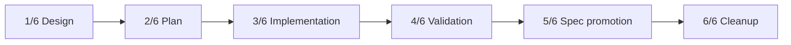

# OpenAI Responses WebSocket Implementation Plan

## Feature Summary

Implement the accepted OpenAI Responses WebSocket transport policy from:

- `docs/azents/adr/0150-openai-responses-websocket-lifecycle.md`
- `docs/azents/design/openai-responses-websocket-transport.md`

The feature adds an execution-owned persistent socket for eligible primary sampling, SessionRunner-owned HTTP-only fallback state, shared failed-Run retry behavior, a deployment kill switch, and deterministic lifecycle tests. The existing official-SDK HTTP transport remains the fallback and clean revert path.

## Stack Prefix

`OpenAI Responses WebSocket`

## PR Stack

### PR 1/6 — Design

**Title:** `OpenAI Responses WebSocket [1/6]: Design`

Scope:

- Revalidate and accept ADR-0150 against the current HTTP and ChatGPT OAuth implementation.
- Record provider rollout, ownership, retry, fallback, privacy, and revert policy.
- Add the detailed transport design and test strategy.

Dependency: current `main`.

Validation:

- Documentation frontmatter/index validation.
- `git diff --check`.

### PR 2/6 — Implementation plan

**Title:** `OpenAI Responses WebSocket [2/6]: Implementation plan`

Scope:

- Record phased implementation boundaries.
- Record the deterministic, E2E, and live validation matrix.
- Identify required dependency, configuration, fixture, and spec work.

Dependency: PR 1.

Validation:

- Documentation frontmatter/index validation.
- `git diff --check`.

### PR 3/6 — Transport implementation

**Title:** `OpenAI Responses WebSocket [3/6]: Implement transport lifecycle`

Scope:

- Add the SDK realtime/WebSocket dependency and resolve the production lock.
- Add the deployment configuration switch with an enabled default.
- Add SessionRunner-owned keyed HTTP-only fallback state and pass it through the worker/engine runtime context.
- Extend the official OpenAI client boundary with a public SDK Responses WebSocket connection.
- Add lazy connection, one-active-response serialization, finite per-response iteration, terminal handling, connection invalidation, continuation reset, and operation cleanup.
- Route eligible OpenAI API-key and ChatGPT OAuth sampling through WebSocket.
- Preserve HTTP for custom OpenAI base URLs, explicit `stop`, per-request headers, compaction, and Session title generation.
- Add safe structured transport telemetry and suppress raw WebSocket wire diagnostics.
- Add focused unit and backend integration tests for the implementation.

Dependency: PR 2.

Validation:

- Targeted adapter, engine assembly, SessionRunner, worker retry, configuration, and watchdog tests.
- Ruff and Pyright for the Azents Python application.
- Production `uv.lock` consistency.

### PR 4/6 — Validation

**Title:** `OpenAI Responses WebSocket [4/6]: Validate transport behavior`

Scope:

- Run the full planned deterministic validation matrix.
- Run applicable existing E2E chat, tool-loop, retry, Stop, and custom-base-URL scenarios.
- Confirm implementation behavior against the accepted design and current specs.
- Fix discovered implementation defects in this PR when they do not require changing accepted policy.
- Record commands, environment, outcomes, skipped live prerequisites, and privacy-safe evidence.

Dependency: PR 3.

Validation:

- Full Azents Python quality checks.
- Selected deterministic E2E suite.
- Optional live smoke only when explicitly authorized and prerequisites are ready.

### PR 5/6 — Spec promotion

**Title:** `OpenAI Responses WebSocket [5/6]: Promote current behavior to specs`

Scope:

- Run spec review against the complete implementation diff.
- Update the Agent execution loop spec with transport selection, socket lifecycle, fallback, retry, timeout, and cleanup behavior.
- Update the ChatGPT OAuth flow spec with sampling WebSocket behavior while retaining HTTP compaction/title semantics.
- Update spec versions and verification dates.
- Mark the design implemented only after validation passes.

Dependency: PR 4.

Validation:

- Spec review.
- Documentation index/frontmatter validation.
- `git diff --check`.

### PR 6/6 — Cleanup

**Title:** `OpenAI Responses WebSocket [6/6]: Cleanup implementation plan`

Scope:

- Remove this temporary implementation plan after implementation and spec promotion are complete.
- Retain the accepted ADR, implemented design, current specs, tests, and code as the durable sources of truth.

Dependency: PR 5.

Validation:

- Documentation index/frontmatter validation.
- `git diff --check`.

## Phase Dependencies

- Implementation does not begin before the accepted ADR and design are reviewable.
- Validation runs against the complete implementation branch.
- Spec promotion waits for deterministic validation to pass.
- Cleanup waits for the implementation plan to have no remaining execution value.

## Runtime Changes

### Configuration

Add `AZ_OPENAI_RESPONSES_WEBSOCKET_ENABLED`, defaulting to `true`, to application and worker configuration. The value is process-scoped and read when a SessionRunner is created. It is not persisted in product data.

### Session ownership

Create one in-memory transport fallback state per SessionRunner. The state is keyed by transport family, provider, and resolved integration ID. It survives failed-Run attempts handled by that runner and disappears on idle teardown, shutdown, or handover.

### Execution ownership

The official OpenAI sampling adapter owns the live WebSocket and reuses it only inside one `AgentRunExecution`. It closes the socket before closing the SDK client.

### Physical transport selection

The adapter evaluates deployment enablement, sticky fallback state, provider endpoint, and request options before physical request planning. A transport change clears continuation state. Logical lowering and request-size validation remain transport-independent.

### Failure handling

Classified WebSocket transport failures mark the SessionRunner key HTTP-only and raise through the existing failed-Run boundary. User Stop, watchdog expiry, worker cancellation, provider terminal failures, and authentication/authorization/quota errors do not mark the transport unsupported.

### API and data changes

No public API, OpenAPI schema, database schema, migration, durable event payload, or model capability change is planned.

## Test Strategy

### Phase-level strategy

| Phase | Required checks |
| --- | --- |
| Design | docs validation, diff check |
| Plan | docs validation, diff check |
| Implementation | targeted unit/integration tests, Ruff, Pyright, lock validation |
| Validation | full relevant Python tests, deterministic E2E, design/spec comparison |
| Spec promotion | spec review, docs validation |
| Cleanup | docs validation |

### E2E primary validation matrix

| Product behavior | Primary E2E or integration evidence | Expected result |
| --- | --- | --- |
| Existing OpenAI-compatible custom endpoint chat | Existing AIMock E2E | Remains HTTP and completes unchanged |
| Client-tool loop | Existing chat/tool E2E plus backend multi-turn connection test | Durable tool call/result and final assistant output remain unchanged |
| Hosted-tool projections | Backend official-event integration test; existing projection E2E where applicable | Activity and durable provider-tool output remain unchanged |
| Failed attempt retry | Existing failed-Run E2E plus transport-state integration test | Partial projection is removed and next attempt uses HTTP |
| User Stop | Existing Stop E2E plus socket invalidation unit test | Partial Stop semantics remain unchanged and socket is not reused |
| Timeout | Existing retry/timeout tests plus socket invalidation test | Timeout failure code is preserved; fallback state is not activated |
| Exact terminal requirement | Official-event normalizer tests | Unknown or malformed terminal never becomes durable success |
| Deployment disable | Engine assembly/config test and AIMock E2E | All sampling uses HTTP |
| Privacy | Log capture and validation report review | No content, credentials, IDs, headers, or frames appear |

The actual WebSocket framing and handshake are external-provider behavior. Deterministic product verification uses fake official-client collaborators at the narrow connection boundary rather than a hand-written raw-frame mock that could disagree with the SDK.

### Fixture and seed requirements

- Reuse the existing test user, workspace, Agent, dummy OpenAI integration, and AIMock fixtures.
- Do not write directly to the product database.
- No new durable fixture or model catalog capability is required.
- Custom-base-URL AIMock coverage intentionally proves that existing local and CI chat stays on HTTP.

### External prerequisite snapshots

- ChatGPT OAuth live smoke may use the existing retained local OAuth artifact or a prepared safe prerequisite snapshot.
- OpenAI Platform live smoke requires an operator-provided API key.
- Snapshots and reports contain readiness metadata only and never raw token values.

### Evidence format

Validation evidence records:

- commit and branch;
- commands and working directories;
- deterministic test counts and results;
- selected transport and connection reuse counts from controlled tests;
- safe fallback stage and failure classification;
- E2E scenarios executed;
- optional live prerequisite status;
- implementation-versus-design/spec comparison.

It excludes request/response content, response IDs, previous response IDs, item or call IDs from provider frames, account headers, credentials, and raw frames.

### CI execution policy

- All deterministic unit, integration, lint, type, lock, docs, and selected E2E checks are required.
- Live external checks remain opt-in under the repository's live workflow policy.
- Ordinary PR CI does not require OpenAI or ChatGPT credentials.
- Requested live validation fails when its prerequisite is missing; optional nightly validation may report prerequisite-not-ready as skipped.

## Blockers and External Actions

No blocker prevents deterministic implementation or PR creation.

Optional live validation is not a rollout prerequisite under ADR-0150. Missing OpenAI Platform credentials or an unprepared ChatGPT OAuth snapshot blocks only the optional live portion of PR 4, not implementation, deterministic validation, spec promotion, or cleanup.

OAuth and probe artifacts are retained outside the repository until the user explicitly authorizes deletion.

## Spec Impact Candidates

- `docs/azents/spec/flow/agent-execution-loop.md`
  - official SDK transport selection;
  - execution-owned connection reuse;
  - SessionRunner fallback state;
  - shared failed-Run retry behavior;
  - timeout, Stop, and cancellation invalidation;
  - continuation reset across transport changes.
- `docs/azents/spec/flow/chatgpt-oauth.md`
  - sampling WebSocket eligibility;
  - handshake identity headers;
  - full-input and `store=false` semantics over WebSocket;
  - HTTP-only compaction and Session title generation.
- No current model catalog, context compaction, or public API spec change is expected beyond cross-references if spec review identifies drift.

## Rollout and Cleanup

- Enable both official OpenAI API-key and ChatGPT OAuth sampling under the same process setting.
- Keep official-SDK HTTP as the fallback and revert path.
- Keep custom endpoints, compaction, and Session titles on HTTP.
- Do not add durable rollout state or data migration.
- After validation and spec promotion, remove this plan in PR 6 while retaining the ADR and implemented design.
