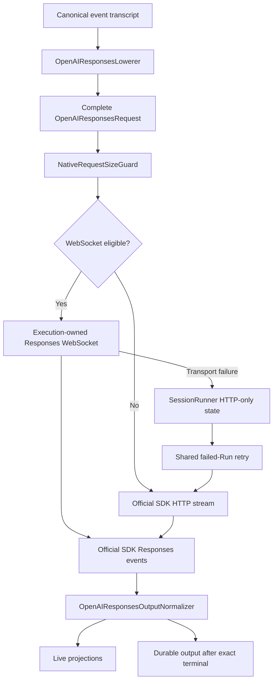

# OpenAI Responses WebSocket Transport Design

## Summary

Azents will add the official OpenAI Responses WebSocket transport to primary sampling for both OpenAI API-key and ChatGPT OAuth providers. WebSocket is a physical transport for the existing `OpenAIResponsesRequest`; it does not introduce another request dialect, lowerer, output normalizer, tool executor, or durable event format.

One `AgentRunExecution` lazily opens at most one Responses WebSocket, serially reuses it across that Run's model/tool loop, and closes it at execution end. `SessionRunner` retains only lightweight keyed HTTP-only fallback state so a failed-Run retry does not immediately repeat a transport-specific WebSocket failure. WebSocket failures use the existing failed-Run retry count and backoff. The next attempt reconstructs the complete logical request from durable history and uses the existing official-SDK HTTP path.

The implementation is deployment-controlled by `AZ_OPENAI_RESPONSES_WEBSOCKET_ENABLED`. It is enabled by default for the accepted initial rollout and can be disabled without a data migration. Custom OpenAI-compatible base URLs, explicit `stop` requests, compaction, and automatic Session title generation remain HTTP-only.

## Goals

- Prefer the official Responses WebSocket transport for eligible OpenAI API-key and ChatGPT OAuth sampling.
- Reuse one healthy socket across sequential model and foreground-tool turns within one `AgentRunExecution`.
- Preserve the complete `OpenAIResponsesRequest` as the single logical request contract for HTTP and WebSocket.
- Preserve the existing output normalizer, watchdog, failed-Run retry, live projection cleanup, and durable event admission boundaries.
- Prevent a cancelled, timed-out, abandoned, or malformed response from contaminating the next request on a reused socket.
- Make transport fallback sticky for the owning `SessionRunner` without retaining idle sockets between Agent Runs.
- Preserve current OpenAI continuation semantics without allowing response IDs or connection-local state to become durable conversation state.
- Provide a deployment kill switch and a clean revert path to the already-supported official-SDK HTTP transport.
- Keep credentials, account headers, request/response content, response IDs, and raw frames out of logs and test evidence.

## Non-goals

- No Responses Lite dialect or Codex-specific request lowering.
- No Codex attestation, prewarm request, private metadata, request compression policy, or private hosted-tool executor.
- No process-wide or SessionRunner-lifetime socket pool.
- No concurrent responses on one socket.
- No SDK automatic reconnect or active-response replay.
- No WebSocket support for custom OpenAI-compatible base URLs in the initial release.
- No WebSocket transport for compaction or automatic Session title generation.
- No connection-local `previous_response_id` use for ChatGPT OAuth.
- No change to client-tool execution, provider-hosted tool normalization, durable transcript schemas, or public APIs.
- No attempt to hide retry exhaustion by granting WebSocket transport failures an additional retry budget.

## Current Behavior

`AgentEngineAdapter.run()` currently creates one `OpenAIResponsesModelAdapter` and one operation-scoped `AsyncOpenAI` client for OpenAI API-key or ChatGPT OAuth sampling. The adapter is reused across the `AgentRunExecution` model/tool loop and closed in execution cleanup.

The existing adapter sends streaming HTTP through `responses.create(stream=True)`. The `ModelStreamWatchdog` owns response-handle acquisition, parsed-event idle, absolute-attempt, cancellation, and bounded close behavior. `AgentRunExecution._stream_model()` immediately sends every native event to the stateful output normalizer and may publish live text, reasoning, function-call, and provider-tool projections before terminal completion. Durable output is admitted only after exact typed `response.completed` normalization.

A failed non-Stop attempt propagates to `RunExecutor`, which discards live assistant and reasoning partials, records the shared failed-Run retry state and backoff, and creates a fresh engine execution for the next attempt. OpenAI API-key sampling may use the existing strict `ResponsesContinuationPlanner`; ChatGPT OAuth always sends complete logical input with `store=false` and no `previous_response_id`.

## Policy

### Provider rollout

The same deployment setting controls WebSocket eligibility for both providers:

- `openai`: eligible only when the official default endpoint is used.
- `chatgpt_oauth`: eligible for the fixed ChatGPT Responses backend with the resolved account and Azents client-identity headers.

The initial default is enabled. OpenAI Platform is not held behind a separate live-validation gate. Exact SDK-class and wire-discriminator terminal checks remain authoritative; an unknown terminal event is not promoted to success. A production incompatibility is handled by disabling the setting or reverting the isolated WebSocket change.

### HTTP-only requests

Sampling uses HTTP when any of the following is true:

- `AZ_OPENAI_RESPONSES_WEBSOCKET_ENABLED` is false.
- The SessionRunner fallback state has marked the resolved transport key HTTP-only.
- The request contains the HTTP-only `stop` extension.
- The request contains per-request `extra_headers` that cannot remain stable at socket handshake scope.
- OpenAI uses `AZ_OPENAI_BASE_URL` or another resolved custom base URL.
- The call is compaction or automatic Session title generation.

An HTTP-only request does not itself make fallback sticky. A later eligible request in the same Agent Run may use WebSocket, but changing physical transport clears continuation state before planning the request.

### Shared retry budget

WebSocket does not have an independent reconnect or retry loop. A transport-specific failure:

1. invalidates the active socket;
2. marks the matching SessionRunner transport key HTTP-only;
3. fails the current model attempt;
4. consumes the normal failed-Run retry count and backoff;
5. causes the next attempt to execute through HTTP.

Retry exhaustion is accepted even when it prevents a later HTTP attempt. This matches ordinary HTTP connection failure behavior and keeps one retry authority.

## Ownership and State

### SessionRunner fallback state

Each `SessionRunner` owns one in-memory `SessionModelTransportState`. It is neither durable nor transferred during worker handover.

The state contains:

- the process deployment enablement value;
- a set of HTTP-only transport keys.

The initial key is the non-sensitive tuple:

- transport family: `openai_responses`;
- provider: `openai` or `chatgpt_oauth`;
- resolved LLM provider integration ID when available.

No API key, OAuth token, account header, response ID, request content, endpoint query, or raw credential fingerprint is retained. The integration ID is sufficient to avoid disabling a different selected integration in the same Session. A conservative stale HTTP-only decision after credentials rotate within the same integration lasts only until the SessionRunner ends.

The state exposes a narrow engine-facing protocol:

- determine whether WebSocket is allowed for a key;
- mark a key HTTP-only after a classified transport failure.

`SessionRunner` passes the same state object through `RunTaskSupervisor`, `RunExecutor`, and `RunContext` to every failed-Run attempt handled by that runner.

### AgentRunExecution socket

`OpenAIResponsesModelAdapter` owns the live connection because the adapter already has `AgentRunExecution` lifetime.

- The connection is opened lazily on the first eligible sampling request.
- A healthy connection is reused for later eligible model turns in the same execution.
- At most one response is active on the socket.
- The adapter closes the socket before closing the operation-scoped SDK client.
- Execution completion, failure, User Stop, watchdog timeout, caller cancellation, and worker handover all terminate the connection through existing adapter cleanup.
- A later Agent Run opens a new connection even if the SessionRunner remains warm.

A lock protects the complete response stream, not only the send operation. Responses delta events do not carry a response ID suitable for safe concurrent demultiplexing.

## Transport Architecture



### Client boundary

The narrow `OpenAIResponsesClient` collaborator will support both physical operations:

- create an HTTP streaming response;
- establish one Responses WebSocket connection with stable handshake headers.

The production wrapper around `AsyncOpenAI` owns the credential-bearing client configuration. `default_headers` remain the HTTP default and are also explicitly supplied to `responses.connect(extra_headers=...)` because the SDK WebSocket handshake does not copy `default_headers` automatically.

The WebSocket connection collaborator exposes only:

- send one standard `response.create` request;
- receive one parsed `ResponsesServerEvent`;
- close the connection.

Tests inject fake clients and connections through these narrow protocols. They do not patch raw frames or depend on SDK private fields.

### Request mapping

HTTP and WebSocket request mapping share the same option helpers. The WebSocket request contains the same supported semantic fields as the HTTP request:

- model and complete or continuation-reduced input;
- tools and tool choice;
- instructions;
- max output tokens;
- reasoning;
- store;
- temperature and top-p;
- include;
- prompt cache key;
- parallel tool calls;
- text configuration;
- service tier;
- previous response ID when strict OpenAI continuation is valid.

Physical-only differences are restricted to:

- HTTP uses `responses.create(stream=True)`, the connect-only HTTP timeout, per-request headers, and `extra_body` for `stop`.
- WebSocket sends `response.create` on the established connection and has no per-request timeout, headers, or extra body.

The SDK connection is created without an `on_reconnecting` callback, so SDK automatic reconnect remains disabled. The application watchdog remains the attempt deadline authority; the SDK WebSocket open timeout is disabled at the public connection-options boundary so it does not create a competing shorter timeout.

## Per-response Stream Wrapper

A persistent socket is an infinite server-event stream, while the engine expects one finite async iterable per model response. The adapter therefore creates a per-response wrapper after sending each `response.create`.

The wrapper:

- receives events from the shared connection;
- yields events unchanged to the existing watchdog and normalizer;
- stops only after an exact terminal `response.completed`, `response.failed`, `response.incomplete`, or typed `error` event;
- records whether a terminal boundary was observed;
- invalidates the socket if closed before terminal completion;
- leaves the socket open when the response ended at a recognized terminal boundary.

`response.done` is not treated as successful completion merely from its wire string. The accepted rollout retains existing exact typed terminal checks. If OpenAI Platform emits an incompatible terminal, the response fails before durable output and the change can be disabled or reverted.

## Continuation

### OpenAI API-key

The existing strict `ResponsesContinuationPlanner` remains the sole continuation planner.

- The complete logical request is always lowered and size-checked first.
- A continuation plan is used only when the current request exactly extends the preceding request and all presence-preserving properties match.
- Completion state is committed only after exact `response.completed` with a non-empty response ID.
- The planner is reset on failure, cancellation, timeout, connection invalidation, and physical transport change.
- A new WebSocket generation never inherits continuation from another socket.
- HTTP may continue using its existing one-time `previous_response_not_found` full-input recovery.
- WebSocket does not perform an inline missing-response recovery because all WebSocket failures use the failed-Run boundary.

### ChatGPT OAuth

ChatGPT OAuth has no continuation planner. Every request sends complete logical input with `store=false`, encrypted reasoning inclusion, and no `previous_response_id`. Reusing a socket does not change these stateless request semantics.

## Failure Classification

### Transport failures that activate HTTP-only state

The following failures indicate that the WebSocket physical path cannot safely continue:

- upgrade or handshake rejection that is not classified as authentication, authorization, quota, or provider availability;
- DNS, TCP, TLS, proxy, or socket I/O failure;
- send failure;
- premature clean or abnormal connection close before a recognized terminal event;
- WebSocket protocol or framing failure;
- malformed JSON or SDK event decode failure attributable to the connection payload.

The adapter closes the socket, marks the SessionRunner key HTTP-only, clears continuation state, and raises a typed user-safe transport failure. Safe metadata may include stage and bounded HTTP status; it never includes response bodies or headers.

### Failures that do not activate HTTP-only state

- HTTP status 401, 403, or 429 during handshake is mapped to the existing user-safe provider classification.
- Provider 5xx handshake rejection is treated as provider unavailability rather than proof that WebSocket is unsupported.
- Typed `response.failed`, `response.incomplete`, and `error` events remain model/provider failures.
- Invalid request and model errors remain provider failures.
- User Stop remains the existing interrupted path.
- Application watchdog expiry invalidates the active socket but does not mark the transport unsupported.
- Execution cancellation or worker handover invalidates the socket but does not mark the transport unsupported.

These failures may still enter the normal failed-Run retry path. When HTTP-only state is not set, a later retry may attempt WebSocket again.

## Watchdog and Cleanup

The existing `ModelStreamWatchdog` wraps both lazy socket establishment and each finite per-response iterable.

- Connection establishment uses the configured model connect deadline.
- Every parsed event refreshes the stream idle deadline.
- The absolute attempt deadline spans connection acquisition, request send, and response iteration.
- User Stop keeps priority over a concurrent watchdog deadline.
- Cancelling `recv()` is safe, but unread response events remain on the connection; therefore cleanup always invalidates a non-terminal socket.
- The per-response wrapper's async close callback invalidates the socket when the watchdog or caller abandons iteration.
- Adapter finalization closes the socket and SDK client exactly once.
- Process-owned non-cooperative cleanup remains governed by the existing watchdog cleanup registry.

## Deployment Configuration and Revert

`Settings` and the immutable application `Config` expose:

```text
AZ_OPENAI_RESPONSES_WEBSOCKET_ENABLED=true
```

The value is copied into worker configuration and then into each SessionRunner-owned transport state. It is not stored in model capabilities, Agent configuration, Session rows, integration rows, or durable events.

Rollback options are:

1. set the deployment value to `false` and restart workers;
2. revert the isolated implementation stack.

Both paths immediately return new attempts to official-SDK HTTP. No data migration, transcript rewrite, response-ID cleanup, or model catalog refresh is required.

## Observability and Security

Allowed structured telemetry:

- provider and model;
- sampling call kind;
- selected transport;
- whether a socket was newly connected or reused;
- connection/send/receive/close outcome;
- safe failure stage;
- bounded handshake status;
- whether HTTP-only state was activated;
- parsed event count and timing;
- whether `previous_response_id` was supplied, as a boolean only.

Prohibited telemetry and evidence:

- API keys, OAuth access or refresh tokens, authorization codes, account headers, or credential fingerprints;
- request input, instructions, tool arguments, model output, reasoning, or response bodies;
- response IDs, item IDs, call IDs from raw provider frames, or previous response IDs;
- raw WebSocket frames or full SDK exception strings that may contain provider payloads;
- user-visible response text in live validation reports.

The existing OpenAI, HTTPX, HTTPCore, and WebSocket wire loggers remain below the application log boundary.

## Dependency Change

The application dependency changes from `openai==2.45.0` to `openai[realtime]==2.45.0`. This installs the SDK-declared `websockets>=13,<16` range. The expected lock resolves to WebSockets 15.x, which also satisfies current MCP and Uvicorn requirements. The implementation must validate the production lock and the full Python quality suite after the change.

## Test Strategy

### Verification matrix

| Scenario | Deterministic backend coverage | E2E coverage | Live/external coverage |
| --- | --- | --- | --- |
| Deployment flag disabled | Engine assembly test selects HTTP | Existing AIMock chat remains HTTP | Not required |
| Standard OpenAI endpoint eligible | Adapter/client test selects WebSocket | Not deterministic because CI uses a custom AIMock base URL | Optional OpenAI Platform smoke |
| ChatGPT OAuth eligible | Adapter/client test with stable handshake headers | OAuth E2E continues validating credential flow; transport is mocked below SDK | Retained opt-in ChatGPT OAuth smoke |
| Custom OpenAI base URL | Eligibility test selects HTTP | Existing AIMock chat proves HTTP compatibility | Not required |
| Explicit `stop` or per-request headers | Eligibility tests select HTTP | No separate user-visible behavior | Not required |
| Two sequential model turns | Fake connection proves one lazy connect and two serialized creates | Existing tool-loop chat verifies unchanged output semantics | Optional live sequential call |
| Transport failure before events | Adapter test marks HTTP-only and raises | Failed-Run E2E validates retry continuity where feasible | Optional |
| Transport failure after partial output | Adapter + execution test closes socket and rejects durable completion | Existing failed-attempt projection removal E2E/regression coverage | Optional |
| User Stop | Watchdog/adapter test invalidates without sticky fallback | Existing Stop E2E | Optional |
| Watchdog timeout | Adapter/watchdog test invalidates without sticky fallback | Existing retry/timeout coverage | Not required |
| Provider failure event | Normalizer test rejects without sticky fallback | Existing failed-Run behavior | Not required |
| Retry attempt after sticky fallback | RunContext/state integration test selects HTTP | Backend E2E retry behavior where deterministic | Optional |
| Exact terminal handling | Typed event tests require class and wire match | No external dependency | Optional Platform smoke |
| Privacy | Log-capture tests exclude forbidden values | Existing redaction tests | Manual evidence review |

### E2E plan

The user-visible behavior remains the same chat and tool loop, so deterministic E2E focuses on regression rather than proving a real WebSocket handshake. The existing AIMock fixture uses a custom OpenAI base URL and is intentionally HTTP-only under this design; it verifies that enabling the deployment default does not break custom-endpoint chat, tool execution, retry presentation, or durable output.

No new direct database setup is required. Existing public API/UI fixtures continue to create integrations and Agents through supported product paths.

A real WebSocket handshake is external-provider behavior and cannot run in deterministic CI without adding a separate protocol-faithful mock server. The adapter and watchdog boundaries are therefore tested with deterministic in-process fake client/connection collaborators. This is preferred over extending testenv with a second OpenAI server solely to duplicate SDK framing behavior.

### Fixture and prerequisite support

- Deterministic CI: existing AIMock and agent fixtures; no new prerequisite snapshot.
- ChatGPT OAuth live smoke: existing retained OAuth artifact or a prepared OAuth prerequisite snapshot outside repository artifacts. Raw tokens must never enter test output.
- OpenAI Platform live smoke: an operator-provided API key through the existing secret environment path.
- Live tests must be marked `live_external` and are never required for ordinary PR CI.

### Evidence

Deterministic evidence records test names, pass/fail status, selected transport, connection reuse count, fallback stage, and safe failure class. Live evidence records only provider, model, terminal type, request count, hosted-tool category, and success/failure. Response content, identifiers, headers, and raw frames are excluded.

### CI policy and skip/fail rules

- Unit and backend integration tests are mandatory and fail the PR on any error.
- Deterministic E2E remains mandatory where selected by the existing CI workflow.
- Live external tests run only through the repository's opt-in live workflow or maintainer authorization.
- An explicitly requested live run fails when credentials or prerequisite snapshots are missing; optional nightly runs may report prerequisite-not-ready as skipped.
- A terminal event other than the accepted exact typed boundary fails the live test rather than being accepted heuristically.

## Alternatives Considered

### Keep HTTP and add no WebSocket transport

Rejected because it does not provide persistent transport reuse during multi-turn Agent Runs and leaves the already-validated official WebSocket path unused.

### Keep the live socket in SessionRunner

Rejected because every warm Session could retain an idle socket for up to 30 minutes. Cross-Run reuse can be reconsidered if measured handshake frequency becomes an operational problem.

### Retry WebSocket before HTTP

Rejected because it creates a second retry authority and can multiply provider attempts, latency, and hosted-tool cost.

### Inline fallback before the first event

Rejected even though the normalizer is still clean at that point. Using the failed-Run boundary for every transport failure provides one rollback and retry mechanism and intentionally consumes the shared budget.

### Enable only ChatGPT OAuth first

Rejected by the accepted rollout decision. OpenAI API-key and ChatGPT OAuth become eligible together; incompatibility is handled through the deployment switch or a clean revert.

### Treat `response.done` as success by wire string

Rejected because SDK 2.45.0 may materialize unknown discriminators as an unrelated generated model class. Exact class-and-wire checks prevent an unknown event shape from becoming durable success.
