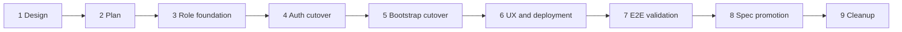

# OSS Admin Surface Authentication and Bootstrap Implementation Plan

## Feature Summary

Ship a separately deployed OSS Admin surface that authenticates with Azents accounts, forwards the actual
user JWT to the Admin API, and enforces a database-backed `system_admin` role on every non-bootstrap Admin
operation. Move zero-user setup to a one-time Admin bootstrap flow, provide an exact-email operator CLI for
existing installations and recovery, preserve existing Admin/Debug capabilities, and keep the Main Web on
Public API permissions only.

Approved sources:

- [Design](oss-admin-surface-auth-and-bootstrap.md)
- [ADR-0144](../adr/0144-oss-admin-surface-auth-and-bootstrap.md)

## Delivery Shape

The feature ships as a nine-PR stack with the prefix `OSS Admin Auth`. Each implementation PR is based on
the preceding branch. The stack is merged front to back only.

| PR | Title | Primary boundary |
|---|---|---|
| 1/9 | `OSS Admin Auth [1/9]: Design` | Approved ADR and design |
| 2/9 | `OSS Admin Auth [2/9]: Implementation plan` | Stack plan, validation matrix, prerequisites |
| 3/9 | `OSS Admin Auth [3/9]: System authorization foundation` | Schema, role service, CLI, self-role API |
| 4/9 | `OSS Admin Auth [4/9]: Admin authentication cutover` | Admin API guard and Admin Web user session |
| 5/9 | `OSS Admin Auth [5/9]: Admin bootstrap cutover` | One-time Admin bootstrap and public bootstrap removal |
| 6/9 | `OSS Admin Auth [6/9]: Admin management and deployment UX` | Role UI, Main Web link, Helm/config/docs |
| 7/9 | `OSS Admin Auth [7/9]: E2E validation` | Deterministic dual-web validation and discovered fixes |
| 8/9 | `OSS Admin Auth [8/9]: Spec promotion` | Living specs and implemented design marker |
| 9/9 | `OSS Admin Auth [9/9]: Cleanup` | Remove this temporary plan and stale references |

## Dependencies and Ordering

- PR 3 must land before any route can require `system_admin`.
- PR 4 is a coordinated deployment boundary: Admin Web user-token forwarding and Admin API enforcement
  cannot be split into independently deployed changes.
- PR 5 depends on the role/session foundation and removes the previous bootstrap path without fallback.
- PR 6 depends on stable APIs from PRs 3–5.
- All implementation PRs must exist before CI monitoring begins, per stack workflow.
- Spec promotion waits for deterministic E2E evidence.

## PR 3/9: System Authorization Foundation

### Scope

- Add the PostgreSQL system-role enum and `system_user_roles` relation.
- Add bootstrap-state schema needed by the later cutover without activating bootstrap behavior yet.
- Add repository/service boundaries for role lookup, list, grant, revoke, and final-admin protection.
- Add a typed `SystemAdmin` dependency that composes normal user JWT authentication with a database role
  lookup, but do not apply it globally to existing Admin routers until PR 4.
- Cover final-admin removal through both role revoke and global User deletion service paths.
- Add Admin role assignment APIs and a Public API current-user role projection.
- Add the exact-email `system-admin grant` operator CLI.
- Generate OpenAPI specs and Public/Admin clients from source.

### Data/API/runtime changes

- New PostgreSQL enum: `system_user_role` with `system_admin`.
- New role assignment table with grant provenance.
- New singleton bootstrap state table, inactive until PR 5 service wiring.
- New Public API self-role response.
- New Admin API role list/grant/revoke operations protected by the new dependency.
- New backend CLI process using normal configuration and DI container.

### Validation

- Migration upgrade/downgrade in an isolated database.
- Repository/service tests for idempotent grant, revoke, not-found, and provenance.
- Concurrent final-admin revoke/delete tests.
- Dependency tests for missing, ordinary, admin, and revoked users.
- CLI success, unknown email, normalized exact match, and idempotency tests.
- Ruff, format, Pyright, focused Pytest, OpenAPI generation, and generated-client typecheck.

### Review boundary

No existing Admin router changes authorization in this PR. This preserves a reviewable schema/service
foundation while PR 4 performs the coordinated security cutover.

## PR 4/9: Admin Authentication Cutover

### Scope

- Apply the system-admin dependency to every existing Admin API router by default.
- Keep only future bootstrap status/create routes outside the protected router boundary.
- Replace Admin Web GitHub organization login with Azents Public API login.
- Add separate Admin Web HTTP-only auth cookies and refresh/logout behavior.
- Add protected tRPC procedures and same-origin mutation checks.
- Forward the actual user access token to the Admin API.
- Remove client-credentials OAuth2, GitHub login, and Admin API no-auth modes.
- Preserve every existing Admin resource and Debug route behind the new guard.

### Data/API/runtime changes

- Admin OpenAPI operations declare Bearer authentication.
- Admin Web depends on both generated Public and Admin clients.
- Admin Web server config receives Public API internal URL and Admin API internal URL.
- User privileges remain database-backed and are not copied into JWT claims.

### Validation

- Router-level authorization coverage test enumerates all Admin operations.
- Ordinary user receives `403` from representative routes in every Admin domain.
- System admin receives existing responses for Users, Workspaces, tokens, model catalog, and Debug.
- Missing Admin Web cookie cannot invoke protected tRPC.
- Role revoke affects an already-issued access token immediately.
- Admin Web password login, refresh, logout, expired session, and forbidden state tests.
- TypeScript format/lint/typecheck/build and backend quality checks.

### Deployment constraint

Admin API enforcement and Admin Web user-token forwarding ship together. Existing installations run the
PR 3 CLI after deployment; Admin operations remain denied until an explicit grant exists. Main Web and
Public API remain available.

## PR 5/9: Admin Bootstrap Cutover

### Scope

- Activate singleton setup-token state and startup initialization.
- Support operator-configured or generated one-time bootstrap token.
- Add Admin bootstrap status and first-admin endpoints.
- Add Admin Web setup flow and automatic Admin session establishment.
- Create first User, verified email, PasswordLogin, `system_admin`, and Session transactionally.
- Do not create a Workspace or Workspace membership.
- Remove public Workspace bootstrap routes, Main Web bootstrap UI, duplicate Admin Workspace bootstrap
  routes, and obsolete first-owner configuration.
- Regenerate specs and clients.

### Data/API/runtime changes

- Admin bootstrap status/create are the only unauthenticated Admin operations.
- Bootstrap request uses a redacted header for the setup token.
- Generated token plaintext is logged exactly once after hash persistence.
- Configured token is never logged and can rotate an unconsumed generated token while User count is zero.
- Successful bootstrap consumes token state and returns normal auth tokens.

### Validation

- Correct, incorrect, weak-password, repeated, and unavailable bootstrap tests.
- Concurrent bootstrap proves exactly one User and one role assignment.
- Transaction rollback leaves token usable after non-committed failure.
- Generated-token and configured-token log-redaction tests.
- Main Web build proves bootstrap feature/client calls are removed.
- OpenAPI assertion allows only two unauthenticated Admin operations.

## PR 6/9: Admin Management and Deployment UX

### Scope

- Add system-admin state and grant/revoke actions to the existing Admin Users surface.
- Render final-admin conflict and self-revocation outcomes explicitly.
- Add the optional Main Web Admin link based on Public API self roles and configured public URL.
- Keep Main Web free of `@azents/admin-client`.
- Update Admin Web/Main Web/server configuration schemas.
- Update Helm values, schema, Secrets, ConfigMaps, deployments, README, and fresh-install/upgrade/recovery
  operator documentation.
- Remove GitHub/Admin OAuth2 secret requirements.

### Data/API/runtime changes

- Main Web receives optional Admin Web public URL.
- Admin Web receives explicit public base, Public API internal, and Admin API internal URLs.
- Server receives optional setup-token secret at the backend boundary.
- Cookie path derives from the externally visible Admin Web base path.

### Validation

- Admin Users UI states: ordinary user, admin, current admin, final admin, grant/revoke success/error.
- Main Web link visible/hidden matrix and URL correctness.
- Dependency graph assertion rejects Main Web Admin client dependency.
- Helm render matrix for Admin disabled/enabled, separate host, gateway path, configured Secret, and no
  obsolete GitHub/OAuth2 keys.
- Storybook stories for new pure UI states where required.
- TypeScript and Helm quality checks.

## PR 7/9: E2E/Testenv Validation

### Scope

- Add only the fixture/prerequisite controls required for deterministic dual-web E2E.
- Execute the full validation matrix against real Main Web, Admin Web, Public API, and Admin API processes.
- Verify CLI upgrade/recovery through the real command path.
- Record environment, commands, sanitized evidence, failures, and fixes in a dated validation report.
- Compare implemented behavior strictly against current specs and the approved design.
- Fix discovered implementation bugs in this PR or move fixes to the responsible earlier branch and
  rebase later branches when reviewability requires it.

### Fixture/prerequisite support

Testenv support is needed because the matrix requires reproducible zero-user startup, multi-admin states,
process restart, controlled setup-token output, and URL topology variants. It remains automated-test-only
and does not replace Admin Debug.

Required fixture profiles:

- empty instance with generated setup token;
- empty instance with configured setup token;
- ordinary password user without system role;
- one and two system-admin users;
- existing-install users-without-role state;
- representative Workspace, signup-token, password-reset-token, model catalog, and Debug prerequisites;
- dedicated-host and gateway-path routing profiles.

### Validation commands and evidence

The report records exact commands, commit SHA, migration revision, environment profile, E2E results,
OpenAPI authorization coverage, cookie attributes without values, sanitized logs, Helm renders, and CI
artifact links. No token or password value may appear in output or retained artifacts.

## PR 8/9: Spec Promotion

### Scope

- Run `/spec-review` against the full implementation stack.
- Update `spec/domain/user-auth.md` with system roles, Admin user JWT authorization, Admin bootstrap, Admin
  Web session, and CLI recovery.
- Update `spec/domain/workspace.md` to remove bootstrap-created Workspace behavior and describe the
  system-admin Admin boundary.
- Update `spec/domain/model-catalog.md` and deployment/auth specs where current Admin authorization or
  configuration behavior changed.
- Add `implemented: 2026-07-13` to the design only after the validation PR passes.
- Keep ADR-0144 immutable.

### Validation

- Spec-review output and implementation/spec comparison table contain no unresolved drift.
- Docs index/frontmatter checks pass.
- Current spec code paths and verification dates cover new backend/frontend/config files.

## PR 9/9: Cleanup

### Scope

- Delete this temporary implementation plan.
- Remove stale plan references that are not useful historical rationale.
- Retain ADR-0144, the implemented design, validation report, current specs, and operator documentation.

No behavior, generated code, refactor, or new test belongs in cleanup.

## E2E Primary Validation Matrix

| Behavior | Setup | Assertion | Blocking phase |
|---|---|---|---|
| Fresh bootstrap | zero users, generated token | first Admin session created; no Workspace | PR 5, validated PR 7 |
| Configured bootstrap | zero users, Secret token | succeeds; secret absent from logs | PR 5, validated PR 7 |
| Invalid/repeated bootstrap | zero users then bootstrapped | generic reject; no partial state | PR 5 |
| Concurrent bootstrap | two simultaneous create requests | exactly one succeeds | PR 5 |
| Admin login | system admin password user | protected page and Admin API load | PR 4 |
| Ordinary-user denial | password user without role | login identity valid; Admin operation `403` | PR 4 |
| Missing-session tRPC | no Admin cookies | no privileged downstream request | PR 4 |
| Immediate grant/revoke | existing access token | database role takes effect immediately | PR 3/4 |
| Final-admin revoke | one admin | `409`; role remains | PR 3/6 |
| Final-admin User deletion | one admin | `409`; User remains | PR 3/6 |
| Multi-admin deletion | two admins | deletion succeeds; one admin remains | PR 3 |
| Existing-install CLI | users, no roles | exact email receives role only | PR 3/7 |
| Main Web Admin link | role and URL matrix | correct visibility; no Admin API call | PR 6 |
| Existing Admin capabilities | representative resources | system admin allowed, ordinary user denied | PR 4/7 |
| Debug preservation | Admin Debug route | admin allowed; no testenv dependency | PR 4/7 |
| Session expiry/logout | Admin session | cookies cleared; access stops | PR 4/7 |
| Routing neutrality | host/path profiles | links, redirects, cookies correct | PR 6/7 |
| Secret redaction | generated/configured modes | no secret in trace, report, or normal logs | PR 5/7 |

Core matrix rows are deterministic and must not skip in PR CI.

## Supporting Test Strategy by Layer

### Backend

- Repository and service unit/integration tests in PR 3.
- Auth dependency and router coverage tests in PR 4.
- Bootstrap transaction/concurrency tests in PR 5.
- Full Ruff, format, Pyright, and Pytest on affected backend paths before each PR opens.

### Frontend

- Admin login/session/procedure tests in PR 4.
- Bootstrap UI tests in PR 5.
- Role management and Main Web link tests/stories in PR 6.
- Full TypeScript format, lint, typecheck, and build before affected PRs open.

### API clients

OpenAPI source is regenerated whenever routes or schemas change. Generated clients are regenerated from the
specs and never edited manually. Drift checks run in PRs 3–5 and full validation.

### Infrastructure

Helm schema and render tests land with configuration changes in PR 6. Optional live ingress/TLS tests may
skip when prerequisites are absent; present-but-invalid configured environments fail.

## Prerequisites and External Actions

| Requirement | Type | Blocks | Handling |
|---|---|---|---|
| PostgreSQL migration environment | deterministic local/CI | PR 3 | existing backend test infrastructure |
| Empty database and process restart | testenv fixture | PR 5/7 | add automated fixture profile |
| Configured bootstrap secret | ephemeral CI secret | PR 5/7 | generated per run, redacted |
| Existing user selected for upgrade | operator action | production rollout only | documented exact-email CLI |
| SMTP | optional external | none | password login is deterministic path |
| GitHub OAuth | removed prerequisite | none | delete configuration dependency |
| Live ingress/TLS | optional external | none | nightly/manual validation only |

There are no implementation blockers at plan creation time.

## Spec Impact Candidates

- `docs/azents/spec/domain/user-auth.md`
- `docs/azents/spec/domain/workspace.md`
- `docs/azents/spec/domain/model-catalog.md`
- deployment/auth flow specs discovered by `/spec-review`
- Helm/operator documentation outside Living Spec

Specs remain unchanged until PR 8 unless an earlier phase changes current behavior in a way that cannot be
reviewed safely without same-PR spec text.

## Rollout Notes

1. Apply the additive role/bootstrap-state migration.
2. Deploy the coordinated Admin auth cutover.
3. On installations with users and no roles, run the exact-email CLI before using Admin operations.
4. Fresh zero-user installations retrieve the generated setup token from startup logs or provide a Secret,
   then complete setup in Admin Web.
5. Configure the optional Main Web Admin URL after Admin Web is reachable.
6. Do not enable a legacy GitHub/OAuth2/no-auth fallback during rollout.
7. Monitor denied Admin requests, missing-admin startup warning, bootstrap attempts, and role mutations with
   secret-redacted structured logs.

Rollback across the schema addition is safe while role rows are unused. After the auth cutover, rollback
must restore the matching Admin Web and Admin API versions together. A rollback must not re-enable public
bootstrap after any User exists.

## Cleanup Notes

After PR 8 confirms implementation and specs are current, PR 9 deletes this plan. The durable sources of
truth are the current specs, ADR-0144, the implemented design, validation report, operator documentation,
and code.
