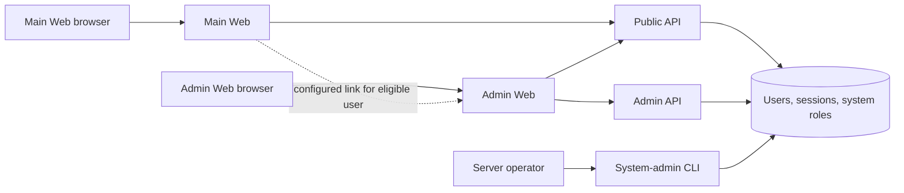

# OSS Admin Surface Authentication and Bootstrap Design

## Overview

This design turns the existing Admin Web and Admin API into a self-contained OSS operator surface while
preserving the Main Web and Public API as the user/workspace product boundary.

The Admin Web remains a separate application, but it authenticates with the same Azents accounts as the
Main Web. The Admin API accepts the same user JWT format and checks an instance-scoped `system_admin`
assignment on every protected request. The current GitHub organization login and shared Admin API machine
credential are removed.

Initial instance setup moves from the Main Web/Public API to an exceptional one-time Admin bootstrap flow.
Bootstrap creates the first user and system-admin assignment, but no Workspace. Existing installations use
an explicit operator CLI command to nominate an existing user as the first system admin.

The hard-to-reverse boundary decisions are recorded in
[ADR-0144](../adr/0144-oss-admin-surface-auth-and-bootstrap.md).

## Goals

1. Keep global operator functions outside the Main Web bundle and Public API workspace boundary.
2. Use one Azents account identity system for both product and Admin surfaces.
3. Enforce Admin authorization in the Admin API with the actual user principal.
4. Make deployment routing configurable rather than requiring a path, domain, or ingress topology.
5. Support secure zero-user bootstrap without SMTP or a pre-existing Azents account.
6. Support explicit upgrade and recovery for installations that already contain users.
7. Preserve existing operator and Debug capabilities behind the new authorization boundary.
8. Provide E2E-first verification for bootstrap, login, authorization, role management, and migration.

## Non-goals

- Merge Admin Web pages into `typescript/apps/azents-web`.
- Add `@azents/admin-client` back to the Main Web.
- Treat Workspace OWNER or MANAGER as an instance administrator.
- Add backward-compatible GitHub organization login, machine OAuth2, or unauthenticated Admin API modes.
- Implement shared-cookie SSO or cross-surface session handoff in v1.
- Redesign every existing Admin resource page.
- Move operator Debug endpoints into testenv.
- Add new system roles beyond `system_admin` in v1.
- Build a durable general-purpose security audit-event database in this feature.

## Current Behavior and Problems

### Main Web and Public API

The Main Web holds Azents access/refresh tokens in HTTP-only cookies and calls the Public API through
`@azents/public-client`. Workspace member, invitation, and join-request routes enforce current-user and
workspace permissions in the backend. This is the correct path for product-level Workspace administration.

The current public bootstrap endpoints create a user, password login, Workspace, and OWNER membership when
`first_owner_bootstrap_enabled` is true and the user count is zero. The Main Web exposes the corresponding
setup flow.

### Admin Web

The Admin Web currently uses NextAuth GitHub login and checks membership in the `azents` GitHub
organization. That session protects Refine navigation in the browser, but it is not connected to the
Azents user/session model.

Its tRPC `publicProcedure` is an unguarded `t.procedure`. The tRPC context obtains a shared Admin API
credential through optional OAuth2 client credentials, or calls without application authentication. A
caller reaching a tRPC procedure can therefore cause the server to act with a shared principal without an
Azents user authorization check.

### Admin API

Admin API routes provide global CRUD and operational functions. Most routes do not depend on
`get_current_user`, and the few optional current-user dependencies are used for attribution rather than
access control. The API therefore cannot distinguish a system administrator from an ordinary user by
itself.

The Admin API also duplicates the public bootstrap routes. Debug endpoints are intentionally Admin-only
operator diagnostics and must remain available after authorization is fixed.

## Target Architecture



The four deployable surfaces remain independent:

| Surface | Responsibility | Authorization boundary |
|---|---|---|
| Main Web | User and Workspace product UX | Public API user/workspace permissions |
| Public API | Account, Workspace, and product operations | User JWT and workspace permission dependencies |
| Admin Web | System operator UX and bootstrap UX | Admin Web session plus authoritative downstream API checks |
| Admin API | Global CRUD, credentials, catalogs, diagnostics | User JWT plus system role dependency; bootstrap exception only |

A gateway can publish these components through separate hosts, path prefixes, direct ports, or a custom
layout. No security decision relies on a particular routing shape.

## Authentication and Authorization

### Admin Web session

The Admin Web implements the same login methods as the Main Web through `@azents/public-client` and the
Public API. Password login is the minimum deterministic OSS path; email OTP remains available when the
instance exposes it under the existing credential rules.

The Admin Web stores its own access token, refresh token, and access-token expiration in separately named
HTTP-only cookies. Recommended names are:

- `az-admin-token`
- `az-admin-refresh`
- `az-admin-token-expires-at`

Cookie requirements:

- `HttpOnly` for every token cookie;
- `Secure` in production;
- `SameSite=Lax`;
- host-only unless an operator explicitly configures a domain in a future feature;
- a cookie path matching the externally visible Admin Web base path, or `/` on a dedicated host;
- access token refresh behavior matching the Main Web;
- cookie deletion on refresh rejection or logout.

Names remain distinct even when Main Web and Admin Web share a host. The two surfaces can therefore hold
independent sessions for the same user without requiring shared cookies.

### Admin Web tRPC boundary

The Admin Web replaces the current bare `publicProcedure` use for operator operations with two explicit
procedure classes:

- `bootstrapProcedure`: usable only for bootstrap status and first-admin bootstrap proxy calls;
- `protectedProcedure`: requires valid Admin Web auth cookies and a fresh Azents access token.

The tRPC context refreshes the user token through the Public API and attaches that user Bearer token to the
Admin API client. It never obtains a machine client-credentials token. Protected mutations enforce
same-origin requests at the Admin Web route boundary to reduce cookie-based CSRF risk.

The tRPC check improves defense in depth and produces correct redirects, but it is not the final
permission decision. Every Admin API route independently checks the user and role.

### Admin API dependency

Add a system authorization dependency with this chain:

1. Decode the normal Azents access token through `get_current_user`.
2. Query the current `system_user_roles` state for the user.
3. Require the `system_admin` role.
4. Return a typed `SystemAdmin` context containing at least `user_id` and `session_id`.

System roles are looked up from the database on every protected request rather than embedded in the JWT.
Grant and revoke therefore take effect immediately for existing access tokens. The JWT remains an identity
and session token, not a snapshot of system privileges.

The Admin API applies the dependency at a router/mount boundary so a newly added Admin route is protected
by default. Bootstrap routes are mounted through a separate explicit unauthenticated router. OpenAPI must
show Bearer authentication on every protected Admin operation.

### Main Web Admin link

The Public API adds an authenticated self-only projection such as
`GET /user/v1/me/system-roles`. It returns only the current user's instance roles. The Main Web shows an
Admin link only when:

- the configured Admin Web public URL is present; and
- the self projection includes `system_admin`.

The link is a convenience and never an authorization control. Admin Web login and Admin API role checks are
still required. The Main Web continues to use only `@azents/public-client`.

## System Role Model

### Data model

Add a PostgreSQL enum and relation equivalent to:

#### `system_user_role`

Initial value:

- `system_admin`

#### `system_user_roles`

| Field | Description |
|---|---|
| `user_id` | Target user; foreign key to `users.id` |
| `role` | PostgreSQL `system_user_role` enum |
| `granted_by_user_id` | Granting Azents user; nullable for bootstrap and operator CLI |
| `granted_at` | Grant timestamp |

The composite `(user_id, role)` is the primary key or equivalent unique key. Deleting a user may cascade
its own role assignments; deleting a granter sets `granted_by_user_id` to null.

`granted_by_user_id` records provenance of the current assignment. Structured audit logs record bootstrap,
grant, revoke, denied-final-admin removal, and CLI actions. A complete immutable audit-event table is a
separate future design.

### Service behavior

`SystemRoleService` owns list, grant, revoke, and authorization queries. Routes do not call the repository
directly.

Role mutations are idempotent where practical:

- granting an existing assignment succeeds without creating a duplicate;
- revoking an absent assignment returns not found or an explicit no-op response consistently across API
  and client;
- a user must exist before a role can be granted.

All mutations that can remove a `system_admin` assignment acquire one transaction-scoped serialization
lock for system-role mutation, then count current admins and apply the change in the same transaction. The
operation fails when it would leave zero system admins. The same invariant applies when deleting a User
whose role assignment would cascade; the global User delete path must use the same serialized check.

### Admin API

The exact generated operation names may follow existing naming conventions, but the resource contract is:

| Method | Path | Behavior |
|---|---|---|
| GET | `/system/v1/me` | Return authenticated Admin identity/role projection; protected |
| GET | `/system/v1/role-assignments` | List system role assignments; protected |
| PUT | `/system/v1/users/{user_id}/roles/system_admin` | Grant role to existing user; protected |
| DELETE | `/system/v1/users/{user_id}/roles/system_admin` | Revoke role; protected; final-admin invariant |

The existing Users page supplies user lookup. Grant and revoke controls are shown in the selected user's
row/detail view, and current system admins are distinguishable in that existing surface.

Expected errors:

| Condition | Response |
|---|---|
| Missing/invalid access token | `401 Unauthorized` |
| Authenticated user lacks `system_admin` | `403 Forbidden` |
| Target user absent | `404 Not Found` |
| Revocation or user deletion would remove final system admin | `409 Conflict` with stable error code |

## Bootstrap Design

### Bootstrap availability

Bootstrap is available only when all of the following hold:

- total User count is zero;
- an active setup-token hash exists;
- the setup token has not been consumed.

Loss of all role assignments after users exist does not satisfy bootstrap availability. The public status
response exposes only `available: boolean`; it does not reveal token origin, hash, or user counts.

### Setup token lifecycle

The setup token contains at least 256 bits of cryptographically secure entropy. Plaintext is never stored.
The Admin API startup lifecycle ensures a singleton bootstrap state row while the instance has zero users.
The state contains an active token hash, creation time, and optional consumption time.

Two token sources are supported:

1. **Configured token** — an operator provides a secret through server environment/Secret configuration.
   The server hashes it and never logs the plaintext.
2. **Generated token** — when no configured token exists, one Admin API instance atomically creates the
   state and logs the plaintext exactly once after the hash is durably stored. Other replicas observe the
   existing state and do not generate or log another token.

If the generated token is lost before bootstrap, an operator can restart with an explicitly configured
token while the user count is still zero; startup rotates the unconsumed bootstrap hash to the configured
value. All Admin API replicas must receive the same configuration.

The token is submitted in a dedicated redacted header, not a URL query parameter. Request/response logging,
tRPC error formatting, Sentry context, and reverse-proxy examples must redact that header and bootstrap
request secrets.

### Bootstrap API and transaction

The Admin API exposes only these unauthenticated system routes:

| Method | Path | Behavior |
|---|---|---|
| GET | `/system/v1/bootstrap/status` | Return availability only |
| POST | `/system/v1/bootstrap/first-admin` | Validate setup token and create first admin |

The create request contains the first user's normalized email and password. No Workspace profile fields are
required because no Workspace is created.

Successful bootstrap performs one transaction:

1. serialize bootstrap attempts;
2. re-check User count is zero and setup state is active;
3. compare the submitted token hash in constant time;
4. validate email normalization and password strength;
5. create User and verified primary UserEmail;
6. create PasswordLogin;
7. grant `system_admin` with bootstrap provenance;
8. create the ordinary Azents refresh session;
9. mark the setup token consumed;
10. commit and return normal access/refresh token response data.

Validation or transient failures do not consume the setup token. A concurrent loser rechecks state and
receives bootstrap unavailable. The Admin Web stores the returned session in its Admin cookies and enters
the protected Admin surface.

The bootstrap service belongs to the system/auth domain, not `WorkspaceService`. Public API bootstrap
routes and the Main Web bootstrap feature are removed in the cutover; the Admin API does not retain a
duplicate Workspace bootstrap route.

### Bootstrap security events

Emit structured events without secrets for:

- generated bootstrap token creation (the one required plaintext log is a separately marked one-time
  operator message);
- configured bootstrap token activation without its value;
- successful bootstrap with new `user_id` and session ID;
- rejected unavailable bootstrap;
- rejected invalid-token bootstrap with rate-limited/noisy logging policy.

Never include password, token hash, access token, refresh token, signup token, or password-reset token.

## Existing Installation and Break-glass CLI

Add an operator command under the Azents backend CLI, with a contract equivalent to:

```console
azents system-admin grant --email operator@example.com
```

The actual executable packaging can follow the repository's Typer script conventions, but the command
behavior is fixed:

1. load normal server/DB configuration;
2. normalize and resolve an exact existing primary or registered email;
3. fail if zero or multiple users resolve;
4. acquire the same system-role mutation lock as the service;
5. grant `system_admin` idempotently with CLI provenance;
6. print the selected user ID and a success summary, never credentials;
7. emit a structured audit log with `source=operator_cli`.

The CLI does not create a User, issue a browser session, accept a user ID fallback in v1, or reopen
bootstrap. Container deployments run it through `docker exec`; Kubernetes deployments use `kubectl exec`
or a one-shot Job with the normal database configuration.

Upgrade behavior is intentionally explicit:

- zero-user installations use Admin bootstrap;
- installations with users and no role assignments run the CLI once;
- installations already containing a system admin require no action;
- no migration, startup hook, environment variable, User creation order, or Workspace OWNER role performs
  automatic promotion.

If all system admins are later lost, the same CLI grants the role to an existing user. This is the only v1
break-glass path.

## Admin Capability Scope

The following existing Admin capabilities remain in the Admin surface and receive the system-admin guard:

- global User and User Email management;
- global Workspace and Workspace Member management;
- signup-token creation/list/revocation;
- password-reset-token creation/list/revocation;
- email-verification inspection;
- system model-catalog list and refresh operations;
- Debug/Sentry/logging diagnostics;
- new system-role management.

Workspace-scoped member, invitation, and join-request product UX uses existing Public API permissions in the
Main Web. This feature does not move global Admin CRUD into the Main Web or require all missing product UX
to be completed in the same change.

Testenv endpoints remain test-only fixture/prerequisite tools. They are not a production fallback for
Debug or Admin operations.

## Configuration and Routing Contract

Configuration names should be normalized during implementation, but each deployment must provide these
logical values:

| Consumer | Logical configuration | Purpose |
|---|---|---|
| Main Web | Public API browser/internal URLs | Existing product API calls |
| Main Web | optional Admin Web public URL | Eligible-user navigation link |
| Admin Web | Admin Web public base URL | redirects and cookie path derivation |
| Admin Web | Public API internal URL | login, refresh, logout, self identity |
| Admin Web | Admin API internal URL | protected operator calls and bootstrap proxy |
| Admin API | optional bootstrap setup token | operator-provided zero-user setup secret |

No component derives another service URL by concatenating a hard-coded `/admin` prefix or replacing a
hostname. Public URLs may contain a gateway path. Internal service URLs may point directly to cluster
Services. Redirects and links use public URLs; server-to-server clients use internal URLs.

Remove the Admin Web GitHub client ID/secret and Admin API OAuth2 client ID/secret requirements. Helm
`adminAuth` secret documentation changes from GitHub/NextAuth credentials to the secrets actually needed
by Admin Web session protection and optional backend bootstrap configuration. Bootstrap secret belongs to
the Admin API/server secret boundary, not the Admin Web deployment.

## Error Handling

- Admin Web treats Public API refresh `401` as session expiration, clears Admin cookies, and redirects to
  Admin login.
- Admin API `403` is rendered as lack of system-admin access; it never falls back to a machine credential.
- Revocation of the current user's own role is allowed only when another system admin remains. The next
  Admin API call fails immediately with `403` because role state is database-backed.
- Deletion of the final system-admin User fails with the same stable `409` invariant error as role revoke.
- Bootstrap returns a generic invalid or unavailable error without distinguishing token details.
- Unexpected API/network failures propagate as failures and are captured without token-bearing request
  data.

## Migration and Rollout

### Phase 1: System authorization foundation

- Add migration for system role enum/relation and bootstrap state.
- Add repositories, services, typed authorization dependency, and unit/integration tests.
- Add self-only Public API system-role projection.
- Add the exact-email operator CLI.
- Regenerate Public and Admin OpenAPI clients for new endpoints only.

The migration only adds schema. It does not promote existing users.

### Phase 2: Coordinated Admin authentication cutover

- Replace GitHub NextAuth/Refine identity behavior with Azents login/session behavior.
- Add Admin Web auth cookies, refresh, protected tRPC procedures, and origin checks.
- Forward the user JWT to the Admin API.
- Apply the system-admin dependency to every existing Admin router, including Debug.
- Remove Admin Web machine OAuth2 and no-auth client modes.
- Regenerate the Admin client and update configuration/Helm manifests.

This is one coordinated deploy boundary: the Admin Web must be able to send user JWTs when the Admin API
begins requiring them. Existing installations run the CLI after deployment; until then Admin API calls are
correctly denied while Main Web/Public API remain available.

### Phase 3: Bootstrap cutover

- Add Admin bootstrap status/create service and Admin Web setup flow.
- Issue and persist the one-time setup token according to the lifecycle above.
- Remove Public API Workspace bootstrap routes and generated client methods.
- Remove Main Web bootstrap feature and first-owner Workspace creation behavior.
- Remove duplicate Admin Workspace bootstrap routes and obsolete bootstrap configuration.

This is a clean migration with no legacy endpoint fallback.

### Phase 4: System-admin management and navigation

- Add role state/actions to the Admin Users surface.
- Add final-admin invariant handling to role revoke and User deletion UX.
- Add the optional Main Web link using the Public API self-role projection and configured Admin URL.
- Add operator documentation for fresh install, upgrade grant, recovery, and routing examples.

### Phase 5: Verification and spec synchronization

- Run deterministic E2E, backend quality checks, TypeScript quality checks, client generation checks, and
  Helm rendering tests.
- Update `spec/domain/user-auth.md` for system roles/Admin bootstrap and remove public first-owner behavior.
- Update `spec/domain/workspace.md` to remove bootstrap coupling and describe the system-admin-protected
  Admin boundary.
- Update model-catalog and other specs only where their current Admin authorization description changes.
- Record E2E evidence in a dated validation report before marking the design implemented.

## Test Strategy

Product behavior verification is E2E primary. Unit, integration, static, OpenAPI, and Helm checks support
but do not replace browser/API verification.

### E2E primary verification matrix

| Scenario | Expected verification |
|---|---|
| Fresh zero-user Admin bootstrap | status available; correct setup token creates user, verified email, password, system role, and Admin session; no Workspace exists |
| Invalid bootstrap token | generic rejection; no User, role, session, or token consumption |
| Concurrent bootstrap | exactly one succeeds; the other receives unavailable; one User and one role assignment exist |
| Repeated bootstrap | status unavailable and create rejected after first success |
| Configured bootstrap secret | bootstrap succeeds and secret value is absent from logs |
| Generated bootstrap secret | plaintext appears exactly once in designated startup evidence and never again in request logs |
| Admin password login | existing system admin logs in through Azents Public API and protected Admin page loads |
| Ordinary user Admin login | account authentication may succeed, but Admin API returns `403` and operator UI is inaccessible |
| Missing Admin Web session | protected tRPC request returns unauthenticated and does not call Admin API with shared authority |
| Role grant | system admin grants existing user; target's current access token gains Admin API access immediately |
| Role revoke | revoked user's existing access token loses Admin API access immediately |
| Final role revoke | API and UI reject with stable `409`; assignment remains |
| Final system-admin User delete | API rejects with stable `409`; User and assignment remain |
| Multi-admin User delete | non-final system-admin User can be deleted and assignment cascades safely |
| Existing-install CLI grant | exact existing email receives role; no new User or Workspace is created |
| CLI invalid email | command fails without role changes |
| Main Web Admin link | visible only for current system admin when Admin URL configured; Main Web has no Admin API request |
| Global Admin operations | representative User, Workspace, signup-token, password-reset-token, catalog, and Debug calls all require system admin |
| Debug functions | still available to system admin and denied to ordinary user; no testenv dependency |
| Logout/refresh expiry | Admin cookies clear; protected tRPC/Admin API access stops |
| Routing variants | dedicated host and gateway path/public URL configurations generate correct links, redirects, and cookie paths |

### E2E plan

- Browser tests exercise both Main Web and Admin Web against real Public and Admin API processes.
- API-level E2E supplements browser tests for concurrency, invariant, and exact response-code assertions.
- Use deterministic password login so default PR CI requires no GitHub, SMTP, or external OAuth credential.
- Capture the setup token from controlled process output only in the generated-token scenario; keep it in
  the test process secret store and never include its value in artifacts.
- Verify representative existing Admin routers rather than only the new system endpoints so a missing
  router-level dependency is detected.
- Inspect generated OpenAPI security metadata for every protected Admin operation and explicitly allow only
  the two bootstrap operations without Bearer security.

### Testenv fixture/prerequisite support

Testenv may provide automated-only fixture controls for:

- resetting to a truly empty database;
- starting Admin/Public APIs with generated or configured bootstrap token mode;
- seeding ordinary users and multiple system admins;
- creating existing-install state with users but no system roles;
- capturing sanitized server logs and restarting components;
- exposing deterministic internal service/public URL variants.

Fixtures do not bypass the product path for the core assertions. Role grant/revoke, bootstrap, login, and
Admin operations are still exercised through their real CLI/API/Web surfaces. Testenv support is not
published as operator Debug functionality.

### Seed and fixture requirements

- zero-user instance;
- one ordinary user with password and no system role;
- one system admin with password;
- two system admins for revoke/delete scenarios;
- users-present/no-system-admin upgrade state;
- representative Workspace and credential-token metadata;
- configured-token and generated-token Admin API process profiles.

### Credential and prerequisite snapshot requirements

- Deterministic PR E2E requires no external credential.
- The configured bootstrap token is an ephemeral CI secret and is redacted from command, log, screenshot,
  trace, and report output.
- GitHub OAuth is not a prerequisite after cutover.
- SMTP-dependent email login remains optional; password login verifies the required Admin path.
- Any optional live ingress/TLS matrix must record its prerequisite snapshot separately.

### Evidence format

The validation report records:

- commit SHA and migration revision;
- exact commands and working directories;
- E2E scenario pass/fail table;
- sanitized API status/body summaries;
- role and User/Workspace count assertions;
- OpenAPI protected-route coverage result;
- cookie attribute assertions without cookie values;
- sanitized log checks proving secret redaction;
- Helm rendering/configuration matrix;
- links to CI jobs or retained artifacts that do not contain secrets.

### CI execution policy

- Deterministic backend, frontend, CLI, and dual-web E2E run in PR CI.
- OpenAPI regeneration drift and Admin security-metadata coverage fail PR CI.
- Helm render tests cover enabled/disabled Admin Web, configured secret reference, separate host, and path
  gateway values.
- Optional live ingress/TLS tests may run nightly or by label. Missing optional credentials produce SKIP;
  present-but-invalid credentials or a failed configured environment produce FAIL.
- Core bootstrap/auth/role tests never skip for missing external services.

## Supporting Verification

### Backend

- repository tests for role list/grant/revoke and bootstrap state;
- service tests for exact-email lookup, idempotent grant, final-admin serialization, and User deletion;
- auth dependency tests for missing, invalid, ordinary, revoked, and admin JWTs;
- bootstrap transaction tests for weak password, invalid token, concurrency, and rollback;
- CLI tests with isolated database configuration;
- Ruff, Pyright, and Pytest for `python/apps/azents`.

### Frontend

- Admin Web unit/component tests for login, setup, forbidden, expired-session, and role-management states;
- static stories for meaningful pure UI states where required by frontend conventions;
- tests that protected procedures never create a machine-authenticated Admin client;
- format, lint, typecheck, and build for the TypeScript workspace.

### API and infrastructure

- regenerate public/admin OpenAPI specs and both generated clients;
- assert Main Web dependency graph does not contain `@azents/admin-client`;
- Helm schema/render tests for revised Admin auth/bootstrap environment;
- documentation frontmatter/index validation and spec review.

## Validation Against Current Repository

The design was checked against these current boundaries:

- Main Web auth cookies and Public API refresh behavior in `typescript/apps/azents-web/src/trpc/context.ts`
  and `src/shared/lib/cookies.ts` provide a reusable behavioral model, without creating an app-to-app
  dependency.
- Admin Web `src/auth.ts`, `src/trpc/context.ts`, and `src/trpc/init.ts` currently confirm the GitHub UI
  session/shared-credential gap this design removes.
- `azents.core.auth.deps.get_current_user` already validates the Azents JWT shape and can be composed with a
  new database-backed system-role dependency.
- Public WorkspaceUser, invitation, and join-request routes already enforce workspace permissions and are
  the correct Main Web administration path.
- Current Admin routers expose global operations and need a default router-level system guard.
- `WorkspaceService.bootstrap_first_owner` currently couples bootstrap to Workspace creation and must be
  replaced rather than extended.
- `create_admin_api_app` and `create_testenv_api_app` are separate applications, so retaining Admin Debug
  while keeping testenv test-only matches the deployed component boundary.
- Current backend scripts already use Typer and `run_with_container` is available for a DB-backed operator
  command.

## Risks and Mitigations

| Risk | Mitigation |
|---|---|
| A new Admin router is accidentally left public | Protected router/mount is the default; OpenAPI security coverage test enumerates all exceptions |
| Admin Web tRPC becomes a confused deputy again | No machine credential exists; protected procedure requires cookies; Admin API reauthorizes actual user |
| Existing install is locked out after upgrade | Explicit documented exact-email CLI works with direct DB authority; startup warns when users exist but no system admin |
| Concurrent revokes or User deletion remove all admins | One transaction-scoped system-role mutation lock and invariant check cover every removal path |
| Generated setup token is lost | With zero users, restart with an explicitly configured token to rotate the unconsumed hash |
| Setup token leaks through logs/traces | Header/body redaction, hash-only persistence, one designated generation log, secret-scanning assertions |
| Path/domain routing assumptions break OSS installs | Every public/internal URL is explicit; no hard-coded `/admin` derivation; routing matrix E2E/Helm tests |
| Role encoded in JWT remains after revoke | Role is read from DB on each Admin request, not stored as a JWT claim |
| Public bootstrap clients keep using removed route | Clean breaking cutover with regenerated clients and spec updates; no legacy fallback |
| Debug disappears during security cleanup | Debug remains in protected Admin router and has an explicit E2E scenario |

## Alternatives Considered

The ADR records the rejected architecture alternatives. Implementation-level alternatives were also
reviewed:

- **Reuse the Admin Web GitHub NextAuth session and map GitHub email to an Azents user** — rejected because
  external identity mapping becomes a second account and authorization path.
- **Put `system_admin` in access-token claims** — rejected because revoke would not take effect until token
  expiry and role mutation would require token reissuance semantics.
- **Protect only Admin Web tRPC** — rejected because direct Admin API access and future proxy bugs would
  bypass the UI boundary.
- **Protect routes one by one** — rejected because omission becomes the unsafe default.
- **Use a boolean `users.system_admin` column** — rejected in favor of an extensible role relation with
  grant provenance.
- **Keep both public and Admin bootstrap endpoints during migration** — rejected because it preserves two
  ownership-claim paths and conflicting bootstrap products.
- **Auto-grant the first existing User or first Workspace OWNER** — rejected because neither ordering nor
  tenant ownership expresses instance-operator intent.

## Required Spec Updates at Implementation

- `docs/azents/spec/domain/user-auth.md`
  - add system role model and Admin JWT authorization;
  - replace public first-owner Workspace bootstrap with Admin first-system-admin bootstrap;
  - document Admin Web independent cookie session and CLI recovery.
- `docs/azents/spec/domain/workspace.md`
  - remove bootstrap-created Workspace behavior;
  - define global Admin routes as system-admin protected rather than internal-auth only.
- `docs/azents/spec/domain/model-catalog.md`
  - identify system catalog Admin operations as system-admin protected if its current authorization text is
    affected.
- Relevant deployment/auth specs and operator documentation
  - describe routing-neutral URLs, Admin Web session configuration, secret placement, and upgrade command.

No living spec is changed by this design-only document because the implementation has not yet changed
current behavior.

## Implementation Readiness

All architecture decisions required for implementation are resolved:

- surface split and routing neutrality;
- shared Azents identity with independent web cookies;
- database-backed `system_admin` role;
- Admin API user-JWT authorization and machine OAuth2 removal;
- Admin-only one-time bootstrap with no Workspace creation;
- exact-email CLI for upgrades and break-glass recovery;
- preservation of existing Admin and Debug capabilities;
- E2E-first migration and validation strategy.

Implementation should proceed through the phased cutover above. The design must not be marked `implemented`
until the validation report and living-spec updates are complete.
