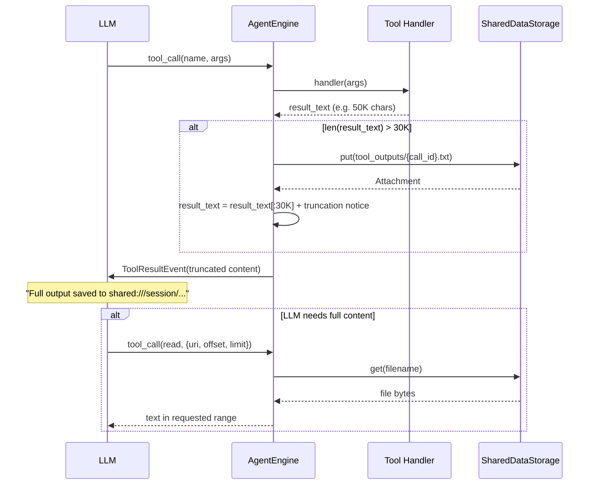

# Tool Output Truncation — Engine-level Output Limit and File Tools

## 1. Background

Currently, only shell tool truncates output to 10K characters (`builtin.py:_MAX_OUTPUT_CHARS = 10_000`). Output from other tools such as MCP is injected into LLM context without limit, causing token explosion risk.

**Goal**: Apply unified truncation to all tool outputs at engine level, and store full truncated content in session storage so LLM can retrieve it when needed.

---

## 2. Decisions

### 2.1 Threshold

| Layer | Max chars | Truncation direction | Note |
|--------|-------------|-----------------|------|
| Shell tool (`builtin.py`) | 10K | preserve tail (truncate head) | Error messages usually appear at end |
| Engine (all tools) | 30K | preserve head (truncate tail) | General tool output usually has more meaning at beginning |

- Shell 10K truncation applies first, and its result reaches engine.
- Engine 30K acts as safety net for non-shell tools (MCP, etc.).
- Engine threshold must be larger than shell so shell truncation logic remains meaningful.

### 2.2 Engine Truncation Logic

Apply in tool execution result handling part of `engine.py`.

```python
_ENGINE_MAX_OUTPUT_CHARS = 30_000

# handle result_text after tool execution
if len(result_text) > _ENGINE_MAX_OUTPUT_CHARS:
    # 1. Save full output to session storage
    full_output_filename = f"tool_outputs/{tool_call.id}.txt"
    await session_data_saver.put(
        workspace_id=workspace_id,
        session_id=sid,
        filename=full_output_filename,
        data=result_text.encode("utf-8"),
        media_type="text/plain",
    )
    full_output_uri = f"shared:///session/{full_output_filename}"

    # 2. Preserve head + truncation notice
    result_text = (
        result_text[:_ENGINE_MAX_OUTPUT_CHARS]
        + f"\n\n... (truncated, {len(result_text)} chars total)"
        + f"\nFull output saved to: {full_output_uri}"
        + "\nUse read tool to read the full output."
    )
```

### 2.3 Use SessionDataSaver

Existing `engine.py` already has `self._session_data_saver` injected, and stores LLM generated images as `shared:///session/` URI in `_save_images_to_session_data`. Use same pattern for storing tool output.

- `workspace_id` always exists (never None).
- Storage path: `shared:///session/tool_outputs/{tool_call_id}.txt`

---

## 3. New Tools

### 3.1 `read` — read session text file

Used by LLM to read text files from session storage. It is used to inspect full content of truncated tool output or read uploaded text files.

**Input:**

```python
class ReadTextInput(BaseModel):
    uri: str = Field(
        description="File URI to read (shared:///session/filename)",
    )
    offset: int = Field(
        default=0,
        description="Character offset to start reading from",
    )
    limit: int = Field(
        default=10_000,
        description="Maximum number of characters to read (default 10000)",
    )
```

**Behavior:**
1. Extract filename from `shared:///session/` URI.
2. Read file with `SharedDataStorage.get()`.
3. UTF-8 decode and slice `offset:offset+limit`.
4. Include total file size and returned range in content.

**Return example:**

```
Content of shared:///session/tool_outputs/call_abc123.txt (chars 0-10000 of 45000):

<file content>

... (10000 of 45000 chars shown. Use offset=10000 to read more.)
```

**Implementation location:** `engine/tools/read.py`

**Pattern:** same factory pattern as `read_image.py`

```python
def make_read_tool(
    *,
    session_storage: SharedDataStorage,
    workspace_id: str,
    session_id: str,
) -> Tool:
```

### 3.2 `delete` — delete session file

Used by LLM to clean up session files that are no longer needed.

**Input:**

```python
class DeleteFileInput(BaseModel):
    uri: str = Field(
        description="File URI to delete (shared:///session/filename)",
    )
```

**Behavior:**
1. Extract filename from `shared:///session/` URI.
2. Delete file with `SharedDataStorage.delete()`.
3. Return deletion result message.

**Return example:**

```
File deleted: shared:///session/tool_outputs/call_abc123.txt
```

**Implementation location:** `engine/tools/delete.py`

### 3.3 Additional file tools (added by Shared Storage implementation)

| Tool | Purpose | Note |
|------|------|------|
| `write` | create/overwrite file | supports 4 `shared:///` scopes |
| `edit` | string replacement (old_string → new_string) | same behavior as Claude Code Edit tool |
| `glob` | pattern-based file search | S3 ListObjects + pattern matching |
| `grep` | content search | iterate files under specified path |

See [Shared Storage & Skill System Design](./shared-storage-and-skills.md) for details.

---

## 4. System Prompt Changes

Add new tool guidance to existing `FILE_STORAGE_SYSTEM_PROMPT` (`read_image.py`).

```
### Reading Text Files

Use the `read` tool to read text files from session data:
- `shared:///session/tool_outputs/call_xxx.txt` — truncated tool output
- `shared:///session/uploads/data.csv` — uploaded text file

Supports offset/limit for reading large files in chunks.

### Deleting Files

Use the `delete` tool to remove files you no longer need
from session data.
```

---

## 5. Flow

### Tool Output Truncation Flow



---

## 6. Tool Registration

`read` and `delete` are built-in tools. Like `read_image` and `present_file`, engine worker directly creates and injects them into tool list. Do not add them to `ToolkitType` enum or `TOOLKIT_REGISTRY` because they are built-ins, not toolkits.
